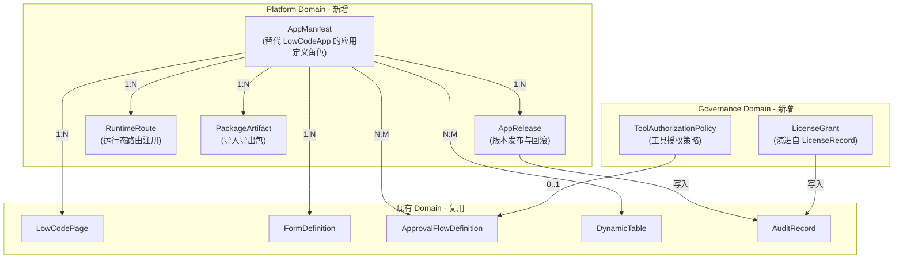
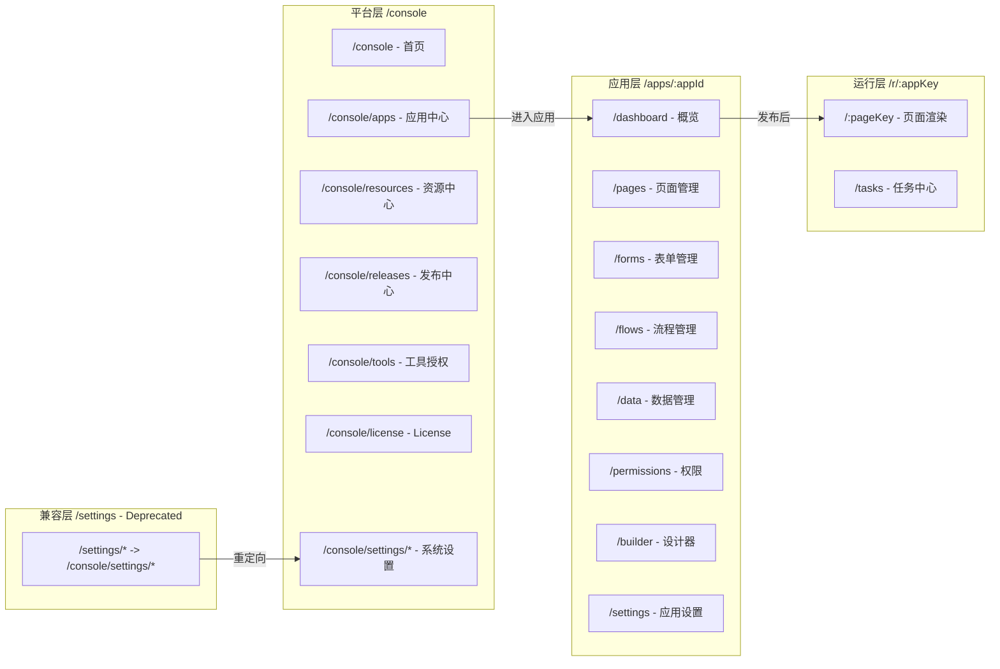

# SecurityPlatform 12 Sprint 产品化重构详细实施计划

## 现状基线分析

**已有资产（可复用/演进）：**

- `LowCodeApp` 实体（[src/backend/Atlas.Domain/LowCode/Entities/LowCodeApp.cs](src/backend/Atlas.Domain/LowCode/Entities/LowCodeApp.cs)）含 AppKey、Status、Version、ConfigJson，可作为 AppManifest 演进基础
- `LicenseRecord` 实体（[src/backend/Atlas.Domain/License/LicenseRecord.cs](src/backend/Atlas.Domain/License/LicenseRecord.cs)）含 LicenseId、Edition、Features/Limits JSON、机器码绑定，可作为 LicenseGrant 基础
- `PageRuntimeController`（[src/backend/Atlas.WebApi/Controllers/PageRuntimeController.cs](src/backend/Atlas.WebApi/Controllers/PageRuntimeController.cs)）已实现 `GET /api/v1/runtime/apps/{appKey}/pages/{pageKey}/schema`
- 审批流完整领域（25+ 实体）、工作流持久化、动态表 CRUD 已有完整基础
- 前端 `ConsoleLayout`、`AppWorkspaceLayout`、`PageRuntimeRenderer` 已有骨架

**需全新实现：**

- 6 个核心元模型实体：AppManifest、AppRelease、RuntimeRoute、PackageArtifact、LicenseGrant、ToolAuthorizationPolicy
- 4 组全新 API：平台面 `/platform/`*、应用面 `/app-manifests/`*、治理面 `/packages/*` + `/licenses/*` + `/tools/*`
- 前端运行态入口 `/r/:appKey/:pageKey`（独立于应用工作台）
- 导入导出引擎、离线 License 中心、Tools 授权中心

---

## Sprint 1：重构基线冻结与元模型定稿（2 周）

### 目标

冻结领域边界、统一命名策略、发布弃用清单、输出元模型 ER 图与接口命名规范。

### 任务清单

**T1.1 弃用清单梳理与标记**

- 扫描现有控制器，识别将被新 API 替代的旧端点
- 在 `docs/deprecation-list.md` 中记录：旧路由 -> 新路由映射、弃用窗口（6 个月）
- 旧控制器头部添加 `[Obsolete("Deprecated since Sprint 1, use xxx instead")]` 注释（不删代码）
- 涉及控制器：`LowCodeAppsController`（部分路由迁移到 `/app-manifests`）、`LicenseController`（迁移到 `/licenses`）

**T1.2 统一元模型领域设计**

- 在 `Atlas.Domain/Platform/Entities/` 下新建 6 个核心实体：

```
AppManifest       : TenantEntity  -- 应用清单（替代 LowCodeApp 的"应用定义"角色）
AppRelease        : TenantEntity  -- 应用发布记录（版本号、快照、回滚点）
RuntimeRoute      : TenantEntity  -- 运行态路由注册（appKey + pageKey -> schema 映射）
PackageArtifact   : TenantEntity  -- 导入导出包元数据
LicenseGrant      : EntityBase    -- 离线 License 授予记录（全局，不隔离租户）
ToolAuthorizationPolicy : TenantEntity  -- 工具授权策略
```

- 每个实体遵循现有 `TenantEntity` 基类约定，使用 Snowflake ID、强类型构造函数
- `FlowDefinition` 作为审批流与工作流的统一挂载点，在 `Atlas.Domain.Approval` 中扩展 `ApprovalFlowDefinition` 增加 `FlowKind` 枚举（Approval / Workflow / Hybrid）

**T1.3 接口命名与版本策略定稿**

- 更新 [docs/contracts.md](docs/contracts.md) 新增以下 API 分组占位（仅声明路由与入参/出参类型名，不含实现）：
  - 平台面：`GET /api/v1/platform/overview`、`GET /api/v1/platform/resources`、`GET /api/v1/platform/releases`
  - 应用面：`POST /api/v1/app-manifests`、`GET /api/v1/app-manifests/{id}`、`PUT /api/v1/app-manifests/{id}`、`POST /api/v1/app-manifests/{id}/releases`、`GET /api/v1/app-manifests/{id}/workspace/`*
  - 运行面：`GET /api/v1/runtime/apps/{appKey}/pages/{pageKey}`、`GET /api/v1/runtime/tasks`、`POST /api/v1/runtime/tasks/{id}/actions`
  - 治理面：`POST /api/v1/packages/export`、`POST /api/v1/packages/import`、`POST /api/v1/licenses/offline-request`、`POST /api/v1/licenses/import`、`GET /api/v1/licenses/validate`、`POST /api/v1/tools/authorization-policies`、`POST /api/v1/tools/simulate`、`GET /api/v1/tools/audit`

**T1.4 前端路由策略定稿**

- 确认三层入口映射：
  - `/console` -> `ConsoleLayout` + 平台面页面
  - `/apps/:appId/`* -> `AppWorkspaceLayout` + 应用面页面
  - `/r/:appKey/:pageKey` -> 独立 `RuntimeLayout`（新建）+ 运行态页面
  - `/settings/`* -> 标记 Deprecated，重定向到 `/console/settings/`*

**T1.5 更新主追踪文档**

- 更新 [docs/plan-产品化重构-12-sprint.md](docs/plan-产品化重构-12-sprint.md) Sprint 1 状态为 `[x]`
- 更新 [docs/plan-功能补齐总览.md](docs/plan-功能补齐总览.md) 对齐基线

### 交付物

- `docs/deprecation-list.md`（弃用清单）
- `docs/contracts.md`（新增 API 占位段）
- 6 个实体类文件（空壳 + 属性定义）
- 元模型 ER 关系说明（在 plan 文档中用文字描述）

---

## Sprint 2：后端骨架与数据库迁移（2 周）

### 目标

完成新增实体的数据库建表、仓储接口/实现、服务接口占位、控制器骨架。

### 任务清单

**T2.1 Domain 层实体完善**

- 在 `Atlas.Domain/Platform/Entities/` 完善 6 个实体的完整属性与领域方法：
  - `AppManifest`：AppKey、Name、Description、Category、Icon、Status(Draft/Published/Disabled/Archived)、Version、ConfigJson、DataSourceId、CreatedBy/At、UpdatedBy/At、PublishedBy/At
  - `AppRelease`：ManifestId、Version、ReleaseNote、SnapshotJson、RollbackPointId、Status(Pending/Released/RolledBack)、ReleasedBy/At
  - `RuntimeRoute`：ManifestId、AppKey、PageKey、SchemaVersion、IsActive、EnvironmentCode
  - `PackageArtifact`：ManifestId、PackageType(Structure/Data/Full)、FilePath、FileHash、Size、Status、ExportedBy/At、ImportedBy/At
  - `LicenseGrant`：演进自 LicenseRecord，新增 OfflineRequestToken、GrantMode(Online/Offline)、RenewalCount、AuditTrailJson
  - `ToolAuthorizationPolicy`：ToolId、ToolName、PolicyType(Allow/Deny/RequireApproval)、RateLimitQuota、ApprovalFlowId、ConditionJson、AuditEnabled

**T2.2 Application 层接口与 DTO**

- 在 `Atlas.Application/Platform/` 下创建：
  - `Abstractions/`：`IAppManifestQueryService`、`IAppManifestCommandService`、`IPlatformQueryService`、`IAppReleaseCommandService`、`IRuntimeRouteQueryService`
  - `Models/`：CreateRequest/UpdateRequest/Response/ListItem DTO（每个实体一套）
  - `Validators/`：FluentValidation 校验器
  - `Mappings/`：AutoMapper Profile
  - `Repositories/`：`IAppManifestRepository`、`IAppReleaseRepository`、`IRuntimeRouteRepository`
- 在 `Atlas.Application/Governance/` 下创建：
  - 治理面三组服务接口：`IPackageService`、`ILicenseGrantService`、`IToolAuthorizationService`
  - 对应 DTO 与校验器

**T2.3 Infrastructure 层仓储与服务空实现**

- 在 `Atlas.Infrastructure/Repositories/` 新增仓储实现（SqlSugar）
- 在 `Atlas.Infrastructure/Services/Platform/` 新增 QueryService/CommandService 空实现（方法体抛 `NotImplementedException` 或返回空）
- 在 `Atlas.Infrastructure/DependencyInjection/` 新增 `PlatformServiceRegistration.cs` 和 `GovernanceServiceRegistration.cs`
- 更新 [src/backend/Atlas.Infrastructure/ServiceCollectionExtensions.cs](src/backend/Atlas.Infrastructure/ServiceCollectionExtensions.cs) 调用新注册

**T2.4 数据库迁移**

- 在 [src/backend/Atlas.Infrastructure/Services/DatabaseInitializerHostedService.cs](src/backend/Atlas.Infrastructure/Services/DatabaseInitializerHostedService.cs) 的 `InitTables` 中追加新实体类型
- 确保 CodeFirst 建表覆盖所有新增实体

**T2.5 控制器骨架**

- `PlatformController`：`api/v1/platform/`*（3 个 GET 端点）
- `AppManifestController`：`api/v1/app-manifests/`*（CRUD + workspace 子路由）
- `AppReleaseController`：`api/v1/app-manifests/{id}/releases/`*
- `RuntimeRouteController`：`api/v1/runtime/`*（演进现有 `PageRuntimeController`）
- `PackageController`：`api/v1/packages/*`
- `LicenseGrantController`：`api/v1/licenses/*`
- `ToolAuthorizationController`：`api/v1/tools/*`
- 每个控制器只有路由骨架 + 返回 `ApiResponse<object>.Ok(null)` 占位

**T2.6 契约与测试文件**

- 更新 `docs/contracts.md` 填充完整的请求/响应 DTO 结构
- 在 `Bosch.http/` 下新增 `Platform.http`、`AppManifest.http`、`License.http`、`Package.http`、`Tools.http`

### 交付物

- `dotnet build` 0 错误 0 警告
- 所有新增端点可通过 `.http` 调通（返回占位响应）
- `docs/contracts.md` 包含所有新增 API 的完整契约

---

## Sprint 3：平台控制面 V1（2 周）

### 目标

实现平台首页、应用中心、资源中心的聚合查询 API 与前端页面。

### 任务清单

**T3.1 后端 - 平台聚合 API 实现**

- `GET /api/v1/platform/overview`：返回平台统计（应用数、发布数、活跃用户数、最近告警数、License 状态摘要）
- `GET /api/v1/platform/resources`：返回资源使用（数据源列表 + 健康状态、存储用量、数据库大小）
- `GET /api/v1/platform/releases`：分页返回最近发布记录（来自 AppRelease）
- 实现 `PlatformQueryService`：聚合多个已有 Repository 的查询（不在循环内查库，使用批量查询 + 字典聚合）

**T3.2 后端 - AppManifest CRUD 实现**

- `POST /api/v1/app-manifests`：创建应用清单（校验 AppKey 唯一性）
- `GET /api/v1/app-manifests`：分页查询（支持按状态、分类、关键字筛选）
- `GET /api/v1/app-manifests/{id}`：详情
- `PUT /api/v1/app-manifests/{id}`：更新
- `DELETE /api/v1/app-manifests/{id}`：软删除（归档）
- 写接口强制 `Idempotency-Key` + `X-CSRF-TOKEN`

**T3.3 前端 - 平台控制台首页重构**

- 重构 [src/frontend/Atlas.WebApp/src/pages/console/ConsolePage.vue](src/frontend/Atlas.WebApp/src/pages/console/ConsolePage.vue)：
  - 概览卡片区：应用总数、发布总数、活跃用户、告警数、License 到期提醒
  - 最近发布列表（时间线样式）
  - 快捷操作：创建应用、查看资源、管理发布
- 新增 API 函数：`getPlatformOverview()`、`getPlatformResources()`、`getPlatformReleases()`

**T3.4 前端 - 应用中心页面**

- 在 `/console/apps` 下展示应用清单列表（卡片 + 列表切换视图）
- 集成 `AppCreateWizard`（已有 [src/frontend/Atlas.WebApp/src/pages/console/components/AppCreateWizard.vue](src/frontend/Atlas.WebApp/src/pages/console/components/AppCreateWizard.vue)）
- 应用卡片展示：名称、图标、状态、最近发布版本、数据源

**T3.5 前端 - 资源中心页面**

- 新增 `/console/resources` 路由与页面
- 展示数据源健康状态、存储用量图表
- 复用 `TenantDataSourcesPage` 的数据源管理能力

### 验收标准

- 平台首页加载 < 2 秒，显示正确的聚合统计
- 可创建/编辑/归档应用清单
- 资源中心展示数据源状态
- `.http` 文件覆盖所有端点的成功/失败场景

---

## Sprint 4：发布中心与审计主链路（2 周）

### 目标

实现应用发布/回滚能力、发布事件审计、影响分析基础。

### 任务清单

**T4.1 后端 - 发布流程实现**

- `POST /api/v1/app-manifests/{id}/releases`：创建发布（生成版本快照 JSON、记录回滚点）
- `POST /api/v1/app-manifests/{id}/releases/{releaseId}/rollback`：回滚到指定版本
- `GET /api/v1/app-manifests/{id}/releases`：发布历史分页查询
- `GET /api/v1/app-manifests/{id}/releases/{releaseId}`：发布详情（含快照 diff 摘要）
- 发布时自动注册/更新 RuntimeRoute 记录

**T4.2 后端 - 审计集成**

- 发布、回滚操作自动写入 AuditRecord（通过 `IAuditWriter`）
- 审计记录包含：操作人、应用ID、版本号、操作类型、变更摘要
- `GET /api/v1/audit` 增加按 `ResourceType=AppRelease` 筛选支持

**T4.3 后端 - 影响分析基础**

- `GET /api/v1/app-manifests/{id}/impact-analysis`：返回发布影响范围（关联页面数、绑定动态表数、活跃运行态路由数）
- 聚合查询，不在循环内操作数据库

**T4.4 前端 - 发布中心页面**

- 新增 `/console/releases` 路由，展示全局发布时间线
- 应用详情页增加"发布"Tab，显示版本历史、支持一键发布与回滚
- 发布确认弹窗：展示影响分析结果（页面数、表数、路由数）

**T4.5 平台层 e2e 验证**

- 创建应用 -> 编辑 -> 发布 -> 查看审计 -> 回滚 -> 再次发布 完整链路
- 更新 `.http` 文件覆盖发布与回滚场景

### 验收标准

- 发布生成版本快照，回滚恢复到指定版本
- 审计日志正确记录发布/回滚事件
- 影响分析返回正确的关联资源数

---

## Sprint 5：应用工作台 V1（2 周）

### 目标

实现应用工作台的概览、页面/表单管理、流程入口、数据管理、权限入口。

### 任务清单

**T5.1 后端 - 应用域 API**

- `GET /api/v1/app-manifests/{id}/workspace/overview`：应用概览（页面数、表单数、绑定流程数、最近操作）
- `GET /api/v1/app-manifests/{id}/workspace/pages`：应用下的页面列表
- `GET /api/v1/app-manifests/{id}/workspace/forms`：应用下的表单列表
- `GET /api/v1/app-manifests/{id}/workspace/flows`：应用关联的审批流/工作流列表
- `GET /api/v1/app-manifests/{id}/workspace/data`：应用绑定的动态表列表
- `GET /api/v1/app-manifests/{id}/workspace/permissions`：应用级权限配置
- 这些 API 复用现有 LowCodePage、FormDefinition、ApprovalFlowDefinition、DynamicTable 的查询逻辑，但限定 ManifestId 范围

**T5.2 前端 - 应用工作台重构**

- 重构 [src/frontend/Atlas.WebApp/src/pages/apps/AppDashboardPage.vue](src/frontend/Atlas.WebApp/src/pages/apps/AppDashboardPage.vue)：
  - 概览卡片：页面数、表单数、流程数、数据表数
  - 最近操作时间线
  - 快捷入口：设计器、发布、设置
- 在 `AppWorkspaceLayout` 侧栏增加：概览、页面、表单、流程、数据、权限 导航项
- 每个 Tab 对应独立路由：`/apps/:appId/pages`、`/apps/:appId/forms`、`/apps/:appId/flows`、`/apps/:appId/data`、`/apps/:appId/permissions`

**T5.3 前端 - 页面/表单管理集成**

- `/apps/:appId/pages`：复用现有 LowCode 页面列表逻辑，限定当前应用范围
- `/apps/:appId/forms`：复用表单列表，限定当前应用
- 支持在应用内创建/编辑/删除页面和表单

### 验收标准

- 应用工作台 6 个 Tab 全部可访问
- 概览统计正确反映应用内资源数量
- 页面/表单的 CRUD 限定在当前应用范围内

---

## Sprint 6：统一设计器 V1（2 周）

### 目标

页面/表单/流程设计器统一元数据存储，模板体系最小可用版本。

### 任务清单

**T6.1 后端 - 统一元数据存储**

- 页面 Schema（LowCodePageVersion）、表单 Schema（FormDefinitionVersion）、流程定义（ApprovalFlowDefinitionVersion）统一采用 JSON Schema 存储
- 新增 `GET /api/v1/app-manifests/{id}/workspace/designers/{type}/{itemId}`：返回设计器初始化数据
- 新增 `PUT /api/v1/app-manifests/{id}/workspace/designers/{type}/{itemId}`：保存设计器数据
- type 枚举：page / form / flow

**T6.2 前端 - 设计器入口统一**

- 从应用工作台点击"编辑"进入对应设计器（页面/表单/流程）
- 设计器共享：保存/发布/预览 工具栏
- 页面设计器复用现有 `AppBuilderPage`
- 表单设计器复用现有 `FormDesignerPage`
- 流程设计器复用现有 `ApprovalDesignerPage` / `WorkflowDesignerPage`

**T6.3 模板体系 MVP**

- `GET /api/v1/templates`：按类型（页面/表单/流程）查询可用模板
- `POST /api/v1/templates/{id}/instantiate`：从模板创建新页面/表单/流程
- 前端模板选择弹窗：在创建页面/表单时可选"从模板创建"
- 复用现有 `ComponentTemplate` 实体和 `TemplatesController`

### 验收标准

- 从应用工作台可打开三种设计器
- 设计器保存数据正确写入对应版本表
- 可从模板创建新页面/表单

---

## Sprint 7：运行态 V1（2 周）

### 目标

实现 `/r/:appKey/:pageKey` 独立运行态入口、任务中心、审批中心。

### 任务清单

**T7.1 后端 - 运行态 API 增强**

- 演进 `PageRuntimeController`，新增：
  - `GET /api/v1/runtime/apps/{appKey}/pages/{pageKey}`：返回完整运行态页面（Schema + 元信息 + 权限）
  - `GET /api/v1/runtime/tasks`：当前用户的待办任务列表（聚合审批任务 + 工作流任务）
  - `POST /api/v1/runtime/tasks/{id}/actions`：执行任务动作（审批/拒绝/转办等）
  - `GET /api/v1/runtime/apps/{appKey}/menu`：运行态应用菜单（已发布的页面列表）
- RuntimeRoute 查询：根据 appKey + pageKey 查找活跃路由，返回对应 Schema

**T7.2 前端 - 独立运行态入口**

- 新增 `RuntimeLayout.vue`：轻量化布局（无平台侧栏，仅应用级导航）
- 新增路由 `/r/:appKey/:pageKey` -> `RuntimeLayout` + `PageRuntimeRenderer`
- 运行态顶栏：应用名、用户头像、通知、退出
- 运行态侧栏：应用内已发布页面列表（从 runtime/apps/{appKey}/menu 获取）

**T7.3 前端 - 任务中心**

- 在运行态布局增加"我的任务"入口
- 任务列表：待办（审批 + 工作流）、已办、我发起的
- 任务详情：内嵌审批表单，支持审批/拒绝/转办操作
- 复用现有 `ApprovalInboxPage` / `ApprovalDonePage` 的逻辑，但适配运行态布局

**T7.4 业务用户访问闭环验证**

- 创建应用 -> 添加页面 -> 发布 -> 通过 `/r/:appKey/:pageKey` 访问 -> 提交数据 -> 触发审批 -> 完成闭环
- 更新 `.http` 覆盖运行态全部端点

### 验收标准

- 普通用户可通过 `/r/:appKey/:pageKey` 直接访问已发布页面
- 运行态内可查看并处理待办任务
- 提交数据可触发审批流

---

## Sprint 8：流程闭环强化（2 周）

### 目标

审批流与工作流统一编排、状态回写、失败补偿、可观测性。

### 任务清单

**T8.1 后端 - FlowDefinition 统一编排边界**

- 扩展 `ApprovalFlowDefinition` 增加 `FlowKind` 字段（Approval / Workflow / Hybrid）
- 当 FlowKind=Hybrid 时，支持审批节点与工作流步骤混合编排
- 统一 `GET /api/v1/app-manifests/{id}/workspace/flows` 返回所有类型流程

**T8.2 后端 - 状态回写强化**

- 审批/工作流完成后，自动回写源记录状态（动态表记录的审批状态字段）
- 回写失败时写入 `ApprovalWritebackFailure`，支持重试
- 复用现有 `ApprovalWorkflowBridgeEventHandler`（[src/backend/Atlas.Infrastructure/Events/Approval/ApprovalWorkflowBridgeEventHandler.cs](src/backend/Atlas.Infrastructure/Events/Approval/ApprovalWorkflowBridgeEventHandler.cs)）

**T8.3 后端 - 失败补偿机制**

- 定时任务扫描 `ApprovalWritebackFailure` 中未成功的记录，最多重试 3 次
- 超过重试次数标记为 PermanentFailure，发送通知给管理员
- 补偿日志写入审计

**T8.4 后端 - 流程可观测性**

- `GET /api/v1/visualization/metrics`：流程执行统计（平均耗时、通过率、超时率）
- `GET /api/v1/visualization/instances/{id}`：实例执行轨迹（含每个节点耗时、处理人、状态）
- 复用现有 `VisualizationController`

**T8.5 前端 - 流程监控面板**

- 在应用工作台"流程"Tab 增加监控视图
- 展示流程执行统计图表
- 回写失败列表 + 手动重试按钮

### 验收标准

- 混合流程（审批 + 工作流步骤）可正确执行
- 状态回写失败自动重试，3 次后标记永久失败
- 流程可观测性面板展示正确的统计数据

---

## Sprint 9：应用导入导出 V1（2 周）

### 目标

实现三种导出模式（结构包/数据包/完整包）、冲突检测与回滚。

### 任务清单

**T9.1 后端 - 导出引擎**

- `POST /api/v1/packages/export`：导出应用包
  - `PackageType=Structure`：仅导出 Manifest + 页面 Schema + 表单 Schema + 流程定义 + 动态表结构
  - `PackageType=Data`：导出结构 + 动态表数据（不含用户数据）
  - `PackageType=Full`：导出全部（含版本历史、发布记录）
- 包格式：ZIP 内含 `manifest.json`（元数据）+ 各资源 JSON 文件
- 导出记录写入 `PackageArtifact`，含文件哈希校验

**T9.2 后端 - 导入引擎**

- `POST /api/v1/packages/import`：上传并导入包
- 导入前执行冲突检测：AppKey 冲突、动态表名冲突、流程定义 ID 冲突
- 冲突策略：Skip / Overwrite / Rename（由请求参数指定）
- 导入失败自动回滚（事务保护）
- 导入记录写入 `PackageArtifact` + 审计日志

**T9.3 后端 - 冲突检测 API**

- `POST /api/v1/packages/analyze`：上传包但不导入，仅返回冲突分析结果
- 返回：冲突项列表、建议处理策略、导入预估影响

**T9.4 前端 - 导入导出 UI**

- 应用列表页增加"导出"按钮（选择导出模式）
- 平台设置增加"导入应用"入口
- 导入流程：上传 -> 冲突分析展示 -> 选择策略 -> 确认导入 -> 结果展示

### 验收标准

- 可导出三种模式的应用包
- 导入时正确检测并处理冲突
- 导入失败时数据库状态不变（事务回滚）
- 包可在不同环境间迁移

---

## Sprint 10：离线 License 中心 V1（2 周）

### 目标

实现离线 License 申请/签发/导入/校验/续期/审计完整链路。

### 任务清单

**T10.1 后端 - License API**

- `POST /api/v1/licenses/offline-request`：生成离线申请令牌（含机器指纹 + 租户信息）
- `POST /api/v1/licenses/import`：导入签发的 License 文件
- `GET /api/v1/licenses/validate`：校验当前 License 状态
- `POST /api/v1/licenses/renew`：续期（在线或离线）
- `GET /api/v1/licenses/audit`：License 操作审计日志
- 演进现有 `LicenseRecord` -> `LicenseGrant`，保持向后兼容

**T10.2 后端 - License 校验引擎**

- 启动时自动校验 License 有效性
- 过期前 30 天发出警告通知
- 时间回拨检测（MaxObservedUtc）
- 功能开关通过 `FeaturesJson` 控制

**T10.3 前端 - License 管理页面**

- 重构 [src/frontend/Atlas.WebApp/src/pages/LicensePage.vue](src/frontend/Atlas.WebApp/src/pages/LicensePage.vue)：
  - License 状态卡片：版本、到期时间、剩余天数、功能列表
  - 离线申请：生成申请文件下载
  - 导入 License：上传文件并验证
  - 操作历史：激活/续期/过期事件时间线

### 验收标准

- 可生成离线申请令牌并下载
- 可导入外部签发的 License 文件并激活
- License 过期后系统给出明确提示（不阻断，仅降级）
- 所有 License 操作有审计记录

---

## Sprint 11：Tools Authorization Center V1（2 周）

### 目标

实现工具授权策略目录、策略矩阵、审批要求、限流配额、策略模拟与审计。

### 任务清单

**T11.1 后端 - 工具目录与策略 CRUD**

- `GET /api/v1/tools/authorization-policies`：策略列表（分页 + 筛选）
- `POST /api/v1/tools/authorization-policies`：创建策略
- `PUT /api/v1/tools/authorization-policies/{id}`：更新策略
- `DELETE /api/v1/tools/authorization-policies/{id}`：删除策略
- 策略属性：ToolName、PolicyType(Allow/Deny/RequireApproval)、RateLimitQuota、ApprovalFlowId、ConditionJson

**T11.2 后端 - 策略执行引擎**

- 中间件/Filter：拦截工具调用请求，匹配 ToolAuthorizationPolicy
- 匹配策略后执行：Allow（放行）、Deny（拒绝）、RequireApproval（触发审批流）
- 限流：基于 RateLimitQuota 的滑动窗口限流
- 执行日志写入审计

**T11.3 后端 - 策略模拟**

- `POST /api/v1/tools/simulate`：模拟某个工具调用在当前策略下的执行结果
- 入参：ToolName、UserId、Context
- 出参：匹配的策略、执行结果（Allow/Deny/RequireApproval）、限流剩余额度

**T11.4 前端 - 工具授权中心页面**

- 新增 `/console/tools` 路由
- 策略矩阵视图：工具 x 角色 矩阵，显示 Allow/Deny/RequireApproval
- 策略编辑：支持条件表达式配置
- 策略模拟：输入工具名和用户，展示模拟结果
- 审计日志 Tab：展示工具调用审计

### 验收标准

- 可创建/编辑/删除工具授权策略
- 策略模拟返回正确的匹配结果
- 限流配额生效
- 所有工具调用有审计记录

---

## Sprint 12：全链路硬化与发布门禁（2 周）

### 目标

Gate-R1/R2 验收、性能与安全压测、弃用公告、上线文档。

### 任务清单

**T12.1 安全硬化**

- 全面检查所有新增写接口的 Idempotency-Key + X-CSRF-TOKEN 强制校验
- 跨租户访问防护：所有新增 API 的租户隔离验证
- 敏感字段脱敏：License 密钥、数据源连接串等在 API 响应中脱敏
- 输入校验：FluentValidation 覆盖所有新增 DTO
- XSS 防护：所有字符串输入经过 HTML 编码

**T12.2 性能验证**

- 平台首页聚合查询 < 2 秒（冷启动 < 5 秒）
- 运行态页面加载 < 1 秒
- 导入导出：100 页应用包 < 30 秒
- 并发 50 用户同时访问运行态无错误

**T12.3 Gate-R1 GUI 手动测试**

- 完整链路测试（必须手工执行并留痕）：
  1. 平台首页查看资源与发布信息
  2. 创建应用 -> 添加页面 -> 配置表单 -> 绑定流程
  3. 发布应用 -> 查看发布历史
  4. 运行态 `/r/:appKey/:pageKey` 访问并提交业务数据
  5. 任务领取/处理/回写状态确认
  6. 导出应用包 -> 在新租户导入 -> 验证完整性
  7. License 离线申请 -> 导入 -> 验证
  8. 工具策略创建 -> 模拟 -> 审计查看
  9. 审计日志追踪全流程事件
- 输出：手测报告（测试人、时间、环境、版本、场景清单与结果、缺陷列表、关键截图）

**T12.4 Gate-R2 交付闭环**

- `docs/contracts.md` 完整覆盖所有新增 API
- 所有 `.http` 文件覆盖成功/失败/幂等/跨租户场景
- 弃用公告：发布旧接口弃用通知（6 个月窗口）
- 上线文档：部署手册、配置说明、运维手册
- 运维手册：备份恢复、License 管理、故障排查

**T12.5 文档收尾**

- 更新 [docs/plan-产品化重构-12-sprint.md](docs/plan-产品化重构-12-sprint.md) 所有 Sprint 状态为 `[x]`
- 更新 [docs/plan-功能补齐总览.md](docs/plan-功能补齐总览.md) 对齐最终状态
- 更新 [AGENTS.md](AGENTS.md) 反映新增的架构变更

---

## 新增实体与现有实体的关系




## 前端路由架构




## 关键约束与风险

- **数据兼容**：AppManifest 与现有 LowCodeApp 需要数据迁移策略。建议 Sprint 2 中编写一次性迁移脚本，将现有 LowCodeApp 数据映射到 AppManifest（保留原表不删）
- **旧接口并行**：Sprint 1 标记弃用后，旧接口继续可用 6 个月。新旧接口操作同一数据时需保证一致性
- **性能风险**：平台首页聚合查询涉及多表 JOIN，需在 Sprint 3 实现时注意索引优化和缓存策略
- **License 安全**：离线 License 的签名与校验密钥管理需在 Sprint 10 详细设计（不在代码中硬编码）
- **等保合规**：所有新增 API 必须满足等保 2.0 要求（审计日志、访问控制、数据保护）

