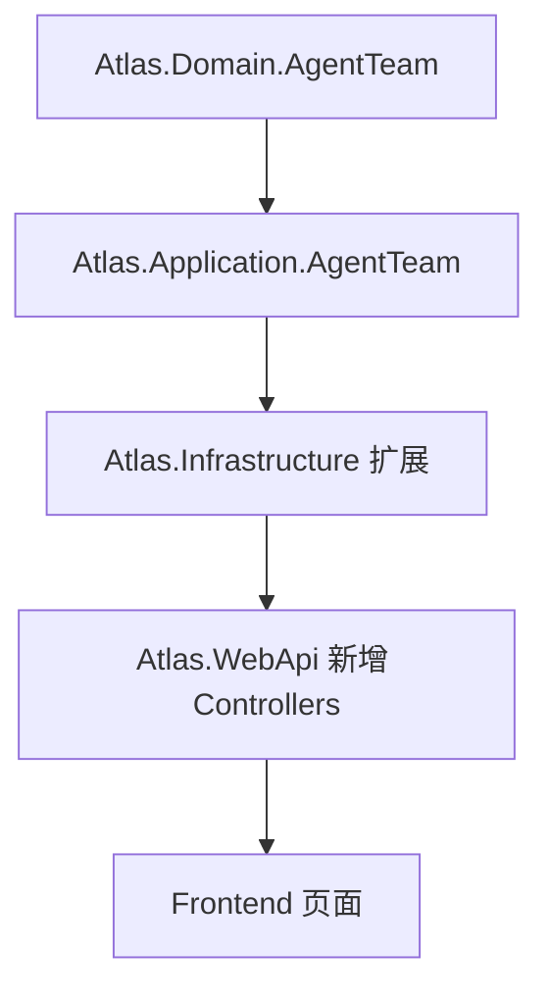

# Agent 团队 / 子代理协同系统实施计划

## 背景与现状

项目已有以下 Agent 基础，需在此之上扩展：

- `[TeamAgentsController.cs](src/backend/Atlas.WebApi/Controllers/TeamAgentsController.cs)` — 单 Agent 管理+聊天
- `[MultiAgentOrchestrationListPage.vue](src/frontend/Atlas.WebApp/src/pages/ai/multi-agent/MultiAgentOrchestrationListPage.vue)` — 编排列表页（已有壳子）
- `[MultiAgentOrchestrationDetailPage.vue](src/frontend/Atlas.WebApp/src/pages/ai/multi-agent/MultiAgentOrchestrationDetailPage.vue)` — 编排详情页（已有壳子）

本次构建新的 `AgentTeam` 有界上下文，与已有 `TeamAgent` 区分：

- **已有 TeamAgent** = 单个可对话 Agent（含子代理能力）
- **新建 AgentTeam** = 主代理 + 多子代理 + 编排 + 执行引擎 + 版本治理 的完整团队系统

## 分层架构规划

新增后端项目：

- `Atlas.Domain.AgentTeam` — 实体（AgentTeam、SubAgent、OrchestrationNode、TeamVersion、ExecutionRun、NodeRun）
- `Atlas.Application.AgentTeam` — DTO、Repository 接口、Service 接口、Validator、AutoMapper Profile
- `Atlas.Infrastructure` 中扩展 — 仓储实现、执行引擎服务

新增 Controllers（`api/v1/`）：

- `AgentTeamsController` — 团队 CRUD + 版本发布
- `SubAgentsController` — 子代理配置
- `OrchestrationNodesController` — 节点编排
- `AgentTeamRunsController` — 执行与日志
- `AgentTeamDebugController` — 调试

## MVP Case 分解（Phase 1，小步闭环）

每个 Case 均可独立构建并验证。

### 后端：领域模型与 API

**Case-01** — 领域实体定义（`Atlas.Domain.AgentTeam`）

- `AgentTeam`、`SubAgent`、`OrchestrationNode` 继承 `TenantEntity`
- `TeamVersion`、`ExecutionRun`、`NodeRun` 实体
- 状态枚举：`TeamStatus`、`RunStatus`、`NodeRunStatus`

**Case-02** — Application 层 DTO + Repository 接口（`Atlas.Application.AgentTeam`）

- CRUD Request/Response DTO
- `IAgentTeamRepository`、`ISubAgentRepository`、`IOrchestrationNodeRepository`
- `IAgentTeamQueryService`、`IAgentTeamCommandService`
- FluentValidation Validators、AutoMapper Profile

**Case-03** — Infrastructure 仓储实现 + DI 注册

- SqlSugar 实现 3 个 Repository
- 注册到 `ServiceCollectionExtensions`
- SQLite Schema 初始化

**Case-04** — 团队管理 API（`AgentTeamsController`）

- `GET /api/v1/agent-teams` — 分页列表（含筛选）
- `POST /api/v1/agent-teams` — 创建
- `GET /api/v1/agent-teams/{id}` — 详情
- `PUT /api/v1/agent-teams/{id}` — 更新
- `DELETE /api/v1/agent-teams/{id}` — 删除（仅 Draft）
- `POST /api/v1/agent-teams/{id}/duplicate` — 复制
- `POST /api/v1/agent-teams/{id}/disable` / `enable` — 停用/启用

**Case-05** — 子代理管理 API（`SubAgentsController`）

- CRUD：`/api/v1/agent-teams/{teamId}/sub-agents`
- Prompt/模型/工具/知识/Schema/策略配置字段全量存储

**Case-06** — 编排节点 API（`OrchestrationNodesController`）

- 节点 CRUD：`/api/v1/agent-teams/{teamId}/nodes`
- 校验服务：循环依赖检测、孤立节点、节点可达性检测

**Case-07** — 版本发布 API（`AgentTeamsController` 扩展）

- `POST /api/v1/agent-teams/{id}/publish` — 发布前校验 + 版本快照
- `GET /api/v1/agent-teams/{id}/versions` — 版本列表
- `POST /api/v1/agent-teams/{id}/rollback/{versionId}` — 回滚

**Case-08** — 执行引擎与运行 API（`AgentTeamRunsController`）

- `POST /api/v1/agent-team-runs` — 创建运行实例（状态机入口）
- `GET /api/v1/agent-team-runs/{runId}` — 执行详情
- `GET /api/v1/agent-team-runs/{runId}/nodes` — 节点运行状态列表
- `POST /api/v1/agent-team-runs/{runId}/cancel` — 取消
- 执行状态机：Pending → Planning → Dispatching → Running → Completed/Failed

**Case-09** — 人工介入 API

- `GET /api/v1/agent-team-runs/{runId}/interventions` — 等待介入列表
- `POST /api/v1/agent-team-runs/{runId}/nodes/{nodeRunId}/intervene` — 介入操作（confirm/skip/retry/override）

**Case-10** — 调试 API（`AgentTeamDebugController`）

- `POST /api/v1/agent-teams/{id}/debug` — 全链路调试（草稿版本）
- `POST /api/v1/agent-teams/{id}/sub-agents/{agentId}/debug` — 单子代理调试

**Case-11** — `.http` 测试文件

- `AgentTeams.http`、`SubAgents.http`、`AgentTeamRuns.http` 补全测试用例

**Case-12** — `docs/contracts.md` 新增章节

- 补充 AgentTeam 相关 API 契约与数据模型文档

### 前端：页面实现

**Case-13** — 团队列表页（改造 `MultiAgentOrchestrationListPage.vue`）

- 搜索筛选栏、表格列表、状态标签、快捷操作
- 空状态、加载骨架、无权限提示

**Case-14** — 团队编辑工作台（改造 `MultiAgentOrchestrationDetailPage.vue`）

- 顶部操作栏（保存/校验/调试/发布）
- 左侧结构树（子代理目录 + 节点列表）
- 中间编排视图（基础模式：步骤列表；高级模式：DAG 预览）
- 右侧配置面板（选中节点/子代理配置）

**Case-15** — 子代理配置抽屉/页面（新建 `SubAgentConfigDrawer.vue`）

- 基础信息、角色目标、Prompt、模型选择、工具权限、知识源、Schema、策略
- 基础模式/高级模式切换

**Case-16** — 调试页（新建 `AgentTeamDebugPage.vue`）

- 调试输入区、输出区、节点日志区、诊断区
- 单子代理 vs 全链路切换

**Case-17** — 执行运行页 + 执行详情页（新建 `AgentTeamRunPage.vue`、`AgentTeamRunDetailPage.vue`）

- 运行状态头部、执行图（节点状态列表）
- 等待人工突出显示 + 介入操作面板
- 结果区 + 证据链区

**Case-18** — 版本与发布页（新建 `AgentTeamVersionPage.vue`）

- 版本列表、差异对比（JSON diff）、发布/回滚操作

**Case-19** — 路由 + 菜单注册

- 在 `router/index.ts` 注册以上新页面路由
- 在菜单系统注册 Agent 团队入口

**Case-20** — `types/api.ts` + `services/agent-team.ts` 类型与 API 客户端

- 前端类型定义与 API client 方法与后端契约对齐

## Phase 2 规划（MVP 之后）

- 更多节点类型（评分、仲裁、批处理）
- Prompt/模型版本对比与评测
- 回归测试集与质量评分
- 完整成本治理告警
- 模板中心与资产复用
- API/Webhook 触发增强

## 关键技术决策

- **执行引擎**：MVP 阶段使用 Hangfire 后台作业 + 内存状态机；状态快照持久化到 SQLite
- **状态机**：采用简单枚举 + 服务层状态转换（不引入第三方状态机库）
- **编排定义存储**：JSON 序列化后存入 `OrchestrationDefinition` 字段
- **并行执行**：MVP 支持 `executionMode=Parallel` 的节点组，由 Hangfire 并行任务实现
- **与已有 TeamAgent 的关系**：AgentTeam 的子代理可以绑定（引用）已有 `TeamAgent` 实体作为执行主体

