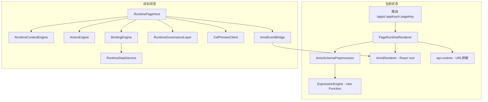

# app-web Mendix 化运行时内核改造蓝图

## 0. 现状确认与差距分析

### 已有基础

**后端（可直接复用）：**
- `ExpressionContext`（[Atlas.Core/Expressions/ExpressionContext.cs](src/backend/Atlas.Core/Expressions/ExpressionContext.cs)）：已支持 Global/Tenant/App/Page/User/Record 六层变量域，含 `TryGetVariable` 分层查找
- `CelExpressionEngine`（[Atlas.Infrastructure/Expressions/CelExpressionEngine.cs](src/backend/Atlas.Infrastructure/Expressions/CelExpressionEngine.cs)）：已实现 validate/evaluate，支持 `form.*`/`record.*`/`user.*`/`page.*`/`app.*`/`tenant.*`/`global.*` 前缀解析
- `ExpressionsController`（[ExpressionsController.cs](src/backend/Atlas.PlatformHost/Controllers/ExpressionsController.cs)）：`POST /api/v1/expressions/validate` + `POST /api/v1/expressions/evaluate`
- `PageRuntimeController`（[PageRuntimeController.cs](src/backend/Atlas.AppHost/Controllers/PageRuntimeController.cs)）：schema/records CRUD，已接入 `RuntimeRoute` 校验 + `AppContextAccessor` 作用域
- `AppRelease` 领域实体 + `AppReleaseCommandService` + `ReleaseCenterV2Controller`：发布版本治理链路已通
- `RuntimeContextsV2Controller` / `RuntimeExecutionsV2Controller`：运行态观测与控制 API 已有

**前端（需重构/收编）：**
- [PageRuntimeRenderer.vue](src/frontend/apps/app-web/src/pages/runtime/PageRuntimeRenderer.vue)（102 行）：schema 拉取 + menu 拉取 + `applyRuntimeApis` 自动注入 + AmisRenderer 渲染
- [amis-renderer.vue](src/frontend/apps/app-web/src/components/amis/amis-renderer.vue)（123 行）：React root 挂载 + `AmisSchemaPreprocessor.process` 预处理 + schema/data watch
- [ExpressionEngine.ts](src/frontend/apps/app-web/src/utils/ExpressionEngine.ts)（68 行）：`new Function` + `with` 沙箱 + mustache 替换
- [AmisSchemaPreprocessor.ts](src/frontend/apps/app-web/src/utils/AmisSchemaPreprocessor.ts)（35 行）：递归 schema + `$vars` 合并 + `parseMustache`
- [api-runtime.ts](src/frontend/apps/app-web/src/services/api-runtime.ts)（53 行）：`getRuntimeMenu`/`buildRuntimeRecordsUrl`/`getRuntimePageSchema`
- [api-lowcode-runtime.ts](src/frontend/apps/app-web/src/services/api-lowcode-runtime.ts)（49 行）：平台侧 schema + app 查询
- [amis-env.ts](src/frontend/apps/app-web/src/amis/amis-env.ts)：AMIS 环境配置

### 关键差距



| 维度 | 文档要求 | 当前实现 | 差距 |
|------|----------|----------|------|
| 表达式 | CEL 统一，禁止旁路执行器 | 前端 `new Function` 沙箱 | **P0 冲突** |
| 运行上下文 | 6 层变量域 + 优先级 | 无 RuntimeContextStore | **缺失** |
| 动作引擎 | 平台级行为编排 | 依赖 AMIS 内置 onEvent | **缺失** |
| 数据绑定 | 模型驱动 binding | 字符串 URL 注入 | **初级** |
| 运行治理 | releaseId/executionId/审计 | 无版本号/无执行追踪 | **缺失** |
| 路由 | 公共态 `/r/:appKey/:pageKey` | 仅工作台态 `/apps/:appKey/r/:pageKey` | **不完整** |

---

## 1. 架构决策确认（6 项）

以下 6 项决策与你的蓝图完全对齐，我在实施中会严格遵守：

- **D1**: AMIS 为唯一页面 DSL，不新增第三套
- **D2**: 前端停止扩张 JS 表达式，改 `CelPreviewClient` 统一走后端 CEL
- **D3**: 双路由并行（公共态 `/r/:appKey/:pageKey` + 工作台态 `/apps/:appKey/r/:pageKey`），共享同一 `RuntimePageHost`
- **D4**: 统一动作协议 `RuntimeAction` + `ActionExecutor`
- **D5**: 数据绑定从 URL 注入升级为 `BindingResolver` + `RuntimeDataService`
- **D6**: 运行态显式带 releaseId / releaseVersion / runtimeExecutionId / traceId

---

## 2. 目标目录结构

```
src/frontend/apps/app-web/src/runtime/
  bootstrap/
    bootstrap-runtime.ts          # 运行时启动流程编排
    runtime-manifest-loader.ts    # 拉取已发布 manifest

  context/
    runtime-context-types.ts      # RuntimeContext 接口定义
    runtime-context-store.ts      # Pinia store，管理 6 层变量域
    runtime-context-provider.ts   # Vue provide/inject 封装

  expressions/
    cel-preview-client.ts         # 调后端 validate/evaluate
    expression-types.ts           # 表达式相关类型

  actions/
    action-types.ts               # RuntimeAction 联合类型
    action-executor.ts            # 统一动作执行器
    action-registry.ts            # 动作处理器注册表
    action-result.ts              # 执行结果类型

  bindings/
    binding-types.ts              # ListBinding/RecordBinding/FormBinding
    binding-resolver.ts           # schema 中 binding 声明 → API 调用
    runtime-data-service.ts       # 统一数据访问层
    runtime-query-builder.ts      # 查询参数构建

  lifecycle/
    lifecycle-types.ts            # onPageInit/beforeSubmit/afterSubmit
    page-lifecycle-runner.ts      # 生命周期钩子执行

  release/
    runtime-release-types.ts      # RuntimeManifest/RuntimeExecution 类型
    runtime-execution-tracker.ts  # executionId 创建/上报/追踪

  audit/
    runtime-audit-reporter.ts     # 审计事件采集与上报

  adapters/
    amis-action-adapter.ts        # AMIS onEvent → RuntimeAction 转换
    amis-binding-adapter.ts       # binding 声明 → AMIS api/initApi 注入
    amis-event-bridge.ts          # AMIS 事件桥接层

  hosts/
    RuntimePageHost.vue           # 统一页面运行宿主
    RuntimeDialogHost.vue         # 弹窗运行宿主（Phase 2）
```

---

## 3. Phase 1 — 运行时内核骨架（Week 1-2）

### 3.1 RuntimeContextStore（Week 1, Day 1-2）

新建 `runtime/context/runtime-context-types.ts`，定义 `RuntimeContext` 接口，严格对齐 [platform-unified-schema-and-expression.md](docs/platform-unified-schema-and-expression.md) 的 6 层变量域：

```typescript
export interface RuntimeContext {
  tenant: { id: string; code?: string };
  app: { id?: string; appKey: string; name?: string; releaseId?: string; releaseVersion?: number };
  page: { id?: string; pageKey: string; title?: string; pageType?: string; mode?: 'view' | 'edit' | 'create' };
  user: { id?: string; name?: string; roles: string[]; permissions: string[] };
  route: { path: string; params: Record<string, string>; query: Record<string, string> };
  project?: { id?: string; code?: string };
  record?: { id?: string; data?: Record<string, unknown> };
  selection?: Array<Record<string, unknown>>;
  global: Record<string, unknown>;
  env: { traceId?: string; runtimeExecutionId?: string; releaseId?: string; releaseVersion?: number };
}
```

新建 `runtime/context/runtime-context-store.ts`，用 Pinia `defineStore` 管理上下文，对外暴露：
- `initContext(manifest, userInfo, routeInfo)` — 从 manifest 初始化
- `setRecord(data)` / `setSelection(rows)` — 运行中更新
- `getExpressionVariables()` — 返回扁平化变量字典供 CEL evaluate 使用

### 3.2 CelPreviewClient（Week 1, Day 2-3）

新建 `runtime/expressions/cel-preview-client.ts`：
- `validateExpression(expr: string)` → `POST /api/v1/expressions/validate`
- `evaluateExpression(expr: string, context: RuntimeContext)` → `POST /api/v1/expressions/evaluate`，将 RuntimeContext 映射为后端 `ExpressionEvaluateRequest` 的 `Record/User/Page` 字典

**注意**：后端 `ExpressionsController.Evaluate` 目前只注入 Record/User/Page，需**同步扩展**后端入口以支持 App/Tenant/Global（`ExpressionContext` 已支持，只是控制器未传）。

标记 `ExpressionEngine.ts` 为 `@deprecated`，在 `AmisSchemaPreprocessor` 中保留 mustache 替换能力但内部改走 `CelPreviewClient`（对无网络场景做本地 fallback 仅用于开发预览）。

### 3.3 RuntimePageHost + Bootstrap（Week 1, Day 3-5）

新建 `runtime/hosts/RuntimePageHost.vue`，替代 `PageRuntimeRenderer.vue`。职责拆分：

- `runtime/bootstrap/bootstrap-runtime.ts`：
  - 解析路由参数 (appKey, pageKey)
  - 调 `getRuntimeManifest()` 获取已发布 manifest
  - 初始化 `RuntimeContextStore`
  - 创建 `runtimeExecutionId`（雪花 ID 或 UUID）
  - 注册 `ActionRegistry` / `BindingResolver`
  - 返回 `RuntimeBootstrapResult`

- `RuntimePageHost.vue`：
  - 调用 `bootstrapRuntime` 获取上下文
  - 将 schema 交给 `AmisSchemaPreprocessor`（仅做规范化 + binding 注入，不执行表达式）
  - 渲染 `AmisRenderer`
  - 通过 `AmisEventBridge` 监听事件

**路由改造**：在 [router/index.ts](src/frontend/apps/app-web/src/router/index.ts) 中：
- 工作台路由 `r/:pageKey` 指向 `RuntimePageHost.vue`
- 新增公共态路由 `/r/:appKey/:pageKey` 指向同一组件

### 3.4 AmisEventBridge + ActionExecutor（Week 2, Day 1-3）

新建 `runtime/adapters/amis-event-bridge.ts`：
- 拦截 AMIS 的 `onEvent` / `action` / `dialog` / `ajax` / `reload`
- 转换为 `RuntimeAction`（`navigate`/`openDialog`/`submitForm`/`callApi`/`refresh`/`setVar`）
- 交给 `ActionExecutor` 执行

新建 `runtime/actions/action-executor.ts`：
- 从 `ActionRegistry` 查找处理器
- 执行前/后更新 `RuntimeContextStore`
- 需要表达式判断时调 `CelPreviewClient`
- 需要数据时调 `RuntimeDataService`

Phase 1 只实现基础动作类型：`navigate`/`submitForm`/`callApi`/`refresh`/`setVar`。

### 3.5 BindingResolver 基础版（Week 2, Day 3-4）

新建 `runtime/bindings/binding-resolver.ts`：
- 从 schema 元信息中解析 `ListBinding`/`RecordBinding`/`FormBinding`
- 替代当前 `applyRuntimeApis()` 的硬编码 URL 注入逻辑

新建 `runtime/adapters/amis-binding-adapter.ts`：
- 将 `BindingResolver` 的结果转为 AMIS `api`/`initApi` 配置
- 作为 `AmisSchemaPreprocessor` 的新增步骤

### 3.6 RuntimeExecution 追踪（Week 2, Day 4-5）

新建 `runtime/release/runtime-execution-tracker.ts`：
- 页面进入时创建 `RuntimeExecution`（本地生成 executionId + 上报后端）
- 页面离开/错误时更新 status
- `env.traceId` 写入所有 API 请求 header

新建 `runtime/audit/runtime-audit-reporter.ts`：
- 采集关键动作（页面进入/表单提交/API 调用/错误）
- 批量上报后端审计 API

### 3.7 后端同步改造

- **扩展 `ExpressionsController.Evaluate`**：补齐 App/Tenant/Global 变量传入（`ExpressionContext` 已支持）
- **新增 `POST /api/app/runtime/executions`**：创建运行执行记录
- **新增 `PUT /api/app/runtime/executions/{id}/complete`**：完成/失败上报
- **扩展 `GET .../pages/{pageKey}/schema` 返回**：增加 `releaseId`/`releaseVersion` 字段（从 `RuntimeRoute` 关联 `AppRelease` 获取）

---

## 4. Phase 2 — 模型驱动数据绑定（Week 3-4）

- Entity metadata API：`GET /api/app/runtime/entities/{entityKey}/meta`
- `RuntimeDataService` 升级：支持 filter/sort/pagination 参数化查询
- List/Record/Form binding 配置化生成
- Master-detail 上下文联动
- 关系字段（lookup）、枚举、权限字段支持

---

## 5. Phase 3 — 流程/审批/AI 接入（Week 5-6）

- `runWorkflow` / `runApproval` / `runAgent` 动作类型实现
- 页面生命周期 hook（onPageInit / beforeSubmit / afterSubmit）
- SSE/轮询异步执行态
- `RuntimeDialogHost.vue` 弹窗宿主
- 完整审计链路闭环

---

## 6. P0 风险处理：前端 JS 表达式双轨

**当前冲突**：[ExpressionEngine.ts:12-46](src/frontend/apps/app-web/src/utils/ExpressionEngine.ts) 使用 `new Function` + `with`，与 [platform-unified-schema-and-expression.md](docs/platform-unified-schema-and-expression.md) "禁止绕过 CEL 的独立表达式执行器" 直接冲突。

**处理路线**：
- Phase 1 Week 1：标记 `@deprecated`，新建 `CelPreviewClient`
- Phase 1 Week 2：`AmisSchemaPreprocessor` 改用 `CelPreviewClient`，本地 fallback 仅做变量替换（不执行任意表达式）
- Phase 2：完全移除 `ExpressionEngine.ts`，所有表达式统一走后端 CEL

---

## 7. 迁移策略

现有文件收编路径：

| 现有文件 | 目标位置 | 处理方式 |
|----------|----------|----------|
| `pages/runtime/PageRuntimeRenderer.vue` | `runtime/hosts/RuntimePageHost.vue` | 重构拆分 |
| `components/amis/amis-renderer.vue` | 保留原位 | 仅修改为接收 bridge 注入 |
| `utils/ExpressionEngine.ts` | `runtime/expressions/cel-preview-client.ts` | 替换 |
| `utils/AmisSchemaPreprocessor.ts` | 保留原位 | 移除表达式执行，增加 binding 注入 |
| `services/api-runtime.ts` | 保留 + 扩展为 runtime gateway | 新增 manifest/execution/audit API |
| `services/api-lowcode-runtime.ts` | 保留 | 平台侧查询不变 |
| `amis/amis-env.ts` | 保留 | 新增 event bridge 集成点 |

---

## 8. 验收标准（Phase 1 完成时）

- 页面能拿到统一 `RuntimeContext`，包含 tenant/app/page/user/route/record/global 全部域
- 页面事件走统一 `ActionExecutor`，不再直接散落在 AMIS 配置中
- 表达式不再扩张 JS `new Function` 方案，`ExpressionEngine.ts` 标记 deprecated
- 每次页面进入生成 `runtimeExecutionId`，可追踪到具体执行
- 公共态路由 `/r/:appKey/:pageKey` 可访问
- 后端 `expressions/evaluate` 支持全部 6 层变量域
