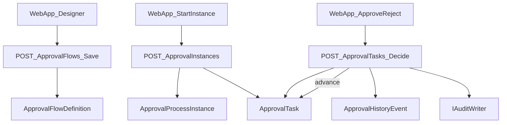

## 范围与目标（MVP）

- **后端**：新增“审批流引擎”模块（流程定义 + 运行时实例 + 待办任务 + 操作历史），支持**画布建模**（保存节点/连线 JSON）与**混合选人策略**（用户/角色/部门负责人映射）。
- **前端**：新增“审批流”菜单与页面：
  - **流程定义列表**（草稿/已发布/停用）
  - **流程设计器画布**（拖拽节点、连线、配置节点、保存/发布）
  - **我的待办**（审批/驳回）
  - **我发起的流程**（查看状态与历史）
- **等保落点**：
  - **鉴权与授权**：所有接口 `[Authorize]`，流程管理接口限制 Admin/特定角色。
  - **审计追溯**：发布流程、发起流程、审批/驳回等操作写入 `IAuditWriter`。
  - **租户隔离**：所有审批流实体继承 `TenantEntity`，依赖现有 `QueryFilter`。
  - **安全输入**：条件表达式采用**规则 JSON**（白名单运算符），禁止脚本执行；DTO 全量 FluentValidation。

## 后端设计（Clean Architecture 对齐现有模式）

### 1) 新增 bounded context 项目

- 新增项目并加入解决方案（必须更新 `.slnx`）：
  - [`src/backend/Atlas.Domain.Approval/Atlas.Domain.Approval.csproj`](src/backend/Atlas.Domain.Approval/Atlas.Domain.Approval.csproj)
  - [`src/backend/Atlas.Application.Approval/Atlas.Application.Approval.csproj`](src/backend/Atlas.Application.Approval/Atlas.Application.Approval.csproj)
- 同步更新：
  - [`Atlas.SecurityPlatform.slnx`](Atlas.SecurityPlatform.slnx) 增加 2 个 `<Project />`（参考已有条目）
  - [`src/backend/Atlas.Infrastructure/Atlas.Infrastructure.csproj`](src/backend/Atlas.Infrastructure/Atlas.Infrastructure.csproj) 引用 `Atlas.Application.Approval`
  - [`src/backend/Atlas.WebApi/Atlas.WebApi.csproj`](src/backend/Atlas.WebApi/Atlas.WebApi.csproj) 引用 `Atlas.Application.Approval`

### 2) Domain（实体）

建议实体最小集合（全部继承 `TenantEntity`）：

- `ApprovalFlowDefinition`
  - `Id(long)`、`Name`、`Version(int)`、`Status(Draft/Published/Disabled)`
  - `DefinitionJson(string)`：节点+连线+布局+节点配置（含选人策略/条件规则）
  - `PublishedAt/PublishedByUserId?`
- `ApprovalProcessInstance`
  - `Id(long)`、`DefinitionId`、`BusinessKey(string)`、`InitiatorUserId(long)`
  - `Status(Running/Completed/Rejected/Canceled)`、`DataJson(string?)`、`StartedAt/EndedAt?`
- `ApprovalTask`
  - `Id(long)`、`InstanceId`、`NodeId(string)`、`Title`、`Status(Pending/Approved/Rejected/Canceled)`
  - `AssigneeType(User/Role/DeptLeader)`、`AssigneeValue(string)`（如 userId/roleCode/departmentId）
  - `DecisionByUserId?`、`DecisionAt?`、`Comment?`
- `ApprovalHistoryEvent`
  - 记录每次状态推进/决策：`InstanceId`、`EventType`、`FromNode/ToNode`、`PayloadJson`、`At`、`ActorUserId?`
- `ApprovalDepartmentLeader`
  - 仅为“部门负责人策略”提供最小支撑：`DepartmentId(long)` → `LeaderUserId(long)`（避免改动既有 Identity 领域模型）

> 说明：现有 `Department`/`UserAccount` 结构里没有“负责人/上级链”字段（见 [`src/backend/Atlas.Domain/Identity/Entities/Department.cs`](src/backend/Atlas.Domain/Identity/Entities/Department.cs)），因此用审批流模块内的映射表实现“部门负责人”最省侵入。

### 3) Application（DTO/验证/映射/服务接口）

- DTO（`Models/`）：
  - `ApprovalFlowDefinitionCreateRequest/UpdateRequest/Response/ListItem`
  - `ApprovalFlowPublishRequest`（可选：发布备注）
  - `ApprovalStartRequest`（definitionId, businessKey, dataJson）
  - `ApprovalTaskDecideRequest`（approve/reject + comment）
- 验证（`Validators/`）：
  - 流程 JSON 结构校验：
    - 1 个 start 节点
    - 至少 1 个 end 节点
    - 节点 id 唯一、边引用合法
    - 条件节点/连线条件规则运算符白名单
- AutoMapper（`Mappings/`）：映射 DTO ↔ Entity（创建时注入 `TenantId` 与 `IIdGenerator.NextId()`）
- 服务接口（`Abstractions/`）：
  - `IApprovalFlowQueryService` / `IApprovalFlowCommandService`
  - `IApprovalRuntimeQueryService` / `IApprovalRuntimeCommandService`
- Repository 接口（`Repositories/`）：
  - `IApprovalFlowRepository`、`IApprovalInstanceRepository`、`IApprovalTaskRepository`、`IApprovalDepartmentLeaderRepository`

### 4) Infrastructure（SqlSugar Repository + 引擎实现 + DI）

- Repositories：放入 [`src/backend/Atlas.Infrastructure/Repositories/`](src/backend/Atlas.Infrastructure/Repositories/)，沿用现有模式。
- Services：放入 [`src/backend/Atlas.Infrastructure/Services/`](src/backend/Atlas.Infrastructure/Services/)。
- 引擎执行要点：
  - **启动实例**：读取已发布定义 → 解析 JSON → 生成第一批 `ApprovalTask`。
  - **完成任务**：写入决策 → 追加 `ApprovalHistoryEvent` → 根据节点类型（会签/或签/条件分支）计算下一步 → 创建后续任务或结束实例。
  - **条件规则**：仅允许规则 JSON（如 equals/gt/in/contains），对 `DataJson` 的字段取值进行比较，禁止任意表达式/脚本。
- 审计：所有关键动作调用 `IAuditWriter.WriteAsync(...)`（参考现有登录审计用法在 `JwtAuthTokenService`）。
- DI 注册：在 [`src/backend/Atlas.Infrastructure/ServiceCollectionExtensions.cs`](src/backend/Atlas.Infrastructure/ServiceCollectionExtensions.cs) 添加 Approval 的 repository/service 注册（仿照 Assets/Audit）。
- 数据库初始化：在 [`src/backend/Atlas.Infrastructure/Services/DatabaseInitializerHostedService.cs`](src/backend/Atlas.Infrastructure/Services/DatabaseInitializerHostedService.cs) 的 `db.CodeFirst.InitTables(...)` 增加新实体类型（目前是显式列举）。

### 5) WebApi（控制器与 .http 测试）

- Controllers：
  - `ApprovalFlowsController`：定义 CRUD + 发布
  - `ApprovalRuntimeController`：发起流程、我的发起、实例详情
  - `ApprovalTasksController`：我的待办、审批/驳回
  - `ApprovalDepartmentLeadersController`：维护部门负责人映射
- 权限建议：
  - Flow 定义管理：`[Authorize(Roles = "Admin")]` 或你指定的角色
  - Runtime/Tasks：`[Authorize]`
- 每个新增/变更端点都补齐 REST Client 文件：
  - 新增 [`src/backend/Atlas.WebApi/Bosch.http/Approval.http`](src/backend/Atlas.WebApi/Bosch.http/Approval.http) 覆盖上述端点。

## 前端设计（沿用现有路由/鉴权/列表页范式）

### 1) 路由与菜单

- 路由：在 [`src/frontend/Atlas.WebApp/src/router/index.ts`](src/frontend/Atlas.WebApp/src/router/index.ts) 增加：
  - `/approval/flows`（流程定义列表）
  - `/approval/designer/:id`（画布设计器）
  - `/approval/tasks`（我的待办）
  - `/approval/instances`（我发起）
- 菜单：在 [`src/frontend/Atlas.WebApp/src/layouts/MainLayout.vue`](src/frontend/Atlas.WebApp/src/layouts/MainLayout.vue) 增加“审批流”入口，并处理 `selectedKeys`。

### 2) 画布设计器实现方案（MVP）

- **已实现**：使用 `@antv/x6` 实现画布设计器
- 设计器能力（已完成）：
  - ✅ 新增节点（Start/Approve/Condition/End）- 支持拖拽添加
  - ✅ 连接节点（生成 edges）- 支持手动连线
  - ✅ 节点属性面板：名称、节点类型、选人策略（用户/角色/部门负责人）、会签/或签模式、条件规则
  - ✅ 保存：序列化为 `DefinitionJson` 调后端保存
  - ✅ 发布：调用后端 publish（后端做结构校验）
  - ✅ 加载已有流程定义并渲染到画布

### 3) 待办/已发起页面

- `MyTasksPage`：table + 操作列（审批/驳回弹窗）
- `MyInstancesPage`：table + 查看详情（抽屉显示历史事件与当前状态）

### 4) API 封装与类型

- 在 [`src/frontend/Atlas.WebApp/src/services/api.ts`](src/frontend/Atlas.WebApp/src/services/api.ts) 增加审批流相关函数，沿用现有 `requestApi`（自动带 token 与 `X-Tenant-Id`）。
- 在 [`src/frontend/Atlas.WebApp/src/types/api.ts`](src/frontend/Atlas.WebApp/src/types/api.ts) 增加审批流 DTO 类型（或放入专用 `types/approval.ts`，以你现有风格为准）。

## 关键数据流（简图）

## 质量门禁与验证

- 后端：`dotnet build` 必须 **0 errors / 0 warnings**（仓库已启用零警告策略）。
- 新增文件必须加入相应 `.csproj` 且 `.slnx` 引用齐全。
- 关键接口补齐 `.http` 并能跑通最小链路：创建定义→保存→发布→发起→生成待办→审批→结束。