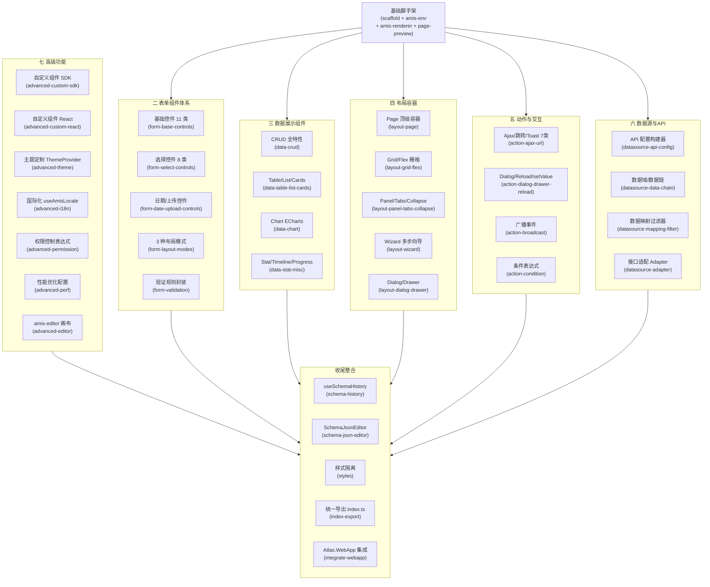

# Atlas.LowCodeUI — AMIS 可视化低代码组件库

## 项目命名

- **目录名**：`src/frontend/Atlas.LowCodeUI`
- **npm package name**：`@atlas/lowcode-ui`
- **命名理由**：与现有 `Atlas.WebApp` 风格一致；`LowCode` 点明职责；`UI` 表示对外暴露的是 Vue 可复用组件。

## 定位与边界


| 职责  | 说明                                             |
| --- | ---------------------------------------------- |
| 渲染层 | 把 AMIS JSON Schema 渲染成页面（`<AmisRenderer>`）     |
| 设计层 | 封装 amis-editor 画布提供拖拽低代码编辑能力（`<AmisDesigner>`） |
| 扩展层 | 支持注册自定义 Vue/React 组件插入 AMIS 组件面板               |
| 不包含 | 业务逻辑、后端 API、权限路由（这些留给 Atlas.WebApp）            |


## 技术选型

- **构建**：Vite 8 `build.lib` 模式，输出 ESM + UMD 两份产物
- **运行时**：Vue 3（peer dependency，不打包进库）
- **核心依赖**：`amis` ^6（渲染引擎）、`amis-editor` ^3（可视化画布）
- **类型**：TypeScript 5，strict 模式，自动 `d.ts` 输出
- **样式**：只导出 CSS 文件，不做全局污染；提供主题覆盖变量

## 项目结构

```
src/frontend/Atlas.LowCodeUI/
├── package.json               # name: @atlas/lowcode-ui
├── vite.config.ts             # lib mode: entry=src/index.ts
├── tsconfig.json
├── src/
│   ├── index.ts               # 统一导出 + Vue plugin install()
│   ├── components/
│   │   ├── AmisRenderer/      # amis.render() 包装成 Vue 组件
│   │   │   ├── index.vue
│   │   │   └── types.ts
│   │   ├── AmisDesigner/      # amis-editor 画布（左:组件面板/中:画布/右:属性面板）
│   │   │   ├── index.vue
│   │   │   ├── toolbar.vue    # 顶部工具栏（预览/保存/撤销/重做）
│   │   │   └── types.ts
│   │   ├── SchemaJsonEditor/  # JSON 代码编辑器（Monaco/CodeMirror）
│   │   │   └── index.vue
│   │   └── PagePreview/       # 全屏预览模式（只读渲染）
│   │       └── index.vue
│   ├── composables/
│   │   ├── useAmisEnv.ts      # 构造 AMIS env(fetcher/theme/locale/toast)
│   │   └── useSchemaHistory.ts # 撤销/重做 Schema 历史栈
│   ├── plugins/
│   │   └── registerCustom.ts  # 注册自定义 AMIS 组件的辅助函数
│   ├── styles/
│   │   ├── amis-theme.css     # AMIS 主题变量覆盖
│   │   └── designer.css       # 画布布局样式
│   └── types/
│       └── amis-shim.d.ts     # amis/amis-editor 类型补丁
└── dist/                      # 构建产物（.gitignore）
    ├── atlas-lowcode-ui.es.js
    ├── atlas-lowcode-ui.umd.js
    └── style.css
```

## 核心组件设计

### AmisRenderer（渲染器）

- Props：`schema: AmisSchema`、`data?: Record<string,unknown>`、`theme?: string`、`locale?: string`
- 内部调用 `amis.render(schema, { env })` 并挂载到容器 div
- Emits：`onAction`、`onFetch`（可由宿主应用注入自定义 fetcher）

### AmisDesigner（可视化画布）

- 画布布局参考 amis-editor 官方三栏结构：

```
  ┌──────────────────────────────────────────────────┐
  │  Toolbar（顶部：保存/预览/撤销/重做/导入/导出JSON）│
  ├──────────┬──────────────────────┬────────────────┤
  │ 组件面板  │     画 布 区 域       │  属性配置面板  │
  │（左 240px）│   （中，可拖拽）     │  （右 320px）  │
  └──────────┴──────────────────────┴────────────────┘
  

```

- Props：`modelValue: AmisSchema`（v-model 双向绑定）、`customComponents?: CustomComponentDef[]`
- Emits：`update:modelValue`、`onSave`
- 内部用 `useSchemaHistory` 提供撤销/重做
- `amis-editor` 在 vite.config.ts 中设为 external，由宿主项目提供（避免重复打包）

### 插件注册方式（宿主项目使用）

```typescript
// 方式一：全局注册（Atlas.WebApp main.ts）
import AtlasLowCodeUI from '@atlas/lowcode-ui'
import '@atlas/lowcode-ui/dist/style.css'
app.use(AtlasLowCodeUI)

// 方式二：按需引入
import { AmisRenderer, AmisDesigner } from '@atlas/lowcode-ui'
```

## Vite lib 模式配置要点

```typescript
// vite.config.ts 关键部分
build: {
  lib: {
    entry: 'src/index.ts',
    name: 'AtlasLowCodeUI',
    fileName: (format) => `atlas-lowcode-ui.${format}.js`,
  },
  rollupOptions: {
    external: ['vue', 'amis', 'amis-editor', 'react', 'react-dom'],
    output: {
      globals: { vue: 'Vue', amis: 'amis', react: 'React', 'react-dom': 'ReactDOM' }
    }
  }
}
```

## 与 Atlas.WebApp 的集成方式

在 `Atlas.WebApp/package.json` 中用本地路径引用：

```json
"dependencies": {
  "@atlas/lowcode-ui": "file:../Atlas.LowCodeUI"
}
```

现有 `src/pages/lowcode/` 和 `src/components/amis/` 中的页面可逐步迁移为使用库组件。

## 任务全景（按 AMIS 章节映射）




### 各章节任务说明

**二、表单组件体系（5 tasks）**

- `form-base-controls`：11 类文本/数值/富文本控件透传渲染验证
- `form-select-controls`：8 类选择类控件 + 远程 source 场景
- `form-date-upload-controls`：日期/上传/城市/combo/condition-builder 等
- `form-layout-modes`：default / horizontal / inline 三种布局 Props 封装
- `form-validation`：必填/格式/长度/范围/正则/多字段 rules 联合校验工具函数

**三、数据展示组件（4 tasks）**

- `data-crud`：sortable/filterable/分页/批量/quickEdit/导出 Excel
- `data-table-list-cards`：Schema 工厂函数 AtlasTableSchema / AtlasListSchema / AtlasCardsSchema
- `data-chart`：柱/线/饼/散点图预置 Schema，支持 api 数据源
- `data-stat-misc`：stat/timeline/progress/tag 及 DashboardPanel 组合

**四、布局容器组件（5 tasks）**

- `layout-page`：侧边栏/工具栏/initApi 轮询/cssVars
- `layout-grid-flex`：12 栏响应式栅格 Builder
- `layout-panel-tabs-collapse`：Tab 懒加载/动态 title
- `layout-wizard`：步骤数组/独立验证/步骤提交 api
- `layout-dialog-drawer`：size/closeOnEsc/联动触发

**五、动作与交互系统（4 tasks）**

- `action-ajax-url`：ajax/url/link/toast/confirm/copy/print/download 7 类 ActionBuilder
- `action-dialog-drawer-reload`：dialog/drawer/reload/submit/reset/setValue 6 类
- `action-broadcast`：broadcast 派发 + onEvent 监听，日期→图表跨组件联动示例
- `action-condition`：visibleOn/disabledOn/requiredOn/hiddenOn 表达式工具函数

**六、数据源与 API 集成（4 tasks）**

- `datasource-api-config`：字符串/对象两种 API 配置，Bearer Token 动态注入
- `datasource-data-chain`：Page→CRUD→Form 数据链继承机制说明 + initData 注入
- `datasource-mapping-filter`：6 种常用过滤器示例集
- `datasource-adapter`：responseData 非标准接口 Adapter 封装

**七、高级功能（7 tasks）**

- `advanced-custom-sdk`：onMount/onUpdate/onUnmount 钩子自定义组件注册
- `advanced-custom-react`：React 组件注册进 AMIS 组件面板
- `advanced-theme`：cssVars / 辅助 Class / 全局变量三层主题，暗/亮切换
- `advanced-i18n`：与 vue-i18n locale 联动，zh-CN/en-US 动态切换
- `advanced-permission`：基于 JWT RBAC permissions 的 visibleOn 生成函数
- `advanced-perf`：lazyLoad/debug props、接口缓存、虚拟滚动最佳实践
- `advanced-editor`：amis-editor 三栏画布，顶部工具栏，v-model Schema 双向绑定

