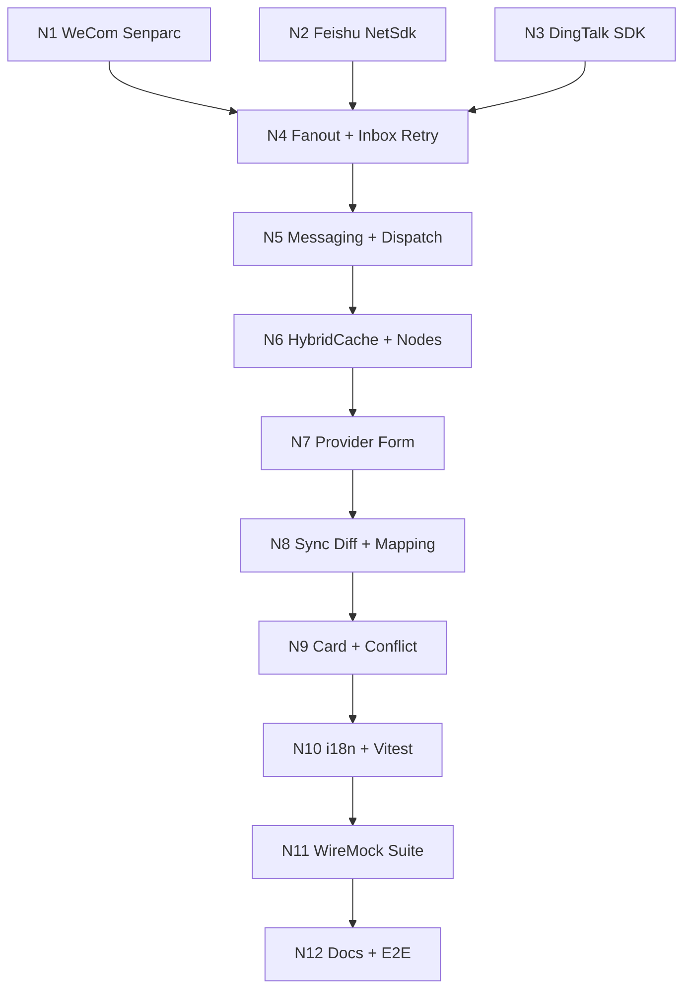

# External Connectors NuGet 迁移 + 完整性收口

## 一、第二轮审查关键结论（必读）

声明 16 个里程碑全部 completed，但实际存在以下**功能性**缺口（非「优化」级别）：

**后端 12 处**：
- `ExternalApprovalFanoutHandler` 未实现（仅在注释里）→ 模式 A/C 的 fan-out 实际不工作
- `ConnectorMessagingController` 缺失 → 前端无法直接发消息卡片
- `ExternalCallbackInboxRetryHostedService` 缺失 → 死信表只入不出
- `ExternalMessageDispatch` 仓储缺失 → 表已建但无人写入，卡片更新无法溯源
- `WeComApprovalProvider` 未调用 `getapprovalinfo`（注释提到，代码没有）
- `WeComCallbackVerifier.XmlToJson` 是占位（`{rawXml}`），无 corpId 二次校验
- `FeishuApprovalProvider` 缺 `POST /open-apis/approval/v4/external_instances` 创建调用，只有 check
- `FeishuApiClient.RefreshUserAccessTokenAsync` 写好但**全程序无人调用**，user_access_token 完全没缓存
- `Microsoft.Extensions.Caching.Hybrid` 包被引用但**零代码使用**，所谓「HybridCache 适配」是空载
- 9 个工作流节点实际只有 8 个 + 1 通用节点，`FeishuSyncThirdPartyApprovalNode` 不存在
- WeCom `60020` 等可见域错误未映射，触发后会抛而非降级
- `ConnectorIdentityBindingsController` 没有「列表 + 通用 POST 创建」对偶（plan 写 CRUD 实际只有 manual + delete）

**前端 7 处**：
- `ConnectorProvidersPage` 仅列表，**无新建/编辑/启停/删除/密钥轮换表单**（后端 8 个端点只用了 1-2 个）
- `ConnectorBindingsPage` 仅列表 + 状态筛选，**无手动绑定、无冲突解决**
- `ConnectorApprovalMappingPage` 只读表格，**无字段映射设计器**（PUT/DELETE 端点未消费）
- `ConnectorDirectorySyncPage` **无 diff 面板、无增量按钮、无失败重试**
- **完全缺失**：OAuth 应用配置表单 / 可见范围配置 / 消息卡片预览 / 身份绑定冲突中心
- `apps/app-web` locales 里**零 connector 词条**，组件硬编码（违反 i18n 强制要求）
- 包内**无任何 `*.test.tsx`**

**文档/测试 3 处**：
- `tests/.../ExternalConnectors/` 仅 1 个 `ConnectorsCoreTests.cs`，**未引入 WireMock.Net**
- `docs/workflow-editor-validation-matrix.md` **未追加任何 connector 节点行**
- `Connectors.http` 31 个请求，缺 6 个端点样例 + 钉钉全部缺失

## 二、NuGet 库选型与适配

| 厂商 | 选型 | 版本 | TFM | 关键收益 |
| --- | --- | --- | --- | --- |
| 企业微信 | `Senparc.Weixin.Work` | 3.30.2 | **显式 net10.0** | 自带 `WXBizMsgCrypt` 验签 + 全 OpenAPI 覆盖（OAuth/MailList/Message/OA），可砍掉约 1.0K 行自研 HTTP/DTO |
| 飞书 / Lark | `FeishuNetSdk` (vicenteyu) | 4.1.6 (2026-03-27) | net8.0（向下兼容到 net10） | 自动 token 缓存/刷新（直接补齐 user_access_token cache 缺口）、自动事件签名/AES 解密 |
| 钉钉 | `AlibabaCloud.SDK.Dingtalk` | 2.2.43 | netstandard2.0（兼容 net10） | 阿里云**官方 SDK**，零负担补齐三方能力 |

**FeishuNetSdk 风险**：仅 net8.0 单一 TFM。需在 N2 验证 net10 项目引用是否产生 NU1701 警告（Atlas 红线 0 警告），若有则在 `.csproj` 加 `NoWarn`。

## 三、12 个里程碑（每个独立闭环 + 立即验证）

### N1 — 替换 WeCom 自研代码为 Senparc.Weixin.Work
- [`Atlas.Connectors.WeCom.csproj`](src/backend/Atlas.Connectors.WeCom/Atlas.Connectors.WeCom.csproj) 加 `Senparc.Weixin.Work` 3.30.2 包引用
- 删除 `WeComApiClient.cs`、`Internal/WeComApiResponse.cs`、`WeComCallbackVerifier.cs`
- 新建 `WeComSdkAdapter.cs`：把 Senparc 的 `AccessTokenContainer` 包装到 `IConnectorTokenCache`（让我们的 token 缓存策略一致）
- 用 Senparc API 重写 4 个 Provider：
  - `WeComIdentityProvider` → `OAuth2Api.GetUserId/GetUserDetail`
  - `WeComDirectoryProvider` → `MailListApi.GetDepartmentList/GetMember/GetSimpleUserList`，60011/60020 全覆盖
  - `WeComApprovalProvider` → `OaApi.ApplyEvent/GetApprovalInfo/GetApprovalDetail`（**补齐 getapprovalinfo**）
  - `WeComMessagingProvider` → `MessageApi.SendMessage/UpdateTemplateCard`
- `WeComCallbackVerifier` 用 Senparc 的 `WXBizMsgCrypt` 替换占位 `XmlToJson`，加 corpId tail 校验
- `ExternalConnectorsServiceCollectionExtensions.AddWeComConnector` 同步调整 DI
- **验证**：`dotnet build` 0 警告 + `ConnectorsCoreTests` 全过

### N2 — 替换 Feishu 自研代码为 FeishuNetSdk
- [`Atlas.Connectors.Feishu.csproj`](src/backend/Atlas.Connectors.Feishu/Atlas.Connectors.Feishu.csproj) 加 `FeishuNetSdk` 4.1.6 + 测试 `NU1701`/`MSB3277` 警告，必要时本地 `<NoWarn>`
- 删除 `FeishuApiClient.cs`、`Internal/FeishuApiResponse.cs`、`FeishuEventVerifier.cs`
- 用 FeishuNetSdk 的 `IFeishuTenantApi` / `IFeishuUserApi` 重写 4 个 Provider：
  - `FeishuIdentityProvider` → `IFeishuTenantApi.PostAuthenV2OauthTokenAsync` + `GetAuthenV1UserInfoAsync` + `GetContactV3UsersByUserIdAsync`
  - `FeishuDirectoryProvider` → `GetContactV3DepartmentsByDepartmentIdChildrenAsync` + `GetContactV3UsersFindByDepartmentAsync` + `PostContactV3UsersBatchGetIdAsync`
  - `FeishuApprovalProvider` → `PostApprovalV4InstancesAsync` + `GetApprovalV4InstancesByInstanceIdAsync` + **新增** `PostApprovalV4ExternalInstancesAsync` 创建（补 N10-1 缺口）
  - `FeishuMessagingProvider` → `PostImV1MessagesAsync` + `PatchImV1MessagesByMessageIdAsync`
- `FeishuEventVerifier` 用 SDK 自带 `EventDispatcher` 替换；自动获得 user_access_token 缓存/刷新（解决 M4 缺口）
- **验证**：构建 + `ConnectorsCoreTests`

### N3 — 钉钉 Provider 全量实现（NuGet）
- [`Atlas.Connectors.DingTalk.csproj`](src/backend/Atlas.Connectors.DingTalk/Atlas.Connectors.DingTalk.csproj) 加 `AlibabaCloud.SDK.Dingtalk` 2.2.43
- 删除 `DingTalkConnectorMarker` 占位（保留 ProviderType 常量）
- 新建：`DingTalkOptions`、`DingTalkRuntimeOptions`、`DingTalkSdkAdapter`、`DingTalkIdentityProvider`、`DingTalkDirectoryProvider`、`DingTalkApprovalProvider`、`DingTalkMessagingProvider`、`DingTalkCallbackVerifier`
- 在 [`ExternalConnectorsServiceCollectionExtensions`](src/backend/Atlas.Infrastructure.ExternalConnectors/DependencyInjection/ExternalConnectorsServiceCollectionExtensions.cs) 加 `AddDingTalkConnector()`
- [`ConnectorProviderType`](src/backend/Atlas.Domain.ExternalConnectors/Enums/ConnectorProviderType.cs) 中确认/新增 `DingTalk`
- [`ApprovalNotificationChannel`](src/backend/Atlas.Domain.Approval/Enums/ApprovalNotificationChannel.cs) 新增 `DingTalk = 7`
- 新建 `DingTalkApprovalNotificationSender` + 注册
- **验证**：构建 + 单元测试

### N4 — Fanout Handler + 死信回调重试
- 新建 `Atlas.Infrastructure.ExternalConnectors/Services/CallbackHandlers/ExternalApprovalFanoutHandler.cs` 实现 `IExternalCallbackHandler`，根据 `ExternalApprovalTemplateMapping.IntegrationMode` (A/B/C) 路由到 `IExternalApprovalDispatchService`
- [`ApprovalServiceRegistration`](src/backend/Atlas.Infrastructure/DependencyInjection/ApprovalServiceRegistration.cs) 第 43-48 行：把 `IExternalCallbackHandler` 改为多注册（`Composite` 模式或链式），保留 `HttpCallbackHandler` 同时注入 `ExternalApprovalFanoutHandler`
- 新建 `Atlas.Infrastructure.ExternalConnectors/HostedServices/ExternalCallbackInboxRetryHostedService.cs`：周期扫 `ExternalCallbackEvent.NextRetryAt < now AND Status = Failed`，重新喂给 `ConnectorCallbackInboxService`
- **验证**：新增 3 个 xUnit 用例覆盖三种 IntegrationMode + 死信重试

### N5 — Messaging 控制器 + Dispatch 持久化
- 新建 [`ConnectorMessagingController`](src/backend/Atlas.PlatformHost/Controllers/Connectors/ConnectorMessagingController.cs)：`POST /api/v1/connectors/providers/{providerId}/messages:send`、`POST .../messages/{dispatchId}:update-card`
- 新建 `IExternalMessageDispatchRepository` + `ExternalMessageDispatchRepository` (SqlSugar)
- 新建 `IExternalMessagingService` 应用层 facade：调 `IConnectorRegistry.GetMessaging` 之后**强制**把 `ExternalMessageDispatchResult` 写入 `ExternalMessageDispatch` 表（含 `MessageId / ResponseCode / CardVersion`）
- 改造三家 `*MessagingProvider` 通过 facade 出口，确保所有 dispatch 可溯源
- 更新 [`Connectors.http`](src/backend/Atlas.PlatformHost/Bosch.http/Connectors.http) 增 messages:send + update-card 样例
- 更新 [`docs/contracts.md`](docs/contracts.md) 同步 messaging 端点

### N6 — HybridCache 适配 + 节点细化
- 新建 `Atlas.Connectors.Core/Caching/HybridConnectorTokenCache.cs` 包装 `Microsoft.Extensions.Caching.Hybrid.HybridCache`，让真正用上已引用的 NuGet 包
- `AddConnectorsCore` 改为：`if (services.Any(s => s.ServiceType == typeof(HybridCache))) Add<HybridConnectorTokenCache>; else Add<InMemoryConnectorTokenCache>`
- [`Atlas.Sdk.ConnectorPlugins`](src/backend/Atlas.Sdk.ConnectorPlugins) 拆分通用 `ExternalQueryApprovalStatusNode` 为 3 个具体节点 + 新增 `FeishuSyncThirdPartyApprovalNode` + `DingTalkSendMessageNode` + `DingTalkCreateApprovalNode`，正式 12 节点（原计划 9 + 钉钉 3）
- 更新 `Resources/NodeCatalog.json` + `ConnectorPluginsServiceCollectionExtensions.AddConnectorPluginNodes`
- 更新 [`docs/workflow-editor-validation-matrix.md`](docs/workflow-editor-validation-matrix.md) 追加 12 行节点

### N7 — 前端：Provider 表单 + OAuth 配置
- 新建 `packages/external-connectors-react/src/components/ConnectorProviderEditDrawer.tsx`：新建/编辑/启停/删除/密钥轮换（消费 6 个未消费的端点）
- 新建 `ConnectorOAuthConfigForm.tsx`：CallbackBaseUrl / TrustedDomains / Visibility / SyncCron 表单
- `ConnectorProvidersPage` 列表行加「编辑/启停/密钥轮换/删除」操作 + 跳转详情
- 调 `apps/app-web/src/services/api-connectors.ts` 补 6 个新 client 方法（含 DingTalk）
- 字符串全部走 i18n key

### N8 — 前端：同步 Diff + 字段映射设计器
- 改造 `ConnectorDirectorySyncPage`：增量同步按钮、`jobs/{jobId}/diffs` 表格 + 失败行重试
- 新建 `ConnectorTemplateMappingDesigner.tsx`：左本地表单字段 / 右外部模板控件 / 中拖拽连线 + 必填校验 + 枚举映射，调 PUT/DELETE
- 改造 `ConnectorApprovalMappingPage` 引用设计器
- Vitest 单测：拖拽序列化、增量重试

### N9 — 前端：消息卡片预览 + 绑定冲突中心
- 新建 `MessageCardPreview.tsx`：根据 `ExternalMessageCard` DTO 渲染卡片（按 wecom/feishu/dingtalk 三套样式切换）
- 新建 `IdentityBindingConflictCenter.tsx`：列表「重名/换号/重绑」冲突 + 调 `conflicts:resolve` 端点
- `ConnectorBindingsPage` 加手动绑定 Drawer + 冲突中心入口

### N10 — i18n 收口 + 前端单测
- 把 N7-N9 所有硬编码字符串抽到 `apps/app-web/src/app/i18n/zh-CN.ts` + `en-US.ts`（或当前 `messages.ts` 模式，先确认实际 i18n 加载方式）
- `pnpm run i18n:check` 必须通过
- Vitest 关键路径：provider 表单提交、binding 冲突解决、字段映射设计器序列化、卡片预览快照

### N11 — WireMock.Net 集成测试套件
- 新建 `tests/Atlas.SecurityPlatform.Tests/ExternalConnectors/Integration/`
- 引入 `WireMock.Net` NuGet 到 `Atlas.SecurityPlatform.Tests.csproj`
- 桩三家 OpenAPI（按 N1/N2/N3 之后的真实调用形态）：
  - WeCom：gettoken / OAuth getuserinfo / user/get / applyevent / **getapprovalinfo** / getapprovaldetail / message/send / update_template_card / 60011 + 60020 错误用例
  - Feishu：tenant_access_token / authen/v2/oauth/token / user_info / contact/v3/users / approval/v4/instances / **external_instances 创建** / im/v1/messages
  - DingTalk：gettoken / userid / department / process_instance / robot send
- 端到端测试用例：OAuth 登录 → 全量同步 → 模式 C 提单 → Webhook 推进状态 → 卡片更新
- 死信测试：故意让一次回调失败，验证 `ExternalCallbackInboxRetryHostedService` 重试

### N12 — 文档 + .http + 端到端联调闭环
- 更新 [`docs/contracts.md`](docs/contracts.md) External Collaboration Connector 章节：
  - 补 DingTalk 列、`POST messages:send`/`update-card`、`DELETE template-mappings/{id}`、`POST identity-bindings/manual` 实际签名
  - 补 fanout/inbox 重试 sequence 图
- 更新 [`docs/workflow-editor-validation-matrix.md`](docs/workflow-editor-validation-matrix.md)：12 行 connector 节点表 + 端口 schema
- 更新 [`Connectors.http`](src/backend/Atlas.PlatformHost/Bosch.http/Connectors.http)：补 7 个缺失端点 + 钉钉全套样例
- 端到端联调跑一次完整 happy path（WireMock 桩 → 调试看板看到 traceId）
- 更新 v4 报告 27-31 章实施纪要为「真实 completed」

## 四、依赖与执行顺序

N1/N2/N3 可并行（互不依赖），其余顺序串行；建议按 N1→N2→N3 顺序串行做以减少 DI 重构冲突。

## 五、每个里程碑的强制验证（红线）

每完成一个 milestone 必须执行：
- 后端：`dotnet build`（0 错误 0 警告）+ `dotnet test tests/Atlas.SecurityPlatform.Tests --filter "FullyQualifiedName~ExternalConnectors"`
- 前端（N7+）：`cd src/frontend && pnpm run lint && pnpm run i18n:check && pnpm run test:unit -- external-connectors`
- 失败立即停下来修，不进入下一里程碑

## 六、暂停-续跑约定

- 任意 N 完成后均可暂停
- 续跑只需说「从 NX 继续」
- 上下文不足时按 `AGENTS.md` 长任务规则停在阻塞点，不伪造完成

## 七、风险预案

- **FeishuNetSdk net8 警告**：N2 第一步先小流量引用验证，若 NU1701 触发 0 警告红线，本地 `<NoWarn>NU1701</NoWarn>` + 在 `docs/contracts.md` 注释
- **Senparc 容器单例 vs 多租户**：Senparc 默认 `AccessTokenContainer` 全局单例，多租户场景需要在 Adapter 里按 `(tenantId, providerInstanceId)` 维度做 key 隔离 → N1 单测必须覆盖
- **DingTalk 阿里云 SDK 同步阻塞**：阿里云 SDK 部分 API 是同步，需在 Adapter 里 `Task.Run` 包装或用 SDK 的 Async 重载（v2.2.43 已多数提供）
- **DI 多 IExternalCallbackHandler**：现有 `ApprovalServiceRegistration` 用单一注册 + lambda 包 `HttpClient`，N4 改造时要确保所有调用方都能拿到全部 handler（ChainOfResponsibility 或 List 注入）