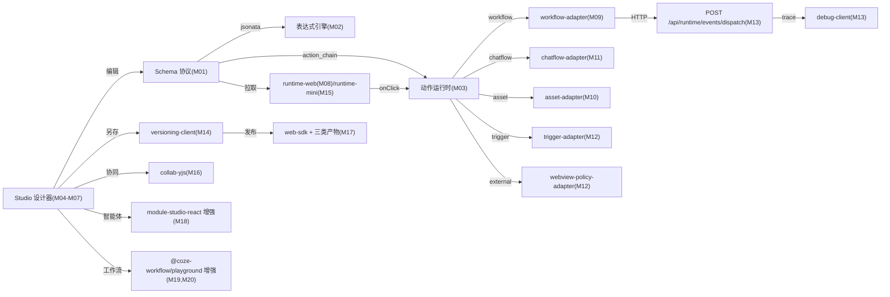

# Coze 低代码全量复刻实施计划

## 一、强约束（与上版差异处）

- **完整实现，禁止 MVP**：每个里程碑必须交付该领域的完整能力，不允许"演示页/最小切片/占位/二阶段再做"等表述。
- **概念零遗漏**：docx 14 章正文 + 附录 A/B/C/D（17 + 8 + 49 + 27 = 101 条概念）必须分配到具体里程碑，且每条概念必须有可追溯的 case 编号。
- **技术栈强锁定**：仅使用 docx §十一 10 项推荐栈：
  - React 18 + TypeScript（严格模式）
  - `@douyinfe/semi-ui`
  - `@dnd-kit/core` + `@dnd-kit/sortable` + `@dnd-kit/modifiers`
  - `monaco-editor` + `@monaco-editor/react`
  - `zustand`
  - `@tanstack/react-query`
  - `jsonata`
  - `@tarojs/taro`
  - `yjs` + `y-websocket`
- **现状不满足必须增强**：现有 `@coze-workflow/playground` 缺协同/AI 生成/异步/批量等能力，必须在 M16/M19 直接增强；不允许"绕过"或"另建一套"。
- **前端先行 → 后端按契约建模**：每个里程碑的 case 编号 C 系列（前端）必须在 S 系列（后端）之前完成；后端只接受由前端契约推导的 DTO/REST 设计。
- **零警告 + 零错误 + i18n 双语 + .http 同步 + contracts.md 同步**：进入下一里程碑前的硬门槛。
- **等保 2.0**：审计、加密、白名单、脱敏、生命周期、引用治理在每个里程碑明确列出对应 case。

## 二、技术栈与新增 packages 锁定

新增 [src/frontend/packages/lowcode-\*/](src/frontend/packages) 共 20 个独立包：

- 协议层：`@atlas/lowcode-schema`、`@atlas/lowcode-expression`、`@atlas/lowcode-action-runtime`
- 设计器：`@atlas/lowcode-editor-canvas`、`@atlas/lowcode-editor-outline`、`@atlas/lowcode-editor-inspector`、`@atlas/lowcode-property-forms`、`@atlas/lowcode-component-registry`、`@atlas/lowcode-components-web`、`@atlas/lowcode-components-mini`
- 运行时：`@atlas/lowcode-runtime-web`、`@atlas/lowcode-runtime-mini`
- 适配器：`@atlas/lowcode-workflow-adapter`、`@atlas/lowcode-chatflow-adapter`、`@atlas/lowcode-session-adapter`、`@atlas/lowcode-trigger-adapter`、`@atlas/lowcode-asset-adapter`、`@atlas/lowcode-webview-policy-adapter`
- 周边：`@atlas/lowcode-debug-client`、`@atlas/lowcode-versioning-client`、`@atlas/lowcode-web-sdk`、`@atlas/lowcode-collab-yjs`

新增独立 app：[src/frontend/apps/lowcode-studio-web](src/frontend/apps)（设计器主入口，遵循 AGENTS.md 「apps 只装配，能力沉淀到 packages」）。

后端新增域：[src/backend/Atlas.Domain.LowCode/](src/backend/Atlas.Domain.LowCode)、[Atlas.Application.LowCode/](src/backend/Atlas.Application.LowCode)、[Atlas.Infrastructure/Services/LowCode/](src/backend/Atlas.Infrastructure/Services/LowCode)；控制器分布在 [Atlas.PlatformHost](src/backend/Atlas.PlatformHost)（设计态）与 [Atlas.AppHost](src/backend/Atlas.AppHost)（运行时）。

新增专项契约文档：[docs/lowcode-runtime-spec.md](docs/lowcode-runtime-spec.md)、[docs/lowcode-binding-matrix.md](docs/lowcode-binding-matrix.md)、[docs/lowcode-component-spec.md](docs/lowcode-component-spec.md)、[docs/lowcode-publish-spec.md](docs/lowcode-publish-spec.md)、[docs/lowcode-collab-spec.md](docs/lowcode-collab-spec.md)、[docs/lowcode-assistant-spec.md](docs/lowcode-assistant-spec.md)；并扩 [docs/contracts.md](docs/contracts.md) 新增「低代码应用 UI Builder」章节。

## 三、Studio / Runtime 完整数据流

## 四、里程碑详细拆分（每个里程碑都按"前端 C 系列 → 后端 S 系列"）

### M01 完整 Schema 协议层

**docx 概念覆盖**：§10.1（设计原则 5 条）+ §10.2.1-10.2.5（应用/页面/变量/组件/绑定/事件/动作 7 类 schema）+ §10.3（ComponentMeta）+ §10.7（PublishedArtifact）+ §10.6（VersionArchive）。

**前端 case**：

- C01-1 `lowcode-schema/src/types/`：定义 16 类完整类型——`AppSchema`、`PageSchema`、`ComponentSchema`、`BindingSchema`、`EventSchema`、`ActionSchema`（含 7 子类型 union）、`VariableSchema`、`SlotSchema`、`LifecycleSchema`、`PropertyPanelSchema`、`ComponentMeta`、`ResourceRef`、`PublishedArtifact`、`VersionArchive`、`RuntimeStatePatch`、`RuntimeTrace`。字段对齐 docx §10.2 全部代码块，**禁止裁剪任何字段**（如 `lifecycle`、`fallback`、`loadingTargets`、`errorTargets`、`trace`、`persist`、`readonly` 等）。
- C01-2 `lowcode-schema/src/zod/`：每类提供完整 zod 校验 + 反序列化器 + 错误路径定位。
- C01-3 `lowcode-schema/src/guards/`：类型守卫（`isCallWorkflowAction(a)` 等）+ Action discriminator。
- C01-4 `lowcode-schema/src/migrate/`：Schema 版本演进框架（v1 → v2 升级器、向下兼容降级器、版本字段 `schemaVersion` 强约束）。
- C01-5 `lowcode-schema/src/index.ts` 完整导出 + tsdoc 注释 + 100% Vitest 单测。
- C01-6 中英文词条进 [src/frontend/apps/app-web/src/app/i18n/zh-CN.ts](src/frontend/apps/app-web/src/app/i18n/zh-CN.ts) 与 `en-US.ts`。

**后端 case**：

- S01-1 [src/backend/Atlas.Domain.LowCode/Entities/](src/backend/Atlas.Domain.LowCode)：`AppDefinition` / `PageDefinition` / `AppVariable` / `AppVersionArchive` / `AppPublishArtifact` / `AppResourceReference` 共 6 个 `TenantEntity`，字段与 C01-1 镜像。
- S01-2 [Atlas.Application.LowCode/](src/backend/Atlas.Application.LowCode)：`AppDefinitionDto` / `PageDefinitionDto` / `AppSchemaSnapshotDto` 全套；FluentValidation 完整覆盖；AutoMapper Profile。
- S01-3 [Atlas.Infrastructure/Repositories/LowCode/](src/backend/Atlas.Infrastructure/Repositories/LowCode)：SqlSugar 仓储；批量查询/批量更新（禁止循环内 DB 操作）；schema JSON 列存。
- S01-4 PlatformHost 新增 `AppDefinitionsController`：`GET/POST/PUT/DELETE /api/v1/lowcode/apps`、`GET /api/v1/lowcode/apps/{id}/draft`、`POST /api/v1/lowcode/apps/{id}/draft`、`POST /api/v1/lowcode/apps/{id}/snapshot`。
- S01-5 [src/backend/Atlas.PlatformHost/Bosch.http/AppDefinitions.http](src/backend/Atlas.PlatformHost/Bosch.http) 全 endpoint 覆盖；xUnit 单测覆盖创建/更新/快照/审计。
- S01-6 [docs/contracts.md](docs/contracts.md) 新增「低代码 AppDefinition」章节；[docs/lowcode-runtime-spec.md](docs/lowcode-runtime-spec.md) 写明 Schema 字段全集。

**等保 2.0**：所有写接口走 `IAuditWriter`；schema JSON 字段含敏感数据时按租户密钥加密。

**验证**：`pnpm run test:unit @atlas/lowcode-schema`、`dotnet build`（0 警告）、`dotnet test tests/Atlas.SecurityPlatform.Tests`、`pnpm run i18n:check`、`pnpm run lint`。

### M02 完整表达式引擎

**docx 概念覆盖**：§10.5（Adapter 协议翻译）+ §A04-A05（Jinja/Markdown 提示词模板）+ §10.2.4（BindingSchema 五种 sourceType）。

**前端 case**：

- C02-1 `lowcode-expression/src/jsonata/`：完整封装 `jsonata`，提供 `evaluate(expr, scope)`、`evaluateAsync(expr, scope)`、`compile(expr)`（缓存 AST）。
- C02-2 `lowcode-expression/src/template/`：Jinja-like 模板字符串求值器（与提示词体系兼容），支持 `{{ var }}`、``、``。
- C02-3 7 种作用域根支持：`page.*` / `app.*` / `system.*` / `component.<id>.*` / `event.*` / `workflow.outputs.*` / `chatflow.outputs.*`。
- C02-4 `lowcode-expression/src/inference/`：基于 schema 的类型推断 + 错误位置（行/列/范围）+ 自动补全候选索引（用于 Monaco）。
- C02-5 `lowcode-expression/src/deps/`：依赖追踪 `extractDeps(expr)` + 反向索引（变量改 → 哪些 binding 需重算）。
- C02-6 `lowcode-expression/src/monaco/`：Monaco LSP 适配器（语法高亮、悬浮提示、自动补全），与 docx §十一第 4 项 Monaco 推荐对齐。

**后端 case**：

- S02-1 后端表达式安全沙箱：`IServerSideExpressionEvaluator`（用于服务端预校验绑定可解析性，不在循环内执行）。
- S02-2 表达式审计：执行错误进入 `LowCodeExpressionAuditLog`（脱敏后入库）。
- S02-3 [docs/lowcode-runtime-spec.md](docs/lowcode-runtime-spec.md) 新增「表达式语法与作用域」章节，详列 7 种作用域 + 求值优先级 + 错误码。

**验证**：表达式单测 ≥ 200 case；Monaco 编辑器集成截图测试；服务端校验 .http 覆盖。

### M03 完整动作运行时

**docx 概念覆盖**：§10.2.5 完整 ActionSchema union（7 子类型）+ §10.4.3 statePatches/messages/errors 响应格式。

**前端 case**：

- C03-1 `lowcode-action-runtime/src/dispatcher/`：`ActionDispatcher` 类，注册 7 种内置动作（`set_variable` / `call_workflow` / `call_chatflow` / `navigate` / `open_external_link` / `show_toast` / `update_component`）。
- C03-2 `lowcode-action-runtime/src/chain/`：动作链编排——顺序、并行（`Promise.all`）、条件（`when` 表达式）、异常分支（`onError`）；与表达式引擎联动。
- C03-3 `lowcode-action-runtime/src/state-patch/`：事务式状态补丁（基于 immer）；成功合并 / 失败回滚；批量补丁（多动作合并提交）。
- C03-4 `lowcode-action-runtime/src/loading/`：`loadingTargets`/`errorTargets` 自动挂载/卸载（Workflow.loading、Workflow.error 状态绑定 docx §七）。
- C03-5 `lowcode-action-runtime/src/extend/`：`registerActionKind(kind, handler)` 扩展机制（Adapter 注册）。
- C03-6 单测覆盖 7 种动作 + 4 种链式编排 + 状态补丁回滚。

**后端 case**：

- S03-1 后端 dispatch 协议契约文件 [docs/lowcode-runtime-spec.md](docs/lowcode-runtime-spec.md) 新增「动作链与状态补丁」章节，与 C03-1/C03-3 完全对齐。
- S03-2 后端 `IActionExecutor`（用于 dispatch 控制器，M13 实现）类型预留；接口定义随 M03 落仓。

**验证**：单测 100% 分支；动作链可视化预览。

### M04 完整画布

**docx 概念覆盖**：§九 Studio 设计态（"组件拖拽、结构树、属性面板、变量与资源配置、事件编排"）+ §七设计器形态描述。

**前端 case**：

- C04-1 `lowcode-editor-canvas/src/dnd/`：`@dnd-kit/core` + `@dnd-kit/sortable` + `@dnd-kit/modifiers` 完整集成；DragOverlay；拖拽到画布、画布内移动、跨容器拖拽、嵌套拖拽。
- C04-2 `lowcode-editor-canvas/src/layout/`：自由布局 + 流式布局 + 响应式布局 三种 LayoutEngine 完整实现（对齐 docx PageSchema.layout 三枚举）。
- C04-3 `lowcode-editor-canvas/src/guides/`：对齐线、吸附线、参考线、网格、智能距离提示。
- C04-4 `lowcode-editor-canvas/src/select/`：单选 + 框选 + 多选 + Ctrl/Shift 加选 + 跨层级选择。
- C04-5 `lowcode-editor-canvas/src/clipboard/`：复制/剪切/粘贴/同位粘贴/跨页面粘贴。
- C04-6 `lowcode-editor-canvas/src/zoom/`：缩放（25%-400%）+ 适应屏幕 + 实际大小。
- C04-7 `lowcode-editor-canvas/src/keymap/`：完整快捷键体系（对齐 docx §U24）：撤销/重做/复制/粘贴/删除/全选/对齐/分组/锁定/显隐/居中/键盘移动 1px/10px。
- C04-8 `lowcode-editor-canvas/src/history/`：基于 zustand + 切片存储的撤销/重做（≥ 50 步）；与 M16 yjs 协同对齐。

**后端 case**：

- S04-1 `AppDraftAutoSaveController`：`POST /api/v1/lowcode/apps/{id}/autosave`（去抖 30s 自动保存，支持 schema diff 增量提交）。
- S04-2 `IAppDraftLockService`：稿锁服务（基于 Redis 或 SQLite + 心跳），多设备并发警告与强制夺锁；审计完整。

**验证**：Playwright `pnpm run test:e2e:app -- lowcode-canvas.spec.ts` 覆盖拖拽/对齐/快捷键/撤销重做完整脚本。

### M05 完整设计器右侧三件套

**docx 概念覆盖**：§九"组件拖拽、结构树、属性面板"+ §10.3 ComponentMeta 完整字段。

**前端 case**：

- C05-1 `lowcode-editor-outline`：结构树（基于 react-arborist 风格自实现）；拖拽改父子；显隐切换；锁定切换；右键菜单（复制/删除/重命名/导出片段）；搜索过滤。
- C05-2 `lowcode-editor-inspector`：右侧三 Tab（属性 / 样式 / 事件）+ Tab 锁定 + 折叠组。
- C05-3 `lowcode-property-forms/src/renderer/`：基于 ComponentMeta.propertyPanels 元数据驱动的 Semi `Form` 渲染器；表单分组、依赖项、动态显示。
- C05-4 `lowcode-property-forms/src/value-source/`：5 种值源 Tab（static / variable / expression / workflow_output / chatflow_output）；切换时类型校验；fallback 配置；preview。
- C05-5 `lowcode-property-forms/src/monaco/`：内嵌 Monaco（基于 M02 LSP 适配器）的表达式编辑器；变量树侧栏；快捷插入；语法错误高亮。
- C05-6 `lowcode-editor-inspector/src/events/`：事件配置面板，可视化编辑 ActionSchema（含 7 子类型表单）+ 动作链编排（顺序/并行/条件/异常分支可视化）。

**后端 case**：

- S05-1 ComponentMeta 拉取：`GET /api/v1/lowcode/components/registry?renderer=web`（与 M06 共享）。
- S05-2 设计态校验：`POST /api/v1/lowcode/apps/{id}/validate` 返回完整错误列表（schema 校验 + 表达式校验 + 资源引用校验）。

**验证**：Vitest 单测覆盖 propertyPanels 渲染 ≥ 100 case；Playwright E2E 覆盖事件配置全流程。

### M06 完整组件注册表与 Web 组件库

**docx 概念覆盖**：§10.3 ComponentMeta + §8.2 表单组件矩阵 + 附录 D U06/U07/U26-U37 全部网页组件。

**前端 case**：

- C06-1 `lowcode-component-registry/src/`：`registerComponent(meta)`、`getRegistry()`、`ComponentMeta`（完整字段：type/displayName/category/supportedValueType/bindableProps/supportedEvents/childPolicy/propertyPanels/icon/group/version/runtimeRenderer）。
- C06-2 `lowcode-components-web/src/components/`：完整 30+ 网页组件实现（按 docx 全文 + 附录 D 抽取，**禁止减项**）：
  - 布局（layout）：Container / Row / Column / Tabs / Drawer / Modal / Grid / Section
  - 展示（display）：Text / Markdown / Image / Video / Avatar / Badge / Progress / Rate / Chart / EmptyState / Loading / Error / Toast
  - 输入（input）：Button / TextInput / NumberInput / Switch / Select / RadioGroup / CheckboxGroup / DatePicker / TimePicker / ColorPicker / Slider / FileUpload / ImageUpload / CodeEditor / FormContainer / FormField / SearchBox / Filter
  - AI（ai）：AiChat / AiCard / AiSuggestion
  - 数据（data）：WaterfallList / Table / List / Pagination
- C06-3 每个组件的 ComponentMeta 完整声明（属性面板 + 支持事件 + 支持值类型 + 子策略）。
- C06-4 每个组件的 Vitest + RTL 单测；视觉回归（基于 Playwright screenshot）。
- C06-5 i18n 中英双语完整覆盖；远程检索默认 20 条满足 AGENTS.md 前端规范。

**后端 case**：

- S06-1 `LowCodeComponentManifestService`：合并静态 manifest（前端构建时导出）+ 数据库租户级覆盖项（自定义组件、隐藏组件、默认 props 覆盖）。
- S06-2 PlatformHost `LowCodeComponentsController`：`GET /api/v1/lowcode/components/registry`、`POST /api/v1/lowcode/components/overrides`（租户级配置）。
- S06-3 [docs/lowcode-component-spec.md](docs/lowcode-component-spec.md)：列出全部 30+ 组件的能力矩阵（属性、事件、绑定、子策略、值类型）。

**验证**：每组件单测 + 视觉回归 + 注册表 API .http。

### M07 完整应用 Studio 壳

**docx 概念覆盖**：§七 UI Builder 应用层（编辑器壳层 / 多页面 / 组件 / 状态 / 工程）+ §U01-U24 全部 UI Builder 文档主题。

**前端 case**：

- C07-1 新建 [src/frontend/apps/lowcode-studio-web](src/frontend/apps)（Rsbuild 工程，端口 5183）；`AGENTS.md` 约束："apps 只装配，能力沉淀到 packages"。
- C07-2 三栏壳层：左侧资源/组件/模板/结构（Tab 切换）；中部画布；右侧检查器；顶部业务逻辑/用户界面切换；右上预览/调试/发布/版本/协作入口。
- C07-3 多页面管理（页面树 + 路由配置 + 多端类型 web/mini_program/hybrid + 复制/删除/排序）。
- C07-4 变量管理面板（界面变量 / 应用变量 / 系统变量 三作用域 + 9 类 valueType）。
- C07-5 资源面板（聚合：工作流 / 对话流 / 数据库 / 知识库 / 变量 / 会话 / 触发器 / 文件资产 / 插件 / 长期记忆）；远程检索 + 默认 20 条。
- C07-6 完整快捷键体系（对齐 docx §U24）+ 快捷键面板。
- C07-7 i18n：新增 `lowcode_studio.*` 完整词条（≥ 300 条），中英对齐。
- C07-8 在 [src/frontend/packages/app-shell-shared/src/routes.ts](src/frontend/packages/app-shell-shared) 注册 `/apps/lowcode/:appId/studio` 路由。

**后端 case**：

- S07-1 `AppPagesController`：`GET/POST/PUT/DELETE /api/v1/lowcode/apps/{id}/pages`；批量排序 `POST .../pages/reorder`。
- S07-2 `AppVariablesController`：`GET/POST/PUT/DELETE /api/v1/lowcode/apps/{id}/variables`；批量导入。
- S07-3 `AppResourcesController`：聚合查询 `GET /api/v1/lowcode/apps/{id}/resources`；按类型过滤 + 分页 + 远程搜索。
- S07-4 .http 全覆盖；xUnit 多租户隔离测试。

**验证**：Playwright E2E 覆盖"新建应用 → 3 页面 → 8 变量 → 资源拖拽 → 保存恢复"完整链路。

### M08 完整 runtime-web 渲染器

**docx 概念覆盖**：§九 Runtime 运行态（页面渲染、表单采集、事件分发、Workflow/Chatflow 调用、数据回填）+ §10.4.1 完整 API 列表。

**前端 case**：

- C08-1 `lowcode-runtime-web/src/renderer/`：`<RuntimeRenderer schema appId pageId />` 递归渲染 ComponentSchema；按 ComponentMeta.runtimeRenderer 解析。
- C08-2 多端类型分发：`web` 走 `lowcode-components-web`，`mini_program` 走 `lowcode-components-mini`（M15），`hybrid` 自动选择。
- C08-3 `lowcode-runtime-web/src/context/`：`RuntimeContext` 注入 6 个适配器（workflow/chatflow/asset/session/trigger/webview-policy）+ 状态管理（Zustand）+ TanStack Query 客户端。
- C08-4 状态补丁系统（基于 zustand + immer）：scope=page/app/component；与 M02 表达式依赖追踪联动重算 binding。
- C08-5 事件分发：onClick/onChange/onSubmit/onUploadSuccess/onPageLoad/onItemClick/onLoad/onError 8+ 完整事件类型。
- C08-6 Workflow.loading/Workflow.error 自动绑定（loadingTargets 显示骨架屏，errorTargets 显示错误态）。
- C08-7 生命周期：beforePageLoad/afterPageLoad/beforePageUnload；错误边界（React ErrorBoundary）。
- C08-8 性能埋点：组件渲染时长 / 事件处理时长 / 工作流调用时长（OTel front-end SDK）。

**后端 case**：

- S08-1 `RuntimeSchemaController`：`GET /api/runtime/apps/{appId}/schema`、`GET /api/runtime/apps/{appId}/versions/{versionId}/schema`（docx §10.4.1）。
- S08-2 `RuntimePagesService`：合并 AppDefinition + 当前生效版本；支持 published/draft/preview/canary 四档版本切换。
- S08-3 `Atlas.AppHost` 注册新控制器；.http 覆盖。

**验证**：Playwright E2E 覆盖"打开 → 输入 → 点按钮 → 工作流调用 → Markdown 回填 → 错误重试"。

### M09 完整 Workflow 适配器（含模式 A + 模式 B）

**docx 概念覆盖**：§8.3 模式 A（表单提交）+ 模式 B（动态选项填充）+ §10.5 协议翻译四类需求 + §B05/B06 批量与异步执行。

**前端 case**：

- C09-1 `lowcode-workflow-adapter/src/`：`invokeWorkflow(id, inputs)` 同步、`invokeWorkflowAsync(id, inputs)` 异步、`invokeBatchWorkflow(id, inputArray)` 批量；返回 `outputs / traceId / status / loading / error`。
- C09-2 `action-runtime` 注册 `call_workflow`：执行 `inputMapping` → 调适配器 → 应用 `outputMapping`（Array→下拉/列表，Object→表单，Image→图片组件，String→Markdown/Text）。
- C09-3 模式 A 完整闭环：表单值采集 → 事件触发 → workflow 调用 → Markdown/Image/List/Video 回填。
- C09-4 模式 B 完整闭环：下拉/单选/列表组件不写死选项 → 数据源声明指向 workflow → 触发动作驱动数据源更新 → 自动渲染。
- C09-5 数据源绑定与触发动作完全解耦（`DataSourceBinding` vs `Action.refreshDataSource`）。
- C09-6 Studio 内"事件 → 调用工作流"配置面板：选择已发布工作流 + 入参映射 UI + 输出映射 UI + loadingTargets/errorTargets 选择器 + trace 开关。
- C09-7 与现有 `@coze-workflow/playground` / DAG 工作流引擎对齐节点目录与 IO Schema。

**后端 case**：

- S09-1 `RuntimeWorkflowsController`：`POST /api/runtime/workflows/{id}:invoke`（同步）、`POST /api/runtime/workflows/{id}:invoke-async`（异步，返回 jobId）、`POST /api/runtime/workflows/{id}:invoke-batch`（批量）；内部统一桥到 DAG 引擎 `api/v2/workflows/{id}/run`。
- S09-2 `RuntimeAsyncJobsController`：`GET /api/runtime/async-jobs/{jobId}`、`POST /api/runtime/async-jobs/{jobId}:cancel`。
- S09-3 接受 `appId/pageId/componentId/eventName/inputs/stateSnapshot/versionId`；返回 `outputs/traceId/statePatches/messages/errors`（docx §10.4.3）。
- S09-4 .http + xUnit 覆盖映射、错误、超时、并发、重试、批量、异步。
- S09-5 [docs/lowcode-binding-matrix.md](docs/lowcode-binding-matrix.md) 完整列出模式 A/B 的所有 binding 黄金样本（≥ 20 个用例）。

**验证**：Playwright E2E 覆盖模式 A + 模式 B；批量与异步压测脚本。

### M10 完整 Asset 适配器（含模式 C）

**docx 概念覆盖**：§8.3 模式 C 上传-处理-预览 + §10.5 File/Image 转换 + §10.8 文件 URL 生命周期管理。

**前端 case**：

- C10-1 `lowcode-asset-adapter/src/`：`prepareUpload(file, opts)` → `completeUpload(token, blob)` 两阶段；统一返回 `{ fileHandle, url, contentType, size, imageId? }`。
- C10-2 `FileUpload` / `ImageUpload` / `Video` / `Image` / `AiCard` 全部接入；禁止把 `File` 对象直接塞 workflow 入参。
- C10-3 上传进度 + 断点续传 + 重试 + 取消；多文件并发；超大文件分片。
- C10-4 mime 白名单（图像/视频/PDF/Office）+ 大小校验 + 内容预览。
- C10-5 模式 C 完整闭环：图片上传 → workflow 调用（OCR/图像处理/视频抽帧）→ Markdown/Image/Video 预览。

**后端 case**：

- S10-1 `RuntimeFilesController`：`POST /api/runtime/files:prepare-upload`（返回 token + 直传 URL）、`POST /api/runtime/files:complete-upload`、`GET /api/runtime/files/{handle}`、`DELETE /api/runtime/files/{handle}`。
- S10-2 复用 `IFileStorageService`；增强为支持分片、断点、签名 URL。
- S10-3 `LowCodeAssetGcJob`（Hangfire）：未在 binding 引用的文件 7 天 GC；删除前快照备份。
- S10-4 等保 2.0：每次上传/下载/删除审计；mime/大小服务端二次校验；私有桶。
- S10-5 .http 覆盖图像/视频/PDF/Office/超大文件。

**验证**：Playwright E2E 完整模式 C；GC 任务测试；并发上传测试。

### M11 完整 Chatflow + Session 适配器（含模式 D）

**docx 概念覆盖**：§8.3 模式 D 对话流+表单混合页 + §10.5 Chatflow 流式 + 多会话 + §A17 消息日志。

**前端 case**：

- C11-1 `lowcode-chatflow-adapter/src/sse/`：基于 `fetch` + `ReadableStream` + EventStream parser 实现 `streamChat(chatflowId, sessionId, input, abortSignal)`；返回 `AsyncIterable<ChatChunk>`。
- C11-2 处理 4 类事件：`tool_call`（函数调用气泡）、`message`（流式文本/Markdown 增量）、`error`（错误恢复）、`final`（结束信号 + outputs）。
- C11-3 `AiChat` 组件完整：消息流式渲染（增量 markdown 渲染）+ 工具调用气泡（折叠/展开/重试）+ 历史回放 + 滚动到底 + 中断/继续 + 复制 + 反馈点赞。
- C11-4 表单值能写入 chatflow 上下文（系统变量注入）+ 单独触发 workflow 回到聊天旁路。
- C11-5 `lowcode-session-adapter/src/`：`listSessions / createSession / switchSession / clearHistory / pinSession / archiveSession`。
- C11-6 Studio 顶部"会话管理"抽屉；运行时多会话切换 UI。
- C11-7 模式 D 完整闭环：左侧 AI 对话 + 右侧筛选条件表单 + 单独按钮触发 workflow → 结果回到聊天旁路。

**后端 case**：

- S11-1 `RuntimeChatflowsController`：`POST /api/runtime/chatflows/{id}:invoke`（SSE/HTTP2，docx §10.4.1）；底层桥接现有 `CozeWorkflowCompatController` 的 chatflow 链路并**完整修复 fallback**（不允许保留 fallback）。
- S11-2 `RuntimeSessionsController`：`GET/POST/DELETE /api/runtime/sessions`、`POST /api/runtime/sessions/{id}/clear`、`POST /api/runtime/sessions/{id}/pin`、`POST /api/runtime/sessions/{id}/archive`。
- S11-3 在 [docs/coze-api-gap.md](docs/coze-api-gap.md) 把 chatflow 流式与 list_spans 从 fallback 改为 OK。
- S11-4 [docs/lowcode-runtime-spec.md](docs/lowcode-runtime-spec.md) 新增「Chatflow SSE 协议」章节，详列事件类型与帧格式。

**验证**：Playwright 录制流式 chat 完整链路；多会话切换；中断恢复。

### M12 完整 Trigger + Webview Policy 适配器

**docx 概念覆盖**：§6.5 触发器节点 + §U20 应用触发器 + §10.8 外链域名白名单 + §U17 配置外链域名。

**前端 case**：

- C12-1 `lowcode-trigger-adapter/src/`：`upsertTrigger / listTriggers / deleteTrigger / pauseTrigger / resumeTrigger`；CRON 表达式 + 事件 + Webhook 三种触发类型。
- C12-2 `lowcode-webview-policy-adapter/src/`：`addDomain / verifyDomain / listDomains / removeDomain`；DNS TXT / 文件验证两种归属证明。
- C12-3 Studio 顶部"触发器管理"抽屉；CRON 可视化构建器（基于 Semi `Cron`）；触发历史日志面板。
- C12-4 Studio 顶部"外链域名"管理面板；添加 / 验证 / 吊销 / 审计日志。
- C12-5 运行时跳转 `open_external_link` 自动校验白名单（拒绝未授权域）。

**后端 case**：

- S12-1 `RuntimeTriggersController`：`GET/POST/PUT/DELETE /api/runtime/triggers`；存 `LowCodeTrigger` 聚合；Hangfire 定时任务调度；事件总线接入。
- S12-2 `RuntimeWebviewDomainsController`：`POST /api/runtime/webview-domains`、`POST /api/runtime/webview-domains/{id}:verify`、`GET /api/runtime/webview-domains`、`DELETE /api/runtime/webview-domains/{id}`。
- S12-3 DAG 节点目录补齐 `TriggerUpsert(34)` / `TriggerRead(35)` / `TriggerDelete(36)` 完整执行器；更新 [BuiltInWorkflowNodeDeclarations.cs](src/backend/Atlas.Infrastructure/Services/AiPlatform/WorkflowEngine/BuiltInWorkflowNodeDeclarations.cs)。
- S12-4 等保 2.0：白名单变更全量审计；触发器执行审计；CRON 表达式服务端二次校验。

**验证**：CRON 真实跑通（30s 测试触发器）；外链白名单拒绝场景；三节点 .http + 单测。

### M13 完整调试台 + 统一事件分发

**docx 概念覆盖**：§10.4.2/10.4.3 dispatch 协议 + §10.6 Debug 三件套 + §10.8 调试日志脱敏。

**前端 case**：

- C13-1 `lowcode-debug-client/src/panel/`：调试抽屉，按 traceId / 页面 / 组件 / 事件类型 多维检索。
- C13-2 时间线视图：组件 → 事件 → 动作链 → 工作流调用 → 输出 → state_patches → 错误，每个节点可展开 JSON 树。
- C13-3 错误链路高亮：堆栈、表达式错误位置、绑定路径、修复建议。
- C13-4 traceId 复制 / 分享 / 二维码（移动端预览跳转）；"重放"按钮（开发模式）。
- C13-5 与 `runtime-web` 集成：开发模式默认开启 Debug 抽屉；生产模式按租户配置启用。
- C13-6 性能视图：组件渲染时长、事件耗时、工作流时长、SSE 帧速率。

**后端 case**：

- S13-1 **`RuntimeEventsController`**：`POST /api/runtime/events/dispatch`（docx §10.4.2/10.4.3 请求与响应原样落地）；统一处理事件 → 解析 ActionSchema → 执行动作链 → 调用 Adapter → 收集 statePatches → 返回。
- S13-2 `RuntimeTraceService`：每次 dispatch 生成完整 `RuntimeTrace`（含子 spans：dispatcher.start / action.invoke / workflow.invoke / chatflow.stream / asset.upload / state.patch / error）；`GET /api/runtime/traces/{traceId}` 返回完整链路。
- S13-3 OpenTelemetry 全链路 instrumentation：metric（dispatch_latency / workflow_latency / error_count）、trace（spans 同上）、log（关键事件）。
- S13-4 调试日志脱敏：mask 表达式中的密钥/token/手机号/邮箱（基于规则 + 自定义脱敏策略）。
- S13-5 在 [docs/coze-api-gap.md](docs/coze-api-gap.md) 把 `list_spans` 从 fallback 改为 OK。
- S13-6 [docs/lowcode-runtime-spec.md](docs/lowcode-runtime-spec.md) 写明 dispatch 协议契约（请求/响应/错误码/SLA）。

**验证**：人工跑模式 A/B/C/D 四种链路，调试面板看到完整 trace；OTel 数据导出验证。

### M14 完整版本管理 + 资源引用一致性

**docx 概念覆盖**：§10.6 Version + §10.8 资源引用检查 + §U15 应用版本管理。

**前端 case**：

- C14-1 `lowcode-versioning-client/src/timeline/`：版本时间线（按时间倒序）+ 版本备注 + 创建者 + 关联资源版本。
- C14-2 `lowcode-versioning-client/src/diff/`：JSON diff 视图（schema 字段级 + 组件级 + binding/event 级）；可视化 diff（Studio 模式直接红绿对比）。
- C14-3 `lowcode-versioning-client/src/rollback/`：回退确认弹窗 + 影响评估（哪些已发布产物会受影响 + 哪些资源版本不兼容）+ 二次确认 + 审计。
- C14-4 资源引用反查面板：选中工作流/变量/触发器/数据源 → 看见所有引用的应用/页面/组件。
- C14-5 删除资源时弹出阻断提示 + 引用列表 + 推荐操作。

**后端 case**：

- S14-1 `AppVersionsController`：`GET /api/v1/lowcode/apps/{id}/versions`、`POST /api/v1/lowcode/apps/{id}/versions`、`GET /api/v1/lowcode/apps/{id}/versions/{ver}/diff/{ver2}`、`POST /api/v1/lowcode/apps/{id}/versions/{ver}/rollback`、`POST /api/runtime/versions/archive`。
- S14-2 `AppVersionArchive` 完整聚合：schema 快照 + 依赖资源版本（workflow versions、chatflow versions、knowledge versions、database snapshots、variable snapshots）+ 构建产物元数据 + 发布时间 + 备注 + 操作者 + 审计。
- S14-3 `IResourceReferenceGuardService`：删除资源前检查 `AppVersionArchive` 与 `AppDefinition.draft` 引用；批量删除阻断；强制删除需高权限 + 审计。
- S14-4 `IResourceReferenceIndex`（M14 内一并落）：异步索引 binding 中引用的资源；增量更新；查询接口 `GET /api/v1/lowcode/resources/{type}/{id}/references`。

**验证**：Playwright E2E 覆盖"创建 v1 → 修改 → v2 → diff → rollback → 资源删除阻断"。

### M15 完整多端运行时（Taro 完整工程）

**docx 概念覆盖**：§十二第 5 条"同一份 Schema + 多渲染器"+ §十一第 8 项 Taro。

**前端 case**：

- C15-1 `lowcode-runtime-mini/src/`：完整 Taro 工程（不是占位）；与 `lowcode-runtime-web` 共用 RuntimeContext 抽象。
- C15-2 `lowcode-components-mini/src/components/`：30+ 组件全部 mini 实现（与 web 双实现）；遵守 Taro 跨端约束。
- C15-3 新建 [src/frontend/apps/lowcode-mini-host](src/frontend/apps)：完整 Taro 应用（微信小程序 / 抖音小程序 / H5 三端），跑通完整 30+ 组件 + 4 种模式（A/B/C/D）。
- C15-4 多端差异隔离：主 Schema 不污染；样式适配在 components 层；事件适配在 runtime 层。
- C15-5 多端 Schema 兼容性测试：同一 AppSchema 在 web + 三种 mini 端跑通。

**后端 case**：

- S15-1 `RuntimeSchemaController` 新增 `?renderer=web|mini-wx|mini-douyin|h5` 参数，按渲染器返回组件能力差异说明（含降级策略）。
- S15-2 `LowCodeRendererCapabilityService`：维护各渲染器的组件支持度矩阵；不支持时返回降级建议。

**验证**：`pnpm run build:lowcode-mini-host` 通过；微信开发者工具 + 抖音开发者工具加载通过；多端 E2E 脚本。

### M16 完整 Yjs + y-websocket 协同编辑

**docx 概念覆盖**：§九 Studio 设计态（多人协作）+ §U23 多人协作 + §十一第 9 项 Yjs。

**前端 case**：

- C16-1 `lowcode-collab-yjs/src/doc/`：基于 `yjs` 的 AppSchema CRDT 文档；自定义 Y.Map / Y.Array 适配 ComponentSchema 嵌套结构。
- C16-2 `lowcode-collab-yjs/src/awareness/`：多人光标 + 选区 + 当前选中组件高亮（基于 y-protocols/awareness）。
- C16-3 `lowcode-collab-yjs/src/lock/`：组件级操作锁（同一组件同一时间只允许一人编辑属性）；锁超时自动释放。
- C16-4 `lowcode-collab-yjs/src/offline/`：离线编辑（IndexedDB persistence）+ 重连合并 + 冲突可视化。
- C16-5 `lowcode-collab-yjs/src/history/`：协同历史回放（按用户 / 按时间）。
- C16-6 与 `lowcode-editor-canvas` `lowcode-editor-inspector` 集成：撤销/重做支持本地与协同两套栈。
- C16-7 演示 5 个浏览器同时编辑 100 组件页面互不冲突。

**后端 case**：

- S16-1 `LowCodeCollabHub`：SignalR + y-websocket bridge（基于 `y-redis` 或自实现内存 Doc）；按 appId 划分 room；权限校验。
- S16-2 离线快照：每 10 分钟将 Yjs Doc 落 `AppVersionArchive`（系统快照，与用户主动版本区分）。
- S16-3 [docs/lowcode-collab-spec.md](docs/lowcode-collab-spec.md)：协同协议、CRDT 结构、冲突解决策略、性能指标。

**验证**：5 浏览器并发 E2E 测试；网络抖动模拟；协同延迟 < 200ms（局域网）；冲突合并不丢稿。

### M17 完整发布 + Web SDK + 外链白名单

**docx 概念覆盖**：§10.7 三类发布产物 + §U21 发布为 Web SDK + §U22 Web SDK 文档 + §10.4.1 webview-domains:verify。

**前端 case**：

- C17-1 `lowcode-web-sdk/src/`：`window.AtlasLowcode.mount({ container, appId, version, initialState, theme, onEvent })` 完整 API（对齐 docx §10.7 代码块）+ `unmount()` + `update()` + `getState()`。
- C17-2 SDK 用 rsbuild library 模式打包（UMD / ESM 双输出）；CDN 与 npm 双发布。
- C17-3 新建 [src/frontend/apps/lowcode-sdk-playground](src/frontend/apps)：演示三种嵌入方式（`<script>` / npm import / iframe）。
- C17-4 Studio 顶部"发布"按钮：选择产物类型（Hosted App / Embedded SDK / Preview Artifact）+ 版本选择 + 域名白名单选择 + 主题 + 预览 + 一键发布。
- C17-5 Hosted App：分配独立 URL（`https://apps.atlas.local/{appId}`）+ 域名 CNAME 配置指引。
- C17-6 Embedded SDK：生成 `<script>` 嵌入代码 + 沙箱配置 + CSP 指引。
- C17-7 Preview Artifact：仅内部调试可见 + 二维码 + 移动端预览。
- C17-8 外链域名白名单完整 UI（含 DNS TXT / 文件验证）。

**后端 case**：

- S17-1 `AppPublishController`：`POST /api/runtime/publish/web-sdk`、`POST /api/runtime/publish/hosted`、`POST /api/runtime/publish/preview`、`GET /api/runtime/publish/{appId}/artifacts`、`POST /api/runtime/publish/{appId}/rollback`。
- S17-2 `IAppPublishService`：产物打包（JS/CSS/Schema 一体）→ MinIO 对象存储 → CDN 刷新；产物指纹（SHA256）+ 版本 + 渲染器矩阵绑定。
- S17-3 `RuntimeWebviewDomainsController`：`POST /api/runtime/webview-domains:verify`（DNS TXT / HTTP 文件两种）；与 M12 共享 `LowCodeWebviewDomain` 聚合。
- S17-4 等保 2.0：发布全链路审计；产物指纹与版本绑定；SDK 加载来源校验；CSP 严格策略。
- S17-5 [docs/lowcode-publish-spec.md](docs/lowcode-publish-spec.md)：三类产物完整发布流程 + SDK API 契约 + 安全配置。

**验证**：sdk-playground 三种嵌入方式跑通；hosted 独立域名跑通；预览二维码跑通；外链白名单拒绝场景。

### M18 完整智能体层补齐（assistant_coze 17 篇文档全量落地）

**docx 概念覆盖**：附录 A01-A17（17 篇主线文档）+ §四主线整理（创建 / 提示词 / 模型 / 技能 / 调试 / 发布 5 大块）。

**前端 case**：

- C18-1 增强 [src/frontend/packages/module-studio-react/src/assistant/](src/frontend/packages/module-studio-react)：自然语言创建（A01）+ AI 创建（A01）双入口；创建后进入同一编排界面。
- C18-2 提示词体系（A04-A06）：Jinja + Markdown 模板编辑器（基于 Monaco）+ 快速引用技能/变量 + 模板库。
- C18-3 模型设置（A16）：模型选择 + 参数调优 + 跨智能体/工作流复用配置。
- C18-4 技能扩展面（A08-A14）：插件 / 工作流 / 知识库 / 数据库 / 变量 / 长期记忆 / 记忆库 完整接入；与 M14 资源引用打通。
- C18-5 预览与调试（A07）：调试台带执行链路观察（与 M13 调试台共用基础设施）；输入/节点链路/调用结果/错误原因/最终回复 5 视图。
- C18-6 消息日志（A17）：完整链路观察 + 检索 + 导出。
- C18-7 多渠道发布（飞书 / 微信 / 抖音 / 豆包）+ 渠道适配层 UI。
- C18-8 i18n 中英完整覆盖。

**后端 case**：

- S18-1 增强 `AgentCommandService` / `AgentQueryService`：自然语言/AI 创建接口；提示词/模型/技能/记忆/调试/消息日志；多渠道发布。
- S18-2 渠道适配层 `IAgentChannelAdapter`（飞书 / 微信 / 抖音 / 豆包 4 实现）；OAuth + Webhook + 推送回调。
- S18-3 `AgentMessageLogController`：`GET /api/v1/agents/{id}/messages`（含完整执行链路）。
- S18-4 [docs/lowcode-assistant-spec.md](docs/lowcode-assistant-spec.md)：assistant_coze 17 篇全量映射到 Atlas 实现的章节对照表。

**验证**：Playwright E2E 覆盖"AI 创建智能体 → 配置技能 → 调试 → 发布到飞书 → 消息日志检索"完整链路。

### M19 完整工作流父级工程能力补齐

**docx 概念覆盖**：附录 B03-B08（限制 / FAQ / 批量 / 异步 / AI 生成 / 封装解散 6 篇）+ §五工作流父级整理。

**前端 case**：

- C19-1 增强 `@coze-workflow/playground`：AI 生成工作流入口（B07）——自然语言描述 → 生成节点图 → 可编辑确认。
- C19-2 批量执行入口（B05）：批量上传输入 CSV/JSON → 批量执行 → 结果导出 → 失败重试。
- C19-3 异步执行入口（B06）：异步任务列表 + 进度 + 取消 + 结果查询。
- C19-4 封装/解散子工作流（B08）：选中节点 → 封装为子工作流 → 自动生成接口；解散反操作。
- C19-5 限制治理 UI（B03）：工作流数量上限 / 节点上限 / 超时 / QPS 配额查看 + 告警。
- C19-6 FAQ 面板（B04）：内置常见问题与解决方案。

**后端 case**：

- S19-1 增强 `DagWorkflowCommandService`：AI 生成（接 LLM）；封装/解散子流程；批量任务调度。
- S19-2 `DagWorkflowBatchController`：`POST /api/v2/workflows/{id}/batch`（CSV/JSON 输入，Hangfire 调度，进度回调）。
- S19-3 `DagWorkflowAsyncController`：`POST /api/v2/workflows/{id}/async`、`GET /api/v2/workflows/async-jobs/{jobId}`、`POST .../cancel`。
- S19-4 `DagWorkflowCompositionController`：`POST /api/v2/workflows/{id}/compose`、`POST /api/v2/workflows/{id}/decompose`。
- S19-5 `WorkflowQuotaService`：租户级配额 + 实时统计 + 告警；接 Atlas Alert 模块。
- S19-6 [docs/workflow-editor-validation-matrix.md](docs/workflow-editor-validation-matrix.md) 新增 4 项工程能力验证矩阵。

**验证**：AI 生成 → 编辑 → 批量 → 异步 → 封装解散 全链路 E2E；配额触发告警测试。

### M20 完整工作流节点 49 全集 + Atlas 扩展对齐

**docx 概念覆盖**：附录 C 全部 49 节点（N01-N49）+ Atlas 扩展节点（Agent / KnowledgeDeleter / Ltm 拆分）。

**前端 case**：

- C20-1 `@coze-workflow/playground` 节点面板新增分组与节点（按 docx N01-N49 全集对齐）：
  - 图像类：N44 ImageGeneration、N45 Canvas、N46 ImagePlugin
  - 视频类：N47 VideoGeneration、N48 VideoToAudio、N49 VideoFrameExtraction
  - 上游对齐：ImageGenerate(14)、Imageflow(15)、ImageReference(16)、ImageCanvas(17)、SceneVariable(24)、SceneChat(25)、上游 LTM(26) ID 对齐
  - 拆分：Variable(11) 单节点（与 VariableAggregator 区分）
  - 触发器：TriggerUpsert(34) / TriggerRead(35) / TriggerDelete(36)（与 M12 后端协同，前端节点面板）
- C20-2 每个节点的属性面板表单 + i18n 中英 + 校验规则 + 黄金样本配置。
- C20-3 节点目录 / 模板 API 同步更新。

**后端 case**：

- S20-1 [BuiltInWorkflowNodeDeclarations.cs](src/backend/Atlas.Infrastructure/Services/AiPlatform/WorkflowEngine/BuiltInWorkflowNodeDeclarations.cs) 注册全部新节点；ID 与 Coze 上游对齐（`coze-node-mapping.md` §1）。
- S20-2 实现节点执行器：`ImageGenerationExecutor` / `ImageCanvasExecutor` / `ImagePluginExecutor` / `VideoGenerateExecutor` / `VideoFrameExtractExecutor` / `VideoToAudioExecutor` / `SceneVariableExecutor` / `SceneChatExecutor` / `VariableExecutor`（单节点）。
- S20-3 把 Atlas `Ltm(62)` 单节点拆为 `MemoryRead(28)` / `MemoryWrite(29)` / `MemoryDelete` 三个独立节点；保留旧 ID 兼容映射；`docs/coze-node-mapping.md` 全量更新（§2 缺失表清空）。
- S20-4 每个节点 `.http` 文件 + xUnit 单测（输入/输出/错误/超时/边界）。
- S20-5 [docs/workflow-editor-validation-matrix.md](docs/workflow-editor-validation-matrix.md) 节点矩阵 100% 覆盖。

**验证**：节点目录 API 返回完整 49 节点；每节点 .http 通过；校验矩阵 100%。

## 五、跨里程碑硬约束

- **i18n 双语**：每里程碑同步更新 [zh-CN.ts](src/frontend/apps/app-web/src/app/i18n/zh-CN.ts) 与 `en-US.ts`；`pnpm run i18n:check` 0 缺失。
- **契约同步**：每个新 API 同步更新 [docs/contracts.md](docs/contracts.md) + 对应 `.http` 文件 + 前端 TS 类型 + 后端 DTO；前后端类型镜像。
- **等保 2.0**：所有写接口走 `IAuditWriter`；文件 mime/大小双校验；外链域名白名单强制；调试日志脱敏；遵守 [AGENTS.md](AGENTS.md) 写接口安全基线（无 Idempotency-Key/X-CSRF-TOKEN）。
- **数据访问**：所有 Repository 实现禁止在循环内查 DB（违反将无法通过 review）；批量查询/聚合优先；遵守 [.cursor/rules/dbrun.mdc](.cursor/rules/dbrun.mdc)。
- **强类型**：前端禁 `any`/`unknown`/`eval`；后端禁反射/`dynamic`/运行时编译/表达式树（除 jsonata/Monaco LSP 既定推荐栈外）。
- **零警告**：`dotnet build` 0 错误 0 警告；`pnpm run lint` 0 警告。
- **完整性**：每里程碑必须 docx 概念零遗漏；进入下一里程碑前的 review checklist 包括"docx 章节覆盖率"项。
- **完成才宣告**：禁止"已完成""已修复"伪声明，必须执行验证命令并粘贴输出后才进入下一里程碑。

## 六、验证矩阵

- 后端：`dotnet build`（0 警告）；`dotnet test tests/Atlas.WorkflowCore.Tests`；`dotnet test tests/Atlas.SecurityPlatform.Tests --filter "FullyQualifiedName!~Integration"`；`dotnet test tests/Atlas.SecurityPlatform.Tests --filter "FullyQualifiedName~Integration"`；对应 `.http` 手测。
- 前端：`pnpm run lint`；`pnpm run test:unit`；`pnpm run i18n:check`；`pnpm run build`；`pnpm run test:e2e:app`。
- 文档：[docs/contracts.md](docs/contracts.md)、[docs/lowcode-runtime-spec.md](docs/lowcode-runtime-spec.md)、[docs/lowcode-binding-matrix.md](docs/lowcode-binding-matrix.md)、[docs/lowcode-component-spec.md](docs/lowcode-component-spec.md)、[docs/lowcode-publish-spec.md](docs/lowcode-publish-spec.md)、[docs/lowcode-collab-spec.md](docs/lowcode-collab-spec.md)、[docs/lowcode-assistant-spec.md](docs/lowcode-assistant-spec.md)、[docs/coze-node-mapping.md](docs/coze-node-mapping.md)、[docs/workflow-editor-validation-matrix.md](docs/workflow-editor-validation-matrix.md) 全部同步。

## 七、不在本次范围内（明确边界）

- 不重写 ORM 与数据库引擎（沿用 SqlSugar + SQLite）。
- 不重做 Setup Console（沿用现状，仅在 M16 触发协同时增加协同 Hub 健康检查面板）。
- 不调整 [AGENTS.md](AGENTS.md) 写接口安全基线（沿用现行无 Idempotency-Key/X-CSRF-TOKEN 设计）。
- 不引入未在 docx §十一推荐 10 项栈中的额外前端框架（如 Vue / Solid / Svelte / Storybook / ladle 等）。

## 八、概念覆盖追溯表（确保 docx 零遗漏）

- §一执行摘要 / §二研究方法 / §三三层联动 → 体现在总策略与数据流图。
- §四 assistant_coze 主线 → M18。
- §五工作流父级 → M19。
- §六 49 节点 + 7 大类 → M20。
- §七 UI Builder 编辑器 + 状态 + 工程模型 → M04-M07 + M14 + M16。
- §八表单-工作流绑定 4 模式 → 模式 A/B = M09，模式 C = M10，模式 D = M11；§8.4 工程配套 = M13/M14/M16/M17。
- §九前端工程骨架 → M01-M17 全部新建包。
- §10.1 Schema 设计原则 / §10.2 七类 Schema → M01。
- §10.3 ComponentMeta → M06。
- §10.4 Runtime API 全列表 → M08（schema）+ M09（workflows）+ M10（files）+ M11（chatflows/sessions）+ M12（triggers/webview）+ M13（events/dispatch + traces）+ M14（versions）+ M17（publish）。
- §10.5 Adapter 协议翻译 6 类 → workflow=M09 / chatflow=M11 / asset=M10 / session=M11 / trigger=M12 / webview-policy=M12。
- §10.6 Preview/Debug/Version → M08（preview）+ M13（debug）+ M14（version）。
- §10.7 Web SDK / 三类产物 → M17。
- §10.8 安全治理 6 条 → 分散在 M10/M12/M13/M14/M17（每条对应明确 case）。
- §十一推荐技术栈 → 在第二节锁定，每个里程碑明确使用对应库。
- §十二落地原则 5 条 → 总策略与跨里程碑硬约束。
- §十三确定/不确定结论 → 边界即"不在本次范围内"。
- §十四最终结论 + 一句话 → 体现为 16+4 个里程碑顺序（先 Web Studio + Runtime + Schema + binding + action + workflow/chatflow + debug + version，再 Taro 多端 + Yjs 协同）。
- 附录 A 17 篇 → M18 全量映射；附录 B 8 篇 → M19；附录 C 49 节点 → M20；附录 D 27 篇 → M06+M07+M08+M09+M10+M11+M12+M13+M14+M16+M17。
