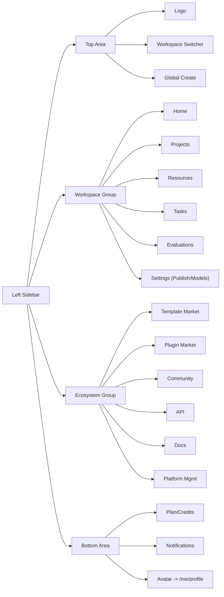

# Coze 平台前端协议化重构 - 第一阶段（前端优先）

## A. 本轮范围（第一批，仅前端）

按用户已确认的 6 项第一优先级：
1. 登录后默认首页（工作空间首页）
2. 左侧导航（12 项一级菜单 + 工作空间切换器 + 全局创建按钮 + 底部用户区）
3. 项目开发页（智能体 / 应用 / 项目 / 文件夹的统一卡片列表）
4. 创建文件夹 / 创建智能体 / 创建应用三个弹窗
5. 空间配置页（发布管理 4 子 Tab + 模型管理 + 旧"成员/权限"作为子页留存）
6. 个人主页入口与设置弹窗（账号 / 通用设置 / 发布渠道 / 数据源 4 子页）

不改：后台代码、数据库、`.csproj`、Workflow / Chatflow 编辑器、AddWorkflow 弹窗、Agent 编辑器（这些列入第二批）。

## B. 关键技术决策（已确认）

- **路由**：扁平化 `/workspace/:workspaceId/...`（无 orgId 层）；旧 `/org/:orgId/workspaces/:workspaceId/...` 保留为 301 重定向，菜单不再使用。
- **Mock 范围**：仅对真没有后台的 12 类新对象走 mock；其余复用现有真实接口。
- **Shell 容器**：复用 `CozeShell`（[`src/frontend/packages/coze-shell-react/src/coze-shell.tsx`](src/frontend/packages/coze-shell-react/src/coze-shell.tsx)），重写 `navSections`。
- **页面内核**：项目开发页内部聚合复用 `module-studio-react` 的 `AssistantsPage / AppsPage`；空间配置页复用 `PublishCenterPage / ModelConfigsPage`。
- **i18n**：所有文案走 `useAppI18n()`（[`src/frontend/apps/app-web/src/app/i18n.tsx`](src/frontend/apps/app-web/src/app/i18n.tsx)），同步增删 `zh-CN.ts` 与 `en-US.ts`。

## C. 路由与菜单映射表（前端落地版）

### C.1 一级路由（PRD 风格扁平 + 向后兼容跳转）

- `/login` 登录页（沿用 `LoginPage`）
- `/` 根入口：登录态 → `/workspace/:wsId/home`；未登录 → `/login`
- `/select-workspace` 工作空间选择页（首次登录或多空间）
- `/workspace/:workspaceId/home` 工作空间首页
- `/workspace/:workspaceId/projects` 项目开发
- `/workspace/:workspaceId/projects/folder/:folderId` 文件夹详情
- `/workspace/:workspaceId/resources` 资源库
- `/workspace/:workspaceId/resources/:type` 资源库子页（workflows/chatflows/plugins/knowledge/databases/variables/prompts/chatflows）
- `/workspace/:workspaceId/tasks` 任务中心
- `/workspace/:workspaceId/evaluations` 效果评测
- `/workspace/:workspaceId/settings/publish` 空间配置-发布管理（默认）
- `/workspace/:workspaceId/settings/publish/{agents|apps|workflows|channels}` 发布二级 Tab
- `/workspace/:workspaceId/settings/models` 模型管理
- `/market/templates` 模板商店
- `/market/plugins` 插件商店
- `/community/works` 作品社区
- `/open/api` API 管理
- `/docs` 文档中心（默认 redirect 到 `/docs/welcome`）
- `/platform/general` 通用管理
- `/me/profile` 个人主页
- `/me/settings/{account|general|channels|datasource}` 个人设置 4 子页
- `/agent/:agentId/editor` 智能体编辑器（占位，第二批）
- `/app/:projectId/editor` 应用编辑器（占位，第二批）
- `/workflow/:workflowId/editor` 工作流编辑器（占位，第二批）
- `/chatflow/:chatflowId/editor` 对话流编辑器（占位，第二批）

### C.2 兼容重定向

- `/org/:orgId/workspaces` → `/select-workspace`
- `/org/:orgId/workspaces/:wsId` → `/workspace/:wsId/home`
- `/org/:orgId/workspaces/:wsId/dashboard` → `/workspace/:wsId/home`
- `/org/:orgId/workspaces/:wsId/develop` → `/workspace/:wsId/projects`
- `/org/:orgId/workspaces/:wsId/develop/publish-center` → `/workspace/:wsId/settings/publish`
- `/org/:orgId/workspaces/:wsId/develop/model-configs` → `/workspace/:wsId/settings/models`
- `/org/:orgId/workspaces/:wsId/library` → `/workspace/:wsId/resources`
- `/org/:orgId/workspaces/:wsId/manage` → `/platform/general`
- `/org/:orgId/workspaces/:wsId/settings/*` → `/workspace/:wsId/settings/publish`
- `/apps/:appKey/*` → 已有 `LegacyAppRedirectRoute` 继续保留

### C.3 一级菜单结构（12 项 + 底部用户区）



## D. 第一批必须修改/新增的前端文件

### D.1 新增文件（共 19 个）

- 路由与菜单配置：
  - [`src/frontend/packages/app-shell-shared/src/workspace-routes.ts`](src/frontend/packages/app-shell-shared/src/workspace-routes.ts) — 新 PRD 风格 path helper（`workspaceHomePath / workspaceProjectsPath / workspaceSettingsPublishPath / workspaceSettingsModelsPath / marketTemplatesPath / docsPath / meProfilePath / meSettingsPath` 等）
  - [`src/frontend/apps/app-web/src/app/menu-config.ts`](src/frontend/apps/app-web/src/app/menu-config.ts) — 12 项一级菜单 + 权限点单一来源
  - [`src/frontend/apps/app-web/src/app/permission-context.tsx`](src/frontend/apps/app-web/src/app/permission-context.tsx) — `UserPermissionContext`（workspaceRole + permissions）
  - [`src/frontend/apps/app-web/src/app/route-guards.tsx`](src/frontend/apps/app-web/src/app/route-guards.tsx) — 路由守卫 + 工作空间上下文加载

- 顶层 Shell：
  - [`src/frontend/apps/app-web/src/app/layouts/workspace-shell.tsx`](src/frontend/apps/app-web/src/app/layouts/workspace-shell.tsx) — 包 `CozeShell`，注入 12 项菜单 + 工作空间切换器 + 全局创建按钮 + 底部用户区

- 一级页面（每个文件即一个一级菜单页）：
  - [`src/frontend/apps/app-web/src/app/pages/workspace-home-page.tsx`](src/frontend/apps/app-web/src/app/pages/workspace-home-page.tsx) — Banner + 教程 + 公告 + 推荐 + 最近使用
  - [`src/frontend/apps/app-web/src/app/pages/workspace-projects-page.tsx`](src/frontend/apps/app-web/src/app/pages/workspace-projects-page.tsx) — 智能体/应用/文件夹统一卡片列表 + 搜索 + 筛选 + 创建
  - [`src/frontend/apps/app-web/src/app/pages/workspace-tasks-page.tsx`](src/frontend/apps/app-web/src/app/pages/workspace-tasks-page.tsx) — 占位（mock）
  - [`src/frontend/apps/app-web/src/app/pages/workspace-evaluations-page.tsx`](src/frontend/apps/app-web/src/app/pages/workspace-evaluations-page.tsx) — 占位（mock）
  - [`src/frontend/apps/app-web/src/app/pages/workspace-settings-publish-page.tsx`](src/frontend/apps/app-web/src/app/pages/workspace-settings-publish-page.tsx) — 4 子 Tab（智能体/应用/工作流/发布渠道）
  - [`src/frontend/apps/app-web/src/app/pages/workspace-settings-models-page.tsx`](src/frontend/apps/app-web/src/app/pages/workspace-settings-models-page.tsx) — 复用 `ModelConfigsPage`
  - [`src/frontend/apps/app-web/src/app/pages/market-templates-page.tsx`](src/frontend/apps/app-web/src/app/pages/market-templates-page.tsx) — 占位 + 链接现有 `ExploreTemplatesPage`
  - [`src/frontend/apps/app-web/src/app/pages/market-plugins-page.tsx`](src/frontend/apps/app-web/src/app/pages/market-plugins-page.tsx) — 占位 + 链接现有 `ExplorePluginsPage`
  - [`src/frontend/apps/app-web/src/app/pages/community-works-page.tsx`](src/frontend/apps/app-web/src/app/pages/community-works-page.tsx) — 占位（mock）
  - [`src/frontend/apps/app-web/src/app/pages/open-api-page.tsx`](src/frontend/apps/app-web/src/app/pages/open-api-page.tsx) — 占位（mock）
  - [`src/frontend/apps/app-web/src/app/pages/docs-page.tsx`](src/frontend/apps/app-web/src/app/pages/docs-page.tsx) — iframe 或 redirect welcome
  - [`src/frontend/apps/app-web/src/app/pages/platform-general-page.tsx`](src/frontend/apps/app-web/src/app/pages/platform-general-page.tsx) — 占位（mock）
  - [`src/frontend/apps/app-web/src/app/pages/me-profile-page.tsx`](src/frontend/apps/app-web/src/app/pages/me-profile-page.tsx) — 用户主页 + 触发 SettingsModal
  - [`src/frontend/apps/app-web/src/app/pages/me-settings-page.tsx`](src/frontend/apps/app-web/src/app/pages/me-settings-page.tsx) — 设置弹窗式 4 子页

- 公共组件：
  - [`src/frontend/apps/app-web/src/app/components/workspace-switcher.tsx`](src/frontend/apps/app-web/src/app/components/workspace-switcher.tsx) — 顶部工作空间下拉
  - [`src/frontend/apps/app-web/src/app/components/global-create-modal.tsx`](src/frontend/apps/app-web/src/app/components/global-create-modal.tsx) — 创建智能体 / 创建应用 入口面板
  - [`src/frontend/apps/app-web/src/app/components/create-folder-modal.tsx`](src/frontend/apps/app-web/src/app/components/create-folder-modal.tsx) — 文件夹弹窗
  - [`src/frontend/apps/app-web/src/app/components/create-agent-modal.tsx`](src/frontend/apps/app-web/src/app/components/create-agent-modal.tsx) — 智能体弹窗（标准/AI 双 Tab）
  - [`src/frontend/apps/app-web/src/app/components/create-app-modal.tsx`](src/frontend/apps/app-web/src/app/components/create-app-modal.tsx) — 应用弹窗

- Mock 服务层（草案 = 后端最终契约）：
  - [`src/frontend/apps/app-web/src/services/mock/api-home-content.mock.ts`](src/frontend/apps/app-web/src/services/mock/api-home-content.mock.ts)
  - [`src/frontend/apps/app-web/src/services/mock/api-folders.mock.ts`](src/frontend/apps/app-web/src/services/mock/api-folders.mock.ts)
  - [`src/frontend/apps/app-web/src/services/mock/api-tasks.mock.ts`](src/frontend/apps/app-web/src/services/mock/api-tasks.mock.ts)
  - [`src/frontend/apps/app-web/src/services/mock/api-evaluations.mock.ts`](src/frontend/apps/app-web/src/services/mock/api-evaluations.mock.ts)
  - [`src/frontend/apps/app-web/src/services/mock/api-publish-channels.mock.ts`](src/frontend/apps/app-web/src/services/mock/api-publish-channels.mock.ts)
  - [`src/frontend/apps/app-web/src/services/mock/api-templates-market.mock.ts`](src/frontend/apps/app-web/src/services/mock/api-templates-market.mock.ts)
  - [`src/frontend/apps/app-web/src/services/mock/api-community.mock.ts`](src/frontend/apps/app-web/src/services/mock/api-community.mock.ts)
  - [`src/frontend/apps/app-web/src/services/mock/api-platform-general.mock.ts`](src/frontend/apps/app-web/src/services/mock/api-platform-general.mock.ts)
  - [`src/frontend/apps/app-web/src/services/mock/api-me-settings.mock.ts`](src/frontend/apps/app-web/src/services/mock/api-me-settings.mock.ts)
  - [`src/frontend/apps/app-web/src/services/mock/index.ts`](src/frontend/apps/app-web/src/services/mock/index.ts) — 统一导出 + `MockSwitch` 注入策略
  - [`docs/mock-api-protocols.md`](docs/mock-api-protocols.md) — 协议说明文档（即后端实现依据）

### D.2 修改文件（共 6 个）

- [`src/frontend/apps/app-web/src/app/app.tsx`](src/frontend/apps/app-web/src/app/app.tsx) — 重写 `appRoutes`（新加 `/workspace/:workspaceId/*`、`/me/*`、`/market/*`、`/community/*`、`/open/*`、`/docs`、`/platform/general`、`/select-workspace`），保留旧 `/org/...` → 重定向；用 `WorkspaceShellLayout` 替换 `WorkspaceShellRoute` 中的 navSections
- [`src/frontend/apps/app-web/src/app/pages/home-page.tsx`](src/frontend/apps/app-web/src/app/pages/home-page.tsx) — 改为纯 gateway：选最近访问 workspace → `Navigate to /workspace/:wsId/home`
- [`src/frontend/apps/app-web/src/app/workspace-context.tsx`](src/frontend/apps/app-web/src/app/workspace-context.tsx) — `WorkspaceProvider` 不强依赖 `orgId`，自动从用户上下文/`getWorkspaces()` 反查 `orgId`
- [`src/frontend/packages/app-shell-shared/src/index.ts`](src/frontend/packages/app-shell-shared/src/index.ts) — 增加 `export * from "./workspace-routes"`
- [`src/frontend/apps/app-web/src/app/i18n.tsx`](src/frontend/apps/app-web/src/app/i18n.tsx) 与 [`src/frontend/apps/app-web/src/app/messages.ts`](src/frontend/apps/app-web/src/app/messages.ts) — 新增第一批 ~80 个文案 key（`coze.home.*`、`coze.menu.*`、`coze.projects.*`、`coze.settings.*`、`coze.create.*`、`coze.me.*`），中英对齐

### D.3 旧文件保留不删

- [`src/frontend/apps/app-web/src/app/pages/workspace-settings-page.tsx`](src/frontend/apps/app-web/src/app/pages/workspace-settings-page.tsx)：作为通用管理 / 平台管理子页保留（成员/权限），从主菜单移除入口

## E. Mock API 协议表（草案 = 后端最终契约）

所有 mock 都满足现有 `ApiResponse<T>` 信封 + `PagedResult<T>` 分页规范，强类型 TypeScript 接口，禁止 `any`。下列每条都将在 [`docs/mock-api-protocols.md`](docs/mock-api-protocols.md) 完整定义 path / method / 入参 / 出参 / list shape / detail shape / error shape。

### E.1 工作空间首页相关（新增）

- `GET /api/v1/workspaces/{workspaceId}/home/banner` → `{ heroTitle, heroSubtitle, ctaList[] }`
- `GET /api/v1/workspaces/{workspaceId}/home/tutorials` → `TutorialCard[]`（id, title, description, icon, link）
- `GET /api/v1/workspaces/{workspaceId}/home/announcements?tab=all|notice` → `Paged<AnnouncementItem>`
- `GET /api/v1/workspaces/{workspaceId}/home/recommended-agents` → `RecommendedAgentItem[]`
- `GET /api/v1/workspaces/{workspaceId}/home/recent-activities` → `RecentActivityItem[]`（agent/app/workflow 三类，currentUser + workspaceId 维度）

### E.2 项目开发文件夹（新增）

- `GET /api/v1/workspaces/{workspaceId}/folders` → `Paged<FolderListItem>`
- `POST /api/v1/workspaces/{workspaceId}/folders` body `{ name, description? }` → `{ folderId }`
- `PATCH /api/v1/workspaces/{workspaceId}/folders/{folderId}` → 重命名/移动
- `DELETE /api/v1/workspaces/{workspaceId}/folders/{folderId}`
- `POST /api/v1/workspaces/{workspaceId}/folders/{folderId}/items` body `{ itemType, itemId }` → 移入文件夹

### E.3 任务中心（新增）

- `GET /api/v1/workspaces/{workspaceId}/tasks?status=&type=&pageIndex&pageSize` → `Paged<TaskItem>`
- `GET /api/v1/workspaces/{workspaceId}/tasks/{taskId}` → `TaskDetail`（含执行日志 + 结果）

### E.4 效果评测（新增）

- `GET /api/v1/workspaces/{workspaceId}/evaluations` → `Paged<EvaluationItem>`
- `GET /api/v1/workspaces/{workspaceId}/testsets` → `Paged<TestsetItem>`
- `POST /api/v1/workspaces/{workspaceId}/testsets` → 创建测试集（第二批补 UI）
- `GET /api/v1/workspaces/{workspaceId}/evaluations/{evaluationId}` → `EvaluationDetail`

### E.5 发布渠道（新增）

- `GET /api/v1/workspaces/{workspaceId}/publish-channels` → `Paged<PublishChannelItem>`（id, name, type, status, authStatus, lastSyncAt）
- `POST /api/v1/workspaces/{workspaceId}/publish-channels` → 新增渠道
- `PATCH /api/v1/workspaces/{workspaceId}/publish-channels/{channelId}` → 编辑/启停
- `POST /api/v1/workspaces/{workspaceId}/publish-channels/{channelId}/reauth` → 重新授权
- `DELETE /api/v1/workspaces/{workspaceId}/publish-channels/{channelId}`

发布管理-智能体/应用/工作流三个 Tab：直接复用 `getAiAssistantPublications` / `getAiAppPublishRecords` / `listWorkflows(status=published)`，无需 mock。

### E.6 模板商店 / 作品社区 / API 管理 / 通用管理（新增 + 部分复用）

- `GET /api/v1/market/templates?category=&keyword=&pageIndex&pageSize` → 复用 `getTemplatesPaged`
- `GET /api/v1/market/plugins` → 复用 `getMarketplaceProductsPaged`
- `GET /api/v1/community/works` → mock `Paged<CommunityWorkItem>`
- `GET /api/v1/open/api-keys` / `POST /api/v1/open/api-keys` → mock `ApiKeyItem`
- `GET /api/v1/platform/general/notices` → mock `PlatformNoticeItem[]`

### E.7 个人主页与设置（新增）

- `GET /api/v1/me/profile` → 复用现有 `getProfile`
- `PATCH /api/v1/me/profile` → 复用现有 `saveProfile`
- `POST /api/v1/me/password` → 复用现有 `savePassword`
- `GET /api/v1/me/settings/general` → mock `{ locale, theme, defaultWorkspaceId, ... }`
- `PATCH /api/v1/me/settings/general` → mock 写入
- `GET /api/v1/me/settings/publish-channels` → mock 用户级渠道列表（区别于工作空间级）
- `GET /api/v1/me/settings/datasources` → mock 数据源列表
- `DELETE /api/v1/me/account` → mock 占位

### E.8 错误信封（统一）

```ts
interface MockApiError {
  code: "VALIDATION_ERROR" | "UNAUTHORIZED" | "FORBIDDEN" | "NOT_FOUND" | "SERVER_ERROR";
  message: string;
  traceId: string;
  details?: Record<string, string[]>;
}
```

## F. 当前完成度（仅前端，0 行后端）

- 路由：0 / 25（待第一批落地）
- 一级菜单：0 / 12
- 一级页面：0 / 14（含 `/me/*` 与 `/select-workspace`）
- 创建弹窗：0 / 4（global-create / folder / agent / app）
- Mock 服务：0 / 9 个文件 + 1 份协议文档

## G. 下一批前端优先项（第二阶段，本计划批准并交付第一批之后再启动）

- 智能体编辑器：复用 `AgentWorkbench` / `BotIdePage` 嵌入到新路由 `/agent/:agentId/editor`
- 应用编辑器：复用 `AppDetailPage` 嵌入到新路由 `/app/:projectId/editor`
- 添加工作流弹窗：新建 `add-workflow-modal.tsx`，左侧"创建工作流 / 创建对话流 / 导入 / 资源库工作流"四来源
- 创建工作流 / 创建对话流弹窗：新建 `create-workflow-modal.tsx`、`create-chatflow-modal.tsx`
- 工作流编辑器骨架：复用 `@coze-workflow/playground-adapter` 的 `WorkflowPage` 嵌入到新路由 `/workflow/:workflowId/editor`、`/chatflow/:chatflowId/editor`
- 测试集面板：新建 `testset-drawer.tsx`，对接 `/api/v1/workspaces/{wsId}/testsets`
- 资源库子页全量、文档中心 welcome 页、个人通知页

## H. 第三阶段后台契约预告（不在本轮范围）

按 mock API 协议表逐对象落地：
- `Atlas.AppHost/Controllers/HomeContentController.cs`
- `Atlas.AppHost/Controllers/FoldersController.cs`
- `Atlas.AppHost/Controllers/TasksController.cs`
- `Atlas.AppHost/Controllers/EvaluationsController.cs`
- `Atlas.AppHost/Controllers/PublishChannelsController.cs`
- `Atlas.AppHost/Controllers/CommunityController.cs`
- `Atlas.AppHost/Controllers/PlatformGeneralController.cs`
- `Atlas.AppHost/Controllers/MeSettingsController.cs`

每个 Controller 都对齐已发布的 mock 协议（path / DTO / Response / 错误码）。每个端点同步 `.http` 文件 + `docs/contracts.md`。

## I. 验证策略

- 每完成 1 个页面：手测路由可达 + 弹窗可点 + 列表渲染 + 切换工作空间数据刷新
- 第一批整体完成后执行：`pnpm run lint`、`pnpm run build:app-web`、`pnpm run i18n:check`、`pnpm run test:unit`
- 不强求 dotnet 构建（本批不动后端）

## J. 风险与依赖

- `WorkspaceContext` 去 orgId 化：需要保证当前 `getWorkspaces()` 能在用户上下文下返回多空间列表，否则 `/select-workspace` 退化
- `module-studio-react` 内部 `AssistantsPage` / `AppsPage` 当前是分页+卡片，二者拼到一个"项目开发"页时分页要重做（建议第一批先 Tab 化呈现，二期再做混合分页）
- 旧路由 301 重定向需要兜底所有现存外链：本计划已枚举 8 条，遗漏的走 `path: "*"` 兜底回 `/`