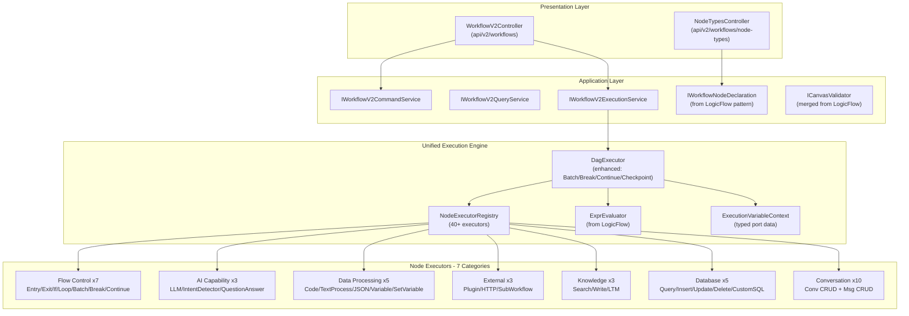

# Coze 工作流 40+ 节点全量复刻 — 详细实施计划

---

## 一、现状与目标

### 已有基础

**V2 引擎（16 个执行器已实现）**
- 流程控制: Entry, Exit, Selector(If), Loop
- AI: LLM, Agent
- 数据处理: CodeRunner, TextProcessor, JsonSerialization, JsonDeserialization, AssignVariable, VariableAggregator
- 外部交互: Plugin, HttpRequester, SubWorkflow
- 数据库: DatabaseQuery（占位）

**LogicFlow 引擎（可复用能力）**
- ExprEvaluator + 7 类内置函数库
- FlowValidator（端口校验 + 环检测）
- INodeCapabilityDeclaration 节点元数据声明体系

**前端已有**
- WorkflowListPage（列表 + 创建 + 调试区）
- WorkflowEditorPage（VueFlow 画布 + NodePanel + PropertiesPanel + TestRunPanel）
- api-workflow.ts / workflow-v2.ts 类型

### 需新增

- 后端: ~24 个节点执行器 + 引擎增强（Batch/Break/Continue/Checkpoint）+ 元数据体系
- 前端: 40+ 节点表单组件 + 画布增强 + 调试视图 + 版本管理

---

## 二、总体架构



详细的前端可视化设计、菜单设计、页面说明和线框图见 **v2 计划文件**（`coze工作流全量复刻v2_ac389269.plan.md`）。

以下为 v2 计划的补充说明——**前端深度可视化设计规范**。

---

## 三、工作流画布可视化设计规范（对标 Coze）

### 3.1 画布节点卡片设计

**节点卡片结构**（参考 Coze `node-render-new`）:

```
+--[执行状态条]------------------------------------+
| [渐变色背景 Header]                              |
| [24x24图标] [节点类型名]  [...更多菜单] [单测▶]  |
+--------------------------------------------------+
| [内容区 Content - 两列网格]                       |
| 标签(灰)     | 值(主色)                          |
| 模型:        | GPT-4o [16x16头像]                 |
| Prompt:      | "你是一个助手..."                  |
| 输出格式:    | JSON                              |
+--------------------------------------------------+
| [输入端口●]                    [输出端口●]        |
+--------------------------------------------------+
   [执行结果悬浮条 - 节点底部外 +8px]
   ● 成功 3.1s  [Token: $0.003]
```

**视觉参数**:
- 卡片宽度: **360px** 固定
- 圆角: **8px**
- 边框: **1px solid** + 轻阴影
- Header: 节点分类色 **8% 透明度渐变** → 白色背景
- 内容区: **12px** 内边距，两列网格（标签列 auto | 内容列 1fr），行间距 **6px**
- 标签: **12px**, `font-weight: 500`, 灰色右对齐
- 内容: **12px**, 主色

**7 大类分类色** (参考 Coze mainColor):

```
流程控制:  #6366F1 (靛蓝)  - Start/End/If/Loop/Batch/Break/Continue
AI 能力:   #8B5CF6 (紫色)  - LLM/IntentDetector/QuestionAnswer
数据处理:  #06B6D4 (青色)  - Code/TextProcessor/JSON/Variable/SetVariable
外部交互:  #F59E0B (琥珀)  - Plugin/HTTPRequest/SubWorkflow
知识库:    #10B981 (翠绿)  - DatasetSearch/DatasetWrite/LTM
数据库:    #3B82F6 (蓝色)  - Query/Insert/Update/Delete/CustomSQL
对话管理:  #EC4899 (粉色)  - 10个Conversation/Message节点
I/O:       #EF4444 (红色)  - OutputEmitter/InputReceiver
```

**端口(Port)设计**:
- 尺寸: 外层 **20x20** 圆形触控区，内层 **10x10** 实心圆
- 默认色: `#9197F1`, 连线/hover: `#4D53E8`, 错误: 红色
- 输入端口: 节点左侧中央，不可主动拉线
- 输出端口: 节点右侧，可拖拽出线 / 点击弹出加节点面板
- If/Selector 节点: 多个输出端口（true/false/else），垂直排列在右侧

**选中/执行状态**:

```
设计态-默认:     1px 灰色边框
设计态-选中:     2px #4E40E5 高亮边框
执行态-等待:     1px 灰色虚线边框 + 灰色底色
执行态-运行中:   2px #4E40E5 边框 + 呼吸动画(opacity 0.6~1 循环)
执行态-成功:     2px #10B981 绿色边框
执行态-失败:     2px #EF4444 红色边框
执行态-跳过:     1px 灰色虚线 + 50% 透明度
```

### 3.2 各类型节点画布内联预览

**LLM 节点**:
```
+--[紫色渐变Header]------------------------------+
| 🤖 LLM                            [...] [▶]    |
+-------------------------------------------------+
| 模型:      | GPT-4o [头像]                       |
| Prompt:    | "你是一个专业的..."  (单行截断)      |
| 输出格式:  | JSON                                |
| ● input                           output ●      |
+-------------------------------------------------+
```

**If/条件判断 节点** (多分支端口):
```
+--[靛蓝渐变Header]------------------------------+
| ⑂ 条件判断                        [...] [▶]    |
+-------------------------------------------------+
| If:        | score > 80           ● true         |
| Else if:   | score > 60           ● elif_1       |
| [AND/OR分割线]                                   |
| Else:      | [————————]           ● false        |
| ● input                                         |
+-------------------------------------------------+
```

**Loop 节点** (含子画布边界):
```
+--[靛蓝渐变Header]------------------------------+
| 🔄 循环                           [...] [▶]    |
+-------------------------------------------------+
| 模式:      | 数组遍历                            |
| 数组:      | items                               |
| ● input                           output ●      |
+-------------------------------------------------+
| +-----[子画布区域 点阵背景]-----+               |
| | min 400x300                     |               |
| | [子节点在这里自由排布]          |               |
| | Tips: Ctrl拖出子画布            |               |
| +--------------------------------+               |
+-------------------------------------------------+
```

**HTTP Request 节点**:
```
+--[琥珀渐变Header]------------------------------+
| 🌐 HTTP 请求                      [...] [▶]    |
+-------------------------------------------------+
| POST       | https://api.example.com/data        |
| ● input                           output ●      |
+-------------------------------------------------+
```

**Database Query 节点**:
```
+--[蓝色渐变Header]------------------------------+
| 🗄️ 数据查询                       [...] [▶]    |
+-------------------------------------------------+
| 数据库:    | 业务库 (MySQL)                      |
| 字段:      | name, email, age                    |
| 条件:      | age > 18 AND status = 'active'      |
| ● input                           output ●      |
+-------------------------------------------------+
```

**对话管理节点** (以创建会话为例):
```
+--[粉色渐变Header]------------------------------+
| 💬 创建会话                        [...] [▶]    |
+-------------------------------------------------+
| Agent:     | 客服助手                            |
| 标题:      | {{user_name}}的会话                  |
| ● input                     conversation_id ●   |
+-------------------------------------------------+
```

### 3.3 连线(Edge)设计

**线型**: 贝塞尔曲线（默认）+ 可选折线模式
**线宽**: 默认 **2px**, 选中 **3px**
**颜色**: 起止端口色渐变；hover: `#4E40E5`; 错误: `#FF5DC8`
**执行态**: 虚线流动动画（`stroke-dasharray` + CSS animation）
**条件边标签**: If 节点输出边显示 `true`/`false`/`else` 小标签
**线上加节点按钮**:
```
  [节点A] ——————(+)—————— [节点B]
                 ↑
          24x24 圆形 + 号
          hover时显示, 点击弹出节点面板
          选中后自动拆线重连:
          [A]→[新节点]→[B]
```

### 3.4 画布交互设计

**拖放创建节点**: 从左侧 NodePanel 拖拽节点卡片 → 画布区域释放 → 创建节点
**端口连线**: 从输出端口拖拽到目标输入端口 → 创建连线（贝塞尔预览线跟随鼠标）
**端口点击加节点**: 点击输出端口 → 弹出节点选择面板(Popover) → 选择后自动连线
**子画布拖入**: 将节点拖入 Loop/Batch 的子画布区域 → 节点成为子画布成员
**子画布拖出**: 节点 Header 更多菜单 → "移出子画布" / Ctrl+拖拽移出
**对齐吸附**: 拖拽节点时自动吸附对齐线（颜色 `#00B2B2`），无独立对齐按钮
**快捷键**:
- `Ctrl+C/V`: 复制/粘贴节点
- `Delete/Backspace`: 删除选中
- `Ctrl+A`: 全选
- `Ctrl+Z/Y`: 撤销/重做
- `Ctrl++/-`: 缩放
- `Alt+Shift+F`: 自动布局
**小地图**: 右下角 minimap，可折叠，显示节点缩略色块 + 视口框

---

## 四、前端页面详细设计（扩展版，共 8 个页面/面板）

### 页面总览（增加 3 个支撑页面）

| 编号 | 页面 | 路由 | 宿主 | 状态 |
|------|------|------|------|------|
| P1 | 工作流列表页 | `/apps/:id/workflows` | platform + app | 已有，需增强 |
| P2 | 工作流编辑器 | `/apps/:id/workflows/:wfId/editor` | platform + app | 已有，需重构 |
| P3 | 数据库连接管理页 | `/apps/:id/workflow-databases` | platform + app | 新建 |
| P4 | 版本历史 Drawer | 编辑器内 | platform | 新建 |
| P5 | 试运行/调试面板 | 编辑器内 | platform + app | 增强 |
| P6 | AI数据库记录管理页 | `/apps/:id/ai-databases/:dbId` | platform | 新建 |
| P7 | 知识库详情页 | `/ai/knowledge-bases/:id` | platform | 新建 |
| P8 | 变量引用选择器 | 编辑器内组件 | platform + app | 新建 |

### P2 - 工作流编辑器（深度设计补充）

**编辑器完整线框图**:

```
+========================================================================+
| EditorToolbar                                                          |
| [<] [📝工作流名称___] [● 已保存 12:30]    [▶试运行] [📤发布v] [📋] [⚙]|
+========================================================================+
|  NodePanel  |        Canvas (VueFlow)              | PropertiesPanel   |
|  240px      |        flex-1                        | 360px (选中时)    |
|             |                                      | 0px (未选中)      |
| ┌─────────┐ |                                      |                   |
| │🔍搜索___│ |   ┌──────┐    ┌──────┐               | ┌───────────────┐ |
| └─────────┘ |   │Start │═══▶│ LLM  │═══╗           | │ 🤖 LLM       │ |
|             |   └──────┘    └──────┘   ║           | ├───────────────┤ |
| ▼ 流程控制  |                          ▼           | │ 模型          │ |
|   ┌──┐┌──┐ |               ┌────────┐              | │ [GPT-4o    v] │ |
|   │St││En│ |               │  If    │              | │               │ |
|   └──┘└──┘ |               └──┬──┬──┘              | │ System Prompt │ |
|   ┌──┐┌──┐ |                  │  │                 | │ ┌───────────┐ │ |
|   │If││Lp│ |          true┌───┘  └───┐false        | │ │你是一个专 │ │ |
|   └──┘└──┘ |              ▼          ▼             | │ │业的AI助手 │ │ |
|   ┌──┐┌──┐ |         ┌──────┐   ┌──────┐          | │ │{{context}} │ │ |
|   │Ba││Br│ |         │ Code │   │ HTTP │          | │ └───────────┘ │ |
|   └──┘└──┘ |         └──┬───┘   └──┬───┘          | │               │ |
|   ┌──┐     |            └────┬─────┘               | │ User Prompt   │ |
|   │Co│     |                 ▼                     | │ ┌───────────┐ │ |
|   └──┘     |            ┌──────┐                   | │ │回答用户的 │ │ |
|             |            │ End  │                   | │ │问题:       │ │ |
| ▼ AI 能力   |            └──────┘                   | │ │{{query}}   │ │ |
|   ┌──┐┌──┐ |                                      | │ └───────────┘ │ |
|   │LL││In│ |                                      | │               │ |
|   └──┘└──┘ |   ┌─小地图────┐                      | │ 输出格式      │ |
|   ┌──┐     |   │ ■ ■ □    │                      | │ (○)Text       │ |
|   │QA│     |   │  □ ■     │                      | │ (●)JSON       │ |
|   └──┘     |   │   [视口] │                      | │ (○)Markdown   │ |
|             |   └──────────┘                      | │               │ |
| ▼ 数据处理  |                                      | │ ▼ 高级设置    │ |
|   ┌──┐┌──┐ |   缩放 [- 100% +]                   | │ 对话历史: 5轮 │ |
|   │Cd││Tx│ |                                      | │ 备份模型: 无  │ |
|   └──┘└──┘ |                                      | │ 异常策略: 跳过│ |
|   ┌──┐┌──┐ |                                      | │               │ |
|   │JS││Va│ |                                      | │ [输入] [输出] │ |
|   └──┘└──┘ |                                      | │ query: string │ |
|   ┌──┐     |                                      | │ result: string│ |
|   │SV│     |                                      | └───────────────┘ |
|   └──┘     |                                      |                   |
|             |                                      |                   |
| ▼ 外部交互  |                                      |                   |
|   ┌──┐┌──┐ |                                      |                   |
|   │Pl││HT│ |                                      |                   |
|   └──┘└──┘ |                                      |                   |
|   ┌──┐     |                                      |                   |
|   │SW│     |                                      |                   |
|   └──┘     |                                      |                   |
|             |                                      |                   |
| ▼ 知识库    |                                      |                   |
|   ┌──┐┌──┐ |                                      |                   |
|   │Se││Wr│ |                                      |                   |
|   └──┘└──┘ |                                      |                   |
|   ┌──┐     |                                      |                   |
|   │LT│     |                                      |                   |
|   └──┘     |                                      |                   |
|             |                                      |                   |
| ▼ 数据库    |                                      |                   |
|   ┌──┐┌──┐ |                                      |                   |
|   │Qu││In│ |                                      |                   |
|   └──┘└──┘ |                                      |                   |
|   ┌──┐┌──┐ |                                      |                   |
|   │Up││De│ |                                      |                   |
|   └──┘└──┘ |                                      |                   |
|   ┌──┐     |                                      |                   |
|   │SQ│     |                                      |                   |
|   └──┘     |                                      |                   |
|             |                                      |                   |
| ▼ 对话管理  |                                      |                   |
|   ┌──┐┌──┐ |                                      |                   |
|   │CC││CL│ |  (10个节点, 2列网格)                 |                   |
|   └──┘└──┘ |                                      |                   |
|   ┌──┐┌──┐ |                                      |                   |
|   │CU││CD│ |                                      |                   |
|   └──┘└──┘ |                                      |                   |
|   ┌──┐┌──┐ |                                      |                   |
|   │CH││HI│ |                                      |                   |
|   └──┘└──┘ |                                      |                   |
|   ┌──┐┌──┐ |                                      |                   |
|   │ML││CM│ |                                      |                   |
|   └──┘└──┘ |                                      |                   |
|   ┌──┐┌──┐ |                                      |                   |
|   │EM││DM│ |                                      |                   |
|   └──┘└──┘ |                                      |                   |
|             |                                      |                   |
| ▼ 输出/输入 |                                      |                   |
|   ┌──┐┌──┐ |                                      |                   |
|   │Ou││In│ |                                      |                   |
|   └──┘└──┘ |                                      |                   |
+─────────────+──────────────────────────────────────+───────────────────+
| DebugPanel (底部, 默认折叠, 展开高度 200px)                            |
| [▲折叠] [执行日志] [变量] [清除]   筛选: [全部节点 v] [全部事件 v]    |
| 12:30:01.123 | Entry    | start    | 开始执行入口                     |
| 12:30:01.135 | LLM_1    | start    | 模型: GPT-4o, tokens: 150       |
| 12:30:03.456 | LLM_1    | stream   | 流式输出: "你好，我是..."        |
| 12:30:03.789 | LLM_1    | end      | 完成 2.654s, tokens: 203        |
| 12:30:03.801 | If_1     | branch   | 条件: score>80 → true           |
+========================================================================+
```

### P2 补充: 变量引用选择器组件 (P8)

**变量引用选择器**（嵌入所有节点表单中的 Prompt/模板/表达式输入框）:

```
模板输入框 (支持 {{变量}} 语法):
┌─────────────────────────────────────────┐
│ 你好，{{user_name}}，你的查询结果是:    │
│ {{LLM_1.output.result}}                 │  ← 变量高亮为蓝色Tag
│                                         │
│ 点击 {{ 或 / 触发:                      │
│ ┌─────────────────────┐                 │
│ │ 🔍 搜索变量...       │                 │
│ ├─────────────────────┤                 │
│ │ ▼ 工作流输入         │                 │
│ │   query      string │                 │
│ │   max_tokens number │                 │
│ │ ▼ Start 节点输出     │                 │
│ │   query      string │                 │
│ │ ▼ LLM_1 输出        │                 │
│ │   result     string │                 │
│ │   usage      object │                 │
│ │ ▼ If_1 输出          │                 │
│ │   selected   boolean│                 │
│ │ ▼ 系统变量           │                 │
│ │   sys.datetime       │                 │
│ │   sys.user_id        │                 │
│ └─────────────────────┘                 │
└─────────────────────────────────────────┘
```

**交互**: 输入 `{{` 触发下拉 → 按节点分组的变量树 → 选择后插入 `{{节点Key.output.字段名}}`

### P6 - AI 数据库记录管理页 (新增)

**说明**: 后端 API 已有 (`api/v1/ai-databases`)，前端缺失。支撑数据库节点的数据源配置与记录浏览。

```
+--------------------------------------------------------------------+
| [< 返回]  数据库: 业务库 (MySQL)       [刷新] [导入] [设置]        |
+--------------------------------------------------------------------+
| Tab: [表结构] [数据浏览] [连接设置]                                  |
+--------------------------------------------------------------------+
| 表结构 Tab:                                                          |
| 表列表:                                                              |
| ┌──────────┐  表: users                                             |
| │ users    │  ┌──────────┬──────────┬──────┬─────────┐              |
| │ orders   │  │ 列名     │ 类型     │ 可空 │ 主键    │              |
| │ products │  ├──────────┼──────────┼──────┼─────────┤              |
| │ ...      │  │ id       │ INT      │ NO   │ PK      │              |
| └──────────┘  │ name     │ VARCHAR  │ NO   │         │              |
|               │ email    │ VARCHAR  │ YES  │         │              |
|               │ age      │ INT      │ YES  │         │              |
|               └──────────┴──────────┴──────┴─────────┘              |
+--------------------------------------------------------------------+
| 数据浏览 Tab:                                                        |
| [搜索___________] [筛选条件...] [+ 新增记录] [批量删除]              |
| ┌────┬──────────┬─────────────┬─────┬────────┐                      |
| │ id │ name     │ email       │ age │ 操作   │                      |
| ├────┼──────────┼─────────────┼─────┼────────┤                      |
| │ 1  │ 张三     │ zs@test.com │ 28  │ 编辑|删│                      |
| │ 2  │ 李四     │ ls@test.com │ 32  │ 编辑|删│                      |
| └────┴──────────┴─────────────┴─────┴────────┘                      |
| 分页: [< 1 2 3 ... >]                                               |
+--------------------------------------------------------------------+
```

### P7 - 知识库详情页 (新增)

**说明**: 当前只有列表页，缺详情/文档/检索测试。支撑知识库节点的数据源管理。

```
+--------------------------------------------------------------------+
| [< 返回]  知识库: 产品文档库            [上传文档] [检索测试] [设置] |
+--------------------------------------------------------------------+
| Tab: [文档列表] [检索配置] [检索测试]                                |
+--------------------------------------------------------------------+
| 文档列表 Tab:                                                        |
| ┌──────────────┬──────────┬────────┬─────────┬────────┐             |
| │ 文档名称     │ 状态     │ 分块数 │ 更新时间│ 操作   │             |
| ├──────────────┼──────────┼────────┼─────────┼────────┤             |
| │ 用户手册.pdf │ ✓ 已索引 │ 156    │ 04-10   │ 重建|删│             |
| │ FAQ.md       │ ✓ 已索引 │ 42     │ 04-09   │ 重建|删│             |
| │ API文档.docx │ ⟳ 处理中 │ --     │ 04-10   │ 取消   │             |
| └──────────────┴──────────┴────────┴─────────┴────────┘             |
+--------------------------------------------------------------------+
| 上传弹窗:                                                            |
| ┌────────────────────────────────────┐                               |
| │ 上传文档                    [X]    │                               |
| │ [拖拽文件到此处或点击上传]         │                               |
| │ 支持: PDF, DOCX, MD, TXT, HTML    │                               |
| │ 解析策略: [自动检测 v]             │                               |
| │ 分块策略: [按段落 v] 大小: [500]   │                               |
| │ 重叠: [50] 字符                    │                               |
| │            [取消] [开始上传]        │                               |
| └────────────────────────────────────┘                               |
+--------------------------------------------------------------------+
| 检索测试 Tab:                                                        |
| 查询: [输入测试问题_______________] [检索]                           |
| 策略: [混合检索 v]  TopK: [5]  最低分: [0.5]                        |
| ┌──────────────────────────────────────┐                             |
| │ #1 相关度: 0.92  来源: 用户手册.pdf   │                             |
| │ "Atlas 安全平台支持多租户隔离..."     │                             |
| ├──────────────────────────────────────┤                             |
| │ #2 相关度: 0.85  来源: FAQ.md         │                             |
| │ "如何配置 RBAC 权限..."              │                             |
| └──────────────────────────────────────┘                             |
+--------------------------------------------------------------------+
```

### P5 补充: 执行态画布交互设计

**执行态实时渲染(SSE驱动)**:

```
执行开始:  所有节点变为灰色虚线边框（等待态）

逐节点执行:
  ┌──────┐    ┌──────┐    ┌────────┐
  │Start │═══▶│ LLM  │═══▶│  If    │
  │ ✓ ✓  │    │ ⟳    │    │ ○ ○    │
  │ 0.01s│    │ 2.3s │    │        │
  └──────┘    └──────┘    └────────┘
  绿色边框    蓝色呼吸     灰色等待

  边上流动动画:
  [Start] ═══●═══●═══▶ [LLM]     (蓝色圆点从左到右流动)
  
  LLM 节点底部状态条:
  ┌─────────────────────────────────────┐
  │ ⟳ Running... 2.3s  [Token: 150/203]│
  └─────────────────────────────────────┘

  LLM 流式输出实时预览:
  ┌──[紫色Header]──────────────────────┐
  │ 🤖 LLM                      ⟳     │
  ├────────────────────────────────────┤
  │ 输出预览:                          │
  │ "你好，我是AI助手，你的问题..."    │  ← SSE 逐字更新
  │ ▊                                 │  ← 光标闪烁
  └────────────────────────────────────┘

  Checkpoint 中断(QuestionAnswer/InputReceiver):
  ┌──────────────────────────────────────┐
  │ ❓ 问答                    ⏸ 等待输入│
  ├──────────────────────────────────────┤
  │ 问题: 请选择您的偏好                 │
  │ ○ 选项A: 简洁回答                   │
  │ ● 选项B: 详细回答                   │
  │ ○ 选项C: 分步指导                   │
  │                                      │
  │ [提交回答]                           │
  └──────────────────────────────────────┘

执行完成:  全部节点绿色/红色，边上流动停止
           底部 DebugPanel 自动展开显示完整日志
```

---

## 五、菜单设计补充

### Platform-web 完整菜单结构

```
ConsoleLayout 主侧栏 (Navigation Projection 动态):
├── 综合管理 (general)
│   ├── 控制台
│   └── 应用管理
├── 核心能力 (core)
│   ├── AI 中心
│   │   ├── 智能体
│   │   ├── 知识库          ← 增强: 详情页(P7)
│   │   ├── 模型配置
│   │   ├── 评测
│   │   ├── 插件
│   │   └── AI 数据库       ← 新增: 记录管理(P6)
│   └── 工作流
│       ├── 工作流编排      ← 核心: 编辑器(P2)
│       └── 数据库连接      ← 新增: 连接管理(P3)
├── 组织管理 (organization)
│   └── ...
└── 智能监控 (monitor)
    └── ...

AppWorkspaceLayout 应用侧栏 (写死 a-menu, 需扩展):
├── 仪表盘       dashboard
├── 页面管理     pages
├── 构建器       builder
├── 数据管理     data
├── 工作流       workflows      ← SubMenu 展开
│   ├── 工作流列表              /apps/:appId/workflows
│   └── 数据库连接              /apps/:appId/workflow-databases
├── 审批流       flows
└── 设置         settings
```

### App-web 完整菜单结构

```
AppSidebar (Navigation Projection 动态):
├── 工作台 (general)
│   └── 仪表盘
├── AI 能力 (ai)
│   ├── AI 助手
│   ├── 智能体管理
│   └── 知识库
├── 工作流 (workflow)            ← 替换 Placeholder
│   ├── 工作流管理              /apps/:appKey/workflows
│   └── 数据库连接              /apps/:appKey/workflow-databases
├── 数据管理 (data)
│   ├── 动态表
│   └── AI 数据库               ← 新增
├── 组织 (organization)
│   └── ...
└── 设置
