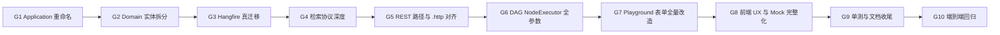

# 知识库平台 v5 — 100% 深度补齐计划

## 0. 审查依据与定性

参照 `[c:\Users\13522\.cursor\plans\knowledge-platform-v5_d90d0581.plan.md](c:\Users\13522\.cursor\plans\knowledge-platform-v5_d90d0581.plan.md)` 14 个 todo 的字面要求，5 路并行子代理审查后定性：仅 M1 / M13 接近完成；M9（Hangfire 完全没集成）、M10（hybrid weights / 真改写 / 真重排 / metadata filter / debug metadata 缺失）、M12（Filters: null 写死 / 无 CallerContextOverride / 无 ChunkingProfile / 无 append/overwrite / 无知识库节点单测）为严重功能缺口；M2–M8、M11、M14 含命名偏差与 UX/契约缺口。

按用户决策：
- **命名策略 = 严格重命名**（DTO/实体/路由/字段全部对齐计划字面）
- **playground 范围 = 全量改造**（dataset-search / dataset-write 完整支持 v5 参数 + 知识库节点单测）

## 1. 总体阶段（10 个 phase）

## 2. 关键缺口逐项映射（见每个 phase 详细列表）

### G1 — Application 重命名与契约补齐（M7 收口）
- `[KnowledgeStrategyModels.cs](src/backend/Atlas.Application/AiPlatform/Models/KnowledgeStrategyModels.cs)`
  - `KnowledgeBaseProviderKind` → `KnowledgeBaseProvider`（保留旧名 `[Obsolete]` typedef 一个版本）
  - 把 `KnowledgeDocumentLifecycleStatus` 从字符串 union 改为真正 `enum`，移到 `[DocumentModels.cs](src/backend/Atlas.Application/AiPlatform/Models/DocumentModels.cs)`
- `[KnowledgeJobModels.cs](src/backend/Atlas.Application/AiPlatform/Models/KnowledgeJobModels.cs)`
  - 新增 `ParseJobDto` / `IndexJobDto` / `RebuildJobDto` / `GcJobDto` 子类（继承 `KnowledgeJobDto` 或并列 record），保留 `KnowledgeJobDto` 作为 union 父
  - 新增 `ParseJobReplayRequest`、`IndexJobRebuildRequest`、`DeadLetterRetryRequest`
- `[KnowledgeValidators.cs](src/backend/Atlas.Application/AiPlatform/Validators/KnowledgeValidators.cs)`
  - 为 `KnowledgeBaseCreateRequest`/`UpdateRequest` 新增 `Kind` / `Provider` / `ChunkingProfile` / `RetrievalProfile` 校验
  - 为 `DocumentCreateRequest.ParsingStrategy` 加规则
- `[Abstractions/Knowledge/](src/backend/Atlas.Application/AiPlatform/Abstractions/Knowledge/)`
  - 拆 `IKnowledgeJobService` → `IKnowledgeParseJobService` + `IKnowledgeIndexJobService`（保留 `IKnowledgeJobService` 作为聚合 facade）
  - `IKnowledgeBindingService` 加 `GetByIdAsync`
  - `IKnowledgePermissionService` 加 `UpdateAsync`
  - `IKnowledgeProviderConfigService` 加 `UpsertAsync`（写入路径，前端 G8 仍只读展示）

### G2 — Domain 实体拆分 + SqlSugar 属性（M8 收口）
- `[KnowledgePlatformV5Entities.cs](src/backend/Atlas.Domain/AiPlatform/Entities/Knowledge/KnowledgePlatformV5Entities.cs)`
  - 把统一 `KnowledgeJob` 拆为 `KnowledgeParseJob` + `KnowledgeIndexJob`（共享 base abstract `KnowledgeJobBase`），保留 `KnowledgeJob` 作为只读视图或迁移别名
  - `KnowledgeVersionEntity` 重命名为 `KnowledgeDocumentVersion`
  - 新增 `KnowledgeTable` 父表（关联 documentId + sheetId + display name），让表格 KB 形成 `KnowledgeTable / KnowledgeTableColumn / KnowledgeTableRow` **三表**
  - 全部新增/已存在 v5 实体补齐 `[SugarTable("...")]` + 关键字段 `[SugarColumn(IsPrimaryKey, ColumnDataType, Length)]` 注解
- `[AtlasOrmSchemaCatalog.cs](src/backend/Atlas.Infrastructure/Services/AtlasOrmSchemaCatalog.cs)` 第 96–121 行去重，加新 `KnowledgeTable` / `KnowledgeParseJob` / `KnowledgeIndexJob` / `KnowledgeDocumentVersion`
- `[AiCoreServiceRegistration.cs](src/backend/Atlas.Infrastructure/DependencyInjection/AiCoreServiceRegistration.cs)` 拆分 ParseJob/IndexJob 仓储与服务注册
- 数据迁移：在 `EnsureRuntimeSchema` 之前加一次性脚本（SQLite + MySQL 兼容）从旧 `knowledge_job` 表把 `Type='parse'` 行迁到 `knowledge_parse_job`、`Type='index'` 行迁到 `knowledge_index_job`

### G3 — Hangfire 真迁移（M9 收口，最关键）
- `[KnowledgeJobService.cs](src/backend/Atlas.Infrastructure/Services/AiPlatform/KnowledgeJobService.cs)` 拆为：
  - `KnowledgeParseJobService` 注入 `IBackgroundJobClient`，`EnqueueParseAsync` 调 `_jobClient.Enqueue<KnowledgeParseJobRunner>(r => r.RunAsync(jobId, default))`
  - `KnowledgeIndexJobService` 同上
  - `KnowledgeJobService` 改为聚合查询服务（list / get / dead-letter / cross-KB）
- 新增 `KnowledgeParseJobRunner` / `KnowledgeIndexJobRunner`（Hangfire job 类）：从 DB 加载 job、执行处理、写状态/进度、抛异常时让 Hangfire 自动重试
- Hangfire `[AutomaticRetry(Attempts = 3, OnAttemptsExceeded = AttemptsExceededAction.Fail)]` 注解
- 失败钩子：`IApplyStateFilter` 监听 `FailedState`，把 `KnowledgeJob.Attempts++`，到 `MaxAttempts` 时置 `DeadLetter`（不再依赖手工 catch）
- `[appsettings.json](src/backend/Atlas.PlatformHost/appsettings.json)` 确认 `Hangfire:RunServer` = true（以及 AppHost 同步）
- `[DocumentService.cs](src/backend/Atlas.Infrastructure/Services/AiPlatform/DocumentService.cs)`：保持调用 `IKnowledgeParseJobService.EnqueueParseAsync`，但实际下发到 Hangfire
- `KnowledgeVersionService.RollbackAsync` 实现：回滚到 `snapshotRef`（恢复 `KnowledgeDocument` JSON + 关联 chunk count），写新 version 记录
- 生命周期细化：`DocumentProcessingService` 进程内分阶段写 `KnowledgeDocumentLifecycleStatus.Parsing` → `.Chunking` → `.Indexing` → `.Ready`，每阶段更新 `progress`

### G4 — 检索协议真深度（M10 收口）
- `[RagRetrievalService.cs](src/backend/Atlas.Infrastructure/Services/AiPlatform/RagRetrievalService.cs)`
  - `SearchWithProfileAsync`：把 `RetrievalProfile.EnableHybrid` / `Weights` 透传到 `HybridRagRetrieverService`，新增方法 `SearchAsync(..., HybridWeights weights)` 支持 RRF 加权可调
  - 真查询改写：注入 `ILlmProviderFactory`，按 `KnowledgeQueryRewriterOptions` 选 provider 调用一次（无 provider 配置时降级到字符串 stub 并打 warn）
  - 真重排：注入 `IReranker`（默认 `BgeRerankerV2Stub`，可配 cross-encoder），EnableRerank=true 时调用，按真分数重排（不是分数微调）
  - `ApplyRetrievalFilter`：把 `MetadataFilter` 应用到候选 metadata（dict 比较），不再丢到 `_`
  - debug=true：`RetrievalCandidate.Metadata` 用 chunk 的 `MetadataJson` 反序列化填充
- `[BM25RetrievalService.cs](src/backend/Atlas.Infrastructure/Services/AiPlatform/BM25RetrievalService.cs)` / `[VectorRetrieverService.cs](src/backend/Atlas.Infrastructure/Services/AiPlatform/VectorRetrieverService.cs)` 新增 `SearchAsync(..., RetrievalProfile? profile)` overload，profile 透传到混合模块
- `[RetrievalLogModels.cs](src/backend/Atlas.Application/AiPlatform/Models/RetrievalLogModels.cs)`：把 `RetrievalResponseDto` 扁平化（保留 `Log` 兼容），新增直接的 `TraceId` / `RawQuery` / `RewrittenQuery` / `Candidates` / `Reranked` / `FinalContext` / `LatencyMs` / `EmbeddingModel` / `VectorStore` 顶层属性
- `RetrievalRequest` 新增 `bool? Rerank` 顶层字段（与 `RetrievalProfile.EnableRerank` 二合一，请求级覆盖优先）

### G5 — REST 路径重命名 + .http 镜像（M11 收口）
- `[KnowledgeBasesV5Controller.cs](src/backend/Atlas.PlatformHost/Controllers/KnowledgeBasesV5Controller.cs)` 与 AppHost 镜像同步：
  - 新增 `GET/POST {id}/documents/{docId}/parse-jobs`（List + Replay；保留旧 `jobs/parse` 一个版本兼容）
  - 新增 `POST {id}/documents/{docId}/index-jobs/rebuild`（保留 `jobs/rebuild-index` 兼容）
  - 新增 `POST {id}/jobs/dead-letter:retry`（按租户/批量；保留单 job `:retry` 兼容）
  - 新增 `PUT {id}/permissions/{permissionId}`（更新 actions/scope）
  - 新增 `PUT provider-configs/{role}`（admin 写入；策略层校验权限）
- `[Bosch.http/KnowledgeBases.http](src/backend/Atlas.PlatformHost/Bosch.http/KnowledgeBases.http)` + `KnowledgeBasesV5.http` 双宿主同步追加上述 stanza
- AppHost `[Bosch.http/KnowledgeBasesV5.http](src/backend/Atlas.AppHost/Bosch.http/KnowledgeBasesV5.http)` 完整镜像 PlatformHost 全部 stanza（cancel / dead-letter retry / 全局 bindings / version release/rollback/diff / retrieval-log by traceId / table-columns / table-rows / image-items / provider-configs PUT 等）
- `[docs/contracts.md](docs/contracts.md)` v5 §32-44 章节追加新路径段落，标注废弃路径

### G6 — DAG NodeExecutor 全参数（M12 后端）
- `[KnowledgeRetrieverNodeExecutor.cs](src/backend/Atlas.Infrastructure/Services/WorkflowEngine/NodeExecutors/KnowledgeRetrieverNodeExecutor.cs)`
  - 新增 `TryParseFilters` 解析 `filters` 配置 → `Dictionary<string,string>`，传入 `RetrievalRequest.Filters`（不再硬编码 null）
  - 新增 `TryParseCallerContextOverride` 解析 `callerContextOverride`，与默认 `BuildCallerContext` merge（用户字段覆盖默认值）
  - 输出 key 全部改 camelCase：`traceId` / `finalContext` / `candidates` / `rewrittenQuery` / `latencyMs`
  - 删除 legacy 与 v5 两路分支：合并为一条始终走 `SearchWithProfileAsync` 的路径，profile 缺省时用默认 `RetrievalProfile`
- `[KnowledgeIndexerNodeExecutor.cs](src/backend/Atlas.Infrastructure/Services/WorkflowEngine/NodeExecutors/KnowledgeIndexerNodeExecutor.cs)`
  - 解析 `chunkingProfile` 对象（mode/size/overlap/separators/indexColumns），传入 `KnowledgeIndexJobService.EnqueueAsync`
  - 解析 `mode` 配置：`append`（默认）/ `overwrite`（先 GC 老 chunk 再 enqueue）
  - 复用 `IKnowledgeIndexJobService` 而不是直接调 `DocumentProcessingService`
- `[BuiltInWorkflowNodeDeclarations.cs](src/backend/Atlas.Infrastructure/Services/WorkflowEngine/BuiltInWorkflowNodeDeclarations.cs)`
  - KnowledgeRetriever：默认/form-meta/JSON schema 全部加 `filters` (object)、`callerContextOverride` (object)
  - KnowledgeIndexer：加 `chunkingProfile` (object)、`mode` (`append|overwrite`)
- `[docs/workflow-editor-validation-matrix.md](docs/workflow-editor-validation-matrix.md)` 第 52–53 行重写完整列出新参数

### G7 — Frontend Playground 表单全量改造（M12 前端）
- `[packages/workflow/playground/src/node-registries/dataset/dataset-search/form.tsx](src/frontend/packages/workflow/playground/src/node-registries/dataset/dataset-search/form.tsx)`
  - 新增字段：`retrievalProfile`（用 monaco JSON editor 或结构化表单组）、`filters`（key-value editor）、`callerContextOverride`（key-value editor）、`debug`（switch）
  - data-transformer 改为 emit Atlas v5 节点 config（`knowledgeIds` + `retrievalProfile` + `filters` + `callerContextOverride` + `debug`），保留与 Coze `DataSetInfo` 的双向映射用于历史画布兼容
- `[dataset-write/components/dataset-write-setting.tsx](src/frontend/packages/workflow/playground/src/node-registries/dataset/dataset-write/components/dataset-write-setting.tsx)`
  - 完整 `ParsingStrategy` 表单（quick/precise + 子字段全集）
  - `ChunkingProfile` mode select（fixed/semantic/table-row/image-item）+ size/overlap/separators/indexColumns
  - `mode` radio：append / overwrite
- 把 `[WorkflowKnowledgeNodePanel](src/frontend/packages/library-module-react/src/components/workflow-knowledge-node-panel.tsx)` 内嵌的 inline subset 替换为 `RetrievalProfileEditor`，并加 filters / callerContextOverride 字段
- `[AgentKnowledgeBindingPanel](src/frontend/packages/library-module-react/src/components/agent-knowledge-binding-panel.tsx)` 嵌入 `RetrievalProfileEditor`
- 在 `[module-studio-react](src/frontend/packages/module-studio-react/)` 的 Agent 资源绑定面板与工作流知识节点配置点真正 import 上面两个 panel（替换原本 module-studio-react 内的 stub binding 面板）

### G8 — 前端 UX 与 Mock 完整化（M2–M6 收口）
- 新增 `[knowledge-bases/new?kind=text|table|image]` 独立路由（`[app.tsx](src/frontend/apps/app-web/src/app/app.tsx)` 第 3460–3476 段追加 `WorkspaceKnowledgeCreateRoute`）
- 把 `library-module-react/src/copy.ts` 的 `detailTab*` key 镜像复制到 `[messages.ts](src/frontend/apps/app-web/src/app/messages.ts)` 作为 app 级 i18n 入口（zh-CN + en-US 同步）
- `[knowledge-upload-page.tsx](src/frontend/packages/library-module-react/src/components/knowledge-upload-page.tsx)` step 顺序与 copy 对齐（File → Type → Confirm → Track），把 `ParsingStrategyComparePanel` 接入 Step 4 Track 旁边的 "对比" tab
- `[mock/scheduler.ts](src/frontend/packages/library-module-react/src/mock/scheduler.ts)` + `[adapter.ts](src/frontend/packages/library-module-react/src/mock/adapter.ts)`：
  - 把 parse + index 链拆为 parse → chunking → index 三段（新增 `KnowledgeJobType = 'chunking'`）
  - parse 完成时往新文档生成 3-6 个 mock chunk（按 KB kind 选 text/table-row/image-item）
- `[slices-tab.tsx](src/frontend/packages/library-module-react/src/components/knowledge-detail/slices-tab.tsx)` `TableRowsView` 加列过滤；`ImageItemsView` 加标注分类过滤
- `[retrieval-profile-editor.tsx](src/frontend/packages/library-module-react/src/components/knowledge-detail/retrieval-profile-editor.tsx)` 加 `rerankModel` 字段（Select + 自定义输入）
- `[retrieval-tab.tsx](src/frontend/packages/library-module-react/src/components/knowledge-detail/retrieval-tab.tsx)`：
  - 加 filters key-value 编辑器，传入 `runRetrieval`
  - 加 `callerContext.preset` Select（预设：assistant/workflow-debug/external-api/system）→ 后端 `RetrievalCallerContext.Preset` 字段（G1 一并追加）
  - `finalContext` 用 `Collapse` 折叠
  - 命中卡片加 metadata 展开
- 抽出独立 `RetrievalLogsPanel` 组件（从 `retrieval-tab.tsx` 拆出），plan 文档提到的实体真正存在
- `[permissions-tab.tsx](src/frontend/packages/library-module-react/src/components/knowledge-detail/permissions-tab.tsx)`：Modal → SideSheet；scope=document 时显示 documentId picker；写入 `documentId`
- `[knowledge-jobs-center-page.tsx](src/frontend/packages/library-module-react/src/components/knowledge-jobs-center-page.tsx)`：destructure `spaceId`，加入查询参数（后端 `IKnowledgeJobService.ListAcrossKnowledgeBasesAsync` 接 `spaceId` 过滤）
- `[library-page.tsx](src/frontend/packages/library-module-react/src/components/library-page.tsx)`：删除 KB 前调 `listAllKnowledgeBindings(kbId)`，有阻塞绑定时弹 `Modal.confirm` 列出依赖（不再让 mock/API 抛错冒到 toast）
- `[mock/adapter.ts](src/frontend/packages/library-module-react/src/mock/adapter.ts)` `diffVersions`：用真 deepDiff（lodash-es / 自实现 JSON 递归 diff）替换合成 delta

### G9 — 单测与文档收尾（M9 / M11 / M12 / M14 收口）
- 新建 `[tests/Atlas.WorkflowCore.Tests/Knowledge/KnowledgeRetrieverNodeExecutorTests.cs]` 与 `KnowledgeIndexerNodeExecutorTests.cs`：
  - 验证 filters / callerContextOverride 正确传递
  - 验证 chunkingProfile / mode=overwrite 触发 GC + 新 enqueue
  - 验证输出 camelCase key
- 新建 `[tests/Atlas.Infrastructure.Tests/Knowledge/KnowledgeParseJobServiceTests.cs]` / `KnowledgeIndexJobServiceTests.cs`：
  - Hangfire `IBackgroundJobClient` mock
  - Attempts 自增 + DeadLetter 边界
  - RollbackAsync 回滚 chunk 数与 metadata
- 新建 `[mock/__tests__/scheduler.spec.ts]` 覆盖 parse → chunking → index 三段链 + 失败重试
- `[docs/plan-knowledge-platform-v5.md](docs/plan-knowledge-platform-v5.md)` 追加 §8 「每个里程碑 PR / commit 清单」（按 G1–G10 phase 列出实际 commit hash 与 PR 链接，留待执行后补 hash）
- `[docs/contracts.md](docs/contracts.md)`：所有改名/新增的 REST 端点更新；新增 deprecation 标注表格
- `[AGENTS.md](AGENTS.md)` 「知识库专题」追加约束：所有 KB job 必须经过 `IKnowledgeParseJobService` / `IKnowledgeIndexJobService` Hangfire 链；不允许直接 `IBackgroundWorkQueue.Enqueue` 入 KB 处理

### G10 — 端到端回归
- `dotnet build` 双宿主
- `pnpm run lint` / `pnpm run test:unit` / `pnpm run i18n:check` / `pnpm run build`
- 在双宿主 `Bosch.http` 跑全部 v5 stanza 烟测，重点覆盖：
  - parse-jobs replay → 状态机推进到 Ready
  - index-jobs/rebuild → overwrite 模式清空旧 chunk
  - dead-letter:retry → 失败 3 次后进死信队列再恢复
  - retrieval(debug=true) → 返回 metadata 与 rewrittenQuery
  - permissions PUT、provider-configs PUT
- 启 app-web，关闭 `VITE_LIBRARY_MOCK`，跑通：详情页 8 个 tab + 创建向导路由 + 全局 jobs center / providers center + 知识库节点 playground 表单提交后端

## 3. 风险与边界

- **Hangfire 迁移风险高**：现有 `IBackgroundWorkQueue` 还有非 KB 调用方（如 `WorkflowExecutionCleanupJob`），G3 必须保持其它调用方不破坏。建议在 G3 中只迁 KB 路径，`IBackgroundWorkQueue` 保留给其它服务，并在 `KnowledgeJobService.cs` 文件头注释更新。
- **实体重命名 + 表迁移**：G2 的 `KnowledgeJob` 拆分需要数据迁移脚本，SQLite 简单（`INSERT INTO ... SELECT ... WHERE Type=...`），MySQL 同样可行。新部署用 CodeFirst 直接建表。
- **REST 路径双轨期**：G5 保留旧路径 1 个版本兼容，避免外部调用方一次性破坏；前端切到新路径后即删除旧路径。
- **Coze playground 双向映射**：G7 保留 Coze `DataSetInfo` ↔ Atlas v5 config 的可逆映射，避免历史画布加载失败。
- **检索真重排/真改写**：G4 默认实现可降级（无 LLM provider 时 stub + warn），不强制 LLM 必须可用，避免阻塞测试环境。
- **等保 2.0 复核**：G3 / G4 / G5 完成后必须复核：审计日志覆盖 dead-letter 重投、版本回退、provider 写入；调试日志脱敏 prompt 与文档内容（debug 模式下用户身份必须打到日志）。

## 4. 验收命令清单（每 phase 完成都跑）

- 后端：`dotnet build src/backend/Atlas.PlatformHost`、`dotnet build src/backend/Atlas.AppHost`、`dotnet test tests/Atlas.WorkflowCore.Tests`、`dotnet test tests/Atlas.Infrastructure.Tests`
- 前端：`pnpm --filter @atlas/library-module-react test`、`pnpm --filter @atlas/app-web build`、`pnpm run i18n:check`
- 烟测：`http -- src/backend/Atlas.PlatformHost/Bosch.http/KnowledgeBasesV5.http` 全部端点