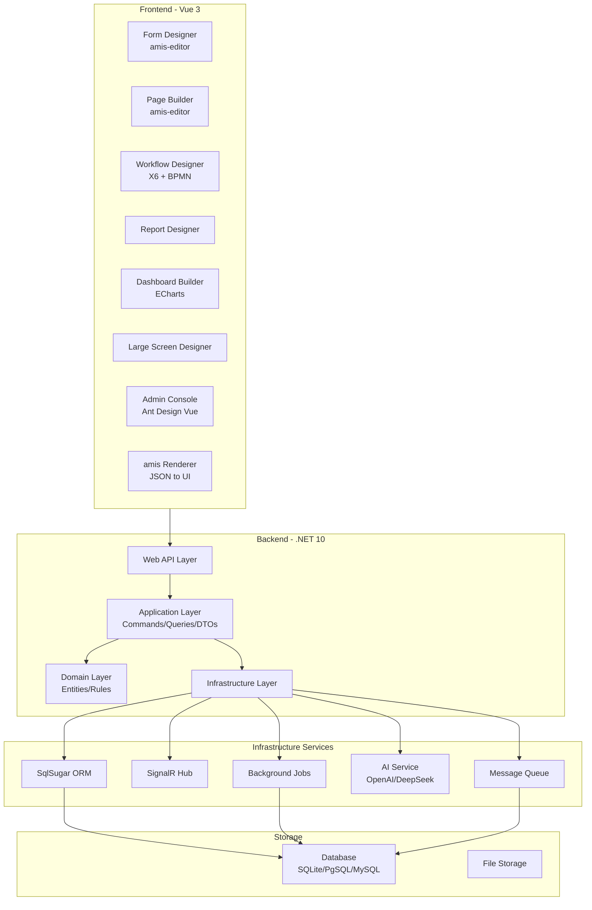

# Low-Code Platform Implementation Plan

## Current State

The SecurityPlatform already has:

- Clean Architecture backend (.NET 10, SqlSugar, JWT, multi-tenant)
- Vue 3 + Ant Design Vue + amis 6.0 frontend
- Dynamic Tables (basic CRUD generation)
- Approval Workflow engine (X6 graph designer)
- WorkflowCore engine (step-based execution)
- AMIS schema provider (file-based, basic dynamic generation)
- Identity & access management (RBAC)

## Target State: Full Low-Code Platform (Reference JNPF)

Build a complete enterprise low-code platform with 8 major modules, using amis as the JSON-schema rendering engine and the existing backend as the foundation.

---

## Module 1: Visual Form Designer (可视化表单设计器)

**Goal**: Replace the basic dynamic table field definition with a full drag-and-drop form designer.

### Feature Details

- **Component Palette** (60+ components organized by category):
  - Layout: Grid, Tabs, Collapse, Card, Divider, Steps
  - Basic: Input, Number, Textarea, Password, Select, Radio, Checkbox, Switch, Rate, Slider
  - Advanced: Upload, RichText, CodeEditor, Cascader, TreeSelect, Transfer, ColorPicker, Signature
  - Date/Time: DatePicker, TimePicker, DateRange, MonthPicker, YearPicker, QuarterPicker
  - Data: Table (sub-table), SubForm, Combo (repeatable group), InputTable
  - Business: Department selector, User selector, Role selector, Organization tree
  - Display: Alert, Tag, Badge, Progress, Statistic, Description
- **Designer Canvas**:
  - Drag-and-drop from palette to canvas
  - Grid-based layout with row/column nesting
  - Real-time preview (PC/Mobile toggle)
  - Undo/Redo stack
  - Copy/Paste/Delete components
- **Property Panel**:
  - Basic: label, name, placeholder, default value, required
  - Validation: min/max, regex, custom validator, async validation
  - Display: visibility conditions (`visibleOn`), disabled conditions (`disabledOn`)
  - Events: onChange, onFocus, onBlur with action chains
  - Style: width, margin, CSS class, custom CSS
- **Data Binding**:
  - API data source configuration (CRUD endpoint auto-binding)
  - Static data options
  - Dictionary (data dictionary lookup)
  - Expression formulas (`${field1 + field2}`)
  - Cascading linked selects
- **Form Templates**: Save/load form designs, template marketplace

### Implementation Approach

- Backend: `[Atlas.Domain/Entities/FormDefinition.cs]` entity storing amis JSON schema + metadata
- Backend: `FormDefinitionsController` with CRUD + publish/draft/version APIs
- Frontend: Integrate `amis-editor` + `amis-editor-core` packages from the amis source
- Frontend: Custom Vue wrapper around the React-based amis-editor (similar to existing AMIS renderer pattern)
- Store form schemas in DB (`form_definitions` table) with versioning

### Key Files to Create/Modify

- `src/backend/Atlas.Domain/Entities/FormDefinition.cs` - Entity
- `src/backend/Atlas.Application/Dtos/FormDefinitionDto.cs` - DTOs
- `src/backend/Atlas.WebApi/Controllers/FormDefinitionsController.cs` - API
- `src/frontend/Atlas.WebApp/src/pages/lowcode/FormDesigner.vue` - Designer page
- `src/frontend/Atlas.WebApp/src/components/amis/AmisEditor.vue` - Editor wrapper

---

## Module 2: Application Builder (应用构建器)

**Goal**: Build complete applications by assembling pages, forms, workflows, and APIs without code.

### Feature Details

- **Application Management**:
  - Create/manage applications with name, icon, description, category
  - Application lifecycle: Draft -> Published -> Disabled -> Archived
  - Application versioning with rollback capability
  - Multi-tenant application isolation
- **Page Builder**:
  - Page types: List (CRUD), Form (add/edit), Detail (view), Dashboard, Blank (custom)
  - amis-editor for full page design (not just forms)
  - Page routing auto-generation
  - Master-detail page relationships
  - Tab-based multi-view pages
- **Menu Configuration**:
  - Drag-and-drop menu tree builder
  - Auto-generate menus from application pages
  - Icon picker, permission binding per menu item
  - Separate PC/Mobile menu trees
- **Data Model Designer**:
  - Visual entity relationship diagram (ERD)
  - Auto DDL from visual model (extend existing Dynamic Tables)
  - Field type mapping: text, number, date, boolean, enum, relation (1:1, 1:N, N:N)
  - Index management
  - Calculated fields (formula-based)
  - Field-level permissions
- **API Auto-Generation**:
  - Auto-generate RESTful CRUD APIs from data models
  - Custom API endpoint builder (SQL/code mode)
  - API permission binding
  - Request/response schema documentation
  - API testing tool (in-browser Postman-like)

### Implementation Approach

- Extend existing `App` entity with low-code metadata
- New `LowCodePage` entity: { appId, pageType, amisSchema, routePath, permissions }
- Auto-route registration at runtime from DB page definitions
- Leverage existing Dynamic Tables for data model, extend with relations

---

## Module 3: Enhanced Workflow Engine (增强工作流引擎)

**Goal**: Upgrade the existing approval flow + workflow engine into a BPMN 2.0 compliant visual workflow with comprehensive node types.

### Feature Details

- **BPMN 2.0 Designer** (upgrade existing X6 designer):
  - Node Types:
    - Start Event, End Event, Timer Event, Signal Event, Message Event
    - User Task (manual approval), Service Task (auto API call), Script Task (JS/C# expression)
    - Exclusive Gateway, Parallel Gateway, Inclusive Gateway
    - Sub-process (embedded + call activity)
    - Copy/CC node, Notification node
  - Connectors with condition expressions
  - Swimlane (pool/lane) for role-based visualization
  - Process variables panel
  - Version management (draft/published/deprecated)
- **Approval Configuration** (per node):
  - Assignee rules: fixed user, role, department leader, initiator's manager (N levels up), form field value, custom expression
  - Approval strategy: all-sign (全部通过), any-sign (任一通过), sequential (依次审批), percentage (比例通过)
  - Self-approval handling: auto-approve, auto-skip, manual
  - Empty-assignee handling: auto-approve, admin-assign, error-stop
  - Time limit: deadline, reminder, auto-escalation, auto-approve/reject on timeout
  - Operation permissions: approve, reject, transfer, delegate, add-signer, withdraw, rollback
  - Custom form field visibility/editability per approval node
- **Advanced Workflow Features**:
  - Countersign (会签) with configurable pass ratio
  - Sequential approval (依次审批) within a single node
  - Parallel branches with join synchronization
  - Process jump (任意跳转) for admin override
  - Process urgency levels (普通/加急/特急)
  - Delegation/proxy (委托代理) with date range
  - Auto-trigger workflows from form submission or API call or scheduled timer
  - Workflow variables and form data passing between nodes
  - External system integration via HTTP Service Task
- **Process Monitoring Dashboard**:
  - Active instance count, completion rate, average duration
  - Bottleneck analysis (which nodes take longest)
  - SLA compliance tracking
  - Visual instance trace (highlight completed/current/pending nodes on BPMN diagram)

### Implementation Approach

- Extend existing `FlowEngine` and `ApprovalRuntimeCommandService` 
- Add Timer/Signal/Message event support to WorkflowCore
- Add Service Task execution (HTTP calls, script evaluation)
- Frontend: Enhance existing X6 designer with new node types, swimlanes, condition editor
- New monitoring dashboard page with ECharts

---

## Module 4: Report & Print Designer (报表与打印设计器)

**Goal**: Visual report builder with print templates, data source integration, and export capabilities.

### Feature Details

- **Report Designer**:
  - Data source selection (single table, multi-table join, custom SQL, API)
  - Column configuration: display name, width, alignment, format (date/number/currency)
  - Grouping and aggregation (SUM, AVG, COUNT, MAX, MIN)
  - Filtering: static filters, dynamic parameters (user input at runtime)
  - Sorting: multi-column sort
  - Cross-table (pivot table) support
  - Chart embedding (bar, line, pie, radar integrated into report)
  - Conditional formatting (highlight cells based on rules)
  - Calculated columns (formula expressions)
  - Sub-reports (master-detail drill-down)
- **Print Template Designer**:
  - WYSIWYG template editor
  - Paper size (A3, A4, A5, Letter, Custom)
  - Orientation (portrait/landscape)
  - Header/Footer with system variables (page number, date, report name)
  - Watermark (text watermark with font, color, rotation, opacity)
  - Table layout with auto-pagination
  - Barcode/QR code generation
  - Image embedding
  - Page break control
- **Export**:
  - PDF, Excel, Word, CSV
  - Batch export
  - Scheduled report generation (email/in-app notification)
- **Permission**:
  - Row-level security (data scope per role/department)
  - Column-level visibility
  - Report access control

### Implementation Approach

- Backend: `ReportDefinition` entity storing report config JSON
- Backend: `ReportDataService` to execute SQL/API and return data
- Backend: Report export services (PDF via QuestPDF, Excel via MiniExcel)
- Frontend: Report designer page using amis CRUD + custom config panel
- Frontend: Print preview using browser print API + custom CSS

---

## Module 5: Data Visualization & Dashboard (数据可视化与大屏)

**Goal**: Interactive dashboard builder and large-screen display designer.

### Feature Details

- **Dashboard Builder**:
  - Grid-based widget layout (draggable, resizable)
  - Widget types:
    - Statistic card (number + trend arrow + sparkline)
    - Chart (bar, line, pie, area, funnel, scatter, radar, gauge, map) via ECharts
    - Table (mini data table)
    - List (ranked list, timeline)
    - Progress (bar, circle)
    - Rich text / Markdown
    - Iframe embed
    - Custom component
  - Data source per widget: API, SQL query, static, real-time (WebSocket/SSE)
  - Auto-refresh interval per widget
  - Global filter bar (date range, department, project) affecting all widgets
  - Responsive layout (auto-adapt PC/tablet/mobile)
  - Dashboard templates (save/share/clone)
- **Large Screen Designer (大屏设计器)**:
  - Absolute positioning on fixed resolution canvas (e.g., 1920x1080)
  - Background image/video/gradient
  - Decorative borders and frames
  - Map visualization (China map, world map with data overlay)
  - Animated number counters
  - Real-time data streaming display
  - Full-screen presentation mode
  - Theme presets (dark tech, corporate blue, etc.)
- **Data Source Management**:
  - Register reusable data sources
  - SQL query builder (visual join/filter)
  - API data source with parameter mapping
  - Data transformation (field mapping, aggregation, filtering)
  - Data caching strategy

### Implementation Approach

- Frontend: Grid layout with `vue-grid-layout` or similar
- Frontend: ECharts wrapper components with amis chart integration
- Backend: `DashboardDefinition` entity + `DataSourceDefinition` entity
- Backend: `DataQueryService` for executing configured queries
- Backend: SignalR hub for real-time data push

---

## Module 6: Message Center (消息中心)

**Goal**: Unified multi-channel message system for notifications, approvals, and system alerts.

### Feature Details

- **Message Channels**:
  - In-app notification (real-time via SignalR)
  - Email (SMTP/Exchange)
  - SMS (Alibaba Cloud / Tencent Cloud SMS SDK)
  - WebSocket push
  - Webhook (outgoing HTTP callback)
- **Message Templates**:
  - Template editor with variable placeholders (`{{userName}}`, `{{taskName}}`)
  - Per-channel template variants (email HTML vs SMS plain text)
  - Template versioning
  - Multi-language template support
- **Trigger Rules**:
  - Event-based: workflow state change, form submission, approval action, system alert
  - Scheduled: cron-based recurring messages (report delivery, reminders)
  - Condition-based: only send if expression evaluates to true
- **Message Lifecycle**:
  - Send queue with retry (3 attempts, exponential backoff)
  - Delivery status tracking (pending, sent, delivered, failed, read)
  - Message recall
  - Read receipt tracking
  - Message archiving
- **User Preferences**:
  - Per-user channel preference (which channels for which event types)
  - Do-not-disturb schedule
  - Message grouping/digest mode
- **Admin Console**:
  - Channel configuration (SMTP settings, SMS API keys, etc.)
  - Send log with filtering
  - Delivery statistics dashboard
  - Failed message retry management

### Implementation Approach

- Backend: `Atlas.Domain.Messaging` module (MessageTemplate, MessageRecord, ChannelConfig, TriggerRule entities)
- Backend: `IMessageSender` interface with per-channel implementations
- Backend: Background queue service (Channel pattern or Hangfire)
- Backend: SignalR hub for real-time in-app notifications
- Frontend: Notification bell component, message center page, admin config pages

---

## Module 7: Internationalization & Multi-Language (国际化)

**Goal**: Full i18n support for both the platform UI and user-created low-code applications.

### Feature Details

- **Platform UI i18n**:
  - Vue i18n for all static UI text (menus, buttons, labels, messages)
  - Language files: zh-CN (Chinese Simplified), en-US (English), extensible
  - Language switcher in user profile / header
  - Persist user language preference
- **Low-Code Application i18n**:
  - Multi-language labels for form fields, page titles, menu items
  - Translation management UI (key-value editor per language)
  - amis locale integration (amis built-in zh-CN/en-US)
  - Data dictionary multi-language values
- **Content i18n**:
  - Message templates per language
  - Notification content per language
  - Error messages per language
  - Workflow node names per language
- **Implementation**:
  - `vue-i18n` for frontend
  - Backend: `I18nResource` entity (key, locale, value)
  - Backend: API for language pack CRUD
  - amis `locale` option configured from user preference

---

## Module 8: AI-Assisted Development (AI辅助开发)

**Goal**: AI capabilities to accelerate low-code development.

### Feature Details

- **AI Form Generation**:
  - Natural language to form schema: "Create an employee onboarding form with name, department, start date, salary"
  - AI suggests field types, validations, and layout
  - AI generates amis JSON schema from description
- **AI SQL Generation**:
  - Natural language to SQL: "Show me all orders from last month grouped by category"
  - Schema-aware suggestions (knows table/column names)
  - SQL review and optimization suggestions
- **AI Workflow Suggestion**:
  - Describe business process in natural language, AI generates BPMN skeleton
  - AI suggests approval rules based on common patterns
- **AI Data Analysis**:
  - Natural language questions about dashboard data
  - Auto-generate chart configurations from data
  - Anomaly detection alerts
- **AI Consultation Assistant**:
  - Contextual help within the platform
  - Explains form/workflow configurations
  - Troubleshooting guidance
- **Implementation**:
  - Backend: `IAiService` abstraction with provider pattern
  - Support: OpenAI API, DeepSeek API, local model (Ollama)
  - Prompt engineering templates stored in DB
  - Token usage tracking and quota management
  - Streaming responses via SSE

---

## Architecture Diagram

---

## Implementation Priority & Phases

### Phase 1: Core Foundation (4-6 weeks)

- Module 1: Visual Form Designer (core feature, enables everything else)
- Module 2: Application Builder (page builder + data model + auto-API)

### Phase 2: Workflow Enhancement (3-4 weeks)

- Module 3: Enhanced Workflow Engine (BPMN 2.0 upgrade, service tasks, timer events)

### Phase 3: Data & Reporting (3-4 weeks)

- Module 4: Report & Print Designer
- Module 5: Data Visualization & Dashboard

### Phase 4: Enterprise Features (2-3 weeks)

- Module 6: Message Center
- Module 7: Internationalization

### Phase 5: Intelligence (2-3 weeks)

- Module 8: AI-Assisted Development

---

## Key Technical Decisions

1. **amis as rendering engine**: All low-code pages store amis JSON schema in DB, rendered at runtime via the existing AMIS renderer wrapper
2. **amis-editor integration**: Use the React-based `amis-editor` package from the downloaded source, wrapped in Vue via `createRoot` (same pattern as existing AMIS renderer)
3. **Schema versioning**: Every form/page/workflow definition supports draft + published versions with history
4. **Runtime dynamic routing**: Low-code pages are dynamically registered in Vue Router from DB definitions at app startup
5. **Multi-database**: Leverage SqlSugar's multi-DB dialect for DDL generation (currently SQLite, designed for PgSQL/MySQL/MSSQL)
6. **Real-time**: SignalR for in-app notifications, workflow status updates, dashboard data streaming
7. **AI provider pattern**: Abstract AI service behind interface, support multiple providers (OpenAI, DeepSeek, Ollama) via configuration