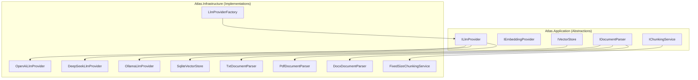

# Phase 0: Infrastructure & Architecture Preparation

## Current State Analysis

The project already has several infrastructure pieces we will leverage directly:

- **Event Bus**: `IEventBus` + `InProcessEventBus` already exist in `[Atlas.Core/Events/](src/backend/Atlas.Core/Events/IEventBus.cs)` -- **no need to rebuild** (0.4.1 and 0.4.2 are already done)
- **File Storage**: `IFileStorageService` + `LocalFileStorageService` in `[Atlas.Application/System/Abstractions/](src/backend/Atlas.Application/System/Abstractions/IFileStorageService.cs)` -- **reuse directly** (0.5.1 done)
- **AI stub**: `IAiService` + `AiService` in `[Atlas.Application/LowCode/](src/backend/Atlas.Application/LowCode/Abstractions/IAiService.cs)` returns templates only; `AiProviderConfig` record exists but is unused
- **DI pattern**: Modular registration via `*ServiceRegistration.cs` files, called from `[ServiceCollectionExtensions.cs](src/backend/Atlas.Infrastructure/ServiceCollectionExtensions.cs)`
- **Entity pattern**: `TenantEntity` base class with `long Id` + `Guid TenantIdValue`, SqlSugar ORM, `RepositoryBase<T>`
- **Background tasks**: `BackgroundWorkQueue` + `BackgroundWorkQueueProcessor` for fire-and-forget; `Hangfire` for scheduled jobs; `OutboxProcessorHostedService` for reliable event delivery

## Architecture Approach

All new abstractions go in `Atlas.Application`, implementations in `Atlas.Infrastructure`. A new DI registration file `AiPlatformServiceRegistration.cs` will wire everything, called from `ServiceCollectionExtensions.AddAtlasInfrastructure()`.




---

## 0.1 LLM Provider Abstraction Layer

### 0.1.1 Define `ILlmProvider` + `IEmbeddingProvider`

**File**: `src/backend/Atlas.Application/AiPlatform/Abstractions/ILlmProvider.cs`

```csharp
public interface ILlmProvider
{
    string ProviderName { get; }
    Task<ChatCompletionResult> ChatAsync(ChatCompletionRequest request, CancellationToken ct = default);
    IAsyncEnumerable<ChatCompletionChunk> ChatStreamAsync(ChatCompletionRequest request, CancellationToken ct = default);
}

public interface IEmbeddingProvider
{
    string ProviderName { get; }
    Task<EmbeddingResult> EmbedAsync(EmbeddingRequest request, CancellationToken ct = default);
}
```

**File**: `src/backend/Atlas.Application/AiPlatform/Models/LlmModels.cs` -- DTOs for `ChatCompletionRequest`, `ChatMessage`, `ChatCompletionResult`, `ChatCompletionChunk`, `EmbeddingRequest`, `EmbeddingResult`

Key design decisions:

- All DTOs use **OpenAI-compatible schema** (`messages[]` with `role`/`content`, `model`, `temperature`, `max_tokens`) -- this is the de facto standard that DeepSeek/Ollama/Qwen also follow
- `ILlmProvider` and `IEmbeddingProvider` are separate because not all LLM providers support embeddings, and embedding-only providers exist
- The `AiProviderConfig` record in `[AiModels.cs](src/backend/Atlas.Application/LowCode/Models/AiModels.cs)` will be moved to `AiPlatform/Models/` and extended with `ProviderType` enum

### 0.1.2-0.1.8 Provider Implementations

**Priority order**: OpenAI (0.1.2) > DeepSeek (0.1.3) > Ollama (0.1.4) > others later

All providers share the same pattern because they use the OpenAI-compatible `/v1/chat/completions` and `/v1/embeddings` endpoints:

**File**: `src/backend/Atlas.Infrastructure/Services/AiPlatform/OpenAiLlmProvider.cs`

```csharp
public sealed class OpenAiLlmProvider : ILlmProvider, IEmbeddingProvider
{
    private readonly HttpClient _httpClient;
    // POST {BaseUrl}/v1/chat/completions
    // POST {BaseUrl}/v1/embeddings
}
```

- **DeepSeek**: identical wire protocol, different `BaseUrl` (`https://api.deepseek.com`)
- **Ollama**: identical wire protocol, default `BaseUrl` (`http://localhost:11434`)
- **Claude/Gemini/Qwen/Ark**: slightly different API shapes -- implement in later phases, create separate provider classes

Since OpenAI/DeepSeek/Ollama all support the same API format, a single `OpenAiCompatibleProvider` class can handle all three; only `BaseUrl` differs. Provider-specific classes can extend it if needed.

### 0.1.9 Provider Factory

**File**: `src/backend/Atlas.Infrastructure/Services/AiPlatform/LlmProviderFactory.cs`

```csharp
public interface ILlmProviderFactory
{
    ILlmProvider GetLlmProvider(string providerName);
    IEmbeddingProvider GetEmbeddingProvider(string providerName);
}
```

- Resolves from `IEnumerable<ILlmProvider>` injected via DI (keyed services or name matching)
- Fallback: reads `AiPlatform:DefaultProvider` from config

### 0.1.10 Configuration

**File**: `appsettings.json` section

```json
{
  "AiPlatform": {
    "DefaultProvider": "openai",
    "Providers": {
      "openai": { "ApiKey": "", "BaseUrl": "https://api.openai.com", "DefaultModel": "gpt-4o-mini" },
      "deepseek": { "ApiKey": "", "BaseUrl": "https://api.deepseek.com", "DefaultModel": "deepseek-chat" },
      "ollama": { "BaseUrl": "http://localhost:11434", "DefaultModel": "llama3" }
    },
    "Embedding": {
      "Provider": "openai",
      "Model": "text-embedding-3-small",
      "Dimensions": 1536
    }
  }
}
```

**Options class**: `src/backend/Atlas.Infrastructure/Options/AiPlatformOptions.cs`

### Refactor existing AiService

After providers are built, update `[AiService.cs](src/backend/Atlas.Infrastructure/Services/LowCode/AiService.cs)` to inject `ILlmProviderFactory` and delegate `CallAiAsync` to the real provider instead of returning templates. This keeps the existing `IAiService` contract intact.

---

## 0.2 Vector Store Abstraction Layer

### 0.2.1 Define `IVectorStore`

**File**: `src/backend/Atlas.Application/AiPlatform/Abstractions/IVectorStore.cs`

```csharp
public interface IVectorStore
{
    Task UpsertAsync(string collectionName, IEnumerable<VectorRecord> records, CancellationToken ct = default);
    Task<IReadOnlyList<VectorSearchResult>> SearchAsync(string collectionName, float[] queryVector, int topK = 5, CancellationToken ct = default);
    Task DeleteAsync(string collectionName, IEnumerable<string> ids, CancellationToken ct = default);
    Task EnsureCollectionAsync(string collectionName, int dimensions, CancellationToken ct = default);
}

public sealed record VectorRecord(string Id, float[] Vector, string Content, Dictionary<string, string>? Metadata = null);
public sealed record VectorSearchResult(string Id, string Content, float Score, Dictionary<string, string>? Metadata);
```

### 0.2.2 SQLite Vector Store (primary, no external deps)

**File**: `src/backend/Atlas.Infrastructure/Services/AiPlatform/SqliteVectorStore.cs`

- Uses a dedicated SQLite database (`vectors.db`) separate from the main DB
- Table schema: `CREATE TABLE IF NOT EXISTS {collection} (id TEXT PRIMARY KEY, vector BLOB, content TEXT, metadata TEXT)`
- `vector` stored as `float[]` serialized to `byte[]` (little-endian)
- Cosine similarity computed in C# after full-table scan (acceptable for < 100K vectors per collection in MVP)
- For production scale, add `sqlite-vss` extension or switch to Milvus (0.2.3)

### 0.2.3 / 0.2.4 Milvus / Elasticsearch (deferred)

Stub implementations with `NotImplementedException` and TODO comments. These become relevant at scale.

---

## 0.3 Document Parsing Pipeline

### 0.3.1 Define `IDocumentParser` + `IChunkingService`

**File**: `src/backend/Atlas.Application/AiPlatform/Abstractions/IDocumentParser.cs`

```csharp
public interface IDocumentParser
{
    bool CanParse(string contentType, string extension);
    Task<ParsedDocument> ParseAsync(Stream fileStream, string fileName, CancellationToken ct = default);
}

public sealed record ParsedDocument(string Text, string? Title, int PageCount, Dictionary<string, string>? Metadata);
```

**File**: `src/backend/Atlas.Application/AiPlatform/Abstractions/IChunkingService.cs`

```csharp
public interface IChunkingService
{
    IReadOnlyList<TextChunk> Chunk(string text, ChunkingOptions options);
}

public sealed record TextChunk(int Index, string Content, int StartOffset, int EndOffset);
public sealed record ChunkingOptions(int ChunkSize = 500, int Overlap = 50);
```

A `DocumentParserComposite` aggregates all `IDocumentParser` implementations and picks the right one via `CanParse()`.

### 0.3.2-0.3.7 Parser Implementations


| #     | Parser   | NuGet Package                               | File                           |
| ----- | -------- | ------------------------------------------- | ------------------------------ |
| 0.3.2 | TXT      | (none)                                      | `TxtDocumentParser.cs`         |
| 0.3.3 | PDF      | **UglyToad.PdfPig** (latest)                | `PdfDocumentParser.cs`         |
| 0.3.4 | DOCX     | **DocumentFormat.OpenXml** (latest)         | `DocxDocumentParser.cs`        |
| 0.3.5 | Markdown | (simple regex strip)                        | `MarkdownDocumentParser.cs`    |
| 0.3.6 | CSV/XLSX | **ClosedXML** (already in project: 0.105.0) | `SpreadsheetDocumentParser.cs` |
| 0.3.7 | JSON     | System.Text.Json                            | `JsonDocumentParser.cs`        |


All placed in `src/backend/Atlas.Infrastructure/Services/AiPlatform/Parsers/`.

### 0.3.8 Fixed-Size Chunking

**File**: `src/backend/Atlas.Infrastructure/Services/AiPlatform/FixedSizeChunkingService.cs`

- Splits by character count with configurable `ChunkSize` (default 500) and `Overlap` (default 50)
- Respects sentence boundaries where possible (split on `.` / `\n` near boundary)

### 0.3.9 Semantic Chunking (deferred)

Stub with TODO. Requires LLM calls or NLP library -- implement after core RAG pipeline works.

---

## 0.4 Event Bus -- Already Done

- `IEventBus` at `[Atlas.Core/Events/IEventBus.cs](src/backend/Atlas.Core/Events/IEventBus.cs)` -- already supports `PublishAsync<TEvent>`
- `InProcessEventBus` at `[Atlas.Infrastructure/Events/InProcessEventBus.cs](src/backend/Atlas.Infrastructure/Events/InProcessEventBus.cs)` -- resolves handlers from DI
- `OutboxPublisher` + `OutboxProcessorHostedService` for reliable delivery
- **Action**: Mark 0.4.1 and 0.4.2 as `[x]` in tracker. 0.4.3 (RabbitMQ) deferred.

---

## 0.5 Object Storage -- Already Done

- `IFileStorageService` at `[Atlas.Application/System/Abstractions/IFileStorageService.cs](src/backend/Atlas.Application/System/Abstractions/IFileStorageService.cs)` supports Upload/Download/Info/Delete
- `LocalFileStorageService` implementation with tenant-scoped paths
- **Action**: Mark 0.5.1 as `[x]`. 0.5.2 (MinIO/S3) deferred.

---

## DI Registration

**New file**: `src/backend/Atlas.Infrastructure/DependencyInjection/AiPlatformServiceRegistration.cs`

```csharp
public static class AiPlatformServiceRegistration
{
    public static IServiceCollection AddAiPlatformInfrastructure(
        this IServiceCollection services, IConfiguration configuration)
    {
        services.Configure<AiPlatformOptions>(configuration.GetSection("AiPlatform"));
        services.AddHttpClient("AiPlatform");

        // LLM Providers
        services.AddSingleton<ILlmProvider, OpenAiCompatibleProvider>(/* openai config */);
        // Additional providers registered similarly
        services.AddSingleton<ILlmProviderFactory, LlmProviderFactory>();
        services.AddSingleton<IEmbeddingProvider, OpenAiCompatibleProvider>(/* embedding config */);

        // Vector Store
        services.AddSingleton<IVectorStore, SqliteVectorStore>();

        // Document Parsers
        services.AddSingleton<IDocumentParser, TxtDocumentParser>();
        services.AddSingleton<IDocumentParser, PdfDocumentParser>();
        services.AddSingleton<IDocumentParser, DocxDocumentParser>();
        services.AddSingleton<IDocumentParser, MarkdownDocumentParser>();
        services.AddSingleton<IDocumentParser, SpreadsheetDocumentParser>();
        services.AddSingleton<IDocumentParser, JsonDocumentParser>();
        services.AddSingleton<DocumentParserComposite>();

        // Chunking
        services.AddSingleton<IChunkingService, FixedSizeChunkingService>();

        return services;
    }
}
```

Called from `[ServiceCollectionExtensions.cs](src/backend/Atlas.Infrastructure/ServiceCollectionExtensions.cs)`:

```csharp
services.AddAiPlatformInfrastructure(configuration);
```

## NuGet Packages to Add

- **UglyToad.PdfPig** -- PDF text extraction (pure .NET, no native deps)
- **DocumentFormat.OpenXml** -- DOCX parsing (Microsoft official)
- ClosedXML already present for XLSX

## File Tree Summary

```
src/backend/
  Atlas.Application/
    AiPlatform/
      Abstractions/
        ILlmProvider.cs          (0.1.1)
        IEmbeddingProvider.cs    (0.1.1)
        ILlmProviderFactory.cs  (0.1.9)
        IVectorStore.cs          (0.2.1)
        IDocumentParser.cs       (0.3.1)
        IChunkingService.cs      (0.3.1)
      Models/
        LlmModels.cs             (0.1.1)
        VectorModels.cs          (0.2.1)
        DocumentModels.cs        (0.3.1)
  Atlas.Infrastructure/
    Options/
      AiPlatformOptions.cs       (0.1.10)
    Services/AiPlatform/
      OpenAiCompatibleProvider.cs (0.1.2-0.1.4)
      LlmProviderFactory.cs      (0.1.9)
      SqliteVectorStore.cs        (0.2.2)
      FixedSizeChunkingService.cs (0.3.8)
      Parsers/
        TxtDocumentParser.cs      (0.3.2)
        PdfDocumentParser.cs      (0.3.3)
        DocxDocumentParser.cs     (0.3.4)
        MarkdownDocumentParser.cs (0.3.5)
        SpreadsheetDocumentParser.cs (0.3.6)
        JsonDocumentParser.cs     (0.3.7)
        DocumentParserComposite.cs
    DependencyInjection/
      AiPlatformServiceRegistration.cs
```

