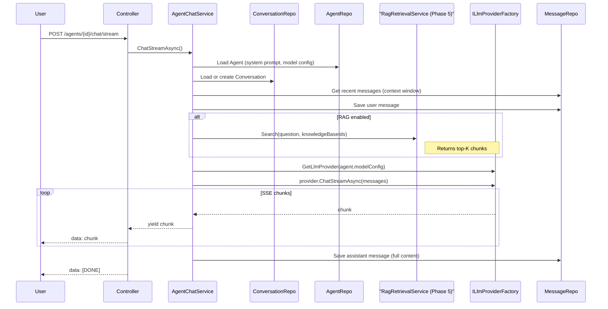

# Phase 4-6: Conversation + RAG + AI Workflow Engine

## Existing Infrastructure Summary


| Component                                               | Location                                    | Reuse in                                                |
| ------------------------------------------------------- | ------------------------------------------- | ------------------------------------------------------- |
| `ILlmProviderFactory` / `OpenAiCompatibleProvider`      | `Atlas.Application/AiPlatform/`             | Phase 4 (chat), Phase 5 (embedding), Phase 6 (LLM node) |
| SSE streaming pattern                                   | `AiAssistantController.ChatStream`          | Phase 4 (agent chat stream)                             |
| `IVectorStore` / `SqliteVectorStore`                    | `Atlas.Infrastructure/Services/AiPlatform/` | Phase 5 (RAG retrieval)                                 |
| `IDocumentParser` / `DocumentParserComposite`           | `Atlas.Infrastructure/.../Parsers/`         | Phase 5 (document ingestion)                            |
| `IChunkingService` / `FixedSizeChunkingService`         | `Atlas.Infrastructure/Services/AiPlatform/` | Phase 5 (document chunking)                             |
| `IBackgroundWorkQueue` / `BackgroundWorkQueueProcessor` | `Atlas.Core/Abstractions/`                  | Phase 5 (async document processing)                     |
| `IEventBus` / `InProcessEventBus`                       | `Atlas.Core/Events/`                        | Phase 5 (document events)                               |
| Atlas.WorkflowCore (custom engine)                      | `Atlas.WorkflowCore/`                       | Phase 6 (AI workflow as new step types)                 |
| `Agent` entity (Phase 3)                                | `Atlas.Domain/AiPlatform/Entities/`         | Phase 4 (agent context for chat)                        |
| `ModelConfig` entity (Phase 2)                          | `Atlas.Domain/AiPlatform/Entities/`         | Phase 4, 6 (provider resolution)                        |


---

## Phase 4: Conversation System

### 4.1 Domain Entities

**File**: `src/backend/Atlas.Domain/AiPlatform/Entities/Conversation.cs`

```csharp
public sealed class Conversation : TenantEntity
{
    public long AgentId { get; private set; }
    public long UserId { get; private set; }
    public string? Title { get; private set; }
    public DateTime CreatedAt { get; private set; }
    public DateTime? LastMessageAt { get; private set; }
    public int MessageCount { get; private set; }
    
    public void AddMessage() { MessageCount++; LastMessageAt = DateTime.UtcNow; }
    public void UpdateTitle(string title) { Title = title; }
    public void ClearContext() { /* sets context-cleared marker */ }
}
```

**File**: `src/backend/Atlas.Domain/AiPlatform/Entities/ChatMessage.cs`

```csharp
public sealed class ChatMessage : TenantEntity
{
    public long ConversationId { get; private set; }
    public string Role { get; private set; }       // "system" | "user" | "assistant"
    public string Content { get; private set; }
    public string? Metadata { get; private set; }   // JSON: token counts, model used, RAG sources
    public DateTime CreatedAt { get; private set; }
    public bool IsContextCleared { get; private set; }  // marks context boundary
}
```

### 4.2 Repositories

- `ConversationRepository` extending `RepositoryBase<Conversation>` with `GetPagedByAgentAsync`, `GetPagedByUserAsync`
- `ChatMessageRepository` extending `RepositoryBase<ChatMessage>` with `GetByConversationAsync(conversationId, afterContextClear?, limit?)`, `DeleteByConversationAsync`

### 4.3 DTOs and Validators

**File**: `src/backend/Atlas.Application/AiPlatform/Models/ConversationModels.cs`

- `ConversationDto`, `ConversationCreateRequest(long AgentId)`, `ConversationUpdateRequest(string Title)`
- `ChatMessageDto(long Id, string Role, string Content, string? Metadata, DateTime CreatedAt)`
- `AgentChatRequest(long ConversationId, string Message, bool? EnableRag)` -- extends the existing `AiChatRequest` pattern
- `AgentChatResponse(long MessageId, string Content, string? Sources)`

### 4.4 Services

`**IConversationService`** -- combined query + command (simpler for this module):

- `CreateAsync(tenantId, userId, request)` -> creates Conversation, auto-generates title from first message
- `ListByAgentAsync(tenantId, agentId, pageIndex, pageSize)` 
- `ListByUserAsync(tenantId, userId, pageIndex, pageSize)`
- `GetByIdAsync(tenantId, conversationId)`
- `UpdateAsync(tenantId, conversationId, request)`
- `DeleteAsync(tenantId, conversationId)` -- cascades to messages
- `ClearHistoryAsync(tenantId, conversationId)` -- deletes all messages
- `ClearContextAsync(tenantId, conversationId)` -- marks boundary (new messages don't see old context)

`**IAgentChatService`** -- the core chat orchestrator:

```csharp
public interface IAgentChatService
{
    Task<AgentChatResponse> ChatAsync(TenantId tenantId, long userId, AgentChatRequest request, CancellationToken ct);
    IAsyncEnumerable<string> ChatStreamAsync(TenantId tenantId, long userId, AgentChatRequest request, CancellationToken ct);
    Task CancelAsync(TenantId tenantId, long conversationId, CancellationToken ct);
}
```

`**AgentChatService` implementation flow:**




Key design decisions:

- Messages are persisted *before* and *after* the LLM call (user message saved immediately, assistant message saved on completion)
- Context window: load last N messages since the most recent context-clear boundary
- Cancel: uses `CancellationTokenSource` keyed by conversationId, stored in a `ConcurrentDictionary`
- RAG integration: calls `IRagRetrievalService.SearchAsync()` (Phase 5) if agent has linked knowledge bases and `EnableRag` is true; injects retrieved chunks as a system message

### 4.5 Controllers

`**ConversationsController`** (`api/v1/conversations`):


| Method | Route                                         | Description                    |
| ------ | --------------------------------------------- | ------------------------------ |
| GET    | `/api/v1/conversations?agentId=&userId=`      | List conversations             |
| GET    | `/api/v1/conversations/{id}`                  | Get conversation               |
| POST   | `/api/v1/conversations`                       | Create conversation            |
| PUT    | `/api/v1/conversations/{id}`                  | Update title                   |
| DELETE | `/api/v1/conversations/{id}`                  | Delete conversation + messages |
| POST   | `/api/v1/conversations/{id}/clear-context`    | Clear context                  |
| POST   | `/api/v1/conversations/{id}/clear-history`    | Clear all messages             |
| GET    | `/api/v1/conversations/{id}/messages`         | List messages                  |
| DELETE | `/api/v1/conversations/{id}/messages/{msgId}` | Delete single message          |


`**AgentChatController`** (extends existing `AiAssistantController` pattern):


| Method | Route                                  | Description       |
| ------ | -------------------------------------- | ----------------- |
| POST   | `/api/v1/agents/{agentId}/chat`        | Sync chat         |
| POST   | `/api/v1/agents/{agentId}/chat/stream` | SSE stream chat   |
| POST   | `/api/v1/agents/{agentId}/chat/cancel` | Cancel generation |


SSE pattern: reuse the exact same pattern from `[AiAssistantController.ChatStream](src/backend/Atlas.WebApi/Controllers/AiAssistantController.cs)` (`text/event-stream`, `data: {chunk}\n\n`, `data: [DONE]\n\n`).

### 4.6 Frontend

`**src/frontend/Atlas.WebApp/src/services/api-conversation.ts`**: API calls for conversation CRUD + messages

`**src/frontend/Atlas.WebApp/src/composables/useStreamChat.ts`**: SSE composable

- Uses `fetch` with `ReadableStream` to consume SSE
- Accumulates `contentDelta` chunks
- Exposes reactive state: `messages`, `isStreaming`, `error`
- Supports cancel via `AbortController`

`**src/frontend/Atlas.WebApp/src/pages/ai/AgentChatPage.vue`**:

- Left sidebar: conversation list (grouped by date), new conversation button
- Right main area: message list with bubbles (user right-aligned, assistant left-aligned)
- Bottom: input area with send button, RAG toggle, cancel button during streaming
- Uses `useStreamChat` composable

`**src/frontend/Atlas.WebApp/src/components/ai/ChatMessage.vue*`*: Single message bubble with Markdown rendering (using `marked` or `markdown-it`)

`**src/frontend/Atlas.WebApp/src/components/ai/MarkdownRenderer.vue**`: Markdown-to-HTML with syntax highlighting (code blocks)

Routes in `pathComponentFallbackMap`:

```ts
"/ai/agents/:agentId/chat": "../pages/ai/AgentChatPage.vue",
```

---

## Phase 5: Knowledge Base & RAG

### 5.1 Domain Entities

All placed in `src/backend/Atlas.Domain/AiPlatform/Entities/`:

`**KnowledgeBase.cs**`:

```csharp
public sealed class KnowledgeBase : TenantEntity
{
    public string Name { get; private set; }
    public string? Description { get; private set; }
    public KnowledgeBaseType Type { get; private set; }  // Text, Table, Image
    public int DocumentCount { get; private set; }
    public int ChunkCount { get; private set; }
    public DateTime CreatedAt { get; private set; }
}
public enum KnowledgeBaseType { Text = 0, Table = 1, Image = 2 }
```

`**KnowledgeDocument.cs**`:

```csharp
public sealed class KnowledgeDocument : TenantEntity
{
    public long KnowledgeBaseId { get; private set; }
    public long? FileId { get; private set; }          // FK to FileRecord (existing)
    public string FileName { get; private set; }
    public string? ContentType { get; private set; }
    public long FileSizeBytes { get; private set; }
    public DocumentProcessingStatus Status { get; private set; }  // Pending, Processing, Completed, Failed
    public string? ErrorMessage { get; private set; }
    public int ChunkCount { get; private set; }
    public DateTime CreatedAt { get; private set; }
    public DateTime? ProcessedAt { get; private set; }
}
public enum DocumentProcessingStatus { Pending = 0, Processing = 1, Completed = 2, Failed = 3 }
```

`**DocumentChunk.cs**`:

```csharp
public sealed class DocumentChunk : TenantEntity
{
    public long KnowledgeBaseId { get; private set; }
    public long DocumentId { get; private set; }
    public int ChunkIndex { get; private set; }
    public string Content { get; private set; }
    public int StartOffset { get; private set; }
    public int EndOffset { get; private set; }
    public bool HasEmbedding { get; private set; }
    public DateTime CreatedAt { get; private set; }
}
```

Note: Embeddings are NOT stored in the entity/SQL table. They go into `IVectorStore` (SqliteVectorStore) separately. The `HasEmbedding` flag tracks whether the chunk has been vectorized. This separation keeps the relational DB lean and leverages the purpose-built vector store.

### 5.2 Repositories

- `KnowledgeBaseRepository` with `GetPagedAsync`, counters update
- `KnowledgeDocumentRepository` with `GetByKnowledgeBaseAsync`, `GetPendingAsync`
- `DocumentChunkRepository` with `GetByDocumentAsync`, `GetByKnowledgeBaseAsync`, `DeleteByDocumentAsync`

### 5.3 Services

`**IKnowledgeBaseService**` (query + command):

- CRUD for knowledge bases
- `GetPagedAsync`, `GetByIdAsync`, `CreateAsync`, `UpdateAsync`, `DeleteAsync` (cascade: documents -> chunks -> vectors)

`**IDocumentService**` (query + command):

- `CreateAsync(tenantId, knowledgeBaseId, fileId)` -- creates document record, enqueues processing via `IBackgroundWorkQueue`
- `ListByKnowledgeBaseAsync`
- `DeleteAsync` -- deletes chunks + vectors + document record
- `GetProgressAsync(tenantId, documentId)` -- returns status + chunk count
- `ResegmentAsync(tenantId, documentId)` -- re-processes with new chunking options

`**IChunkService**` (query + command):

- CRUD for manual chunk management
- `GetByDocumentAsync`, `CreateAsync`, `UpdateAsync`, `DeleteAsync`

`**DocumentProcessingService**` -- the async pipeline orchestrator:

```mermaid
flowchart LR
    Upload["Document Upload"] --> Enqueue["BackgroundWorkQueue.Enqueue()"]
    Enqueue --> Parse["IDocumentParser.ParseAsync()"]
    Parse --> Chunk["IChunkingService.Chunk()"]
    Chunk --> SaveChunks["Save DocumentChunk records"]
    SaveChunks --> Embed["IEmbeddingProvider.EmbedAsync()"]
    Embed --> Store["IVectorStore.UpsertAsync()"]
    Store --> MarkDone["Document.Status = Completed"]
```




- Runs inside `IBackgroundWorkQueue` work item (scoped DI)
- Downloads file via `IFileStorageService.DownloadAsync()`
- Parses via `DocumentParserComposite.ParseAsync()`
- Chunks via `IChunkingService.Chunk()`
- Saves `DocumentChunk` records
- Batches chunks (e.g., 20 per batch) and calls `IEmbeddingProvider.EmbedAsync()` 
- Upserts vectors into `IVectorStore` with collection name = `kb_{knowledgeBaseId}`
- Updates document status throughout
- On failure: sets `Status = Failed`, `ErrorMessage` = exception message

`**IRagRetrievalService**` -- the RAG search service (used by Phase 4 `AgentChatService`):

```csharp
public interface IRagRetrievalService
{
    Task<IReadOnlyList<RagSearchResult>> SearchAsync(
        TenantId tenantId,
        IReadOnlyList<long> knowledgeBaseIds,
        string query,
        int topK = 5,
        CancellationToken ct = default);
}

public sealed record RagSearchResult(
    long KnowledgeBaseId, long DocumentId, long ChunkId,
    string Content, float Score, string? DocumentName);
```

Implementation:

1. Get embedding for query via `IEmbeddingProvider.EmbedAsync()`
2. For each knowledgeBaseId, call `IVectorStore.SearchAsync("kb_{id}", queryVector, topK)`
3. Merge results across knowledge bases, sort by score, take topK
4. Enrich with document name from `KnowledgeDocumentRepository`

### 5.4 Controllers

`**KnowledgeBasesController**` (`api/v1/knowledge-bases`):


| Method | Route                                                      | Description                          |
| ------ | ---------------------------------------------------------- | ------------------------------------ |
| GET    | `/api/v1/knowledge-bases`                                  | Paged list                           |
| GET    | `/api/v1/knowledge-bases/{id}`                             | Detail                               |
| POST   | `/api/v1/knowledge-bases`                                  | Create                               |
| PUT    | `/api/v1/knowledge-bases/{id}`                             | Update                               |
| DELETE | `/api/v1/knowledge-bases/{id}`                             | Delete (cascade)                     |
| GET    | `/api/v1/knowledge-bases/{id}/documents`                   | Document list                        |
| POST   | `/api/v1/knowledge-bases/{id}/documents`                   | Upload document (multipart + fileId) |
| DELETE | `/api/v1/knowledge-bases/{id}/documents/{docId}`           | Delete document                      |
| GET    | `/api/v1/knowledge-bases/{id}/documents/{docId}/progress`  | Processing status                    |
| POST   | `/api/v1/knowledge-bases/{id}/documents/{docId}/resegment` | Resegment                            |
| GET    | `/api/v1/knowledge-bases/{id}/documents/{docId}/chunks`    | Chunk list                           |
| POST   | `/api/v1/knowledge-bases/{id}/chunks`                      | Create chunk manually                |
| PUT    | `/api/v1/knowledge-bases/{id}/chunks/{chunkId}`            | Update chunk                         |
| DELETE | `/api/v1/knowledge-bases/{id}/chunks/{chunkId}`            | Delete chunk                         |


### 5.5 Frontend

`**api-knowledge.ts**`: API calls for all KB endpoints

`**KnowledgeBaseListPage.vue**`: Table/Card list of knowledge bases with create modal (name, description, type)

`**KnowledgeBaseDetailPage.vue**`: 

- Tabs: Documents | Chunks
- Documents tab: file list with status badges, upload area (drag-and-drop), progress bars for processing documents
- Chunks tab: paginated list of chunks with inline editing

Routes:

```ts
"/ai/knowledge-bases": "../pages/ai/KnowledgeBaseListPage.vue",
"/ai/knowledge-bases/:id": "../pages/ai/KnowledgeBaseDetailPage.vue",
```

### 5.6 Deferred (MVP skip)

- 5.4.1-5.4.2 Table Schema and Document Review -- post-MVP
- 5.5.1-5.5.5 Image Knowledge Base and OCR -- post-MVP

---

## Phase 6: AI Workflow Engine

### Architecture Decision: Build on Atlas.WorkflowCore

The existing `[Atlas.WorkflowCore](src/backend/Atlas.WorkflowCore)` is a fully-featured custom workflow engine with:

- `IStepBody` / `IWorkflowBuilder` fluent API
- Primitives: `If`, `While`, `Foreach`, `Decide`, `Sequence`, `SubWorkflowStepBody`, `EndStep`
- `IWorkflowHost` / `IWorkflowController` for start/suspend/resume/terminate
- `IPersistenceProvider` backed by SqlSugar
- JSON/YAML DSL loader via `Atlas.WorkflowCore.DSL`

**Phase 6 builds on top of this engine** by adding AI-specific `IStepBody` implementations. This avoids building a new execution engine from scratch and gives us all existing execution, persistence, and lifecycle features for free.

The AI workflow canvas (frontend) stores its graph as a JSON definition that maps to the existing DSL format. Each AI node type corresponds to a new `IStepBody` class.

### 6.1 Backend - AI Step Types (IStepBody implementations)

All placed in `src/backend/Atlas.Infrastructure/Services/AiPlatform/WorkflowSteps/`:

**Tier 1 -- Core nodes (10):**


| #      | Step               | Class                                    | Dependencies                                                                         |
| ------ | ------------------ | ---------------------------------------- | ------------------------------------------------------------------------------------ |
| 6.4.1  | Entry              | `EntryStep`                              | Passes input variables through                                                       |
| 6.4.2  | Exit               | `ExitStep` (reuse existing `EndStep`)    | Collects output                                                                      |
| 6.4.3  | LLM                | `LlmStep`                                | `ILlmProviderFactory` -- calls chat/stream with configured model                     |
| 6.4.4  | Plugin/API         | `PluginStep`                             | `HttpClient` -- calls external API with configured URL/headers/body                  |
| 6.4.5  | CodeRunner         | `CodeRunnerStep`                         | Executes Python/JS in sandbox (initially: C# `System.Linq.Dynamic.Core` expressions) |
| 6.4.6  | KnowledgeRetriever | `KnowledgeRetrieverStep`                 | `IRagRetrievalService` -- searches knowledge bases                                   |
| 6.4.7  | Selector           | Reuse existing `Decide` / `If` primitive | Condition-based branching                                                            |
| 6.4.8  | TextProcessor      | `TextProcessorStep`                      | String operations: template, replace, concat, extract                                |
| 6.4.9  | HTTPRequester      | `HttpRequesterStep`                      | `IHttpClientFactory` -- generic HTTP request node                                    |
| 6.4.10 | OutputEmitter      | `OutputEmitterStep`                      | Writes to workflow output / SSE stream                                               |


**Tier 2-5** -- Implement progressively. Many map to existing primitives:


| Tracker                   | Maps to existing      | New step?                                        |
| ------------------------- | --------------------- | ------------------------------------------------ |
| Loop (6.4.12)             | `While` / `Foreach`   | Configuration wrapper only                       |
| SubWorkflow (6.4.11)      | `SubWorkflowStepBody` | Configuration wrapper only                       |
| Batch (6.4.13)            | `Foreach` + parallel  | New                                              |
| Break/Continue            | Control flow          | New                                              |
| Database* (6.4.18-22)     | New                   | `DatabaseQueryStep` etc. using `ISqlSugarClient` |
| Variable* (6.4.23-25)     | Context manipulation  | New                                              |
| Conversation* (6.4.27-36) | New                   | Uses `IConversationService` from Phase 4         |


### 6.2 Backend - AI Workflow Entity

**File**: `src/backend/Atlas.Domain/AiPlatform/Entities/AiWorkflowDefinition.cs`

```csharp
public sealed class AiWorkflowDefinition : TenantEntity
{
    public string Name { get; private set; }
    public string? Description { get; private set; }
    public string CanvasJson { get; private set; }       // Frontend canvas state (positions, connections)
    public string DefinitionJson { get; private set; }    // WorkflowCore DSL JSON
    public AiWorkflowStatus Status { get; private set; } // Draft, Published, Disabled
    public int PublishVersion { get; private set; }
    public long CreatorId { get; private set; }
    public DateTime CreatedAt { get; private set; }
    public DateTime? UpdatedAt { get; private set; }
    public DateTime? PublishedAt { get; private set; }
}
public enum AiWorkflowStatus { Draft = 0, Published = 1, Disabled = 2 }
```

This is separate from `PersistedWorkflow` (which stores runtime execution instances). `AiWorkflowDefinition` stores the *design-time* definition.

### 6.3 Backend - Services

`**IAiWorkflowDesignService`** (CRUD for definitions):

- `CreateAsync`, `SaveAsync` (canvas + definition), `GetCanvasAsync`, `GetByIdAsync`, `ListAsync`, `DeleteAsync`, `CopyAsync`, `PublishAsync`, `ValidateAsync`

`**IAiWorkflowExecutionService`** (runtime):

- `RunAsync(tenantId, workflowDefinitionId, inputs)` -- deserializes DSL JSON, registers workflow via `IWorkflowRegistry`, starts via `IWorkflowHost.StartWorkflowAsync()`
- `CancelAsync(tenantId, executionId)` -- calls `IWorkflowHost.TerminateWorkflowAsync()`
- `GetProgressAsync(tenantId, executionId)` -- queries `IPersistenceProvider` for execution status
- `GetNodeHistoryAsync(tenantId, executionId)` -- returns execution pointer history

**DSL Translation**: The frontend canvas JSON is translated to Atlas.WorkflowCore DSL format. A `AiWorkflowDslBuilder` class converts the canvas graph (nodes + edges) into the DSL JSON that `Atlas.WorkflowCore.DSL` can load.

### 6.4 Backend - Controller

`**AiWorkflowsController`** (`api/v1/ai-workflows`):


| Method | Route                                               | Description                   |
| ------ | --------------------------------------------------- | ----------------------------- |
| GET    | `/api/v1/ai-workflows`                              | List definitions              |
| GET    | `/api/v1/ai-workflows/{id}`                         | Get definition                |
| POST   | `/api/v1/ai-workflows`                              | Create                        |
| PUT    | `/api/v1/ai-workflows/{id}`                         | Save canvas + definition      |
| PUT    | `/api/v1/ai-workflows/{id}/meta`                    | Update name/description       |
| DELETE | `/api/v1/ai-workflows/{id}`                         | Delete                        |
| POST   | `/api/v1/ai-workflows/{id}/copy`                    | Copy                          |
| POST   | `/api/v1/ai-workflows/{id}/publish`                 | Publish                       |
| POST   | `/api/v1/ai-workflows/{id}/validate`                | Validate DAG                  |
| POST   | `/api/v1/ai-workflows/{id}/run`                     | Execute (returns executionId) |
| POST   | `/api/v1/ai-workflows/executions/{execId}/cancel`   | Cancel                        |
| GET    | `/api/v1/ai-workflows/executions/{execId}/progress` | Get progress                  |
| GET    | `/api/v1/ai-workflows/executions/{execId}/nodes`    | Node execution history        |
| GET    | `/api/v1/ai-workflows/node-types`                   | Available node types          |


### 6.5 Frontend - Workflow Canvas

`**AiWorkflowListPage.vue`**: Table of workflow definitions with CRUD

`**AiWorkflowEditorPage.vue`**: The main canvas editor

For the canvas, use an existing Vue flow library:

- **Vue Flow** (`@vue-flow/core`) -- mature, MIT-licensed, supports drag-and-drop, custom nodes, minimap

Layout:

- Left panel: Node palette (draggable node types grouped by category)
- Center: Canvas (Vue Flow) with custom node components per type
- Right panel: Node configuration form (changes based on selected node type)
- Bottom: Run panel (inputs form, execute button, logs viewer)

`**src/frontend/Atlas.WebApp/src/components/ai/workflow/`**:

- `NodePalette.vue` -- draggable node list
- `AiNode.vue` -- base custom node component
- `LlmNodeConfig.vue`, `HttpNodeConfig.vue`, etc. -- config forms per node type
- `RunPanel.vue` -- execution control

Routes:

```ts
"/ai/workflows": "../pages/ai/AiWorkflowListPage.vue",
"/ai/workflows/:id/edit": "../pages/ai/AiWorkflowEditorPage.vue",
```

### 6.6 DI Registration

Add to `AiPlatformServiceRegistration.cs`:

```csharp
// Workflow step types
services.AddTransient<LlmStep>();
services.AddTransient<PluginStep>();
services.AddTransient<KnowledgeRetrieverStep>();
services.AddTransient<TextProcessorStep>();
services.AddTransient<HttpRequesterStep>();
services.AddTransient<OutputEmitterStep>();
services.AddTransient<CodeRunnerStep>();

// Design + execution services
services.AddScoped<AiWorkflowDefinitionRepository>();
services.AddScoped<IAiWorkflowDesignService, AiWorkflowDesignService>();
services.AddScoped<IAiWorkflowExecutionService, AiWorkflowExecutionService>();
services.AddSingleton<AiWorkflowDslBuilder>();
```

### 6.7 Deferred

- Tier 2-5 node types (6.4.11-6.4.41) -- implement incrementally after Tier 1 works
- 6.5.x auxiliary features (templates, examples, trace, ChatFlow roles) -- post-MVP
- 6.6.x Open API workflow endpoints -- post-MVP

---

## Permissions

Add to `[PermissionPolicies.cs](src/backend/Atlas.WebApi/Authorization/PermissionPolicies.cs)`:

```csharp
// Phase 4
public const string ConversationView = "Permission:conversation:view";
public const string ConversationCreate = "Permission:conversation:create";
public const string ConversationDelete = "Permission:conversation:delete";

// Phase 5
public const string KnowledgeBaseView = "Permission:knowledge-base:view";
public const string KnowledgeBaseCreate = "Permission:knowledge-base:create";
public const string KnowledgeBaseUpdate = "Permission:knowledge-base:update";
public const string KnowledgeBaseDelete = "Permission:knowledge-base:delete";

// Phase 6
public const string AiWorkflowView = "Permission:ai-workflow:view";
public const string AiWorkflowCreate = "Permission:ai-workflow:create";
public const string AiWorkflowUpdate = "Permission:ai-workflow:update";
public const string AiWorkflowDelete = "Permission:ai-workflow:delete";
public const string AiWorkflowExecute = "Permission:ai-workflow:execute";
```

---

## Frontend NPM Dependencies

- `marked` or `markdown-it` -- Markdown rendering for chat messages
- `highlight.js` -- code syntax highlighting in Markdown
- `@vue-flow/core` + `@vue-flow/minimap` + `@vue-flow/controls` -- workflow canvas

---

## File Tree Summary

```
src/backend/Atlas.Domain/AiPlatform/Entities/
  Conversation.cs                         (4.1)
  ChatMessage.cs                          (4.1)
  KnowledgeBase.cs                        (5.1)
  KnowledgeDocument.cs                    (5.1)
  DocumentChunk.cs                        (5.1)
  AiWorkflowDefinition.cs                (6.2)

src/backend/Atlas.Application/AiPlatform/
  Abstractions/
    IConversationService.cs               (4.4)
    IAgentChatService.cs                  (4.4)
    IKnowledgeBaseService.cs              (5.3)
    IDocumentService.cs                   (5.3)
    IChunkService.cs                      (5.3)
    IRagRetrievalService.cs               (5.3)
    IAiWorkflowDesignService.cs           (6.3)
    IAiWorkflowExecutionService.cs        (6.3)
  Models/
    ConversationModels.cs                 (4.3)
    KnowledgeModels.cs                    (5.3)
    AiWorkflowModels.cs                   (6.3)
  Validators/
    ConversationValidators.cs             (4.3)
    KnowledgeValidators.cs                (5.3)
    AiWorkflowValidators.cs              (6.3)

src/backend/Atlas.Infrastructure/
  Repositories/
    ConversationRepository.cs             (4.2)
    ChatMessageRepository.cs              (4.2)
    KnowledgeBaseRepository.cs            (5.2)
    KnowledgeDocumentRepository.cs        (5.2)
    DocumentChunkRepository.cs            (5.2)
    AiWorkflowDefinitionRepository.cs     (6.3)
  Services/AiPlatform/
    ConversationService.cs                (4.4)
    AgentChatService.cs                   (4.4)
    KnowledgeBaseService.cs               (5.3)
    DocumentService.cs                    (5.3)
    ChunkService.cs                       (5.3)
    DocumentProcessingService.cs          (5.3)
    RagRetrievalService.cs                (5.3)
    AiWorkflowDesignService.cs            (6.3)
    AiWorkflowExecutionService.cs         (6.3)
    AiWorkflowDslBuilder.cs               (6.3)
    WorkflowSteps/
      LlmStep.cs                          (6.4.3)
      PluginStep.cs                       (6.4.4)
      CodeRunnerStep.cs                   (6.4.5)
      KnowledgeRetrieverStep.cs           (6.4.6)
      TextProcessorStep.cs               (6.4.8)
      HttpRequesterStep.cs               (6.4.9)
      OutputEmitterStep.cs               (6.4.10)

src/backend/Atlas.WebApi/Controllers/
  ConversationsController.cs              (4.5)
  AgentChatController.cs                  (4.5)
  KnowledgeBasesController.cs             (5.4)
  AiWorkflowsController.cs               (6.4)

src/frontend/Atlas.WebApp/src/
  services/
    api-conversation.ts                   (4.6)
    api-knowledge.ts                      (5.5)
    api-ai-workflow.ts                    (6.5)
  composables/
    useStreamChat.ts                      (4.6)
  pages/ai/
    AgentChatPage.vue                     (4.6)
    KnowledgeBaseListPage.vue             (5.5)
    KnowledgeBaseDetailPage.vue           (5.5)
    AiWorkflowListPage.vue               (6.5)
    AiWorkflowEditorPage.vue             (6.5)
  components/ai/
    ChatMessage.vue                       (4.6)
    MarkdownRenderer.vue                  (4.6)
    workflow/
      NodePalette.vue                     (6.5)
      AiNode.vue                          (6.5)
      RunPanel.vue                        (6.5)
      LlmNodeConfig.vue                  (6.5)
      HttpNodeConfig.vue                 (6.5)
```

