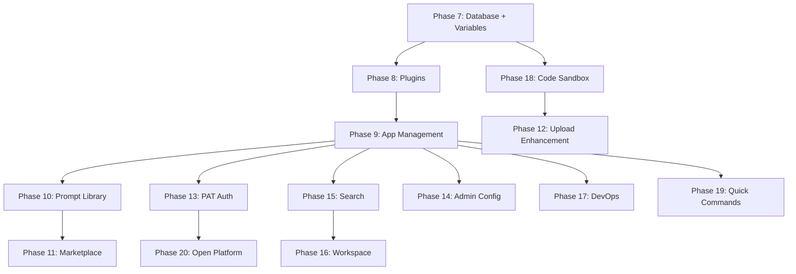

# Phase 7-20: Coze Studio Full Feature Implementation Plan

## Current State Summary

**Phase 0-6 are complete**, including:

- LLM Provider abstraction, Vector Store, Document Parsing, Event Bus (Phase 0)
- Model Management (Phase 2), Agent CRUD + Publish (Phase 3)
- Conversation/Chat with SSE streaming and RAG integration (Phase 4-5)
- AI Workflow engine with 7 node types, canvas editor, execution/debug (Phase 6)

**Existing infrastructure to reuse across all remaining phases:**

- `Atlas.WorkflowCore` engine + DSL builder
- `ILlmProviderFactory`, `IVectorStore`, `IRagRetrievalService`
- `IBackgroundWorkQueue`, `IEventBus`
- `IFileStorageService`, `ICurrentUserAccessor`
- RBAC permission system, JWT auth middleware
- SqlSugar ORM with `RepositoryBase<T>`, multi-tenancy via `TenantEntity`
- Frontend: Vue 3 + Ant Design Vue + Vue Flow + Vite

---

## Phase 7: Database & Variable System (20 tasks)

> Coze reference: Memory/Database module (28 APIs)
> Priority: **High** -- needed by workflow database nodes (6.4.18-22) and agent memory

### 7.1 Backend - Database (10 tasks)

**Domain Entity**: `src/backend/Atlas.Domain/AiPlatform/Entities/AiDatabase.cs`

```csharp
public sealed class AiDatabase : TenantEntity
{
    public string Name { get; private set; }
    public string? Description { get; private set; }
    public long? BotId { get; private set; }  // nullable, bound to Agent
    public string TableSchema { get; private set; }  // JSON: column definitions
    public int RecordCount { get; private set; }
    public DateTime CreatedAt { get; private set; }
}
```

**Key files to create:**

- `Atlas.Domain/AiPlatform/Entities/AiDatabase.cs` -- entity
- `Atlas.Domain/AiPlatform/Entities/AiDatabaseRecord.cs` -- record row entity (dynamic columns stored as JSON)
- `Atlas.Application/AiPlatform/Abstractions/IAiDatabaseService.cs` -- CRUD + bind/unbind + records query/update
- `Atlas.Application/AiPlatform/Models/AiDatabaseModels.cs` -- DTOs
- `Atlas.Infrastructure/Repositories/AiDatabaseRepository.cs`
- `Atlas.Infrastructure/Repositories/AiDatabaseRecordRepository.cs`
- `Atlas.Infrastructure/Services/AiPlatform/AiDatabaseService.cs`
- `Atlas.WebApi/Controllers/AiDatabasesController.cs` -- REST endpoints

**Controller endpoints** (`/api/v1/ai-databases`):

- CRUD: GET list, GET by id, POST create, PUT update, DELETE
- Bind/Unbind: POST `/{id}/bind/{agentId}`, POST `/{id}/unbind`
- Records: GET `/{id}/records`, POST `/{id}/records`, PUT `/{id}/records/{recordId}`, DELETE `/{id}/records/{recordId}`
- Schema: GET `/{id}/schema`, POST `/{id}/schema/validate`
- Import: POST `/{id}/import` (async, via BackgroundWorkQueue), GET `/{id}/import/progress`
- Template: GET `/{id}/template` (export CSV/XLSX template)

### 7.2 Backend - Variable System (6 tasks)

**Domain Entity**: `Atlas.Domain/AiPlatform/Entities/AiVariable.cs`

```csharp
public sealed class AiVariable : TenantEntity
{
    public string Key { get; private set; }
    public string? Value { get; private set; }
    public AiVariableScope Scope { get; private set; }  // System, Project, Bot
    public long? ScopeId { get; private set; }  // ProjectId or BotId
}
```

**Key files:**

- `Atlas.Domain/AiPlatform/Entities/AiVariable.cs`
- `Atlas.Application/AiPlatform/Abstractions/IAiVariableService.cs` -- KV CRUD + system variable config
- `Atlas.Infrastructure/Services/AiPlatform/AiVariableService.cs`
- `Atlas.WebApi/Controllers/AiVariablesController.cs`

### 7.3 Frontend (4 tasks)

- `pages/ai/AiDatabaseListPage.vue` -- database list with create modal
- `pages/ai/AiDatabaseDetailPage.vue` -- record management (table view with CRUD)
- Data import modal component
- `pages/ai/AiVariablesPage.vue` -- variable management panel (KV editor)
- `services/api-ai-database.ts`, `services/api-ai-variable.ts`

---

## Phase 8: Plugin System (16 tasks)

> Coze reference: Plugin module (27 APIs, 22 built-in plugins)
> Priority: **High** -- Agent tool-calling depends on plugins

### 8.1 Backend (12 tasks)

**Domain Entities**: `Atlas.Domain/AiPlatform/Entities/`

- `AiPlugin.cs` -- Name, Description, Type (API/Function), Status (Draft/Published), AuthType (None/ApiKey/OAuth)
- `AiPluginApi.cs` -- PluginId, Name, Method, Path, RequestSchema (JSON), ResponseSchema (JSON)

**Key services:**

- `IAiPluginService` -- CRUD + publish + debug + OpenAPI conversion
- `AiPluginService.cs` in Infrastructure
- `AiPluginsController.cs` -- full REST API

**Controller endpoints** (`/api/v1/ai-plugins`):

- Plugin CRUD: GET list, GET by id, POST, PUT, DELETE
- API CRUD: GET `/{id}/apis`, POST `/{id}/apis`, PUT `/{id}/apis/{apiId}`, DELETE `/{id}/apis/{apiId}`, POST `/{id}/apis/batch`
- Debug: POST `/{id}/apis/{apiId}/debug` -- executes API call and returns result
- Publish: POST `/{id}/publish`
- Convert: POST `/convert-openapi` -- import from OpenAPI spec
- Lock: POST `/{id}/lock`, POST `/{id}/unlock` (edit locking)
- Built-in plugin metadata: GET `/built-in` (returns 22 built-in plugin descriptors from embedded JSON)

**Built-in plugins** (stored as embedded JSON resource `BuiltInPlugins.json`):

- Web Search, Image Generation, Code Interpreter, Weather, News, Calculator, etc.

### 8.2 Frontend (4 tasks)

- `pages/ai/AiPluginListPage.vue` -- plugin list
- `pages/ai/AiPluginDetailPage.vue` -- API management per plugin
- `pages/ai/AiPluginApiEditorPage.vue` -- API endpoint editor (method/path/schema/auth)
- `components/ai/PluginDebugPanel.vue` -- test API calls inline
- `services/api-ai-plugin.ts`

---

## Phase 9: Application/Project Management (10 tasks)

> Coze reference: Intelligence/App module (15 APIs)
> Priority: **Medium** -- aggregates Agent + Workflow + Plugin + Knowledge into deployable apps

### 9.1 Backend

**Domain Entity**: `Atlas.Domain/AiPlatform/Entities/AiApp.cs`

- Name, Description, Status (Draft/Published)
- AgentId, WorkflowIds (JSON array), PluginIds (JSON array), KnowledgeBaseIds (JSON array)
- PublishVersion, CreatorId

**Key files:**

- `IAiAppService.cs` -- CRUD + publish + version check + resource copy
- `AiAppService.cs`
- `AiAppsController.cs`

**Controller endpoints** (`/api/v1/ai-apps`):

- CRUD: standard 5 endpoints
- Publish: POST `/{id}/publish`
- Version: GET `/{id}/version-check`
- Publish records: GET `/{id}/publish-records`
- Resource copy: POST `/{id}/resource-copy`, GET `/resource-copy/{taskId}`

### 9.2 Frontend

- `pages/ai/AiAppListPage.vue` -- app list (cards showing contained resources)
- `pages/ai/AiAppEditorPage.vue` -- project IDE style: left sidebar for resources, center for config
- `services/api-ai-app.ts`

---

## Phase 10: Prompt Management (7 tasks)

> Coze reference: Prompt module (4 APIs)
> Priority: **Medium** -- enhances Agent and Workflow LLM nodes

### Backend

- `AiPromptTemplate.cs` entity (Name, Content, Category, IsOfficial, Tags JSON)
- `IAiPromptService.cs` -- Upsert, GetById, List (with search/filter), Delete, ListOfficial
- `AiPromptService.cs`, `AiPromptTemplatesController.cs`

### Frontend

- `pages/ai/AiPromptLibraryPage.vue` -- prompt list with categories, search, tags
- `components/ai/PromptInsertModal.vue` -- insert prompt into Agent editor / Workflow LLM node
- `services/api-ai-prompt.ts`

---

## Phase 11: Marketplace / Explore (10 tasks)

> Coze reference: Marketplace module (10 APIs)
> Priority: **Low** -- discovery and sharing layer

### Backend

- `AiMarketplaceProduct.cs` entity (Type: Agent/Plugin/Workflow/Template, Name, Description, AuthorId, CategoryId, FavoriteCount, DuplicateCount)
- `AiProductCategory.cs` entity
- `IAiMarketplaceService.cs` -- List, Detail, Search, Suggest, Favorite/Unfavorite, GetFavorites, DuplicateToWorkspace
- `AiMarketplaceController.cs`

### Frontend

- `pages/ai/AiMarketplacePage.vue` -- grid/list of products with categories and search
- `pages/ai/AiMarketplaceDetailPage.vue` -- product detail with "Add to Workspace" button
- `services/api-ai-marketplace.ts`

---

## Phase 12: Upload System Enhancements (4 tasks)

> Coze reference: Upload module (3 APIs)
> Priority: **Medium** -- needed for large file handling

### Backend (extend existing `FilesController`)

- Chunked upload: POST `/api/v1/files/upload/init`, POST `/api/v1/files/upload/part`, POST `/api/v1/files/upload/complete`
- Image upload with processing: POST `/api/v1/files/images/apply`, POST `/api/v1/files/images/commit`
- Open API file upload: POST `/api/v1/files/upload` (multipart)
- Signed URL: GET `/api/v1/files/{id}/signed-url`

Implementation: extend `IFileStorageService` with `InitChunkedUploadAsync`, `UploadPartAsync`, `CompleteChunkedUploadAsync`. Store parts in temp directory, merge on complete.

---

## Phase 13: PAT / Permission System (10 tasks)

> Coze reference: Permission/OpenAuth module (7 APIs)
> Priority: **Medium** -- required for Open API access

### Backend

**Domain Entity**: `Atlas.Domain/AiPlatform/Entities/PersonalAccessToken.cs`

- Name, TokenHash (SHA256), Permissions (JSON array of scopes), ExpiresAt, LastUsedAt, CreatorId

**Key files:**

- `IPersonalAccessTokenService.cs` -- CRUD + validate
- `PersonalAccessTokenService.cs`
- `PersonalAccessTokensController.cs`
- `PatAuthenticationHandler.cs` -- ASP.NET Core auth handler for Bearer token validation
- Middleware: check `Authorization: Bearer pat_xxx` header, resolve tenant + user from PAT

**Controller endpoints** (`/api/v1/personal-access-tokens`):

- CRUD: GET list, GET by id, POST create (returns token once), PUT update permissions, DELETE
- The actual token value is only returned on creation (never stored in plaintext)

### Frontend

- `pages/settings/PersonalAccessTokensPage.vue` -- PAT list with create/revoke
- `services/api-pat.ts`

---

## Phase 14: Admin Console Enhancements (3 tasks)

> Coze reference: Admin module (7 APIs)
> Priority: **Low** -- mostly already covered by existing admin pages

### Backend

- `GET/PUT /api/v1/admin/config/basic` -- basic configuration (site name, default model, etc.)
- `GET/PUT /api/v1/admin/config/knowledge` -- knowledge base defaults (chunk size, overlap, embedding model)
- Extend existing `SystemConfigsController` or create `AdminConfigController`

### Frontend

- Extend existing admin layout with new config sections
- `pages/admin/AiConfigPage.vue` -- AI platform configuration (default models, knowledge settings)

---

## Phase 15: Search System (6 tasks)

> Coze reference: Search + EventBus module
> Priority: **Low** -- quality-of-life improvement

### Backend

- `IAiSearchService.cs` -- global search across agents, workflows, plugins, knowledge bases, apps
- `AiSearchService.cs` -- queries multiple repositories with text matching (LIKE / full-text)
- `GET /api/v1/ai/search?q=&type=` -- unified search endpoint
- `GET /api/v1/ai/recent` -- recently edited resources by current user
- Event handlers: on resource create/update/delete, optionally sync to Elasticsearch (future)

### Frontend

- `components/ai/GlobalSearchBar.vue` -- search input in top bar with dropdown results
- `pages/ai/AiSearchResultsPage.vue` -- full search results page

---

## Phase 16: Workspace / Space (4 tasks)

> Coze reference: Space / Develop / Library
> Priority: **Low** -- organizational layer

### Backend

- `AiWorkspace.cs` entity (Name, Description, OwnerId, Members JSON)
- `IAiWorkspaceService.cs` -- CRUD + member management
- `AiWorkspacesController.cs`

### Frontend

- `pages/ai/AiWorkspacePage.vue` -- develop list (all resources in workspace)
- `pages/ai/AiLibraryPage.vue` -- resource library (grouped by type: Plugin/Workflow/Knowledge/Prompt/Database)
- Sidebar update: workspace switcher component

---

## Phase 17: DevOps / Debug (4 tasks)

> Priority: **Low** -- developer tooling

### Frontend-focused

- `pages/ai/AiTestSetsPage.vue` -- test set management (create test cases for agents/workflows)
- `pages/ai/AiMockSetsPage.vue` -- mock data sets for testing
- `components/ai/TraceViewer.vue` -- trace tree / span detail viewer (for workflow execution debugging)
- `components/ai/PreviewPanel.vue` -- JSON / PDF / Image preview component

---

## Phase 18: Code Sandbox (4 tasks)

> Priority: **Medium** -- needed for CodeRunner workflow node

### Backend

- `ICodeExecutionService.cs` -- interface for code execution
- `DirectPythonExecutor.cs` -- execute Python via `System.Diagnostics.Process` (basic, for dev)
- `SandboxedPythonExecutor.cs` -- execute in isolated Docker container (production)
- `CodeExecutionOptions.cs` -- whitelist of allowed modules, timeout, memory limit
- Wire into existing `CodeRunnerStep` in workflow engine

---

## Phase 19: Quick Commands & Playground (4 tasks)

> Priority: **Low** -- UX enhancements

### Backend + Frontend

- `AiShortcutCommand.cs` entity (Name, Command, AgentId)
- CRUD endpoints for shortcut commands
- `components/ai/OnboardingGuide.vue` -- first-time user onboarding
- Bot popup info endpoints (Get/Update)

---

## Phase 20: Open Platform / SDK (10 tasks)

> Priority: **Medium** -- external API access for third-party integrations

### Backend

All Open API endpoints under `/api/v1/open/`:

- `POST /api/v1/open/chat` -- Chat v3 API (SSE + sync), authenticated via PAT (Phase 13)
- `POST /api/v1/open/chat/cancel`
- `GET /api/v1/open/chat/{chatId}`
- `GET /api/v1/open/chat/{chatId}/messages`
- Knowledge CRUD: `/api/v1/open/datasets/`* (mirror of internal API with PAT auth)
- Bot info: `GET /api/v1/open/bots/{botId}`
- App info: `GET /api/v1/open/apps/{appId}`
- File upload: `POST /api/v1/open/files/upload`
- Workflow run: `POST /api/v1/open/workflows/{id}/run`, `POST /api/v1/open/workflows/{id}/stream`

**Implementation pattern**: Create `OpenApiController` classes that delegate to existing services but use PAT authentication instead of JWT. Add `[Authorize(AuthenticationSchemes = "Pat")]` attribute.

### Frontend

- `pages/ai/AiOpenPlatformPage.vue` -- API documentation + SDK integration guide
- Web Chat SDK embed code generator

---

## Recommended Implementation Order




**Batch 1 (Core Platform)**: Phase 7 + 8 + 18 -- Database/Variable + Plugin + Code Sandbox
**Batch 2 (App Layer)**: Phase 9 + 10 + 13 -- App management + Prompt + PAT
**Batch 3 (External)**: Phase 20 + 12 -- Open Platform + Upload enhancements
**Batch 4 (Polish)**: Phase 11 + 14 + 15 + 16 + 17 + 19 -- Marketplace + Admin + Search + Workspace + DevOps + Commands