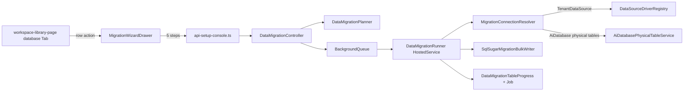

## 一、关键调研结论（决定设计）

- 后端 `DataMigrationController`（[src/backend/Atlas.AppHost/Controllers/DataMigrationController.cs](src/backend/Atlas.AppHost/Controllers/DataMigrationController.cs)）已暴露 11 个端点（`test-connection`/`jobs`/`precheck`/`start`/`progress`/`validate`/`cutover`/`rollback`/`retry`/`report`/`logs`），**尚缺 `cancel`**。
- `OrmDataMigrationService`（[src/backend/Atlas.Infrastructure/Services/SetupConsole/OrmDataMigrationService.cs](src/backend/Atlas.Infrastructure/Services/SetupConsole/OrmDataMigrationService.cs)）**不是 stub**，但：
  - `DefaultBatchSize = 500`，使用 `Insertable(T[]).ExecuteCommand()` 而不是 `Fastest<T>().BulkCopy`；
  - 在 HTTP 线程里同步跑完全部实体（违反“不能在请求线程跑完整流程”）；
  - `OpenScope` 把未知 dbType 静默 fallback 到 `DbType.Sqlite`（违反要求）；
  - 未按 `ModuleScope` / `selectedEntities` 过滤，总是跑 `AtlasOrmSchemaCatalog.RuntimeEntities` 全量；
  - 只支持“整库实体集合”迁移，**不支持按原始表名迁移**，因此 AiDatabase（两张物理表）无法接入。
- `DbConnectionConfig` DTO 已在 [SetupConsoleModels.cs](src/backend/Atlas.Application/SetupConsole/Models/SetupConsoleModels.cs) 里存在，但缺 `Mode/DataSourceId/VisualConfig/DisplayName`；`DataMigrationProgressDto` 缺 `tables[]`/`currentTableName`/`currentBatchNo`/`elapsedSeconds`/`recentLogs`/`startedAt`/`finishedAt`。
- `DataMigrationTableProgress` 实体**不存在**，需新增并注册进 [AtlasOrmSchemaCatalog.cs](src/backend/Atlas.Infrastructure/Services/AtlasOrmSchemaCatalog.cs)。
- `TenantDataSource` 全套 CRUD + `/test` + `/test/{id}` + `/drivers` 已在 [TenantDataSourcesController.cs](src/backend/Atlas.AppHost/Controllers/TenantDataSourcesController.cs)；前端暂无对应 service 文件（只有 e2e 直接 HTTP + `shared-react-core` 的类型），**需要新建** `api-tenant-datasource.ts`。
- `DataSourceDriverRegistry`（[src/backend/Atlas.Infrastructure/Services/DataSourceDriverRegistry.cs](src/backend/Atlas.Infrastructure/Services/DataSourceDriverRegistry.cs)）支持：SQLite/SqlServer/MySql/PostgreSQL/Oracle/Dm/Kdbndp/Oscar/Access。迁移层要复用它而不是自造 if/else。
- AiDatabase（[src/backend/Atlas.Domain/AiPlatform/Entities/AiDatabase.cs](src/backend/Atlas.Domain/AiPlatform/Entities/AiDatabase.cs)）没有独立连接串，行数据在主库两张表 `atlas_ai_db_{tenantN}_{dbId}_draft/_online`（由 `AiDatabasePhysicalTableService.BuildTableNames` 生成）。因此"源"需要特殊 Source Mode = `CurrentSystemAiDatabase`，由 Resolver 读出 AiDatabase 实体、解析为表名列表后交给 Runner。
- 资源库数据库 Tab 不是独立文件，在 [workspace-library-page.tsx](src/frontend/apps/app-web/src/app/pages/workspace-library-page.tsx) 中通过 `activeTab === "database"` 切换；创建入口是 `LibraryCreateDropdown` + `library-create-modal.tsx`。
- 迁移页 [migration-tab.tsx](src/frontend/apps/app-web/src/app/pages/setup-console/migration-tab.tsx) 当前全走 `../../../services/mock`；[api-setup-console.ts](src/frontend/apps/app-web/src/services/api-setup-console.ts) 中 11 个 `migration*` 方法 `throw new Error("[setup-console] migration endpoints land in M6.")`。
- UI 框架：Semi Design + coze-design，**不**引入新框架。

## 二、架构与数据流



## 三、后端改动（分层）

### 1. 实体与 Schema

在 [SetupConsoleEntities.cs](src/backend/Atlas.Domain/Setup/Entities/SetupConsoleEntities.cs) 新增：

```csharp
[SugarTable("setup_data_migration_table_progress")]
public sealed class DataMigrationTableProgress : TenantEntity {
  Guid JobId; string EntityName; string TableName; string State;
  long SourceRows; long TargetRowsBefore; long TargetRowsAfter;
  long CopiedRows; long FailedRows;
  int BatchSize; int CurrentBatchNo; int TotalBatchCount;
  string? LastMaxId; double ProgressPercent;
  DateTime? StartedAt; DateTime? FinishedAt;
  string? ErrorMessage;
  DateTime CreatedAt; DateTime UpdatedAt;
}
```
并加到 [AtlasOrmSchemaCatalog.cs](src/backend/Atlas.Infrastructure/Services/AtlasOrmSchemaCatalog.cs) 的 `AllRuntimeEntityTypes`。

### 2. DTO 扩展（[SetupConsoleModels.cs](src/backend/Atlas.Application/SetupConsole/Models/SetupConsoleModels.cs)）

- 扩展 `DbConnectionConfig`：加 `Mode ("CurrentSystem"|"CurrentSystemAiDatabase"|"SavedDataSource"|"ConnectionString"|"VisualConfig")`、`DataSourceId:long?`、`VisualConfig: Dictionary<string,string>?`、`DisplayName`、`AiDatabaseId:long?`；保留旧字段做兼容。
- 扩展 `DataMigrationJobCreateRequest`：加 `WriteMode ("InsertOnly"|"TruncateThenInsert"|"Upsert")`、`CreateSchema`、`MigrateSystemTables`、`MigrateFiles`、`ValidateAfterCopy`、`SelectedTables`、`ExcludedTables`。
- 新增 `DataMigrationTableProgressDto`、扩展 `DataMigrationProgressDto` 加 `Tables/CurrentTableName/CurrentBatchNo/TotalRows/CopiedRows/StartedAt/FinishedAt/ElapsedSeconds/RecentLogs`。
- 新增 `DataMigrationPrecheckResultDto`：`TableCount/TotalRows/EstimatedBatches/UnsupportedTables/TargetNonEmptyTables/MissingTargetTables/Warnings`。
- 新增 `DataMigrationCutoverRequest.ConfirmBackup/ConfirmRestartRequired`（必须同时 `true`）。

### 3. 抽象与实现（新文件）

Application：
- `Atlas.Application/SetupConsole/Abstractions/IDataMigrationPlanner.cs`
- `Atlas.Application/SetupConsole/Abstractions/IDataMigrationRunner.cs`
- `Atlas.Application/SetupConsole/Abstractions/IMigrationBulkWriter.cs`
- `Atlas.Application/SetupConsole/Abstractions/IMigrationConnectionResolver.cs`

Infrastructure：
- `Atlas.Infrastructure/Services/SetupConsole/DataMigrationPlanner.cs`
- `Atlas.Infrastructure/Services/SetupConsole/DataMigrationRunner.cs`
- `Atlas.Infrastructure/Services/SetupConsole/SqlSugarMigrationBulkWriter.cs`
- `Atlas.Infrastructure/Services/SetupConsole/MigrationConnectionResolver.cs`
- `Atlas.Infrastructure/Services/SetupConsole/DataMigrationBackgroundQueue.cs`（`Channel<Guid>` 队列）
- `Atlas.Infrastructure/Services/SetupConsole/DataMigrationHostedService.cs`（`BackgroundService` 消费）

`OrmDataMigrationService` 保留为门面：`CreateJob/GetProgress/Validate/Cutover/Rollback/Retry/GetLogs/GetReport/TestConnection` 直接查 DB；`StartJobAsync` 改为**只**入队 `DataMigrationBackgroundQueue` 并立刻返回 `DataMigrationJobDto`。

### 4. MigrationConnectionResolver 规则（[DataSourceDriverRegistry.cs](src/backend/Atlas.Infrastructure/Services/DataSourceDriverRegistry.cs) 统一）

- `Mode=CurrentSystem` → 复用主机 `ISqlSugarClient` 的连接与 DbType。
- `Mode=CurrentSystemAiDatabase` → 主机连接 + `AiDatabasePhysicalTableService.ResolveTableNames(aiDb)` 得到 `[draft, online]`，`PlannerInput.RawTables = [..]`。
- `Mode=SavedDataSource` → `ITenantDataSourceService.GetDecryptedAsync(tenantId, dataSourceId)` 得到 `(connectionString, driverCode)`。**验证 tenantId**。
- `Mode=ConnectionString` → 直接使用；必须同时给 `driverCode`。
- `Mode=VisualConfig` → `DataSourceDriverRegistry` 拼串（或现有 `BuildConnectionString` 若已存在）。
- **禁止** `DbType.Sqlite` 兜底：`ResolveDbType(driverCode)` 抛 `NotSupportedException` 的情况直接返回 400 `UNSUPPORTED_DRIVER`。
- 源/目标指纹一致 → `MIGRATION_SAME_SOURCE_TARGET`。

### 5. Planner 规则（[DataMigrationPlanner.cs])

- 输入：`source`/`target` 已解析、`moduleScope/selectedEntities/selectedTables/excludedEntities/excludedTables/migrateSystemTables`。
- 两种计划单元：
  - **EntityUnit**：来自 `AtlasOrmSchemaCatalog`，按 ModuleScope 过滤；使用 `db.EntityMaintenance.GetTableName` 得表名；主键字段用 SqlSugar 元信息取 `IsPrimaryKey` 列。
  - **TableUnit**：直接给定表名（用于 AiDatabase 场景）；主键列：`atlas_row_id`（由 [AiDatabasePhysicalTableService.cs](src/backend/Atlas.Infrastructure/Services/AiPlatform/AiDatabasePhysicalTableService.cs) 的 `RowIdColumn` 决定）。
- 默认**排除**：`DataMigrationJob/Batch/Checkpoint/Log/Report/TableProgress` + `SetupConsoleToken/SetupSeedBundleLog`（由 `migrateSystemTables=false` 控制）。
- 预检查阶段：对每单元 `COUNT(*)` 源/目标；写入 `DataMigrationTableProgress` 初始行；统计 `EstimatedBatches = ceil(sourceRows/batchSize)`；生成 warnings（目标非空、缺表、无稳定排序键）。

### 6. BulkWriter（[SqlSugarMigrationBulkWriter.cs]）

- 对 EntityUnit：
  - 读：`db.Queryable<T>().Where(keyset).OrderBy(pk).Take(batchSize).ToList()`；
  - 写：优先 `await targetDb.Fastest<T>().BulkCopyAsync(list)`；捕获 `NotSupportedException`/驱动异常 → 降级 `targetDb.Insertable(list).UseParameter().ExecuteCommandAsync()` 并 `_log.LogWarning("BulkCopy not supported for {Driver}/{Entity}, fallback to batch insert")` 写入 `DataMigrationLog`。
- 对 TableUnit（AiDatabase 两张表）：
  - 读：`db.Ado.SqlQueryAsync<Dictionary<string,object>>($"SELECT * FROM {quote(tbl)} WHERE {pk} > @id ORDER BY {pk} ASC LIMIT @take", ...)`；
  - 写：`db.Fastest(tableName).BulkCopyAsync(dictList)`（SqlSugar 支持按字典批拷）；不支持时降级 `db.Insertable(dictList).AS(tableName).ExecuteCommandAsync()`。
- **默认 batchSize = 10000**；禁止无 OrderBy 的 Skip/Take；keyset pagination by pk；`LastMaxId` 持久化到 `DataMigrationCheckpoint + TableProgress`。
- WriteMode：
  - `InsertOnly`：目标非空在预检查阶段 warning。
  - `TruncateThenInsert`：开始前 `db.DbMaintenance.TruncateTable(tableName)`，失败降级 `DELETE FROM tbl`。
  - `Upsert`：SqlSugar `Storageable(list).ExecuteCommand()`；对无主键表返回 `UPSERT_NOT_SUPPORTED` 让前端置灰（Planner 阶段就识别并在 DTO 返回 `supportedWriteModes`）。

### 7. Runner + 后台队列

- `DataMigrationBackgroundQueue`：`Channel<Guid>` (unbounded)，单例；`EnqueueAsync(jobId)`。
- `DataMigrationHostedService : BackgroundService`：后台 `await foreach (var jobId in _queue.Reader.ReadAllAsync(stoppingToken))` → `await using var scope = _sp.CreateAsyncScope(); var runner = scope.ServiceProvider.GetRequiredService<IDataMigrationRunner>(); await runner.RunAsync(jobId, ct)`。
- `DataMigrationRunner.RunAsync(jobId)`：
  1. 读 job → `Job.MarkRunning()`；
  2. 按 plan 遍历 units，每 unit：`tableProgress.State=running` → 循环 batch → 每 batch `Bulk.WriteBatchAsync` → 更新 `TableProgress/Checkpoint/Batch/Job`；
  3. **每 batch 前**检查 `job.State == "cancelling"`，是则标记 cancelled + 退出；
  4. 失败单张表：`tableProgress.State=failed` + 记录 `ErrorMessage`，**不中断**后续表；
  5. 全部完成：`job.State = succeeded/failed(if any failed)` → 若 `validateAfterCopy=true` 自动调 `ValidateJobAsync`。

### 8. Cancel 端点 + Controller 补齐

- 在 [DataMigrationController.cs](src/backend/Atlas.AppHost/Controllers/DataMigrationController.cs) 新增：
  - `POST jobs/{jobId}/cancel` → `OrmDataMigrationService.CancelJobAsync`（将 `job.State` 从 `running` → `cancelling`；`created/ready/queued` 直接 `cancelled`）。
- `start`、`precheck`、`validate`、`cutover` 签名对齐新 DTO；保留旧字段向后兼容。
- `cutover` 前置校验：`job.State == "validated"` 且 `req.ConfirmBackup && req.ConfirmRestartRequired`；写 runtime 配置失败 → `job.State=cutover_failed`，返回 500，**不能**返回成功。

### 9. 注册（[PlatformServiceCollectionExtensions.cs]）

```csharp
services.AddSingleton<IDataMigrationBackgroundQueue, DataMigrationBackgroundQueue>();
services.AddHostedService<DataMigrationHostedService>();
services.AddScoped<IDataMigrationPlanner, DataMigrationPlanner>();
services.AddScoped<IDataMigrationRunner, DataMigrationRunner>();
services.AddScoped<IMigrationBulkWriter, SqlSugarMigrationBulkWriter>();
services.AddScoped<IMigrationConnectionResolver, MigrationConnectionResolver>();
```

## 四、前端改动

### 1. 新增 service 文件
- `src/frontend/apps/app-web/src/services/api-tenant-datasource.ts`：`list/get/create/update/delete/test/testAdhoc/getDrivers`，类型复用 `shared-react-core`。

### 2. [api-setup-console.ts](src/frontend/apps/app-web/src/services/api-setup-console.ts) 修改
- 删除 11 个 `throw new Error("[setup-console] migration endpoints land in M6.")`，替换为 `fetchConsoleJson`：
  - `POST /api/v1/setup-console/migration/test-connection`
  - `POST /jobs`、`/jobs/{id}/precheck`、`/start`、`/cancel`、`/validate`、`/cutover`、`/rollback`、`/retry`
  - `GET /jobs/{id}/progress`、`/report`、`/logs`
- 扩展前端 TS 类型与后端新 DTO 对齐（`DbConnectionConfigDto.mode`、`DataMigrationProgressDto.tables[]` 等）。

### 3. 迁移向导组件（新建）
`src/frontend/apps/app-web/src/app/pages/components/migration-wizard/`：
- `migration-wizard-drawer.tsx`（Semi `SideSheet` 960px+ / `Steps`）
- `step1-source.tsx`（展示 AiDatabase 信息 + 预解析两张物理表表名 + 检测连接）
- `step2-target.tsx`（两个 Tab：SavedDataSource 表格 + 新建目标库表单；表单内嵌用 step5 的 CreateDataSource 组件；测试连接按钮）
- `step3-config.tsx`（range/writeMode/batchSize/createSchema/migrateSystemTables + 预检查结果卡片）
- `step4-progress.tsx`（轮询 1.5s；总进度 + 表格 `tables[]`；暂停按钮 disabled + tooltip "后端暂未支持"；取消按钮接 cancel）
- `step5-validate-cutover.tsx`（validate 结果 + cutover 二次确认勾选 + 两个 confirm 复选框）

### 4. 资源库数据库 Tab 行菜单 [workspace-library-page.tsx](src/frontend/apps/app-web/src/app/pages/workspace-library-page.tsx)
- 在 `activeTab === "database"` 的行 actions Dropdown 中新增：详情 / 复制到其它空间 / **迁移到目标库** / 备份（disabled "待实现"）/ 删除。
- 点击"迁移到目标库" → `openMigrationWizard({ source: { mode: "CurrentSystemAiDatabase", aiDatabaseId } })`。

### 5. 新建数据库资源
- [library-create-dropdown.tsx](src/frontend/apps/app-web/src/app/pages/components/library-create-dropdown.tsx) 在下拉菜单追加"数据库"。
- 新建组件 `src/frontend/apps/app-web/src/app/pages/components/create-datasource-modal.tsx`：
  - Tab：可视化配置 / 连接字符串；
  - 字段动态跟 `driverCode` 变化（`DataSourceDriverRegistry.Definitions` via `GET /api/v1/tenant-datasources/drivers`）；
  - "测试连接"必须通过才可"保存"；
  - 保存调 `POST /api/v1/tenant-datasources`，成功后回流两个地方：资源库数据库 Tab 刷新 + 迁移向导 Step2 的已保存数据源列表刷新。

### 6. [migration-tab.tsx](src/frontend/apps/app-web/src/app/pages/setup-console/migration-tab.tsx) 改接真 API
- `from "../../../services/mock"` → 改引 `setupConsoleApi`；共享 step 组件与向导；支持展示 `tables[]` 新字段。

## 五、安全与边界

- 连接字符串/密码**不回显**：`TenantDataSourceDto` 已屏蔽 `encryptedConnectionString`；迁移 DTO 新增字段 `maskedTargetDescription` 用于 UI 展示。
- `Mode=ConnectionString` 在 `DbConnectionConfig` 存进 job 时**加密**（复用 `ITenantDataSourceCryptoService` 若存在，否则用 `IDataProtector`）。
- `DataMigrationLog` 仅记录 host/port/dbName，不记录密码。
- 所有迁移接口进入时 `tenantIdValue = _tenantProvider.CurrentTenantIdValue`；`DataMigrationJob` 已是 `TenantEntity`，所有查询都带 tenant 过滤。
- cutover 必须 `ConfirmBackup=true && ConfirmRestartRequired=true`，否则 400。
- 源/目标指纹相同时：阻止（400 `MIGRATION_SAME_SOURCE_TARGET`）。

## 六、验收与本地验证

1. 建 MySQL 目标：资源库 → 新建 → 数据库 → MySQL → 填配置 → 测试 → 保存。
2. 资源库-数据库 Tab → 某 AiDatabase 行 → 迁移到目标库 → Step2 选刚建的 MySQL → Step3 预检查 → Start → Step4 观察 draft/online 两张表进度 → Step5 validate → cutover（勾两个确认）。
3. SQLite → MySQL 的 AiDatabase 迁移：验证 BulkCopy 路径 or 降级 warning 存在 `DataMigrationLog`。
4. `swagger` 或 curl `GET /api/v1/setup-console/migration/jobs/{id}/progress` 看到 `tables` 数组。

## 七、已知限制（计划明示）

- BulkCopy 已验证：MySQL / SqlServer / PostgreSQL / SQLite。Oracle / Dm / Kdbndp / Oscar 优先尝试 BulkCopy，失败记 warning 自动降级 `Insertable`。
- `Upsert` 仅对有主键且 SqlSugar `Storageable` 支持的驱动启用；其它驱动后端返回 `supportedWriteModes` 让前端置灰。
- 附件/文件物理复制本轮**仅保留 DTO 字段**（`migrateFiles`）与后端占位，不实际复制文件存储。
- "重试失败表"按钮接现有 `retry`，但目前 retry 语义是整个 job；若 job 级 retry 不能精确到表，按钮上给 tooltip "将重试失败任务"，不做假细粒度。
- 暂停能力 Runner 本轮不实现，UI 暂停按钮 disabled 并标注。

## 八、输出清单（交付时提供）

1. 修改/新建后端文件清单（约 18 个）。
2. 修改/新建前端文件清单（约 10 个）。
3. 新 API：`POST cancel`；其余 10 个由 throw → 真 HTTP。
4. 新表：`setup_data_migration_table_progress`。
5. 编译自检：`dotnet build` + `pnpm --filter app-web typecheck`。
