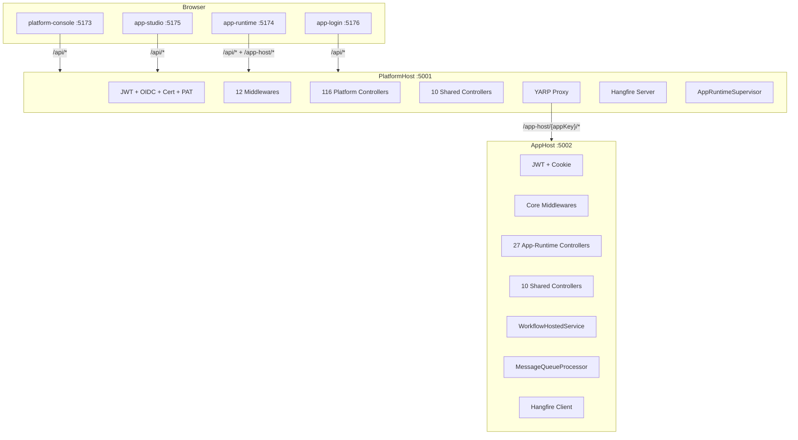

# WebApi 分拆到 PlatformHost + AppHost 实施计划

## 现状快照

- **WebApi** (`:5000`)：690 行 Program.cs，150 个控制器（153 个类），完整 JWT/OIDC/证书/PAT 认证、12 个中间件、Hangfire Server、WorkflowHostedService
- **PlatformHost** (`:5001`)：骨架，1 个兼容代理控制器，**无认证管道**，固定 `TenantId.Empty`
- **AppHost** (`:5002`)：已有 JWT 认证，3 个控制器（Health/PageRuntime/AppAuth），已注册 Shared+Platform+AppRuntime 全量服务
- **前端**：4 个 HTML 入口已建好，Vite proxy 仅指向 WebApi:5000

## 控制器归属（核验完毕）

- **PlatformHost**：116 个控制器（用户/角色/权限/菜单/部门/职位/租户/Auth/SSO/MFA/审计/监控/诊断/系统配置/许可证/应用目录/发布管理/治理/Agent设计/AI设计/LowCode设计/LogicFlow设计/工作流设计/批处理管理/数据源/动态表元数据/订阅/资源中心等）
- **AppHost**：27 个控制器（PageRuntime/DynamicTableRecords/审批运行时/工作流执行/AgentChat/AI助手/多模态/对话/仪表盘/报表/嵌入聊天/Open API 代理等）
- **共享**：10 个控制器（Health/Files/Dict/Notifications/Messages/TableViews/Secure/WorkflowV2/AiWorkflows）

## 目标架构



---

## Phase A -- PlatformHost 获得 WebApi 全部平台能力（13 cases）

### A-1. 抽取 WebApi 共享基础设施到类库

将 WebApi 中 PlatformHost 和 AppHost 都需要的类型抽到 `Atlas.WebApi` 项目内的共享目录（不新建项目，仅做 `AddApplicationPart` 引用）：

- [Authorization/](src/backend/Atlas.WebApi/Authorization/) -- `PermissionPolicyProvider`、`PermissionAuthorizationHandler`、`ApiAuthorizationMiddlewareResultHandler` 等 6 个文件
- [Security/](src/backend/Atlas.WebApi/Security/) -- `PatAuthenticationHandler`、`OpenProjectAuthenticationHandler`
- [Tenancy/](src/backend/Atlas.WebApi/Tenancy/) -- `HttpContextTenantProvider`、`TenancyOptions`
- [Identity/](src/backend/Atlas.WebApi/Identity/) -- `HttpContextCurrentUserAccessor` 等 6 个文件
- [Middlewares/](src/backend/Atlas.WebApi/Middlewares/) -- 12 个中间件
- [Filters/](src/backend/Atlas.WebApi/Filters/) -- `IdempotencyFilter`、`SkipIdempotencyAttribute`
- [Json/](src/backend/Atlas.WebApi/Json/) -- 2 个 JSON 转换器
- [Validators/](src/backend/Atlas.WebApi/Validators/) -- 4 个验证器
- [Mappings/](src/backend/Atlas.WebApi/Mappings/) -- `WebApiMappingProfile`

**操作**：PlatformHost.csproj `<ProjectReference>` 添加 `Atlas.WebApi`。

### A-2. PlatformHost.csproj 补全 ProjectReference

在 [Atlas.PlatformHost.csproj](src/backend/Atlas.PlatformHost/Atlas.PlatformHost.csproj) 中添加：

```xml
<ProjectReference Include="..\Atlas.WebApi\Atlas.WebApi.csproj" />
<ProjectReference Include="..\Atlas.Application.AgentTeam\Atlas.Application.AgentTeam.csproj" />
<ProjectReference Include="..\Atlas.Application.Alert\Atlas.Application.Alert.csproj" />
<ProjectReference Include="..\Atlas.Application.Approval\Atlas.Application.Approval.csproj" />
<ProjectReference Include="..\Atlas.Application.Assets\Atlas.Application.Assets.csproj" />
<ProjectReference Include="..\Atlas.Application.Audit\Atlas.Application.Audit.csproj" />
<ProjectReference Include="..\Atlas.Application.Workflow\Atlas.Application.Workflow.csproj" />
<ProjectReference Include="..\Atlas.Application.LogicFlow\Atlas.Application.LogicFlow.csproj" />
```

`dotnet build` 验证 0 错误 0 警告。

### A-3. PlatformHost Program.cs -- AddControllers + ApplicationPart

替换当前的 `builder.Services.AddControllers()` 为：

```csharp
builder.Services.AddControllers(options =>
{
    options.Filters.Add<IdempotencyFilter>();
})
.AddApplicationPart(typeof(Atlas.WebApi.Controllers.AuthController).Assembly)
.AddJsonOptions(options =>
{
    options.JsonSerializerOptions.Converters.Add(new FlexibleLongJsonConverter());
    options.JsonSerializerOptions.Converters.Add(new FlexibleNullableLongJsonConverter());
    options.JsonSerializerOptions.Converters.Add(new SensitiveObjectConverterFactory());
});
```

### A-4. PlatformHost Program.cs -- Options 配置

从 WebApi Program.cs 第 111-123 行复制全部 `Configure<>` 调用（13 个 Options）。

### A-5. PlatformHost Program.cs -- JWT 认证管道

从 WebApi Program.cs 第 313-441 行复制完整 `AddAuthentication` 链：
- `AddJwtBearer`（含 Cookie 读取、`OnAuthenticationFailed`、`OnTokenValidated` 会话校验）
- `AddCertificate`
- `AddScheme<PatAuthenticationHandler>`
- `AddScheme<OpenProjectAuthenticationHandler>`
- `AddAuthorization`（DefaultPolicy + PermissionPolicyProvider）

### A-6. PlatformHost Program.cs -- Antiforgery + RateLimiter + ResponseCompression

从 WebApi 复制：
- `AddAntiforgery` (第 302-311 行)
- `AddRateLimiter` (第 459-484 行)
- `AddResponseCompression` (第 486-500 行)

### A-7. PlatformHost Program.cs -- DI 注册对齐

替换固定桩注入为真正的 HttpContext 实现：
- `ITenantProvider` -> `HttpContextTenantProvider`（移除 `TenantId.Empty`）
- `ICurrentUserAccessor` -> `HttpContextCurrentUserAccessor`
- `IAppContextAccessor` -> `HttpContextAppContextAccessor`
- `IProjectContextAccessor` -> `HttpContextProjectContextAccessor`
- `IClientContextAccessor` -> `HttpContextClientContextAccessor`

补充：
- `AddScoped<IdempotencyFilter>()`
- `AddValidatorsFromAssemblies(...)` -- 8 个程序集
- `AddAtlasApplicationRuntime()` + `AddAtlasInfrastructureAppRuntime()` 
- `AddSingleton<MigrationGovernanceMetricsStore>()`
- OIDC 条件注册块

### A-8. PlatformHost Program.cs -- 中间件管道

替换当前简陋管道为 WebApi 完整管道（按序）：
1. 条件 `UseHsts` + `UseHttpsRedirection`
2. `UseSecurityHeaders`
3. `UseHttpLogging` + `UseRequestLocalization`
4. `ExceptionHandlingMiddleware` + `XssProtectionMiddleware`
5. `UseRateLimiter`
6. `ApiVersionRewriteMiddleware`
7. Swagger (Dev)
8. `UseCors` + `UseResponseCompression`
9. `ClientContextMiddleware`
10. `UseRouting` + `UseAuthentication`
11. `AppContextMiddleware` + `AntiforgeryValidationMiddleware`
12. `TenantContextMiddleware` + `AppMembershipMiddleware`
13. `ProjectContextMiddleware` + `LicenseEnforcementMiddleware`
14. `UseAuthorization`
15. `OpenApiGovernanceMiddleware`
16. `MapControllers` + `MapReverseProxy`

### A-9. PlatformHost Program.cs -- Hangfire Server + WorkflowCore

从 WebApi 移植 Hangfire 完整配置（Worker + Server + 定时任务）和 WorkflowCore 注册。

### A-10. 删除 PlatformHost 桩代码

移除 [PlatformHostContextAccessors.cs](src/backend/Atlas.PlatformHost/PlatformHostContextAccessors.cs) 中不再需要的桩类（保留文件但清空 class body，或直接删除文件）。

### A-11. launchSettings.json 端口统一

修改 [PlatformHost launchSettings.json](src/backend/Atlas.PlatformHost/Properties/launchSettings.json)：
- `applicationUrl` 改为 `http://localhost:5001`

### A-12. dotnet build 验证

全解决方案 `dotnet build`，确认 PlatformHost 0 错误 0 警告。

### A-13. PlatformHost Swagger 功能验证

`dotnet run --project src/backend/Atlas.PlatformHost`，访问 `http://localhost:5001/swagger`，确认所有 116+10 个控制器的端点出现在文档中。

---

## Phase B -- AppHost 补全应用运行时能力（10 cases）

### B-1. AppHost.csproj 补全 ProjectReference

添加 WebApi 项目引用（获取 27+10 个运行时控制器）+ 缺失的应用层引用：

```xml
<ProjectReference Include="..\Atlas.WebApi\Atlas.WebApi.csproj" />
<ProjectReference Include="..\Atlas.Application.AgentTeam\Atlas.Application.AgentTeam.csproj" />
<ProjectReference Include="..\Atlas.Application.Alert\Atlas.Application.Alert.csproj" />
<ProjectReference Include="..\Atlas.Application.Approval\Atlas.Application.Approval.csproj" />
<ProjectReference Include="..\Atlas.Application.Audit\Atlas.Application.Audit.csproj" />
<ProjectReference Include="..\Atlas.Application.Workflow\Atlas.Application.Workflow.csproj" />
<ProjectReference Include="..\Atlas.Application.LogicFlow\Atlas.Application.LogicFlow.csproj" />
<ProjectReference Include="..\Atlas.Application.Assets\Atlas.Application.Assets.csproj" />
```

### B-2. AppHost Program.cs -- AddApplicationPart 加载运行时控制器

```csharp
.AddApplicationPart(typeof(Atlas.WebApi.Controllers.AuthController).Assembly)
```

注意：AppHost 加载的是同一个 WebApi 程序集，但只有 27+10 个控制器的路由会被前端实际请求到。

### B-3. AppHost Program.cs -- 补全 Options 配置

对齐 WebApi 的 13 个 `Configure<>` 调用。

### B-4. AppHost Program.cs -- 补全中间件管道

当前 AppHost 已有 `UseAuthentication`/`UseAuthorization`，需补充：
- `ExceptionHandlingMiddleware`
- `TenantContextMiddleware`
- `AppContextMiddleware`
- `AntiforgeryValidationMiddleware`
- `ClientContextMiddleware`
- `ApiVersionRewriteMiddleware`
- `XssProtectionMiddleware`

### B-5. AppHost Program.cs -- 补全 Antiforgery

复制 WebApi 的 `AddAntiforgery` 配置。

### B-6. AppHost Program.cs -- 补全 Validators

```csharp
builder.Services.AddValidatorsFromAssemblies([...]);
```

### B-7. AppHost appsettings.Development.json

创建 `src/backend/Atlas.AppHost/appsettings.Development.json`：

```json
{
  "Atlas": {
    "AppHost": {
      "AppKey": "dev-app",
      "InstanceId": "dev-instance-001",
      "TenantId": "00000000-0000-0000-0000-000000000001"
    }
  }
}
```

### B-8. AppHost launchSettings.json 端口统一

修改 `applicationUrl` 为 `http://localhost:5002`。

### B-9. dotnet build 验证

全解决方案 0 错误 0 警告。

### B-10. AppHost Swagger 功能验证

访问 `http://localhost:5002/swagger`，确认 27+10 个运行时控制器端点出现。

---

## Phase C -- 控制器路由过滤（防止双宿主暴露全量接口）（4 cases）

### C-1. 创建 HostControllerFilter 特性

在 WebApi 项目中创建 `[PlatformOnly]` 和 `[AppRuntimeOnly]` 特性标记：

```csharp
[AttributeUsage(AttributeTargets.Class)]
public sealed class PlatformOnlyAttribute : Attribute { }

[AttributeUsage(AttributeTargets.Class)]
public sealed class AppRuntimeOnlyAttribute : Attribute { }
```

### C-2. 创建 HostControllerFeatureProvider

实现 `IApplicationFeatureProvider<ControllerFeature>`，根据宿主类型（通过环境变量或 IConfiguration 区分）过滤控制器：
- PlatformHost：排除标记了 `[AppRuntimeOnly]` 的控制器
- AppHost：排除标记了 `[PlatformOnly]` 的控制器

### C-3. 标记 116 个 Platform-only 控制器

给 116 个平台控制器类添加 `[PlatformOnly]`。

### C-4. 标记 27 个 App-runtime-only 控制器

给 27 个运行时控制器类添加 `[AppRuntimeOnly]`。10 个 Shared 控制器不加标记（双宿主可用）。

---

## Phase D -- 前端多入口开发配置（5 cases）

### D-1. package.json 添加 dev 脚本

```json
"dev:platform-console": "vite --mode platform-console --port 5173",
"dev:app-studio": "vite --mode app-studio --port 5175",
"dev:app-runtime": "vite --mode app-runtime --port 5174",
"dev:app-login": "vite --mode app-login --port 5176"
```

### D-2. vite.config.ts 动态端口 + 代理配置

```typescript
const portMap: Record<string, number> = {
  "platform-console": 5173,
  "app-studio": 5175,
  "app-runtime": 5174,
  "app-login": 5176,
  "embed-chat": 5177
};

server: {
  port: portMap[mode] ?? 5173,
  proxy: {
    "/api": {
      target: "http://127.0.0.1:5001",  // PlatformHost
      changeOrigin: true, secure: false
    },
    "/app-host": {
      target: "http://127.0.0.1:5001",  // YARP -> AppHost
      changeOrigin: true, secure: false
    }
  }
}
```

### D-3. 保留 `npm run dev` 默认行为

默认 `npm run dev`（无 mode）仍使用 `index.html` + 原 `main.ts`，代理改指向 PlatformHost:5001（向后兼容）。

### D-4. app-runtime 路由代理验证

确认 app-runtime 前端的 `/app-host/{appKey}/...` 路由请求能通过 Vite `/app-host` 代理 -> PlatformHost YARP -> AppHost:5002 完整通路。

### D-5. npm run build 全入口验证

执行 `npm run build:entries`，确认 4 套产物均正常构建。

---

## Phase E -- 独立登录入口（6 cases）

### E-1. PlatformHost AuthController 平台登录

确认 [AuthController](src/backend/Atlas.WebApi/Controllers/AuthController.cs) 在 PlatformHost 可正常工作（POST `/api/v1/auth/token`），返回 JWT。

### E-2. AppHost 独立登录端点

在已有的 [AppAuthController](src/backend/Atlas.AppHost/Controllers/AppAuthController.cs) 中确认：
- POST `/auth/app/token` -- 应用登录，颁发 `audience=atlas-app:{appKey}` 的 JWT
- POST `/auth/app/refresh` -- Token 刷新
- POST `/auth/app/logout` -- 注销

### E-3. 前端 platform-console 登录验证

`npm run dev:platform-console`，访问 `http://localhost:5173/login`，确认可通过 PlatformHost:5001 的 `/api/v1/auth/token` 登录。

### E-4. 前端 app-runtime 登录验证

`npm run dev:app-runtime`，访问 `http://localhost:5174/app-host/{appKey}`，确认未登录时跳转到 app-login 页面。

### E-5. app-login 前端入口集成

确认 `npm run dev:app-login` 可通过 AppHost:5002 的 `/auth/app/token` 进行独立登录。

### E-6. 双登录态隔离验证

确认平台登录和应用登录使用不同 localStorage key（`access_token` vs `atlas_app_runtime_token`），登出互不影响。

---

## Phase F -- 开发环境优化与文档（4 cases）

### F-1. Supervisor 开发模式开关

在 `AppRuntimeSupervisorHostedService` 中增加配置开关 `Atlas:Runtime:SupervisorEnabled`（默认 `true`），Development 环境可设为 `false` 避免 AppHost 未启动时大量警告日志。

### F-2. 创建 dev 启动脚本

创建 `scripts/dev-start.ps1`：

```powershell
# 同时启动 PlatformHost + AppHost + 前端
Start-Process dotnet -ArgumentList "run","--project","src/backend/Atlas.PlatformHost"
Start-Process dotnet -ArgumentList "run","--project","src/backend/Atlas.AppHost"
Set-Location src/frontend/Atlas.WebApp
npm run dev:platform-console
```

### F-3. 更新 CLAUDE.md 服务概览表

补充端口分配表和多宿主开发命令说明。

### F-4. 更新 Bosch.http 测试文件

为 PlatformHost:5001 和 AppHost:5002 分别创建 `.http` 变量块，验证关键接口。

---

## 端口分配总览

- **PlatformHost**: 5001 (控制面 + YARP 网关入口)
- **AppHost**: 5002 (应用运行时数据面)
- **WebApi**: 5000 (兼容保留，逐步废弃)
- **platform-console**: 5173
- **app-runtime**: 5174
- **app-studio**: 5175
- **app-login**: 5176

## 关键约束

- WebApi 项目引用不改为库项目（保持可独立运行），PlatformHost/AppHost 通过 `AddApplicationPart` 加载其控制器程序集
- WebApi.csproj 中的 `<EnableDefaultContentItems>false</EnableDefaultContentItems>` 需确认不影响 `AddApplicationPart` 行为
- PlatformHost 和 AppHost 共用 `atlas.db`（SQLite 写并发受限，开发可接受）
- 控制器路由过滤通过 `IApplicationFeatureProvider` 实现，零代码入侵，只需加 Attribute
