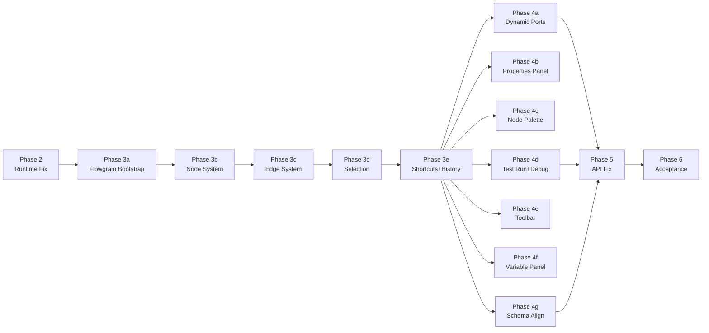

# Workflow Coze Parity 改造计划 (V2 - 含 Flowgram 迁移 + 1:1 交互复刻)

---

## 架构决策记录

- **画布引擎**：采用 Flowgram (`@flowgram.ai/*` ^1.0.8) 替换自定义 div+SVG 画布
- **交互范围**：1:1 复刻 Coze Workflow Editor 的全部核心交互
- **依赖基础**：`package.json` 已声明 Flowgram 8 个插件包 + `inversify` + `reflect-metadata`，均未使用，本次启用
- **版本说明**：Coze 内部使用 Flowgram 0.1.28（通过 adapter 包装），Atlas 使用公开 npm ^1.0.8（API 可能有差异，需验证兼容性）

---

## A. 前端交互 1:1 Gap Analysis（Coze vs 当前 workflow-editor-react）

### 已有能力（可复用）

- 节点类型定义 `WorkflowNodeTypeKey`（40+ 类型，与 Coze `StandardNodeType` 对应）
- API 层 `workflow-api-factory.ts`（完整的 V2 CRUD/run/stream/debug HTTP+SSE 客户端）
- 连接校验规则 `connection-rules.ts`（方向/自环/重复/最大连接数/类型兼容）
- 节点注册表 `NodeRegistry` + `definitions.ts`（每类型 sections/defaults/validate）
- 表单组件 `SchemaForm` + 8 种 FormFieldKind widget
- i18n 中英文词条
- 类型系统 `workflow-v2.ts`

### 需要替换/重写

- **画布核心**（WorkflowEditor.tsx 的 ~800 行 DOM/SVG/事件代码）→ Flowgram PlaygroundReactProvider
- **节点渲染**（NodeCard.tsx 通用卡片）→ 按类型的 Content 组件体系
- **连线渲染**（手动 SVG path 计算）→ Flowgram Lines 插件 + Bezier/Fold 渲染
- **状态管理**（React useState 散落在单文件）→ zustand store + Flowgram 文档模型

### 需要新增

| 交互能力 | Coze 参考 | 当前状态 |
|----------|-----------|----------|
| 节点执行状态条 | `ExecuteStatusBarV2`（spinner/绿色成功/红色失败/灰色跳过） | 无 |
| If/Condition 动态分支端口 | `useDynamicPort` + `updateDynamicPorts()` + 分支增删/拖拽重排 | 无 |
| SSE 流式测试运行 | `WorkflowRunService.loop` 300ms 轮询 + per-node 状态更新 | Stub（无 API 调用） |
| 连线执行动画 | `line.processing` CSS class + 渐变描边 | 无 |
| Ctrl+Z/Y 撤销/重做 | Flowgram `HistoryService` + `OperationRegistry` | 无 |
| Ctrl+C/V 复制/粘贴节点 | Shortcut contribution + 坐标偏移 | 无 |
| Delete 键删除节点/连线 | Shortcut + 选中状态判断 | 无 |
| Ctrl+A 全选 | 选中所有 root blocks | 无 |
| 框选 (Marquee) | `FlowSelectorBoxLayer` + Shift+拖拽 | 无 |
| 多选 (Ctrl+Click) | 修饰键切换选中 | 无（仅单选） |
| Minimap 小地图 | `FlowMinimapService` + `MinimapRender` | 无（工具栏占位） |
| 自动布局 | `createFreeAutoLayoutPlugin` | 无 |
| 节点卡片按类型内容 | ContentMap 模式（If 显示条件/LLM 显示模型/Start 显示变量等） | 通用 NodeCard |
| 可调整大小的属性面板 | `ResizableSidePanel` + 全屏子面板 | 固定宽度 |
| 变量面板/上游输出浏览器 | 变量 AST + scope provider/consumer | 仅 AutoComplete 建议 |
| 单节点调试 UI | TestNodeForm + 自动构造输入 + 运行 + 结果挂载 | 无 UI |

---

## B. 分阶段计划



---

### Phase 2 - Runtime 语义修复（后端，不涉及前端）

**目标：** 修复 runtime 语义 bug，确保分支/跳过/异常传播在 Flowgram 编辑器对接前就是正确的。

**改动文件：**
- `src/backend/Atlas.Infrastructure/Services/AiPlatform/WorkflowV2ExecutionService.cs` — Resume 含 Skipped 节点 + Debug 端口推导
- `src/backend/Atlas.Infrastructure/Services/WorkflowEngine/BuiltInWorkflowNodeDeclarations.cs` — 添加端口查询辅助
- `src/backend/Atlas.Infrastructure/Services/WorkflowEngine/CanvasValidator.cs` — 统一端口目录
- `tests/Atlas.SecurityPlatform.Tests/Services/DagExecutorIntegrationTests.cs` — 4+ 新测试用例

**不改动：** DagExecutor 核心拓扑逻辑、V1 代码、前端代码

---

### Phase 3a - Flowgram 画布基础设施

**目标：** 用 Flowgram 替换自定义画布，实现基本的画布渲染和交互。

**关键改动：**

1. **新建** `src/frontend/packages/workflow-editor-react/src/flowgram/` 目录：
   - `workflow-render-provider.tsx` — Flowgram `PlaygroundReactProvider` 初始化，注册 container modules + plugins
   - `workflow-document-module.ts` — Inversify ContainerModule，绑定 WorkflowDocument、DragService 等
   - `workflow-render-module.ts` — 渲染 contribution（层级注册、背景层、连线管理器）
   - `workflow-loader.tsx` — 文档加载/卸载生命周期
   - `workflow-json-bridge.ts` — Flowgram Document JSON 与后端 `CanvasSchema` 的双向转换（复用 `toBackendCanvasJson`/`toEditorCanvasJson` 逻辑）

2. **重写** `WorkflowEditor.tsx`：
   - 从 ~800 行单文件改为 shell 组件，内部渲染 `WorkflowRenderProvider` > `WorkflowLoader` > `PlaygroundReactRenderer` + 面板组件
   - 移除所有自定义 pan/zoom/drag/connect 代码（由 Flowgram 接管）
   - 保留 props 接口 (`WorkflowEditorProps`) 不变以兼容 veaury bridge

3. **新建** `src/frontend/packages/workflow-editor-react/src/flowgram/layers/`：
   - `background-layer.tsx` — 点阵背景
   - `hover-layer.tsx` — 端口/连线/节点 hover 交互

4. **新增 Flowgram 依赖**（`package.json` 补充缺少的包）：
   - `@flowgram.ai/node-core-plugin`、`@flowgram.ai/free-layout-core` 等（Coze 依赖但 Atlas 未声明的）

**保留复用：** `api/`、`types/`、`i18n/`、`form-widgets/`、`node-registry/` 目录全部保留，仅修改消费方式。

**验证：** 画布能渲染节点和连线，能 pan/zoom，能拖拽节点，数据从 API 加载成功。

---

### Phase 3b - 节点渲染系统

**目标：** 实现 Coze 风格的节点卡片渲染架构。

**关键改动：**

1. **新建** `src/frontend/packages/workflow-editor-react/src/node-render/`：
   - `node-render.tsx` — 主节点渲染入口（context provider + Flowgram `useNodeRender`）
   - `wrapper.tsx` — 选中环 + 拖拽 + focus/blur
   - `header.tsx` — 节点头部（图标 + 标题 + 类型标签 + 更多菜单）
   - `content/index.tsx` — ContentMap 按 `StandardNodeType` 分发
   - `content/if-content.tsx` — If 节点条件分支预览
   - `content/llm-content.tsx` — LLM 节点模型摘要
   - `content/start-content.tsx` — Start 节点变量列表
   - `content/end-content.tsx` — End 节点输出预览
   - `content/code-content.tsx` — Code 节点语言标签
   - `content/common-content.tsx` — 通用输入/输出摘要
   - `ports.tsx` — 端口列表渲染（交互式输出端口触发 `startDrawingLine`）
   - `execute-status-bar.tsx` — 执行状态条（spinner/成功/失败/跳过）

2. **改造** `NodeCard.tsx` → 保留为 legacy，`node-render.tsx` 注册为 Flowgram 节点渲染器。

**验证：** 每种节点类型在画布上显示对应内容；执行状态条能根据 mock 数据切换显示。

---

### Phase 3c - 连线系统

**目标：** 实现 Coze 风格的 Bezier 连线渲染和连接交互。

**关键改动：**

1. **新建** `src/frontend/packages/workflow-editor-react/src/flowgram/lines/`：
   - `bezier-line.tsx` — SVG cubic Bezier 路径 + 渐变描边 + `processingLine` CSS 动画
   - `bezier-line.module.css` — 执行动画关键帧（dash-offset 流动效果）
   - `line-contribution.ts` — 注册到 `WorkflowLinesManager`

2. **复用** `connection-rules.ts` 逻辑嵌入 Flowgram 的 `canDrop` / 连接验证回调。

**验证：** 从输出端口拖拽能创建连线；连接校验规则生效；执行中的连线有流动动画。

---

### Phase 3d - 选择系统

**目标：** 单选、多选、框选、批量操作。

**关键改动：**

1. **集成** Flowgram 的 `FlowSelectorBoxLayer`（框选）
2. **注册** 自定义 `canSelect` 规则（仅左键、跳过端口 hover、仅在背景区域触发框选）
3. **实现** Ctrl/Shift+Click 多选切换
4. **实现** 多选状态下的批量拖拽、批量删除

**文件：** `src/frontend/packages/workflow-editor-react/src/flowgram/layers/selection-layer.tsx`

---

### Phase 3e - 快捷键 + 历史

**目标：** 键盘快捷键和 undo/redo。

**关键改动：**

1. **新建** `src/frontend/packages/workflow-editor-react/src/flowgram/shortcuts/`：
   - `copy-paste-contribution.ts` — Ctrl+C/V 复制粘贴（序列化选中节点 + 偏移坐标粘贴）
   - `delete-contribution.ts` — Delete/Backspace 删除选中节点/连线
   - `select-all-contribution.ts` — Ctrl+A 全选
   - `zoom-contribution.ts` — Ctrl+/- 缩放

2. **集成** `@flowgram.ai/free-history-plugin`：
   - 配置 HistoryService + OperationRegistry
   - 注册 Ctrl+Z / Ctrl+Shift+Z 快捷键
   - 所有节点/连线增删改操作自动入栈

**验证：** 复制粘贴节点正确偏移；撤销重做操作栈正确；Delete 键删除选中元素。

---

### Phase 4a - 动态端口（If/Condition）

**目标：** If 节点支持动态分支端口的增删和重排。

**关键改动：**

1. **node-registry 增强**：If/Condition 定义添加 `useDynamicPort: true` + `defaultPorts`
2. **新建** `src/frontend/packages/workflow-editor-react/src/node-render/content/if-content.tsx`：
   - 分支条件预览（If / Else If / Else 标签 + 对应端口）
   - 添加分支按钮 (`+`)
   - 删除分支按钮（带连线重映射）
   - 拖拽重排分支（react-dnd + 端口 ID 重新排序）
3. **端口 ID 规则**：`true`, `true_1`, `true_2`, ... + `false`（对齐 Coze）
4. **`updateDynamicPorts`** 回调集成到 Flowgram `WorkflowNodePortsData`

**验证：** 添加分支后端口自动出现；删除分支后连线正确重映射；保存/加载后分支数量和连线不丢失。

---

### Phase 4b - 属性面板

**目标：** 可调整大小的右侧属性面板，支持全屏编辑。

**关键改动：**

1. **重写** `PropertiesPanel.tsx` → `src/frontend/packages/workflow-editor-react/src/panels/properties-panel.tsx`：
   - 可调整宽度（拖拽边缘，360-546px）
   - 全屏子面板支持（代码编辑器、Prompt 编辑器）
   - 按节点类型加载 FormMeta（复用 `SchemaForm` + `definitions.ts`）
   - 输入参数区 + 输出参数区 + 高级设置
   - 单节点调试按钮（触发 `debugNode` API）

2. **复用** 所有 `form-widgets/` 组件（SchemaForm, VariableRefPicker, ConditionBuilder 等）

---

### Phase 4c - 节点目录面板

**目标：** Popover 式节点添加面板，支持搜索、分类、拖放。

**关键改动：**

1. **增强** `NodePanelPopover.tsx`：
   - 搜索过滤
   - 分类折叠（基础 / 逻辑控制 / 数据处理 / AI / 数据库 / 消息 / 工具）
   - 从端口拖出时自动打开面板（`enableBuildLine` 模式，创建节点同时完成连线）
   - 与 Flowgram 的 `WorkflowNodePanelService` 等效集成

---

### Phase 4d - 测试运行 + 调试

**目标：** 真实的 SSE 流式测试运行和单节点调试。

**关键改动：**

1. **重写** `TestRunPanel.tsx`：
   - 输入 JSON 编辑器（基于 `InputsJson` schema）
   - 流式运行 / 同步运行切换
   - 调用 `runStream` API → SSE 事件处理
   - 实时更新每个节点的 `ExecuteStatusBar`
   - 连线 `processing` 状态联动动画
   - 运行日志面板（时间戳 + 节点名 + 状态 + 输出摘要）

2. **新建** `src/frontend/packages/workflow-editor-react/src/services/workflow-run-service.ts`：
   - SSE 事件分发到节点状态
   - 300ms 轮询模式（备选 `getProcess` API）
   - 取消执行
   - 单节点调试触发 + 结果回显

3. **集成** 节点执行状态到画布渲染（`execute-status-bar.tsx` 读取全局执行状态 store）

---

### Phase 4e - 工具栏

**目标：** Coze 风格的浮动工具栏。

**关键改动：**

1. **重写** `CanvasToolbar.tsx`：
   - 交互模式切换（鼠标 / 触控板）
   - 缩放控制（Slider + 预设 + 适应画布）
   - Minimap 开关（集成 `@flowgram.ai/minimap-plugin`）
   - 自动布局按钮（触发 `createFreeAutoLayoutPlugin`）
   - 添加节点按钮
   - 测试运行按钮

---

### Phase 4f - 变量面板

**目标：** 上游节点输出变量浏览器和变量引用选择器。

**关键改动：**

1. **新建** `src/frontend/packages/workflow-editor-react/src/panels/variable-panel.tsx`：
   - 树形显示所有上游节点的输出变量
   - 按节点分组，显示变量名、类型、值预览
   - 点击插入变量引用到当前编辑的配置字段
2. **增强** `VariableRefPicker.tsx`：
   - 多行模式下也支持变量建议
   - 变量来源基于图拓扑（仅显示当前节点可达的上游输出）

---

### Phase 4g - Schema 对齐

**目标：** 前后端类型一致，round-trip 无丢失。

**改动文件：**
- `workflow-v2.ts` — 增加 `Skipped=6`, `Blocked=7`；增加 `ChildCanvas` 可选字段
- `workflow-api-factory.ts` / `workflow-json-bridge.ts` — `toBackendCanvasJson` 补全 `childCanvas`, `inputTypes`, `outputTypes` 字段
- 新增 `schema-roundtrip.spec.ts` 测试

---

### Phase 5 - Backend API 修正

**目标：** 修正 run 语义 + 增强验证 + API 集成测试。

**改动文件：**
- `WorkflowV2ExecutionService.cs` — `PrepareExecutionAsync` 默认使用已发布版本
- `WorkflowV2Models.cs` — `WorkflowV2RunRequest` 增加 `Source` 字段
- `WorkflowV2Validators.cs` — 充实验证
- `WorkflowV2IntegrationTests.cs`（新建）— API 生命周期测试
- `Workflows-V2.http` + `docs/contracts.md` — 更新文档

---

### Phase 6 - 验收

**验收工作流：**

1. **直线流** Entry -> TextProcessor -> Exit
   - 编辑器创建 -> 保存草稿 -> 发布 -> 运行 -> 全部 Completed
   - SSE 事件正确、节点状态条变化正确、连线动画正确

2. **分支流** Entry -> Selector -> (true: TextProcessor) / (false: TextProcessor2) -> Exit
   - 命中分支 Completed、未命中分支 Skipped
   - 动态端口正确显示、保存/加载不丢失

3. **异常流** Entry -> TextProcessor(fail) -> Selector -> Branch -> Exit
   - 失败时全流程 Failed、下游不执行
   - 成功时分支语义正确

**测试文件：**
- 后端：`DagExecutorAcceptanceTests.cs`
- 前端：`acceptance.spec.ts`（schema round-trip）
- E2E：更新 Playwright `workflow-complete-flow.spec.ts`

---

## C. 能力矩阵（更新版）

| 能力 | 当前 | 目标 | Phase |
|------|------|------|-------|
| 画布引擎 | 自定义 div+SVG | **Flowgram** | P3a |
| 节点渲染 | 通用 NodeCard | **按类型 ContentMap** | P3b |
| 执行状态条 | 无 | **ExecuteStatusBar** | P3b |
| Bezier 连线 + 动画 | 手动 SVG | **Flowgram Lines + CSS** | P3c |
| 单选 | 有 | 保持 | - |
| 多选 + 框选 | 无 | **Selector Box + Ctrl+Click** | P3d |
| 复制/粘贴/删除 | 无 | **快捷键** | P3e |
| Undo/Redo | 无 | **Flowgram History** | P3e |
| If 动态端口 | 无 | **增删/拖拽重排** | P4a |
| 属性面板 | 固定宽度 | **可调/全屏** | P4b |
| 节点目录 | 基本 | **搜索/分类/端口连线** | P4c |
| 测试运行 | Stub | **SSE 流式 + 状态联动** | P4d |
| 单节点调试 UI | 无 | **输入构造 + 结果展示** | P4d |
| Minimap | 无 | **Flowgram 插件** | P4e |
| 自动布局 | 无 | **Flowgram 插件** | P4e |
| 变量面板 | 无 | **树形浏览器** | P4f |
| Schema round-trip | 部分 | **完整** | P4g |
| Run published | Draft | **Published** | P5 |
| API 集成测试 | 无 | **完整** | P5 |

---

## D. 风险与缓解

| 风险 | 影响 | 缓解 |
|------|------|------|
| Flowgram ^1.0.8 与 Coze 0.1.28 API 差异 | 高 | 先做 spike 验证核心 API（PlaygroundReactProvider、useNodeRender、WorkflowDocument） |
| Flowgram 迁移导致现有编辑功能暂时不可用 | 高 | 保留旧 WorkflowEditor.tsx 为 `WorkflowEditorLegacy.tsx`，bridge 可切换 |
| 动态端口与后端 CanvasValidator 不一致 | 中 | Phase 2 先统一端口定义，Phase 4a 前端才实现动态端口 |
| veaury React-in-Vue bridge 与 Flowgram 兼容性 | 中 | 早期测试 Flowgram 组件在 veaury 环境下的渲染 |
| 大量新代码引入回归风险 | 中 | 每个 sub-phase 交付时跑 Vitest + Playwright |

---

## E. 文件变更范围总览

### 新建文件（预估 ~30 个）

- `src/frontend/packages/workflow-editor-react/src/flowgram/` — 画布基础设施（~8 文件）
- `src/frontend/packages/workflow-editor-react/src/flowgram/layers/` — 渲染层（~3 文件）
- `src/frontend/packages/workflow-editor-react/src/flowgram/lines/` — 连线（~3 文件）
- `src/frontend/packages/workflow-editor-react/src/flowgram/shortcuts/` — 快捷键（~4 文件）
- `src/frontend/packages/workflow-editor-react/src/node-render/` — 节点渲染（~12 文件）
- `src/frontend/packages/workflow-editor-react/src/panels/` — 面板（~3 文件）
- `src/frontend/packages/workflow-editor-react/src/services/` — 运行服务（~2 文件）

### 修改文件（预估 ~15 个）

- `workflow-editor-react/src/editor/WorkflowEditor.tsx` — 重写为 Flowgram shell
- `workflow-editor-react/src/editor/workflow-editor.css` — 适配新架构
- `workflow-editor-react/src/components/CanvasToolbar.tsx` — 重写工具栏
- `workflow-editor-react/src/components/PropertiesPanel.tsx` — 重写属性面板
- `workflow-editor-react/src/components/TestRunPanel.tsx` — 重写测试面板
- `workflow-editor-react/src/components/NodePanelPopover.tsx` — 增强
- `workflow-editor-react/src/types/workflow-v2.ts` — 枚举 + ChildCanvas
- `workflow-editor-react/src/api/workflow-api-factory.ts` — schema bridge
- `workflow-editor-react/package.json` — 补充 Flowgram 依赖
- 后端 4-5 个文件（Phase 2 + Phase 5）
- 测试文件 2-3 个

### 不改动

- `@atlas/workflow-editor`（Vue 遗留编辑器）
- `@atlas/shared-core`、`@atlas/shared-ui`、`@atlas/ai-core` 等其他 packages
- Vue 应用的 router/store/layout/services
- `WorkflowEditorBridge.ts`（veaury bridge 接口不变）
- 后端 V1 WorkflowCore / AI V1 代码
- 其他 bounded context

---

## F. 验证方式

### 每个 sub-phase 交付验证

```bash
# 前端编译
cd src/frontend && pnpm run build

# 前端单测
cd src/frontend && pnpm run test:unit

# 前端 lint
cd src/frontend && pnpm run lint

# 后端编译 (Phase 2/5)
dotnet build  # 0 errors, 0 warnings

# 后端测试 (Phase 2/5)
dotnet test tests/Atlas.SecurityPlatform.Tests --filter "FullyQualifiedName~DagExecutor"
```

### Phase 6 验收清单

- 画布能渲染节点/连线、pan/zoom/拖拽正常
- 从节点目录拖入/点击添加节点正确
- If 节点能动态增删分支端口
- 连线拖拽 + 校验 + 执行动画
- 键盘快捷键全部生效
- 框选 + 多选 + 批量操作
- Minimap 显示
- 自动布局
- 属性面板可调整大小 + 全屏编辑
- 变量面板显示上游输出
- 测试运行面板 SSE 流式执行 + 节点状态实时更新
- 单节点调试
- 保存/加载 round-trip 完整
- 3 个验收工作流全闭环跑通
