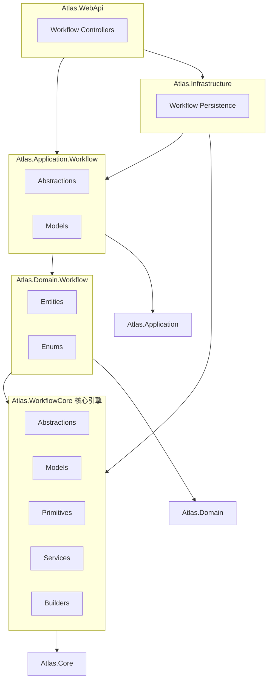

# Atlas.WorkflowCore 工作流引擎实现计划

## 项目架构

参考 WorkflowCore 的模块化设计，创建以下项目结构：

```
src/backend/
├── Atlas.WorkflowCore/           # 核心引擎（独立包）
│   ├── Abstractions/             # 核心接口
│   ├── Models/                   # 核心模型
│   ├── Primitives/               # 内置步骤原语
│   ├── Services/                 # 服务实现
│   └── Builders/                 # Fluent API 构建器
│
├── Atlas.Domain.Workflow/        # 领域实体
│   ├── Entities/                 # 持久化实体
│   └── Enums/                    # 枚举类型
│
├── Atlas.Application.Workflow/   # 应用层抽象
│   ├── Abstractions/             # 仓储接口
│   ├── Models/                   # DTO
│   └── Mappings/                 # AutoMapper
│
└── Atlas.Infrastructure/         # 基础设施（扩展）
    ├── Workflow/                 # 工作流持久化实现
    └── Services/                 # 服务实现
```

## 核心能力复刻清单

### 1. 工作流定义与注册

**核心接口** ([Atlas.WorkflowCore/Abstractions/](src/backend/Atlas.WorkflowCore/Abstractions/))：

- `IWorkflow<TData>` / `IWorkflow` - 工作流定义接口
- `IWorkflowRegistry` - 工作流注册表（管理定义和版本）
- `IWorkflowBuilder<TData>` - Fluent API 构建器

**核心模型** ([Atlas.WorkflowCore/Models/](src/backend/Atlas.WorkflowCore/Models/))：

- `WorkflowDefinition` - 工作流定义（Id, Version, Steps, DataType）
- `WorkflowStep` - 步骤定义（Id, Name, BodyType, Inputs, Outputs, Outcomes）
- `StepOutcome` - 步骤结果分支

### 2. 工作流执行引擎

**核心接口**：

- `IWorkflowHost` - 工作流主机（启动/停止/控制）
- `IWorkflowExecutor` - 执行器
- `IWorkflowController` - 控制接口（Start, Suspend, Resume, Terminate）

**核心模型**：

- `WorkflowInstance` - 工作流实例（Id, WorkflowDefinitionId, Version, Status, Data, CreateTime）
- `ExecutionPointer` - 执行指针（StepId, Status, PersistenceData, EventName, EventKey）
- `WorkflowStatus` - 状态枚举（Runnable, Suspended, Complete, Terminated）
- `PointerStatus` - 指针状态（Legacy, Pending, Running, Complete, Sleeping, WaitingForEvent, Failed, Compensated, Cancelled）

**执行上下文**：

- `IStepExecutionContext` - 步骤执行上下文（Workflow, Step, ExecutionPointer, Item, PersistenceData）

### 3. 步骤定义与执行

**核心接口**：

- `IStepBody` - 步骤体接口（`RunAsync(IStepExecutionContext)`）
- `IStepExecutor` - 步骤执行器

**步骤基类**：

- `StepBody` - 同步步骤基类
- `StepBodyAsync` - 异步步骤基类

**执行结果**：

- `ExecutionResult` - 步骤执行结果
  - Proceed（是否继续）
  - OutcomeValue（结果值）
  - SleepFor（休眠时间）
  - PersistenceData（持久化数据）
  - EventName/EventKey（事件信息）
  - BranchValues（分支值）

**内置原语** ([Atlas.WorkflowCore/Primitives/](src/backend/Atlas.WorkflowCore/Primitives/))：

- `Delay` - 延迟步骤
- `If` - 条件分支
- `While` - 循环
- `Foreach` - 遍历
- `Sequence` - 顺序执行
- `WaitFor` - 等待事件
- `Decide` - 决策
- `Schedule` - 定时任务
- `Activity` - 活动步骤（用户任务）

### 4. 持久化层

**核心接口** ([Atlas.WorkflowCore/Abstractions/Persistence/](src/backend/Atlas.WorkflowCore/Abstractions/Persistence/))：

- `IPersistenceProvider` - 统一持久化接口
- `IWorkflowRepository` - 工作流实例 CRUD
- `IEventRepository` - 事件管理
- `ISubscriptionRepository` - 事件订阅

**持久化实体** ([Atlas.Domain.Workflow/Entities/](src/backend/Atlas.Domain.Workflow/Entities/))：

- `PersistedWorkflow` - 工作流实例持久化
- `PersistedExecutionPointer` - 执行指针持久化
- `PersistedEvent` - 事件持久化
- `PersistedSubscription` - 事件订阅持久化
- `PersistedExecutionError` - 执行错误持久化

**SqlSugar 实现** ([Atlas.Infrastructure/Workflow/](src/backend/Atlas.Infrastructure/Workflow/))：

- `SqlSugarPersistenceProvider` - SqlSugar 持久化提供者

### 5. 事件系统

**核心模型**：

- `Event` - 事件（EventName, EventKey, EventData, EventTime）
- `EventSubscription` - 事件订阅（WorkflowId, StepId, EventName, EventKey）

**核心接口**：

- `ILifeCycleEventHub` - 生命周期事件中心
- `ILifeCycleEventPublisher` - 事件发布器

**生命周期事件**：

- `WorkflowStarted`, `WorkflowCompleted`, `WorkflowSuspended`, `WorkflowResumed`, `WorkflowTerminated`
- `StepStarted`, `StepCompleted`, `WorkflowError`

### 6. 版本控制

- `WorkflowDefinition.Version` - 定义版本号
- `WorkflowRegistry` 维护版本字典
- `GetDefinition(workflowId, version)` - 支持指定版本或获取最新版本
- 实例绑定到特定版本执行

### 7. 错误处理

**核心接口**：

- `IWorkflowErrorHandler` - 错误处理器

**错误策略枚举**：

- `WorkflowErrorHandling`：Retry, Suspend, Terminate, Compensate

### 8. 中间件（可选扩展）

**核心接口**：

- `IWorkflowMiddleware` - 工作流中间件
- `IWorkflowStepMiddleware` - 步骤中间件

## 依赖关系



## 实现顺序

### 阶段1：核心引擎基础（Atlas.WorkflowCore）

1. 创建项目文件
2. 实现核心模型：`WorkflowStatus`, `PointerStatus`, `ExecutionResult`, `WorkflowStep`, `WorkflowDefinition`, `WorkflowInstance`, `ExecutionPointer`
3. 实现核心接口：`IStepBody`, `IStepExecutionContext`, `IWorkflow<TData>`, `IWorkflowRegistry`

### 阶段2：步骤体与构建器

4. 实现步骤基类：`StepBody`, `StepBodyAsync`
5. 实现构建器：`IWorkflowBuilder<TData>`, `WorkflowBuilder<TData>`, `IStepBuilder<TData>`, `StepBuilder<TData>`
6. 实现内置原语：`Delay`, `If`, `While`, `Foreach`, `WaitFor`, `Activity`

### 阶段3：执行引擎

7. 实现执行上下文：`StepExecutionContext`
8. 实现步骤执行器：`IStepExecutor`, `StepExecutor`
9. 实现工作流执行器：`IWorkflowExecutor`, `WorkflowExecutor`
10. 实现工作流主机：`IWorkflowHost`, `IWorkflowController`, `WorkflowHost`

### 阶段4：持久化层

11. 创建领域实体项目：`Atlas.Domain.Workflow`
12. 实现持久化实体：`PersistedWorkflow`, `PersistedExecutionPointer`, `PersistedEvent`, `PersistedSubscription`
13. 实现持久化接口：`IPersistenceProvider`, `IWorkflowRepository`, `IEventRepository`
14. 实现 SqlSugar 持久化提供者

### 阶段5：事件系统

15. 实现事件模型：`Event`, `EventSubscription`
16. 实现生命周期事件：`ILifeCycleEventHub`, `WorkflowLifeCycleEvent`

### 阶段6：应用层与 API

17. 创建应用层项目：`Atlas.Application.Workflow`
18. 实现 DTO 和仓储接口
19. 实现 WebApi 控制器

## 关键代码示例

### 工作流定义示例

```csharp
public class MyWorkflow : IWorkflow<MyData>
{
    public string Id => "my-workflow";
    public int Version => 1;

    public void Build(IWorkflowBuilder<MyData> builder)
    {
        builder
            .StartWith<HelloStep>()
            .If(data => data.ShouldContinue)
                .Do(then => then.StartWith<ProcessStep>())
            .Then<EndStep>();
    }
}
```

### 步骤体示例

```csharp
public class HelloStep : StepBody
{
    public override ExecutionResult Run(IStepExecutionContext context)
    {
        Console.WriteLine("Hello World!");
        return ExecutionResult.Next();
    }
}
```

### 工作流启动示例

```csharp
var host = serviceProvider.GetRequiredService<IWorkflowHost>();
await host.StartAsync();

var instanceId = await host.StartWorkflowAsync("my-workflow", 1, new MyData { ... });
```

## 文件清单（预计）

| 项目 | 文件 | 描述 |

|------|------|------|

| Atlas.WorkflowCore | Atlas.WorkflowCore.csproj | 项目文件 |

| Atlas.WorkflowCore | Abstractions/IWorkflow.cs | 工作流定义接口 |

| Atlas.WorkflowCore | Abstractions/IWorkflowRegistry.cs | 注册表接口 |

| Atlas.WorkflowCore | Abstractions/IWorkflowHost.cs | 主机接口 |

| Atlas.WorkflowCore | Abstractions/IWorkflowExecutor.cs | 执行器接口 |

| Atlas.WorkflowCore | Abstractions/IWorkflowController.cs | 控制器接口 |

| Atlas.WorkflowCore | Abstractions/IStepBody.cs | 步骤体接口 |

| Atlas.WorkflowCore | Abstractions/IStepExecutor.cs | 步骤执行器接口 |

| Atlas.WorkflowCore | Abstractions/IStepExecutionContext.cs | 执行上下文接口 |

| Atlas.WorkflowCore | Abstractions/Persistence/IPersistenceProvider.cs | 持久化接口 |

| Atlas.WorkflowCore | Models/WorkflowDefinition.cs | 工作流定义模型 |

| Atlas.WorkflowCore | Models/WorkflowInstance.cs | 工作流实例模型 |

| Atlas.WorkflowCore | Models/WorkflowStep.cs | 步骤定义模型 |

| Atlas.WorkflowCore | Models/ExecutionPointer.cs | 执行指针模型 |

| Atlas.WorkflowCore | Models/ExecutionResult.cs | 执行结果模型 |

| Atlas.WorkflowCore | Models/Event.cs | 事件模型 |

| Atlas.WorkflowCore | Models/EventSubscription.cs | 事件订阅模型 |

| Atlas.WorkflowCore | Models/WorkflowStatus.cs | 状态枚举 |

| Atlas.WorkflowCore | Models/PointerStatus.cs | 指针状态枚举 |

| Atlas.WorkflowCore | Services/WorkflowRegistry.cs | 注册表实现 |

| Atlas.WorkflowCore | Services/WorkflowExecutor.cs | 执行器实现 |

| Atlas.WorkflowCore | Services/WorkflowHost.cs | 主机实现 |

| Atlas.WorkflowCore | Services/StepExecutor.cs | 步骤执行器实现 |

| Atlas.WorkflowCore | Services/MemoryPersistenceProvider.cs | 内存持久化 |

| Atlas.WorkflowCore | Builders/WorkflowBuilder.cs | 构建器实现 |

| Atlas.WorkflowCore | Builders/StepBuilder.cs | 步骤构建器 |

| Atlas.WorkflowCore | Primitives/StepBody.cs | 步骤基类 |

| Atlas.WorkflowCore | Primitives/StepBodyAsync.cs | 异步步骤基类 |

| Atlas.WorkflowCore | Primitives/Delay.cs | 延迟步骤 |

| Atlas.WorkflowCore | Primitives/If.cs | 条件分支 |

| Atlas.WorkflowCore | Primitives/While.cs | 循环 |

| Atlas.WorkflowCore | Primitives/Foreach.cs | 遍历 |

| Atlas.WorkflowCore | Primitives/WaitFor.cs | 等待事件 |

| Atlas.WorkflowCore | Primitives/Activity.cs | 活动步骤 |

| Atlas.WorkflowCore | ServiceCollectionExtensions.cs | DI 扩展 |

| Atlas.Domain.Workflow | Atlas.Domain.Workflow.csproj | 项目文件 |

| Atlas.Domain.Workflow | Entities/PersistedWorkflow.cs | 持久化实体 |

| Atlas.Domain.Workflow | Entities/PersistedExecutionPointer.cs | 执行指针实体 |

| Atlas.Domain.Workflow | Entities/PersistedEvent.cs | 事件实体 |

| Atlas.Domain.Workflow | Entities/PersistedSubscription.cs | 订阅实体 |

| Atlas.Application.Workflow | Atlas.Application.Workflow.csproj | 项目文件 |

| Atlas.Application.Workflow | Abstractions/IWorkflowPersistenceRepository.cs | 仓储接口 |

| Atlas.Infrastructure | Workflow/SqlSugarPersistenceProvider.cs | SqlSugar 实现 |

| Atlas.WebApi | Controllers/WorkflowController.cs | API 控制器 |