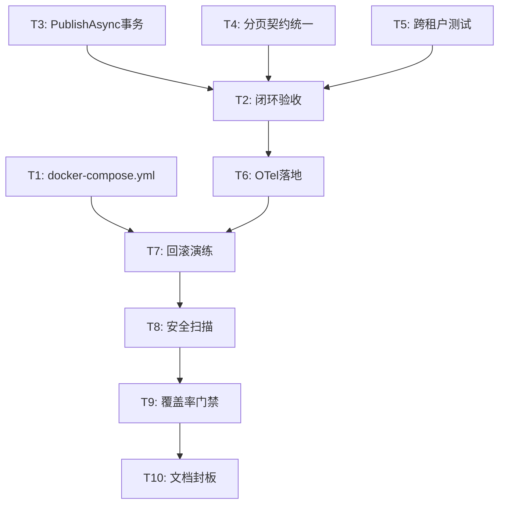

# SecurityPlatform 上线封板交付计划

## 当前状态诊断

探查结论（优先级排序）：

- **P0 阻塞**：`docker-compose.yml` 不存在，`deploy.yml` 第33行 `test -f docker-compose.yml` 直接失败，无法触发任何部署
- **P0 阻塞**：`LowCodePageCommandService.PublishAsync` 页面更新 + 路由注册没有包在事务内，存在部分失败风险
- **P0 阻塞**：`api-generated.ts` 中 `PageIndex=`（PascalCase）与 `pageIndex=`（camelCase）混用 ~23处，部分接口分页传参失效
- **P1 缺口**：NLog 日志与 OTel TraceId 无关联（无 `${aspnet-traceidentifier}` 配置），跨系统故障定位链路断裂
- **P1 缺口**：SQLite 备份使用 `File.Copy`（非原子），`hangfire.db` 未备份，无完整性校验
- **P1 缺口**：跨租户篡改拦截代码健壮，但仅1个集成测试覆盖（`AccessProtectedEndpoint_WithMismatchedTenantHeader`），其他实体类型无覆盖
- **P2 观察**：OTel 仅配置 Tracing/Metrics，无 Logging export；开发环境无 Console fallback

## 里程碑与任务映射

### M1：部署可复现（T1）

**目标文件：**

- 新建 `[docker-compose.yml](docker-compose.yml)`（项目根目录）
- 新建 `[docker-compose.override.yml](docker-compose.override.yml)`（开发覆盖）
- 新建 `[.env.example](.env.example)`
- 更新 `[deploy/nginx/default.conf](deploy/nginx/default.conf)`（补齐 HTTPS/TLS 配置）
- 更新 `[.github/workflows/deploy.yml](.github/workflows/deploy.yml)`（确认 preflight 路径）

**docker-compose.yml 核心服务结构：**

```yaml
services:
  backend:
    image: ${BACKEND_IMAGE}:${IMAGE_TAG}
    environment:
      - Jwt__SigningKey=${JWT_SIGNING_KEY}
      - Security__BootstrapAdmin__Password=${BOOTSTRAP_ADMIN_PASSWORD}
  frontend:
    image: ${FRONTEND_IMAGE}:${IMAGE_TAG}
  nginx:
    image: nginx:alpine
    volumes:
      - ./deploy/nginx/default.conf:/etc/nginx/conf.d/default.conf
```

### M2：闭环打通 + 关键缺陷清零（T2/T3/T4/T5）

**T3 - LowCode PublishAsync 补事务：**

- 文件：`[src/backend/Atlas.Infrastructure/Services/LowCode/LowCodePageCommandService.cs](src/backend/Atlas.Infrastructure/Services/LowCode/LowCodePageCommandService.cs)`
- 将 `_pageRepository.UpdateAsync` + `_runtimeRouteRepository.UpsertAsync` + `_auditWriter.WriteAsync` 包入 `_db.UseTranAsync()`

**T4 - 分页参数契约统一：**

- 问题根源：部分控制器用 `[FromQuery] PagedRequest`（后端绑定 PascalCase），部分用单独参数（生成 camelCase）
- 方案：统一所有分页查询控制器使用 `[FromQuery] PagedRequest`，重新生成 `api-generated.ts`
- 关键文件：所有含 `GetPagedAsync` 的控制器 + `[src/frontend/Atlas.WebApp/src/types/api-generated.ts](src/frontend/Atlas.WebApp/src/types/api-generated.ts)`

**T5 - 跨租户篡改强证据：**

- 文件：`[tests/Atlas.SecurityPlatform.Tests/Integration/AuthorizationTests.cs](tests/Atlas.SecurityPlatform.Tests/Integration/AuthorizationTests.cs)`
- 新增测试：对 Assets/Users/LowCodeApps 等主要实体，用有效但不匹配的 `X-Tenant-Id` header 调用，验证全部返回 403

### M3：观测落地 + 回滚演练（T6/T7）

**T6 - OTel + 日志关联：**

- 文件：`[src/backend/Atlas.WebApi/nlog.config](src/backend/Atlas.WebApi/nlog.config)`
  - 在 layout 中添加 `${aspnet-traceidentifier}` 关联 ASP.NET Core TraceId
- 文件：`[src/backend/Atlas.WebApi/Program.cs](src/backend/Atlas.WebApi/Program.cs)`
  - 开发环境增加 Console exporter（`AddConsoleExporter()`）作为 OTLP 不可用时的 fallback
  - 关键：`nlog.config` 中需引用 `NLog.Web.AspNetCore` 包以获得 traceId 注入

**T7 - 备份机制加固：**

- 文件：`[src/backend/Atlas.Infrastructure/Services/DatabaseBackupHostedService.cs](src/backend/Atlas.Infrastructure/Services/DatabaseBackupHostedService.cs)`
  - 将 `File.Copy` 替换为 `SqliteConnection.BackupDatabase()`（SQLite Online Backup API，保证一致性）
  - 添加 `hangfire.db` 备份支持
  - 备份后写入 SHA256 校验文件

### M4：安全门禁 + 文档封板（T8/T9/T10）

**T8 - 安全扫描 CI 门禁：**

- 文件：`[.github/workflows/ci.yml](.github/workflows/ci.yml)`
  - 添加 `dotnet list package --vulnerable` 步骤，Critical/High=0 则通过
  - 整合现有 `.github/workflows/security.yml` 扫描结果到 CI 门禁

**T9 - 覆盖率门禁：**

- 更新 CI 以输出覆盖率报告，设置阈值门禁（后端总体 ≥60%）

**T10 - 文档封板：**

- 更新 `[README.md](README.md)`（部署步骤与 docker-compose 说明）
- 更新 `[docs/contracts.md](docs/contracts.md)`（分页参数命名冻结说明）

## 关键依赖关系




## 未指定假设（需上线评审冻结）

- 目标并发：未指定，默认按**内测档**（并发50，单节点 SQLite）规划
- SLA：未指定，默认 99.5% 月可用性
- OTel Collector 后端：未指定，方案中保留 OTLP exporter + 开发 Console fallback
- 上线窗口：未指定，建议工作日低峰，回滚窗口 ≥ 2 小时

