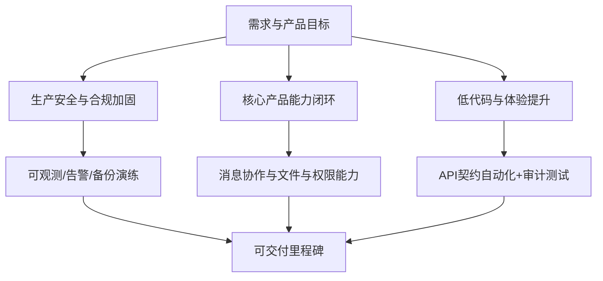

# Atlas Security Platform 下一步实施计划

## 方向建议

### 1) 优先序：安全稳定性 > 能力闭环 > 体验增强

当前代码库文档显示“文档先行、后实现、同步验收”是既定模式：`docs/AGENTS.md` 与 `docs/功能补齐总览.md` 均要求每个功能都保持规格、接口和前后端联动。结合已有进度，下一步建议采用 `P0/P1/P2` 分层执行：

- P0：完成尚未闭环但对上生产有直接影响的功能（安全与可观测、低风险高价值）
- P1：完成已定义 PRD 的核心管理能力（如通知公告、文件、导入导出、表格视图）
- P2：继续实施低代码平台后续体验和架构治理（OpenAPI 类型链路、测试加固）

### 2) 推荐的下一步清单（按优先级）

#### P0（下一阶段第一优先）

- 立即完成 `prd-case-12-production-hardening.md`（生产级安全加固）并与 `docs/implementation-summary.md` 对齐复盘。重点是：
  - 修复 XSS 中间件条件分支与白名单策略（文档已定义接口行为）
  - 接入 OpenTelemetry 基础链路与指标采集
  - 完成合规证据映射与备份恢复演练记录
- 完成 Week3-4 未完成项：
  - 审批流程设计器右键菜单增强（`docs/week3-4-implementation-summary.md:265-270`）
  - OpenAPI 类型生成（NSwag）
  - 审计日志验证测试 + 权限控制测试（可降低后续上线风险）

#### P1（稳态交付）

- 启动 `docs/功能补齐总览.md` 中 Phase 3-5 的“通知公告/文件/Excel导入导出/监控/定时任务/数据权限/多数据源/国际化”组合，按 Case 闭环方式推进：
  - `prd-case-11-notification.md`（公告发布到已读追踪全链条）
  - `plan-文件上传下载.md`
  - `plan-服务监控.md`
  - `plan-定时任务.md`
  - `plan-数据权限.md`
- 任何新增/改动接口同步更新：`docs/contracts.md` 与前端类型文件，保证 `docs/contracts.md` 的约束同步。

#### P2（治理与产品成长）

- 低代码 MVP 后续：把 `docs/lowcode/form-data-persistence.md` 与 `docs/lowcode/page-runtime.md` 与当前实施结果做里程碑对账，补齐 API 与前端运行时闭环。
- 增强发布资产与上线能力：
  - 增强审计查询体验（脱敏展示、字段可读性）
  - 引入关键监控告警阈值与操作手册
  - 形成《上线健康检查清单》与回归剧本

### 3) 约束与验收边界

- 保持文档驱动（每个 Case 需要：规格文档→后端→前端→验收）
- 严格执行幂等与 CSRF 约束（关键写接口）
- 联调时优先按 `docs/联调验收清单.md` 与 `docs/前后端DTO对齐清单.md` 验收
- 避免一次引入过多横向功能，优先保证每个点可验收与可演示

### 4) 近期可直接落地的三项首批任务（建议本周）

- 任务1：完成 Week3-4 未完成项中的 OpenAPI 自动生成（能立即降低接口不同步风险）
- 任务2：推进 `prd-case-11-notification.md` 的前后端一体闭环（提升协同沟通价值）
- 任务3：完成 `plan-服务监控.md` 的后端/前端最小可见化（提升运营可观测性）

