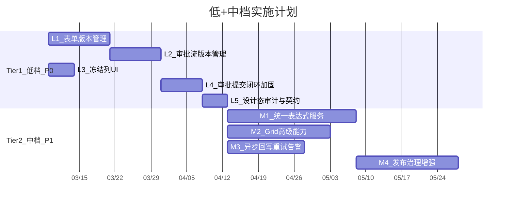

# 低代码设计器 x 审批流集成 — "低"档 + "中"档实施计划

## 现状基线

已有能力（可直接复用）：

- **表单设计器 MVP**: `FormDefinition` 实体 + `FormDesignerPage.vue`（AMIS 编辑器），支持 Draft/Published 状态、发布
- **页面/应用设计器**: `LowCodeApp` + `LowCodePage` + `AppBuilderPage.vue`，支持页面树、Schema 编辑、发布、版本历史、回滚
- **审批流**: `ApprovalFlowDefinition` + `FlowEngine` + `X6ApprovalDesigner.vue`，含条件分支、并行、抄送
- **审批运行时**: `ApprovalProcessInstance` + `ApprovalTask`，含发起、待办、审批、撤回
- **状态回写**: `ApprovalStatusSyncHandler` + `DynamicTableApprovalEventHandler`（同步模式）
- **表格视图**: `TableView` + `useTableView.ts` + `TableViewToolbar`，`pinned` 字段已在类型定义中但 UI 缺失
- **条件评估**: `ConditionEvaluator`（CEL 子集）+ `ExpressionEditorCel.vue`（仅审批流使用）
- **LowCodePageVersion**: 页面版本快照实体与回滚 API（可作为 FormDefinition 版本管理的参考模式）

关键缺口：

| 缺口                                    | 影响的目标档位 |
| ------------------------------------- | ------- |
| FormDefinition 无版本快照/回滚               | 低       |
| ApprovalFlowDefinition 无版本历史列表/回滚 API | 低       |
| 列配置抽屉中无 pinned（冻结列）设置 UI              | 低       |
| 审批回写为纯同步，无重试/告警                       | 低+中     |
| 设计态操作（发布/回滚）缺少显式审计事件                  | 低       |
| 统一表达式服务（脱离审批流的通用能力）                   | 中       |
| Grid 合并单元格 / 行内编辑                     | 中       |
| 多版本并存 + 弃用治理                          | 中       |

---

## Tier 1: "低"档 — P0 能力闭环（8-12 周）

### Phase L1: 表单版本管理（对齐 LowCodePageVersion 模式）

**Case L1.1: FormDefinitionVersion 实体与仓储**

- 新建 `[Atlas.Domain/LowCode/Entities/FormDefinitionVersion.cs](src/backend/Atlas.Domain/LowCode/Entities/FormDefinitionVersion.cs)` — 参考 `[LowCodePageVersion.cs](src/backend/Atlas.Domain/LowCode/Entities/LowCodePageVersion.cs)` 模式
  - 字段：FormDefinitionId, SnapshotVersion, Name, Description, Category, SchemaJson, DataTableKey, CreatedBy, CreatedAt
- 新建 `IFormDefinitionVersionRepository` + SqlSugar 实现
- DatabaseInitializerHostedService 中注册新表

**Case L1.2: 表单发布时自动创建版本快照**

- 修改 `FormDefinitionCommandService.PublishAsync` — 发布时创建 FormDefinitionVersion 快照
- 服务中注入 IFormDefinitionVersionRepository

**Case L1.3: 表单版本历史 + 回滚 API**

- `FormDefinitionsController` 新增：
  - `GET api/v1/form-definitions/{id}/versions` — 分页查询版本历史
  - `POST api/v1/form-definitions/{id}/rollback/{versionId}` — 回滚到指定版本（恢复 SchemaJson + 重新发布）
- FormDefinitionQueryService 新增 `GetVersionsAsync`
- FormDefinitionCommandService 新增 `RollbackToVersionAsync`
- 更新 `.http` 测试文件

**Case L1.4: 表单设计器前端版本历史 + 回滚**

- `FormDesignerPage.vue` 增加版本历史抽屉（参考 `AppBuilderPage.vue` 已有的版本历史 UI）
- 版本列表 + 一键回滚按钮
- `src/services/api.ts` 新增对应 API 函数

---

### Phase L2: 审批流版本管理

**Case L2.1: ApprovalFlowDefinitionVersion 实体与仓储**

- 新建 `[Atlas.Domain/Approval/Entities/ApprovalFlowDefinitionVersion.cs](src/backend/Atlas.Domain/Approval/Entities/ApprovalFlowDefinitionVersion.cs)`
  - 字段：DefinitionId, SnapshotVersion, Name, Category, DefinitionJson, VisibilityScopeJson, CreatedBy, CreatedAt
- 新建 `IApprovalFlowDefinitionVersionRepository` + SqlSugar 实现

**Case L2.2: 审批流发布时创建版本快照 + 回滚 API**

- 修改 `ApprovalFlowCommandService.PublishAsync` — 发布时创建版本快照
- `ApprovalFlowsController` 新增：
  - `GET api/v1/approval/flows/{id}/versions` — 版本历史列表
  - `POST api/v1/approval/flows/{id}/rollback/{versionId}` — 回滚
- 更新 `.http` 测试文件

**Case L2.3: 审批流设计器前端版本管理**

- 流程设计器页面增加版本历史抽屉 + 回滚功能
- 复用已有版本比较功能 (`GET flows/{id}/versions/{targetVersion}/compare`)

---

### Phase L3: 冻结列 UI

**Case L3.1: 列配置抽屉增加 pinned 设置**

- 修改 `[table-view-toolbar.vue](src/frontend/Atlas.WebApp/src/components/table-view-toolbar.vue)` 列配置抽屉
  - 每列增加"固定"下拉选项：无 / 左固定 / 右固定
  - 保存时写入 `TableViewColumnConfig.pinned`
- 修改 `[useTableView.ts](src/frontend/Atlas.WebApp/src/composables/useTableView.ts)` — 确保 pinned 配置正确映射到 Ant Design Table 的 `column.fixed`
- 验证现有的 `resolvePinned` 逻辑是否完整覆盖

**Case L3.2: 冻结列 E2E 验证**

- 在各已接入 TableView 的页面（users、roles、menus 等）验证冻结列生效
- 更新 `TableViews.http` 测试冻结列配置的保存与读取

---

### Phase L4: 审批提交闭环加固

**Case L4.1: 审批提交幂等性验证与加固**

- 审查现有 `SubmitApprovalAsync` 流程，确保：
  - 幂等键检查（同一记录不可重复发起审批）
  - 审批中的记录不可再次提交
  - 返回已有 instanceId 而非报错（幂等语义）
- 补充 `.http` 测试用例覆盖幂等场景

**Case L4.2: 状态回写一致性加固**

- 审查 `ApprovalStatusSyncHandler` — 确保：
  - 回写失败时记录错误日志（不阻断主流程）
  - 回写操作本身幂等（多次回写同一状态不报错）
- 增加回写结果审计记录

---

### Phase L5: 设计态审计

**Case L5.1: 发布/回滚操作审计埋点**

- 在以下操作写入审计日志（通过 `IAuditWriter`）：
  - 表单定义发布 / 回滚 / 停用 / 归档
  - 页面/应用发布 / 回滚
  - 审批流定义发布 / 回滚 / 停用
- 审计事件字典：`LowCode.FormDefinition.Published`, `LowCode.FormDefinition.RolledBack`, `Approval.FlowDefinition.Published` 等

**Case L5.2: contracts.md 更新**

- 更新 `[docs/contracts.md](docs/contracts.md)` — 补充表单版本管理、审批流版本管理、冻结列配置相关的接口契约

---

## Tier 2: "中"档 — P1 能力扩展（接续"低"档，4-6 个月）

### Phase M1: 统一表达式服务

**Case M1.1: 通用表达式引擎抽象**

- 新建 `Atlas.Core/Expressions/`:
  - `IExpressionEngine` — Validate / Evaluate / GetVariables
  - `ExpressionContext` — 变量分层模型（Global / Tenant / App / Page / User / Record）
  - `ExpressionValidationResult` — 校验结果（ok, errors, warnings）
- 新建 `Atlas.Infrastructure/Expressions/CelExpressionEngine.cs`
  - 从现有 `[ConditionEvaluator.cs](src/backend/Atlas.Infrastructure/Services/ApprovalFlow/ConditionEvaluator.cs)` 提取通用逻辑
  - 支持类型：string / number / boolean / datetime / array
  - 内置安全函数白名单（contains / startsWith / endsWith / now / len 等）
  - 禁止危险模式（eval / new / import / 反射）

**Case M1.2: 迁移审批流条件评估**

- `ConditionEvaluator` 改为委托 `IExpressionEngine`
- 保持 API 兼容，审批流功能不退化
- 单元测试覆盖

**Case M1.3: 表达式用于字段可见性/默认值**

- 低代码表单 Schema 扩展：字段增加 `visibleExpr` / `defaultExpr` 属性
- 运行态渲染器（amis-renderer）解析表达式并求值
- FormDesigner 中增加表达式配置入口

**Case M1.4: 表达式编辑器增强（类型提示 + 试运行）**

- 增强 `[ExpressionEditorCel.vue](src/frontend/Atlas.WebApp/src/components/approval/ExpressionEditorCel.vue)` 或新建通用版本
  - 变量树浏览器（按分层展示可用变量）
  - 函数自动补全
  - 类型提示（变量类型标注）
  - "试运行"按钮：输入模拟上下文 JSON → 显示求值结果
- 后端新增 `POST api/v1/expressions/validate` — 静态校验
- 后端新增 `POST api/v1/expressions/evaluate` — 带上下文求值（沙箱模式）

---

### Phase M2: Grid 高级能力

**Case M2.1: 合并单元格配置模型**

- `TableViewConfig` 扩展 `mergeCells` 字段（可选）
  - 模型：`MergeRule { row, col, rowspan, colspan }` 或 规则表达式
- 后端 DTO 与契约更新
- contracts.md 更新

**Case M2.2: 合并单元格运行态渲染**

- 前端 `useTableView` 扩展：将 mergeCells 配置映射到 Ant Design Table 的 `customCell` (onCell → rowSpan/colSpan)
- 列配置 UI 暂不做可视化编辑（先支持 JSON 配置），预留设计器入口

**Case M2.3: Grid 行内编辑**

- 基于 Ant Design Table 的 `customRow` + EditableCell 组件
- 编辑模式：单元格级触发（click-to-edit）
- 编辑后自动调用动态表记录更新 API
- 仅对接入动态表 CRUD 的页面生效

---

### Phase M3: 异步回写重试与告警

**Case M3.1: 回写重试机制**

- 新建 `ApprovalWritebackRetryService`
  - 回写失败时写入重试队列（复用 `[IBackgroundWorkQueue](src/backend/Atlas.Core/Abstractions/IBackgroundWorkQueue.cs)` 或 Outbox 模式）
  - 指数退避重试（1s / 5s / 30s / 5min / 30min）
  - 超过最大重试次数标记为死信
- `ApprovalStatusSyncHandler` 改造：回写失败不阻断，投递到重试队列

**Case M3.2: 回写失败告警**

- 死信达到阈值时触发告警事件
  - 写入审计日志（level=Error）
  - 如已实现通知模块，发送站内消息通知管理员
- 新建管理端点 `GET api/v1/approval/writeback-failures` — 查询回写失败列表
- 手动重试端点 `POST api/v1/approval/writeback-failures/{id}/retry`

**Case M3.3: 回写可观测前端**

- 系统管理中新增"回写监控"页面（或嵌入审批管理页）
  - 失败列表 + 手动重试按钮
  - 回写成功率/失败率统计

---

### Phase M4: 发布治理增强

**Case M4.1: 审批流多版本并存**

- 修改 `ApprovalFlowDefinition` 支持多版本：
  - 发布新版本时旧版本标记为 Active（运行中实例继续使用）
  - 新发起的实例使用最新发布版本
  - 实例绑定 definitionVersion（创建时快照）
- `ApprovalProcessInstance` 增加 `DefinitionVersion` 字段

**Case M4.2: 版本弃用与终止**

- 审批流定义增加 `DeprecatedAt` / `DeprecatedBy` 字段
- 弃用后不允许新发起实例，但运行中实例可继续
- 管理端点：`POST api/v1/approval/flows/{id}/deprecate`
- 前端标记弃用状态（黄色警告）

**Case M4.3: 表单定义多版本并存**

- 类似审批流，发布新版本时旧版本在引用处（如审批节点嵌入的表单）仍可用
- 运行态按 `version` 获取对应快照 Schema

---

## 依赖关系与时间线

## 关键技术决策

- **版本快照模式**: 统一采用 `{Entity}Version` 独立快照表（与 LowCodePageVersion 模式一致），发布时自动创建快照
- **表达式引擎**: 从 ConditionEvaluator 提取为通用 IExpressionEngine，CEL 安全子集，禁止图灵完备能力
- **回写重试**: 优先复用现有 IBackgroundWorkQueue；若已实施 Outbox 模式（平台生态计划 Phase 1），则直接对接 Outbox
- **Grid 合并**: 配置模型抽象 + Ant Design Table onCell 适配，不绑定特定组件库
- **多版本并存**: 实例创建时绑定版本号，运行态按版本号获取定义快照

