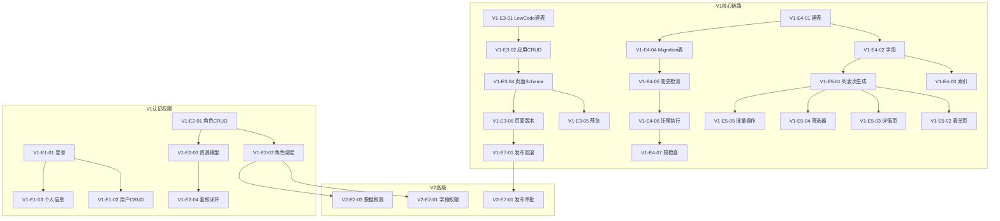

# 低代码平台 V1/V2/V3 全量研发拆解计划

## 现状资产评估

**已完成（可复用）：**

- 认证体系：JWT + MFA + 验证码 + RefreshToken + 会话管理（[AuthController](src/backend/Atlas.WebApi/Controllers/AuthController.cs)）
- 用户管理：CRUD + 禁用 + 角色绑定 + 部门/职位/项目（[UsersController](src/backend/Atlas.WebApi/Controllers/UsersController.cs)）
- RBAC：角色/权限/菜单/部门/职位（RolesController, PermissionsController, MenusController）
- 动态表元数据：DynamicTable/Field/Index 实体 + CRUD API（[DynamicTablesController](src/backend/Atlas.WebApi/Controllers/DynamicTablesController.cs)）
- 动态记录：DynamicTableRecordsController（GET list/detail, POST, PUT, DELETE）
- AMIS Schema 生成：DynamicAmisController（列表/表单/详情 Schema 自动生成）
- 低代码应用/页面/表单：LowCodeApp/LowCodePage/FormDefinition 实体 + Controller（但未在 DatabaseInitializer 中建表）
- 审批流：完整实现（FlowLong 复刻，25+ 实体，设计器/运行时/任务池）
- 审计日志：AuditRecord + AuditWriter
- 登录日志：LoginLog + LoginLogWriteService
- 文件上传：LocalFileStorageService + FilesController
- 前端：45 个页面组件，含动态表管理页、低代码应用页、AMIS 编辑器/渲染器

**关键差距（需新建/补齐）：**

- LowCode 模块表未加入 DatabaseInitializer
- 动态表 ALTER（字段修改/删除）受限
- 无迁移版本化机制（Migration 表 + Up/Down 脚本）
- 无元数据快照/发布/回滚机制
- 页面版本（草稿/已发布）未实现
- 数据权限（行级）未实现
- 字段级权限未实现
- 导入/导出未实现
- 前端路由守卫 + 后端鉴权联动需补齐
- 应用导出/导入包未实现

---

## V1 标准版（30 个 Case）

### E1 账号体系（4 Case）— 已有基础，补齐闭环

> 现状：UserAccount/Auth/JWT/MFA/Session 已实现，前端 LoginPage/ProfilePage 已有

| Case | 标题  | 范围  | 依赖  |
| ---- | --- | --- | --- |

**Case V1-E1-01：登录 + Token 签发联调验收**

- 后端：验证 [AuthController.Token](src/backend/Atlas.WebApi/Controllers/AuthController.cs) 返回结构符合契约；刷新 Token 流程（`POST /api/v1/auth/refresh`）；错误码明确（INVALID_CREDENTIALS / ACCOUNT_LOCKED / PASSWORD_EXPIRED）
- 前端：[LoginPage.vue](src/frontend/Atlas.WebApp/src/pages/LoginPage.vue) 登录成功跳转、Token 存储、过期重新登录、错误提示文案
- AC：登录成功返回 accessToken + refreshToken；token 过期调 refresh 可续期；错误码与提示明确
- 依赖：无

**Case V1-E1-02：用户管理 CRUD + 禁用联调**

- 后端：验证 [UsersController](src/backend/Atlas.WebApi/Controllers/UsersController.cs) 禁用逻辑（`IsActive=false`）；禁用后 Token 校验失效逻辑补齐（在 `PermissionAuthorizationHandler` 或 JwtBearer Events 中校验 `IsActive`）
- 前端：[UsersPage.vue](src/frontend/Atlas.WebApp/src/pages/system/UsersPage.vue) 禁用按钮 + 状态列 + 确认弹窗
- AC：禁用用户后无法登录；已登录用户下一次请求返回 401；前端列表正确展示状态
- 依赖：V1-E1-01

**Case V1-E1-03：个人信息页联调**

- 后端：验证 `PUT /api/v1/auth/profile`（修改昵称/头像）+ `PUT /api/v1/auth/password`（修改密码）
- 前端：[ProfilePage.vue](src/frontend/Atlas.WebApp/src/pages/ProfilePage.vue) 表单 + 头像上传 + 密码修改
- AC：密码修改后旧 token 失效（通过 `PasswordHistory` + `LastPasswordChangeAtUtc` 校验）；审计日志记录"修改密码"
- 依赖：V1-E1-01

**Case V1-E1-04：.http 测试文件 + 契约文档更新**

- 更新 `Bosch.http/Auth.http` 覆盖登录/刷新/注销/个人信息/修改密码全流程
- 更新 `docs/contracts.md` 用户管理章节
- 依赖：V1-E1-01~03

---

### E2 权限体系 RBAC（4 Case）— 已有基础，补齐资源模型与前后端鉴权闭环

> 现状：角色/权限/菜单实体及 CRUD 已有；PermissionPolicyProvider + PermissionAuthorizationHandler 已实现

**Case V1-E2-01：角色管理 CRUD 联调**

- 后端：验证 [RolesController](src/backend/Atlas.WebApi/Controllers/RolesController.cs) 角色名唯一校验；删除角色时校验是否有用户绑定（有则拒绝或提示解绑）
- 前端：[RolesPage.vue](src/frontend/Atlas.WebApp/src/pages/system/RolesPage.vue) 联调
- AC：角色名唯一；删除已绑定角色返回明确错误
- 依赖：无

**Case V1-E2-02：用户-角色绑定联调**

- 后端：验证 `POST /api/v1/users/assign-roles` 多角色绑定；权限取并集逻辑（`RolePermission` 合并）
- 前端：UsersPage.vue 角色分配弹窗
- AC：用户可绑定多角色；权限取并集；变更后下一次请求即时生效（不需重新登录）
- 依赖：V1-E2-01

**Case V1-E2-03：资源模型——应用/页面/按钮权限点定义**

- 后端：扩展 `Permission.Type` 枚举为 `Application / Page / Action`；确保 [MenusController](src/backend/Atlas.WebApi/Controllers/MenusController.cs) 返回的菜单树包含权限码（`Perms` / `PermissionCode`）
- 前端：[MenusPage.vue](src/frontend/Atlas.WebApp/src/pages/system/MenusPage.vue) 资源树配置 + [RolesPage.vue](src/frontend/Atlas.WebApp/src/pages/system/RolesPage.vue) 菜单授权 Tab 可回显
- AC：资源树可回显；授权后菜单与按钮按权限显示/禁用
- 依赖：V1-E2-01

**Case V1-E2-04：前端路由守卫 + 后端鉴权闭环**

- 后端：确保所有 Controller 动作标注 `[Authorize(Policy = "...")]` 或自定义权限策略；无权限返回 403
- 前端：[router/index.ts](src/frontend/Atlas.WebApp/src/router/index.ts) 路由守卫基于 `permission` store 的权限列表过滤；按钮级通过 `v-permission` 指令控制
- AC：仅前端隐藏不算通过；无权限调接口返回 403；前端正确隐藏无权限菜单/按钮
- 依赖：V1-E2-03

---

### E3 应用与页面 AMIS Schema 管理（6 Case）— 需补齐建表 + 页面版本

> 现状：LowCodeApp/LowCodePage/FormDefinition 实体已有；LowCodeAppsController/FormDefinitionsController 已有；AMIS 编辑器/渲染器前端组件已有；**但 DatabaseInitializer 中未建表**

**Case V1-E3-01：LowCode 模块建表 + 数据初始化**

- 后端：在 [DatabaseInitializerHostedService](src/backend/Atlas.Infrastructure/HostedServices/DatabaseInitializerHostedService.cs) 的 `InitTables` 中加入 `LowCodeApp`, `LowCodePage`, `FormDefinition`, `DashboardDefinition`, `ReportDefinition`, `DataSourceDefinition` 等实体
- AC：启动后表自动创建；现有数据不丢失
- 依赖：无（**建议首先执行，解除低代码模块阻塞**）

**Case V1-E3-02：应用管理 CRUD 联调**

- 后端：验证 [LowCodeAppsController](src/backend/Atlas.WebApi/Controllers/LowCodeAppsController.cs)（名称/图标/分组/负责人/描述）；应用名同租户唯一校验
- 前端：[AppListPage.vue](src/frontend/Atlas.WebApp/src/pages/lowcode/AppListPage.vue) 列表 + 创建弹窗 + 编辑
- AC：应用名同租户唯一；负责人可变更；CRUD 全链路可用
- 依赖：V1-E3-01

**Case V1-E3-03：应用导航菜单配置（树形）**

- 后端：`LowCodePage` 实体补充 `ParentId`, `SortOrder` 字段；`LowCodeAppsController` 新增 `GET /api/v1/lowcode-apps/{id}/page-tree` 返回页面树；支持排序更新
- 前端：AppBuilderPage 左侧页面树 + 拖拽排序 + 配置链接到页面
- AC：拖拽排序持久化；可配置链接到页面；权限决定可见
- 依赖：V1-E3-02

**Case V1-E3-04：页面管理 Schema CRUD + 双模式编辑器**

- 后端：验证 LowCodePage CRUD（类型：CRUD/表单/详情/仪表盘/自定义）；支持复制页面（`POST /api/v1/lowcode-apps/{appId}/pages/{pageId}/copy`）；归档（`PATCH status=archived`）
- 前端：[AppBuilderPage.vue](src/frontend/Atlas.WebApp/src/pages/lowcode/AppBuilderPage.vue) 页面编辑区 — 可视化模式（[AmisEditor.vue](src/frontend/Atlas.WebApp/src/components/amis/AmisEditor.vue)）+ 源码 JSON 模式（Monaco Editor）；两种模式互相同步；JSON 校验失败禁止保存并定位错误
- AC：支持页面树；支持复制页面；支持归档；两种模式同步；JSON 校验失败禁止保存
- 依赖：V1-E3-02

**Case V1-E3-05：预览与运行态渲染**

- 前端：AppBuilderPage 预览按钮 → 新窗口/侧边栏用 [amis-renderer.vue](src/frontend/Atlas.WebApp/src/components/amis/amis-renderer.vue) 渲染；预览可选择数据 mock / 真实数据（通过 `amis-env.ts` fetcher 配置）
- AC：预览与线上渲染一致（同一渲染引擎配置）；预览可选择数据 mock/真实数据
- 依赖：V1-E3-04

**Case V1-E3-06：页面版本（草稿/已发布）**

- 后端：`LowCodePage` 新增 `Status`（Draft/Published）、`PublishedSchemaJson`、`PublishedAt`、`Version` 字段；发布时将 `SchemaJson` 复制到 `PublishedSchemaJson`，递增 `Version`；运行态渲染读取 `PublishedSchemaJson`
- 前端：页面状态标签（草稿/已发布）；发布按钮 + 确认弹窗
- AC：草稿不影响线上；发布后线上立即切换到发布版本；可查看版本号
- 依赖：V1-E3-04

---

### E4 数据建模与数据库迁移（8 Case）— V1 核心，需新建迁移机制

> 现状：DynamicTable/Field/Index 实体已有；DynamicTableCommandService 存在但 ALTER 受限

**Case V1-E4-01：数据表模型创建联调**

- 后端：验证 [DynamicTablesController](src/backend/Atlas.WebApi/Controllers/DynamicTablesController.cs) `POST` 创建表；表名命名规则校验（字母下划线开头、不超过64字符）；重复表名禁止
- 前端：[DynamicTablesPage.vue](src/frontend/Atlas.WebApp/src/pages/dynamic/DynamicTablesPage.vue) 创建表弹窗（表名、显示名、备注）
- AC：表名符合命名规则；重复表名禁止；创建后 DB 中可见物理表
- 依赖：无

**Case V1-E4-02：字段定义联调**

- 后端：验证 `DynamicField` 字段类型完整映射（Int/Long/Decimal/String/Text/Bool/DateTime/Date → DB 类型）；长度/默认值/非空/唯一/枚举字典 校验规则完整
- 前端：DynamicTablesPage.vue 字段配置面板（类型选择、长度、默认值、非空、唯一、枚举/字典选择）
- AC：字段类型映射到 DB 类型正确；校验规则完整（长度/范围/格式）；字段 CRUD 可用
- 依赖：V1-E4-01

**Case V1-E4-03：主键与索引管理联调**

- 后端：验证 `DynamicIndex` CRUD；支持普通/唯一/联合索引；索引创建后 DB 可见
- 前端：DynamicTablesPage.vue 索引配置面板（选择字段、唯一开关）
- AC：索引创建后 DB 可见；修改索引会记录变更
- 依赖：V1-E4-02

**Case V1-E4-04：迁移机制——Migration 表 + 版本号策略设计**

- 后端：新增 `MigrationRecord` 实体（`Id`, `TableKey`, `Version`, `UpScript`, `DownScript`, `ExecutedBy`, `ExecutedAt`, `Status`, `ErrorMessage`）；新增 `IMigrationService` 接口 + `MigrationService` 实现；迁移表在 DatabaseInitializer 中自动创建
- AC：Migration 表结构可用；版本号自增策略确定（基于 tableKey 的序列号）
- 依赖：V1-E4-01

**Case V1-E4-05：变更检测 + 迁移脚本生成（Up/Down）**

- 后端：`MigrationService.DetectChanges(tableKey)` 对比 `DynamicField/Index` 元数据与实际 DB 表结构差异 → 生成 `UpScript`（ADD COLUMN / DROP COLUMN / ADD INDEX / DROP INDEX）和 `DownScript`（反向操作）；不可逆变更（如删除列）标注 `IsDestructive`
- AC：新增/删除/改字段、索引都能生成脚本；Down 能回退；不可逆变更有标注
- 依赖：V1-E4-04

**Case V1-E4-06：迁移执行 + 状态记录 + 并发锁**

- 后端：`MigrationService.ExecuteAsync(migrationId)` 执行 Up 脚本并记录状态（Pending/Running/Success/Failed）；失败可重试；使用分布式锁（基于 DB 行锁或 `SELECT ... FOR UPDATE`）防并发执行同一表的迁移
- 前端：迁移历史列表（版本号、执行人、时间、状态）+ 重试按钮
- AC：每次迁移有版本号、执行人、时间、结果；失败可重试；防并发执行
- 依赖：V1-E4-05

**Case V1-E4-07：迁移预检查——危险操作提示**

- 后端：`MigrationService.PreCheck(migrationId)` 检测破坏性操作（删除列、改类型、删表），返回 `warnings` 列表（影响数据量、不可逆说明）；执行时需传 `confirmDestructive=true`
- 前端：预检查结果弹窗 → 用户二次确认 → 执行并记录操作人
- AC：删除列/改类型提示数据丢失风险需二次确认；操作人记录在 MigrationRecord 中
- 依赖：V1-E4-06

**Case V1-E4-08：多表关系（轻量）——外键/关联定义**

- 后端：新增 `DynamicRelation` 实体（`SourceTableKey`, `SourceFieldName`, `TargetTableKey`, `TargetFieldName`, `RelationType`(OneToOne/OneToMany)，`CascadeStrategy`(Restrict/SetNull/Cascade)）；不强制 DB 外键约束，仅逻辑关联
- 前端：DynamicTablesPage 关系配置面板（选择目标表、字段、关系类型）
- AC：至少能在 CRUD 生成器里表现为"关联选择器"；删除主表记录时提示子表影响
- 依赖：V1-E4-02

---

### E5 CRUD 生成器（5 Case）— 已有 AMIS Schema 生成基础

> 现状：DynamicAmisController 已能生成列表/表单 Schema；需补齐筛选器、批量操作、导入导出

**Case V1-E5-01：基于模型生成列表页联调**

- 后端：验证 `GET /api/v1/amis/dynamic-tables/{tableKey}/crud` 返回的 AMIS Schema 包含分页、排序、搜索；字段类型对应组件正确（日期用 DatePicker、枚举用 Select、文本用 Input、数字用 NumberInput）
- 前端：[DynamicTableCrudPage.vue](src/frontend/Atlas.WebApp/src/pages/dynamic/DynamicTableCrudPage.vue) 渲染生成的 Schema
- AC：默认生成可运行；字段类型对应组件正确
- 依赖：V1-E4-02

**Case V1-E5-02：生成新增/编辑表单页联调**

- 后端：验证 `GET /api/v1/amis/dynamic-tables/forms/create` 和 `forms/edit` 返回的 Schema 包含必填/校验规则/默认值
- 前端：AMIS 表单渲染 + 提交成功提示与跳转
- AC：必填/校验规则自动带出；默认值生效；提交成功提示与跳转
- 依赖：V1-E5-01

**Case V1-E5-03：生成详情页**

- 后端：新增 `GET /api/v1/amis/dynamic-tables/{tableKey}/detail` Schema 端点；字段展示格式正确（枚举显示 label、日期格式可配置）
- 前端：AMIS 详情页渲染
- AC：字段展示格式正确；枚举显示 label；日期格式可配置
- 依赖：V1-E5-01

**Case V1-E5-04：筛选器（简单/高级）**

- 后端：增强 `DynamicRecordQueryService` 支持多条件查询（文本 LIKE / 枚举 EQ / 日期范围 BETWEEN / 数字范围 GE/LE）；AMIS Schema 中自动生成 filter 配置
- 前端：AMIS filter 配置渲染（简单筛选 + 高级条件面板）
- AC：支持文本/枚举/日期范围/数字范围；查询条件落到 API；参数化查询防注入
- 依赖：V1-E5-01

**Case V1-E5-05：批量操作（删除、导出）**

- 后端：新增 `POST /api/v1/dynamic-tables/{tableKey}/records/batch-delete`；新增 `GET /api/v1/dynamic-tables/{tableKey}/records/export`（CSV 格式，V1.5 再支持 Excel）
- 前端：AMIS 列表页增加批量选择 + 批量删除按钮 + 导出按钮；无权限时按钮不可见且后端拒绝
- AC：勾选多行执行；无权限时按钮不可见且后端返回 403
- 依赖：V1-E5-01, V1-E2-04

---

### E6 数据访问层与 API（3 Case）— 已有基础，补齐安全与 DSL

> 现状：DynamicRecordQueryService + DynamicTableRecordsController 已实现基础 CRUD

**Case V1-E6-01：自动 CRUD API 联调验收**

- 后端：验证 [DynamicTableRecordsController](src/backend/Atlas.WebApi/Controllers/DynamicTableRecordsController.cs) 五个端点（GET list / GET detail / POST create / PUT update / DELETE delete）全链路可用；统一使用 `ApiResponse<T>` 包装
- AC：五个端点全可用；响应格式统一
- 依赖：V1-E4-02

**Case V1-E6-02：查询 DSL + 防注入 + 字段白名单**

- 后端：验证 `DynamicRecordQueryService` 查询 DSL（多条件 AND、排序、分页）全部参数化；增加字段白名单校验（仅允许 `DynamicField` 中定义的字段进行查询/排序）；敏感字段（标记 `IsSensitive`）默认不返回
- AC：防 SQL 注入；不允许任意字段查询/排序；敏感字段默认不返回
- 依赖：V1-E6-01

**Case V1-E6-03：附件上传/下载联调**

- 后端：验证 [FilesController](src/backend/Atlas.WebApi/Controllers/FilesController.cs) 上传（类型白名单 + 大小限制）/ 下载（鉴权）全链路
- 前端：通用附件上传组件（可在 AMIS Schema 中通过 `file` 类型引用）
- AC：权限校验通过；上传大小限制生效；下载有鉴权
- 依赖：无

---

### E7 发布与版本管理 V1（2 Case）

> 现状：LowCodeApp 有 Status/Version 字段；发布/回滚逻辑需补齐

**Case V1-E7-01：页面发布（草稿→发布）+ 版本回滚**

- 后端：`POST /api/v1/lowcode-apps/{appId}/pages/{pageId}/publish` 发布页面（生成版本号 + 快照）；新增 `LowCodePageVersion` 实体（`PageId`, `Version`, `SchemaJson`, `PublishedBy`, `PublishedAt`）；`POST /api/v1/lowcode-apps/{appId}/pages/{pageId}/rollback?version=N` 回滚
- 前端：AppBuilderPage 发布按钮 + 版本历史列表 + 回滚确认
- AC：发布后生成版本号；可回滚到最近 N 次；回滚后运行态立即生效
- 依赖：V1-E3-06

**Case V1-E7-02：应用导出/导入**

- 后端：`GET /api/v1/lowcode-apps/{appId}/export` 导出 JSON 包（包含 App 配置 + 所有 Page Schema + DynamicTable 元数据 + 权限基础配置）；`POST /api/v1/lowcode-apps/import` 导入并创建应用
- 前端：应用列表页 导出/导入按钮
- AC：导出包可在新环境导入并运行（至少同库同配置）；导入时冲突给出提示
- 依赖：V1-E3-02, V1-E4-01

---

### E8 日志与基础监控 V1（3 Case）— 已有基础

> 现状：AuditRecord + LoginLog + MonitorController 已有

**Case V1-E8-01：登录日志联调**

- 后端：验证 [LoginLogsController](src/backend/Atlas.WebApi/Controllers/LoginLogsController.cs) 分页查询 + 按用户名/IP/日期筛选
- 前端：[LoginLogsPage.vue](src/frontend/Atlas.WebApp/src/pages/system/LoginLogsPage.vue) 联调
- AC：可按用户/时间筛选；可导出
- 依赖：无

**Case V1-E8-02：发布日志 + 模型迁移日志查询**

- 后端：确保发布页面、执行迁移时写入 AuditRecord（Action 分别为 `PAGE_PUBLISH`、`MIGRATION_EXECUTE`）；新增 `GET /api/v1/audit?action=PAGE_PUBLISH,MIGRATION_EXECUTE` 按 action 过滤
- 前端：[AuditPage.vue](src/frontend/Atlas.WebApp/src/pages/AuditPage.vue) 增加 action 过滤器
- AC：发布和迁移操作有审计记录；可按 action 过滤查询
- 依赖：V1-E7-01, V1-E4-06

**Case V1-E8-03：前端错误上报 + 后端异常 traceId 关联**

- 后端：验证 `ExceptionHandlingMiddleware` 返回的 `traceId` 字段；确保所有异常响应包含 traceId
- 前端：`api-core.ts` 中捕获未处理异常上报到后端（`POST /api/v1/logs/client-errors`，包含 traceId、错误信息、堆栈、页面URL）；或使用 `window.onerror` + `unhandledrejection` 事件
- AC：异常有 traceId；能在日志中关联查询
- 依赖：无

---

## V2 高级版（18 个 Case）

### E2 权限增强（4 Case）

**Case V2-E2-01：字段级权限——后端模型与策略**

- 后端：新增 `FieldPermission` 实体（`RoleId`, `TableKey`, `FieldName`, `Visible`, `Editable`）；`DynamicRecordQueryService` 查询时根据当前用户角色裁剪返回字段；`DynamicAmisController` Schema 生成时标注只读/隐藏
- AC：同一表单不同角色看到的字段不同；后端返回时做字段裁剪
- 依赖：V1-E2-02, V1-E4-02

**Case V2-E2-02：字段级权限——前端配置与展示**

- 前端：RolesPage 新增"字段权限" Tab → 选择表 → 每个字段配置可见/可编辑
- AC：配置保存后 AMIS 渲染即时生效
- 依赖：V2-E2-01

**Case V2-E2-03：数据权限（行级）——后端策略引擎**

- 后端：新增 `DataScope` 枚举（All / Self / Department / DepartmentAndBelow / Custom）；`Role` 实体增加 `DataScope` 字段；`DynamicRecordQueryService` 根据 DataScope 自动注入 WHERE 条件（creator_id / dept_id 过滤）；导出同样约束
- AC：list/detail 都被约束；导出同样约束；策略可配置
- 依赖：V1-E2-02

**Case V2-E2-04：数据权限——前端配置**

- 前端：RolesPage 新增"数据权限" Tab → 选择数据范围 → 自定义条件时选择部门
- AC：配置保存后查询立即生效
- 依赖：V2-E2-03

### E7 发布治理（4 Case）

**Case V2-E7-01：发布审批——提交→审批→发布流程**

- 后端：新增 `PublishRequest` 实体（`AppId`, `PageId`, `RequestedBy`, `Status`(Pending/Approved/Rejected/Published), `ApprovedBy`, `ApprovedAt`）；发布前需提交审批请求；审批通过才可执行发布；可复用现有审批流引擎或简单审批
- AC：审批通过才可发布；审批记录可追溯
- 依赖：V1-E7-01

**Case V2-E7-02：发布审批——前端流程**

- 前端：AppBuilderPage 发布按钮改为"提交审批"；审批列表页展示待审批发布请求；审批/驳回操作
- AC：提交后状态为 Pending；审批通过后自动执行发布
- 依赖：V2-E7-01

**Case V2-E7-03：变更对比（Schema Diff）**

- 后端：`GET /api/v1/lowcode-apps/{appId}/pages/{pageId}/diff?fromVersion=N&toVersion=M` 返回 Schema JSON diff（新增/删除/修改的节点列表）
- 前端：发布审批详情页展示 Schema diff（左右对比视图）；模型 diff（表结构变更列表）
- AC：Schema diff 清晰展示新增/删除/修改；支持从 diff 页面回滚
- 依赖：V2-E7-01

**Case V2-E7-04：多人协作冲突检测**

- 后端：`LowCodePage` 增加 `LockedBy` / `LockedAt` 字段；编辑时加锁，保存时校验版本号（乐观锁）
- 前端：编辑器显示锁定状态；冲突时提示
- AC：多人同时编辑同一页面时有冲突提示
- 依赖：V1-E3-04

### E10 多环境（2 Case）

**Case V2-E10-01：环境隔离——后端配置管理**

- 后端：新增 `Environment` 实体（`Name`(dev/test/prod), `DbConnectionString`, `Variables`(JSON)）；`SystemConfig` 增加 `EnvironmentId` 关联；发布时选择目标环境；变量替换引擎
- AC：同应用在不同环境可独立发布；变量替换正确
- 依赖：V1-E7-01

**Case V2-E10-02：环境隔离——前端管理与发布**

- 前端：环境管理页面 + 发布时环境选择下拉 + 环境变量配置面板
- AC：可创建/编辑/删除环境；发布时选择环境；变量在运行时正确替换
- 依赖：V2-E10-01

### E8 审计中心（4 Case）

**Case V2-E8-01：数据操作审计——表级开关 + 前后值记录**

- 后端：`DynamicTable` 增加 `EnableAudit` 开关；`DynamicRecordCommandService` 在 create/update/delete 时记录 `DataChangeAudit` 实体（`RecordId`, `TableKey`, `FieldName`, `OldValue`, `NewValue`, `Operator`, `Timestamp`）
- AC：启用审计的表记录操作者、时间、前后值；支持按记录 ID 追踪
- 依赖：V1-E4-01

**Case V2-E8-02：数据操作审计——前端查询**

- 前端：DynamicTableCrudPage 记录详情增加"变更历史" Tab → 展示该记录所有变更
- AC：可看到每个字段的变更历史；支持按时间排序
- 依赖：V2-E8-01

**Case V2-E8-03：导出审计与水印**

- 后端：导出操作写入审计记录（操作人、时间、导出范围、文件名）；可选水印注入（用户名 + 时间）
- AC：导出操作留痕；水印包含用户/时间（若启用）
- 依赖：V1-E5-05

**Case V2-E8-04：审计报表与统计**

- 后端：`GET /api/v1/audit/statistics` 返回操作频率、高危操作、活跃用户等统计
- 前端：审计中心仪表盘（操作趋势图、Top 操作者、高危操作告警）
- AC：统计数据准确；可按时间范围筛选
- 依赖：V2-E8-01

### E9 组件市场基础（4 Case）

**Case V2-E9-01：组件包模型设计**

- 后端：新增 `ComponentPackage` 实体（`Name`, `Version`, `Description`, `PackagePath`, `Status`(Active/Disabled), `Schema`(JSON 描述组件属性)）；CRUD API
- AC：组件包实体创建完成；可上传组件包文件
- 依赖：无

**Case V2-E9-02：组件包安装/启停/版本管理**

- 后端：`POST /api/v1/components/install`（上传安装）；`PATCH /api/v1/components/{id}/enable|disable`；版本共存策略（同名不同版本可同时存在）
- AC：不同版本可共存；禁用后页面渲染受控提示
- 依赖：V2-E9-01

**Case V2-E9-03：组件权限分发**

- 后端：新增 `ComponentPermission` 实体（`ComponentId`, `RoleId`）；组件列表查询时过滤无权限组件
- AC：某组件仅特定角色可见/可用
- 依赖：V2-E9-02, V1-E2-02

**Case V2-E9-04：组件市场前端**

- 前端：组件市场页面（列表/搜索/安装/启停/版本管理）
- AC：组件可浏览、安装、启停；权限过滤生效
- 依赖：V2-E9-03

---

## V3 高级版增强（12 个 Case）

### E10 多租户（2 Case）

**Case V3-E10-01：租户隔离增强——租户管理 CRUD**

- 后端：新增 `Tenant` 实体（`Name`, `Code`, `Status`, `DbConnectionString`, `AdminUserId`）；`TenantController` CRUD；租户管理员只能管理本租户资源
- AC：跨租户不可见；租户管理员可管理本租户资源
- 依赖：无

**Case V3-E10-02：租户管理前端**

- 前端：租户管理页面（列表/创建/编辑/启停）；超级管理员可切换租户视角
- AC：租户 CRUD 可用；切换租户后数据正确隔离
- 依赖：V3-E10-01

### E11 SSO 与企业集成（4 Case）

**Case V3-E11-01：OIDC 登录集成**

- 后端：`AuthController` 新增 OIDC 认证流程（Authorization Code Flow）；配置化（Issuer, ClientId, ClientSecret, Scopes）；用户自动映射/创建
- AC：可通过 OIDC 登录；自动创建用户并映射角色
- 依赖：V1-E1-01

**Case V3-E11-02：LDAP 登录集成**

- 后端：新增 `ILdapAuthProvider`；配置化（Server, BaseDN, BindDN）；登录时先 LDAP 校验，成功后同步用户信息并签发 JWT
- AC：LDAP 用户可登录；用户/部门/角色自动映射
- 依赖：V1-E1-01

**Case V3-E11-03：SSO 前端集成**

- 前端：LoginPage 增加 SSO 登录入口（按配置展示 OIDC/LDAP 按钮）；OAuth 回调处理
- AC：前端可选择 SSO 登录方式；回调后正常获取 Token
- 依赖：V3-E11-01, V3-E11-02

**Case V3-E11-04：企业连接器（可后置）**

- 后端：新增 `Connector` 实体（`Name`, `Type`, `AuthConfig`(JSON), `FieldMapping`(JSON), `RetryPolicy`）；连接器执行引擎（HTTP 调用 + 重试 + 字段映射）
- AC：连接器可配置鉴权、字段映射、重试策略
- 依赖：无

### E12 触发器/编排（4 Case）

**Case V3-E12-01：定时触发器**

- 后端：复用现有 `ScheduledJobsController`；增强支持 Cron 表达式 + 关联动态表/接口；执行记录可观测
- AC：可配置定时触发；执行记录可查；失败重试
- 依赖：无

**Case V3-E12-02：Webhook 触发器**

- 后端：新增 `WebhookEndpoint` 实体；`POST /api/v1/webhooks/{key}` 触发关联动作；支持签名校验（HMAC）
- AC：外部系统可通过 Webhook 触发平台动作；签名校验安全
- 依赖：无

**Case V3-E12-03：数据变更触发器**

- 后端：`DynamicRecordCommandService` 在 CUD 操作后触发事件（基于 `BackgroundWorkQueue`）；事件匹配规则引擎（字段条件 + 操作类型）→ 执行关联动作
- AC：数据变更可触发关联动作；可观测执行记录
- 依赖：V1-E4-02

**Case V3-E12-04：接口编排（串并行 + 条件分支）**

- 后端：复用现有 `Atlas.WorkflowCore`；新增 `ApiOrchestration` 实体（可视化 DAG 配置 → WorkflowCore 定义转换）；支持串行/并行/条件分支；运行日志 + 上下文变量注入
- 前端：可视化编排设计器（复用 X6 组件）
- AC：可视化配置 + 运行日志；可注入上下文变量
- 依赖：V3-E12-01

### E13 报表/大屏（2 Case）

> 现状：ReportDefinition/DashboardDefinition 实体已有；DashboardsController 已有

**Case V3-E13-01：报表定义与查询**

- 后端：[ReportsController](src/backend/Atlas.WebApi/Controllers/ReportsController.cs) 联调；报表定义 CRUD + 数据查询 + 导出
- 前端：报表列表页 + 报表设计器（SQL/指标配置） + 渲染页
- AC：可创建报表定义；可查询并展示数据；可导出
- 依赖：V1-E6-01

**Case V3-E13-02：大屏设计与展示**

- 后端：[DashboardsController](src/backend/Atlas.WebApi/Controllers/DashboardsController.cs) 联调；大屏布局 + 组件绑定数据源
- 前端：大屏设计器（拖拽布局 + 图表组件 + 数据绑定）+ 全屏展示模式
- AC：可设计大屏布局；可绑定数据源；全屏展示正常
- 依赖：V3-E13-01

---

## 依赖关系总览

## 技术决策清单

- **DB**：V1 继续使用 SQLite（已有 SqlSugar 配置），V2 通过 `TenantDataSource` 扩展 PostgreSQL/MySQL
- **迁移工具**：自研 `MigrationRecord` 表 + `MigrationService`，基于 SqlSugar 的 `Ado.ExecuteCommandAsync` 执行原生 SQL
- **并发锁**：SQLite 使用 `PRAGMA busy_timeout` + 应用层互斥锁（`SemaphoreSlim`）；多数据源时切换为行锁
- **Schema 存储**：`LowCodePage.SchemaJson`（草稿）+ `LowCodePageVersion`（发布快照）
- **AMIS 渲染**：统一 `amis-renderer.vue` 封装 + `amis-env.ts` 配置 fetcher/notify，V2 组件市场通过 AMIS 自定义组件扩展点接入
- **安全**：所有动态查询参数化（SqlSugar Parameterized）；字段白名单校验；权限后端兜底

## 建议实施顺序（V1 优先级）

1. **V1-E3-01**（LowCode 建表）— 解除阻塞，0.5天
2. **V1-E1-01~04**（账号体系联调）— 基础闭环，2天
3. **V1-E2-01~04**（RBAC 闭环）— 安全基线，2天
4. **V1-E4-01~03**（数据建模 CRUD）— 核心能力，3天
5. **V1-E4-04~07**（迁移机制）— 核心创新，5天
6. **V1-E5-01~05**（CRUD 生成器）— 价值交付，3天
7. **V1-E3-02~06**（应用页面管理）— 产品闭环，4天
8. **V1-E6-01~03**（数据层安全）— 安全加固，2天
9. **V1-E7-01~02**（发布版本）— 运维闭环，2天
10. **V1-E8-01~03**（日志监控）— 等保合规，2天

**V1 总估时：约 25 个工作日（5周）**