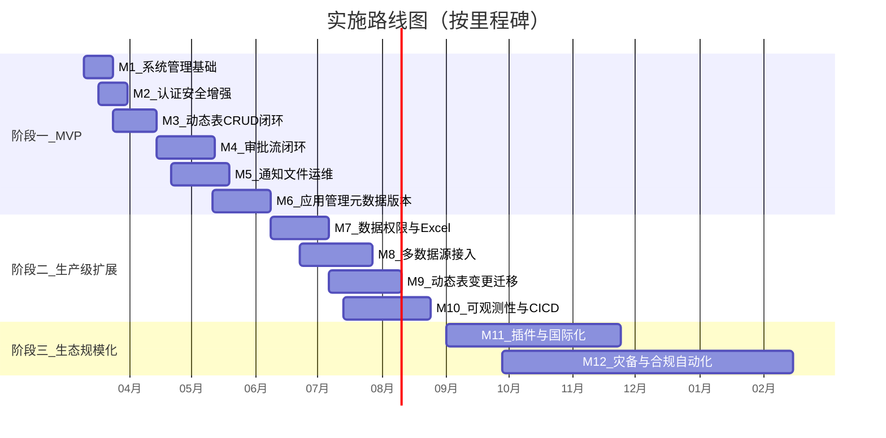

# 低代码多应用等保2.0平台 - 分阶段实施计划

## 现状评估

**已完成资产：**

- 后端：46 个 Controller、80+ Domain 实体、60+ Service 实现、18 个中间件/过滤器
- 前端：45 个页面组件、120+ API 方法、完整类型定义
- 文档：12 个 PRD Case 规格文档全部完成（Case 01 后端已实现）
- 安全基线：JWT/MFA/CSRF/XSS/幂等/限流/租户隔离已具雏形
- 审批流：FlowLong 复刻阶段 1-5 多项 completed
- 低代码：动态表 + AMIS Schema 生成 + CRUD API 核心通路已落地

**核心差距（来自研究报告）：**

- Case 02-12 后端/前端开发待联调验收
- 动态表 Alter 受限（AlterAsync 返回不支持）
- 数据源仅 SQLite，缺 PostgreSQL/MySQL 适配
- 缺乏元数据版本化/发布/回滚机制
- 可观测性仅有基础 server info，缺端到端链路追踪
- LowCode 模块表未在 DatabaseInitializer 中建表
- 缺合规证据自动导出能力

---

## 阶段一：MVP 可投产（0-3 个月）

> 目标：一个租户、多应用、至少一个业务应用可通过低代码配置上线，满足基本等保证据链。

### 里程碑 M1：系统管理基础补齐（第 1-2 周）

对应 `plan-功能补齐总览.md` Phase 1，完成系统管理基础能力。

| Case   | 内容                                    | 后端                                                                                                                                                                    | 前端                                                                                        | 依赖             |
| ------ | ------------------------------------- | --------------------------------------------------------------------------------------------------------------------------------------------------------------------- | ----------------------------------------------------------------------------------------- | -------------- |
| M1-C01 | 字典管理后端：DictType/DictData CRUD + 按编码查询 | [DictTypesController](src/backend/Atlas.WebApi/Controllers/DictTypesController.cs) + [DictDataController](src/backend/Atlas.WebApi/Controllers/DictDataController.cs) | -                                                                                         | 无              |
| M1-C02 | 字典管理前端：列表页 + 字典数据弹窗 + 下拉组件            | -                                                                                                                                                                     | [DictTypesPage.vue](src/frontend/Atlas.WebApp/src/pages/system/DictTypesPage.vue)         | M1-C01         |
| M1-C03 | 参数管理后端：SystemConfig CRUD + 内置参数不可删    | [SystemConfigsController](src/backend/Atlas.WebApi/Controllers/SystemConfigsController.cs)                                                                            | -                                                                                         | 无              |
| M1-C04 | 参数管理前端：列表页 + 搜索 + 内置标识                | -                                                                                                                                                                     | [SystemConfigsPage.vue](src/frontend/Atlas.WebApp/src/pages/system/SystemConfigsPage.vue) | M1-C03         |
| M1-C05 | 登录日志后端：登录成功/失败自动写入 + 分页查询             | [LoginLogsController](src/backend/Atlas.WebApi/Controllers/LoginLogsController.cs)                                                                                    | -                                                                                         | 无              |
| M1-C06 | 登录日志前端：分页列表 + 按用户名/IP/日期筛选            | -                                                                                                                                                                     | [LoginLogsPage.vue](src/frontend/Atlas.WebApp/src/pages/system/LoginLogsPage.vue)         | M1-C05         |
| M1-C07 | .http 测试文件更新：字典/参数/登录日志接口覆盖           | -                                                                                                                                                                     | -                                                                                         | M1-C01/C03/C05 |

### 里程碑 M2：认证安全体验增强（第 2-3 周）

对应 Phase 2 + Case 01 前端补齐。

| Case   | 内容                                   | 关键文件                                                                                          | 依赖     |
| ------ | ------------------------------------ | --------------------------------------------------------------------------------------------- | ------ |
| M2-C01 | 验证码后端：图形验证码生成 + 校验 + 开关配置            | `AuthController` + `CaptchaService`                                                           | 无      |
| M2-C02 | 验证码前端：登录页集成验证码 + 点击刷新                | [LoginPage.vue](src/frontend/Atlas.WebApp/src/pages/LoginPage.vue)                            | M2-C01 |
| M2-C03 | 记住我后端：RefreshToken 有效期延长逻辑           | `JwtAuthTokenService`                                                                         | 无      |
| M2-C04 | 记住我前端：登录页勾选框 + Token 管理              | LoginPage.vue                                                                                 | M2-C03 |
| M2-C05 | 在线用户后端：活跃会话查询 + 强制下线                 | [SessionsController](src/backend/Atlas.WebApi/Controllers/SessionsController.cs)              | 无      |
| M2-C06 | 在线用户前端：列表 + 强制下线按钮                   | [OnlineUsersPage.vue](src/frontend/Atlas.WebApp/src/pages/system/OnlineUsersPage.vue)         | M2-C05 |
| M2-C07 | XSS 中间件修复：修复写方法判断条件缺少括号的 bug（研究报告指出） | [XssProtectionMiddleware.cs](src/backend/Atlas.WebApi/Middlewares/XssProtectionMiddleware.cs) | 无      |

### 里程碑 M3：动态表 CRUD 全链路闭环（第 3-5 周）

对应 Case 02，是低代码平台核心价值链的第一环。

| Case   | 内容                                      | 关键实现                                                                                             | 依赖     |
| ------ | --------------------------------------- | ------------------------------------------------------------------------------------------------ | ------ |
| M3-C01 | 动态表元数据 CRUD 后端联调：建表/字段/索引创建、校验、审计事件     | `DynamicTableCommandService` + `DynamicTablesController`                                         | M1     |
| M3-C02 | 动态记录 CRUD 后端联调：记录创建/读取/更新/删除 + 分页/过滤/排序 | `DynamicRecordCommandService` + `DynamicTableRecordsController`                                  | M3-C01 |
| M3-C03 | 动态记录权限策略标准化：CRUD 统一鉴权 + 幂等 + 失败码一致      | Controller + `PermissionPolicyProvider`                                                          | M3-C02 |
| M3-C04 | AMIS Schema 自动生成：列表页/表单页/详情页 Schema 输出  | `DynamicAmisController` + `FileSystemAmisSchemaProvider`                                         | M3-C01 |
| M3-C05 | 动态表前端：表管理列表页 + 字段配置面板                   | [DynamicTablesPage.vue](src/frontend/Atlas.WebApp/src/pages/dynamic/DynamicTablesPage.vue)       | M3-C01 |
| M3-C06 | 动态表前端：CRUD 运行态页面（AMIS 渲染）               | [DynamicTableCrudPage.vue](src/frontend/Atlas.WebApp/src/pages/dynamic/DynamicTableCrudPage.vue) | M3-C04 |
| M3-C07 | 数据隔离安全证明：动态表 tenant 列验证 + 自动化测试         | 测试 + 文档                                                                                          | M3-C02 |
| M3-C08 | .http 测试文件：动态表全链路覆盖                     | `Bosch.http/DynamicTables.http`                                                                  | M3-C02 |

### 里程碑 M4：审批流闭环 + 动态表集成（第 5-8 周）

对应 Case 03，实现"设计-发布-发起-审批-回写-审计"完整链路。

| Case   | 内容                                | 关键实现                                                                                     | 依赖         |
| ------ | --------------------------------- | ---------------------------------------------------------------------------------------- | ---------- |
| M4-C01 | 审批流定义后端联调：创建/编辑/校验/保存草稿/发布        | `ApprovalFlowCommandService`                                                             | 无          |
| M4-C02 | 审批运行时后端联调：发起实例/任务分配/审批/驳回/撤回/状态回写 | `ApprovalRuntimeCommandService` + `ApprovalOperationService`                             | M4-C01     |
| M4-C03 | 动态表 + 审批绑定：记录提交审批 + 状态回写到动态记录     | `DynamicTableCommandService.SubmitApprovalAsync`                                         | M3, M4-C02 |
| M4-C04 | 审批审计全链路：每个操作产生审计事件 + 历史可导出        | `AuditWriter` + `ApprovalHistoryEvent`                                                   | M4-C02     |
| M4-C05 | 审批流设计器前端联调：画布/节点/属性面板/校验/保存/发布    | [ApprovalDesignerPage.vue](src/frontend/Atlas.WebApp/src/pages/ApprovalDesignerPage.vue) | M4-C01     |
| M4-C06 | 待办中心前端联调：我的待办/我发起的/任务池            | ApprovalTasksPage + ApprovalInstancesPage                                                | M4-C02     |
| M4-C07 | 审批详情页前端：状态时间线 + 操作按钮 + 权限控制       | ApprovalTaskDetailPage + ApprovalInstanceDetailPage                                      | M4-C02     |
| M4-C08 | .http 测试文件：审批全链路覆盖                | `Bosch.http/Approval*.http`                                                              | M4-C02     |

### 里程碑 M5：通知、文件、运维基础（第 6-9 周）

对应 Phase 3 + Case 04/05/11。

| Case   | 内容                           | 关键实现                                                                                                                       | 依赖     |
| ------ | ---------------------------- | -------------------------------------------------------------------------------------------------------------------------- | ------ |
| M5-C01 | 通知公告后端联调：发布/分发/标记已读/未读计数     | `NotificationService` + [NotificationsController](src/backend/Atlas.WebApi/Controllers/NotificationsController.cs)         | 无      |
| M5-C02 | 通知公告前端联调：管理页 + 收件箱 + 铃铛角标    | NotificationsPage.vue + NotificationBell.vue                                                                               | M5-C01 |
| M5-C03 | 文件上传下载后端联调：上传/下载/类型白名单/大小限制  | `LocalFileStorageService` + [FilesController](src/backend/Atlas.WebApi/Controllers/FilesController.cs)                     | 无      |
| M5-C04 | 文件上传下载前端：上传组件 + 预览 + 下载      | 通用组件                                                                                                                       | M5-C03 |
| M5-C05 | 定时任务后端联调：列表/触发/启停/历史查询 + 审计  | `HangfireScheduledJobService` + [ScheduledJobsController](src/backend/Atlas.WebApi/Controllers/ScheduledJobsController.cs) | 无      |
| M5-C06 | 定时任务前端联调：管理页 + 执行历史          | [ScheduledJobsPage.vue](src/frontend/Atlas.WebApp/src/pages/monitor/ScheduledJobsPage.vue)                                 | M5-C05 |
| M5-C07 | 服务监控后端联调：CPU/内存/磁盘/运行态 + 脱敏  | `ServerInfoQueryService` + [MonitorController](src/backend/Atlas.WebApi/Controllers/MonitorController.cs)                  | 无      |
| M5-C08 | 服务监控前端联调：监控面板 + 30s 轮询       | [ServerInfoPage.vue](src/frontend/Atlas.WebApp/src/pages/monitor/ServerInfoPage.vue)                                       | M5-C07 |
| M5-C09 | 健康检查接口：`/health` 端点 + 依赖检查   | [HealthController](src/backend/Atlas.WebApi/Controllers/HealthController.cs)                                               | 无      |
| M5-C10 | 备份脚本闭环：SQLite 文件级备份 + 恢复演练说明 | `DatabaseBackupHostedService` + 运维文档                                                                                       | 无      |

### 里程碑 M6：低代码应用管理 + 元数据版本（第 8-12 周）

对应研究报告 P0 "应用发布与元数据版本"，以及 LowCode 模块建表。

| Case   | 内容                                                                    | 关键实现                                                                                                                                                                  | 依赖     |
| ------ | --------------------------------------------------------------------- | --------------------------------------------------------------------------------------------------------------------------------------------------------------------- | ------ |
| M6-C01 | LowCode 模块建表：将 LowCodeApp/Page/FormDefinition 等加入 DatabaseInitializer | `DatabaseInitializerHostedService`                                                                                                                                    | 无      |
| M6-C02 | 应用管理后端：创建应用/应用级配置/启用项目域                                               | `LowCodeAppCommandService` + [LowCodeAppsController](src/backend/Atlas.WebApi/Controllers/LowCodeAppsController.cs)                                                   | M6-C01 |
| M6-C03 | 元数据版本机制后端：版本号生成/变更记录/发布/回滚                                            | 新增 `AppVersionService`                                                                                                                                                | M6-C02 |
| M6-C04 | 应用发布后端：一键发布（冻结当前元数据快照）+ 回滚到指定版本                                       | `POST /api/v1/lowcode-apps/{appKey}/publish`                                                                                                                          | M6-C03 |
| M6-C05 | 应用管理前端：应用列表 + 创建向导 + 版本管理                                             | [AppListPage.vue](src/frontend/Atlas.WebApp/src/pages/lowcode/AppListPage.vue) + [AppBuilderPage.vue](src/frontend/Atlas.WebApp/src/pages/lowcode/AppBuilderPage.vue) | M6-C02 |
| M6-C06 | 发布/回滚前端：版本历史 + 发布按钮 + 回滚确认                                            | AppBuilderPage.vue                                                                                                                                                    | M6-C04 |
| M6-C07 | 项目域隔离后端联调：X-Project-Id + 成员校验 + 越权拒绝                                  | `ProjectContextMiddleware` + `ProjectQueryService`                                                                                                                    | 无      |
| M6-C08 | 项目域隔离前端联调：项目切换 + 头部 X-Project-Id 注入                                   | 布局 + API 拦截器                                                                                                                                                          | M6-C07 |

---

## 阶段二：生产级扩展与稳态（3-6 个月）

> 目标：数据源多样化、动态表可变更、可观测性体系化、CI/CD 安全基线。

### 里程碑 M7：数据权限 + Excel 导入导出（第 13-16 周）

对应 Case 10 + Case 09。

| Case   | 内容                                            | 依赖                            |
| ------ | --------------------------------------------- | ----------------------------- |
| M7-C01 | 数据权限后端：DataScope 枚举 + 角色配置 + Repository 过滤器注入 | 无                             |
| M7-C02 | 数据权限前端：角色管理页 DataScope Tab + 自定义部门选择          | M7-C01                        |
| M7-C03 | Excel 导出后端：通用导出服务 + 用户/字典导出                   | `ClosedXmlExcelExportService` |
| M7-C04 | Excel 导入后端：模板下载 + 批量导入 + 错误行反馈 + Hangfire 异步  | M7-C03                        |
| M7-C05 | Excel 导入导出前端：导出按钮 + 模板下载 + 导入弹窗 + 进度          | M7-C04                        |
| M7-C06 | .http 测试文件：数据权限 + Excel 接口覆盖                  | M7-C01/C04                    |

### 里程碑 M8：多数据源接入（第 15-20 周）

对应 Case 07 + 研究报告 P1 "数据源适配层"。

| Case   | 内容                                     | 依赖     |
| ------ | -------------------------------------- | ------ |
| M8-C01 | 数据源管理后端：TenantDataSource CRUD + 凭据加密存储 | 无      |
| M8-C02 | 连接测试后端：PostgreSQL/MySQL 连接工厂 + 测试端点    | M8-C01 |
| M8-C03 | 数据源授权后端：按应用/项目授权 + 审计留痕                | M8-C01 |
| M8-C04 | 数据源管理前端：列表/创建/测试/授权页面                  | M8-C01 |
| M8-C05 | 数据集(Dataset)后端：查询定义/字段映射/缓存策略/限流       | M8-C02 |
| M8-C06 | 数据集前端：SQL 编辑器/预览/绑定页面组件                | M8-C05 |

### 里程碑 M9：动态表变更与迁移（第 17-22 周）

对应研究报告 P1 "动态表 Alter/迁移机制"。

| Case   | 内容                        | 依赖         |
| ------ | ------------------------- | ---------- |
| M9-C01 | 动态表字段新增支持：安全添加字段（不影响现有数据） | M3         |
| M9-C02 | 动态表字段重命名/类型变更受控：版本化迁移脚本生成 | M9-C01     |
| M9-C03 | 迁移审批流程：变更需审批 + 回滚预案       | M4, M9-C02 |
| M9-C04 | 迁移前端：变更预览/确认/执行状态/回滚      | M9-C02     |

### 里程碑 M10：可观测性 + CI/CD 安全（第 18-24 周）

对应 Case 12 + 研究报告 P1。

| Case    | 内容                                           | 依赖                                |
| ------- | -------------------------------------------- | --------------------------------- |
| M10-C01 | OpenTelemetry 接入后端：Traces/Metrics/Logs 三件套   | 无（Program.cs 已有 AddOpenTelemetry） |
| M10-C02 | 关键业务 Span 埋点：审批耗时/动态表查询/数据源调用                | M10-C01                           |
| M10-C03 | 统一指标定义：RED/USE 指标 + SLO 阈值                   | M10-C01                           |
| M10-C04 | 告警规则引擎：基于指标的告警（错误率/延迟/队列积压）                  | M10-C03                           |
| M10-C05 | 可观测性前端：指标仪表盘 + 链路查询                          | M10-C01                           |
| M10-C06 | GitHub Actions CI/CD：构建 + CodeQL SAST + 依赖扫描 | 无                                 |
| M10-C07 | Dependabot 配置：自动依赖漏洞告警 + SCA 报告固化            | 无                                 |
| M10-C08 | 等保证据映射文档：控制点 -> 平台能力 -> 日志位置 -> 导出方式         | M10-C01                           |

---

## 阶段三：生态与规模化（6-12 个月）

> 目标：插件生态、灾备高可用、合规自动化、国际化。

### 里程碑 M11：插件机制 + 国际化（第 25-36 周）

| Case    | 内容                                               | 依赖      |
| ------- | ------------------------------------------------ | ------- |
| M11-C01 | 插件加载机制后端：AssemblyLoadContext 隔离加载 + 插件目录         | 无       |
| M11-C02 | 扩展点定义：字段类型/校验器/数据源连接器/审批节点类型接口                   | M11-C01 |
| M11-C03 | 插件管理后端：注册/启用/禁用/版本/卸载                            | M11-C01 |
| M11-C04 | 插件管理前端：插件列表/上传/配置                                | M11-C03 |
| M11-C05 | 国际化后端：Accept-Language + FluentValidation 多语言错误消息 | 无       |
| M11-C06 | 国际化前端：中/英切换 + 菜单/表单/提示全覆盖 + 偏好持久化                | M11-C05 |

### 里程碑 M12：灾备高可用 + 合规自动化（第 28-48 周）

| Case    | 内容                              | 依赖              |
| ------- | ------------------------------- | --------------- |
| M12-C01 | 数据库主从/快照：PostgreSQL 主从复制 + 定期快照 | M8              |
| M12-C02 | RPO/RTO 量化：恢复演练方案 + 定期自动执行      | M12-C01         |
| M12-C03 | 密钥轮换机制：JWT SigningKey/数据源凭据自动轮换 | 无               |
| M12-C04 | 合规证据自动导出：等保控制点 -> 证据项 -> 一键导出包  | M10-C08         |
| M12-C05 | 灰度发布：按租户/应用/项目域灰度 + SLO 触发自动阻断  | M6-C04, M10-C03 |

---

## 实施优先级总览

## 每个 Case 的标准交付物

每个 Case 完成时必须包含：

- 后端代码通过 `dotnet build`（0 错误 0 警告）
- 前端代码通过 `npm run build`
- 对应 `.http` 测试文件覆盖新增/修改接口
- `docs/contracts.md` 同步更新接口契约
- 审计事件覆盖所有写操作
- 租户隔离验证通过

## 建议首先执行的 Case

按依赖关系和价值排序，建议按以下顺序启动：

1. **M1-C01 ~ M1-C07**（字典/参数/登录日志）- 基础能力，无外部依赖
2. **M2-C07**（XSS 中间件修复）- 安全缺陷，立即修复
3. **M3-C01 ~ M3-C08**（动态表 CRUD 闭环）- 低代码核心价值链
4. **M4-C01 ~ M4-C08**（审批流闭环）- 等保合规关键闭环
5. **M6-C01**（LowCode 模块建表）- 解除后续低代码功能的阻塞

