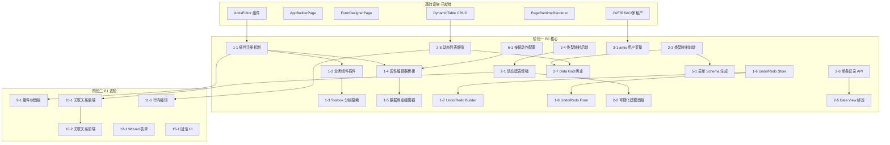

# Mendix 风格应用级低代码设计器：最小实施 Case 拆分方案

## 现有基础盘点

项目已具备大量基础能力，无需从零开始：

- **后端：** `LowCodeApp` / `LowCodePage` / `FormDefinition` / `DynamicTable` 等实体及完整 CRUD 服务、版本管理、导入导出、环境管理均已实现
- **前端：** `AmisEditor`（React amis-editor 的 Vue 包装）、`AppBuilderPage`（页面树 + Schema 编辑）、`FormDesignerPage`（表单 Schema 编辑 + 发布）、`PageRuntimeRenderer`（运行态渲染）、`DynamicTableCrudPage`（动态表 CRUD）均已就绪
- **认证与多租户：** JWT + RBAC + TenantEntity + QueryFilter 完整
- **菜单与路由：** 动态菜单、权限守卫、Vue Router 已完善

以下每个 Case 是在现有基础上的**增量工作**。

---

## 阶段一：P0 核心基础能力（共 35 Case）

### 1. 页面设计器（Page Editor）

#### Case 1-1: amis-editor 自定义插件注册机制

- **前端** `src/components/amis/amis-plugins/` 新建插件注册入口
- 在 [AmisEditor.vue](src/frontend/Atlas.WebApp/src/components/amis/AmisEditor.vue) 中支持传入 `plugins` 数组，在 `Editor` 初始化时注册
- 验收：可通过 props 注册一个空白占位插件，在组件面板中显示

#### Case 1-2: 业务组件封装为 amis 插件（第一批 3 个）

- 封装 `DynamicTable`、`StatusTag`、`UserRolePicker` 为 amis 自定义渲染器 + 编辑器插件
- 每个插件包含：`plugin.tsx`（注册）、`renderer.tsx`（渲染）、`editor-config.ts`（属性面板配置）
- 验收：在 amis-editor 组件面板 "业务组件" 分组中可拖拽使用

#### Case 1-3: 组件面板（Toolbox）分组与搜索

- 前端在 amis-editor 上方/左侧增加自定义分组面板：「基础组件」「业务组件」「布局组件」
- 支持关键字搜索过滤组件
- 验收：输入关键字可过滤显示匹配组件

#### Case 1-4: 属性面板 - 自定义 Vue 3 属性编辑器嵌入机制

- 在 amis-editor 的属性面板中支持嵌入 Vue 3 组件作为自定义属性编辑器
- 创建 `src/components/amis/property-editors/` 目录，提供 `PropertyEditorBridge.vue`（React ↔ Vue 桥接）
- 验收：一个示例属性编辑器（如颜色选择器）可在属性面板中正常工作

#### Case 1-5: 属性面板 - 数据绑定属性编辑器

- 新建 `DataBindingEditor.vue`，可选择当前页面上下文中的数据字段
- 展示可绑定的字段列表（来自关联的 DynamicTable 字段定义）
- 验收：在属性面板中选择数据字段，生成 `${fieldName}` 绑定表达式

#### Case 1-6: 撤销/重做 - Schema 历史栈（Pinia Store）

- 新建 `src/stores/schemaHistory.ts`，基于 Pinia 实现：
  - `pushState(schema)`、`undo()`、`redo()`、`canUndo`、`canRedo`
  - 最大历史 50 步，采用快照策略
- 验收：单元测试验证 push/undo/redo 正确性

#### Case 1-7: 撤销/重做 - 集成到 AppBuilderPage

- 在 [AppBuilderPage.vue](src/frontend/Atlas.WebApp/src/pages/lowcode/AppBuilderPage.vue) 工具栏增加 Undo/Redo 按钮
- 监听 `Ctrl+Z` / `Ctrl+Shift+Z` 快捷键
- `handlePageSchemaChange` 回调中自动 pushState
- 验收：编辑 Schema 后可撤销/重做，快捷键可用

#### Case 1-8: 撤销/重做 - 集成到 FormDesignerPage

- 同 Case 1-7 逻辑应用到 [FormDesignerPage.vue](src/frontend/Atlas.WebApp/src/pages/lowcode/FormDesignerPage.vue)
- 验收：表单设计器中 Undo/Redo 可用

### 2. 数据模型与绑定（Domain Model & Data Binding）

#### Case 2-1: 实体建模 - 后端动态建表 API 增强

- 确认 [DynamicTableCommandService](src/backend/Atlas.Infrastructure/Services/DynamicTableCommandService.cs) 的 `CreateAsync` 支持通过 `DynamicField` 定义自动 CodeFirst 建表
- 如不完整，补充 `SqlSugar` `CodeFirst.InitTables` 动态调用逻辑
- 验收：POST 创建 DynamicTable + Fields → 实际数据库表被创建

#### Case 2-2: 实体建模 - 前端可视化建模面板

- 新建 `src/components/designer/EntityModelingPanel.vue`
- 以表格形式展示/编辑字段列表：字段名、显示名、类型（下拉）、长度、允许空、主键、唯一
- 调用 `DynamicTable` API 创建/更新
- 验收：可视化创建一张表并在数据库中验证

#### Case 2-3: 属性类型映射 - 前端类型到 amis 组件映射表

- 新建 `src/utils/field-type-mapping.ts`，定义 `DynamicFieldType` → amis 组件的映射：
  - `String` → `input-text`、`Int/Long` → `input-number`、`DateTime` → `input-date`、`Boolean` → `switch`、`Decimal` → `input-number`(precision)、`Text` → `textarea` 等
- 验收：给定字段类型数组，输出对应 amis schema 片段

#### Case 2-4: 属性类型映射 - 后端字段类型到 SqlSugar 映射

- 在 `DynamicTableCommandService` 中确认 `DynamicFieldType` 枚举到 SqlSugar `DbColumnInfo` 的映射完整
- 补充缺失类型（如 `Enum`、`File`）
- 验收：每种 `DynamicFieldType` 都能正确映射到数据库列类型

#### Case 2-5: 数据视图（Data View）- amis Form 自动绑定单条记录

- 在 `PageRuntimeRenderer` 中，当 schema 包含 `form` 类型且配置了 `dataTableKey` 时，自动注入 `initApi` 为 `GET /api/v1/runtime/apps/{appKey}/pages/{pageKey}/records/${id}`
- 验收：运行态访问带 `?id=xxx` 参数的页面，表单自动加载该条记录

#### Case 2-6: 数据视图 - 后端单条记录查询 API

- 在现有 `DynamicTableRecordsController` 确认 `GET /{tableKey}/records/{id}` 端点存在
- 如缺失则补充，返回单条 `DynamicRecordDto`
- 验收：`.http` 文件测试单条记录查询

#### Case 2-7: 数据网格（Data Grid）- amis CRUD 组件自动绑定列表

- 在 AppBuilderPage 中，当页面类型为 `List` 且绑定了 `DataTableKey` 时，自动生成 amis `crud` schema 骨架
- 列定义从 DynamicTable 字段获取，使用 Case 2-3 的映射
- 验收：创建 List 类型页面并绑定动态表后，自动生成可工作的 CRUD schema

#### Case 2-8: 数据网格 - 后端动态列表查询 API 增强

- 确认 `DynamicTableRecordsController` 的列表查询支持动态 `orderBy`、`where` 条件
- 验收：通过 query 参数传入排序和筛选条件，返回正确分页结果

### 3. 登录与用户上下文（Auth & User Context）

#### Case 3-1: 当前用户信息 - amis 全局变量注入

- 在 `src/amis/amis-env.ts` 的 `createAmisEnv()` 中注入 `globalData.currentUser`
- 数据来源：Pinia `useUserStore` 中的用户信息（userId, userName, roles, tenantId 等）
- 验收：amis schema 中使用 `${global.currentUser.userName}` 可正确显示当前用户名

#### Case 3-2: 角色权限控制 - amis visibleOn 角色表达式

- 在 amis 渲染环境中注入 `global.currentUser.roles` 数组
- 文档化 amis 中角色控制的表达式写法，如 `"visibleOn": "CONTAINS(global.currentUser.roles, 'admin')"`
- 验收：不同角色用户看到不同的 UI 元素

#### Case 3-3: 登录页设计 - amis Schema 渲染登录表单

- 新建可选的 amis schema 登录页模板（存储为 LowCodePage schema）
- 在 amis schema 中配置表单提交调用 `/api/v1/auth/login`
- 验收：通过 amis schema 渲染的登录表单可完成登录流程

#### Case 3-4: 多租户上下文 - amis 请求自动携带租户头

- 确认 `amis-env.ts` 的 `fetcher` 自动从 `requestApi` 获取并携带 `X-Tenant-Id`、`Authorization` 头
- 验收：amis 发起的 API 请求均携带正确的租户和认证头

### 4. 复杂表格与 CRUD（Complex CRUD & Data Grid）

#### Case 4-1: 列配置 - amis Table columns 属性面板

- 在 amis-editor 中，Table 组件的属性面板支持可视化配置 columns（新增/删除/排序列）
- 基于 amis-editor 内置的 Table 编辑能力，确认其可用性
- 验收：通过属性面板增删改列，保存到 schema

#### Case 4-2: 排序/筛选/分页 - 后端动态 SQL 构建

- 增强 `DynamicSqlBuilder`，支持从 amis CRUD 发出的标准分页参数（`page`、`perPage`、`orderBy`、`orderDir`）和筛选参数
- 验收：amis CRUD 表格的分页、排序、头部筛选均可正常触发后端查询

#### Case 4-3: 排序/筛选/分页 - 前端 amis CRUD 参数对接

- 确认 amis `crud` 组件的 `api` 配置能正确传递分页和筛选参数到后端
- 在 `amis-env.ts` 的 fetcher 中处理 amis 标准参数格式到后端 `PagedRequest` 的转换
- 验收：amis CRUD 分页翻页、列头排序、搜索框筛选均生效

### 5. 表单设计（Form Design）

#### Case 5-1: 字段类型映射 - 表单 Schema 自动生成

- 在 FormDesignerPage 中增加「从数据表导入字段」功能
- 根据 DynamicTable 的字段列表，使用 Case 2-3 的映射自动生成表单 schema
- 验收：选择一张 DynamicTable，自动生成包含所有字段的表单 schema

#### Case 5-2: 字段联动与可见性 - 属性面板条件编辑器

- 在 amis-editor 属性面板中，为 `visibleOn`/`disabledOn`/`requiredOn` 属性提供可视化条件编辑器
- 新建 `ConditionExpressionEditor.vue`，支持选择字段 + 运算符 + 值的组合
- 验收：通过可视化编辑器生成 `"data.status === 'active'"` 类表达式

#### Case 5-3: 表单校验 - 前端 amis 校验规则配置

- 在属性面板中为表单字段提供校验规则配置：必填、最小/最大长度、正则、范围
- 映射为 amis schema 的 `validations` 和 `validationErrors`
- 验收：配置校验规则后，表单提交时前端校验生效

#### Case 5-4: 表单校验 - 后端 FluentValidation 动态校验

- 在 `DynamicRecordCommandService` 中，根据 DynamicField 的约束（AllowNull、Length 等）动态生成校验逻辑
- 验收：提交不合法数据时，后端返回 VALIDATION_ERROR

#### Case 5-5: 表单数据持久化 - amis 表单提交对接

- 确认 amis `form` 组件的 `api` 配置能正确调用后端 `DynamicTableRecords` 的创建/更新 API
- 在 `PageRuntimeRenderer` 中自动注入提交 API（已有 `applyRuntimeSubmitApi` 逻辑，确认其完整性）
- 验收：运行态表单填写后提交，数据正确写入 DynamicTable

### 6. 业务逻辑与动作流（Microflow / Action）

#### Case 6-1: 按钮动作配置 - amis Action 扩展

- 在 amis-editor 中扩展 `Action` 组件的属性面板，增加预定义动作类型：
  - `openPage`（打开页面）、`openDialog`（打开弹窗）、`submitForm`（提交表单）、`callApi`（调用 API）
- 验收：配置按钮动作后，点击按钮触发对应行为

#### Case 6-2: 调用 REST API - 后端代理接口

- 新增 `api/v1/lowcode-proxy/rest` 端点，接受配置化的 REST 调用参数（URL、Method、Headers、Body）
- 后端使用 `HttpClient` 发起请求，支持认证代理
- 验收：通过代理接口调用外部 API 并返回结果

#### Case 6-3: 调用 REST API - 前端 API 配置节点

- 在 amis-editor 属性面板中，为 `api` 类型属性提供可视化配置器
- 支持选择：内部 API（DynamicTable CRUD）或 外部 API（通过代理）
- 验收：可视化配置 API 调用参数并在 schema 中正确保存

#### Case 6-4: 触发工作流 - 后端触发接口

- 新增 `api/v1/lowcode-actions/trigger-workflow` 端点
- 接受 `workflowDefinitionId` + `inputData`，调用现有 WorkflowCore 启动工作流实例
- 验收：`.http` 文件测试触发工作流实例

#### Case 6-5: 触发审批流 - 后端触发接口

- 新增 `api/v1/lowcode-actions/trigger-approval` 端点
- 接受 `approvalFlowDefinitionId` + `formData`，调用现有审批引擎启动审批实例
- 验收：`.http` 文件测试触发审批流

#### Case 6-6: 错误处理 - amis 统一错误展示

- 在 `amis-env.ts` 的 `notify` 和 `alert` 中对接 Ant Design Vue 的 `message` 和 `notification`
- 确认后端 `ApiResponse` 的 `message` 字段能被 amis 正确展示
- 验收：API 返回错误时，amis 页面展示友好错误提示

### 7. 导航与路由（Navigation & Routing）

#### Case 7-1: 菜单配置 - 低代码应用菜单编辑器

- 在 AppBuilderPage 中增加「菜单管理」功能
- 基于页面树自动生成菜单结构，支持拖拽排序、图标选择、权限绑定
- 后端在 `LowCodeApp` 中增加 `MenuConfigJson` 字段存储菜单配置
- 验收：配置菜单后，运行态侧边栏正确展示

#### Case 7-2: 页面跳转与参数 - amis link/dialog 动作

- 文档化 amis 中页面跳转的标准配置方式：
  - `link` 动作：URL 参数传递 `"/page?id=${id}"`
  - `dialog` 动作：弹窗内嵌页面
- 在属性面板中提供页面选择器（从当前应用的页面树中选择目标页）
- 验收：按钮跳转到目标页面并正确传递参数

#### Case 7-3: 权限控制路由 - 运行态页面权限检查

- 在 `PageRuntimeRenderer` 中，加载页面前检查当前用户是否有该页面的 `permissionCode` 权限
- 无权限时展示 403 提示
- 后端 `GetRuntimePageSchema` 接口增加权限验证
- 验收：无权限用户访问受保护页面时被拦截

### 8. 发布与版本管理（Deployment & Version Control）

#### Case 8-1: 状态管理 - 应用状态流转 UI

- 在 AppBuilderPage 工具栏展示当前应用状态（Draft/Published/Disabled/Archived）
- 提供状态切换按钮（发布、停用、启用、归档）
- 调用已有 `publishLowCodeApp`、`disableLowCodeApp` 等 API
- 验收：应用状态流转正常，UI 实时反映

#### Case 8-2: 快照管理 - 版本历史列表 UI 增强

- 在 AppBuilderPage 的版本历史弹窗中，展示 `LowCodeAppVersion` 列表
- 每条记录展示：版本号、操作类型、备注、创建时间
- 支持查看快照详情（JSON 预览）
- 验收：可查看完整版本历史

#### Case 8-3: 多环境部署 - 环境切换与 Schema 隔离

- 在 AppBuilderPage 中，确认环境切换器正常工作（已有 `getLowCodeEnvironments` 调用）
- 确认不同环境的 Schema 通过 `envCode` 参数隔离
- 验收：切换环境后，预览的页面内容随环境变化

---

## 阶段二：P1 进阶能力（共 20 Case）

### 1. 页面设计器进阶

#### Case 9-1: 组件树（Component Tree）面板

- 新建 `src/components/amis/ComponentTreePanel.vue`
- 从当前 amis schema 解析出组件树结构（递归遍历 `body`/`columns`/`items`）
- 支持：选中联动（点击树节点 → 画布高亮）、拖拽排序
- 验收：组件树与画布双向联动

#### Case 9-2: 多设备预览

- 在 AppBuilderPage/FormDesignerPage 工具栏增加设备切换器（Desktop 1280px / Tablet 768px / Mobile 375px）
- 动态调整画布容器宽度
- 利用 AmisEditor 已有的 `isMobile` prop
- 验收：切换设备后画布宽度变化，amis 响应式布局生效

### 2. 数据模型进阶

#### Case 10-1: 关联关系 - 后端外键与中间表管理

- 增强 `DynamicRelation` 的创建逻辑：
  - 一对多（1-N）：在目标表创建外键列
  - 多对多（N-M）：自动创建中间表
- 验收：创建关联后，数据库中生成正确的外键/中间表

#### Case 10-2: 关联关系 - 前端连线交互

- 在 `EntityModelingPanel` 中，使用 AntV X6 展示实体关系图
- 支持拖拽连线建立关系（已有 X6 在审批设计器中的使用经验）
- 验收：可视化连线创建表关系

#### Case 10-3: 关联关系 - amis CRUD 关联数据展示

- 在 amis CRUD 的列定义中支持关联字段（如 `relatedTable.fieldName`）
- 后端查询时自动 JOIN 关联表
- 验收：CRUD 表格中展示关联表的字段数据

### 3. 复杂表格进阶

#### Case 11-1: 行内编辑 - amis Table editable 模式

- 配置 amis `Table` 组件的 `editable` 属性
- 后端增加单行更新 API `PATCH /api/v1/dynamic-tables/{tableKey}/records/{id}`
- 验收：双击表格单元格可编辑，保存后数据更新

#### Case 11-2: 批量操作 - 后端批量 API

- 确认 `DynamicTableRecordsController` 支持批量删除 `DELETE /records/batch`、批量更新 `PATCH /records/batch`
- 前端 amis CRUD 配置 `bulkActions`
- 验收：勾选多行后执行批量删除/修改状态

#### Case 11-3: 行内编辑 - amis-editor 可视化配置

- 在 amis-editor 的 Table 属性面板中，增加"行内编辑"开关和保存 API 配置
- 验收：通过属性面板配置行内编辑模式

### 4. 表单设计进阶

#### Case 12-1: 多步骤表单（Wizard）

- 在 amis-editor 组件面板中确认 `Wizard` 组件可用
- 在属性面板中支持配置步骤（标题、字段组、校验规则）
- 前端暂存步骤数据，最后一步统一提交
- 验收：拖入 Wizard 组件，配置多步骤表单，运行态可正常使用

### 5. 业务逻辑进阶

#### Case 13-1: 条件分支 - 前端简单条件配置

- 在 amis `Action` 的属性面板中增加条件执行配置
- 支持简单 if-else 条件（基于表单数据字段值判断）
- 映射为 amis 的 `expression` 条件动作
- 验收：按钮根据条件执行不同动作

#### Case 13-2: 错误处理 - 自定义错误路径

- 在 amis 的 `api` 配置中支持 `onFailed` 回调配置
- 前端根据错误码执行不同动作（如关闭弹窗、显示特定提示）
- 验收：API 失败时执行配置的错误处理逻辑

### 6. 导航进阶

#### Case 14-1: 菜单配置 - 权限绑定

- 菜单项支持绑定 `permissionCode`
- 运行态根据用户权限过滤菜单项（后端在返回菜单配置时过滤）
- 验收：不同权限用户看到不同菜单

### 7. 版本管理进阶

#### Case 15-1: 回滚 - Schema 版本回滚

- 在版本历史 UI 中增加「回滚到此版本」按钮
- 调用已有 `rollbackLowCodeAppVersion` API
- 前端确认弹窗提示回滚影响
- 验收：回滚后应用 Schema 恢复到目标版本

#### Case 15-2: 回滚 - 页面级版本回滚

- 在页面版本历史中支持回滚单个页面的 Schema
- 调用已有 `rollbackLowCodePage` API
- 验收：单个页面回滚不影响其他页面

#### Case 15-3: 导入导出 - 应用包导出

- 在 AppBuilderPage 增加「导出」按钮
- 调用已有 `exportLowCodeApp` API，下载 ZIP 包
- 验收：导出包含 Schema、页面、表单、配置的完整包

#### Case 15-4: 导入导出 - 应用包导入

- 在应用列表页增加「导入」按钮
- 上传 ZIP 文件，调用已有 `importLowCodeApp` API
- 展示导入结果（成功/冲突/跳过）
- 验收：导入后应用及其页面在系统中可用

#### Case 15-5: 导入导出 - 冲突处理 UI

- 导入时如检测到同名应用/页面，展示冲突解决对话框
- 选项：覆盖 / 跳过 / 重命名
- 验收：冲突情况下用户可选择处理方式

### 8. 多租户进阶

#### Case 16-1: 多租户数据隔离 - 低代码应用租户隔离验证

- 确认 `LowCodeApp`、`LowCodePage`、`DynamicTable` 均继承 `TenantEntity`
- 编写 `.http` 测试用例：不同租户互相看不到对方的应用和数据
- 验收：跨租户数据完全隔离

---

## 阶段三：P2 高级增强能力（共 13 Case）

### 1. 数据模型高级

#### Case 17-1: XPath 表达式 - 后端表达式解析器

- 新建 `src/backend/Atlas.Infrastructure/Services/ExpressionParser.cs`
- 实现简化版 XPath 语法到 SqlSugar `Where` 条件的转换
- 支持基础操作符：`=`、`!=`、`>`、`<`、`contains`、`and`、`or`
- 验收：解析 `[Status = 'Active' and Amount > 100]` 生成正确 SQL

#### Case 17-2: XPath 表达式 - 前端表达式编辑器

- 新建 `ExpressionEditor.vue`，支持语法高亮和自动补全
- 字段名从 DynamicTable 字段列表获取
- 验收：编辑器输入表达式，发送到后端解析成功

### 2. 复杂表格高级

#### Case 18-1: 主子表联动 - 后端关联查询 API

- 新增 `GET /api/v1/dynamic-tables/{tableKey}/records/{id}/related/{relatedTableKey}` 端点
- 根据 `DynamicRelation` 查询关联记录
- 验收：`.http` 测试获取主记录的关联子记录

#### Case 18-2: 主子表联动 - 前端嵌套表格

- 在 amis schema 中配置嵌套 CRUD 或分栏布局
- 主表行选中事件触发子表数据刷新（amis `onEvent` + `setValue`）
- 在 amis-editor 中提供主子表联动的配置模板
- 验收：选中主表行，子表自动加载关联数据

### 3. 业务逻辑高级

#### Case 19-1: 条件分支与循环 - 微流程可视化设计器

- 基于现有工作流设计器（[WorkflowEditorPage.vue](src/frontend/Atlas.WebApp/src/pages/workflow/WorkflowEditorPage.vue)）
- 扩展支持简单的微流程节点：条件分支、循环、变量赋值、API 调用
- 验收：可视化设计简单微流程并保存

#### Case 19-2: 条件分支与循环 - 后端微流程执行引擎

- 基于现有 `WorkflowCore` 引擎
- 新增微流程执行端点 `POST /api/v1/lowcode-actions/execute-microflow`
- 解析微流程 JSON 定义并执行
- 验收：执行包含条件分支的微流程，返回正确结果

### 4. 版本管理高级

#### Case 20-1: 回滚 - 数据模型回滚策略

- 在 `MigrationRecord` 基础上实现数据模型回滚
- 执行 `DynamicSchemaMigration.RollbackSql` 回滚表结构变更
- 验收：回滚数据模型后，表结构恢复到之前版本

#### Case 20-2: 多环境部署 - CI/CD 集成配置

- 文档化多环境部署流程：
  - `appsettings.Development.json` / `appsettings.Staging.json` / `appsettings.Production.json`
  - 低代码应用 Schema 通过 `LowCodeEnvironment.VariablesJson` 按环境隔离
- 验收：文档完整，不同环境配置独立

#### Case 20-3: 导入导出 - 增量导出

- 支持按时间范围或版本范围导出变更
- 后端在导出时可选择全量或增量
- 验收：增量导出只包含指定范围的变更

---

## 依赖关系图

## 实施建议

1. **串行主线：** Case 1-1 → 1-2 → 1-3（插件体系）是设计器核心，优先完成
2. **并行支线：** Case 2-1~~2-8（数据模型）与 Case 1-6~~1-8（Undo/Redo）可并行
3. **验收节奏：** 每完成一个 Case 即可独立验证，不依赖后续 Case
4. **阶段交付：** P0（35 Case）→ P1（20 Case）→ P2（13 Case），每阶段可独立发布
5. **估算参考：** P0 单 Case 平均 1-3 天，P1 平均 2-4 天，P2 平均 3-5 天

