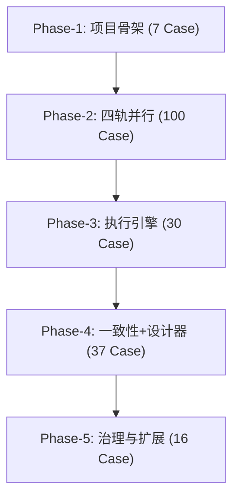

# 后台逻辑处理增强引擎 - 开发实施计划

详细 Case 定义、验证标准与 contracts 同步要求见 [docs/plan-backend-logic-engine-progress.md](docs/plan-backend-logic-engine-progress.md)。

## 实施阶段总览

## 约束与规范

- 后端 Case 三件套：实体/接口/实现 + contracts.md 同步 + `.http` 测试文件
- 前端 Case：组件 + i18n + `npm run build` 通过
- 每个 Case 完成后 `dotnet build` 0 错误 0 警告
- 写操作 API 要求 `Idempotency-Key` + `X-CSRF-TOKEN`
- 数据库操作禁止循环内逐条执行
- 新路由使用 `api/v1` 版本前缀

---

## Phase-1：项目骨架（Track-01，7 Case）✅ 已完成

**前置**：无  
**目标**：建立 LogicFlow 与 BatchProcess 两组三层项目，注册至 DI 容器

- T01-01-B ~ T01-03-B：新建 `Atlas.Domain.LogicFlow` / `Atlas.Application.LogicFlow` / `Atlas.Infrastructure.LogicFlow`，加入 [Atlas.SecurityPlatform.slnx](Atlas.SecurityPlatform.slnx)，层级引用 Core -> Domain -> Application -> Infrastructure
- T01-04-B ~ T01-06-B：新建 `Atlas.Domain.BatchProcess` / `Atlas.Application.BatchProcess` / `Atlas.Infrastructure.BatchProcess`，同样加入 slnx
- T01-07-B：在 [src/backend/Atlas.Infrastructure/DependencyInjection/ServiceCollectionExtensions.cs](src/backend/Atlas.Infrastructure/DependencyInjection/ServiceCollectionExtensions.cs) 中注册上述 6 个模块，确保 WebApi 启动无 DI 异常

**验收**：`dotnet build` 通过 + WebApi 启动可解析所有新模块

---

## Phase-2：四轨并行（T02 + T03 + T04 + T06，共 100 Case）🔄 进行中

**前置**：Phase-1 完成 ✅  
**四条轨道之间无互相依赖**，可分配给不同开发者/AI 并行推进

> **进度**：Track-02 ✅ 36/36 | Track-03 ✅ 24/24 | Track-04 🔄 进行中 | Track-06 🔄 进行中

### Track-02：动态建模内核升级（36 Case）✅ 已完成

按依赖链分为 4 个子批次：

**子批次 2a - 实体扩展与快照（T02-01 ~ T02-06, T02-22, T02-23）** ✅

- 扩展 `DynamicTable` / `DynamicField` 实体字段
- 新建 `SchemaPublishSnapshot` 实体 + 仓储 + 查询/命令服务
- `DatabaseCapabilityMatrix` 能力矩阵元数据
- 审计字段模板自动注入

**子批次 2b - 兼容性检查（T02-07 ~ T02-11, T02-32, T02-33）** ✅

- `ISchemaCompatibilityChecker` 接口 + 名称/类型/索引/函数/逻辑流 5 类检测
- 高风险变更预警服务

**子批次 2c - DDL 与迁移（T02-12 ~ T02-16, T02-29 ~ T02-31, T02-34 ~ T02-36）** ✅

- DDL up script / down hint / warning list 生成
- Expand / Migrate / Contract 三阶段迁移
- 影响分析 impact list
- DDL 与能力矩阵对齐
- 快照与迁移任务关联 + Schema 变更审计

**子批次 2d - 依赖图与 API（T02-17 ~ T02-21, T02-24 ~ T02-28）** ✅

- `IDependencyGraphService` + 表->视图/函数/流程 三类依赖
- 计算字段绑定表达式（跨轨道依赖 T03-08，实现时先用接口占位）
- Controller + `.http` + 前端快照列表/DDL 预览页

### Track-03：表达式与函数引擎（24 Case）✅ 已完成

按依赖链分为 3 个子批次：

**子批次 3a - 类型与解析（T03-01 ~ T03-08）** ✅

- `ExprType` 类型系统 + `ExprTypeDescriptor` 泛型描述 → `Atlas.Core/Expressions/ExprType.cs`
- `ExprAstNode` AST 层次（12 节点类型，System.Text.Json 多态序列化）→ `Atlas.Core/Expressions/ExprAstNode.cs`
- `ExprLexer` 词法分析 + `ExprParser` 递归下降语法分析 → `Atlas.Infrastructure.LogicFlow/Expressions/Parsing/`
- `ITypeInferencer` + `ExprTypeInferencer`（数值提升、函数返回推断）→ 接口 Core，实现 Infrastructure.LogicFlow
- `IAstCache` + `AstCompilationCache`（LRU 4096，ConcurrentDictionary）
- `ICustomFunction` SPI 接口

**子批次 3b - 函数注册与求值（T03-09 ~ T03-15）** ✅

- `IFunctionRegistry` + `BuiltinFunctionRegistry`（66 个内置函数）
- 字符串 14 个 / 数值 10 个 / 日期 12 个 / 转换 7 个 / 集合 13 个 / 聚合 5 个 / 窗口 5 个
- `ExprEvaluator` AST 求值器（null 传播 + lambda 集合函数特殊处理）
- null 传播规则：算术透传、&& || 短路、== 特殊处理

**子批次 3c - 元数据与规则（T03-16 ~ T03-24）** ✅

- `FunctionDefinition` / `DecisionTableDefinition` / `RuleChainDefinition` 3 个 Domain 实体
- Application 层：DTOs × 3 组 + FluentValidation × 6 + AutoMapper Profile + 仓储接口 + 查询/命令服务接口
- Infrastructure 层：SqlSugar 仓储 × 3 + 服务实现 × 6 + `DecisionTableExecutor`（First/Collect/RuleOrder）+ `RuleChainExecutor`
- `FunctionDefinitionsController` / `DecisionTablesController` / `RuleChainsController`（RESTful `api/v1`）
- `.http` 测试文件 × 3（FunctionDefinitions / DecisionTables / RuleChains）
- 前端：`api-logic-flow.ts` + `FunctionDesignerPage.vue`（CRUD + 分类筛选）+ `FormulaBuilderPage.vue`（文本/可视化双模式）+ 路由 + i18n 中英文
- `contracts.md` 已同步「表达式与函数」章节 API 契约

### Track-04：统一节点元模型（18 Case）🔄 进行中

按依赖链分为 3 个子批次：

**子批次 4a - 元模型核心（T04-01 ~ T04-07）** 🔄 进行中

- `NodeTypeDefinition` + `PortDefinition` + 数据类型 + 状态枚举
- 五层配置模型 + `INodeCapabilityDeclaration`
- `INodeTypeRegistry` 注册表服务
- 涉及文件：新建 `Atlas.Domain.LogicFlow/Nodes/`

**子批次 4b - 节点种子（T04-08 ~ T04-16）**

- 触发 / 数据读取 / 变换 / 控制流 / 事务 / 联动 6 类节点种子定义
- `NodeTemplate` + `BusinessTemplateBlock` 实体
- 节点 UI 元数据（形状/图标/端口位置）

**子批次 4c - API 与前端（T04-17 ~ T04-18）**

- 节点注册 Controller + `.http`
- 节点面板前端组件

### Track-06：批处理引擎（22 Case）🔄 进行中

按依赖链分为 3 个子批次：

**子批次 6a - 实体层（T06-01 ~ T06-07）** 🔄 进行中

- `BatchJobDefinition` / `BatchJobExecution` / `ShardExecution` / `BatchExecution` / `BatchDeadLetter` / `BatchCheckpoint` 6 个实体
- 批处理仓储实现（批量 API，禁止循环内逐条）
- 涉及文件：`Atlas.Domain.BatchProcess/Entities/`

**子批次 6b - 扫描分片与调度（T06-08 ~ T06-17）**

- `IKeysetScanner` / `IPrimaryKeyRangeSharder` / `ITimeWindowSharder`
- `IBatchSplitter` + `IWorkerPool`
- Checkpoint 持久化 + 死信服务
- 分片恢复 + 批次重试 + Backpressure

**子批次 6c - API 与前端（T06-18 ~ T06-22）**

- 批任务 / 死信 Controller + `.http`
- 批处理设计器页 + 监控页 + 死信页

---

## Phase-3：逻辑编排与执行引擎（Track-05，30 Case）

**前置**：Phase-2 中 Track-02/03/04 完成（T02-05, T03-21, T04-07 为关键依赖）

按依赖链分为 4 个子批次：

**子批次 5a - 定义层（T05-01 ~ T05-07）**

- `LogicFlowDefinition` / `FlowEdgeDefinition` / 绑定模型
- 仓储 + 查询/命令服务
- 涉及文件：`Atlas.Domain.LogicFlow/Flows/`

**子批次 5b - 编译与调度（T05-08 ~ T05-12）**

- `IFlowValidator` 图校验（连通性 / 环检测 / 端口类型）
- `IFlowCompiler` 设计图 -> `PhysicalDagPlan`
- `IDagScheduler` 就绪集与拓扑排序
- `INodeExecutor` 节点执行协议

**子批次 5c - 运行时（T05-13 ~ T05-25）**

- `FlowExecution` / `NodeRun` 实体
- `IExecutionContext` + `IExecutionStateService`
- 重试 / 超时 / 错误分支 / 补偿 / 并行 barrier
- 子流程 / 条件 / 循环执行器
- 发布快照绑定（拒绝草稿）

**子批次 5d - API 与设计器（T05-26 ~ T05-30）**

- 执行引擎 + 执行查询 Controller + `.http`
- X6 画布骨架 + 拖拽连线 + 属性面板

---

## Phase-4：一致性 + 设计器（T08 + T09 并行，37 Case）

**前置**：Phase-3（Track-05）完成；Track-06 完成

### Track-08：事务与一致性增强（11 Case）

- T08-01 ~ T08-03：Inbox 去重 + 节点级/批次级幂等
- T08-04 ~ T08-05：错误分类枚举 + 策略路由
- T08-06 ~ T08-08：Outbox 同事务增强 + 补偿框架 + 对账任务
- T08-09 ~ T08-11：并发冲突重试 + 熔断器 + 限流器

### Track-09：设计器与前端页面（26 Case）

- T09-01-F：`BackendCapabilityStudio` 壳页面 + 六区导航 + 路由注册（T09-26）
- T09-02 ~ T09-11：后台逻辑设计器完整体（工具栏 / 节点面板 / 对象面板 / X6 画布 / 属性面板 / 调试面板 / 连线样式 / 结构树 / 调试视图 / diff 视图）
- T09-12 ~ T09-14：动态表设计页升级（快照区 / 迁移预览 / 影响分析）
- T09-15 ~ T09-17：视图设计页（来源 join / 投影聚合 / SQL 预览）
- T09-18 ~ T09-23：执行监控与详情页
- T09-24 ~ T09-25：页面深链联动 + 用户模式切换

---

## Phase-5：可观测/治理/扩展（Track-10，16 Case）

**前置**：Phase-4（T08 + T09）完成

- T10-01 ~ T10-03：执行日志结构化 + 节点指标 + Trace 关联
- T10-04 ~ T10-07：配额管理 + 灰度发布 + 版本冻结 + 治理 API
- T10-08 ~ T10-14：4 类 SPI（节点/函数/数据源/模板）+ .NET SDK 骨架 + 插件注册 + 扩展 API
- T10-15 ~ T10-16：资源治理页 + 插件管理页

