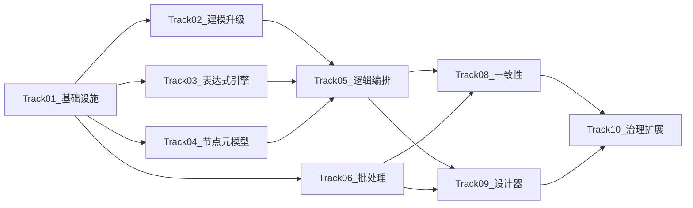

# 后台逻辑处理增强引擎 - 进度跟踪文档编制计划

## 现状分析

基于代码库探索，当前平台已具备的基础能力：

- **动态表/视图**：`Atlas.Domain/DynamicTables/`、`Atlas.Application/DynamicTables/` 已有表/字段/索引/关系/迁移/草稿实体与服务接口（约 11 个服务接口、11 个仓储接口），但**不是独立项目**（是 `Atlas.Domain` 和 `Atlas.Application` 内的命名空间）
- **工作流引擎**：`Atlas.WorkflowCore` + `Atlas.WorkflowCore.DSL` 已具备定义/执行/步骤/Saga/中间件体系
- **表达式引擎**：`CelExpressionEngine`（单文件，仅支持布尔逻辑、字符串方法、基础比较，无 AST/类型推断/集合函数）
- **基础设施**：Outbox（`OutboxPublisher` + `OutboxProcessorHostedService`）、Saga（`SagaOrchestrator`）、SQLite 消息队列（`SqliteMessageQueue`）、Hangfire、OpenTelemetry 基础配置
- **前端**：153 个 .vue 页面，X6 + Vue Flow 双图引擎并存；已有 `DynamicDataWorkbenchPage`、`DynamicTableDesignPage`、`ERDCanvasPage`、`WorkflowDesignerPage` 等页面雏形
- **后端**：19 个 .csproj、137 个 Controller、约 507 个 Infrastructure 服务文件

**关键缺口**（与架构文档对照）：

- 无独立 `LogicFlow` / `BatchProcess` 领域模块
- 无 DAG 执行引擎（WorkflowCore 是审批/状态流，非 DAG 调度器）
- 无批处理引擎（分片/分批/checkpoint/dead letter）
- 表达式引擎能力严重不足（无 AST、无类型系统、无集合/聚合/窗口函数）
- 无统一节点元模型与规范
- 设计器体系碎片化，无统一设计台

## 文档结构设计

进度文档将创建为 [docs/plan-backend-logic-engine-progress.md](docs/plan-backend-logic-engine-progress.md)，按以下结构组织：

### 一、9 条实施轨道（Track）

每条轨道对应架构文档中的一组相关章节，按依赖关系排序：

```
Track-01: 核心基础设施与分层  ← 架构文档 §3, §4
Track-02: 动态建模内核升级    ← 架构文档 §5.1-§5.5
Track-03: 表达式与函数引擎    ← 架构文档 §12
Track-04: 统一节点元模型与规范 ← 架构文档 §10, §11
Track-05: 逻辑编排与执行引擎  ← 架构文档 §4.3, §4.5, §8
Track-06: 批处理引擎          ← 架构文档 §4.6, §14
Track-08: 事务与一致性增强     ← 架构文档 §15
Track-09: 设计器与前端页面     ← 架构文档 §6-§9
Track-10: 可观测/治理/扩展     ← 架构文档 §16-§18
```

> Track-07（库存/单据/财务领域内核）已从计划中移除，不纳入本轮实施。

### 二、Case 拆解原则

每个 case 遵循：

- **最小闭环**：单独可验证，不依赖未完成的同轨道后续 case（除明确标注的前置依赖）
- **前后端分离**：同一功能的后端 case 和前端 case 独立编号
- **三件套完整**：后端 case 必须包含实体/接口/实现 + 契约更新 + .http 测试文件
- **依赖显式标注**：每个 case 标注 `depends_on` 字段
- **状态跟踪**：`待实施` / `进行中` / `已完成` / `已验证`

### 三、Case 编号规则

`T{轨道号}-{序号}-{B/F}` 其中 B=后端, F=前端

例：`T02-03-B` = Track-02 第 3 个后端 case

### 四、各轨道 Case 拆解概要

#### Track-01: 核心基础设施与分层（约 7 个 case）

架构文档要求控制面/运行面/批处理面分层，需要新建项目骨架：

- T01-01-B: 创建 `Atlas.Domain.LogicFlow` 项目骨架，加入 slnx
- T01-02-B: 创建 `Atlas.Application.LogicFlow` 项目骨架，建立层级引用
- T01-03-B: 创建 `Atlas.Infrastructure.LogicFlow` 项目骨架
- T01-04-B: 创建 `Atlas.Domain.BatchProcess` 项目骨架
- T01-05-B: 创建 `Atlas.Application.BatchProcess` 项目骨架
- T01-06-B: 创建 `Atlas.Infrastructure.BatchProcess` 项目骨架
- T01-07-B: 更新 `ServiceCollectionExtensions` 注册新模块

#### Track-02: 动态建模内核升级（约 28 个 case）

当前已有 `DynamicTable`/`DynamicField`/`DynamicRelation`/`DynamicIndex`/`SchemaDraft`/`SchemaChangeTask`，需升级：

- T02-01-B: `DynamicTable` 实体增加 `version`/`compatibilityMode`/`extensionPolicy` 字段
- T02-02-B: `DynamicField` 实体增加 `isComputed`/`computedExprId`/`isStatusField`/`isRowVersionField` 字段
- T02-03-B: 发布快照实体 `SchemaPublishSnapshot` 定义（表+字段+索引+关系的不可变快照）
- T02-04-B: 发布快照仓储与服务接口
- T02-05-B: 发布快照创建命令实现
- T02-06-B: 发布快照查询服务实现
- T02-07-B: 兼容性检查服务接口定义（`ISchemaCompatibilityChecker`）
- T02-08-B: 兼容性检查 - 名称冲突检测实现
- T02-09-B: 兼容性检查 - 类型兼容检测实现
- T02-10-B: 兼容性检查 - 索引/外键影响检测实现
- T02-11-B: 高风险变更预警服务（删表/删字段/缩窄/改主键）
- T02-12-B: DDL 预览服务 - up script 生成
- T02-13-B: DDL 预览服务 - warning list 生成
- T02-14-B: Expand/Migrate/Contract 迁移流程模型定义
- T02-15-B: 迁移流程 - Expand 阶段实现（加新字段/新表/新索引）
- T02-16-B: 迁移流程 - Contract 阶段实现（下线旧字段/旧索引）
- T02-17-B: 依赖图服务接口定义（`IDependencyGraphService`）
- T02-18-B: 依赖图 - 表→视图依赖分析实现
- T02-19-B: 依赖图 - 表→函数依赖分析实现
- T02-20-B: 依赖图 - 表→流程依赖分析实现
- T02-21-B: 计算字段表达式绑定（`computedExprId` → 表达式引擎）
- T02-22-B: 数据库能力矩阵元数据定义（`DatabaseCapabilityMatrix`）
- T02-23-B: 审计字段模板（`created_at`/`updated_at`/`status`/`row_version` 自动注入）
- T02-24-B: 发布快照 Controller + .http 测试文件
- T02-25-B: 兼容性检查 Controller + .http 测试文件
- T02-26-B: DDL 预览 Controller + .http 测试文件
- T02-27-F: 发布快照列表与 diff 前端页面
- T02-28-F: DDL 预览与风险提示前端面板

#### Track-03: 表达式与函数引擎（约 24 个 case）

当前 `CelExpressionEngine` 仅支持布尔逻辑和字符串方法，需全面升级：

- T03-01-B: 表达式类型系统定义（`ExprType` 枚举：Bool/Int/Long/Decimal/String/Date/DateTime/Duration/Json 等）
- T03-02-B: AST 节点模型定义（`ExprAstNode` 层级：Literal/Variable/BinaryOp/UnaryOp/FunctionCall/MemberAccess/Index）
- T03-03-B: CEL 解析器 - 词法分析器（Lexer）
- T03-04-B: CEL 解析器 - 语法分析器（Parser）→ AST
- T03-05-B: AST → JSON 序列化/反序列化
- T03-06-B: 类型推断器（`ITypeInferencer`）- 基础类型推断
- T03-07-B: 类型推断器 - 函数返回类型推断
- T03-08-B: AST 缓存（expression hash → compiled delegate）
- T03-09-B: 内置函数注册表（`IFunctionRegistry`）- 字符串函数
- T03-10-B: 内置函数注册表 - 数值/日期/逻辑函数
- T03-11-B: 内置函数注册表 - 转换函数
- T03-12-B: 集合函数实现（map/filter/reduce/any/all/distinct/flatten）
- T03-13-B: 聚合函数实现（sum/count/avg/min/max）
- T03-14-B: 窗口函数实现（row_number/rank/lag/lead/running_sum）
- T03-15-B: null 传播规则实现（算术 null → null，布尔不把 null 当 false）
- T03-16-B: 函数定义元数据实体（`FunctionDefinition`：functionId/name/category/version/signature/returnType/bodyExpr/bodyAstJson/isPure/pushdownCapability）
- T03-17-B: 函数定义仓储与查询服务
- T03-18-B: 函数定义命令服务（CRUD）
- T03-19-B: 自定义函数 SPI 接口（`ICustomFunction`）
- T03-20-B: 决策表模型定义（条件行×动作列）
- T03-21-B: 规则链执行器（有序 if/else/switch/决策表）
- T03-22-B: 表达式/函数 Controller + .http 测试文件
- T03-23-F: 函数设计页 - Monaco 编辑器集成
- T03-24-F: 函数设计页 - 可视化公式构造器

#### Track-04: 统一节点元模型与规范（约 18 个 case）

当前缺少统一节点规范，需从零建立：

- T04-01-B: 节点元模型实体（`NodeTypeDefinition`：nodeType/category/version/inputPorts/outputPorts/configSchema/inputSchema/outputSchema/executionMode 等全部字段）
- T04-02-B: 端口类型定义（`PortDefinition`：控制/数据/错误/补偿端口）
- T04-03-B: 数据类型定义（标量/对象/集合/DatasetHandle/BatchHandle/LockToken/TxnToken/ApprovalTicket）
- T04-04-B: 节点状态枚举（Idle/Ready/Running/WaitingInput/.../Compensated 共 13 态）
- T04-05-B: 节点配置模型（5 层：基础/输入绑定/输出绑定/高级执行/错误调试）
- T04-06-B: 节点能力声明接口（`INodeCapabilityDeclaration`）
- T04-07-B: 节点注册表服务（`INodeTypeRegistry`）- 注册/查询/分类
- T04-08-B: 触发类节点定义（手动/单据状态/事件/定时/Webhook）
- T04-09-B: 数据读取类节点定义（表读取/视图读取/游标扫描/增量读取）
- T04-10-B: 数据变换类节点定义（filter/map/reduce/group by/join/merge/distinct/sort/derive field/window）
- T04-11-B: 控制流节点定义（if/switch/loop/fork/join barrier/subflow）
- T04-12-B: 事务与可靠性节点定义（transaction/lock/idempotency/retry/compensation/outbox emit）
- T04-13-B: 系统联动节点定义（审批桥接/通知/Webhook/API 调用/队列投递）
- T04-14-B: 节点模板实体（`NodeTemplate`：单节点默认值/配置组封装）
- T04-15-B: 业务模板块实体（`BusinessTemplateBlock`：多节点结构封装）
- T04-16-B: 节点 UI 规范元数据（形状/图标/端口位置/显示元素）
- T04-17-B: 节点注册表 Controller + .http 测试文件
- T04-18-F: 节点面板组件（分类树/搜索/收藏/最近使用）

#### Track-05: 逻辑编排与执行引擎（约 30 个 case）

需新建 DAG 执行引擎，与现有 WorkflowCore 分离：

- T05-01-B: 逻辑流程定义实体（`LogicFlowDefinition`：flowId/flowKey/category/triggerDefinition/inputSchema/outputSchema/nodeDefs/edgeDefs 等）
- T05-02-B: 边定义实体（`FlowEdgeDefinition`：sourceNodeId/sourcePortId/targetNodeId/targetPortId/edgeType/condition）
- T05-03-B: 绑定定义模型（field mapping/expression mapping/static value/dataset handle binding）
- T05-04-B: 逻辑流程仓储与查询服务接口
- T05-05-B: 逻辑流程命令服务接口（创建/更新/删除/复制）
- T05-06-B: 逻辑流程仓储实现
- T05-07-B: 逻辑流程命令服务实现
- T05-08-B: 逻辑图校验器（`IFlowValidator`）- 连通性/循环检测/端口类型匹配
- T05-09-B: 逻辑计划编译器（`IFlowCompiler`）- 设计图 → DAG 物理计划
- T05-10-B: DAG 物理计划模型（`PhysicalDagPlan`：节点列表/依赖矩阵/事务阶段/并行组）
- T05-11-B: DAG 调度器（`IDagScheduler`）- 节点就绪判定/拓扑排序
- T05-12-B: 节点执行器基类（`INodeExecutor`）- 通用执行协议
- T05-13-B: 执行实例实体（`FlowExecution`：executionId/flowId/flowVersion/status/startAt/endAt/triggerSource/inputSnapshot/traceId）
- T05-14-B: 节点运行记录实体（`NodeRun`：nodeRunId/executionId/nodeId/status/startAt/endAt/retryCount/inputSummary/outputSummary 等）
- T05-15-B: 执行上下文（`IExecutionContext`）- 标量/对象/集合/句柄存取
- T05-16-B: 执行状态推进服务（`IExecutionStateService`）
- T05-17-B: 重试策略实现（指数退避/固定间隔/自定义）
- T05-18-B: 超时策略实现（节点级/流程级超时）
- T05-19-B: 错误分支路由实现（错误端口 → 错误处理子图）
- T05-20-B: 补偿图执行器（已完成节点逆序触发补偿方法）
- T05-21-B: 并行分支执行与 barrier 同步
- T05-22-B: 子流程调用执行器
- T05-23-B: 条件节点执行器（if/switch 与表达式引擎集成）
- T05-24-B: 循环节点执行器（foreach/while）
- T05-25-B: 发布快照绑定（运行态只执行 Published 快照，不读草稿）
- T05-26-B: 执行引擎 Controller（手动触发/查询状态/重试/取消）+ .http 测试文件
- T05-27-B: 执行记录查询 Controller + .http 测试文件
- T05-28-F: 后台逻辑设计器 - X6 画布基础骨架
- T05-29-F: 后台逻辑设计器 - 节点拖拽与连线
- T05-30-F: 后台逻辑设计器 - 右侧属性面板

#### Track-06: 批处理引擎（约 22 个 case）

当前无独立批处理引擎，需从零构建：

- T06-01-B: 批处理任务定义实体（`BatchJobDefinition`：jobId/jobKey/sourceConfig/shardConfig/batchConfig/concurrencyConfig/checkpointConfig/retryConfig/deadLetterConfig）
- T06-02-B: 批处理执行实例实体（`BatchJobExecution`：executionId/jobId/status/startAt/endAt/totalShards/completedShards/failedShards）
- T06-03-B: 分片执行实体（`ShardExecution`：shardId/executionId/shardKey/status/checkpoint/rowsRead/rowsWritten/errorCount）
- T06-04-B: 批次执行实体（`BatchExecution`：batchId/shardId/batchSeq/status/rowCount/startAt/endAt）
- T06-05-B: 死信实体（`BatchDeadLetter`：deadLetterId/executionId/shardId/batchSeq/rowKey/errorCategory/errorMessage/rawData）
- T06-06-B: Checkpoint 实体（`BatchCheckpoint`：checkpointId/shardId/lastProcessedKey/watermark/savedAt）
- T06-07-B: 批处理仓储接口与实现
- T06-08-B: Keyset 分页扫描器（`IKeysetScanner`）
- T06-09-B: 主键范围分片器（`IPrimaryKeyRangeSharder`）
- T06-10-B: 时间窗口分片器（`ITimeWindowSharder`）
- T06-11-B: 批次切分器（`IBatchSplitter`：按 batchSize 切分结果集）
- T06-12-B: Worker 池管理（`IWorkerPool`：CPU 池/IO 池/高风险串行池）
- T06-13-B: Checkpoint 持久化服务
- T06-14-B: 死信写入与查询服务
- T06-15-B: 分片级恢复（从 checkpoint 恢复执行）
- T06-16-B: 批次级重试（失败批次重跑）
- T06-17-B: Backpressure 机制（Worker 压力感知/自适应 batchSize）
- T06-18-B: 批处理任务 Controller + .http 测试文件
- T06-19-B: 死信管理 Controller + .http 测试文件
- T06-20-F: 批处理设计器页 - 扫描/分片/批次配置
- T06-21-F: 批处理监控页 - shard 进度/积压
- T06-22-F: 死信查看与人工重试页面

#### Track-08: 事务与一致性增强（约 11 个 case）

在现有 Outbox/Saga 基础上增强：

- T08-01-B: Inbox 去重服务（`IInboxService`：消费端幂等）
- T08-02-B: 节点级幂等（`idempotencyKeyExpr` + 执行表幂等结果记录）
- T08-03-B: 批次幂等键（jobExecutionId+shardId+batchSeq+sinkNode）
- T08-04-B: 错误分类枚举（可重试/不可重试/配置错误/并发冲突/脏数据/外部依赖/业务校验）
- T08-05-B: 错误处理策略路由（按分类选择重试/dead letter/熔断/降级/直接失败）
- T08-06-B: Outbox 与本地事务同提交保障增强
- T08-07-B: 补偿框架增强（逆向业务动作注册与执行）
- T08-08-B: 对账任务框架（定时对比源与目标一致性）
- T08-09-B: 并发冲突检测与自动重试
- T08-10-B: 熔断器实现（外部依赖调用熔断）
- T08-11-B: 限流器实现（按 tenant/app/job/nodeType/datasource 限流）

#### Track-09: 设计器与前端页面体系（约 26 个 case）

在已有前端基础上构建统一设计台：

- T09-01-F: 统一设计台壳页面（`BackendCapabilityStudio`）+ 六大工作区导航
- T09-02-F: 后台逻辑设计器 - 顶部工具栏（保存/校验/调试/发布/运行/视图切换）
- T09-03-F: 后台逻辑设计器 - 左侧节点面板（节点分类树+搜索+收藏）
- T09-04-F: 后台逻辑设计器 - 左侧数据对象面板（表/视图/函数/子流程引用）
- T09-05-F: 后台逻辑设计器 - 中间画布（X6 统一图引擎，事务边界/stage box 容器）
- T09-06-F: 后台逻辑设计器 - 右侧属性面板（输入绑定/输出绑定/表达式/重试/超时/幂等/锁/事务/错误处理）
- T09-07-F: 后台逻辑设计器 - 底部调试/日志/数据预览面板
- T09-08-F: 后台逻辑设计器 - 连线类型区分（控制流实线/数据流粗实线/错误流红色虚线/补偿流橙色反向虚线）
- T09-09-F: 后台逻辑设计器 - 结构树视图
- T09-10-F: 后台逻辑设计器 - 调试视图
- T09-11-F: 后台逻辑设计器 - 版本 diff 视图
- T09-12-F: 动态表设计页升级 - 发布快照/版本/diff 区
- T09-13-F: 动态表设计页升级 - 迁移预览区（up script/风险提示/兼容性检查）
- T09-14-F: 动态表设计页升级 - 影响分析区（受影响视图/函数/流程/模板）
- T09-15-F: 视图设计页 - 来源表选择 + join 配置
- T09-16-F: 视图设计页 - 字段投影 + 条件 + 聚合
- T09-17-F: 视图设计页 - SQL/逻辑预览 + 数据预览
- T09-18-F: 执行监控页 - 概览卡片（今日执行/成功率/失败率/重试率/运行中/积压）
- T09-19-F: 执行监控页 - 执行列表（筛选/状态/操作）
- T09-20-F: 执行监控页 - 手动介入入口（重试/取消/跳过/补偿/重新调度）
- T09-21-F: 执行详情页 - 节点运行树/DAG 状态高亮
- T09-22-F: 执行详情页 - 上下文变量区 + 中间结果区
- T09-23-F: 执行详情页 - 日志/错误/补偿/重试区
- T09-24-F: 页面间跳转联动（设计器↔建模↔视图↔函数↔执行详情）
- T09-25-F: 用户分层模式切换（基础/高级/模板/专家模式）
- T09-26-F: 路由注册（`/apps/:appId/backend/...` 全部路由）

#### Track-10: 可观测/治理/扩展（约 16 个 case）

- T10-01-B: 执行日志结构化写入（executionId/nodeRunId/traceId/spanId 等全字段）
- T10-02-B: 节点指标收集（成功率/失败率/重试率/平均耗时/P95/P99）
- T10-03-B: Trace 体系增强（execution=trace, nodeRun=span, batch shard=子 span）
- T10-04-B: 配额管理服务（并发限额/资源配额/节点超时配置）
- T10-05-B: 灰度发布服务（按 tenant/app 控制流程版本灰度）
- T10-06-B: 版本冻结与回滚服务
- T10-07-B: 治理 Controller + .http 测试文件
- T10-08-B: 自定义节点 SPI 接口（输入输出 schema/运行方法/补偿方法/能力声明）
- T10-09-B: 自定义函数 SPI 接口
- T10-10-B: 自定义数据源方言 SPI 接口
- T10-11-B: 自定义业务模板 SPI 接口
- T10-12-B: .NET SDK 骨架（节点扩展/函数扩展/模板扩展）
- T10-13-B: 插件注册与发现服务
- T10-14-B: 扩展 Controller + .http 测试文件
- T10-15-F: 资源治理页（配额/限流/熔断/超时管理）
- T10-16-F: 插件管理页（注册/测试/版本/能力声明）

### 五、实施依赖图




### 六、文档交付件

创建文件 [docs/plan-backend-logic-engine-progress.md](docs/plan-backend-logic-engine-progress.md)，内容包含：

1. 架构文档章节→Track→Case 的完整映射表
2. 每个 case 的结构化定义（ID/标题/描述/依赖/涉及文件/验证标准/状态）
3. 9 条轨道的依赖关系图
4. 全局进度统计（总 case 数 / 已完成 / 进行中 / 待实施）
5. contracts.md 契约同步更新追踪列

