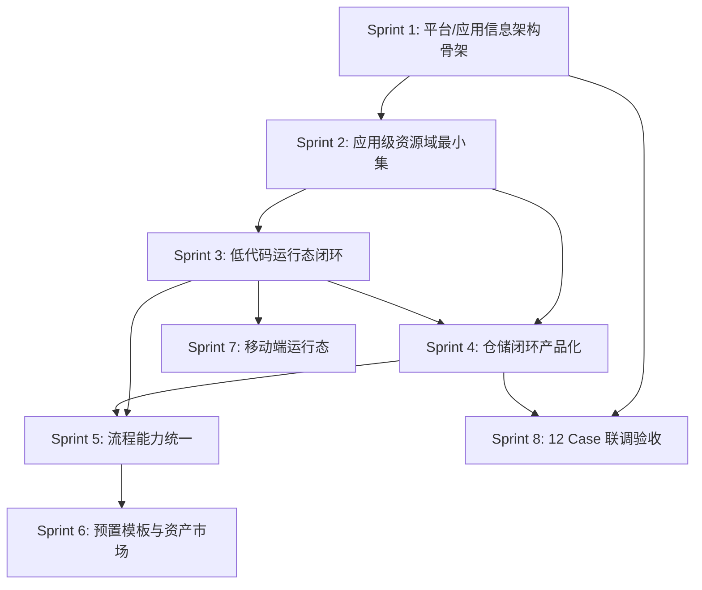

# Atlas Security Platform 完整改进路线图

## 当前基线

代码库在 `master` 上的实际状态（PR #57 已被 PR #58 整体 revert）：

- **前端**：62 个页面，仅 1 个布局（`MainLayout`），无 `ConsoleLayout` / `AppWorkspaceLayout`；动态路由 fallback 映射覆盖 `/settings/`*、`/approval/`*、`/workflow/*` 等路径，登录后默认落点不是平台控制台
- **后端**：60+ 控制器，`DynamicTablesController` 和 `DynamicTableRecordsController` 所有接口均为 `SystemAdmin` 权限；`WorkflowController` 暴露 If/While/Foreach/Decide 等 step-types，但前端序列化器强制限制"仅顺序链路"
- **LowCodeApp 实体**：仅有 AppKey/Name/Description/Category/Icon/Version/Status/ConfigJson，缺少 DataSourceId、UseShared*、别名等字段（已被 revert）
- **模板**：`ComponentTemplate` 实体已有 IsBuiltIn/Category(Form/Page/Flow/Grid)，后端 API 可用，但前端无管理页面
- **12 个 PRD Case**：规格文档全部完成，但后端/前端/验收栏均未勾选（Case 01 后端已完成）
- **已有规划文档**：`plan-平台控制台与应用数据源.md` 有详细的三段路由、数据模型、API 设计，可作为 Sprint 1 的直接输入

## 整体依赖关系

---

## Sprint 1: 恢复平台/应用信息架构骨架 (P0)

**目标**：建立"平台控制台 + 应用工作台"的两层布局与路由骨架，使所有后续模块有明确的组织落点。

**核心策略**：采用"渐进式灰度"，保留旧 `/settings/`* 入口不破坏现有功能，新增 `/console` 路由并允许切换，避免重蹈 PR #57 一次性大改被 revert 的覆辙。

**输入文档**：[plan-平台控制台与应用数据源.md](docs/plan-平台控制台与应用数据源.md) 第三章"信息架构与路由"

### 后端任务

- **S1-B1**: `AppConfig` 实体已存在于 `Atlas.Domain/Identity/Entities/AppConfig.cs`（含 AppId/Name/Description/IsActive/EnableProjectScope），检查其是否可复用为"应用控制台"入口实体，若不足则在 `LowCodeApp` 上扩展路由元信息字段
- **S1-B2**: 在 `AppsController`（`api/v1/apps`）补充"应用卡片列表"接口（返回 AppKey/Name/Icon/Category/Status），供平台控制台 `/console` 页面使用
- **S1-B3**: 在 `MenusController` 或新增菜单种子数据中，预置 `/console`、`/console/apps`、`/console/datasources`、`/console/settings/`* 的菜单项

### 前端任务

- **S1-F1**: 新建 `ConsoleLayout.vue`（纯顶部导航，无侧边栏），参照 [plan-平台控制台与应用数据源.md](docs/plan-平台控制台与应用数据源.md) 3.2 节
- **S1-F2**: 新建 `AppWorkspaceLayout.vue`（左侧边栏 + 顶部栏），与现有 `MainLayout.vue` 结构类似但增加 App 上下文
- **S1-F3**: 在 [router/index.ts](src/frontend/Atlas.WebApp/src/router/index.ts) 中新增静态路由：`/console` 使用 `ConsoleLayout`，`/apps/:appId` 使用 `AppWorkspaceLayout`，保留 `/settings/`* 使用 `MainLayout`
- **S1-F4**: 新建 `ConsolePage.vue`（平台首页，应用卡片网格 + 快捷入口），迁移现有 `lowcode/AppListPage.vue` 的应用列表能力
- **S1-F5**: 修改登录后默认跳转目标：从当前落点改为 `/console`
- **S1-F6**: 更新 [dynamic-router.ts](src/frontend/Atlas.WebApp/src/utils/dynamic-router.ts) 的 `pathComponentFallbackMap`，增加 `/console/`* 和 `/apps/:appId/`* 映射

### 验收标准

- 登录后进入 `/console`（纯顶部导航），可看到应用卡片列表
- 点击应用卡片进入 `/apps/:appId`（左侧边栏布局）
- 原有 `/settings/*` 路由和页面功能不受影响
- `dotnet build` 零错误零警告，`npm run build` 通过

---

## Sprint 2: 应用级资源域最小集 (P0)

**目标**：在 Sprint 1 骨架上，补齐"应用级数据源绑定"和"应用级权限映射"的最小数据模型与 API。

**核心策略**：先做"应用引用租户数据源"（降低复杂度，不引入多驱动 NuGet 包），后续再扩展多驱动支持。

**输入文档**：[plan-平台控制台与应用数据源.md](docs/plan-平台控制台与应用数据源.md) 第四、五、六章

### 后端任务

- **S2-B1**: 扩展 `LowCodeApp` 实体，增加 `DataSourceId`（long?, 构造函数设置不可变）、`UseSharedUsers`/`UseSharedRoles`/`UseSharedDepartments`（bool, 默认 true）
- **S2-B2**: 扩展 `TenantDataSource` 实体，增加 `AppId`（long?, null=平台级）、`MaxPoolSize`、`ConnectionTimeoutSeconds`、`LastTestSuccess`、`LastTestedAt`
- **S2-B3**: 新增 `AppEntityAlias` 实体（AppId + EntityType + SingularAlias + PluralAlias）
- **S2-B4**: 在 `AppsController` 实现应用创建向导 API（三步：基本信息 -> 数据源绑定 -> 共享策略与别名），更新 DTO 确保 `PUT` 不含 `DataSourceId`/`AppKey`
- **S2-B5**: 新增应用设置 API：`GET/PUT /api/v1/apps/{id}/sharing-policy`、`GET/PUT /api/v1/apps/{id}/entity-aliases`、`GET /api/v1/apps/{id}/datasource`、`POST /api/v1/apps/{id}/datasource/test`
- **S2-B6**: 引入 `X-App-Id` 请求头中间件（`appsettings.json` 的 `App.HeaderName` 已配置为 `X-App-Id`），在 AppContext 中提供当前 App scope

### 前端任务

- **S2-F1**: 实现应用创建三步向导组件（基本信息 -> 数据源选择 -> 共享策略与别名），嵌入 `/console/apps` 的"新建应用"流程
- **S2-F2**: 实现应用设置页面（`/apps/:appId/settings`）：数据源只读+测试、共享策略可修改、实体别名可修改
- **S2-F3**: `AppWorkspaceLayout.vue` 中根据 `:appId` 路由参数自动设置 `X-App-Id` 请求头

### 验收标准

- 可通过三步向导创建应用并绑定数据源，数据源创建后不可更改
- 应用设置页可查看数据源（只读）、修改共享策略和实体别名
- `X-App-Id` 在应用工作台内自动携带

---

## Sprint 3: 低代码运行态闭环 (P0/P1)

**目标**：实现"按 appKey + pageKey 渲染已发布页面"的运行态，使"发布"语义真正可用，业务用户可通过应用入口访问页面并产生数据。

**输入文档**：[docs/lowcode/page-runtime.md](docs/lowcode/page-runtime.md) 规划

### 后端任务

- **S3-B1**: 新增 `PageRuntimeController`（`api/v1/apps/{appKey}/pages/{pageKey}`），按 appKey + pageKey 查询已发布版本的 schema 并返回
- **S3-B2**: 实现 `FormData` 持久化（或明确"表单提交 -> 动态表写入"的映射策略）：在 `DynamicTableRecordsController` 基础上增加"按表单 schema 自动映射字段"的能力
- **S3-B3**: 在 `LowCodePageCommandService` 中实现"发布"语义：发布时创建 `LowCodePageVersion` 快照，运行态从 Version 表读取而非 Page 主表

### 前端任务

- **S3-F1**: 新建 `PageRuntimeRenderer.vue`（通用运行态渲染器），接收 appKey + pageKey 参数，调用运行态 API 获取 schema 并用 AMIS Renderer 渲染
- **S3-F2**: 在 `AppWorkspaceLayout` 中注册运行态路由：`/apps/:appId/run/:pageKey`
- **S3-F3**: 应用内页面列表增加"预览/运行"入口，跳转到运行态路由

### 验收标准

- 低代码应用发布后，可通过 `/apps/:appId/run/:pageKey` 访问已发布页面
- 业务用户在运行态页面可提交表单数据，数据持久化到动态表

---

## Sprint 4: 仓储闭环产品化 (P0/P1)

**目标**：将动态表 + 审批闭环从"系统管理员工具"演进为"应用能力"，权限域从 SystemAdmin 收敛到应用角色。

### 后端任务

- **S4-B1**: 权限域重构 -- 在 `DynamicTablesController` 和 `DynamicTableRecordsController` 上引入分层权限策略：
  - 平台管理员（`SystemAdmin`）：管理动态表结构
  - 应用管理员（新增 `AppAdmin` 策略）：在 App 域内配置数据表与审批绑定
  - 业务用户（新增 `AppUser` 策略）：对授权数据执行 CRUD / 提交审批 / 查看状态
- **S4-B2**: 动态表增加 `AppId` 字段，实现应用域隔离（动态表归属到特定应用）
- **S4-B3**: 审批运行态补齐任务中心 API（当前已有 `ApprovalTasksController`、`ApprovalInboxPage` 等页面，检查是否缺少"按应用过滤任务"的能力）
- **S4-B4**: 写回失败补偿增强：从监控页扩展为"告警 + 重试策略 + 死信归档"（扩展 `ApprovalWritebackFailuresController`）

### 前端任务

- **S4-F1**: 动态表管理页和 CRUD 页增加"应用筛选器"，非 SystemAdmin 用户只能看到所属应用的动态表
- **S4-F2**: 审批任务中心页面增加"按应用过滤"功能
- **S4-F3**: 写回失败监控页（`WritebackMonitorPage.vue`）增加重试操作按钮和告警配置入口

### 验收标准

- 业务用户（非 SystemAdmin）可在应用内访问动态表数据、提交审批
- 动态表数据按应用隔离，不同应用的数据互不可见
- 写回失败支持手动重试和告警通知

---

## Sprint 5: 流程能力统一 (P1)

**目标**：明确审批流与工作流的边界，解决"前后端契约不一致"问题，实现最小集的组合能力。

**核心策略**：采用报告建议的"明确边界 + 最小集衔接"方案，即：

- 审批流 = 人机协作的业务流程（任务/抄送/审批记录）
- 工作流 = 系统编排（事件/延迟/重试/补偿）
- 衔接最小集 = 工作流可触发审批并等待审批结果事件

### 后端任务

- **S5-B1**: 工作流引擎扩展 -- 新增 `ApprovalStep` 类型（在 `WorkflowController` 的 step-types 中注册），该步骤可指定审批流定义 ID，启动审批实例并通过 `WaitFor` 事件等待审批结果
- **S5-B2**: 审批完成时发布工作流事件 -- 在 `ApprovalEventPublisher` 中，审批实例完成/拒绝时发布 `ApprovalCompleted`/`ApprovalRejected` 事件到工作流引擎
- **S5-B3**: 在 `api/v1/workflows/step-types` 返回中增加 `ApprovalStep`，并明确哪些 step-types 当前"已实现"vs"规划中"（在返回数据中增加 `supported: true/false` 标记）

### 前端任务

- **S5-F1**: 工作流序列化器（[useWorkflowSerializer.ts](src/frontend/Atlas.WebApp/src/composables/useWorkflowSerializer.ts)）放宽限制：至少支持"顺序 + 条件分支（If）"，并对不支持的 step-type 在设计器中标记为"规划中"
- **S5-F2**: 工作流设计器节点面板中，增加"审批步骤"节点（ApprovalStep），配置时可选择已发布的审批流定义
- **S5-F3**: 流程实例详情页统一展示"工作流步骤 + 审批进度"的组合视图

### 验收标准

- 工作流设计器可拖入"审批步骤"节点并关联审批流定义
- 工作流实例运行时，到达审批步骤会自动创建审批实例，审批完成后工作流继续
- 不支持的 step-type 在设计器中有明确标识，不会出现"能画不能跑"的情况

---

## Sprint 6: 预置模板与资产市场 (P1)

**目标**：将模板系统从"基础 API"演进为"可视化选用 + 内置模板投放"的产品化闭环。

### 后端任务

- **S6-B1**: 补充模板种子数据服务（`TemplateSeedDataService`），在数据库初始化时投放内置模板（动态表 CRUD 模板、常用表单模板、审批流模板、仪表盘模板），设置 `IsBuiltIn = true`
- **S6-B2**: 在 `TemplatesController` 增加"按 Category 和 Tags 筛选"、"版本列表"接口
- **S6-B3**: 模板与低代码对象关联：在"创建应用/页面/表单/审批流"时增加"从模板创建"选项，后端实现"模板实例化"逻辑（深拷贝 SchemaJson 并替换 ID）

### 前端任务

- **S6-F1**: 新建 `TemplateMarketPage.vue`（模板市场页面），展示内置模板和用户模板，按分类/标签筛选，支持搜索
- **S6-F2**: 在应用/页面/表单/审批流创建流程中增加"从模板创建"入口
- **S6-F3**: 支持"保存为模板"功能（将当前设计另存为用户模板）

### 验收标准

- 系统初始化后内置模板可用
- 用户可从模板市场选用模板快速创建应用/页面/表单
- 用户可将自己的设计保存为模板复用

---

## Sprint 7: 移动端运行态 (P2)

**目标**：实现移动端运行态闭环（填表/审批/查看），设计态保持仅 PC。

### 任务

- **S7-1**: 在 AMIS Renderer 配置中增加移动端适配（利用现有 `deviceMode=mobile` 预览能力），确保运行态页面在移动端浏览器可正常渲染
- **S7-2**: 审批处理移动端优化：审批任务列表、审批详情、同意/拒绝操作的移动端适配布局
- **S7-3**: 消息推送与审批通知：审批待办通过通知推送到移动端，点击通知跳转到审批处理页

### 验收标准

- 移动端浏览器可访问运行态页面并提交表单
- 移动端可查看审批待办并完成审批操作

---

## Sprint 8: 12 Case 联调验收 (贯穿)

**目标**：按 [plan-功能补齐总览.md](docs/plan-功能补齐总览.md) 的 12 个 Case 逐一完成联调验收。

当前状态：12 个 Case 规格文档全部完成（`[x]`），但后端/前端/验收均未完成。建议与上述 Sprint 并行推进：

- **Phase 1-2 基础管理**（字典/参数/登录日志/验证码/记住我/在线用户/XSS）：可与 Sprint 1 并行
- **Phase 3 通知与文件**（通知公告/文件上传/Excel 导入导出）：可与 Sprint 2 并行
- **Phase 4 监控与高级安全**（服务监控/定时任务/数据脱敏/数据权限）：可与 Sprint 3 并行
- **Phase 5 高级能力**（多数据源/国际化）：可与 Sprint 4-5 并行

---

## 风险管控措施

- **渐进式灰度**：Sprint 1 保留旧入口，新增 `/console` 并允许切换，待功能齐备再切换默认落点，避免 PR #57 式大改回退
- **PR 拆分**：每个 Sprint 内的任务按 S*-B*/S*-F* 编号独立提 PR，保持可回滚但不破坏主干
- **契约优先**：每个 Sprint 开始前先更新 [docs/contracts.md](docs/contracts.md) 中的 API 契约，前后端同步开发
- **发布前校验门禁**：对流程类能力（Sprint 5），在设计器"发布/保存"时强制调用后端 validate 接口，不支持的结构 fail fast
- **CI 同步维护**：每个 Sprint 的 PR 必须同步更新 `.http` 测试文件和 e2e 路由覆盖

## 工作量参考（粗估）

| Sprint               | 估算人日         | 优先级   |
| -------------------- | ------------ | ----- |
| Sprint 1: 平台/应用信息架构  | 20-35        | P0    |
| Sprint 2: 应用级资源域     | 25-45        | P0    |
| Sprint 3: 低代码运行态     | 45-80        | P0/P1 |
| Sprint 4: 仓储闭环产品化    | 30-60        | P0/P1 |
| Sprint 5: 流程能力统一     | 40-70        | P1    |
| Sprint 6: 预置模板与资产市场  | 25-60        | P1    |
| Sprint 7: 移动端运行态     | 20-40        | P2    |
| Sprint 8: 12 Case 联调 | 与各 Sprint 并行 | 贯穿    |

