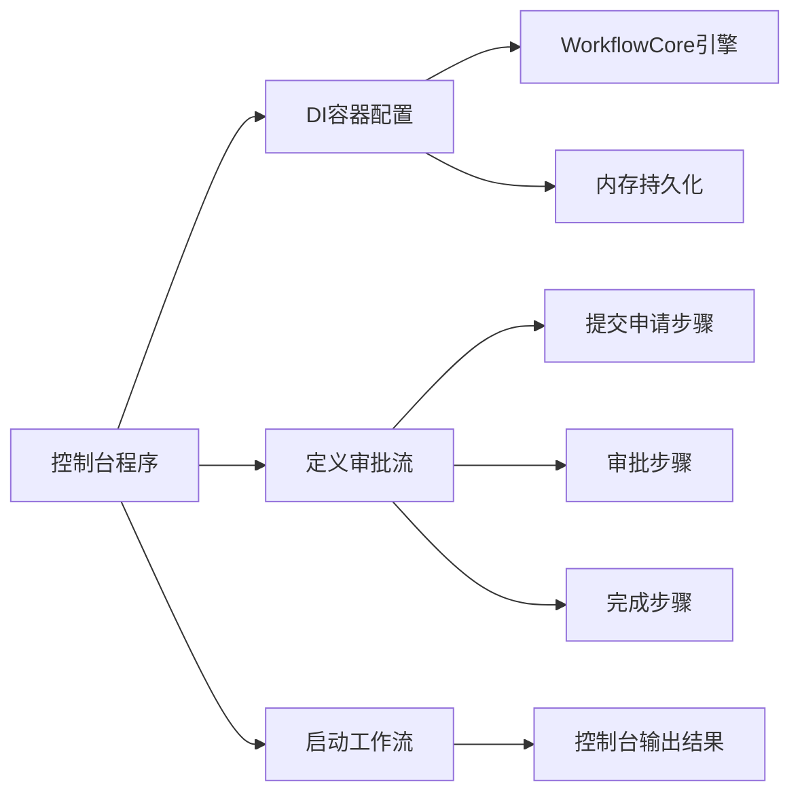

# 审批流Demo控制台程序实现计划

## 架构概述

创建一个独立的控制台程序来演示Atlas.WorkflowCore工作流引擎的审批流功能。程序将包含一个完整的审批流程（提交申请 → 审批 → 完成），使用硬编码的数据，并在控制台输出每个步骤的执行结果。



## 实现步骤

### 1. 创建项目结构

在`demo`目录下创建控制台项目：

- **目录**: `demo/Atlas.WorkflowDemo/`
- **项目文件**: `Atlas.WorkflowDemo.csproj`
  - 目标框架: `net10.0`
  - 项目引用:
    - `../../src/backend/Atlas.WorkflowCore/Atlas.WorkflowCore.csproj`
    - `../../src/backend/Atlas.Core/Atlas.Core.csproj`
  - NuGet包:
    - `Microsoft.Extensions.DependencyInjection` (10.0.0)
    - `Microsoft.Extensions.Logging.Console` (10.0.0)
    - `Microsoft.Extensions.Hosting` (10.0.0)

### 2. 实现工作流步骤

创建三个审批流步骤类，继承自[`StepBody`](d:\Code\SecurityPlatform\src\backend\Atlas.WorkflowCore\Primitives\StepBody.cs):

**SubmitApplicationStep.cs** - 提交申请步骤

```csharp
public class SubmitApplicationStep : StepBody
{
    public override ExecutionResult Run(IStepExecutionContext context)
    {
        var data = (ApprovalWorkflowData)context.Workflow.Data;
        Console.WriteLine($"[步骤1] 提交申请: {data.ApplicationTitle}");
        Console.WriteLine($"  申请人: {data.Applicant}");
        Console.WriteLine($"  申请时间: {DateTime.Now}");
        return ExecutionResult.Next();
    }
}
```

**ApprovalStep.cs** - 审批步骤

```csharp
public class ApprovalStep : StepBody
{
    public override ExecutionResult Run(IStepExecutionContext context)
    {
        var data = (ApprovalWorkflowData)context.Workflow.Data;
        data.Approved = true;
        data.Approver = "审批人001";
        Console.WriteLine($"[步骤2] 审批通过");
        Console.WriteLine($"  审批人: {data.Approver}");
        return ExecutionResult.Next();
    }
}
```

**CompleteStep.cs** - 完成步骤

```csharp
public class CompleteStep : StepBody
{
    public override ExecutionResult Run(IStepExecutionContext context)
    {
        var data = (ApprovalWorkflowData)context.Workflow.Data;
        Console.WriteLine($"[步骤3] 流程完成");
        Console.WriteLine($"  结果: {(data.Approved ? "已批准" : "已拒绝")}");
        return ExecutionResult.Next();
    }
}
```

### 3. 定义工作流数据模型

**ApprovalWorkflowData.cs**

```csharp
public class ApprovalWorkflowData
{
    public string ApplicationTitle { get; set; } = string.Empty;
    public string Applicant { get; set; } = string.Empty;
    public bool Approved { get; set; }
    public string Approver { get; set; } = string.Empty;
}
```

### 4. 定义工作流

创建实现[`IWorkflow<TData>`](d:\Code\SecurityPlatform\src\backend\Atlas.WorkflowCore\Abstractions\IWorkflow.cs)接口的审批流定义：

**SimpleApprovalWorkflow.cs**

```csharp
public class SimpleApprovalWorkflow : IWorkflow<ApprovalWorkflowData>
{
    public string Id => "simple-approval";
    public int Version => 1;

    public void Build(IWorkflowBuilder<ApprovalWorkflowData> builder)
    {
        builder
            .StartWith<SubmitApplicationStep>()
            .Then<ApprovalStep>()
            .Then<CompleteStep>();
    }
}
```

### 5. 实现内存持久化提供者

由于Demo不需要数据库，创建一个简化的内存持久化实现：

**InMemoryPersistenceProvider.cs** - 实现[`IPersistenceProvider`](d:\Code\SecurityPlatform\src\backend\Atlas.WorkflowCore\Abstractions\Persistence\IPersistenceProvider.cs)

使用`Dictionary`和`List`在内存中存储：

- 工作流实例
- 执行指针
- 事件和订阅

关键实现：

```csharp
public class InMemoryPersistenceProvider : IPersistenceProvider
{
    private readonly Dictionary<string, WorkflowInstance> _workflows = new();
    private readonly List<EventSubscription> _subscriptions = new();
    private readonly Dictionary<string, Event> _events = new();
    
    public Task<string> CreateWorkflowAsync(WorkflowInstance workflow, ...)
    {
        _workflows[workflow.Id] = workflow;
        return Task.FromResult(workflow.Id);
    }
    
    // 实现其他必需的接口方法...
}
```

### 6. 配置依赖注入和主程序

**Program.cs**

```csharp
var services = new ServiceCollection();

// 添加日志
services.AddLogging(builder => builder.AddConsole());

// 添加WorkflowCore核心服务
services.AddWorkflowCore();

// 注册内存持久化提供者
services.AddSingleton<IPersistenceProvider, InMemoryPersistenceProvider>();

// 注册租户提供者（Demo用固定租户）
services.AddSingleton<ITenantProvider, DemoTenantProvider>();

var provider = services.BuildServiceProvider();
var host = provider.GetRequiredService<IWorkflowHost>();

// 启动工作流宿主
await host.StartAsync();

// 注册工作流定义
host.RegisterWorkflow<SimpleApprovalWorkflow, ApprovalWorkflowData>();

// 启动工作流实例
var data = new ApprovalWorkflowData
{
    ApplicationTitle = "采购申请-办公设备",
    Applicant = "张三"
};

var instanceId = await host.StartWorkflowAsync("simple-approval", data);
Console.WriteLine($"工作流已启动，实例ID: {instanceId}");

// 等待工作流完成
await Task.Delay(3000);

// 停止工作流宿主
await host.StopAsync();
```

### 7. 创建辅助类

**DemoTenantProvider.cs** - 提供固定的租户ID

```csharp
public class DemoTenantProvider : ITenantProvider
{
    public Guid GetTenantId() => Guid.Empty; // Demo使用空GUID
}
```

## 项目文件结构

```
demo/
└── Atlas.WorkflowDemo/
    ├── Atlas.WorkflowDemo.csproj
    ├── Program.cs
    ├── Models/
    │   └── ApprovalWorkflowData.cs
    ├── Steps/
    │   ├── SubmitApplicationStep.cs
    │   ├── ApprovalStep.cs
    │   └── CompleteStep.cs
    ├── Workflows/
    │   └── SimpleApprovalWorkflow.cs
    └── Infrastructure/
        ├── InMemoryPersistenceProvider.cs
        └── DemoTenantProvider.cs
```

## 运行命令

```bash
# 进入demo目录
cd demo/Atlas.WorkflowDemo

# 运行程序
dotnet run
```

## 预期输出

```
工作流已启动，实例ID: 1234567890
[步骤1] 提交申请: 采购申请-办公设备
  申请人: 张三
  申请时间: 2026-01-29 10:30:00
[步骤2] 审批通过
  审批人: 审批人001
[步骤3] 流程完成
  结果: 已批准
```

## 关键技术点

1. **WorkflowCore引擎**: 使用[`Atlas.WorkflowCore`](d:\Code\SecurityPlatform\src\backend\Atlas.WorkflowCore)模块提供的工作流引擎
2. **依赖注入**: 通过[`AddWorkflowCore()`](d:\Code\SecurityPlatform\src\backend\Atlas.WorkflowCore\ServiceCollectionExtensions.cs:19)注册所有核心服务
3. **工作流定义**: 使用Fluent API构建工作流（StartWith → Then → Then）
4. **步骤执行**: 每个步骤继承`StepBody`并实现`Run`方法
5. **内存持久化**: 避免数据库依赖，使用内存实现演示

## 注意事项

- InMemoryPersistenceProvider需要实现IPersistenceProvider的所有方法（约20+个方法）
- 工作流执行是异步的，需要适当延迟等待执行完成
- Demo程序不需要多租户隔离，使用固定租户ID
- 可以通过监听生命周期事件（ILifeCycleEventPublisher）获取工作流状态变化