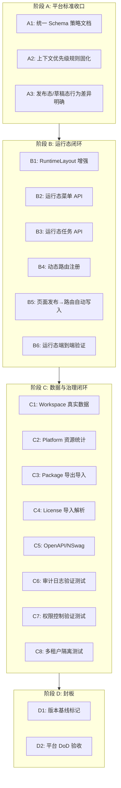

# 平台封板闭环实施计划

## 现状总结（差距分析）

通过对代码库的全面探查，与文档所述的 6 大封板维度对照，实际情况如下：

### 已完成（不需要再做）

- **CEL 表达式引擎**：`CelExpressionEngine` 已实现，支持 `form.`*, `record.`*, `user.*` 等变量，已用于审批条件评估
- **AMIS 统一 Schema**：前端以 AMIS 为主设计器，vform3 仅在审批域兼容保留
- **PageRuntimeController**：Schema 获取、记录创建/更新均已实现
- **PageRuntimeRenderer.vue**：AMIS 渲染 + 表单 API 自动注入已实现
- **DynamicRecordCommandService**：CRUD + 字段权限校验已完整
- **DynamicTable 全栈**：表定义、字段、索引、关系、迁移、字段权限、审批绑定均已实现
- **审批全生命周期**：设计器、流程引擎、任务、代理人、抄送、回写等已完整
- **Console/AppWorkspace 布局**：控制台和应用工作台布局已完整
- **低代码应用 CRUD**：前后端完整（含版本、环境、导入导出）

### 需要完成的关键缺口

---

## 阶段 A：平台标准收口（3 个 case）

> 本阶段代码层面已基本完成，重点是固化规则、补齐文档、封堵双栈入口。

### Case A1: 统一 Schema 策略文档 + 入口封堵

**目标**：明确 AMIS 为唯一主 Schema，vform3 只保留兼容读取
**范围**：

- 在 `docs/` 新建平台统一设计规范文档，明确 Schema 白名单
- 审批设计器前端（`ApprovalDesignerPage.vue`）保留 vform3 读取，但标记不再扩展
- 确认 `CelExpressionEngine` 覆盖表单联动、校验、审批条件、权限可见范围
**退出标准**：文档发布，新功能不允许引入第二套 Schema

### Case A2: 上下文优先级规则固化

**目标**：固定 Tenant > App > Project 上下文优先级
**范围**：

- 检查 `TenantContext`、`ICurrentUserAccessor`、App 上下文的获取逻辑
- 确保 `PageRuntimeController` 和 `RuntimeTasksController` 中上下文一致
- 在 `docs/contracts.md` 补充上下文优先级说明
**退出标准**：前后端引用同一套上下文规则

### Case A3: 发布态与草稿态行为差异明确

**目标**：明确页面发布态与草稿态在 API 和前端的行为差异
**范围**：

- 确认 `LowCodePage.Status` 字段值定义（Draft/Published/Archived）
- `PageRuntimeController` 的 `GetPublishedSchema` 已有 Published 校验（[确认现有逻辑](src/backend/Atlas.WebApi/Controllers/PageRuntimeController.cs)）
- 在 `docs/contracts.md` 补充发布态/草稿态行为矩阵
**退出标准**：草稿态页面无法通过运行态 API 访问

---

## 阶段 B：运行态闭环（6 个 case）

> 这是当前最关键的 P0 缺口。`PageRuntimeController` 和 `PageRuntimeRenderer.vue` 已完成基础链路，但运行态菜单、任务、布局和动态路由注册仍有占位实现。

### Case B1: RuntimeLayout 增强

**目标**：运行态布局从 40% 提升到生产可用
**当前状态**：[RuntimeLayout.vue](src/frontend/Atlas.WebApp/src/layouts/RuntimeLayout.vue) 仅有硬编码标题 "Runtime Delivery" + RouterView
**范围**：

- 添加用户头像/登出功能（复用 ConsoleLayout 的 profile 逻辑）
- 添加返回控制台入口
- 添加通知铃铛（复用 `NotificationBell` 组件）
- 动态标题（根据当前应用/页面名称）
- 响应式适配（移动端）
**退出标准**：运行态页面有完整的用户信息和导航

### Case B2: 运行态菜单 API 实现

**目标**：替换 `RuntimeTasksController.GetRuntimeMenu` 的空数组占位
**当前状态**：[PlatformServices.cs](src/backend/Atlas.Infrastructure/Services/Platform/PlatformServices.cs) 中 `RuntimeRouteQueryService` 返回空数组
**范围**：

- 后端：查询 `RuntimeRoute` 表中该 appKey 下所有活跃路由，组装为菜单树
- 后端：菜单项包含 pageKey、title、icon、sortOrder、parentId（支持多级）
- 前端：`RuntimeLayout.vue` 添加侧边菜单，调用 `/api/v1/runtime/apps/{appKey}/menu`
- 前端：菜单点击跳转到对应运行态页面 `/r/{appKey}/{pageKey}`
**退出标准**：应用下已发布的页面自动出现在运行态菜单中

### Case B3: 运行态任务 API 实现

**目标**：替换 `GetRuntimeTasks` 和 `ExecuteRuntimeTaskAction` 的占位
**当前状态**：`GetRuntimeTasksAsync` 返回空分页，`ExecuteRuntimeTaskActionAsync` 固定返回 true
**范围**：

- 后端：`GetRuntimeTasksAsync` 查询当前用户在该应用上下文中的审批待办任务（关联 `ApprovalTask` + `ApprovalProcessInstance`）
- 后端：`ExecuteRuntimeTaskActionAsync` 委托给 `IApprovalOperationService` 执行审批动作
- 前端：运行态界面添加任务入口（待办提醒/任务列表）
**退出标准**：用户在运行态可看到并处理审批任务

### Case B4: 页面发布时自动写入 RuntimeRoute

**目标**：页面发布后自动注册运行态路由
**范围**：

- 在 `LowCodePageCommandService.PublishAsync` 中增加逻辑：发布成功后调用 `IRuntimeRouteRepository.UpsertAsync` 写入/更新 RuntimeRoute
- 需要从 `LowCodeApp` 获取 `appKey`，从 `LowCodePage` 获取 `pageKey` 和 `schema`
- 归档/下线页面时同步将 RuntimeRoute 置为不活跃
**退出标准**：页面发布后通过 `/r/{appKey}/{pageKey}` 可直接访问

### Case B5: Workspace 子路由真实数据

**目标**：替换 `AppManifestQueryService` 中 workspace 相关方法的空分页占位
**当前状态**：`GetWorkspacePagesAsync`、`GetWorkspaceFormsAsync`、`GetWorkspaceFlowsAsync`、`GetWorkspaceDataAsync` 均返回空分页
**范围**：

- `GetWorkspacePagesAsync`：查询该应用下的 `LowCodePage` 列表
- `GetWorkspaceFormsAsync`：查询该应用关联的 `FormDefinition` 列表
- `GetWorkspaceFlowsAsync`：查询该应用关联的 `ApprovalFlowDefinition` 列表
- `GetWorkspaceDataAsync`：查询该应用关联的 `DynamicTable` 列表
- `GetWorkspacePermissionsAsync`：查询真实权限而非固定 2 条
**退出标准**：应用工作台中 Workspace 各模块显示真实数据

### Case B6: 运行态端到端验证 (.http)

**目标**：创建完整的运行态闭环测试链路
**范围**：

- 创建 `Runtime.http` 测试文件，覆盖完整链路：
  1. 创建应用 → 创建页面 → 发布页面 → 获取运行态 Schema
  2. 提交表单数据 → 查询记录
  3. 获取运行态菜单 → 获取待办任务
- 验证权限：未授权用户无法访问已发布页面
**退出标准**：至少 1 个低代码应用可完整完成"设计 -> 发布 -> 访问 -> 提交数据"链路

---

## 阶段 C：数据与治理闭环（8 个 case）

> 将占位实现替换为真实逻辑，补齐安全治理测试。

### Case C1: PlatformQueryService.GetResources 真实实现

**目标**：替换占位数据
**当前状态**：[PlatformServices.cs](src/backend/Atlas.Infrastructure/Services/Platform/PlatformServices.cs) 返回硬编码资源项
**范围**：

- 统计真实平台资源：数据库大小、活跃用户数、API 调用量、存储使用量
- 从 SQLite 获取数据库大小，从 `AuthSession` 获取活跃会话数
- 从 `AuditRecord` 统计 API 调用趋势
**退出标准**：`GET /api/v1/platform/resources` 返回真实数据

### Case C2: Package 导出导入真实实现

**目标**：替换 `PackageService` 的占位逻辑
**当前状态**：[GovernanceServices.cs](src/backend/Atlas.Infrastructure/Services/Governance/GovernanceServices.cs) Export/Import/Analyze 均为占位
**范围**：

- `ExportAsync`：将应用的 Manifest、Pages、Forms、Flows 序列化为 JSON 打包为 ZIP
- `ImportAsync`：解析 ZIP，校验 Schema 版本兼容性，导入实体
- `AnalyzeAsync`：检测冲突（同 appKey 是否存在、Schema 版本差异）
- 前端 `PackagesController` 端点已存在，确保调通
**退出标准**：应用可完整导出为 ZIP 并在另一租户导入

### Case C3: LicenseGrant 导入真实实现

**目标**：替换 `LicenseGrantService.ImportAsync` 的占位逻辑
**范围**：

- 解析 License 文件（JSON 格式 + 签名验证）
- 校验机器指纹匹配
- 解析有效期、功能列表、用户数限制等字段
- 与现有 `ILicenseService` / `ILicenseSignatureService` 集成
**退出标准**：离线 License 可导入并正确校验有效性

### Case C4: OpenAPI / NSwag 自动生成

**目标**：实现前后端契约自动同步
**范围**：

- 后端：添加 Swashbuckle / NSwag 包到 `Atlas.WebApi`
- 配置 Swagger 文档生成（分组：Platform / Apps / Runtime / Governance）
- 配置 NSwag 生成 TypeScript 客户端类型到 `src/frontend/Atlas.WebApp/src/types/api-generated.ts`
- 添加 npm script：`npm run generate-api` 调用 NSwag 生成
**退出标准**：`api-generated.ts` 可自动生成且与后端接口一致

### Case C5: 审计日志验证测试

**目标**：证明审计系统可靠
**范围**：

- 创建 `.http` 测试或单元测试，覆盖：
  - 登录/登出审计记录
  - CRUD 操作审计记录
  - 审批操作审计记录
  - 按时间/用户/操作类型查询审计记录
- 验证审计记录包含：actor、action、target、IP、userAgent、timestamp
**退出标准**：核心审计动作 100% 有记录且可查询

### Case C6: 权限控制验证测试

**目标**：证明 RBAC 有效
**范围**：

- 创建集成测试或 `.http` 测试，覆盖：
  - 无权限用户访问受保护端点返回 403
  - 角色权限分配后可访问对应资源
  - 菜单权限与 API 权限一致
  - 字段级权限（DynamicTable FieldPermission）生效
  **退出标准**：权限边界在测试中可重复证明

### Case C7: 多租户隔离验证测试

**目标**：证明租户数据不串
**范围**：

- 创建测试，覆盖：
  - 租户 A 创建的数据，租户 B 无法查询
  - JWT 中的 TenantId 与 Header 中的 X-Tenant-Id 不一致时拒绝
  - 跨租户操作返回 `CROSS_TENANT_FORBIDDEN`
  - DynamicTable 记录的租户隔离
  **退出标准**：多租户隔离在自动化测试中可重复证明

### Case C8: 写接口安全治理统一验证

**目标**：验证幂等/CSRF/XSS 防护
**范围**：

- 验证所有写接口（POST/PUT/DELETE）的 `Idempotency-Key` 校验
- 验证 `X-CSRF-TOKEN` 校验（前端写请求自动携带）
- 验证 XSS 输入过滤（前后端双保险）
- 创建 `.http` 测试覆盖正常和异常场景
**退出标准**：写接口具备统一的幂等/CSRF/XSS/权限约束

---

## 阶段 D：平台封板（2 个 case）

### Case D1: 平台版本基线标记

**目标**：建立 v1.0 平台基线
**范围**：

- 确认所有阶段 A/B/C 的 case 已完成
- 打 Git Tag：`platform-v1.0-baseline`
- 更新 `CHANGELOG.md` 记录平台封板版本内容
**退出标准**：版本标签已打，变更日志已更新

### Case D2: 平台封板 DoD 验收

**目标**：按文档第 9 节的 DoD 逐项验收
**范围**：

- 标准统一：Schema/CEL/上下文 -> 逐项确认
- 运行时闭环：创建->发布->访问 -> 端到端演示
- 数据闭环：提交->查询->校验 -> 端到端演示
- 治理与安全：幂等/CSRF/XSS/权限 -> 测试报告
- 交付工程化：OpenAPI 生成 -> 可运行
- 运维可观测：日志/任务状态 -> 可查看
**退出标准**：6 维度全部通过，平台具备承载多应用的资格

---

## 建议实施顺序

| 优先级 | Case                 | 预估工作量 | 依赖    |
| --- | -------------------- | ----- | ----- |
| P0  | B4: 页面发布→路由写入        | 0.5d  | 无     |
| P0  | B2: 运行态菜单 API        | 1d    | B4    |
| P0  | B1: RuntimeLayout 增强 | 1d    | B2    |
| P0  | B3: 运行态任务 API        | 1d    | 无     |
| P0  | B5: Workspace 真实数据   | 1d    | 无     |
| P0  | B6: 运行态端到端验证         | 0.5d  | B1-B5 |
| P0  | A1: Schema 策略文档      | 0.5d  | 无     |
| P0  | A2: 上下文规则固化          | 0.5d  | 无     |
| P0  | A3: 发布态/草稿态差异        | 0.5d  | 无     |
| P1  | C1: Platform 资源统计    | 0.5d  | 无     |
| P1  | C4: OpenAPI/NSwag    | 1.5d  | 无     |
| P1  | C2: Package 导出导入     | 2d    | 无     |
| P1  | C3: License 导入       | 1d    | 无     |
| P1  | C5: 审计日志测试           | 1d    | 无     |
| P1  | C6: 权限控制测试           | 1d    | 无     |
| P1  | C7: 多租户隔离测试          | 1d    | 无     |
| P1  | C8: 写接口安全验证          | 1d    | 无     |
| P2  | D1: 版本基线标记           | 0.5d  | A+B+C |
| P2  | D2: DoD 验收           | 1d    | D1    |

**总预估**：约 16 个工作日（3.5 周），其中 P0 约 6 天可交付运行态闭环。