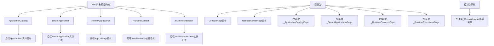

# 平台底座 PRD P0 + P1 实施计划

## 现状评估

通过深度代码探索，当前底座状态如下：

### 已完成的骨架（后端全量实现）

```
后端已有：
- 所有 v2 Controller（11 个）：ApplicationCatalogs / TenantApplications / TenantAppInstances
  TenantAppMembers / TenantAppRoles / RuntimeContexts / RuntimeExecutions
  ResourceCenter / ReleaseCenter / CozeMappings / DebugLayer
- 所有 v2 Service Interface（IPlatformServices.cs）
- 所有 v2 DTO（PlatformV2Models.cs）
- 所有 v2 Service 实现（PlatformV2Services.cs）
- 领域实体：AppManifest / TenantApplication / AppRelease / RuntimeRoute
- 所有 .http 测试文件（ApplicationCatalogs-V2.http、RuntimeContexts-V2.http 等）已存在
```

### 前端缺口（当前状态）


| 领域                 | 后端          | 类型(platform-v2.ts) | API 函数 | 管理页面    | 路由   |
| ------------------ | ----------- | ------------------ | ------ | ------- | ---- |
| ApplicationCatalog | ✅ 完整（只读）    | ❌ 缺失               | ❌ 缺失   | ❌ 缺失    | ❌ 缺失 |
| TenantApplication  | ✅ 完整（只读）    | ✅ 已有               | ✅ 已有   | ❌ 缺失    | ❌ 缺失 |
| RuntimeContext     | ✅ 完整（只读）    | ❌ 缺失               | ❌ 缺失   | ❌ 缺失    | ❌ 缺失 |
| RuntimeExecution   | ✅ 完整（只读+审计） | ✅ 已有               | ❌ 缺失   | ❌ 缺失    | ❌ 缺失 |
| 控制台顶部导航            | —           | —                  | —      | ❌ 未含新页面 | —    |


### 后端实际字段（用于精准对齐类型定义）

- `ApplicationCatalogListItem`：`id, catalogKey, name, status, version, description?, category?, icon?, publishedAt?`
- `ApplicationCatalogDetail`：同 ListItem + `dataSourceId?`
- `RuntimeContextListItem/Detail`：`id, appKey, pageKey, schemaVersion, environmentCode, isActive`（Detail 与 ListItem 字段相同）
- `RuntimeExecutionDetail`：比 ListItem 多 `inputsJson?, outputsJson?`

### PRD 与代码库的对应关系




---

## P0 交付范围

### 第一层：补齐前端类型定义

**文件：** `[src/frontend/Atlas.WebApp/src/types/platform-v2.ts](src/frontend/Atlas.WebApp/src/types/platform-v2.ts)`

补充（严格对齐后端 `PlatformV2Models.cs` 实际字段）：

- `ApplicationCatalogListItem` — `{ id, catalogKey, name, status, version, description?, category?, icon?, publishedAt? }`
- `ApplicationCatalogDetail extends ApplicationCatalogListItem` — `{ dataSourceId? }`
- `RuntimeContextListItem` — `{ id, appKey, pageKey, schemaVersion, environmentCode, isActive }`
- `RuntimeContextDetail extends RuntimeContextListItem` — 字段与 ListItem 相同，显式声明

### 第二层：补齐前端 API 函数

**新建：** `src/frontend/Atlas.WebApp/src/services/api-application-catalogs.ts`

- `getApplicationCatalogsPaged(params: PagedRequest & { keyword?: string })` → `GET /api/v2/application-catalogs`
- `getApplicationCatalogDetail(id: string)` → `GET /api/v2/application-catalogs/:id`

**新建：** `src/frontend/Atlas.WebApp/src/services/api-runtime-contexts.ts`

- `getRuntimeContextsPaged(params: PagedRequest & { appKey?: string; pageKey?: string })` → `GET /api/v2/runtime-contexts`
- `getRuntimeContextByRoute(appKey: string, pageKey: string)` → `GET /api/v2/runtime-contexts/:appKey/:pageKey`

**更新：** `[src/frontend/Atlas.WebApp/src/services/api.ts](src/frontend/Atlas.WebApp/src/services/api.ts)`

- 添加 `api-application-catalogs.ts` 和 `api-runtime-contexts.ts` 的 re-export

### 第三层：新建三个控制台管理页面

**新建：** `src/frontend/Atlas.WebApp/src/pages/console/ApplicationCatalogPage.vue`

- 参考 `ReleaseCenterPage.vue` 结构（`a-card` + `a-table` + `a-modal` 详情）
- 表格列：名称 / catalogKey / 版本 / 状态 / 分类 / 发布时间 / 操作
- 支持关键字搜索和分页
- 操作列"查看"打开 `a-modal` 展示 Detail 字段

**新建：** `src/frontend/Atlas.WebApp/src/pages/console/TenantApplicationsPage.vue`

- 表格列：目录名 / appKey / 开通时间 / 状态
- 支持关键字搜索和分页
- 操作列"查看"打开 Detail 抽屉

**新建：** `src/frontend/Atlas.WebApp/src/pages/console/RuntimeContextsPage.vue`

- 表格列：appKey / pageKey / schemaVersion / environmentCode / 是否激活
- 支持 appKey/pageKey 过滤和分页

### 第四层：注册路由

**更新：** `[src/frontend/Atlas.WebApp/src/router/index.ts](src/frontend/Atlas.WebApp/src/router/index.ts)`

新增三条路由（console 区段）：

- `/console/catalog` → `ApplicationCatalogPage`，权限 `apps:view`
- `/console/tenant-applications` → `TenantApplicationsPage`，权限 `apps:view`
- `/console/runtime-contexts` → `RuntimeContextsPage`，权限 `apps:view`

---

## P1 交付范围

### 第五层：RuntimeExecution 独立管理页

**新建：** `src/frontend/Atlas.WebApp/src/services/api-runtime-executions.ts`

- `getRuntimeExecutionsPaged(params)` → `GET /api/v2/runtime-executions`
- `getRuntimeExecutionDetail(id: string)` → `GET /api/v2/runtime-executions/:id`
- `getRuntimeExecutionAuditTrails(id: string)` → `GET /api/v2/runtime-executions/:id/audit-trails`

**更新：** `[src/frontend/Atlas.WebApp/src/services/api.ts](src/frontend/Atlas.WebApp/src/services/api.ts)` — 追加 re-export

**新建：** `src/frontend/Atlas.WebApp/src/pages/console/RuntimeExecutionsPage.vue`

- 表格列：workflowId / appId / releaseId / 状态 / 开始时间 / 完成时间 / 错误信息
- 操作列"详情"打开抽屉：展示 `inputsJson` / `outputsJson` + 关联审计追踪列表（`RuntimeExecutionAuditTrailItem`）

**更新：** `[src/frontend/Atlas.WebApp/src/router/index.ts](src/frontend/Atlas.WebApp/src/router/index.ts)`

- 新增 `/console/runtime-executions` → `RuntimeExecutionsPage`，权限 `apps:view`

### 第六层：更新控制台顶部导航

**更新：** `[src/frontend/Atlas.WebApp/src/layouts/ConsoleLayout.vue](src/frontend/Atlas.WebApp/src/layouts/ConsoleLayout.vue)`

当前菜单项：`平台首页 / 应用管理 / 发布中心 / 调试层 / 数据源管理 / 系统设置`

新增四项（及对应 `selectedKeys` 逻辑分支）：

- `应用目录` → `/console/catalog`
- `租户开通` → `/console/tenant-applications`
- `运行上下文` → `/console/runtime-contexts`
- `执行记录` → `/console/runtime-executions`

### 第七层：平台对象词汇表文档

**新建：** `[docs/platform-objects.md](docs/platform-objects.md)`

内容包含：

- 平台统一对象全集表（20 个对象：Tenant / User / Department / Role / Permission / Menu / Project / ApplicationCatalog / TenantApplication / TenantAppInstance / TenantDataSource / ResourceBinding / AppRelease / RuntimeRoute / RuntimeContext / RuntimeExecution / AuditTrail / PackageArtifact / LicenseGrant / ToolAuthorizationPolicy）
- 每个对象的归属层（平台级 / 租户级 / 应用级）、生命周期描述
- v1/v2 命名映射表（对齐 contracts.md 第 171-177 行）
- 对象生命周期关系链（平台目录定义 → 租户开通 → 租户实例运行 → 发布快照 → 路由生效 → 执行记录 → 审计追溯）

---

## 完整涉及文件清单

**P0（7 个文件）：**

- `[src/frontend/Atlas.WebApp/src/types/platform-v2.ts](src/frontend/Atlas.WebApp/src/types/platform-v2.ts)` — 补充 2 个类型组（4 个接口）
- `src/frontend/Atlas.WebApp/src/services/api-application-catalogs.ts` — 新建
- `src/frontend/Atlas.WebApp/src/services/api-runtime-contexts.ts` — 新建
- `[src/frontend/Atlas.WebApp/src/services/api.ts](src/frontend/Atlas.WebApp/src/services/api.ts)` — 追加 2 个 re-export
- `src/frontend/Atlas.WebApp/src/pages/console/ApplicationCatalogPage.vue` — 新建
- `src/frontend/Atlas.WebApp/src/pages/console/TenantApplicationsPage.vue` — 新建
- `src/frontend/Atlas.WebApp/src/pages/console/RuntimeContextsPage.vue` — 新建
- `[src/frontend/Atlas.WebApp/src/router/index.ts](src/frontend/Atlas.WebApp/src/router/index.ts)` — 添加 3 条路由

**P1（5 个文件）：**

- `src/frontend/Atlas.WebApp/src/services/api-runtime-executions.ts` — 新建
- `[src/frontend/Atlas.WebApp/src/services/api.ts](src/frontend/Atlas.WebApp/src/services/api.ts)` — 再追加 1 个 re-export
- `src/frontend/Atlas.WebApp/src/pages/console/RuntimeExecutionsPage.vue` — 新建
- `[src/frontend/Atlas.WebApp/src/layouts/ConsoleLayout.vue](src/frontend/Atlas.WebApp/src/layouts/ConsoleLayout.vue)` — 补充 4 个菜单项和 selectedKeys 分支
- `[src/frontend/Atlas.WebApp/src/router/index.ts](src/frontend/Atlas.WebApp/src/router/index.ts)` — 添加 1 条路由
- `[docs/platform-objects.md](docs/platform-objects.md)` — 新建词汇表文档

