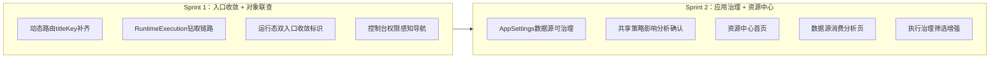

# 平台底座 PRD P2 实施计划

## 现状基线（P0+P1 完成后）

```
已有：
- dynamic-router.ts 的 pathComponentFallbackMap 已包含全部 4 个新 console 页面映射
  （/console/catalog、/console/tenant-applications、/console/runtime-contexts、/console/runtime-executions）
  但 titleKey 字段尚未补充，动态菜单回放时标题会缺失
- ConsoleLayout.vue 顶部菜单已硬编码，不受 permissionStore 控制（纯静态）
- AppSettingsPage.vue 数据源区块为"只读展示 + 测试连接"，无绑定/切换/解绑能力
- AppSettingsPage.vue 共享策略切换无影响分析弹窗，直接保存
- 资源中心后端接口已完整（/api/v2/resource-center/groups + datasource-consumption）
  但前端无任何对应页面
- RuntimeExecutionsPage 展示 workflowId/appId/releaseId，但字段不可点击，无钻取链路
- /apps/:appId/run/:pageKey 与 /r/:appKey/:pageKey 两条运行态入口并存，无明确标识区分
```

### P2 核心架构目标




---

## Sprint 1：入口收敛 + 对象联查闭环

### 任务 1：动态路由 titleKey 补齐

**问题：** `dynamic-router.ts` 的 `pathComponentFallbackMap` 已有 4 个新 console 页面的组件映射，但 `toRouteRecord` 生成路由时 `titleKey` 来自后端 `RouterVo.meta.titleKey`。当后端动态菜单未配置新页面时，标题回退为空。

**文件：** `[src/frontend/Atlas.WebApp/src/utils/dynamic-router.ts](src/frontend/Atlas.WebApp/src/utils/dynamic-router.ts)`

补充一个 `pathTitleKeyMap`，在 `toRouteRecord` 的 `baseMeta` 中当 `titleKey` 为空时按路径兜底赋值：

```
/console/catalog           → console.catalog
/console/tenant-applications → console.tenantApplications
/console/runtime-contexts  → console.runtimeContexts
/console/runtime-executions → console.runtimeExecutions
```

**验收：** 动态菜单回放后，4 个新 console 页面标题正确显示，不出现空标题或 undefined。

---

### 任务 2：RuntimeExecution 详情页做对象钻取链路

**问题：** `RuntimeExecutionsPage.vue` 展示了 `workflowId / appId / releaseId` 等关联字段，但均为纯文本，无法跳转查看关联对象。契约已定义完整的跨对象查询链路。

**目标链路：** 租户应用实例 → 发布版本 → 运行上下文 → 执行记录 → 审计轨迹

**文件：** `src/frontend/Atlas.WebApp/src/pages/console/RuntimeExecutionsPage.vue`

改造内容：

- `appId` 字段改为可点击链接，跳转至 `/apps/:appId/dashboard`
- `releaseId` 字段改为可点击链接，打开 `ReleaseCenterPage` 对应详情抽屉（通过 query 参数传入 releaseId）
- `runtimeContextId` 字段改为可点击链接，跳转至 `/console/runtime-contexts` 并带 appKey 过滤
- 详情抽屉底部增加"查看关联应用"和"查看发布版本"两个快捷按钮
- 审计追踪列表中 `target` 字段若包含对象 ID，提供"查看"入口

**新增面包屑显示逻辑：** 在详情抽屉顶部展示对象链路面包屑：
`[租户应用名] > [发布版本号] > [运行上下文 appKey/pageKey] > 执行记录`

---

### 任务 3：运行态双入口收敛标识

**问题：** 路由盘点文档（`docs/analysis/frontend-route-inventory.md`）明确指出 `/apps/:appId/run/:pageKey` 与 `/r/:appKey/:pageKey` 两条运行态入口并存，产品语义未区分。

**策略：** 不删除路由，只做标识和语义收敛。

**文件 1：** `src/frontend/Atlas.WebApp/src/pages/runtime/PageRuntimeRenderer.vue`

在渲染层顶部增加环境标识 banner：

- 若路由来自 `/apps/:appId/run/:pageKey`：显示黄色 `预览模式` 提示条（"当前为工作台预览，不计入正式运行记录"）
- 若路由来自 `/r/:appKey/:pageKey`：无提示条，作为正式运行态

判断方式：通过 `route.name` 区分（`app-workspace-runtime` vs `runtime-delivery-page`）

**文件 2：** `[src/frontend/Atlas.WebApp/src/pages/apps/AppBuilderPage.vue](src/frontend/Atlas.WebApp/src/pages/apps/AppBuilderPage.vue)` 或 `AppDashboardPage.vue`

在工作台预览跳转按钮旁增加"去正式发布页"入口，跳转至 `/r/:appKey/:pageKey`（appKey 从当前 appId 对应实例获取）。

**验收：** 工作台内预览有明确黄色标识，正式运行态无标识；工作台内可一键跳转正式运行交付面。

---

### 任务 4：控制台顶部导航权限感知

**问题：** `ConsoleLayout.vue` 的 10 个菜单项完全静态，所有用户均可见，只在进入页面后才被路由守卫拦截。

**文件：** `[src/frontend/Atlas.WebApp/src/layouts/ConsoleLayout.vue](src/frontend/Atlas.WebApp/src/layouts/ConsoleLayout.vue)`

改造内容：

- 引入 `usePermissionStore`（已有），读取 `permissionStore.permissions`
- 定义菜单项配置数组，每项包含 `{ key, label, path, permission? }`
- 用 `v-for` + `v-if="!item.permission || hasPermission(item.permission)"` 动态渲染菜单项
- 无权限项直接隐藏（不显示禁用态，避免信息泄露）
- 新增无权限空状态组件：路由守卫已拦截时，页面中央展示统一空状态（"暂无访问权限，请联系管理员"）而非硬跳转 `/login`

权限映射：

- `应用目录 / 租户开通 / 运行上下文 / 执行记录 / 应用管理 / 发布中心` → `apps:view`
- `数据源管理` → `system:admin`
- `调试层` → `apps:view`
- `系统设置` → `config:view`

---

### Sprint 1 涉及文件

- `[src/frontend/Atlas.WebApp/src/utils/dynamic-router.ts](src/frontend/Atlas.WebApp/src/utils/dynamic-router.ts)` — 补充 titleKey 兜底映射
- `src/frontend/Atlas.WebApp/src/pages/console/RuntimeExecutionsPage.vue` — 钻取链路改造
- `src/frontend/Atlas.WebApp/src/pages/runtime/PageRuntimeRenderer.vue` — 预览/正式运行态标识
- `[src/frontend/Atlas.WebApp/src/layouts/ConsoleLayout.vue](src/frontend/Atlas.WebApp/src/layouts/ConsoleLayout.vue)` — 权限感知动态菜单

---

## Sprint 2：应用治理中心 + 资源中心 1.0

### 任务 5：AppSettings 数据源从只读升级为可治理

**现状：** `AppSettingsPage.vue` 的绑定数据源卡片标题即写明"只读"，仅有"测试连接"和"前往数据源管理"两个操作。后端 `LowCodeAppsController` 已有 `GET/POST /datasource/test`，但无绑定/切换接口。

**分析：** 数据源绑定接口目前在 `TenantAppInstanceCommandService.CreateAsync / UpdateAsync` 中通过 `dataSourceId` 字段处理，即通过 `PUT /api/v2/tenant-app-instances/{id}` 的 `dataSourceId` 字段实现绑定/切换/解绑。

**文件：** `src/frontend/Atlas.WebApp/src/pages/apps/AppSettingsPage.vue`

升级内容：

- 数据源卡片标题改为"数据源绑定"（去掉"只读"）
- 增加"绑定数据源"按钮：弹出数据源选择器（`a-select` 远程搜索，调用 `GET /api/v1/tenant-datasources` 获取可用数据源列表，默认展示 20 条，支持远程检索）
- 增加"切换数据源"（已绑定时显示）：同上弹窗，确认后调用 `PUT /api/v2/tenant-app-instances/{id}` 更新 `dataSourceId`
- 增加"解绑数据源"（已绑定时显示）：`a-popconfirm` 确认，解绑后清空 `dataSourceId`
- 绑定/切换前检查：若当前共享策略为全共享，提示"隔离模式下才需要绑定独立数据源，当前为共享模式是否继续？"

---

### 任务 6：共享策略切换增加影响分析弹窗

**现状：** 切换 `useSharedUsers / useSharedRoles / useSharedDepartments` 后直接点"保存共享策略"，无任何影响提示。

**文件：** `src/frontend/Atlas.WebApp/src/pages/apps/AppSettingsPage.vue`

升级内容：

- 点"保存共享策略"时，若检测到策略从共享切换为隔离（或反向），弹出 `a-modal` 影响分析确认框：

  | 切换项         | 影响说明                                  |
  | ----------- | ------------------------------------- |
  | 用户：共享 → 隔离  | 应用将使用独立用户池，现有平台用户将无法登录该应用，需重新在应用内添加成员 |
  | 角色：共享 → 隔离  | 应用将使用独立角色体系，现有平台角色绑定失效，需在应用内重新配置权限    |
  | 部门：共享 → 隔离  | 数据权限中的"本部门"等范围将以应用独立部门树为准             |
  | 任意项：隔离 → 共享 | 应用级独立配置将被平台共享体系覆盖                     |

- 弹窗底部显示"我已了解影响，确认切换"按钮，确认后才实际调用保存接口
- 若策略未发生方向性变化（均为共享，或均为隔离），直接保存无需弹窗

---

### 任务 7：资源中心首页

**现状：** 后端 `GET /api/v2/resource-center/groups` 已有完整实现，返回 `catalogs / instances / datasources` 三组聚合数据。前端无任何对应页面，`api.ts` 中 `getResourceCenterGroups()` 函数已在 `api-tenant-app-instances.ts` 中定义。

**新建：** `src/frontend/Atlas.WebApp/src/pages/console/ResourceCenterPage.vue`

页面结构：

- 顶部 4 个统计卡片（`a-statistic`）：
  - 应用目录总数（来自 `groups` 中 `catalogs` 组的 `total`）
  - 租户应用实例总数（来自 `instances` 组的 `total`）
  - 平台级数据源总数
  - 未绑定数据源的应用实例数
- 下方 3 个资源分组卡片（`a-card`），每组展示资源列表（名称 / 类型 / 状态 / 描述）
- 页面右上角"查看消费分析"按钮，跳转至数据源消费分析页

**路由：** 新增 `/console/resources` → `ResourceCenterPage`，权限 `apps:view`
**导航：** `ConsoleLayout.vue` 已有 `资源中心` 菜单项，更新其路由目标到该页面

---

### 任务 8：数据源消费分析页

**现状：** `GET /api/v2/resource-center/datasource-consumption` 已有完整实现，返回平台级/应用级数据源的消费详情。`getResourceCenterDataSourceConsumption()` 函数已在前端定义。

**新建：** `src/frontend/Atlas.WebApp/src/pages/console/DataSourceConsumptionPage.vue`

页面结构：

- 顶部统计：平台级数据源数 / 应用级数据源数 / 未绑定应用实例数
- 平台级数据源列表（`a-table`）：
  - 列：数据源名称 / 类型 / 绑定应用数 / 最近测试时间 / 是否激活
  - 展开行：显示 `bindingRelations` 明细（bindingType / source / isActive / boundAt）
  - 绑定应用数为 0 时，用红色标记
- 应用级数据源列表：同上结构
- 未绑定清单（`a-table`）：展示尚未绑定数据源的应用实例（appKey / 名称 / 状态）
- 每行数据源名称可点击，跳转至 `/console/datasources` 对应项

**路由：** 新增 `/console/resources/datasource-consumption` → `DataSourceConsumptionPage`，权限 `apps:view`

---

### 任务 9：执行治理筛选增强

**现状：** `RuntimeExecutionsPage.vue` 目前支持基础分页，但无 appId / 状态 / 时间范围筛选，且失败执行没有聚合视图。

**文件：** `src/frontend/Atlas.WebApp/src/pages/console/RuntimeExecutionsPage.vue`

增强内容：

- 顶部筛选栏增加：
  - 应用选择（`a-select` 远程搜索，调用租户应用实例列表接口，默认 20 条）
  - 执行状态选择（`a-select`：全部 / 运行中 / 成功 / 失败 / 超时）
  - 时间范围（`a-range-picker`，默认最近 7 天）
- 表格增加"失败"状态行红色高亮
- 失败执行的 `errorMessage` 列支持 tooltip 完整展示
- 审计轨迹列表改为分页加载（当前为全量加载）
- 表格底部增加"查看关联发布版本"快捷入口

---

### Sprint 2 涉及文件

- `[src/frontend/Atlas.WebApp/src/pages/apps/AppSettingsPage.vue](src/frontend/Atlas.WebApp/src/pages/apps/AppSettingsPage.vue)` — 数据源可治理 + 共享策略影响分析
- `src/frontend/Atlas.WebApp/src/pages/console/ResourceCenterPage.vue` — 新建
- `src/frontend/Atlas.WebApp/src/pages/console/DataSourceConsumptionPage.vue` — 新建
- `src/frontend/Atlas.WebApp/src/pages/console/RuntimeExecutionsPage.vue` — 筛选增强
- `[src/frontend/Atlas.WebApp/src/router/index.ts](src/frontend/Atlas.WebApp/src/router/index.ts)` — 新增 2 条路由
- `[src/frontend/Atlas.WebApp/src/layouts/ConsoleLayout.vue](src/frontend/Atlas.WebApp/src/layouts/ConsoleLayout.vue)` — 资源中心菜单目标更新

---

## 完整涉及文件清单

**Sprint 1（4 个文件）：**

- `[src/frontend/Atlas.WebApp/src/utils/dynamic-router.ts](src/frontend/Atlas.WebApp/src/utils/dynamic-router.ts)` — titleKey 兜底映射
- `src/frontend/Atlas.WebApp/src/pages/console/RuntimeExecutionsPage.vue` — 对象钻取链路
- `src/frontend/Atlas.WebApp/src/pages/runtime/PageRuntimeRenderer.vue` — 预览/正式标识 banner
- `[src/frontend/Atlas.WebApp/src/layouts/ConsoleLayout.vue](src/frontend/Atlas.WebApp/src/layouts/ConsoleLayout.vue)` — 权限感知动态菜单

**Sprint 2（6 个文件）：**

- `[src/frontend/Atlas.WebApp/src/pages/apps/AppSettingsPage.vue](src/frontend/Atlas.WebApp/src/pages/apps/AppSettingsPage.vue)` — 数据源治理 + 共享策略影响分析
- `src/frontend/Atlas.WebApp/src/pages/console/ResourceCenterPage.vue` — 新建
- `src/frontend/Atlas.WebApp/src/pages/console/DataSourceConsumptionPage.vue` — 新建
- `src/frontend/Atlas.WebApp/src/pages/console/RuntimeExecutionsPage.vue` — 筛选增强
- `[src/frontend/Atlas.WebApp/src/router/index.ts](src/frontend/Atlas.WebApp/src/router/index.ts)` — 新增 2 条路由
- `[src/frontend/Atlas.WebApp/src/layouts/ConsoleLayout.vue](src/frontend/Atlas.WebApp/src/layouts/ConsoleLayout.vue)` — 资源中心菜单目标更新

## 本阶段不纳入范围

- Package / License 大面板（需等治理链路打通后再做）
- 模板市场 / AI Studio / Agent 市场（需等底座对象稳定后再做）
- `/apps/:appId/`* 路径整改为 `/tenant-apps/:tenantAppId/`*（SEC-38，影响面大，需独立立项）
- 实体别名联动工作台文案（需等工作台框架稳定后做）

