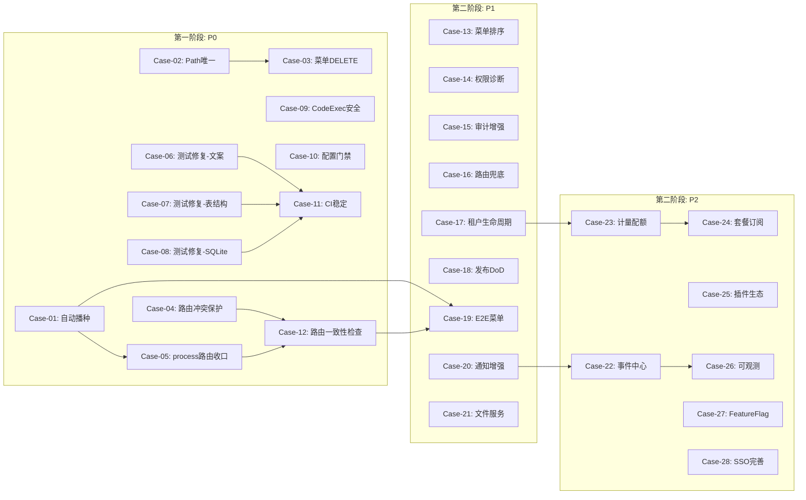

# 平台级能力补齐与缺陷整改计划

## 整体策略

按报告识别的问题，拆分为 **28 个最小可闭环 case**，分三阶段推进：

- **第一阶段（短期 P0，2-3 周）**：封住交付断点，修复阻断性缺陷
- **第二阶段（中期 P1，1-2 月）**：平台封板，补齐治理闭环
- **第三阶段（长期 P2，3-6 月）**：对齐 SaaS 成熟度

---

## 第一阶段：P0 交付断点封口（12 个 case）

### Case-01: 首次运行自动检测并播种（B1）

**问题**：[DatabaseInitializerOptions](src/backend/Atlas.Application/Options/DatabaseInitializerOptions.cs) 三个开关默认均为 `true`（跳过），[appsettings.json](src/backend/Atlas.WebApi/appsettings.json) 和 [appsettings.Development.json](src/backend/Atlas.WebApi/appsettings.Development.json) 也如此，新环境首次启动无菜单/角色/管理员。

**改动范围**：

- `DatabaseInitializerHostedService.cs`：在 `SkipSeedData=true` 分支中增加"核心表为空则自动播种"逻辑（检查 Menu/Role/UserAccount 表是否有记录，若为空则忽略 SkipSeedData 标志自动执行种子数据）
- `appsettings.Development.json`：将 `SkipSeedData` 改为 `false`（开发环境默认播种）
- 保持 `appsettings.json`（生产配置）中 `SkipSeedData=true` 不变，由自动检测兜底

**验收**：删除 atlas.db 后使用默认配置启动，系统自动播种，可正常登录并看到菜单

---

### Case-02: 菜单 Path 唯一性约束（B4）

**问题**：[MenuValidators.cs](src/backend/Atlas.Application/Identity/Validators/MenuValidators.cs) 仅校验格式/长度，无 Path 唯一性校验；MenuCommandService 也无防重复检查。

**改动范围**：

- `IMenuQueryService` / `MenuQueryService`：新增 `ExistsByPathAsync(TenantId, string path, long? excludeId)` 方法
- `MenuCommandService.CreateAsync` / `UpdateAsync`：调用查重，重复时抛 `BusinessException(VALIDATION_ERROR, "菜单路径已存在")`
- DB 层：Menu 表添加 `(TenantId, Path, ParentId)` 复合唯一索引（通过 SqlSugar CodeFirst 特性或迁移脚本）

**验收**：同租户下重复创建相同 Path 菜单返回 400；单测覆盖

---

### Case-03: 菜单 DELETE 接口补齐

**问题**：[MenusController.cs](src/backend/Atlas.WebApi/Controllers/MenusController.cs) 仅有 GET/POST/PUT，缺少 DELETE；[IMenuCommandService](src/backend/Atlas.Application/Identity/Abstractions/IMenuCommandService.cs) 也无 Delete 方法。

**改动范围**：

- `IMenuCommandService`：新增 `DeleteAsync(TenantId, long menuId, CancellationToken)`
- `MenuCommandService`：实现删除，需校验"有子菜单不允许删除"、级联清理 RoleMenu 关联
- `MenusController`：新增 `[HttpDelete("{id:long}")]`，权限策略 `PermissionPolicies.MenusDelete`
- `PermissionCodes` / `PermissionPolicies`：补充 `menus:delete` 权限码
- `DatabaseInitializerHostedService`：种子数据中补充该权限
- `Menus.http`：补充 DELETE 测试请求

**验收**：DELETE 接口可用，有子菜单时返回 400；.http 文件覆盖

---

### Case-04: 前端动态路由注册冲突保护（B2）

**问题**：[permission.ts](src/frontend/Atlas.WebApp/src/stores/permission.ts) 的 `registerRoutes` 仅按 `name` 去重（第 75 行 `router.hasRoute(name)`），不按 `path` 去重，可能与静态路由产生冲突。

**改动范围**：

- `stores/permission.ts` 的 `registerRoutes`：注册前收集已注册路由的 `path` 集合，若 path 冲突则跳过并输出 `console.warn`
- 增加单元级测试或开发环境 debug 日志

**验收**：构造重复 path 的动态路由数据，验证前端不崩溃且有警告日志

---

### Case-05: /process/* 兼容路由收口与标准化（B2）

**问题**：[router/index.ts](src/frontend/Atlas.WebApp/src/router/index.ts) 中 `/process/`* 与 `/approval/`* 并存，虽然 `/process/*` 标记为 Deprecated 并 redirect，但菜单种子若仍包含 `/process/*` 路径会引起混乱。

**改动范围**：

- `DatabaseInitializerHostedService.cs` 种子数据：确认菜单种子中所有流程相关路径统一为 `/approval/`*，不使用 `/process/`*
- `router/index.ts`：为 Deprecated 路由添加统一注释块，明确弃用时间窗口
- 可选：添加 `DeprecatedRouteWarning` 组件，在开发模式下对 deprecated 路由显示迁移提示

**验收**：菜单种子无 `/process/`* 路径；访问 `/process/`* 正确重定向到 `/approval/*`

---

### Case-06: 运行失败测试修复 - 文案断言（B3-a）

**问题**：PR #141 报告 SecurityPlatform.Tests 有 10 个非集成测试失败，其中部分为密码文案断言中英文不一致。

**改动范围**：

- 先执行 `dotnet test tests/Atlas.SecurityPlatform.Tests --filter "FullyQualifiedName!~Integration"` 定位实际失败项
- 若为 PasswordPolicy 相关：修改测试断言使用 error code 或 message key 而非自然语言字符串
- 若为其他 i18n 相关：统一测试断言基于 code 而非 message

**验收**：`dotnet test tests/Atlas.SecurityPlatform.Tests --filter "FullyQualifiedName!~Integration"` 全部通过

---

### Case-07: 运行失败测试修复 - 动态表列缺失（B3-b）

**问题**：DynamicTable 测试可能因缺少 AppId/DataSourceId 列或 DynamicRelation/FieldPermission 表导致失败。

**改动范围**：

- 基于 Case-06 的实际测试输出定位具体失败
- 补齐 `CreateSchemaAsync` 中缺失的表结构
- 确保测试用的 schema 与生产 `DatabaseInitializerHostedService` 一致

**验收**：相关 DynamicTable 测试全部通过

---

### Case-08: 运行失败测试修复 - SQLite SQL 兼容（B3-c）

**问题**：部分查询服务可能使用了 SQLite 不兼容的 SQL 语法。

**改动范围**：

- 基于 Case-06 的实际测试输出定位 SQL 语法错误
- 修改为 SqlSugar 兼容写法或按 DbType 分支处理
- 补充 SQLite 专项测试断言

**验收**：所有 SQLite 相关测试通过

---

### Case-09: CodeExecution Direct 模式安全加固（S2）

**问题**：[CodeExecutionOptions.cs](src/backend/Atlas.Infrastructure/Options/CodeExecutionOptions.cs) 默认 `Mode="Direct"`，宿主机直接执行 Python，且 BlockedModules 仅在 SandboxedPythonExecutor 中生效，Direct 模式不受限。

**改动范围**：

- `CodeExecutionOptions`：默认 Mode 改为 `"Docker"`（安全优先），Direct 需显式配置
- `DirectPythonExecutor`（如存在）：也应用 BlockedModules 检查（复用 SandboxedPythonExecutor 的正则逻辑）
- `SandboxedPythonExecutor`：增加对 `__import__`、`importlib`、`eval`、`exec` 的检测
- `appsettings.json`：CodeExecution 节增加注释说明 Direct 模式的安全风险
- 可选：增加租户级开关（TenantConfig）控制是否允许代码执行

**验收**：Direct 模式也拦截 BlockedModules；默认启动使用 Docker 模式

---

### Case-10: 生产配置安全门禁增强（S1）

**问题**：docker-compose 中密钥通过环境变量注入但无"空值拒绝启动"机制。

**改动范围**：

- `docker-compose.yml`：为 `JWT_SIGNING_KEY`、`BOOTSTRAP_ADMIN_PASSWORD` 添加必填校验注释
- `Program.cs`：非 Development 环境下若 JWT SigningKey 为空或默认值，直接 `throw` 阻止启动（当前已有部分逻辑，确认覆盖完整）
- 提供 `.env.example` 更新，标注每个变量的安全要求
- `deploy.sh`：增加环境变量非空校验

**验收**：缺少必要密钥时后端拒绝启动并给出明确错误

---

### Case-11: CI 门禁修复与稳定性

**问题**：CI 中单元测试若存在失败，会影响合并信心。

**改动范围**：

- Case-06/07/08 修复后，确认 CI 的 `backend-build` job 全绿
- `.github/workflows/ci.yml`：确认覆盖率门禁阈值合理
- 可选：增加"测试失败零容忍"注释或 `--blame-crash` 参数辅助定位

**验收**：CI `backend-build` job 全绿（0 失败）

---

### Case-12: 菜单/路由一致性静态检查工具

**问题**：菜单种子路径、前端静态路由路径、fallback map 路径之间缺乏自动化一致性校验。

**改动范围**：

- 新增脚本（如 `scripts/check-route-consistency.ts` 或 `.csx`），提取：
  - 后端种子菜单路径集合
  - 前端 `router/index.ts` 静态路由路径
  - `dynamic-router.ts` 中 `pathComponentFallbackMap` 路径
- 输出差异报告（孤立路径、重复路径、缺失组件映射）
- 可选：集成到 CI `frontend-build` job

**验收**：脚本可运行并输出一致性报告；已知差异已确认或修复

---

## 第二阶段：P1 平台封板（9 个 case）

### Case-13: 菜单排序与批量操作

- 补齐 MenusController 的 `PATCH /menus/sort`（批量更新 SortOrder）
- 前端菜单管理页增加拖拽排序

### Case-14: 权限-菜单绑定一致性诊断

- 新增诊断接口 `GET /api/v1/admin/permission-menu-diagnosis`：检测"菜单可见但 API 无对应权限"或"权限存在但无菜单入口"的不一致项
- 供管理员在"系统设置"页面查看诊断报告

### Case-15: 审计日志增强 - 留存清理与导出

- `IAuditQueryService` 补充审计日志过期清理接口（ScheduledJob 定时清理 >180天记录）
- 补充审计日志导出（CSV/Excel），对齐 ActionTrail "可溯源"能力

### Case-16: 动态路由 getRouters 失败兜底

- `permission.ts`：`generateRoutes` 捕获 getRouters 失败异常
- 从 localStorage 读取上次成功的 routers 缓存
- 提供"平台最小可用菜单"（首页 + 个人中心 + 退出）内置兜底

### Case-17: 租户生命周期增强

- Tenant 实体增加 `ExpiredAt`、`TrialEndsAt` 字段
- `TenantService` 增加 `RenewAsync`（续期）、`CheckExpirationAsync`（到期检查）
- ScheduledJob：定时检查到期租户并自动停用 + 通知管理员
- `TenantsController` 补充续期接口

### Case-18: 发布中心 DoD 完善

- 发布/回滚操作增加审计轨迹（WriteAudit）
- 发布前检查（版本 diff 非空、必要审批已通过）
- 发布记录增加状态机（Draft→Pending→Released→Rolledback）

### Case-19: E2E 菜单自动化（P0/P1 领域）

- 按 `docs/plan-全功能菜单E2E测试.md` 落地 Playwright spec
- 按领域拆分：`menu-smoke.spec.ts`、`menu-rbac.spec.ts`、`menu-navigation.spec.ts`
- 至少覆盖 P0 菜单（100%可访问、无 404/白屏）

### Case-20: 通知中心最小闭环增强

- 前端通知收件箱增加"未读角标"全局显示（Header 组件）
- WebSocket/SSE 实时推送通知（或定时轮询 30s）
- 通知模板支持"变量替换"（如 `{username}` `{actionName}`）

### Case-21: 文件服务完善

- 上传文件增加类型白名单校验（防止上传可执行文件）
- 上传大小限制可配置化（appsettings.json）
- 签名 URL 增加过期时间配置

---

## 第三阶段：P2 SaaS 成熟度增强（7 个 case）

### Case-22: 事件通知/订阅中心

- 定义统一事件模型 `PlatformEvent`（EventType, Source, Payload, TenantId, Timestamp）
- 事件订阅配置（按 EventType + TenantId 配置接收通道：站内信/邮件/Webhook）
- 对齐 CloudMonitor/EventBridge 的通知策略概念

### Case-23: 计量与配额基础框架

- 新增 `Metering` 域：`UsageRecord`（TenantId, ResourceType, Quantity, Timestamp）
- 配额配置 `TenantQuota`（TenantId, ResourceType, MaxQuantity）
- 配额检查中间件或服务：写操作前检查是否超配额
- 初期支持：用户数、应用数、API 调用数、存储量

### Case-24: 套餐与订阅模型

- 新增 `Subscription` 域：`Plan`（套餐定义）、`Subscription`（租户订阅关系）
- 套餐与配额关联
- 管理员控制台：套餐管理 + 租户订阅管理

### Case-25: 插件生态完善

- 插件生命周期状态机（Installed→Enabled→Disabled→Uninstalled）
- 插件配置持久化（PluginConfig per Tenant）
- 插件市场页面增加搜索/分类/评分

### Case-26: 可观测性增强

- OpenTelemetry Trace 覆盖关键业务链路（登录、菜单加载、CRUD 操作）
- Metrics 导出仪表盘数据（请求量、延迟、错误率）
- 告警规则配置（基于阈值触发通知 → 关联 Case-22 事件中心）

### Case-27: 多环境/Feature Flag

- 系统配置增加"Feature Flag"类型
- 前端 `useFeatureFlag` composable，读取后端 Feature 开关
- 支持按租户/角色灰度

### Case-28: SSO/OIDC 完善

- OIDC 对接完善：支持多 IdP 配置（per Tenant）
- 自动创建/关联 OIDC 用户到本地 UserAccount
- 登录页增加"企业 SSO 登录"入口

---

## 依赖关系

## 验收总则

- 每个 Case 完成后执行：`dotnet build`（0 warning）、受影响测试通过、.http 文件更新
- P0 阶段完成后 Gate 标准：全量单元测试通过 + 可从空 DB 启动到登录成功 + 菜单/路由无 404
- P1 阶段完成后 Gate 标准：E2E P0 菜单 100% 通过 + 审计/通知/发布闭环可演示
- P2 按需对齐阿里云 SaaS 控制台成熟度

