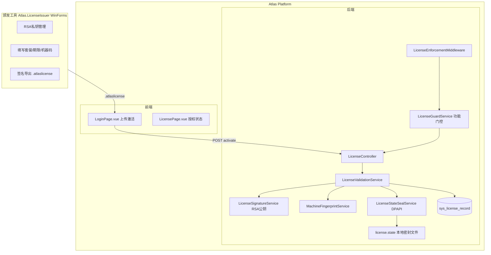

# 授权证书能力实施计划

## 整体架构




## 证书格式

```json
{
  "header": { "version": "1.0", "algorithm": "ECDSA-SHA256", "kid": "atlas-2026-01" },
  "payload": {
    "licenseId": "uuid",
    "revision": 1,
    "customerId": "...",
    "tenantName": "...",
    "issuedAt": "2026-03-07T00:00:00Z",
    "expiresAt": "2027-03-07T00:00:00Z",
    "isPermanent": false,
    "edition": "Pro",
    "machineFingerprint": "sha256:...",
    "features": { "workflow": true, "lowCode": true, "offlineDeploy": true },
    "limits": { "maxApps": 20, "maxUsers": 500, "maxTenants": 5 }
  },
  "signature": "base64(ECDSA-SHA256)"
}
```

防护机制对应关系：

- **篡改防护** — ECDSA 非对称签名（平台只有公钥）
- **复制防护** — machineFingerprint + 主指纹/次指纹容错比对
- **快照回滚** — DPAPI 密封本地激活状态 + 时间回拨检测
- **时间回拨** — 持久化 `maxObservedUtc`，倒退超容忍窗口即告警
- **旧证续用** — revision 单调递增，旧 revision 自动失效
- **后端门控** — 所有受限接口经过 `LicenseGuardService` 检查

---

## 后端实现

### 1. Domain 层 — 新增实体

**文件**: `src/backend/Atlas.Domain/License/LicenseRecord.cs`

- 继承 `EntityBase`（不是 `TenantEntity`，授权是全局的）
- 字段：`LicenseId`, `Revision`, `Edition`, `IssuedAt`, `ExpiresAt`, `IsPermanent`, `MachineFingerprintHash`, `PayloadHash`, `Status`, `ActivatedAt`, `LastValidatedAt`, `MaxObservedUtc`, `RawLicenseCiphertext`

**文件**: `src/backend/Atlas.Domain/License/LicenseEdition.cs`

- 枚举：`Trial`, `Pro`, `Enterprise`

### 2. Application 层 — 接口与 DTO

**文件**: `src/backend/Atlas.Application/License/Abstractions/ILicenseService.cs`

```csharp
public interface ILicenseService
{
    LicenseStatus GetCurrentStatus();          // 当前授权状态（缓存）
    bool IsFeatureEnabled(string feature);     // 功能开关检查
    int GetLimit(string limitKey);             // 获取数量限额
    void EnsureWithinLimit(string limitKey, int current); // 超限抛 BusinessException
}
```

**文件**: `src/backend/Atlas.Application/License/Abstractions/ILicenseActivationService.cs`

```csharp
public interface ILicenseActivationService
{
    Task<LicenseActivationResult> ActivateAsync(string rawContent, CancellationToken ct);
}
```

**文件**: `src/backend/Atlas.Application/License/Models/LicenseModels.cs`

- `LicenseStatus` record（edition, expiresAt, isPermanent, remainingDays, features, limits, machineMatched）
- `LicenseActivationResult` record（success, message）

### 3. Infrastructure 层 — 5 个服务

**文件**: `src/backend/Atlas.Infrastructure/Services/License/LicenseSignatureService.cs`

- 内嵌 ECDSA P-256 公钥（PEM 字符串常量）
- `bool VerifySignature(LicensePayload payload, string signature)`

**文件**: `src/backend/Atlas.Infrastructure/Services/License/MachineFingerprintService.cs`

- Windows：WMI `Win32_BaseBoard.SerialNumber` + `Win32_Processor.ProcessorId` + `MachineGuid`
- Linux：`/etc/machine-id` + 主板 UUID
- 主指纹 + 次指纹容错：允许 1 项不匹配
- 缓存结果（进程级），接口：`string GetCurrentFingerprint()`

**文件**: `src/backend/Atlas.Infrastructure/Services/License/LicenseStateSealService.cs`

- Windows：用 DPAPI（`ProtectedData.Protect`）加密
- 存储路径：`%ProgramData%/Atlas/license.state`（不在应用目录，防止整目录复制）
- 密封内容：`{ licenseId, payloadHash, activationNonce, firstActivatedAt, lastValidatedAt, maxObservedUtc }`

**文件**: `src/backend/Atlas.Infrastructure/Services/License/LicenseValidationService.cs`

- 汇总校验流程：签名 → 过期 → 机器码 → 时间回拨 → revision → 本地状态一致性
- 时间回拨容忍窗口：10 分钟

**文件**: `src/backend/Atlas.Infrastructure/Services/License/LicenseGuardService.cs`

- 实现 `ILicenseService`
- 内存缓存当前 `LicenseStatus`，启动时加载，激活后刷新

### 4. Infrastructure 层 — 两处修改

**修改**: `[src/backend/Atlas.Infrastructure/Services/DatabaseInitializerHostedService.cs](src/backend/Atlas.Infrastructure/Services/DatabaseInitializerHostedService.cs)`

- 在 `db.CodeFirst.InitTables(...)` 中追加 `typeof(LicenseRecord)`

**修改**: `[src/backend/Atlas.Infrastructure/ServiceCollectionExtensions.cs](src/backend/Atlas.Infrastructure/ServiceCollectionExtensions.cs)`

- 新增 `AddLicenseInfrastructure()` 扩展方法并注册 4 个服务
- 在 `AddAtlasInfrastructure` 中调用

### 5. WebApi 层

**新增**: `src/backend/Atlas.WebApi/Controllers/LicenseController.cs`

```
GET  /api/v1/license/status        [Authorize]       获取授权状态
GET  /api/v1/license/fingerprint   [AllowAnonymous]  获取当前机器码
POST /api/v1/license/activate      [AllowAnonymous]  上传证书激活
```

**新增**: `src/backend/Atlas.WebApi/Middlewares/LicenseEnforcementMiddleware.cs`

- 插入位置：`TenantContextMiddleware` 之后
- 授权失效时返回 `HTTP 402`，错误码 `LICENSE_EXPIRED` / `LICENSE_INVALID`
- 白名单路径：`/api/v1/license/`*、`/api/v1/auth/`*、`/health`

**修改**: `[src/backend/Atlas.WebApi/Program.cs](src/backend/Atlas.WebApi/Program.cs)`

- 在 `app.UseMiddleware<TenantContextMiddleware>()` 之后插入 `app.UseMiddleware<LicenseEnforcementMiddleware>()`

**新增**: `src/backend/Atlas.WebApi/Bosch.http/Licenses.http`

---

## 前端实现

### 1. 类型定义

**修改**: `[src/frontend/Atlas.WebApp/src/types/api.ts](src/frontend/Atlas.WebApp/src/types/api.ts)`

```typescript
export interface LicenseStatus {
  edition: 'Trial' | 'Pro' | 'Enterprise'
  isPermanent: boolean
  issuedAt: string
  expiresAt: string | null
  remainingDays: number | null
  machineMatched: boolean
  status: 'Active' | 'Expired' | 'Invalid' | 'None'
  features: Record<string, boolean>
  limits: Record<string, number>
}
```

### 2. API 子模块

**新增**: `src/frontend/Atlas.WebApp/src/services/api-license.ts`

- `getLicenseStatus()`, `getMachineFingerprint()`, `activateLicense(file: File)`

**修改**: `[src/frontend/Atlas.WebApp/src/services/api.ts](src/frontend/Atlas.WebApp/src/services/api.ts)`

- 追加 `export * from '@/services/api-license'`

### 3. 登录页上传区域

**修改**: `[src/frontend/Atlas.WebApp/src/pages/LoginPage.vue](src/frontend/Atlas.WebApp/src/pages/LoginPage.vue)`

- 在登录卡片底部添加可折叠的「激活授权」区域
- 当 `licenseStatus.status === 'None' || 'Expired'` 时默认展开
- 显示当前授权状态摘要（试用剩余 N 天 / 已过期）

### 4. 授权管理页

**新增**: `src/frontend/Atlas.WebApp/src/pages/LicensePage.vue`

- 展示：版本、有效期、永久标记、剩余天数
- 展示：当前机器码（可复制）、机器绑定状态
- 展示：功能列表、数量限额（已用/限制）
- 操作：上传新证书续签/升级

### 5. 路由

**修改**: `[src/frontend/Atlas.WebApp/src/router/index.ts](src/frontend/Atlas.WebApp/src/router/index.ts)`

- 新增 `/settings/license` 路由，`requiresAuth: true`，`requiresPermission: 'system:license:view'`

---

## WinForms 颁发工具

**新增**: `tools/Atlas.LicenseIssuer/` — 独立 WinForms .NET 10 项目，不依赖 Atlas 平台任何程序集。

### 完整项目结构

```
tools/
└── Atlas.LicenseIssuer/
    ├── Atlas.LicenseIssuer.csproj       # WinForms net10.0-windows，引用 SqlSugar + System.Security
    ├── Program.cs                        # 入口：启动前验证颁发密码，通过后打开 MainForm
    │
    ├── Models/                           # 纯数据模型，无业务逻辑
    │   ├── LicensePayload.cs             # 证书 Payload 结构（与平台保持字段一致）
    │   ├── LicenseHeader.cs              # 证书 Header（version / algorithm / kid）
    │   ├── LicenseEnvelope.cs            # 完整证书 = Header + Payload + Signature
    │   ├── LicenseFeatures.cs            # 功能开关集合（workflow/lowCode/offlineDeploy...）
    │   ├── LicenseLimits.cs              # 数量限额集合（maxApps/maxUsers/maxTenants...）
    │   ├── CustomerRecord.cs             # 客户档案（Id/Name/Contact/CreatedAt）
    │   └── IssuanceLogEntry.cs           # 颁发日志条目（操作员/时间/licenseId/revision/edition/action）
    │
    ├── Services/                         # 业务逻辑层
    │   ├── ILicenseSigningService.cs     # 签名接口
    │   ├── LicenseSigningService.cs      # ECDSA P-256 私钥签名实现
    │   │                                 #   - SignEnvelope(payload) → LicenseEnvelope
    │   │                                 #   - VerifyEnvelope(envelope) → bool（自检用）
    │   ├── IKeyManagementService.cs      # 密钥管理接口
    │   ├── KeyManagementService.cs       # 密钥对管理
    │   │                                 #   - GenerateKeyPair(password) 生成并加密存储
    │   │                                 #   - LoadPrivateKey(password) 解密加载到内存
    │   │                                 #   - ExportPublicKeyPem() 导出公钥供平台内嵌
    │   │                                 #   - IsKeyInitialized() 判断是否已初始化
    │   ├── ILicenseFileService.cs        # 文件读写接口
    │   ├── LicenseFileService.cs         # 证书文件序列化/反序列化
    │   │                                 #   - SaveToFile(envelope, path) 写 .atlaslicense
    │   │                                 #   - LoadFromFile(path) → LicenseEnvelope
    │   │                                 #   - ParsePayloadFromFile(path) → LicensePayload（续签用）
    │   ├── ICustomerService.cs           # 客户档案接口
    │   ├── CustomerService.cs            # 客户 CRUD（基于 SQLite + SqlSugar）
    │   ├── IIssuanceLogService.cs        # 颁发日志接口
    │   └── IssuanceLogService.cs         # 颁发日志追加写入，支持按客户/时间查询
    │
    ├── Data/                             # 本地数据库（程序目录 AppData）
    │   ├── AppDbContext.cs               # SqlSugar 连接工厂，统一管理连接字符串
    │   └── DbInitializer.cs             # 启动时 CodeFirst 建表（CustomerRecord + IssuanceLogEntry）
    │
    ├── Forms/                            # WinForms 窗体
    │   ├── LoginForm.cs / .Designer.cs   # 启动密码验证窗口（仅颁发密码，不联网）
    │   ├── MainForm.cs / .Designer.cs    # 主窗口（见下方详细说明）
    │   ├── NewLicenseForm.cs / .Designer.cs    # 新建证书窗口
    │   ├── RenewLicenseForm.cs / .Designer.cs  # 续签/升级证书窗口
    │   ├── CustomerForm.cs / .Designer.cs      # 新建/编辑客户窗口
    │   ├── KeyManagementForm.cs / .Designer.cs # 密钥管理窗口
    │   └── IssuanceLogForm.cs / .Designer.cs   # 颁发日志查询窗口
    │
    └── Resources/                        # 图标、Logo
        └── app.ico
```

### 密钥存储方案

```
%AppData%\Atlas\LicenseIssuer\
├── private_key.enc     # ECDSA 私钥：PBKDF2(颁发密码) → AES-256-GCM 加密存储
├── public_key.pem      # 公钥明文（可随时导出给平台方内嵌）
└── issuer.db           # SQLite：customers + issuance_log 两张表
```

私钥加密流程：`PBKDF2(password, salt, 200000 iter) → AES-256-GCM key → 加密 ECPrivateKey DER`

### 主窗口（MainForm）布局

```
┌─────────────────────────────────────────────────────────┐
│  Atlas License Issuer   [密钥管理] [颁发日志] [关于]      │  ← 菜单栏
├──────────────┬──────────────────────────────────────────┤
│ 客户列表      │  客户详情 + 授权历史                        │
│ ┌──────────┐ │  ┌──────────────────────────────────────┐ │
│ │ 搜索框   │ │  │ 客户名称：某科技有限公司                │ │
│ ├──────────┤ │  │ 联系方式：...                          │ │
│ │ 客户A    │ │  │ 创建时间：2026-01-01                   │ │
│ │ 客户B    │ │  ├──────────────────────────────────────┤ │
│ │ 客户C    │ │  │ 授权历史（DataGridView）               │ │
│ │ ...      │ │  │ licenseId | edition | 有效期 | 状态   │ │
│ └──────────┘ │  │ uuid-xxx  | Pro     | 永久   | 有效   │ │
│ [+ 新建客户] │  │ uuid-yyy  | Trial   | 30天   | 已过期 │ │
│              │  └──────────────────────────────────────┘ │
│              │  [颁发新证书]  [续签/升级]  [导出最新证书]  │
└──────────────┴──────────────────────────────────────────┘
```

### 新建证书窗口（NewLicenseForm）字段


| 区域   | 字段    | 控件类型           | 说明                       |
| ---- | ----- | -------------- | ------------------------ |
| 基本信息 | 套餐版本  | ComboBox       | Trial / Pro / Enterprise |
| 基本信息 | 有效期类型 | RadioButton    | 固定期限 / 永久                |
| 基本信息 | 到期日期  | DateTimePicker | 固定期限时启用                  |
| 功能开关 | 工作流   | CheckBox       |                          |
| 功能开关 | 低代码   | CheckBox       |                          |
| 功能开关 | 审批流   | CheckBox       |                          |
| 功能开关 | 离线部署  | CheckBox       |                          |
| 数量限制 | 最大应用数 | NumericUpDown  | 0 = 不限                   |
| 数量限制 | 最大用户数 | NumericUpDown  |                          |
| 数量限制 | 最大租户数 | NumericUpDown  |                          |
| 机器绑定 | 绑定模式  | RadioButton    | 不绑定 / 绑定指定机器码            |
| 机器绑定 | 机器码   | TextBox        | 粘贴来自平台的机器码               |
| 备注   | 颁发备注  | TextBox        | 记录颁发原因，仅内部可见             |


点击「生成并导出」按钮：

1. 签名 → 生成 `LicenseEnvelope`
2. 弹出 SaveFileDialog 选择保存路径（默认 `{客户名}_{edition}_{日期}.atlaslicense`）
3. 写入颁发日志
4. 提示成功

### 续签/升级窗口（RenewLicenseForm）

- 加载已选证书的 payload 作为默认值
- revision 自动 +1（不可手动编辑，防止降级）
- 允许修改：到期日期、套餐、功能开关、数量限制
- 不允许修改：`licenseId`（续签保持同一 ID）、`customerId`
- 点击「续签导出」后同样写入颁发日志，action 标记为 `RENEW`

### 数据库表结构

```sql
-- 客户档案
CREATE TABLE customers (
    id          TEXT PRIMARY KEY,  -- Guid
    name        TEXT NOT NULL,
    contact     TEXT,
    remark      TEXT,
    created_at  TEXT NOT NULL
);

-- 颁发日志
CREATE TABLE issuance_log (
    id           INTEGER PRIMARY KEY AUTOINCREMENT,
    customer_id  TEXT NOT NULL,
    license_id   TEXT NOT NULL,
    revision     INTEGER NOT NULL,
    edition      TEXT NOT NULL,
    action       TEXT NOT NULL,    -- NEW / RENEW / UPGRADE / REVOKE
    operator     TEXT,
    issued_at    TEXT NOT NULL,
    expires_at   TEXT,
    is_permanent INTEGER NOT NULL,
    remark       TEXT
);
```

---

## 实施顺序（小步可闭环）

按 Clean Architecture 由内到外：

1. **Domain** — `LicenseRecord` 实体 + 枚举
2. **Application** — 接口 + DTO
3. **Infrastructure Core** — `LicenseSignatureService` + `MachineFingerprintService`
4. **Infrastructure State** — `LicenseStateSealService` + `LicenseValidationService` + `LicenseGuardService`
5. **Infrastructure 注册** — 修改 `ServiceCollectionExtensions.cs` + `DatabaseInitializerHostedService.cs`
6. **WebApi** — `LicenseController` + `LicenseEnforcementMiddleware` + 修改 `Program.cs`
7. **前端** — 类型 + API 模块 + 登录页改造 + 授权管理页 + 路由
8. **颁发工具** — `Atlas.LicenseIssuer` WinForms 项目
9. **测试文件** — `Licenses.http`

