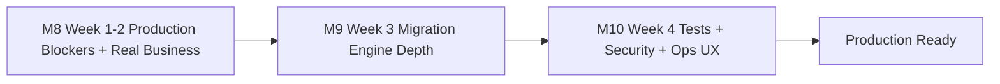

# 控制台生产硬化 M8-M10 - 完整实施计划

## A. 背景与目标

M1-M7 已交付前端 4 Tab 控制台 + 后端 18 端点 + 8 元数据表 + ORM 迁移引擎骨架 + 审计接入 + 运维手册。当前发现的剩余缺口分 5 类共 30+ 项，结合 1 个月内上生产的硬约束，按以下三步走：



每个里程碑严格闭环：编码 → `dotnet build` 0 警告 → xUnit 通过 → 前端 lint+i18n+build 通过 → 文档同步更新 → 进入下一里程碑。

## B. M8 - 生产阻塞 + 业务真实性（Week 1-2，10 工作日）

### B.1 生产阻塞 3 项（必须最先修，1.5 天）

**A1 SetupModeMiddleware 放行控制台路径（半天）**

- 修改 [`src/backend/Atlas.Presentation.Shared/Middlewares/SetupModeMiddleware.cs`](src/backend/Atlas.Presentation.Shared/Middlewares/SetupModeMiddleware.cs) 第 19 行 `AllowedPathPrefixes`：

```csharp
private static readonly string[] AllowedPathPrefixes =
[
    "/api/v1/setup",
    "/api/v1/setup-console",
    "/health",
    "/internal/health"
];
```

- 同步在 setup ready 后的分支保留控制台放行（已登录场景重新打开控制台）。
- 新增 `SetupModeMiddlewareTests`：验证 setup 未完成时 `/api/v1/setup-console/auth/recover` 返回 200 而非 503。

**A2 数据迁移连接串加密（IDataProtector，1 天）**

- 复用 [`src/backend/Atlas.Infrastructure/Security/DataProtectionService.cs`](src/backend/Atlas.Infrastructure/Security/DataProtectionService.cs)。
- 修改 [`OrmDataMigrationService.CreateJobAsync`](src/backend/Atlas.Infrastructure/Services/SetupConsole/OrmDataMigrationService.cs)：写库前 `Protect(connectionString)`；读库后 `Unprotect`。
- 新增 `DataProtectionPurpose = "setup-console.migration-job"`。
- xUnit：测试加密往返；测试解密失败时报错而不是泄漏密文。

**A3 BootstrapAdmin 密码哈希比对 + ConsoleToken 持久化（2 天）**

- 修改 [`SetupRecoveryKeyService.TryBootstrapAdminCredentials`](src/backend/Atlas.Infrastructure/Services/SetupConsole/SetupRecoveryKeyService.cs)：用 `IPasswordHasher.VerifyHashedPassword` 替换 `Equals`；启动时把配置中的明文密码哈希后写入 `SystemSetupState.BootstrapPasswordHash`（新增字段）。
- 新增 `setup_console_token` 表（替代内存 `ActiveTokens`）：`Id / TenantId / TokenHash / IssuedAt / ExpiresAt / Permissions / RevokedAt`，注册到 `AtlasOrmSchemaCatalog`。
- `SetupRecoveryKeyService` 改为持久化版：颁发时写库，校验时查库 + 过期判断 + 滑动过期，撤销时标记 RevokedAt。
- 多实例部署时所有实例共享 token 生命周期。

### B.2 业务真实性 5 项（让控制台 6 步真正完成系统初始化，5 天）

**B1 RunSeedAsync 真实写种子（2 天）**

- 拆 [`DatabaseInitializerHostedService.RunCoreAsync`](src/backend/Atlas.Infrastructure/Services/DatabaseInitializerHostedService.cs) 的"种子"段为 4 个 public 幂等方法：`SeedRolesAndPermissionsAsync` / `SeedMenusAsync` / `SeedDictionariesAsync` / `SeedDefaultModelConfigsAsync`。
- 每个方法接受 `forceReapply` 参数；已存在的种子默认跳过，`forceReapply=true` 时 upsert（不删除外键依赖数据）。
- 引入种子版本表 `setup_seed_bundle_log`：`Bundle / Version / AppliedAt`，幂等防重复。
- `SetupConsoleService.RunSeedAsync` 调度上述 4 个方法并写日志；遇 `bundleVersion=v2` 走增量补种逻辑。

**B2 RunBootstrapUserAsync 真实创建/更新用户（1 天）**

- 注入 `IUserAccountService` + `IRoleService`（从 [`src/backend/Atlas.Application/Identity/Abstractions/`](src/backend/Atlas.Application/Identity/Abstractions/)）。
- 控制台填的 `username/password/tenantId/optionalRoleCodes` 真实落库：用户已存在则更新密码与角色绑定 + 写 `PasswordHistory`；用户不存在则创建用户 + 分配 SuperAdmin/Admin + 可选角色 + 绑定到根部门。
- B5 在此一并补：写 `PasswordHistory.IsBootstrap=true` 标志位，登录后续认证检测到该位时跳改密页（前端补 `/me/change-password` 强制重定向）。

**B3 RunDefaultWorkspaceAsync 真实创建工作空间（2 天）**

- 注入 `IWorkspaceService` + `IWorkspaceMemberService` + `IWorkspaceRoleService`（从 [`Atlas.Application.Coze.Abstractions`](src/backend/Atlas.Application/Coze/Abstractions/)）。
- 真实创建 `Workspace` + 默认 3 个 `WorkspaceRole`（Owner/Editor/Viewer）+ Owner 用户的 `WorkspaceMember` 关系。
- 可选执行 `applyDefaultPublishChannels` → 写 `WorkspacePublishChannel`（web + api 两条默认渠道）。
- 可选执行 `applyDefaultModelStub` → 写 `ModelConfig` 一条占位（需要用户后续填 API key）。

**B4 SetupConsoleCatalogSummaryDto 真实拼装（0.5 天）**

- 修改 [`SetupConsoleService.GetCatalogSummaryAsync`](src/backend/Atlas.Infrastructure/Services/SetupConsole/SetupConsoleService.cs)：遍历 `AtlasOrmSchemaCatalog.RuntimeEntities`，按 `Type.Namespace` 模块归类（`Atlas.Domain.Identity.*` → identity-permission 等）。
- `EntityCount` 真实计数；`MissingCriticalTables` 已通过 `AtlasOrmSchemaCatalog.GetMissingCriticalTableNames` 获取。
- 增加 `GET /api/v1/setup-console/catalog/entities/{category}/details` 端点返回该类下所有实体名（供 E5 下钻 UI 使用）。

### B.3 验证

- `dotnet build Atlas.SecurityPlatform.slnx` 0 警告
- `dotnet test --filter "FullyQualifiedName~SetupConsole"` 全过（新增 ~25 个用例）
- `pnpm run lint:app-web` + `i18n:check` + 5 spec 单测全过
- 在干净 SQLite 上从 0 起跑控制台 6 步，验证：真实创建了 admin 用户（能用新密码 JWT 登录） / 真实建了 default workspace（业务页面能看到） / 重启后 ConsoleToken 仍有效（A3 持久化） / 首装时控制台可访问（A1 中间件放行）

## C. M9 - ORM 迁移引擎深度（Week 3，5 工作日）

### C.1 拓扑排序（1.5 天）

- 新建 [`src/backend/Atlas.Infrastructure/Services/SetupConsole/EntityTopologySorter.cs`](src/backend/Atlas.Infrastructure/Services/SetupConsole/EntityTopologySorter.cs)。
- 算法：基于 SqlSugar `[Navigate]` 特性 + 字段命名约定（`XxxId` 推断引用关系）+ 反射构建 DAG，做 Kahn 算法拓扑排序。
- 环依赖（如 `Workspace ↔ WorkspaceMember`）：先建表，全部插入再建外键约束（如目标库强制启用），或在 SQLite 下临时关闭 `PRAGMA foreign_keys`。
- 单测：覆盖 `Tenant → UserAccount → Role → UserRole → Workspace → WorkspaceMember → Agent` 等典型路径。

### C.2 DataMigrationCheckpoint 真实续跑（1 天）

- 修改 [`OrmDataMigrationService.StartJobAsync`](src/backend/Atlas.Infrastructure/Services/SetupConsole/OrmDataMigrationService.cs)：开始前先查 `DataMigrationCheckpoint` 表，已有 checkpoint 的实体从 `LastBatchNo + 1` 续跑；未开始的实体走全量。
- `RetryJobAsync` 不重置 checkpoint 表；从最后失败的 batch 续跑。
- 单测：构造一个跑到第 N 批失败的 job，retry 后只跑 N+1 之后的批次。

### C.3 抽样字段哈希校验（1 天）

- 修改 `ValidateJobAsync`：对每个实体随机抽 5%（最少 10 行最多 100 行）→ 序列化关键字段（`Id` + `TenantIdValue` + `CreatedAt` 等稳定字段）→ SHA256 → 对比源/目标。
- 不匹配的样本 ID 写入 `DataMigrationSamplingDiffDto.MismatchedExamples`。
- 报告 UI 已就位（M4），无需前端改动。

### C.4 跨引擎类型适配修正（0.5 天）

- 扫描 `Atlas.Domain*/**/Entities/**/*.cs` 的硬编码 `[SugarColumn(ColumnDataType=...)]`，列出 ~10 处需修。
- 改为按数据库类型分发：用 SqlSugar `EntityService` 钩子在运行时按目标库类型设置列类型。

### C.5 切主真实写 appsettings.runtime.json（0.5 天）

- 修改 [`OrmDataMigrationService.CutoverJobAsync`](src/backend/Atlas.Infrastructure/Services/SetupConsole/OrmDataMigrationService.cs)：复用 [`SetupController.PersistRuntimeConfigAsync`](src/backend/Atlas.PlatformHost/Controllers/SetupController.cs) 的逻辑（抽到共享 `RuntimeConfigPersistor` 服务）。
- cutover 成功后写新连接串到 `appsettings.runtime.json`，响应中明确"需要重启 PlatformHost / AppHost 才能生效"提示（前端 banner 展示）。

### C.6 SQLite → SQLite Integration Test（0.5 天）

- 新建 [`tests/Atlas.SecurityPlatform.Tests/Integration/OrmDataMigrationIntegrationTests.cs`](tests/Atlas.SecurityPlatform.Tests/Integration/OrmDataMigrationIntegrationTests.cs)。
- 用 in-memory SQLite（或临时文件）模拟源库 + 目标库，灌入 20 条 UserAccount + 10 条 Workspace，跑完整 migration 生命周期，断言行数一致 + 抽样校验通过。
- 跨引擎 SQLite → MySQL 的 docker integration test 暂留 M11，需要 docker compose 配置。

### C.7 验证

- `dotnet build` 0 警告 + `dotnet test --filter "FullyQualifiedName~SetupConsole|Migration"` 全过（含 ~10 个 integration 用例）
- 手测：用 SQLite → SQLite 跑完整迁移，校验报告通过 + cutover 后 appsettings.runtime.json 更新

## D. M10 - 测试 + 安全 + 运维 UX 闭环（Week 4，5 工作日）

### D.1 Playwright E2E 真实跑通（0.5 天）

- 启动 PlatformHost (5001) + AppHost (5002) + AppWeb (5181)。
- `pnpm run test:e2e:app:only --grep "Setup Console"` 跑 4 个 spec 共 18 个用例：
  - [`setup-console-auth.spec.ts`](src/frontend/e2e/app/setup-console-auth.spec.ts) 5 case
  - [`setup-console-overview.spec.ts`](src/frontend/e2e/app/setup-console-overview.spec.ts) 7 case
  - [`setup-console-system-init.spec.ts`](src/frontend/e2e/app/setup-console-system-init.spec.ts) 3 case
  - [`setup-console-migration.spec.ts`](src/frontend/e2e/app/setup-console-migration.spec.ts) 3 case
- 修复 mock 在真实环境下的兼容问题（如 hardcoded recovery key 在真后端不工作 → D5 切换开关解决）。

### D.2 SetupConsoleService Integration Test（1 天）

- 新建 `SetupConsoleServiceIntegrationTests.cs`，用 in-memory SQLite + 真实 `SetupConsoleService` 实例，覆盖：6 步顺序执行从 not_started 到 completed / 已 succeeded 步骤再调返回历史结果不重复执行 / 失败 step 的 retry 路径 / reopen 从 dismissed 回 not_started。
- 同时补 `SetupRecoveryKeyServiceTests`：恢复密钥校验 + token 颁发 + token 过期（D3）。

### D.3 IP 限流（1 天）

- 修改 [`SetupConsoleAuthController.Recover`](src/backend/Atlas.PlatformHost/Controllers/SetupConsoleAuthController.cs)：接入 `Atlas.Core.Resilience.IRateLimiter`（已有），按 IP 5 次/15 分钟限流，超过返回 `429 RECOVERY_KEY_RATE_LIMITED`。
- 失败计数日志写 `AuditRecord`，便于安全运营。

### D.4 审计 IP/UA 真实记录（0.5 天）

- 在 [`SetupConsoleController`](src/backend/Atlas.PlatformHost/Controllers/SetupConsoleController.cs) + `DataMigrationController` 内统一从 `HttpContext.Connection.RemoteIpAddress` + `Request.Headers.UserAgent` 提取，传给 `SetupConsoleAuditWriter.WriteAsync(... ipAddress: ..., userAgent: ...)`。
- 抽出 `SetupConsoleAuditContext` 辅助类减少重复代码。

### D.5 前端 mock 切真接口开关（0.5 天）

- 新建 [`src/frontend/apps/app-web/src/services/mock/mock-switch.ts`](src/frontend/apps/app-web/src/services/mock/mock-switch.ts)：

```ts
export function shouldUseRealConsoleApi(): boolean {
  if (typeof window === "undefined") return false;
  return window.localStorage.getItem("atlas_setup_console_real") === "1";
}
```

- 修改 4 个 mock 文件入口，开关打开时委托到 [`setupConsoleApi`](src/frontend/apps/app-web/src/services/api-setup-console.ts) 真接口。
- 默认关闭（保持 Playwright E2E 不破坏）；UI 设置面板提供开关。

### D.6 平台菜单入口（0.5 天）

- 修改 [`src/frontend/apps/app-web/src/app/layouts/workspace-shell.tsx`](src/frontend/apps/app-web/src/app/layouts/workspace-shell.tsx)：在已登录的平台管理菜单下加"系统初始化控制台"项，仅 SuperAdmin 可见，点击进入 `/setup-console`（仍需走二次认证）。
- i18n key `cozeMenuSetupConsole`。

### D.7 Repair Tab 内容（0.5 天）

- 替换 [`setup-console-page.tsx`](src/frontend/apps/app-web/src/app/pages/setup-console/setup-console-page.tsx) 中 repair tab 的 placeholder 为 4 个实际操作按钮：
  - "重新打开初始化"按钮（调 `system/reopen`）
  - "关闭引导"按钮（调 transition → dismissed）
  - "强制重置 v1→v2"按钮（调 `system/seed?bundleVersion=v2&forceReapply=true`）
  - "重新生成恢复密钥"按钮（调 `system/bootstrap-user?generateRecoveryKey=true&keepUser=true`）

### D.8 实体目录 UI 下钻（0.5 天）

- 修改 [`dashboard-tab.tsx CatalogCard`](src/frontend/apps/app-web/src/app/pages/setup-console/dashboard-tab.tsx)：每个分类点击展开列出实体名表格，调 B4 新增的 `/catalog/entities/{category}/details` 端点。

### D.9 上生产 checklist 文档（0.5 天）

- 新增 [`docs/setup-console-production-checklist.md`](docs/setup-console-production-checklist.md)：
  - 启动前必检：`appsettings.json` 中 `BootstrapAdmin.Password` 已替换、`Database.Encryption.Enabled` 已开、备份目录权限正确
  - 首装后必做：恢复密钥已写入运维密钥库、首次登录已改密、审计日志正常滚动
  - 跨库迁移前必检：源库已备份、目标库账户权限验证、变更窗口已通告
  - 切主后必做：appsettings.runtime.json 已 commit、PlatformHost+AppHost 已重启、业务页面回归

### D.10 验证

- `pnpm run test:e2e:app:only --grep "Setup Console"` 4 spec 全过
- `dotnet test` 全套绿（M8+M9+M10 累积 ~50 个新单测 + ~10 个 integration test）
- `pnpm run build:app-web` + `dotnet build Atlas.SecurityPlatform.slnx` 各 0 警告
- 文档：`docs/contracts.md` 第 12 章与 M8-M10 实际实现对齐审计、`docs/setup-console-runbook.md` 与 `docs/setup-console-production-checklist.md` 终版

## E. 总体里程碑闭环规则

- 每个里程碑结束默认自动进下一个，遇阻塞才停（沿用 M1-M7 节奏）
- 每个里程碑都先写代码 → 立即跑 build/test → 不通过不进下一个
- 每个里程碑最后一步：`docs/contracts.md` 与代码精确对齐审计，发现漂移立即修文档（不改代码）

## F. 不在范围内（明确推到 M11+）

- 跨引擎 SQLite → MySQL Integration Test（需要 docker compose 起 MySQL，本批以 SQLite→SQLite 充分验证算法正确性）
- Hangfire 后台执行长时间迁移（M11）
- ConsoleSession 真实身份接入审计（当前 actor=`setup-console:anonymous`；M11 接入后填真实操作人）
- AppHost 端是否提供独立 Setup Console（如果产品确认需要再做；当前只在 PlatformHost）
- 多租户控制台（当前 `_tenantProvider.GetTenantId()` 来自 BootstrapAdmin 配置；多租户场景待业务确认）

## G. 风险与依赖

- **B2/B3 强依赖现有用户/工作空间服务的接口稳定性**：需要先快速 spike 一下 `IUserAccountService` / `IWorkspaceService` 的真实签名，如果接口不通用则需要再抽接口（半天预留）
- **C1 拓扑排序的环依赖处理**：SQLite 与 MySQL 的"临时关外键"语法不一致，C4 必须先做完才能跑 C1 测试
- **A3 BootstrapAdmin 启动哈希**：需要在 PlatformHost 启动时检测密码是否已哈希，未哈希则首次启动哈希 + 写回 `appsettings.runtime.json`，避免每次重启都重哈
- **D5 mock 开关默认关闭**：保护 Playwright E2E；但需在 D1 跑 E2E 时手动打开真接口开关（或加 query param `?useRealConsole=1`）
- **整体时序**：A1/A2/A3 必须最先做（半周内完成），否则整个生产路径都被堵；B 类与 C 类可适度并行（不同开发者）

## H. 完成度展望

里程碑全部完成后，控制台达到生产可用：
- 首装、补初始化、跨库迁移、工作空间初始化全链路真实落库
- 等保 2.0 主要红线全部覆盖（连接串加密、密码哈希、审计 IP/UA、IP 限流、首登改密、恢复密钥保护）
- xUnit ~50 单测 + ~10 integration test + Playwright 4 spec 真实跑通
- 文档：契约、运维手册、上生产 checklist 三件套齐备