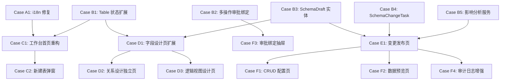

# 数据管理工作台 PRD 实施计划

## 现状摘要

### 后端已有

- **领域实体**（`Atlas.Domain/DynamicTables/Entities/`）：`DynamicTable`、`DynamicField`、`DynamicRelation`、`DynamicIndex`、`FieldPermission`、`DynamicSchemaMigration`、`MigrationRecord`
- **服务**：`DynamicTableQueryService`、`DynamicTableCommandService`、`DynamicRecordQueryService`
- **控制器**：`DynamicTablesController`（list/detail/summary/fields/relations/field-permissions）、`DynamicMigrationsController`（detect/execute/precheck）、`DynamicTableRecordsController`、`DynamicViewsController`

### 前端已有

- **7 个页面**（`src/pages/dynamic/`）：`DynamicTablesPage`、`DynamicDataWorkbenchPage`、`DataDesignerPage`（entity/relation/view/transform 模式切换）、`DynamicTableDesignPage`、`ERDCanvasPage`、`DynamicRecordsNativePage`、`DynamicTableCrudPage`
- **API 服务**：`services/dynamic-tables.ts`（完整 CRUD）
- **类型**：`types/dynamic-tables.ts`

### 关键缺口

1. `dynamicDesigner.`* i18n 命名空间在 `runtime-messages.*.ts` **完全缺失**，运行时显示未翻译 key
2. `DynamicTable.Status` 缺少 `HasUnpublishedChanges`、`Archived` 状态
3. 概览卡片只有 4 张，缺少关系数量、被引用数量
4. 审批绑定仅为单一 `ApprovalFlowDefinitionId`，未按操作（创建/更新/删除/提交）分开绑定
5. 无正式 **SchemaDraft（草稿）** 实体和生命周期
6. 无正式 **SchemaChangeTask（变更任务）** 状态机
7. 无 **影响分析服务**（字段/表被哪些页面/流程/Agent 引用）
8. 删除按钮与高频操作并列，无影响分析前置
9. 无独立 **逻辑视图（Logical DataView）** 设计页
10. 无 **CRUD 配置页**（生成状态跟踪）

---

## 依赖关系图

---

## Case 列表

### Case A1 — i18n 修复（紧急，无依赖）

**文件**：`[src/frontend/Atlas.WebApp/src/i18n/runtime-messages.zh-CN.ts](src/frontend/Atlas.WebApp/src/i18n/runtime-messages.zh-CN.ts)`、`[runtime-messages.en-US.ts](src/frontend/Atlas.WebApp/src/i18n/runtime-messages.en-US.ts)`

**目标**：补全 `DataDesignerPage.vue` 使用的所有缺失 key。

- `dynamicDesigner.centerTitle`：「数据设计中心」/ `"Data Design Center"`
- `dynamicDesigner.modeEntity`：「数据表」/ `"Tables"`
- `dynamicDesigner.modeRelation`：「关系设计」/ `"Relations"`
- `dynamicDesigner.modeView`：「数据视图」/ `"Data Views"`
- `dynamicDesigner.modeTransform`：「转换任务」/ `"Transform Jobs"`

**验收**：`npm run i18n:diff-runtime` 无新差异；页面无 key 透传显示。

---

### Case B1 — DynamicTable 状态与摘要扩展（后端）

**文件**：`[src/backend/Atlas.Domain/DynamicTables/Entities/DynamicTable.cs](src/backend/Atlas.Domain/DynamicTables/Entities/DynamicTable.cs)`、`Atlas.Application/DynamicTables/Models/DynamicTableModels.cs`、`DynamicTableQueryService.cs`

**目标**：

- 在 `DynamicTable.Status` 枚举增加 `HasUnpublishedChanges`、`Archived`
- 在 `DynamicTableSummary` DTO 增加 `RelationCount`、`ReferenceCount`（近期可从 `DynamicRelation` 表 count 得出）
- 后端新增 `PATCH /{tableKey}/archive` 与 `PATCH /{tableKey}/restore` 端点
- 删除端点前置调用 `IDynamicDeleteCheckService`（已有），不兼容时返回 `DynamicTableDeleteBlocked`

**验收**：`dotnet build` 0 错误 0 警告；归档/恢复接口测试通过（`.http` 文件）。

---

### Case B2 — 多操作级别审批绑定（后端）

**文件**：`Atlas.Domain/DynamicTables/Entities/`（新增）、`Atlas.Application/DynamicTables/`、`DynamicTablesController.cs`

**目标**：

- 新增 `DynamicTableApprovalBinding` 实体：`TableId`、`CreateFlowId`、`UpdateFlowId`、`DeleteFlowId`、`SubmitFlowId`、`Status`、`UpdatedAt`
- 保留旧 `ApprovalFlowDefinitionId`（向后兼容）
- 新增 `GET/PUT /{tableKey}/approval-binding` 端点
- 更新 `DynamicTableSummary` 增加 `ApprovalBindingSummary`（已绑定操作数、默认流程名）

**验收**：4 类操作的绑定独立读写；旧接口不 breaking。

---

### Case B3 — SchemaDraft 草稿实体与接口（后端）

**文件**：`Atlas.Domain/DynamicTables/Entities/SchemaDraft.cs`（新建）、`Atlas.Application/DynamicTables/`、`Atlas.Infrastructure/Services/`、`Atlas.WebApi/Controllers/`

**目标**：

- `SchemaDraft` 实体：`DraftId`、`AppInstanceId`、`ObjectType`（Table/Field/Index/Relation）、`ObjectId`、`ChangeType`（Create/Update/Delete）、`BeforeSnapshot`（JSON）、`AfterSnapshot`（JSON）、`RiskLevel`（Low/Medium/High）、`Status`（Pending/Validated/Published/Abandoned）、`CreatedAt`、`CreatedBy`
- 字段/索引/关系的写操作改为写入草稿而非直接改库
- `GET /api/v1/apps/{appId}/schema-drafts` — 列出当前草稿
- `POST /api/v1/apps/{appId}/schema-drafts/{draftId}/validate` — 校验
- `POST /api/v1/apps/{appId}/schema-drafts/publish` — 批量发布

**验收**：字段修改后状态变为 `HasUnpublishedChanges`；未发布草稿不影响运行态。

---

### Case B4 — SchemaChangeTask 变更任务状态机（后端）

**文件**：`Atlas.Domain/DynamicTables/Entities/SchemaChangeTask.cs`（新建）、对应 Application/Infrastructure/Controller

**目标**：

- `SchemaChangeTask` 实体状态机：`Pending` → `Validating` → `WaitingApproval`（高风险）→ `Applying` → `Applied`/`Failed` → `RolledBack`/`Cancelled`
- 接入现有 `MigrationRecord` 作为执行层
- 高风险判定规则（删表/删字段/改主键/缩窄类型）自动标记 `WaitingApproval`
- `GET/POST /api/v1/apps/{appId}/schema-change-tasks` 端点

**验收**：发布流程走状态机；失败时有 `ErrorMessage` 和 `RollbackInfo`。

---

### Case B5 — 影响分析服务（后端）

**文件**：`Atlas.Infrastructure/Services/DynamicImpactAnalysisService.cs`（新建）、对应 Application 接口

**目标**：

- `IDynamicImpactAnalysisService.AnalyzeAsync(tableKey, fieldNames[])` 
- 查询引用来源：低代码页面（`LowCodeApps`/`FormDefinitions`）、流程节点（`ApprovalFlowDefinition`）、Agent 配置（`AgentTeam`）
- 返回 `ImpactAnalysisResult`：`{ AffectedPages[], AffectedForms[], AffectedFlows[], AffectedAgents[], RiskLevel }`
- 集成到 Draft 校验与发布前检查

**验收**：修改被引用字段时，发布接口返回 `AffectedResources` 列表；无引用时正常发布。

---

### Case C1 — 工作台首页重构（前端）

**文件**：`[src/frontend/Atlas.WebApp/src/pages/dynamic/DynamicTablesPage.vue](src/frontend/Atlas.WebApp/src/pages/dynamic/DynamicTablesPage.vue)`（重构）

**目标**：

- 顶部改为标准横向页头（面包屑 + 应用选择器 + 数据源标识）
- 模式切换 Tab（表模型/关系模型/数据视图/变更记录）替代竖排标题
- 左侧树项显示：显示名 + 物理名 + 状态标签（草稿/已发布/有未发布变更/已归档）+ 引用标记
- 中央概览卡片扩展为 6 张（字段数、索引数、关系数量、数据源类型、审批绑定状态、被引用数量）
- 主操作按钮顺序：字段设计、关系设计、进入 CRUD、数据预览、审批绑定、**更多（含归档/删除）**
- 删除从主操作区移除，放入"更多"下拉，前置影响分析确认
- 空状态/无权限/异常状态骨架屏

**验收**：无 key 透传；删除操作有影响分析；状态标签正确显示。

---

### Case C2 — 新建表弹窗改进（前端）

**文件**：新建 `src/frontend/Atlas.WebApp/src/pages/dynamic/components/CreateTableModal.vue`

**目标**：

- 必填：显示名称、物理名称（自动 snake_case 转换）、描述
- 表模板类型选择：基础业务表/审批业务表/系统字典表
- 系统字段开关：默认开启 `id`、`created_at`、`updated_at`；可选 `created_by`、`updated_by`、`is_deleted`
- 创建成功后自动跳转字段设计页
- 命名冲突、非法命名即时校验

**验收**：创建成功跳转字段设计；物理名不合法时阻止提交。

---

### Case D1 — 字段设计页扩展（前端）

**文件**：`[src/frontend/Atlas.WebApp/src/pages/dynamic/DynamicTableDesignPage.vue](src/frontend/Atlas.WebApp/src/pages/dynamic/DynamicTableDesignPage.vue)`（改进）

**目标**：

- 字段表格增加列：字段名、显示名、类型、长度/精度、主键、唯一、允许空、默认值、索引、描述、**状态**（新增/修改/删除-草稿标注）
- 右侧配置面板：基础项（字段名/显示名/类型/必填/唯一/默认值/描述）+ 折叠高级项（长度/精度/枚举/正则/只读/系统字段/CRUD显示/脱敏策略）
- 顶部：保存草稿、校验、发布变更入口
- 底部折叠区：校验结果/DDL 预览（`previewDynamicTableAlter` 已有）
- 调用 `SchemaDraft` 接口而非直接 `alterDynamicTableSchema`

**验收**：字段改动写草稿；DDL 预览正确；发布后状态变 `Active`。

---

### Case D2 — 关系设计独立页（前端）

**文件**：新建/改进 `src/frontend/Atlas.WebApp/src/pages/dynamic/RelationDesignPage.vue`；更新路由 `router/index.ts`

**目标**：

- 独立路由 `/apps/:appId/data/relations`
- 中央关系列表：源表、目标表、关系类型、源字段、目标字段、级联规则
- 右侧面板：新建/编辑关系（表单式，而非 ERD 画布）
- 配置项：源表/目标表/关系类型(1:1, 1:N)/字段映射/级联规则/说明/是否用于表单联动
- 保留 ERDCanvasPage 作为预览入口（非主编辑入口）

**验收**：关系可通过表单 CRUD；ERD 入口保留；无直接 DB 改写（经草稿）。

---

### Case D3 — 逻辑视图设计页（前端）

**文件**：新建 `src/frontend/Atlas.WebApp/src/pages/dynamic/LogicalViewDesignPage.vue`；更新路由

**目标**：

- 独立路由 `/apps/:appId/data/views`
- 支持创建逻辑视图：视图名称、来源表/关系路径、输出字段选择、条件过滤、默认排序、是否只读
- 与现有 `DynamicViewsController` 对接（或新增 `Logical` 类型接口）
- 明确区分逻辑视图（配置）与原生 SQL 视图（P1，本 Case 不含 SQL 编辑器）

**验收**：逻辑视图 CRUD 完整；类型标识 `Logical`；只读属性有效。

---

### Case E1 — 变更记录与发布页（前端）

**文件**：新建 `src/frontend/Atlas.WebApp/src/pages/dynamic/SchemaChangePage.vue`；更新路由

**目标**：

- 草稿列表：对象类型/对象名/变更类型/风险级别/创建时间/创建人
- 差异对比展示（Before/After JSON diff）
- 校验结果面板（命名规则/类型合法性/下游引用兼容性）
- 影响对象清单（调用 `IDynamicImpactAnalysisService` 结果）
- 变更任务历史（`SchemaChangeTask` 状态时间轴）
- 操作：校验、发布（校验通过才可点）、回滚（Failed 时可点）
- 高风险变更红色标注，发布前二次确认

**验收**：未通过校验不可发布；高风险二次确认；任务状态轮询更新。

---

### Case F1 — CRUD 配置页（前端）

**文件**：新建 `src/frontend/Atlas.WebApp/src/pages/dynamic/CrudConfigPage.vue`；更新路由

**目标**：

- 进入逻辑：未生成则先生成骨架（调用现有生成接口），已生成则进配置
- 展示：已绑定页面清单（列表/表单/详情）、生成状态（`Generated`/`OutOfSync`）
- 字段同步建议面板：表字段变更后提示而非自动覆盖
- 跳转到页面管理/表单管理的快捷链接

**验收**：生成后展示绑定页面；字段变更显示"有字段变更，建议同步"提示。

---

### Case F2 — 数据预览页改进（前端）

**文件**：`[src/frontend/Atlas.WebApp/src/pages/system/AdvancedDataPreviewDrawer.vue](src/frontend/Atlas.WebApp/src/pages/system/AdvancedDataPreviewDrawer.vue)`（或新建独立页）

**目标**：

- 只读记录预览，分页、列筛选
- 在工作台详情区增加"数据预览"Tab 接入
- 敏感字段脱敏提示（字段有脱敏策略时）
- 无写入操作入口

**验收**：记录只读；无写入按钮；分页正确。

---

### Case F3 — 审批绑定抽屉改进（前端）

**文件**：改进现有审批绑定 UI（位于 `DynamicTablesPage` 或独立 Drawer 组件）

**目标**：

- 对接 Case B2 的多操作审批绑定接口
- 按操作展示：创建/更新/删除/提交，各自独立绑定流程定义
- 摘要卡显示：已绑定操作数、默认流程名、最近修改时间（替代"未绑定/已绑定"布尔值）
- 跳转到流程管理模块的快捷链接

**验收**：4 类操作独立绑定；摘要卡信息准确。

---

### Case F4 — 审计日志增强（后端 + 前端）

**文件**：`Atlas.Infrastructure/Services/DynamicTableCommandService.cs`、`DynamicMigrationsController.cs` 等；前端 `pages/dynamic/AuditLogPage.vue`（新建）

**目标**：

- 确保以下 11 类事件通过 `IAuditRecorder` 记录：创建表、更新字段、删除字段、创建/删除关系、创建/修改视图、绑定审批流、发布模型、归档/删除表、SQL 预览执行
- 前端审计日志查看页（P1，可先用通用 `AuditPage` 筛选 `dynamicTable` 类型）
- `.http` 测试文件验证审计事件产生

**验收**：上述操作后均可在审计日志中查到；操作人、时间、对象完整。

---

## 实施顺序

**第一周**（无依赖 + 后端基础）：A1 → B1 → B2

**第二周**（草稿机制）：B3 → B4 → B5

**第三周**（前端工作台主体）：C1 → C2 → D1

**第四周**（子设计页）：D2 → D3 → E1

**第五周**（配套功能）：F1 → F2 → F3 → F4

---

## 技术约束

- 所有后端新实体继承 `TenantEntity`，注册 DI 在 `ServiceCollectionExtensions.cs`
- 所有新写接口需要 `Idempotency-Key` + `X-CSRF-TOKEN` 头
- 高风险操作（删表/删字段/改主键/缩窄类型）自动判定并走 `WaitingApproval` 状态
- 数据库操作禁止在循环内执行，用批量查询
- 每个 Case 完成后必须更新 `docs/contracts.md` 对应章节与 `.http` 测试文件

