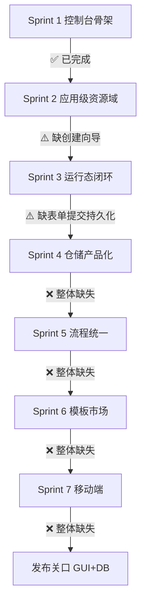

# 未实现功能补齐计划

## 当前完成状态总览

## 各 Sprint 已完成 vs 未完成

### Sprint 1 — 平台控制台骨架 ✅ 已完成

所有子项均已实现：菜单种子、ConsoleLayout/AppWorkspaceLayout、ConsolePage、路由、dynamic-router 映射、登录跳转 /console。

### Sprint 2 — 应用级资源域 ⚠️ 缺一项

- 已完成：LowCodeApp/TenantDataSource 扩展字段、AppEntityAlias 实体、sharing-policy/entity-aliases/datasource 接口、AppContextMiddleware 受控覆盖、api-core.ts X-App-Id 注入、AppSettingsPage.vue
- **未完成 S2-F1**：AppListPage.vue 仍为简单单步 Modal，无数据源绑定步骤，`createLowCodeApp` 调用未传 `dataSourceId`

### Sprint 3 — 低代码运行态 ⚠️ 缺一项

- 已完成：PageRuntimeRenderer.vue、`/apps/:appId/run/:pageKey` 路由、后端 `GetRuntimePageSchemaAsync` 服务方法、`GET /lowcode-apps/pages/{pageId}/runtime` 接口
- **未完成 S3-B3**：表单提交持久化（运行态 POST 数据到动态表记录的具体策略尚未落地）

### Sprint 4 — 仓储闭环产品化 ❌ 整体缺失

- 未完成项：
  - S4-B1: `app:admin`/`app:user` 权限码（`PermissionCodes.cs` 仅有 `apps:view`/`apps:update`）
  - S4-B2: `DynamicTable` 无 `AppId` 字段，无应用域隔离
  - S4-B3: 动态表/记录控制器无分层授权（目前均为 `SystemAdmin`）
  - S4-F1: `DynamicTablesPage.vue` 无应用筛选
  - S4-F2/F3: 审批任务应用过滤与写回监控告警

### Sprint 5 — 流程能力统一 ❌ 整体缺失

- 未完成项：
  - S5-B1: `ApprovalStep` 未在主业务 WorkflowCore 中实现（仅 demo 目录有）
  - S5-B2: `StepTypeMetadata` 无 `Supported` 字段，`GetStepTypes` 硬编码 8 种但无 `ApprovalStep`
  - S5-B3: 审批完成/拒绝事件未桥接工作流 `WaitFor`
  - S5-F1: `useWorkflowSerializer.ts` 强制单链路，尚未支持分支
  - S5-F2: 设计器无审批步骤节点 UI
  - S5-F3: 无"规划中"徽标

### Sprint 6 — 模板市场 ❌ 整体缺失

- 未完成项：
  - S6-B1: `TemplateSeedDataService.cs` 不存在，无内置模板种子
  - S6-B2: 模板查询无 `tags`/`version` 筛选
  - S6-B3: `POST /{id}/instantiate` 存在但未对接应用/页面创建流程
  - S6-F1: `TemplateMarketPage.vue` 不存在
  - S6-F2: 无"从模板创建"入口
  - S6-F3: 无"保存为模板"入口

### Sprint 7 — 移动端 ❌ 整体缺失

- 所有子项均未开始

## 实施任务拆分（按优先级排序）

### P0 优先：Sprint 2 补齐

**S2-F1 三步创建向导**

- 修改 `[src/frontend/Atlas.WebApp/src/pages/lowcode/AppListPage.vue](src/frontend/Atlas.WebApp/src/pages/lowcode/AppListPage.vue)`
- 或新增 `pages/console/components/AppCreateWizard.vue`（三步：基本信息 → 数据源 → 共享策略）
- `createLowCodeApp` 调用补入 `dataSourceId`、`useSharedUsers/Roles/Departments`
- 同步更新 `[Bosch.http/LowCodeApps.http](src/backend/Atlas.WebApi/Bosch.http/LowCodeApps.http)`

### P0 优先：Sprint 3 补齐

**S3-B3 表单提交持久化**

- 运行态页面表单提交路由到动态表记录 API (`POST /api/v1/dynamic-table-records/{tableKey}`)
- 若需专用 `PageRuntimeController`，新增 `src/backend/Atlas.WebApi/Controllers/PageRuntimeController.cs`（基于已有 `LowCodeAppQueryService`）
- 更新/新增 `Bosch.http/PageRuntime.http`

### P1 优先：Sprint 4 全量实现

**S4-B1 权限码扩展**

- 修改 `[src/backend/Atlas.Application/Identity/PermissionCodes.cs](src/backend/Atlas.Application/Identity/PermissionCodes.cs)` 新增 `app:admin`/`app:user`
- 修改 `WebApi/Authorization/PermissionPolicies.cs`
- 修改 `DatabaseInitializerHostedService.cs` 补入权限/菜单种子

**S4-B2/B3 动态表 AppId 隔离**

- 修改 `[src/backend/Atlas.Domain/DynamicTables/Entities/DynamicTable.cs](src/backend/Atlas.Domain/DynamicTables/Entities/DynamicTable.cs)` 新增 `AppId` 可空字段
- 修改 `Atlas.Infrastructure/Repositories/DynamicTableRepository.cs` 附加 AppId 过滤条件
- 修改 `DynamicTablesController.cs`/`DynamicTableRecordsController.cs` 分层授权

**S4-F1/F2/F3 前端**

- `DynamicTablesPage.vue` 新增应用下拉筛选
- `ApprovalTasksPage.vue` 新增应用过滤器
- `WritebackMonitorPage.vue` 加入重试策略与告警配置

### P1 优先：Sprint 5 全量实现

**S5-B1 ApprovalStep**

- 参考 `demo/Atlas.WorkflowDemo/Steps/ApprovalStep.cs`，在主业务 WorkflowCore 中新增 `ApprovalStep`
- 修改 `WorkflowController.GetStepTypes()` 新增 `ApprovalStep` 条目

**S5-B2 StepTypeMetadata.Supported**

- 修改 `[src/backend/Atlas.Application.Workflow/Models/StepTypeMetadata.cs](src/backend/Atlas.Application.Workflow/Models/StepTypeMetadata.cs)` 新增 `Supported` 属性
- 硬编码列表：当前 8 种设 `Supported=true`，`ApprovalStep` 在 S5-B1 完成后设 `true`

**S5-B3 审批事件桥接**

- 新增 `IDomainEventHandler<ApprovalInstanceDomainEvent>` 将审批完成/拒绝事件桥接到工作流 `WaitFor`

**S5-F1/F2/F3 前端**

- `useWorkflowSerializer.ts` 放宽限制，支持 `If` 分支（保留不支持节点的发布拦截）
- `WorkflowDesignerPage.vue` 新增审批步骤节点配置 UI
- 节点面板对 `Supported=false` 的类型显示"规划中"徽标

### P1 优先：Sprint 6 全量实现

**S6-B1 模板种子服务**

- 新增 `[src/backend/Atlas.Infrastructure/Services/TemplateSeedDataService.cs](src/backend/Atlas.Infrastructure/Services/TemplateSeedDataService.cs)`
- 修改 `DatabaseInitializerHostedService.cs` 调用种子服务

**S6-B2 模板查询增强**

- 修改 `TemplatesController.cs` 查询参数增加 `tags`/`version`
- 修改 `ComponentTemplateQueryService.cs` 实现过滤逻辑

**S6-B3 模板实例化对接创建流程**

- `POST /{id}/instantiate` 已存在，需在前端创建向导中接入

**S6-F1/F2/F3 前端**

- 新增 `[src/frontend/Atlas.WebApp/src/pages/lowcode/TemplateMarketPage.vue](src/frontend/Atlas.WebApp/src/pages/lowcode/TemplateMarketPage.vue)`
- AppListPage/AppBuilderPage 新增"从模板创建"入口（调用 instantiate）
- AppBuilderPage 新增"保存为模板"入口（调用 POST /templates）

### P2：Sprint 7 移动端适配

**S7-B1/B2**

- 审批/通知 API 兼容移动端参数
- 站内通知 + 深链跳转

**S7-F1/F2/F3**

- 运行态 AMIS `deviceMode=mobile` 适配
- 审批待办/详情移动布局优化
- 通知点击跳转审批处理页

## 关键文件路径速查

- 权限码: `[src/backend/Atlas.Application/Identity/PermissionCodes.cs](src/backend/Atlas.Application/Identity/PermissionCodes.cs)`
- 动态表实体: `[src/backend/Atlas.Domain/DynamicTables/Entities/DynamicTable.cs](src/backend/Atlas.Domain/DynamicTables/Entities/DynamicTable.cs)`
- 工作流步骤类型: `[src/backend/Atlas.Application.Workflow/Models/StepTypeMetadata.cs](src/backend/Atlas.Application.Workflow/Models/StepTypeMetadata.cs)`
- 工作流控制器: `[src/backend/Atlas.WebApi/Controllers/WorkflowController.cs](src/backend/Atlas.WebApi/Controllers/WorkflowController.cs)`
- 数据库初始化: `[src/backend/Atlas.Infrastructure/Services/DatabaseInitializerHostedService.cs](src/backend/Atlas.Infrastructure/Services/DatabaseInitializerHostedService.cs)`
- 应用列表页: `[src/frontend/Atlas.WebApp/src/pages/lowcode/AppListPage.vue](src/frontend/Atlas.WebApp/src/pages/lowcode/AppListPage.vue)`
- 工作流序列化器: `[src/frontend/Atlas.WebApp/src/composables/useWorkflowSerializer.ts](src/frontend/Atlas.WebApp/src/composables/useWorkflowSerializer.ts)`

