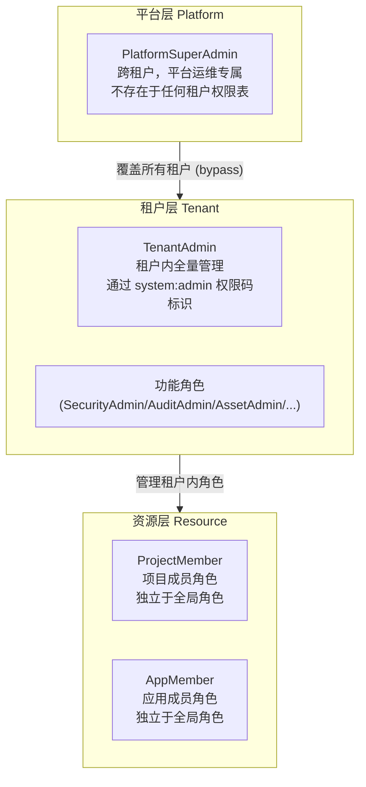
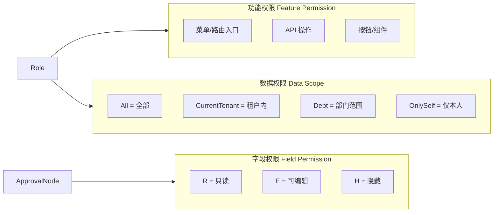
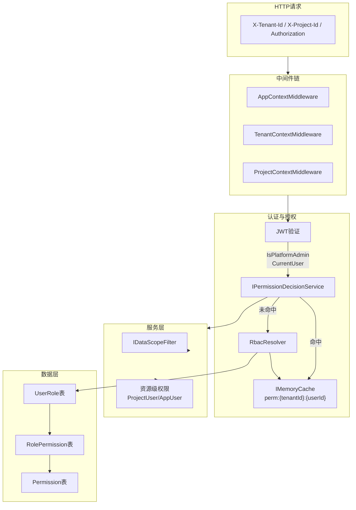

# 权限体系架构重设计

## 一、现状问题汇总


| #   | 问题                                                  | 位置                                     |
| --- | --------------------------------------------------- | -------------------------------------- |
| 1   | Admin 绕过全部权限校验，SuperAdmin 反而走查表，语义倒置                | `PermissionAuthorizationHandler.cs:30` |
| 2   | 用户角色存两处（UserAccount.Roles 字符串 + UserRole 表），可能不同步   | `RbacResolver.cs`                      |
| 3   | 每次鉴权三次 DB 查询，无缓存                                    | `RbacResolver.cs`                      |
| 4   | `DataScopeType.All=0` 对任意角色有效，缺平台级 SuperAdmin 专属校验  | `DataScopeFilter.cs`                   |
| 5   | 数据权限未覆盖资产、告警等模块                                     | 多个 QueryService                        |
| 6   | 接口权限粒度不足，告警、审批运行时等仅 `[Authorize]`                   | 多个 Controller                          |
| 7   | 角色种子数据"一刀切"赋全量权限，违反最小授权原则                           | `DatabaseInitializerHostedService.cs`  |
| 8   | 权限码体系缺失：`assets:view/update/delete`、审批运行时权限         | `PermissionCodes.cs`                   |
| 9   | 无统一权限决策点（PDP），校验逻辑散落在 Controller/Middleware/Service | 全局                                     |
| 10  | 权限变更无审计日志                                           | 全局                                     |


---

## 二、新权限架构总览

### 2.1 三层主体模型




**三层主体的区分方式：**

- **PlatformSuperAdmin**：`UserAccount.IsPlatformAdmin = true`（新增字段），JWT Claim 中携带 `is_platform_admin=true`，与租户 ID 解耦
- **TenantAdmin**：拥有 `system:admin` 权限码的普通租户角色，与普通角色无结构差异，仅权限集不同
- **普通用户**：从 `UserRole` 表获取角色 → 权限

### 2.2 权限三层模型




### 2.3 资源级权限

资源级权限通过独立的成员角色表实现，**不依赖全局 RBAC**：


| 资源         | 成员表               | 成员角色枚举                                |
| ---------- | ----------------- | ------------------------------------- |
| 项目 Project | `ProjectUser`（已有） | `Owner / Manager / Member / ReadOnly` |
| 应用 App     | `AppUser`（新增）     | `Owner / Manager / Member`            |


资源内操作权限由成员角色决定，独立于全局权限码体系。

### 2.4 统一权限决策点（PDP）

新增 `IPermissionDecisionService`（PDP），所有权限校验必须通过它，禁止直接在业务代码中判断角色字符串：

```
HTTP请求 → PermissionPolicyProvider
         → PermissionRequirement
         → PermissionAuthorizationHandler
         → IPermissionDecisionService (PDP)  ← 唯一决策入口
              ├── IsPlatformAdmin? → Succeed
              ├── RbacCache.GetPermissions() → 命中? → 判断
              └── RbacResolver.GetPermissionCodes() → 存入Cache → 判断
```

---

## 三、详细实施计划

### Phase 1：主体模型分层（后端 Domain + Infrastructure）

#### 1.1 UserAccount 新增 IsPlatformAdmin 字段

- 文件：`src/backend/Atlas.Domain/Identity/Entities/UserAccount.cs`
- 新增 `public bool IsPlatformAdmin { get; private set; }` 字段
- 提供 `SetPlatformAdmin(bool value)` 方法
- 数据库 Schema 通过 SqlSugar CodeFirst 自动更新

#### 1.2 JWT 携带平台管理员标识

- 文件：`src/backend/Atlas.Infrastructure/Services/JwtAuthTokenService.cs`
- 登录时若 `UserAccount.IsPlatformAdmin == true`，在 JWT Claim 中加入 `is_platform_admin=true`

#### 1.3 CurrentUserInfo 扩展

- 文件：`src/backend/Atlas.Core/Identity/CurrentUserInfo.cs`
- 新增 `bool IsPlatformAdmin` 字段，从 JWT Claim 解析
- 移除 `Roles`（只保留用于兼容，后续不再做业务判断），禁止在 Handler 外部直接判断 `user.Roles.Contains("Admin")`

#### 1.4 移除 UserAccount.Roles 字符串字段（消除双重存储）

- 文件：`src/backend/Atlas.Domain/Identity/Entities/UserAccount.cs`
- 将 `Roles` 字段标记为 `[Obsolete]` 并在下一阶段移除
- 文件：`src/backend/Atlas.Infrastructure/Services/RbacResolver.cs`
- `GetRoleCodesAsync` 只从 `UserRole` 表查询，移除从 `account.Roles` 读取的逻辑
- 涉及的 `UserCommandService` 角色更新操作同步清理

---

### Phase 2：统一 PDP + 鉴权缓存

#### 2.1 新增 IPermissionDecisionService（PDP 接口）

- 新建文件：`src/backend/Atlas.Application/Identity/Abstractions/IPermissionDecisionService.cs`

```csharp
public interface IPermissionDecisionService
{
    // 全局功能权限判断
    Task<bool> HasPermissionAsync(long userId, TenantId tenantId, string permissionCode, CancellationToken ct = default);
    // 资源级权限判断（项目/应用）
    Task<bool> HasResourcePermissionAsync(long userId, TenantId tenantId, ResourceType resourceType, long resourceId, ResourceAction action, CancellationToken ct = default);
    // 清除指定用户的权限缓存
    void InvalidateCache(TenantId tenantId, long userId);
}
```

#### 2.2 PDP 实现（含内存缓存）

- 新建文件：`src/backend/Atlas.Infrastructure/Services/PermissionDecisionService.cs`
- 使用 `IMemoryCache`，缓存键：`perm:{tenantId}:{userId}`，TTL：5 分钟
- PlatformAdmin → 直接返回 true
- 命中缓存 → 直接返回
- 未命中 → 查 `RbacResolver` → 存入缓存 → 返回

#### 2.3 PermissionAuthorizationHandler 重构

- 文件：`src/backend/Atlas.WebApi/Authorization/PermissionAuthorizationHandler.cs`
- 移除直接判断 `user.Roles.Contains("Admin")` 的逻辑
- 改为调用 `IPermissionDecisionService.HasPermissionAsync`

#### 2.4 权限变更时主动清缓存

- 文件：`src/backend/Atlas.Infrastructure/Services/RbacCommandService.cs` 或 `UserCommandService`
- 在角色分配/权限变更的写操作完成后，调用 `IPermissionDecisionService.InvalidateCache`

---

### Phase 3：权限码体系补齐

#### 3.1 补充 PermissionCodes

- 文件：`src/backend/Atlas.Application/Identity/PermissionCodes.cs`
- 新增权限码：


| 新权限码                     | 说明          |
| ------------------------ | ----------- |
| `assets:view`            | 资产查看        |
| `assets:update`          | 资产更新        |
| `assets:delete`          | 资产删除        |
| `alert:view`             | 告警查看        |
| `alert:update`           | 告警更新（处置）    |
| `approval:flow:view`     | 审批流查看       |
| `approval:task:view`     | 我的审批任务      |
| `approval:instance:view` | 全部实例查看（管理员） |
| `visualization:view`     | 可视化查看       |


#### 3.2 补充 PermissionPolicies

- 文件：`src/backend/Atlas.WebApi/Authorization/PermissionPolicies.cs`
- 同步新增上述权限码对应的策略常量

#### 3.3 Controller 权限细化


| Controller                  | 变更                                             |
| --------------------------- | ---------------------------------------------- |
| `AssetsController`          | GET 列表/详情 → `AssetsView`；GET 详情 → `AssetsView` |
| `AlertController`           | GET 列表/详情 → `AlertView`；PUT 处置 → `AlertUpdate` |
| `ApprovalFlowsController`   | GET 列表 → `ApprovalFlowView`                    |
| `ApprovalTasksController`   | GET 我的任务 → `ApprovalTaskView`                  |
| `ApprovalRuntimeController` | GET 实例列表 → `ApprovalInstanceView`              |
| `VisualizationController`   | GET 中心/列表 → `VisualizationView`                |


---

### Phase 4：资源级权限（应用成员）

#### 4.1 AppUser 实体（新增）

- 新建文件：`src/backend/Atlas.Domain.{Apps}/Entities/AppUser.cs`
- 字段：`TenantIdValue`、`AppId`、`UserId`、`MemberRole`（枚举：Owner/Manager/Member）

#### 4.2 AppUser 服务接口与实现

- 新建 `IAppUserRepository`、`AppUserRepository`
- 提供 `IsAppMemberAsync(tenantId, appId, userId)` 方法

#### 4.3 AppContextMiddleware 扩展

- 文件：`src/backend/Atlas.WebApi/Middlewares/AppContextMiddleware.cs`
- 当应用开启成员模式时（新增配置项 `EnableAppMemberScope`），验证用户是否为该应用成员

#### 4.4 ProjectMember 角色枚举规范化

- 文件：`src/backend/Atlas.Domain.{Project}/Entities/ProjectUser.cs`（若无则新增）
- 增加 `MemberRole` 枚举字段：`Owner / Manager / Member / ReadOnly`
- 在 `ProjectContextMiddleware` 中将成员角色注入 `ProjectContext`，供 Service 层按需判断

---

### Phase 5：数据权限修复与覆盖

#### 5.1 修复 DataScope All 的授权约束

- 文件：`src/backend/Atlas.Infrastructure/Services/DataScopeFilter.cs`
- 在 `GetEffectiveScopeAsync` 中：若结果为 `All` 且当前用户非 `IsPlatformAdmin`，则降级为 `CurrentTenant`，防止普通管理员通过角色配置获取超级范围

```csharp
var scope = roles.Min(r => r.DataScope);
if (scope == DataScopeType.All && !currentUser.IsPlatformAdmin)
    scope = DataScopeType.CurrentTenant;
return scope;
```

#### 5.2 DataScope 部门范围实现

- 文件：`src/backend/Atlas.Infrastructure/Services/DataScopeFilter.cs`
- 补充 `CurrentDept`、`CurrentDeptAndBelow`、`CustomDept` 的实现逻辑：
  - 查当前用户所在部门 ID
  - `CurrentDept`：返回该部门 ID 列表
  - `CurrentDeptAndBelow`：递归查子部门
  - `CustomDept`：从 `Role.CustomDeptIds`（需新增字段）中读取

#### 5.3 数据权限接入覆盖

- 以下 QueryService 需接入 `IDataScopeFilter`：
  - `AlertQueryService`（新增数据权限过滤）
  - `AssetQueryService`（新增数据权限过滤）
  - `ApprovalInstanceQueryService`（区分「我的实例」与「全部实例」）
  - `AuditQueryService`（已有，验证完整性）
  - `UserQueryService`（已有，验证完整性）

---

### Phase 6：角色种子数据最小化

#### 6.1 系统内置角色权限矩阵

- 文件：`src/backend/Atlas.Infrastructure/Services/DatabaseInitializerHostedService.cs`
- 废弃"全角色赋全量权限"逻辑，改为按角色职能分配：


| 角色                        | 权限集                                            |
| ------------------------- | ---------------------------------------------- |
| PlatformSuperAdmin        | 不存在于权限表，通过 `IsPlatformAdmin` 标识                |
| TenantAdmin（system:admin） | 全量租户权限                                         |
| SecurityAdmin             | `alert:view/update`、`assets:view`、`audit:view` |
| AuditAdmin                | `audit:view`、`loginlog:view`                   |
| AssetAdmin                | `assets:view/create/update/delete`             |
| ApprovalAdmin             | `approval:flow:*`、`approval:instance:view`     |


---

### Phase 7：权限变更审计

#### 7.1 权限变更审计事件

- 在以下操作完成后写入 `IAuditWriter`：
  - 角色分配给用户（`AssignRolesToUser`）
  - 权限分配给角色（`AssignPermissionsToRole`）
  - 数据权限（DataScope）变更
  - 项目/应用成员增删
- 审计字段：`actor`、`action`（如 `role.assign`）、`targetUser/Role/Project`、`detail`（变更前后权限差异 JSON）

---

### Phase 8：前端权限入口补齐

#### 8.1 路由 requiresPermission 补齐

- 文件：`src/frontend/Atlas.WebApp/src/router/index.ts`


| 路由                             | 新增权限码                    |
| ------------------------------ | ------------------------ |
| `/assets`                      | `assets:view`            |
| `/audit`                       | `audit:view`             |
| `/alert`                       | `alert:view`             |
| `/approval/flows`              | `approval:flow:view`     |
| `/approval/designer/:id?`      | `approval:flow:create`   |
| `/approval/tasks`              | `approval:task:view`     |
| `/approval/instances`          | `approval:instance:view` |
| `/system/notifications`        | `notification:view`      |
| `/visualization/center`        | `visualization:view`     |
| `/visualization/designer/:id?` | `visualization:view`     |
| `/visualization/runtime`       | `visualization:view`     |
| `/visualization/governance`    | `visualization:view`     |


#### 8.2 菜单权限控制补齐

- 文件：`src/frontend/Atlas.WebApp/src/layouts/MainLayout.vue`
- 安全运营、审批中心、可视化中心、通知中心、AMIS 管理 加权限控制

#### 8.3 首页快捷卡片按权限过滤

- 文件：`src/frontend/Atlas.WebApp/src/pages/HomePage.vue`
- 将 `organizationEntries`、`businessEntries`、`securityEntries` 改为计算属性，按 `hasPermission` 过滤

---

### Phase 9：文档契约同步

- 文件：`docs/contracts.md`
- 补充三层主体模型说明
- 补充新权限码清单
- 补充资源级成员权限说明（ProjectMember 角色枚举）

---

## 四、完整架构数据流




---

## 五、实施顺序与优先级


| 优先级 | Phase                      | 涉及文件数 | 说明                              |
| --- | -------------------------- | ----- | ------------------------------- |
| P0  | Phase 1：主体分层               | 5     | 消除 Admin/SuperAdmin 混淆，解除双重角色存储 |
| P0  | Phase 2：统一 PDP + 缓存        | 4     | 解决每次查 DB、决策点分散问题                |
| P0  | Phase 3：权限码补齐 + Controller | 10+   | 满足等保最小授权，接口粒度达标                 |
| P1  | Phase 5：数据权限修复             | 6     | All=0 越权修复，部门范围实现               |
| P1  | Phase 6：种子数据最小化            | 1     | 角色按职能分配最小权限集                    |
| P1  | Phase 7：权限变更审计             | 3     | 等保合规审计留痕                        |
| P1  | Phase 8：前端路由/菜单/首页         | 3     | 前后端权限一致                         |
| P2  | Phase 4：应用成员权限             | 5     | 资源级权限完整闭环                       |
| P2  | Phase 9：文档同步               | 1     | 契约同步                            |


---

## 六、验收标准

- PlatformAdmin 可跨租户访问，普通 Admin 不可
- `DataScopeType.All` 只对 `IsPlatformAdmin=true` 用户生效
- 所有 API 读操作有具体权限码（无裸 `[Authorize]`）
- 权限缓存命中时无 DB 查询；角色变更后缓存自动失效
- 角色分配、权限变更操作均有审计日志
- `dotnet build` 0 errors 0 warnings

