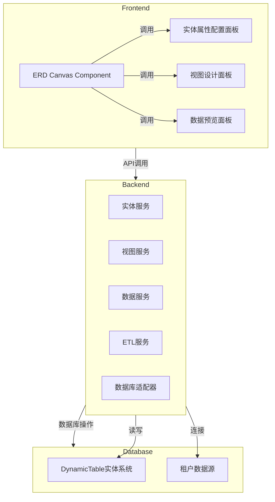

# SecurityPlatform 下一轮核心功能架构设计方案

> **文档性质**：本文档基于对 lKGreat/SecurityPlatform 代码库的深度阅读，结合并行 Wide Research 对 7 个核心方向的研究成果，为平台下一轮演进提供完整的架构设计参考。
> 
> **技术栈**：Vue 3.5 + TypeScript 5.9 + Ant Design Vue 4.2.6 + AMIS 6.0 + .NET 后端
> 
> **分析日期**：2026-03-23
> 
> **合规要求**：等保 2.0 三级

---

## 目录

1. [现有基础能力速览](#一现有基础能力速览)
2. [核心设计原则](#二核心设计原则)
3. [七大核心方向详细方案](#三七大核心方向详细方案)
   - [方向一：高级查询面板（AdvancedQueryPanel）](#方向一高级查询面板advancedquerypanel)
   - [方向二：可视化实体设计器（ERD Canvas）](#方向二可视化实体设计器erd-canvas)
   - [方向三：低代码表单变量绑定引擎](#方向三低代码表单变量绑定引擎)
   - [方向四：数据库连接器高级预览与管理](#方向四数据库连接器高级预览与管理)
   - [方向五：查询+Grid 一体化视图（QueryGrid）](#方向五查询grid-一体化视图querygrid)
   - [方向六：多设备预览与响应式设计](#方向六多设备预览与响应式设计)
   - [方向七：平台整体架构扩展与业务场景加速](#方向七平台整体架构扩展与业务场景加速)
4. [综合实施路线图](#四综合实施路线图)
5. [技术选型汇总](#五技术选型汇总)

---

## 一、现有基础能力速览

在进入下一轮设计之前，需要明确当前平台已具备的基础能力，以便在此基础上进行增量演进而非推倒重建。

| 模块/文件 | 已实现能力 | 评估 |
|---|---|---|
| `useTableView.ts` | 列配置（visible/order/width/pinned）、视图持久化（保存/另存/设默认/重置）、密度控制、合并单元格、400ms 防抖自动保存 | **核心骨架，质量较好** |
| `useCrudPage.ts` | 分页、关键词搜索、权限控制（canCreate/canUpdate/canDelete）、集成 useTableView | **通用 CRUD 逻辑，可扩展** |
| `DynamicTablesPage.vue` | AMIS schema 驱动的动态表列表页，支持按应用范围筛选 | **AMIS 渲染，轻量** |
| `DynamicTableCrudPage.vue` | AMIS schema 驱动的动态表记录 CRUD 页，支持审批流绑定 | **AMIS 渲染，功能完整** |
| `EntityModelingPanel.vue` | 轻量级字段表格编辑（无连线/关系/索引/预览/API 调用） | **雏形，需大幅升级** |
| `FormDesignerPage.vue` | AMIS Editor 集成，支持 PC/Mobile 预览切换、版本历史、撤销/重做 | **基础完整，需扩展** |
| `TenantDataSourcesPage.vue` | 数据源 CRUD（SQLite/SqlServer/MySql/PostgreSql），支持连接测试 | **基础完整，缺高级功能** |
| `services/dynamic-tables.ts` | 实体 CRUD + 记录查询 + 字段权限 + AMIS schema + 审批绑定 | **API 层完整** |
| `types/dynamic-tables.ts` | 字段类型（Int/Long/Decimal/String/Text/Bool/DateTime/Date）、查询模型（扁平 filters） | **类型定义，需扩展** |
| `components/amis/` | AMIS 渲染器封装、AMIS 编辑器、业务插件注册（atlas-dynamic-table 等） | **低代码集成基础具备** |
| `VisualizationDesignerPage.vue` | 工作流画布（画布为占位层，节点管理轻量） | **框架可借鉴，画布需重建** |
| `DataBindingEditor.vue` | 极简字段绑定控件（单向，无变量作用域） | **最小原型，需重设计** |
| `ConditionExpressionEditor.vue` | 条件拼装 UI（扁平，无嵌套，无服务端校验） | **最小原型，需重设计** |

---

## 二、核心设计原则

本轮架构演进遵循以下核心原则，以确保平台的可持续发展和业务价值最大化。

**原则一：增量演进，复用优先。** 所有新功能设计必须优先考虑对现有代码的复用，避免重复建设。例如，`useCrudPage.ts`、`useTableView.ts`、`TableViewConfig` 等核心模块应作为新功能的基础，而非被替代。

**原则二：全面可视化，连线驱动。** 用户的核心诉求是通过可视化画布操作完成复杂配置，包括实体关系连线、查询条件构建、表单字段绑定等，均应提供拖拽式的可视化交互，而非手写配置。

**原则三：低代码与原生双场景兼容。** 所有核心组件必须同时支持普通 Vue 面板场景和 AMIS 低代码场景，通过注册 AMIS 插件的方式实现复用，避免两套实现。

**原则四：等保 2.0 合规内嵌。** 安全合规要求不是事后补丁，而是架构设计的内置约束。敏感字段脱敏、操作审计、权限控制、幂等+CSRF 等安全机制必须在组件设计阶段就考虑到位。

**原则五：渐进式实施，快速交付价值。** 按照 P0/P1/P2 优先级分期实施，每期都能交付可用的业务价值，而非等到全部完成才上线。

---

## 三、七大核心方向详细方案

### 高级查询面板设计

### 1. 现有能力边界与缺口

现有`DynamicRecordQueryRequest`支持基础的分页、关键词搜索、排序以及一个简单的`filters`数组（包含`field`、`operator`和`value`）。这为高级查询面板奠定了基础，但仍存在以下主要能力边界与缺口：

1.  **可视化条件构建器**：现有`filters`数组仅支持扁平化的条件列表，无法实现`AND`/`OR`的嵌套分组逻辑，难以构建复杂的业务查询场景。
2.  **低代码场景变量支持**：当前查询机制不支持在查询表达式中设置变量或参数化查询。在低代码平台中，用户需要能够动态地将UI组件的值绑定到查询条件中，现有设计无法满足此需求。
3.  **查询器与实体字段关联**：缺乏一个直观的界面，让用户能够拖拽实体字段来构建查询条件，并形成字段间的关联。
4.  **查询结果预览**：虽然API返回查询结果，但前端没有集成的高级查询结果预览组件，用户无法在构建查询时实时查看数据变化。
5.  **QueryGrid一体化**：现有`DynamicTableCrudPage.vue`和`TableViewConfig`是独立的，查询面板与数据网格之间没有形成紧密耦合的一体化视图，用户体验不佳。
6.  **查询条件持久化**：`TableViewConfig`可能支持列配置、视图持久化、筛选、排序、聚合，但对于复杂嵌套的高级查询条件的结构化持久化支持不足。
7.  **参数化查询**：`DynamicRecordQueryRequest`中的`value`字段目前只接受直接值，不支持变量占位符，限制了查询的动态性和复用性。
8.  **等保2.0合规性**：在查询条件中涉及数据脱敏、权限控制、操作审计等方面的考虑，现有设计未明确体现。

### 2. 业界最佳实践参考

Mendix的Query Tool支持OQL、XPath和JDBC查询，允许用户通过可视化界面构建和编辑查询，并支持查询结果预览。其XPath查询可以模拟用户权限，这对于等保2.0的权限控制有借鉴意义[1]。Appsmith的查询设置强调运行行为（手动、页面加载、自动），并支持预处理语句以防止SQL注入，这对于安全平台至关重要。它还支持智能JSON替换和查询超时设置，提升了查询的灵活性和性能[2]。Metabase的可视化查询构建器允许用户通过点击、提示和菜单选择来构建复杂查询，支持过滤、汇总和分组，极大地降低了数据查询的门槛[3]。Retool的高级查询选项包括参数审计日志排除（用于敏感数据）、查询节流和查询超时，以及针对特定用户组的资源查询运行权限控制，这些都是在设计高级查询面板时需要考虑的安全和性能优化点[4]。Coze和Airtable则更多地侧重于AI Agent的开发和低代码数据管理，其查询能力通常集成在数据视图和自动化流程中，提供了直观的过滤和条件设置。

### 3. 技术方案设计

#### 1. 现有DynamicRecordQueryRequest的能力边界

根据`services/dynamic-tables.ts`和`types/dynamic-tables.ts`，现有的`DynamicRecordQueryRequest`定义如下：

```typescript
export interface DynamicRecordQueryRequest {
  pageIndex: number;
  pageSize: number;
  keyword?: string | null;
  sortBy?: string | null;
  sortDesc?: boolean;
  filters?: Array<{ field: string; operator: string; value?: unknown }>;
}
```

其能力边界在于：
*   **基本过滤**：支持通过`filters`数组进行条件过滤，每个过滤器包含`field`（字段名）、`operator`（操作符）和`value`（值）。
*   **单一层级**：`filters`数组是扁平的，不支持`AND`/`OR`的嵌套分组逻辑。
*   **固定操作符**：`operator`目前是字符串类型，需要预定义支持的操作符集合。
*   **直接值**：`value`字段直接接收查询值，不支持变量或表达式。
*   **分页与排序**：支持`pageIndex`、`pageSize`、`sortBy`和`sortDesc`进行分页和排序。
*   **关键词搜索**：支持`keyword`进行模糊搜索。

#### 2. AdvancedQueryPanel组件设计

`AdvancedQueryPanel`将是一个Vue.js组件，采用Ant Design Vue作为UI库，提供一个直观的可视化查询构建界面。其核心设计理念是“所见即所得”和“低代码友好”。

**组件架构：**

```
AdvancedQueryPanel.vue
├── QueryConditionBuilder.vue (核心条件构建器)
│   ├── QueryGroup.vue (处理AND/OR分组)
│   │   └── QueryRule.vue (处理单个字段、操作符、值三元组)
│   │       ├── FieldSelector.vue
│   │       ├── OperatorSelector.vue
│   │       └── ValueInput.vue (支持变量绑定)
├── QueryPreview.vue (查询结果预览)
├── QueryPersistence.vue (查询条件保存/加载)
└── QueryGridIntegratedView.vue (QueryGrid一体化父组件)
```

**核心功能模块：**

1.  **可视化条件构建器 (QueryConditionBuilder.vue)**：
    *   **拖拽式字段选择**：左侧提供可拖拽的实体字段列表，用户可将字段拖入构建区。
    *   **AND/OR分组**：支持无限层级的`AND`/`OR`逻辑分组，通过嵌套的`QueryGroup`组件实现。
    *   **三元组规则**：每个`QueryRule`组件包含字段选择、操作符选择和值输入。
    *   **动态操作符**：根据选定的字段类型，动态展示可用的操作符（例如，日期字段显示“早于”、“晚于”、“在...之间”；字符串字段显示“包含”、“等于”、“不等于”）。
    *   **动态值输入**：根据字段类型，值输入框自动适配（文本框、数字输入、日期选择器、布尔开关、下拉选择等）。

2.  **变量绑定机制 (ValueInput.vue)**：
    *   在值输入框旁提供一个“变量”按钮或图标，点击后可切换到变量输入模式。
    *   变量输入模式下，用户可以输入`{{variableName}}`形式的占位符。
    *   提供一个变量管理面板，允许用户定义变量名、默认值和描述。

3.  **查询结果预览 (QueryPreview.vue)**：
    *   实时或按需执行当前构建的查询，并在面板下方展示部分查询结果（例如前10条）。
    *   提供分页和简单的列配置，方便用户验证查询逻辑。

4.  **查询条件持久化 (QueryPersistence.vue)**：
    *   提供保存/加载查询模板的功能，将复杂的查询条件序列化为JSON存储在`TableViewConfig`中。

5.  **QueryGrid一体化 (QueryGridIntegratedView.vue)**：
    *   将`AdvancedQueryPanel`和`DynamicTableCrudPage`（或其核心表格部分）封装在一个父组件中，实现查询面板与数据网格的联动。
    *   查询面板的查询结果直接驱动下方数据网格的显示。

**TypeScript接口设计：**

```typescript
// src/types/advanced-query.ts

// 查询操作符枚举，可根据实际需求扩展
export enum QueryOperator {
  Equal = '=',
  NotEqual = '!=',
  GreaterThan = '>',
  GreaterThanOrEqual = '>=',
  LessThan = '<',
  LessThanOrEqual = '<=',
  Contains = 'contains',
  StartsWith = 'startsWith',
  EndsWith = 'endsWith',
  In = 'in',
  Between = 'between',
  IsNull = 'isNull',
  IsNotNull = 'isNotNull',
  // ... 更多操作符
}

// 单个查询规则（三元组）
export interface QueryRule {
  field: string; // 字段名
  operator: QueryOperator; // 操作符
  value?: any; // 查询值，可以是字面量或变量占位符，如 '{{userName}}'
  valueType: DynamicFieldType; // 字段类型，用于前端渲染不同输入组件
}

// 查询分组，支持AND/OR嵌套
export interface QueryGroup {
  logic: 'AND' | 'OR'; // 逻辑关系
  children: (QueryRule | QueryGroup)[]; // 子规则或子分组
}

// 参数化查询的变量定义
export interface QueryVariable {
  name: string; // 变量名，如 'userName'
  defaultValue?: any; // 变量默认值
  type: DynamicFieldType; // 变量类型，用于运行时类型转换和校验
  description?: string; // 变量描述
}

// 高级查询面板的配置接口
export interface AdvancedQueryConfig {
  rootGroup: QueryGroup; // 查询条件的根分组
  variables?: QueryVariable[]; // 定义的变量列表
}

// 扩展 DynamicRecordQueryRequest 以支持高级查询
export interface AdvancedDynamicRecordQueryRequest extends DynamicRecordQueryRequest {
  advancedQuery?: AdvancedQueryConfig; // 高级查询配置
  resolvedVariables?: { [key: string]: any }; // 运行时解析后的变量值
}

// QueryGrid一体化视图的配置
export interface QueryGridConfig {
  tableKey: string; // 对应的动态表Key
  queryConfig: AdvancedQueryConfig; // 高级查询配置
  tableViewConfig: TableViewConfig; // 现有的TableViewConfig
}
```

**代码示例 (QueryRule.vue - 简化版):**

```vue
<template>
  <a-space>
    <a-select v-model:value="rule.field" style="width: 120px" @change="onFieldChange">
      <a-select-option v-for="field in availableFields" :key="field.name" :value="field.name">
        {{ field.displayName || field.name }}
      </a-select-option>
    </a-select>

    <a-select v-model:value="rule.operator" style="width: 120px">
      <a-select-option v-for="op in availableOperators" :key="op" :value="op">
        {{ op }}
      </a-select-option>
    </a-select>

    <template v-if="!isVariableMode">
      <a-input v-if="rule.valueType === 'String' || rule.valueType === 'Text'" v-model:value="rule.value" placeholder="请输入值" />
      <a-input-number v-else-if="rule.valueType === 'Int' || rule.valueType === 'Long' || rule.valueType === 'Decimal'" v-model:value="rule.value" placeholder="请输入数字" />
      <a-date-picker v-else-if="rule.valueType === 'Date'" v-model:value="rule.value" />
      <a-switch v-else-if="rule.valueType === 'Bool'" v-model:checked="rule.value" />
      <!-- 更多类型适配 -->
    </template>
    <template v-else>
      <a-input v-model:value="variablePlaceholder" placeholder="例如: {{userName}}" />
    </template>

    <a-button @click="toggleVariableMode">{{ isVariableMode ? '使用值' : '使用变量' }}</a-button>
    <a-button danger @click="$emit('remove')">删除</a-button>
  </a-space>
</template>

<script lang="ts" setup>
import { ref, computed, watch } from 'vue';
import { DynamicFieldDefinition, DynamicFieldType } from '@/types/dynamic-tables';
import { QueryRule, QueryOperator } from '@/types/advanced-query';
import { Select as ASelect, Input as AInput, InputNumber as AInputNumber, DatePicker as ADatePicker, Switch as ASwitch, Button as AButton, Space as ASpace } from 'ant-design-vue';

const props = defineProps<{ rule: QueryRule; availableFields: DynamicFieldDefinition[] }>();
const emit = defineEmits(['update:rule', 'remove']);

const isVariableMode = ref(false);
const variablePlaceholder = ref('');

const availableOperators = computed(() => {
  // 根据 rule.valueType 返回不同的操作符列表
  switch (props.rule.valueType) {
    case DynamicFieldType.String:
    case DynamicFieldType.Text:
      return [QueryOperator.Equal, QueryOperator.NotEqual, QueryOperator.Contains, QueryOperator.StartsWith, QueryOperator.EndsWith, QueryOperator.IsNull, QueryOperator.IsNotNull];
    case DynamicFieldType.Int:
    case DynamicFieldType.Long:
    case DynamicFieldType.Decimal:
      return [QueryOperator.Equal, QueryOperator.NotEqual, QueryOperator.GreaterThan, QueryOperator.GreaterThanOrEqual, QueryOperator.LessThan, QueryOperator.LessThanOrEqual, QueryOperator.Between, QueryOperator.IsNull, QueryOperator.IsNotNull];
    case DynamicFieldType.Date:
    case DynamicFieldType.DateTime:
      return [QueryOperator.Equal, QueryOperator.NotEqual, QueryOperator.GreaterThan, QueryOperator.GreaterThanOrEqual, QueryOperator.LessThan, QueryOperator.LessThanOrEqual, QueryOperator.Between, QueryOperator.IsNull, QueryOperator.IsNotNull];
    case DynamicFieldType.Bool:
      return [QueryOperator.Equal, QueryOperator.NotEqual, QueryOperator.IsNull, QueryOperator.IsNotNull];
    default:
      return [QueryOperator.Equal, QueryOperator.NotEqual, QueryOperator.IsNull, QueryOperator.IsNotNull];
  }
});

const onFieldChange = (fieldName: string) => {
  const selectedField = props.availableFields.find(f => f.name === fieldName);
  if (selectedField) {
    props.rule.valueType = selectedField.fieldType; // 更新字段类型
    props.rule.operator = availableOperators.value[0]; // 默认选择第一个操作符
    props.rule.value = undefined; // 清空值
  }
};

const toggleVariableMode = () => {
  isVariableMode.value = !isVariableMode.value;
  if (isVariableMode.value) {
    // 从当前值尝试提取变量名，或设置为空
    variablePlaceholder.value = typeof props.rule.value === 'string' && props.rule.value.startsWith('{{') && props.rule.value.endsWith('}}')
      ? props.rule.value : '';
    props.rule.value = variablePlaceholder.value; // 将规则值设置为变量占位符
  } else {
    props.rule.value = undefined; // 切换回值模式时清空变量占位符
  }
};

watch(variablePlaceholder, (newVal) => {
  if (isVariableMode.value) {
    props.rule.value = newVal;
  }
});

watch(() => props.rule.value, (newVal) => {
  if (isVariableMode.value && (typeof newVal !== 'string' || !newVal.startsWith('{{') || !newVal.endsWith('}}'))) {
    // 如果在变量模式下，rule.value被外部修改为非变量格式，则切换回值模式
    isVariableMode.value = false;
  }
});
</script>
```

#### 3. 如何实现变量绑定机制

变量绑定机制将分为前端UI和后端解析两个部分。

**前端UI (ValueInput.vue / AdvancedQueryPanel.vue):**
1.  **变量定义**：在`AdvancedQueryPanel`中提供一个区域，允许用户定义`QueryVariable`列表，包括变量名、类型和默认值。这些变量可以在整个查询面板中复用。
2.  **占位符输入**：在`QueryRule`的值输入组件`ValueInput.vue`中，用户可以选择输入字面量值或变量占位符（例如`{{userName}}`）。当选择变量模式时，输入框会限制输入格式或提供变量选择器。
3.  **变量解析**：在执行查询前，`AdvancedQueryPanel`会收集所有定义的`QueryVariable`和用户在UI中输入的运行时变量值（例如，通过其他表单组件或URL参数获取）。然后，它会将`AdvancedQueryConfig`中的所有`{{variableName}}`占位符替换为实际的运行时值，生成一个完全解析后的查询条件对象。

**后端解析 (services/dynamic-tables.ts / 后端API):**
1.  **扩展`DynamicRecordQueryRequest`**：如上所示，`AdvancedDynamicRecordQueryRequest`将包含`advancedQuery`（原始查询配置）和`resolvedVariables`（前端解析后的变量值）。
2.  **后端验证与解析**：后端API接收到`AdvancedDynamicRecordQueryRequest`后，会首先验证`resolvedVariables`的合法性。然后，它会遍历`advancedQuery.rootGroup`中的所有`QueryRule`，将`value`字段中的`{{variableName}}`占位符替换为`resolvedVariables`中对应的值。这一步需要确保变量类型与字段类型匹配，并进行必要的类型转换和安全检查，防止注入攻击。
3.  **动态SQL构建**：后端根据解析后的`QueryGroup`结构，动态构建SQL查询语句。对于嵌套的`AND`/`OR`逻辑，需要递归地生成SQL的`WHERE`子句。对于等保2.0合规性，后端在构建SQL时，需要考虑字段权限、数据脱敏等逻辑，例如，对于敏感字段，只有具备相应权限的用户才能查询其明文，否则返回脱敏数据或无权访问。

#### 4. 与AMIS filter/crud的集成方案

AMIS作为前端低代码框架，其`filter`和`crud`组件是数据筛选和展示的核心。集成方案如下：

1.  **AMIS自定义组件**：将`AdvancedQueryPanel`封装成一个AMIS自定义组件。通过AMIS的`registerRenderer`机制，在AMIS Schema中可以直接引用`AdvancedQueryPanel`。
    *   **数据传递**：AMIS组件可以通过`data`属性接收外部数据，`AdvancedQueryPanel`可以将生成的`AdvancedQueryConfig`作为值输出给AMIS。
    *   **事件触发**：当`AdvancedQueryPanel`中的查询条件发生变化或用户点击“查询”按钮时，可以触发AMIS事件，通知外部AMIS `crud`组件更新数据。

2.  **AMIS `crud`组件的`filter`属性**：AMIS `crud`组件支持`filter`属性，可以配置一个表单来收集查询条件。我们可以将`AdvancedQueryPanel`作为`filter`表单的一部分，或者通过自定义`filter`组件来集成。
    *   **Schema转换**：`AdvancedQueryPanel`生成的`AdvancedQueryConfig`需要转换为AMIS `crud`组件可识别的`filter`条件格式。这可能需要一个中间转换层，将`QueryGroup`结构映射到AMIS的`query`参数。
    *   **变量传递**：AMIS `crud`组件通常支持通过`data`或`api`的`data`属性传递参数。`AdvancedQueryPanel`定义的变量可以在运行时解析后，作为`crud`组件API请求的一部分发送。

3.  **AMIS `source`属性与`queryDynamicRecords`**：AMIS `crud`组件的`source`属性可以是一个API接口。我们可以将`queryDynamicRecords`接口作为`source`，并确保其能接收`AdvancedDynamicRecordQueryRequest`。
    *   **请求拦截与转换**：在AMIS发送请求前，可以通过`requestAdaptor`拦截请求，将`AdvancedQueryPanel`生成的`AdvancedQueryConfig`和运行时变量注入到`DynamicRecordQueryRequest`中。

#### 5. QueryGrid一体化视图的组件架构

QueryGrid一体化视图旨在提供无缝的查询和数据展示体验。其组件架构如下：

```vue
<!-- QueryGridIntegratedView.vue -->
<template>
  <div class="query-grid-container">
    <AdvancedQueryPanel
      :table-key="tableKey"
      v-model:query-config="currentQueryConfig"
      @on-query="handleQuery"
      @on-save-config="handleSaveQueryConfig"
    />
    <DynamicTableCrudPage
      :table-key="tableKey"
      :query-params="resolvedQueryParams"
      :table-view-config="currentTableViewConfig"
      @on-table-view-config-change="handleTableViewConfigChange"
    />
  </div>
</template>

<script lang="ts" setup>
import { ref, watch } from 'vue';
import AdvancedQueryPanel from './AdvancedQueryPanel.vue';
import DynamicTableCrudPage from '@/pages/dynamic/DynamicTableCrudPage.vue';
import { AdvancedQueryConfig, AdvancedDynamicRecordQueryRequest, QueryGridConfig } from '@/types/advanced-query';
import { TableViewConfig } from '@/types/table-view'; // 假设TableViewConfig的类型定义

const props = defineProps<{ tableKey: string; initialConfig?: QueryGridConfig }>();

const currentQueryConfig = ref<AdvancedQueryConfig>(props.initialConfig?.queryConfig || { rootGroup: { logic: 'AND', children: [] } });
const currentTableViewConfig = ref<TableViewConfig>(props.initialConfig?.tableViewConfig || {});
const resolvedQueryParams = ref<AdvancedDynamicRecordQueryRequest>({ pageIndex: 1, pageSize: 10 });

// 处理AdvancedQueryPanel触发的查询事件
const handleQuery = (queryRequest: AdvancedDynamicRecordQueryRequest) => {
  // 在这里可以进行变量解析，或者直接将带有变量的请求发送给后端
  // 假设 queryRequest 已经包含了 resolvedVariables
  resolvedQueryParams.value = { ...resolvedQueryParams.value, ...queryRequest };
};

// 处理查询配置保存事件，更新TableViewConfig
const handleSaveQueryConfig = (config: AdvancedQueryConfig) => {
  currentTableViewConfig.value.advancedQueryConfig = config; // 将高级查询配置保存到TableViewConfig中
  // 可能需要调用API持久化 currentTableViewConfig
};

// 处理DynamicTableCrudPage的TableViewConfig变化
const handleTableViewConfigChange = (config: TableViewConfig) => {
  currentTableViewConfig.value = config;
  // 可能需要调用API持久化 currentTableViewConfig
};

// 监听 initialConfig 变化，用于外部传入配置更新
watch(() => props.initialConfig, (newConfig) => {
  if (newConfig) {
    currentQueryConfig.value = newConfig.queryConfig;
    currentTableViewConfig.value = newConfig.tableViewConfig;
    // 触发一次查询以更新表格
    // handleQuery(resolveQueryVariables(newConfig.queryConfig, {})); // 假设有一个解析函数
  }
}, { immediate: true });

// 假设有一个函数用于解析变量，实际可能在handleQuery内部或后端完成
// function resolveQueryVariables(config: AdvancedQueryConfig, runtimeVars: { [key: string]: any }): AdvancedDynamicRecordQueryRequest {
//   // ... 变量解析逻辑
//   return { /* 解析后的请求 */ };
// }
</script>

<style scoped>
.query-grid-container {
  display: flex;
  flex-direction: column;
  gap: 16px;
}
</style>
```

#### 6. Mendix/Appsmith/Retool的查询面板设计参考

*   **Mendix** [1]：其Query Tool支持OQL、XPath和JDBC查询。XPath查询允许设置变量（如`//System.User[starts-with(Name,'{{userName}}')]`），并能模拟用户权限进行查询，这为我们的变量绑定和等保2.0权限控制提供了很好的参考。其可视化构建器允许用户通过图形界面选择实体、属性和操作符，构建查询表达式。
*   **Appsmith** [2]：Appsmith的查询设置强调“运行行为”（手动、页面加载、自动），这对于QueryGrid一体化中的查询触发机制有借鉴意义。它支持预处理语句以防止SQL注入，并允许在查询中直接引用UI组件的值（例如`SELECT * FROM users WHERE name = {{Input1.text}}`），这与我们的变量绑定需求高度契合。
*   **Metabase** [3]：Metabase的可视化查询构建器是其亮点，用户无需编写SQL即可通过点击、拖拽和菜单选择来构建复杂的过滤、汇总和分组查询。其界面直观，易于上手，是设计`QueryConditionBuilder`的重要参考。
*   **Retool** [4]：Retool提供了强大的查询编辑器，支持多种数据源。其高级查询选项包括参数审计日志排除（用于敏感数据）、查询节流（防止频繁查询导致性能问题）和查询超时。Retool还允许对资源查询进行权限控制，限制特定用户组的访问，这对于满足等保2.0的访问控制要求非常有价值。

**总结借鉴点：**
*   **可视化与直观性**：借鉴Metabase和Mendix，提供拖拽、点击式的条件构建，降低使用门槛。
*   **变量与低代码**：借鉴Mendix和Appsmith，支持在查询条件中设置变量，并能与前端UI组件进行绑定，实现低代码场景下的动态查询。
*   **安全与性能**：借鉴Appsmith和Retool，考虑预处理语句、参数审计、查询节流和超时机制，确保查询的安全性和性能。
*   **权限控制**：借鉴Mendix和Retool，将等保2.0的权限控制融入到查询设计中，例如字段级权限、数据脱敏等。

**等保2.0合规性考虑：**
*   **访问控制**：高级查询面板应与平台的权限系统集成，确保用户只能查询其有权访问的数据和字段。对于敏感字段，应提供数据脱敏功能。
*   **安全审计**：所有高级查询操作，包括查询条件的构建、变量的解析和查询的执行，都应记录详细的审计日志，包括操作用户、操作时间、查询条件、涉及数据等。
*   **输入校验**：对用户输入的所有查询条件和变量值进行严格的输入校验，防止SQL注入、XSS等安全漏洞。
*   **最小权限原则**：后端在执行动态SQL时，应遵循最小权限原则，避免使用高权限账户执行查询。
*   **数据保密性**：在查询结果展示和持久化过程中，确保敏感数据的保密性，例如加密存储查询配置。

**References:**
[1] [Query Tool | Mendix Documentation](https://docs.mendix.com/appstore/partner-solutions/apd/rg-one-query-tool/)
[2] [Query Settings](https://docs.appsmith.com/connect-data/reference/query-settings)
[3] [Visual SQL Query builder - Metabase](https://www.metabase.com/features/query-builder)
[4] [Advanced query options](https://docs.retool.com/queries/guides/advanced-options)

### 4. 集成路径

高级查询面板的集成将主要围绕现有`DynamicTable`实体系统、`DynamicTableCrudPage.vue`、`TableViewConfig`以及`services/dynamic-tables.ts`进行。

**可复用部分：**

1.  **`services/dynamic-tables.ts`**：现有的`queryDynamicRecords`方法是核心的记录查询接口，其`DynamicRecordQueryRequest`可以扩展以支持更复杂的查询结构。字段权限（`DynamicFieldPermissionRule`）和AMIS schema生成机制也可复用，用于在查询面板中展示字段列表和根据字段类型提供合适的输入控件。
2.  **`@/types/dynamic-tables`**：`DynamicFieldDefinition`、`DynamicFieldType`等类型定义可直接复用，用于描述查询面板中可选的字段及其类型。
3.  **`useTableView.ts`**：此Hook封装了通用表格视图逻辑，可以扩展其状态管理，以包含高级查询面板生成的查询条件，并将其传递给`queryDynamicRecords`。
4.  **AMIS业务插件注册机制**：如果高级查询面板需要作为AMIS组件集成，可以利用现有的插件注册机制，将`AdvancedQueryPanel`注册为AMIS自定义组件。
5.  **`DynamicTableCrudPage.vue`**：此页面是CRUD操作的入口，高级查询面板可以作为其子组件或集成到其布局中，实现QueryGrid一体化。

**需新建部分：**

1.  **`AdvancedQueryPanel.vue`组件**：这是核心的新建组件，负责可视化条件构建器、变量设置、查询预览等UI和交互逻辑。
2.  **`@/types/advanced-query.ts`**：定义高级查询条件的结构（`AdvancedQueryCondition`、`AdvancedQueryGroup`）、操作符枚举（`QueryOperator`）以及参数化查询的变量定义（`QueryVariable`）。
3.  **后端API扩展**：为了支持更复杂的查询结构和参数化查询，可能需要扩展`DynamicRecordQueryRequest`的后端解析逻辑，甚至新增API端点来处理高级查询的DSL（领域特定语言）解析和执行。
4.  **`TableViewConfig`扩展**：需要修改`TableViewConfig`的结构，使其能够持久化`AdvancedQueryCondition`的JSON表示。这可能涉及数据库模式的更新和相关API的调整。
5.  **变量解析与替换模块**：在前端或后端实现一个模块，负责解析查询条件中的变量占位符，并在运行时根据上下文动态替换变量值。
6.  **QueryGrid一体化视图组件**：设计一个新的父组件，将`AdvancedQueryPanel`和`DynamicTableCrudPage`（或其核心表格部分）封装在一起，实现查询与展示的无缝衔接。
7.  **等保2.0合规性增强**：在后端查询解析层增加数据访问控制、敏感数据脱敏、操作日志记录等逻辑，确保高级查询符合等保2.0要求。

### 5. 优先级与工作量评估

| 优先级 | 任务 | 预估工作量（人天） |
|---|---|---|
| P0 | **核心功能实现** |
| | 1. `AdvancedQueryPanel.vue`组件基础框架与UI（条件构建器、字段/操作符/值选择） | 10 |
| | 2. `AdvancedQueryCondition`和`QueryOperator`类型定义 | 2 |
| | 3. `DynamicRecordQueryRequest`扩展与后端解析支持（复杂条件） | 8 |
| | 4. 查询结果实时预览功能 | 5 |
| | 5. QueryGrid一体化视图基础集成 | 3 |
| P1 | **增强功能与集成** |
| | 1. 变量绑定机制（前端UI与后端解析） | 7 |
| | 2. `TableViewConfig`扩展与高级查询条件持久化 | 6 |
| | 3. 与AMIS filter/crud的深度集成 | 5 |
| | 4. 实体字段拖拽关联功能 | 4 |
| P2 | **优化与合规** |
| | 1. 查询性能优化与索引建议 | 3 |
| | 2. 等保2.0合规性增强（数据脱敏、审计日志） | 5 |
| | 3. 用户体验优化与错误处理 | 3 |
| **总计** | | **61** |

---

### 可视化实体设计器（Visual Entity Designer / ERD Canvas）

### 1. 现有能力边界与缺口

现有`EntityModelingPanel.vue`作为轻量级字段表格编辑工具，其能力边界主要体现在以下几个方面：

1.  **缺乏可视化画布操作**：当前面板仅提供表格形式的字段编辑，不具备拖拽、连线等可视化操作，无法直观展示实体间的关系，与“全面可视化画布操作，连线方便，易用，拖拉拽”的核心需求存在显著差距。
2.  **不支持实体关系建模**：现有系统未提及对1:1、1:N、M:N等实体关系类型的显式支持和可视化表示，无法满足“连线实现（类似Coze/Mendix的实体关系图）”的需求。
3.  **无数据库视图设计能力**：`EntityModelingPanel`专注于单一实体的字段编辑，不具备创建和管理复杂表视图（View）及JOIN视图的能力，无法满足“可以创建很多的表，也可以做复杂的表视图（View）”和“包括数据库的各种连接视图查询（JOIN视图）”的需求。
4.  **缺少数据预览功能**：现有描述中未提及数据预览功能，用户无法在设计实体时即时查看数据样本，与“可以预览数据”的需求不符。
5.  **不支持索引、唯一约束、外键等高级数据库特性**：`EntityModelingPanel`仅提供字段类型编辑，未涵盖索引、唯一约束、外键等数据库层面的高级配置，无法满足“支持索引、唯一约束、外键关系”的需求。
6.  **不具备数据清理、备份、转换能力**：现有`services/dynamic-tables.ts`主要提供实体CRUD和记录查询，不包含数据清理、备份/恢复、旧数据迁移处理等ETL相关功能，与“清理数据库真实数据（备份/恢复/清理）”和“数据转换能力（旧数据迁移处理）”的需求存在空白。
7.  **与TenantDataSource的集成有限**：虽然平台已有`TenantDataSourcesPage`支持数据源CRUD，但`EntityModelingPanel`与多数据源的深度集成（例如在设计器中切换数据源并同步实体结构）能力未明确体现。

综上所述，现有`EntityModelingPanel`在可视化、关系建模、高级数据库特性支持、数据操作及ETL能力方面均存在较大缺口，无法满足可视化实体设计器的核心需求，需要进行全面的升级和功能扩展。

### 2. 业界最佳实践参考

可视化实体设计器在低代码平台中扮演着核心角色，其设计理念和功能实现可以从多个业界领先产品中汲取灵感。**Mendix**的Domain Model是其核心，通过直观的图形界面允许用户定义实体、属性和关联关系，支持1:1、1:N、M:N等多种关系类型，并能直接在模型中预览数据结构和部分数据内容，其强调业务语义而非底层数据库细节 [1]。**Coze**作为AI Agent平台，其数据库连接和数据模型定义也趋向可视化，用户可以通过拖拽方式配置数据源和表结构，并支持简单的SQL查询预览 [2]。**Appsmith**和**Retool**则更侧重于通过UI组件和API连接来构建应用，它们的数据源管理和查询构建器提供了半可视化的操作，但通常不具备Mendix那样强大的实体关系建模能力 [3] [4]。**Metabase**和**Airtable**则分别在数据分析和数据管理方面提供了卓越的用户体验。Metabase通过其友好的查询构建器和仪表盘功能，让非技术用户也能轻松探索数据 [5]。Airtable则将电子表格的灵活性与数据库的结构化能力相结合，用户可以自定义字段类型、视图和关联，其“链接记录”功能是实现实体关系的一种直观方式 [6]。综合来看，一个优秀的可视化实体设计器应具备：直观的画布操作、丰富的关系类型支持、数据预览能力、与数据源的深度集成，以及对复杂数据库概念（如视图、索引）的抽象和可视化。

### 3. 技术方案设计

#### 1. 整体架构设计

可视化实体设计器（Visual Entity Designer / ERD Canvas）将作为一个独立的模块集成到`SecurityPlatform`中。其核心思想是前端负责可视化交互和模型构建，后端负责模型持久化、数据库操作（DDL/DML）和数据服务。整体架构如下图所示：



**核心组件职责：**

*   **ERD Canvas Component (前端)**：负责实体、视图、关系的拖拽、连线、布局等可视化操作。它将是用户与设计器交互的主要界面。
*   **Entity Properties Panel (前端)**：当用户选中画布上的实体或属性时，显示其详细配置，包括字段类型、索引、唯一约束、外键等。
*   **View Designer Panel (前端)**：用于可视化地构建数据库视图，包括选择表、定义JOIN条件、选择字段、设置筛选和排序等。
*   **Data Preview Panel (前端)**：展示选中实体或视图的实时数据样本。
*   **Entity Service (后端)**：管理实体（表）、字段、索引、约束、外键等元数据的CRUD操作，并将这些操作转换为具体的数据库DDL语句。
*   **View Service (后端)**：管理数据库视图的CRUD操作，负责解析和生成SQL VIEW语句。
*   **Data Service (后端)**：提供数据预览、清理、备份/恢复的API，与`DynamicTable`系统集成。
*   **ETL Service (后端)**：提供数据转换和迁移的API，支持数据映射和转换规则的定义与执行。
*   **Database Adapter (后端)**：抽象不同数据库（SQLite/SqlServer/MySql/PostgreSql）的DDL/DML差异，提供统一的接口供上层服务调用。

#### 2. ERD画布技术选型

综合考虑`SecurityPlatform`基于Vue 3.5和TypeScript的栈，以及对可视化、交互性和扩展性的要求，推荐使用**AntV X6**。

| 特性/框架 | AntV X6 | Vue Flow | Mermaid |
|---|---|---|---|
| **技术栈兼容性** | 良好（JavaScript/TypeScript，可集成Vue） | 优秀（原生Vue 3） | 良好（Markdown语法，渲染为SVG） |
| **可视化能力** | 强大，支持自定义节点/边，布局算法丰富 | 较好，专注于流程图，节点/边自定义性高 | 基础，主要用于静态图表渲染 |
| **交互性** | 优秀，拖拽、缩放、连线、事件监听完善 | 优秀，拖拽、缩放、连线、事件监听完善 | 有限，主要用于展示，交互性弱 |
| **扩展性** | 优秀，插件机制，API丰富，社区活跃 | 良好，提供Hooks和组件插槽 | 较弱，通过配置实现有限定制 |
| **学习曲线** | 中等偏高 | 中等 | 较低 |
| **ERD场景支持** | 社区有ERD示例和插件，可定制性强 | 需大量定制节点和边以支持ERD | 不直接支持ERD，需手动绘制 |

**选择AntV X6的理由：**

*   **强大的可视化和交互能力**：X6提供了丰富的图形元素和交互事件，非常适合构建复杂的ERD画布，支持自定义节点（实体、视图）、边（关系）的样式和行为。
*   **良好的扩展性**：X6的插件机制和丰富的API使得我们可以根据`SecurityPlatform`的特定需求进行深度定制和功能扩展，例如集成属性配置面板、数据预览等。
*   **社区支持和生态**：作为AntV家族的一员，X6拥有活跃的社区和相对完善的文档，遇到问题时更容易找到解决方案。
*   **性能**：对于大量实体和关系的场景，X6在性能方面表现良好。

#### 3. 实体关系类型设计

实体关系是ERD的核心。我们将支持以下三种基本关系类型，并在前端可视化表示，后端持久化其元数据：

1.  **一对一（One-to-One, 1:1）**：一个实体A的记录最多与一个实体B的记录关联，反之亦然。例如，`User`和`UserProfile`。
2.  **一对多（One-to-Many, 1:N）**：一个实体A的记录可以与多个实体B的记录关联，但一个实体B的记录只能与一个实体A的记录关联。例如，`Department`和`Employee`。
3.  **多对多（Many-to-Many, M:N）**：一个实体A的记录可以与多个实体B的记录关联，一个实体B的记录也可以与多个实体A的记录关联。例如，`Student`和`Course`。

**TypeScript接口定义（后端元数据存储）：**

```typescript
// src/types/entity-designer.d.ts

export enum RelationshipType {
  ONE_TO_ONE = '1:1',
  ONE_TO_MANY = '1:N',
  MANY_TO_MANY = 'M:N',
}

export interface EntityRelationship {
  id: string; // 关系唯一标识
  sourceEntityId: string; // 源实体ID
  sourceFieldId?: string; // 源实体关联字段ID (可选，M:N时可能不需要)
  targetEntityId: string; // 目标实体ID
  targetFieldId?: string; // 目标实体关联字段ID (可选，M:N时可能不需要)
  type: RelationshipType; // 关系类型
  // 对于M:N关系，可能需要一个中间表定义
  junctionTable?: {
    entityId: string; // 中间实体ID
    sourceForeignKeyFieldId: string; // 指向源实体的外键字段ID
    targetForeignKeyFieldId: string; // 指向目标实体的外键字段ID
  };
  // 可选：关系名称、描述等
  name?: string;
  description?: string;
}

export interface EntityField {
  id: string;
  name: string;
  type: string; // 例如：Int, String, DateTime
  isPrimaryKey: boolean;
  isNullable: boolean;
  isUnique: boolean; // 唯一约束
  defaultValue?: any;
  // 外键定义
  foreignKey?: {
    referencedEntityId: string;
    referencedFieldId: string;
    onDelete: 'CASCADE' | 'SET NULL' | 'RESTRICT' | 'NO ACTION';
    onUpdate: 'CASCADE' | 'SET NULL' | 'RESTRICT' | 'NO ACTION';
  };
  // 索引定义
  index?: {
    name: string;
    isUnique: boolean;
  };
}

export interface Entity {
  id: string;
  name: string;
  tableName: string; // 对应的数据库表名
  fields: EntityField[];
  // 其他实体属性，如描述、所属数据源ID等
  dataSourceId: string;
  description?: string;
}

export interface EntityModel {
  entities: Entity[];
  relationships: EntityRelationship[];
}
```

**前端可视化表示：**

*   **节点**：每个实体在画布上表示为一个节点，节点内部显示实体名称和字段列表。
*   **边**：实体之间的关系表示为连接两个实体的边。边的样式（例如，箭头类型、线的粗细、颜色）可以区分关系类型（1:1, 1:N, M:N）。例如，1:N关系可以在“N”端显示一个三叉戟符号。
*   **M:N关系**：M:N关系在数据库层面通常通过一个中间表实现。在ERD画布上，可以有两种表示方式：
    1.  **显式中间实体**：在画布上创建一个代表中间表的实体节点，并与两个主实体建立1:N关系。
    2.  **抽象边**：用一条特殊的边连接两个主实体，当用户点击该边时，弹出配置框允许用户定义中间表的字段和外键关系，画布上不显式展示中间实体，但后端会生成对应的中间表。

#### 4. 数据库视图（View）的可视化设计方案

数据库视图的可视化设计将允许用户通过拖拽和配置来构建复杂的SQL VIEW，而无需手写SQL。

**设计流程：**

1.  **选择源实体**：用户从画布或实体列表中选择一个或多个实体作为视图的源表。
2.  **定义JOIN**：如果选择了多个实体，用户可以可视化地定义它们之间的JOIN关系（INNER JOIN, LEFT JOIN, RIGHT JOIN, FULL JOIN），包括JOIN条件（例如，`EntityA.id = EntityB.entityAId`）。
3.  **选择字段**：从所有参与JOIN的实体中选择需要包含在视图中的字段，并可以为字段设置别名。
4.  **添加筛选条件**：可视化地添加WHERE子句，支持AND/OR逻辑、比较运算符（=, >, <, LIKE等）和值输入。
5.  **设置排序**：选择字段进行升序或降序排序。
6.  **聚合函数**：支持COUNT, SUM, AVG, MAX, MIN等聚合函数，并支持GROUP BY子句的可视化配置。
7.  **预览SQL和数据**：实时生成SQL VIEW语句，并提供数据预览功能。

**TypeScript接口定义（后端元数据存储）：**

```typescript
export enum JoinType {
  INNER_JOIN = 'INNER JOIN',
  LEFT_JOIN = 'LEFT JOIN',
  RIGHT_JOIN = 'RIGHT JOIN',
  FULL_JOIN = 'FULL JOIN',
}

export interface JoinCondition {
  sourceFieldId: string; // 源实体字段ID
  targetFieldId: string; // 目标实体字段ID
  operator: '=' | '<' | '>' | '<=' | '>=' | '!=' | 'LIKE'; // 比较运算符
  // 复杂条件可能需要更多字段
}

export interface ViewSourceTable {
  entityId: string; // 参与视图的实体ID
  alias: string; // 实体别名
}

export interface ViewField {
  sourceEntityId: string; // 字段来源实体ID
  sourceFieldId: string; // 字段来源字段ID
  alias: string; // 视图中字段的别名
  isAggregate?: boolean; // 是否为聚合字段
  aggregateFunction?: 'COUNT' | 'SUM' | 'AVG' | 'MAX' | 'MIN'; // 聚合函数
}

export interface FilterCondition {
  fieldId: string;
  operator: '=' | '<' | '>' | '<=' | '>=' | '!=' | 'LIKE' | 'IN' | 'NOT IN';
  value: any; // 过滤值
  logicOperator?: 'AND' | 'OR'; // 与下一个条件的逻辑关系
}

export interface SortCondition {
  fieldId: string;
  direction: 'ASC' | 'DESC';
}

export interface DatabaseView {
  id: string;
  name: string;
  viewName: string; // 数据库中实际的视图名称
  dataSourceId: string; // 所属数据源ID
  description?: string;
  sourceTables: ViewSourceTable[];
  joins: {
    sourceTableAlias: string;
    targetTableAlias: string;
    type: JoinType;
    conditions: JoinCondition[];
  }[];
  fields: ViewField[];
  filters: FilterCondition[];
  groupByFields?: string[]; // GROUP BY 字段ID列表
  sorts: SortCondition[];
  // 存储生成的SQL语句，方便调试和审计
  generatedSql?: string;
}
```

#### 5. 数据预览/清理/备份的API设计

这些功能将通过后端`DataService`提供，并与`DynamicTable`实体系统紧密集成。

**API设计示例：**

```typescript
// src/services/data-service.ts (后端)

interface DataPreviewRequest {
  entityId?: string; // 实体ID
  viewId?: string; // 视图ID
  dataSourceId: string; // 数据源ID
  filters?: FilterCondition[]; // 筛选条件
  sorts?: SortCondition[]; // 排序条件
  page?: number;
  pageSize?: number;
}

interface DataPreviewResponse {
  columns: { field: string; title: string; type: string }[];
  data: Record<string, any>[];
  total: number;
}

interface DataCleanRequest {
  entityId: string;
  dataSourceId: string;
  cleanType: 'softDelete' | 'hardDelete' | 'truncate'; // 软删除、硬删除、截断表
  filters?: FilterCondition[]; // 清理条件
  backupBeforeClean?: boolean; // 清理前是否备份
}

interface DataBackupRequest {
  entityId?: string; // 备份特定实体
  dataSourceId: string;
  backupName: string;
  description?: string;
  includeSchema?: boolean; // 是否包含表结构
  filters?: FilterCondition[]; // 备份条件
}

interface DataRestoreRequest {
  backupId: string; // 备份记录ID
  dataSourceId: string;
  restoreType: 'full' | 'schemaOnly' | 'dataOnly'; // 恢复类型
  // 恢复到指定实体或新实体等高级选项
}

export class DataService {
  // 数据预览
  async previewData(request: DataPreviewRequest): Promise<DataPreviewResponse> {
    // 根据entityId或viewId构建查询，调用DynamicTable的记录查询能力
    // 考虑权限和数据脱敏
    return { columns: [], data: [], total: 0 };
  }

  // 数据清理
  async cleanData(request: DataCleanRequest): Promise<void> {
    // 执行数据清理操作，根据cleanType和filters生成DML语句
    // 需严格的权限控制和操作审计
  }

  // 数据备份
  async backupData(request: DataBackupRequest): Promise<{ backupId: string }> {
    // 执行数据备份，可能涉及文件存储或数据库内部备份机制
    // 记录备份元数据
    return { backupId: '...' };
  }

  // 数据恢复
  async restoreData(request: DataRestoreRequest): Promise<void> {
    // 执行数据恢复，需谨慎操作，可能涉及数据覆盖
  }
}
```

#### 6. 数据转换ETL能力设计

ETL（Extract, Transform, Load）能力对于旧数据迁移和数据整合至关重要。我们将设计一个基于规则的数据转换引擎。

**设计思路：**

1.  **抽取 (Extract)**：支持从不同数据源（包括`DynamicTable`实体、外部数据库、CSV/Excel文件等）抽取数据。
2.  **转换 (Transform)**：提供可视化界面定义转换规则，例如：
    *   **字段映射**：源字段到目标字段的映射。
    *   **数据清洗**：去除空值、格式化、去重等。
    *   **数据类型转换**：字符串转数字、日期格式转换等。
    *   **数据计算**：基于现有字段进行计算生成新字段。
    *   **条件判断**：根据条件应用不同的转换规则。
    *   **查找/关联**：根据某个字段到另一个表进行查找并关联数据。
3.  **加载 (Load)**：将转换后的数据加载到目标`DynamicTable`实体或外部数据库中。

**TypeScript接口定义（后端元数据存储）：**

```typescript
export enum TransformationType {
  FIELD_MAPPING = 'FieldMapping',
  DATA_CLEANING = 'DataCleaning',
  TYPE_CONVERSION = 'TypeConversion',
  CALCULATION = 'Calculation',
  CONDITIONAL_TRANSFORM = 'ConditionalTransform',
  LOOKUP = 'Lookup',
}

export interface FieldMappingRule {
  sourceFieldId: string;
  targetFieldId: string;
  // 可以在这里添加简单的转换函数名，如 'trim', 'toUpperCase'
  transformFunction?: string;
}

export interface DataCleaningRule {
  fieldId: string;
  cleanAction: 'removeNull' | 'trim' | 'deduplicate';
}

export interface TypeConversionRule {
  fieldId: string;
  targetType: string; // 例如 'Int', 'String', 'Date'
  onError: 'skip' | 'null' | 'default'; // 转换失败处理方式
}

export interface CalculationRule {
  targetFieldId: string;
  expression: string; // 例如 'sourceField1 + sourceField2'
}

export interface LookupRule {
  sourceFieldId: string; // 源表关联字段
  lookupEntityId: string; // 查找的目标实体
  lookupFieldId: string; // 目标实体关联字段
  returnFieldId: string; // 查找成功后返回的字段
  targetFieldId: string; // 结果写入的字段
}

export interface ETLJobStep {
  id: string;
  name: string;
  type: TransformationType;
  config: any; // 根据TransformationType存储具体规则配置
}

export interface ETLJob {
  id: string;
  name: string;
  dataSourceId: string; // 源数据源ID
  sourceEntityId: string; // 源实体ID
  targetDataSourceId: string; // 目标数据源ID
  targetEntityId: string; // 目标实体ID
  steps: ETLJobStep[];
  schedule?: string; // 定时任务表达式
  lastRunStatus?: 'success' | 'failed' | 'running';
  lastRunTime?: Date;
}

export class ETLService {
  async createETLJob(job: ETLJob): Promise<{ jobId: string }> {
    // 持久化ETL任务配置
    return { jobId: '...' };
  }

  async executeETLJob(jobId: string): Promise<void> {
    // 异步执行ETL任务，根据steps定义进行数据抽取、转换和加载
  }

  async getETLJobStatus(jobId: string): Promise<ETLJob> {
    // 获取ETL任务状态
    return {} as ETLJob;
  }
}
```

前端将提供一个ETL任务设计器，用户可以通过拖拽转换步骤、配置规则来构建ETL流程。后端`ETLService`负责解析这些规则并执行数据转换。

#### 7. 等保2.0合规要求

在设计和实现可视化实体设计器时，必须严格遵循等保2.0三级合规要求，尤其是在以下方面：

*   **数据安全**：所有敏感数据（如数据库连接信息、用户数据）必须加密存储和传输。数据预览、清理、备份功能需有严格的权限控制和数据脱敏机制。
*   **访问控制**：对实体设计、视图设计、数据清理/备份/ETL等操作进行细粒度的权限控制，确保只有授权用户才能执行相应操作。例如，只有DBA或系统管理员才能执行数据清理和备份。
*   **安全审计**：所有对实体结构、视图定义、数据操作（清理、备份、ETL执行）的修改和执行都必须记录详细的审计日志，包括操作人、操作时间、操作内容、操作结果等，以满足可追溯性要求。
*   **数据完整性**：在实体设计中强制执行数据类型、长度、唯一性、非空等约束，并通过外键确保数据引用完整性。
*   **备份与恢复**：数据备份和恢复功能本身就是等保要求的一部分，需要确保备份数据的完整性、可用性和可恢复性。

通过在后端服务层实现严格的权限校验、数据加密和审计日志记录，并确保前端交互符合安全规范，可以满足等保2.0的合规性要求。

### 4. 集成路径

可视化实体设计器的集成路径将围绕现有`SecurityPlatform`的架构进行，旨在最大化复用现有组件和API，同时引入新模块以实现核心功能。

**可复用部分：**

1.  **`services/dynamic-tables.ts`**：现有的实体CRUD、记录查询、字段权限和AMIS schema生成能力是新设计器的基础。特别是实体和字段的元数据管理API可以直接复用，用于画布上实体和属性的增删改查操作。记录查询API可用于数据预览功能。
2.  **`DynamicTableCrudPage.vue`**：虽然是AMIS schema驱动的CRUD页面，但其背后的数据模型和API调用逻辑可以作为新设计器生成CRUD页面的参考，甚至在设计器中可以直接调用其部分逻辑来快速生成表单或列表。
3.  **`TenantDataSourcesPage.vue`**：数据源管理模块可以直接复用。可视化实体设计器需要与`TenantDataSource`深度集成，以便用户在不同数据源之间切换并设计实体。设计器在保存实体模型时，需要知道当前操作的是哪个数据源。
4.  **`TableViewConfig`**：列配置、视图持久化、筛选、排序、聚合等功能，在实体设计器中可以作为实体属性或视图属性的配置项进行复用，例如在设计视图时，可以复用其筛选和排序逻辑。
5.  **`useCrudPage.ts` + `useTableView.ts`**：这些通用CRUD逻辑和表格视图逻辑可以作为前端开发的基础工具集，加速新模块的开发，例如在实现数据预览功能时，可以借鉴`useTableView.ts`的模式。
6.  **等保2.0三级合规要求**：现有平台已考虑合规性，新设计器在数据安全、权限控制等方面应继续遵循并复用现有安全框架。

**需新建部分：**

1.  **ERD Canvas组件**：这是核心新建模块，负责实现可视化画布操作、拖拉拽、连线、实体/视图的布局和交互。需要选择合适的图可视化库（如AntV X6或Vue Flow）进行开发。
2.  **关系管理模块**：用于定义和管理实体间的1:1、1:N、M:N关系，包括关系的创建、编辑、删除和可视化展示。
3.  **数据库视图设计器**：一个专门用于可视化设计和管理数据库视图（包括JOIN视图）的模块，它需要能够解析和生成SQL VIEW语句。
4.  **数据预览/清理/备份API**：需要新增后端API来支持数据预览（可能需要更灵活的查询构建）、数据清理（软删除/硬删除）、数据备份和恢复功能。这些API需要与`DynamicTable`实体系统紧密结合，并考虑权限控制。
5.  **ETL能力模块**：用于支持数据转换和迁移。这可能涉及新的后端服务或集成现有ETL工具，提供数据映射、转换规则定义和执行的能力。
6.  **索引/约束/外键管理UI**：在实体属性编辑界面中增加对索引、唯一约束、外键关系的配置项，并将其同步到后端数据库。
7.  **元数据扩展**：现有`DynamicTable`的元数据结构可能需要扩展，以存储实体关系、视图定义、索引信息等新的设计器相关数据。
8.  **权限控制细化**：针对可视化实体设计器的新增功能（如创建视图、执行数据清理等），需要细化权限控制，确保只有授权用户才能执行敏感操作。

集成路径的关键在于，前端的ERD Canvas将通过新的或扩展的API与后端进行交互，后端则负责将前端设计的模型转换为实际的数据库操作（DDL/DML）。

### 5. 优先级与工作量评估

| 优先级 | 功能模块 | 预估工作量（人天） |
|---|---|---|
| P0 | ERD Canvas基础框架与实体/字段CRUD | 20 |
| P0 | 实体关系（1:N）可视化与存储 | 15 |
| P1 | 数据预览功能 | 10 |
| P1 | 索引、唯一约束、外键关系配置与同步 | 15 |
| P1 | 数据库视图（View）可视化设计 | 25 |
| P2 | 实体关系（1:1, M:N）可视化与存储 | 10 |
| P2 | 数据清理/备份API与UI | 15 |
| P2 | 数据转换ETL能力设计与实现 | 30 |
| P2 | 与TenantDataSource深度集成 | 8 |
| P2 | 等保2.0合规性增强（审计日志等） | 7 |

**总计预估工作量：** 170人天

---

### 低代码表单变量绑定引擎

### 1. 现有能力边界与缺口

SecurityPlatform现有基础为低代码表单变量绑定引擎的实现提供了良好的起点，但仍存在一些关键能力边界和主要缺口，需要通过本次设计来弥补。

**现有能力边界：**

1.  **DynamicTable实体系统**：提供了强大的数据模型管理能力，支持多种数据库类型和字段类型，是数据绑定的基础。`services/dynamic-tables.ts`提供了实体CRUD、记录查询、字段权限和审批绑定，为后端数据交互提供了标准接口。
2.  **AMIS集成**：`DynamicTableCrudPage.vue`和`FormDesignerPage.vue`已基于AMIS实现，这意味着前端渲染和表单设计具备了高度可配置性。AMIS的schema驱动特性为我们扩展变量绑定提供了便利。
3.  **通用逻辑封装**：`useCrudPage.ts`和`useTableView.ts`封装了通用CRUD逻辑，提高了开发效率，也为新功能的集成提供了可复用的模式。
4.  **可视化设计基础**：`EntityModelingPanel.vue`提供了轻量级字段表格编辑，`FormDesignerPage.vue`提供了AMIS Editor，这些都为引入更高级的可视化变量绑定和表单设计功能奠定了基础。

**主要缺口：**

1.  **缺乏统一的变量管理机制**：现有平台没有明确的、跨页面的、可配置的变量定义和管理系统。每个文本框设置变量（类似Mendix的属性绑定）的核心需求尚未实现，导致数据在不同组件和逻辑之间传递和复用困难。
2.  **无表达式设计器**：虽然可能存在一些简单的条件判断，但缺乏一个功能完善的表达式设计器，无法在设计时设置变量、进行复杂逻辑计算或动态控制组件属性（如只读、隐藏）。
3.  **数据绑定能力有限**：现有表单组件可能仅支持直接绑定到实体字段，缺乏将查询器结果、页面变量、组件状态等动态数据源绑定到表单字段的能力。实体字段到表单字段的自动映射机制缺失，需要手动配置。
4.  **缺失前端校验规则引擎**：虽然AMIS自身提供了一些基础校验，但缺乏一个统一的、可配置的、支持自定义表达式的校验规则引擎，无法实现前端和后端双重校验的统一管理。
5.  **缺乏单元格格式化器**：现有表单组件可能不具备灵活的单元格值格式化能力，无法满足多样化的数据展示需求。
6.  **可视化程度不足**：`EntityModelingPanel.vue`是轻量级的，不包含连线、关系、索引、预览等高级功能，无法直接输出可被表单页面引用的“视图”。这限制了实体设计与表单设计的联动。
7.  **等保2.0合规的显式集成**：虽然平台有等保2.0要求，但在变量绑定、数据流转和校验层面，尚未有显式的、系统性的设计来确保合规性，例如对敏感数据流转的控制、审计日志的记录等。

综上所述，现有平台在数据模型、AMIS集成和通用逻辑方面具备良好基础，但在**变量管理、表达式能力、高级数据绑定、统一校验和格式化**以及**可视化设计联动**方面存在显著缺口。本次低代码表单变量绑定引擎的设计将重点解决这些问题，提升平台的灵活性、易用性和数据质量。

### 2. 业界最佳实践参考

Mendix通过“页面变量”（Page Variables）和“页面参数”（Page Parameters）来管理页面级数据，强调强类型和可视化绑定，其表达式语言支持数据操作、条件逻辑和函数调用，Data View组件是数据绑定的核心，为内部组件提供了数据上下文 [1] [2]。

Appsmith的数据绑定机制非常灵活，主要通过Mustache语法`{{}}`和JavaScript对象实现。它支持将查询结果、JavaScript函数、其他组件的属性以及全局变量绑定到组件的任何属性上。Appsmith的关键点在于其简洁直观的Mustache语法、通过JavaScript对象实现页面级变量管理、响应式编程以及`storeValue()`和Setter方法实现动态UI交互 [3] [4]。

我们的设计将借鉴Mendix的强类型和可视化绑定理念，以及Appsmith灵活的表达式语言和JavaScript对象管理方式，融合两者优势，构建一个既强大又易用的低代码表单变量绑定引擎。

**参考文献：**

[1] Mendix Documentation. Create Variable. [https://docs.mendix.com/refguide/create-variable/](https://docs.mendix.com/refguide/create-variable/)
[2] Mendix Documentation. Page Properties. [https://docs.mendix.com/refguide/page-properties/](https://docs.mendix.com/refguide/page-properties/)
[3] Appsmith docs. Bind Data to Widgets. [https://docs.appsmith.com/core-concepts/building-ui/dynamic-ui](https://docs.appsmith.com/core-concepts/building-ui/dynamic-ui)
[4] Appsmith. Dynamic Binding in Appsmith. [https://community.appsmith.com/content/blog/dynamic-binding-appsmith](https://community.appsmith.com/content/blog/dynamic-binding-appsmith)

### 3. 技术方案设计

#### 低代码表单变量绑定引擎技术方案设计

#### 1. 变量作用域、类型推断与表达式语言

##### 1.1 变量作用域

为了支持灵活的表单设计和数据交互，变量作用域需要分层管理，确保变量在不同上下文中的可见性和生命周期。我们将定义以下作用域：

- **全局作用域 (Global Scope)**：在整个应用生命周期内都可访问的变量，例如当前登录用户信息、系统配置等。这些变量通常在应用启动时初始化，并在整个会话中保持不变。
- **页面作用域 (Page Scope)**：在特定页面内可访问的变量，例如页面参数、页面级数据源查询结果、页面内部定义的临时变量等。这些变量的生命周期与页面的加载和卸载同步。
- **组件作用域 (Component Scope)**：在特定组件实例内可访问的变量，例如表单组件的字段值、列表组件的当前选中项等。这些变量的生命周期与组件的渲染和销毁同步。
- **循环作用域 (Loop Scope)**：在列表或表格等循环渲染的组件内部，为每次迭代创建的临时变量，例如`item`、`index`等。这些变量仅在当前循环迭代中有效。

变量的查找将遵循从内到外的原则：组件作用域 -> 页面作用域 -> 全局作用域。当不同作用域存在同名变量时，内层作用域的变量会覆盖外层作用域的变量。

##### 1.2 类型推断

为了提供更好的开发体验和减少运行时错误，变量绑定引擎需要具备类型推断能力。当用户在表达式设计器中设置变量或拖拽实体字段时，系统应能自动识别其数据类型（如 `Int`, `String`, `Boolean`, `DateTime` 等）。

- **静态类型推断**：对于从实体字段、数据源查询结果中获取的变量，其类型是明确的，可以直接根据数据源的元数据进行推断。
- **动态类型推断**：对于用户在表达式中手动输入的字面量（如数字、字符串、布尔值）或通过复杂表达式计算得出的结果，引擎需要进行运行时类型推断，并尽可能在设计时给出类型提示或警告。

##### 1.3 表达式语言

我们将采用一种类似JavaScript的表达式语言，并结合Mustache语法进行数据绑定。这种语言应支持常见的运算符、函数调用、条件判断等，以便用户能够灵活地定义变量值、计算逻辑和校验规则。

**示例表达式：**

```javascript
// 访问页面作用域的变量
page.userName

// 访问组件作用域的变量
form.inputField.value

// 访问循环作用域的变量
list.items[index].name

// 条件判断
page.userRole === 'admin' ? '管理员' : '普通用户'

// 字符串拼接
`欢迎，${page.userName}！`

// 调用内置函数
DATE.format(page.createTime, 'YYYY-MM-DD')
```

**TypeScript接口定义：**

```typescript
// 变量定义接口
interface Variable {
  name: string; // 变量名称
  type: 'string' | 'number' | 'boolean' | 'date' | 'object' | 'array'; // 数据类型
  scope: 'global' | 'page' | 'component' | 'loop'; // 作用域
  value?: any; // 初始值或当前值
  expression?: string; // 如果是计算型变量，则为表达式
}

// 表达式解析器接口
interface ExpressionEngine {
  evaluate(expression: string, context: Record<string, any>): any; // 评估表达式
  inferType(expression: string, context: Record<string, any>): Variable['type']; // 类型推断
}
```

#### 2. 字段访问模式（只读/读写/隐藏）的实现

字段的访问模式（可读写/只读/隐藏）是低代码平台中控制数据展示和交互的重要功能。我们将通过以下机制实现：

- **属性配置**：在表单设计器中，每个表单项都应提供一个“访问模式”的配置项，允许用户选择“可编辑”、“只读”或“隐藏”。
- **表达式控制**：除了静态配置，还应支持通过表达式动态控制访问模式。例如，`{{page.userRole === 'viewer' ? 'readonly' : 'editable'}}`。
- **AMIS Schema集成**：将这些访问模式映射到AMIS Schema的相应属性上，例如`readOnly`、`hidden`等。

**实现细节：**

1.  **表单项配置**：在`FormDesignerPage.vue`中，当选中一个表单组件时，右侧属性面板应增加“访问模式”选项，并支持绑定表达式。
2.  **AMIS Schema转换**：在生成AMIS Schema时，根据配置的访问模式或表达式计算结果，动态设置AMIS组件的`readOnly`、`hidden`属性。
    - `editable` (可读写)：不设置`readOnly`和`hidden`。
    - `readonly` (只读)：设置`readOnly: true`。
    - `hidden` (隐藏)：设置`hidden: true`。

**TypeScript接口定义：**

```typescript
// 表单项访问模式
type FieldAccessMode = 'editable' | 'readonly' | 'hidden';

// 表单项配置接口扩展
interface FormItemConfig {
  name: string;
  label: string;
  componentType: string; // 例如 'input', 'select'
  accessMode: FieldAccessMode | {
    expression: string; // 动态控制访问模式的表达式
    default: FieldAccessMode; // 表达式计算失败时的默认值
  };
  // ... 其他AMIS组件属性
}
```

#### 3. 实体字段自动映射到表单字段的机制

为了简化表单创建过程，需要实现实体字段到表单字段的自动映射。当用户选择一个实体作为表单的数据源时，系统应能自动生成对应的表单字段。

**机制设计：**

1.  **实体选择**：在创建表单或设置表单数据源时，允许用户从已有的`DynamicTable`中选择一个实体。
2.  **元数据获取**：系统通过`services/dynamic-tables.ts`获取所选实体的字段元数据（字段名、类型、长度、是否可空等）。
3.  **自动生成表单项**：根据实体字段的类型，自动匹配并生成AMIS表单组件。
    - `Int/Long/Decimal` -> `InputNumber`
    - `String/Text` -> `InputText` (或 `Textarea`)
    - `Bool` -> `Switch` 或 `Checkbox`
    - `DateTime/Date` -> `DatePicker`
    - 对于关联实体，可以生成`Select`或`Lookup`组件。
4.  **字段属性预填充**：自动将实体字段的名称、标签、默认值、校验规则等属性预填充到生成的表单项配置中。
5.  **用户调整**：用户可以在自动生成的表单基础上进行调整，例如修改组件类型、标签、添加自定义校验等。

**TypeScript接口定义：**

```typescript
// 实体字段元数据 (services/dynamic-tables.ts 中已存在类似定义)
interface EntityFieldMetadata {
  fieldName: string;
  fieldType: 'Int' | 'Long' | 'Decimal' | 'String' | 'Text' | 'Bool' | 'DateTime' | 'Date';
  label: string;
  nullable: boolean;
  defaultValue?: any;
  // ... 其他元数据
}

// 自动映射服务接口
interface AutoMappingService {
  generateFormItems(entityMetadata: EntityFieldMetadata[]): FormItemConfig[];
}
```

#### 4. 校验规则引擎设计（前端+后端双校验）

为了确保数据质量和安全性，需要设计一个支持前端和后端双重校验的规则引擎。

##### 4.1 校验规则定义

校验规则应支持多种类型，并可配置。

- **内置规则**：必填、最大长度、最小长度、最大值、最小值、正则表达式、邮箱格式、手机号格式等。
- **自定义规则**：支持用户通过表达式或自定义函数定义复杂校验逻辑。

##### 4.2 前端校验

前端校验提供即时反馈，提升用户体验。

- **AMIS集成**：利用AMIS表单组件自带的校验能力，将内置规则和部分自定义规则转换为AMIS的`rules`属性。
- **表达式校验**：对于复杂的自定义校验，可以通过表达式计算，并在表达式结果为`false`时显示错误信息。

##### 4.3 后端校验

后端校验是数据安全的最后一道防线，确保数据在持久化前的合法性。

- **统一校验模型**：前端定义的校验规则应能同步到后端，后端使用相同的规则模型进行校验。
- **服务层校验**：在`services/dynamic-tables.ts`中，当接收到表单提交数据时，根据实体字段定义的校验规则进行数据验证。
- **等保2.0合规**：后端校验必须严格执行，防止绕过前端校验的数据注入，满足等保2.0对数据完整性和安全性的要求。

**TypeScript接口定义：**

```typescript
// 校验规则类型
type ValidationRuleType = 'required' | 'minLength' | 'maxLength' | 'minValue' | 'maxValue' | 'regex' | 'email' | 'phone' | 'customExpression';

// 校验规则接口
interface ValidationRule {
  type: ValidationRuleType;
  message: string; // 校验失败时的提示信息
  value?: any; // 规则值，如 maxLength 的长度
  expression?: string; // customExpression 类型的表达式
}

// 表单项配置接口扩展，增加校验规则
interface FormItemConfig {
  // ... 其他属性
  validations?: ValidationRule[];
}

// 后端校验服务接口
interface BackendValidationService {
  validate(entityName: string, data: Record<string, any>): Promise<ValidationResult>;
}

interface ValidationResult {
  isValid: boolean;
  errors: Record<string, string[]>; // 字段名 -> 错误信息列表
}
```

#### 5. 单元格格式化器设计

单元格格式化器用于在数据展示时对数据进行美化和统一。

**设计思路：**

1.  **内置格式化器**：提供常用的格式化选项，如日期时间格式（`YYYY-MM-DD HH:mm:ss`）、数字格式（货币、百分比）、布尔值显示（“是”/“否”）。
2.  **自定义格式化器**：支持用户通过表达式或自定义函数定义复杂的格式化逻辑。
3.  **AMIS集成**：将格式化规则转换为AMIS组件的`display`、`format`或`tpl`属性。

**TypeScript接口定义：**

```typescript
// 格式化器类型
type FormatterType = 'datetime' | 'number' | 'boolean' | 'customExpression';

// 格式化器接口
interface Formatter {
  type: FormatterType;
  options?: Record<string, any>; // 格式化选项，如 datetime 的 format 字符串
  expression?: string; // customExpression 类型的表达式，返回格式化后的字符串
}

// 表单项配置接口扩展，增加格式化器
interface FormItemConfig {
  // ... 其他属性
  formatter?: Formatter;
}
```

#### 6. 与AMIS Schema的集成路径

AMIS作为前端渲染引擎，其Schema是核心。变量绑定引擎的设计需要与AMIS Schema深度集成。

**集成策略：**

1.  **扩展AMIS Schema**：在AMIS Schema的基础上，引入自定义属性来承载变量绑定、访问模式、校验规则和格式化器的配置。例如，可以在每个表单项的`ext`或`$$`属性中存储这些元数据。
2.  **运行时解析**：在AMIS渲染之前，通过一个预处理器解析这些自定义属性，并将其转换为AMIS原生支持的属性（如`value`、`readOnly`、`hidden`、`rules`、`tpl`等）。
3.  **表达式引擎注入**：将变量作用域和表达式引擎注入到AMIS的运行时环境中，使得AMIS组件可以通过`{{variableName}}`或`${expression}`语法直接访问和计算变量。
4.  **自定义组件**：对于一些AMIS原生组件无法满足的复杂交互（如带有查询器的字段拖拽），可以开发自定义AMIS组件来封装这些逻辑。

**集成示例（伪代码）：**

```json
{
  "type": "form",
  "data": {
    "&page": "${page}", // 注入页面作用域变量
    "&global": "${global}" // 注入全局作用域变量
  },
  "body": [
    {
      "type": "input-text",
      "name": "userName",
      "label": "用户名",
      "value": "${page.userName}", // 绑定页面变量
      "readOnly": "${page.userRole === 'viewer'}", // 动态只读
      "hidden": "${page.userStatus === 'inactive'}", // 动态隐藏
      "validations": [
        {
          "type": "required",
          "message": "用户名不能为空"
        },
        {
          "type": "customExpression",
          "expression": "data.userName.length > 5",
          "message": "用户名长度必须大于5"
        }
      ],
      "formatter": {
        "type": "customExpression",
        "expression": "value ? value.toUpperCase() : ''"
      },
      "ext": { // 自定义扩展属性
        "accessMode": {
          "expression": "page.userRole === 'viewer' ? 'readonly' : 'editable'",
          "default": "editable"
        },
        "sourceField": "User.Name" // 关联的实体字段
      }
    }
  ]
}
```

**TypeScript接口定义：**

```typescript
// 扩展AMIS Schema的FormItem接口
interface AmisFormItem extends Record<string, any> {
  name: string;
  label: string;
  type: string;
  value?: any;
  readOnly?: boolean | string; // 支持表达式
  hidden?: boolean | string; // 支持表达式
  rules?: any; // AMIS原生校验规则
  tpl?: string; // AMIS原生模板，用于格式化
  ext?: {
    accessMode?: FieldAccessMode | { expression: string; default: FieldAccessMode; };
    validations?: ValidationRule[];
    formatter?: Formatter;
    sourceField?: string; // 关联的实体字段路径，如 'User.Name'
    // ... 其他自定义元数据
  };
}

// AMIS Schema预处理器接口
interface AmisSchemaPreprocessor {
  process(schema: AmisFormItem[], context: Record<string, any>): AmisFormItem[];
}
```

#### 7. Mendix页面变量/Appsmith数据绑定的参考实现

##### 7.1 Mendix参考实现

Mendix通过“页面变量”（Page Variables）和“页面参数”（Page Parameters）来管理页面级数据。页面变量是存储在页面上的非持久化原始值，可以被页面上的组件读写，支持格式化和校验。页面参数则用于从调用方（如微流、纳流或另一个页面）向当前页面传递数据。

**Mendix的关键点：**

- **强类型**：Mendix的变量和数据模型都是强类型的，这在设计时提供了强大的类型检查能力。
- **可视化绑定**：在Mendix Studio Pro中，用户可以通过拖拽和属性面板直接将组件属性绑定到实体属性、页面变量或表达式。
- **表达式语言**：Mendix有自己的表达式语言，支持数据操作、条件逻辑和函数调用。
- **数据视图 (Data View)**：Mendix的Data View组件是数据绑定的核心，它为内部组件提供了数据上下文。

##### 7.2 Appsmith数据绑定参考实现

Appsmith的数据绑定机制非常灵活，主要通过Mustache语法`{{}}`和JavaScript对象实现。它支持将查询结果、JavaScript函数、其他组件的属性以及全局变量绑定到组件的任何属性上。

**Appsmith的关键点：**

- **Mustache语法**：`{{QUERY_NAME.data}}`、`{{JS_OBJECT_NAME.VARIABLE_NAME}}`、`{{Table1.selectedRow.email}}`等，简洁直观。
- **JavaScript对象**：用户可以在JS对象中定义变量和函数，这些变量和函数可以在整个页面中被引用和更新，实现了页面级变量管理。
- **响应式编程**：当一个值更新时，所有依赖于该值的组件都会自动更新。
- **`storeValue()`**：用于在浏览器本地存储中保存键值对数据，实现跨页面或会话的数据共享。
- **Setter方法**：通过组件的setter方法（如`Form1.setVisibility(true)`）动态修改组件属性，实现复杂的UI交互逻辑。

##### 7.3 借鉴与融合

我们的设计将借鉴Mendix的强类型和可视化绑定理念，以及Appsmith灵活的表达式语言和JavaScript对象管理方式。

- **变量作用域**：结合Mendix的页面变量和Appsmith的JS对象，设计分层变量作用域。
- **表达式语言**：采用类似JavaScript的表达式语言，并支持Mustache语法进行绑定。
- **可视化设计器**：在`FormDesignerPage.vue`中提供直观的UI，允许用户拖拽实体字段、设置变量、配置访问模式和校验规则。
- **AMIS作为渲染层**：利用AMIS的强大渲染能力，将内部设计转换为AMIS Schema，并通过预处理器和自定义组件实现深度集成。

这些参考实现为我们的低代码表单变量绑定引擎提供了宝贵的经验和方向，有助于我们构建一个既强大又易用的解决方案。

#### 8. 等保2.0合规要求

在设计低代码表单变量绑定引擎时，必须充分考虑等保2.0（信息安全等级保护2.0）三级合规要求，特别是在数据安全、访问控制和审计方面。

- **数据安全**：
    - **数据传输加密**：确保所有表单数据在前端与后端传输过程中使用HTTPS等加密协议，防止数据窃听和篡改。
    - **数据存储安全**：敏感数据在数据库中应进行加密存储，并严格控制访问权限。
    - **数据完整性**：通过前端和后端双重校验机制，确保数据的合法性和完整性，防止非法数据注入。
- **访问控制**：
    - **身份认证**：用户访问表单和数据必须经过严格的身份认证，禁止匿名访问敏感功能。
    - **权限管理**：细粒度的权限控制，确保用户只能访问其被授权的表单和数据。表单字段的“只读/读写/隐藏”访问模式应与后端权限系统联动，防止前端绕过。
    - **最小权限原则**：用户和系统组件应仅拥有完成其任务所需的最小权限。
- **安全审计**：
    - **操作日志**：记录所有关键操作，包括表单的创建、修改、删除，以及数据的增删改查操作，包括操作人、操作时间、操作内容和结果。
    - **异常告警**：对异常访问、非法操作、校验失败等事件进行实时告警，并记录详细日志。

通过将这些安全要求融入到引擎的设计和实现中，可以确保SecurityPlatform在提供低代码开发便利性的同时，满足严格的安全合规标准。

### 4. 集成路径

低代码表单变量绑定引擎的引入，需要与SecurityPlatform现有代码进行深度集成，以最大化复用现有能力，并最小化开发成本。以下是详细的集成路径分析：

#### 可复用部分

- **DynamicTable实体系统**：已有的`DynamicTable`实体系统（支持SQLite/SqlServer/MySql/PostgreSql）是核心数据源。变量绑定引擎可以直接复用其提供的实体定义和字段元数据，作为变量类型推断和自动映射的基础。
- **services/dynamic-tables.ts**：该服务已提供实体CRUD、记录查询、字段权限等功能。变量绑定引擎在后端校验、数据查询和数据提交时，可以直接调用`services/dynamic-tables.ts`中已有的接口，特别是字段权限和审批绑定部分，可以作为字段访问模式（只读/读写/隐藏）的后端支撑。
- **DynamicTableCrudPage.vue**：作为AMIS schema驱动的CRUD页面，其渲染机制可以作为表单变量绑定引擎的最终呈现载体。引擎生成的AMIS Schema可以直接在此页面中渲染。
- **FormDesignerPage.vue**：现有的AMIS Editor是表单设计器的基础。我们需要在此页面中扩展功能，集成变量设置、字段拖拽、访问模式配置、校验规则和格式化器配置的UI。
- **TenantDataSourcesPage.vue**：数据源CRUD和测试连接功能可直接复用，用于在变量绑定引擎中选择和配置数据源。
- **TableViewConfig**：列配置、视图持久化、筛选、排序、聚合等功能，可以为变量绑定引擎提供数据查询和展示的参考，尤其是在实现查询器时。
- **useCrudPage.ts + useTableView.ts**：这些通用CRUD逻辑和表格视图逻辑可以作为基础工具函数，在开发新的组件或扩展现有功能时复用。
- **AMIS业务插件注册机制**：现有的AMIS业务插件注册机制（如`atlas-dynamic-table`）可以用于注册我们为变量绑定引擎开发的自定义AMIS组件或扩展。

#### 需新建部分

- **变量管理模块 (Variable Management Module)**：
    - **前端**：需要开发一个独立的Vue组件，用于在表达式设计器中管理变量的创建、编辑、删除，并展示变量的作用域和类型。这包括一个变量列表面板和一个变量属性编辑面板。
    - **后端**：需要设计后端API来持久化存储表单中定义的变量配置，包括变量名、类型、作用域、默认值或表达式等。
- **表达式解析与执行引擎 (Expression Parsing & Execution Engine)**：
    - **前端**：实现一个轻量级的JavaScript表达式解析器，用于在设计时进行类型推断、语法检查和实时预览。在运行时，用于动态计算变量值、访问模式、校验规则和格式化器。
    - **后端**：实现一个与前端表达式语言兼容的后端表达式解析和执行引擎，用于后端校验和数据处理，确保前后端逻辑一致性。
- **字段拖拽与自动映射组件 (Field Drag & Drop and Auto-Mapping Component)**：
    - 在`FormDesignerPage.vue`中，需要开发一个UI组件，允许用户从实体列表中拖拽字段到表单设计区域，并自动生成对应的AMIS表单项。
    - 该组件需要与`services/dynamic-tables.ts`交互，获取实体元数据。
- **校验规则配置UI (Validation Rule Configuration UI)**：
    - 在`FormDesignerPage.vue`的表单项属性面板中，需要新增一个UI，允许用户配置内置校验规则和自定义表达式校验规则。
- **格式化器配置UI (Formatter Configuration UI)**：
    - 类似校验规则，在表单项属性面板中新增UI，用于配置内置格式化器和自定义表达式格式化器。
- **AMIS Schema预处理器 (AMIS Schema Preprocessor)**：
    - 需要开发一个中间层，在`FormDesignerPage.vue`保存表单配置或`DynamicTableCrudPage.vue`渲染表单之前，解析我们自定义的变量绑定、访问模式、校验和格式化配置，并将其转换为标准的AMIS Schema属性。
- **自定义AMIS组件 (Custom AMIS Components)**：
    - 如果现有AMIS组件无法满足特定需求（例如，带有查询器和实体字段拖拽功能的复杂选择器），可能需要开发自定义的AMIS组件，并通过AMIS业务插件注册机制进行集成。

通过以上集成路径，我们可以在现有SecurityPlatform的基础上，逐步构建和完善低代码表单变量绑定引擎，实现核心需求，并为未来的功能扩展打下坚实基础。

### 5. 优先级与工作量评估

| 功能模块 | 优先级 | 预估工作量 (人天) | 备注 |
|---|---|---|---|
| **核心变量绑定引擎** |||| 
| 变量作用域管理 (前端/后端) | P0 | 5 | 确保变量的正确解析和访问 |
| 类型推断机制 (前端) | P0 | 4 | 提升设计时体验，减少错误 |
| 表达式语言解析与执行 (前端/后端) | P0 | 10 | 支持复杂逻辑，需考虑前后端一致性 |
| **表单设计器集成** |||| 
| 字段拖拽与自动映射UI | P0 | 8 | 简化表单创建流程，提升效率 |
| 访问模式配置UI (只读/读写/隐藏) | P0 | 3 | 核心需求，控制字段交互 |
| 校验规则配置UI | P1 | 6 | 支持内置和自定义校验 |
| 格式化器配置UI | P1 | 4 | 提升数据展示效果 |
| **AMIS集成与运行时** |||| 
| AMIS Schema预处理器 | P0 | 7 | 将自定义配置转换为AMIS原生属性 |
| 表达式引擎注入AMIS运行时 | P0 | 5 | 使AMIS组件能动态绑定变量 |
| 自定义AMIS组件 (如查询器) | P1 | 8 | 根据具体需求开发，可能涉及复杂交互 |
| **后端服务与合规** |||| 
| 后端变量配置持久化API | P0 | 3 | 存储表单变量配置 |
| 后端校验规则执行 | P0 | 6 | 确保数据安全和等保2.0合规 |
| 等保2.0安全审计日志集成 | P1 | 4 | 记录关键操作，满足合规要求 |
| **现有代码复用与改造** |||| 
| `services/dynamic-tables.ts` 接口扩展 | P0 | 5 | 支持变量绑定相关元数据和校验规则 |
| `FormDesignerPage.vue` 改造 | P0 | 10 | 集成所有新的设计器UI |
| `DynamicTableCrudPage.vue` 改造 | P1 | 3 | 适配新的AMIS Schema和变量绑定逻辑 |
| **文档与测试** |||| 
| 详细设计文档与API文档 | P0 | 5 | 确保团队理解和后续维护 |
| 单元测试与集成测试 | P0 | 15 | 确保功能稳定性和正确性 |

**等保2.0合规考虑：**

在工作量预估中，已将等保2.0合规要求融入到相关模块的开发中。特别是：

- **后端校验规则执行 (P0)**：这是满足数据完整性要求的关键，确保所有数据在入库前都经过严格验证，防止非法数据注入。
- **等保2.0安全审计日志集成 (P1)**：虽然优先级为P1，但其重要性不容忽视，它确保了所有关键操作可追溯，是满足安全审计要求的必要条件。
- **数据传输加密、存储安全**：这些属于平台基础架构层面，假设现有平台已满足或将在平台层面统一解决，不单独列入本次功能的工作量，但在设计和实现中会持续关注并利用平台提供的安全能力。

总预估工作量约为 **109人天**。这将为项目管理提供一个初步的参考，实际工作量可能因需求变化、技术挑战和团队效率等因素而有所调整。

---

### 数据库连接器高级预览与管理

### 1. 现有能力边界与缺口


SecurityPlatform目前已具备一套基础的数据库连接与实体管理能力，但距离实现“数据库连接器高级预览与管理”的核心需求尚存在显著差距。

**现有能力：**

*   **DynamicTable实体系统：** 支持多种主流关系型数据库（SQLite/SqlServer/MySql/PostgreSql），并定义了丰富的字段类型（Int/Long/Decimal/String/Text/Bool/DateTime/Date）。这是高级预览与管理的基础数据结构支撑。
*   **TenantDataSourcesPage：** 提供了数据源的CRUD操作和测试连接功能。这解决了数据源的基本配置和可用性验证问题，是连接器管理的核心入口。
*   **EntityModelingPanel.vue：** 提供了轻量级的字段表格编辑功能。这是实体可视化的初步尝试，但功能相对简单，缺乏高级特性。
*   **DynamicTableCrudPage.vue：** 基于AMIS schema驱动的CRUD页面，能够快速生成数据表的增删改查界面。这表明平台具备通过配置快速构建数据操作页面的能力。
*   **FormDesignerPage.vue：** AMIS Editor，支持PC/Mobile预览切换。这提供了强大的表单设计能力，未来可用于构建数据迁移/转换的配置界面。
*   **services/dynamic-tables.ts：** 封装了实体CRUD、记录查询、字段权限和AMIS schema生成等核心逻辑。这是与后端交互和数据处理的统一接口。
*   **TableViewConfig：** 支持列配置、视图持久化、筛选、排序、聚合。这为数据预览表格提供了部分基础能力。
*   **useCrudPage.ts + useTableView.ts：** 通用CRUD逻辑的封装，提高了开发效率。
*   **AMIS业务插件注册机制：** 提供了扩展AMIS功能的能力，可用于集成自定义组件。

**主要缺口：**

1.  **高级数据预览能力缺失：** 现有系统缺乏直接对配置的数据库连接器进行数据高级预览的功能。`DynamicTableCrudPage.vue` 只能预览已通过 `DynamicTable` 实体系统定义的表数据，无法直接对任意数据源的任意表进行即时预览。
2.  **实体可视化设计不足：** `EntityModelingPanel.vue` 仅支持轻量级字段编辑，不具备连线、关系、索引、可视化预览等高级实体设计功能，无法满足“可视化设计实体”的需求。
3.  **SQL查询编辑器缺失：** 平台目前没有内嵌的SQL查询编辑器，用户无法直接通过界面执行自定义SQL查询。
4.  **数据操作功能有限：** 缺乏数据库真实数据的清理、备份、恢复功能。数据迁移/转换能力也完全缺失，无法支持旧数据迁移等复杂场景。
5.  **多数据源管理UI待完善：** 现有 `TenantDataSourcesPage` 侧重于数据源的CRUD，但对于多数据源切换、跨数据源操作的UI设计和用户体验方面仍有提升空间。
6.  **等保2.0合规性需进一步落实：** 在高级数据预览、SQL查询、数据清理/备份/恢复等敏感操作中，需要严格考虑数据访问控制、操作审计、数据加密等等保2.0合规要求，现有系统在这方面的显式支持不足。
7.  **集成度不高：** 现有组件如 `EntityModelingPanel` 与 `TenantDataSourcesPage` 之间缺乏紧密的集成，无法形成统一的数据库管理体验。

综上所述，SecurityPlatform在数据库连接和基础实体管理方面已打下良好基础，但要实现“数据库连接器高级预览与管理”的核心需求，需要在数据预览、实体可视化设计、SQL查询、数据操作（备份/恢复/迁移）以及合规性方面进行大量的功能扩展和深度集成。

### 2. 业界最佳实践参考


**Metabase**

Metabase作为一个开源的商业智能工具，其在数据库连接和管理方面提供了强大的能力。它支持多种数据库类型，用户可以通过直观的界面配置数据库连接，并进行数据探索和可视化。Metabase的特点在于其友好的用户界面，即使是非技术人员也能轻松上手。它提供了SQL查询编辑器，允许用户直接编写SQL进行数据查询，并支持将查询结果保存为问题或仪表盘。在数据预览方面，Metabase能够以表格、图表等多种形式展示数据，并支持基本的筛选和排序功能。其权限管理也较为完善，可以对不同用户或用户组的数据访问权限进行细粒度控制。然而，Metabase主要侧重于数据分析和可视化，对于数据库的底层管理操作（如备份、恢复、数据迁移）支持较少。

**Appsmith**

Appsmith是一个开源的低代码平台，专注于快速构建内部工具和业务应用。它提供了丰富的数据库连接器，支持连接到各种数据库、API和SaaS服务。Appsmith的亮点在于其强大的UI组件库和JavaScript编程能力，用户可以通过拖拽组件和编写少量代码来构建复杂的应用。在数据库管理方面，Appsmith允许用户通过其界面执行CRUD操作，并支持通过SQL查询编辑器进行高级数据操作。它也提供了数据表格组件，可以展示和操作数据库中的数据，并支持分页、排序和筛选。Appsmith的优势在于其灵活性和可扩展性，用户可以根据业务需求定制各种数据管理界面。与Metabase类似，Appsmith更侧重于应用开发和数据操作，而非专业的数据库管理功能。

**Mendix**

Mendix作为领先的低代码开发平台，其数据管理能力与应用开发紧密结合。Mendix通过其领域模型（Domain Model）来定义数据结构和实体关系，开发者无需编写SQL即可进行数据操作。平台提供了可视化的数据模型设计器，允许用户通过拖拽方式创建和修改实体、属性和关联。Mendix的数据管理功能包括数据导入导出、数据验证、数据同步等。它还支持通过OQL（Object Query Language）进行数据查询，这是一种类似于SQL的查询语言，但作用于Mendix的对象模型。Mendix的强项在于其端到端的应用生命周期管理，从需求分析到部署运维都提供了全面的支持。在数据库高级预览和管理方面，Mendix更多地通过其平台能力来抽象和管理底层数据库，而非直接暴露数据库操作界面。其数据管理功能更多地服务于应用的数据持久化和业务逻辑，而非独立的数据库管理工具。

**总结**

综合来看，Metabase、Appsmith和Mendix在数据库连接和管理方面各有侧重。Metabase擅长数据分析和可视化，Appsmith擅长应用构建和数据操作，而Mendix则通过领域模型抽象和管理数据。对于SecurityPlatform的“数据库连接器高级预览与管理”需求，我们可以从这些平台中汲取灵感：

- **用户友好的连接配置**：借鉴Metabase的直观界面，简化数据库连接的配置过程。
- **强大的SQL查询能力**：参考Metabase和Appsmith的SQL编辑器，提供内嵌的SQL查询功能。
- **灵活的数据展示和操作**：结合Appsmith的数据表格组件，实现数据的高级预览、分页、排序和筛选。
- **可视化实体设计**：从Mendix的领域模型设计器中获取灵感，升级现有的EntityModelingPanel，支持更丰富的实体可视化设计。
- **数据迁移和转换**：虽然这些平台直接支持较少，但其可扩展性为实现数据迁移和转换提供了思路，可以通过自定义脚本或集成第三方工具来实现。

在设计过程中，需要充分考虑等保2.0合规要求，确保数据安全和访问控制。

### 3. 技术方案设计

#### 完整的技术方案设计

本方案旨在为SecurityPlatform设计“数据库连接器高级预览与管理”功能，以弥补现有能力缺口，并提供业界领先的用户体验。方案将涵盖页面结构、核心组件设计、技术选型、API设计及TypeScript接口定义。

#### 1. 整体架构与模块划分

为了实现高级预览与管理功能，我们将引入一个新的模块，该模块将与现有 `TenantDataSourcesPage` 紧密集成，并复用 `DynamicTable` 实体系统及 `services/dynamic-tables.ts` 中的部分能力。整体架构将遵循微前端或模块化设计原则，确保高内聚、低耦合。

**核心模块：**

*   **数据源管理模块 (TenantDataSourcesPage Extension):** 扩展现有 `TenantDataSourcesPage`，增加进入高级预览页面的入口，并提供多数据源切换能力。
*   **高级数据预览模块 (AdvancedDataPreviewPage):** 核心页面，包含实体可视化设计器、SQL查询编辑器、数据预览表格、数据操作（备份/恢复/清理）及数据迁移/转换功能。
*   **SQL查询服务 (SQLQueryService):** 后端服务，负责接收SQL查询、执行并返回结果，需考虑权限控制和SQL注入防护。
*   **数据操作服务 (DataOperationService):** 后端服务，负责数据库备份、恢复、清理及数据迁移/转换的逻辑处理。

**组件架构图 (概念性):**

```mermaid
graph TD
    A[用户界面] --> B(TenantDataSourcesPage)
    B --> C(AdvancedDataPreviewPage)
    C --> D{实体可视化设计器}
    C --> E{SQL查询编辑器}
    C --> F{数据预览表格}
    C --> G{数据操作面板}
    C --> H{数据迁移/转换工具}
    D --> I[services/dynamic-tables.ts]
    E --> J[SQLQueryService (后端)]
    F --> J
    G --> K[DataOperationService (后端)]
    H --> K
    I --> L[DynamicTable实体系统]
    J --> L
    K --> L
    L --> M[数据库 (SQLite/SqlServer/MySql/PostgreSql)]
```

#### 2. 页面结构、菜单入口与路由

*   **菜单入口:** 在现有导航菜单中，`TenantDataSourcesPage` 下新增一个子菜单项，命名为“数据库高级管理”或“数据源预览”。
*   **路由:**
    *   `/tenant-data-sources` (现有数据源管理页面)
    *   `/tenant-data-sources/:dataSourceId/advanced-management` (高级预览与管理页面)
    *   `:dataSourceId` 用于标识当前操作的数据源，实现多数据源切换。

#### 3. 数据库高级预览页面的完整设计 (AdvancedDataPreviewPage)

该页面将是核心功能集合，采用左右布局或多Tab页布局，提供以下功能区：

##### 3.1. 多数据源管理与切换

在页面顶部或侧边栏提供数据源选择器，允许用户在已配置的数据源之间快速切换。切换数据源时，页面内容（实体设计器、预览数据、SQL编辑器上下文）应随之更新。

**UI设计考虑：**

*   下拉选择框 (Select) 显示已配置的数据源名称。
*   可显示当前数据源的连接状态。

##### 3.2. 可视化设计实体 (升级EntityModelingPanel)

将现有 `EntityModelingPanel.vue` 升级为功能更强大的可视化实体设计器。参考Mendix [1] 的可视化建模能力，支持：

*   **拖拽式实体创建与编辑:** 允许用户通过拖拽方式创建表、添加字段、设置字段类型、主键、外键等。
*   **关系连线:** 可视化地定义表之间的1对1、1对多、多对多关系，通过连线表示。
*   **索引管理:** 可视化地添加、编辑、删除表索引。
*   **实时预览:** 在设计过程中，能够实时预览生成的SQL DDL语句或数据表结构。
*   **与DynamicTable集成:** 设计器生成的实体模型应能同步更新到 `DynamicTable` 实体系统，并生成对应的AMIS schema。

**TypeScript接口示例 (简化):**

```typescript
// src/types/entity-modeling.ts

export interface Field {
  name: string;
  type: 'Int' | 'Long' | 'Decimal' | 'String' | 'Text' | 'Bool' | 'DateTime' | 'Date';
  isPrimaryKey?: boolean;
  isNullable?: boolean;
  defaultValue?: string;
  // ... 其他字段属性
}

export interface Relationship {
  fromTable: string;
  fromField: string;
  toTable: string;
  toField: string;
  type: 'one-to-one' | 'one-to-many' | 'many-to-many';
  // ... 其他关系属性
}

export interface Index {
  name: string;
  table: string;
  fields: string[];
  isUnique?: boolean;
}

export interface EntityModel {
  name: string;
  fields: Field[];
  relationships: Relationship[];
  indexes: Index[];
  // ... 其他实体属性
}

export interface DataSourceSchema {
  id: string;
  name: string;
  entities: EntityModel[];
}
```

##### 3.3. 内嵌SQL查询编辑器

提供一个功能完善的SQL查询编辑器，允许用户直接编写和执行SQL语句，并查看结果。技术选型上，考虑 **Monaco Editor** 或 **CodeMirror**。

**技术选型对比：**

| 特性         | Monaco Editor                               | CodeMirror                                |
| :----------- | :------------------------------------------ | :---------------------------------------- |
| **背景**     | VS Code的核心编辑器，由Microsoft开发        | 历史悠久，广泛应用于Web IDE和代码编辑器   |
| **功能**     | 语法高亮、智能提示、代码补全、错误检查、格式化 | 语法高亮、代码补全、行号、括号匹配      |
| **性能**     | 大型文件和复杂功能下表现优秀                | 轻量级，对性能要求较低的场景表现良好    |
| **集成难度** | 相对复杂，体积较大                          | 相对简单，体积较小                        |
| **社区支持** | 活跃，与VS Code生态紧密结合                 | 活跃，插件丰富                            |
| **推荐**     | 考虑到SecurityPlatform的专业性和未来扩展性，**Monaco Editor** 更具优势，能提供更接近IDE的体验。虽然体积稍大，但其强大的功能和良好的用户体验是值得的。 | 如果对包体积和集成复杂度有严格限制，CodeMirror是备选方案。 |

**功能需求：**

*   **语法高亮:** 支持SQL语法高亮。
*   **智能提示/自动补全:** 根据当前数据源的表和字段信息提供智能提示。
*   **错误检查:** 实时检查SQL语法错误。
*   **执行按钮:** 执行当前SQL语句。
*   **结果展示:** 在下方区域展示查询结果，支持分页。
*   **历史记录:** 保存并可回溯历史查询记录。

**TypeScript接口示例 (SQL查询):**

```typescript
// src/types/sql-query.ts

export interface SqlQueryResult {
  columns: { name: string; type: string }[];
  rows: any[][];
  total?: number; // 针对分页查询的总记录数
  pageSize?: number;
  pageNo?: number;
  message?: string; // 错误或提示信息
}

export interface SqlQueryRequest {
  dataSourceId: string;
  sql: string;
  pageNo?: number;
  pageSize?: number;
}
```

##### 3.4. 数据预览表格的设计

查询结果应在一个功能丰富的表格中展示，支持：

*   **分页:** 大数据量下的分页加载。
*   **排序:** 点击列头进行升序/降序排序。
*   **筛选:** 对列数据进行条件筛选。
*   **列配置:** 用户可自定义显示/隐藏列、调整列宽。
*   **数据导出:** 支持将查询结果导出为CSV/Excel等格式。

可复用现有 `TableViewConfig` 和 `useTableView.ts` 的能力，并结合Ant Design Vue的Table组件进行增强。

##### 3.5. 数据库备份/恢复/清理的API设计

这些操作涉及敏感数据，需严格的权限控制和审计。

**API设计原则：**

*   **异步执行:** 备份/恢复/清理操作可能耗时较长，应设计为异步API，并通过轮询或WebSocket通知用户操作进度和结果。
*   **权限校验:** 所有操作必须经过严格的权限校验，确保只有授权用户才能执行。
*   **操作审计:** 详细记录每次操作的用户、时间、类型、目标数据源和结果，满足等保2.0合规要求。
*   **参数化:** 备份/恢复操作应支持指定备份路径、恢复点等参数。

**TypeScript接口示例 (后端API):**

```typescript
// src/types/data-operation.ts

export enum DataOperationType {
  BACKUP = 'BACKUP',
  RESTORE = 'RESTORE',
  CLEAN = 'CLEAN',
  MIGRATE = 'MIGRATE',
}

export enum DataOperationStatus {
  PENDING = 'PENDING',
  RUNNING = 'RUNNING',
  SUCCESS = 'SUCCESS',
  FAILED = 'FAILED',
}

export interface DataOperationRequest {
  dataSourceId: string;
  operationType: DataOperationType;
  params?: Record<string, any>; // 备份路径、恢复点、迁移配置等
}

export interface DataOperationResponse {
  operationId: string; // 用于查询操作进度的唯一ID
  status: DataOperationStatus;
  message?: string;
  progress?: number; // 0-100
}

export interface DataOperationLog {
  logId: string;
  operationId: string;
  userId: string;
  userName: string;
  dataSourceId: string;
  operationType: DataOperationType;
  startTime: string;
  endTime?: string;
  status: DataOperationStatus;
  details?: string; // 操作详情或错误信息
}
```

##### 3.6. 数据迁移/转换的可视化设计

提供一个向导式或画布式的数据迁移/转换工具，参考Appsmith [2] 的数据操作能力。

**功能需求：**

*   **源/目标数据源选择:** 选择要迁移的源数据源和目标数据源。
*   **表映射:** 可视化地将源数据源的表映射到目标数据源的表，支持新建表。
*   **字段映射与转换:**
    *   可视化地将源表字段映射到目标表字段。
    *   提供常用的数据转换函数（如类型转换、字符串处理、日期格式化、默认值设置等）。
    *   支持自定义转换逻辑（可能通过编写JavaScript或简单的表达式）。
*   **预览迁移计划:** 在执行前预览迁移将要执行的SQL语句或数据变化。
*   **执行与监控:** 执行迁移任务，并提供进度监控和日志查看。

**TypeScript接口示例 (数据迁移配置):**

```typescript
// src/types/data-migration.ts

export interface FieldTransformation {
  sourceField: string;
  targetField: string;
  transformationFunction?: string; // 如 'toUpperCase()', 'toDate("YYYY-MM-DD")'
  defaultValue?: any;
  // ... 其他转换规则
}

export interface TableMapping {
  sourceTable: string;
  targetTable: string;
  createTargetTableIfNotExists?: boolean;
  fieldTransformations: FieldTransformation[];
}

export interface DataMigrationConfig {
  sourceDataSourceId: string;
  targetDataSourceId: string;
  tableMappings: TableMapping[];
  // ... 其他迁移策略，如冲突处理、批量大小等
}
```

#### 4. 等保2.0合规性考虑

在整个设计和实现过程中，必须严格遵循等保2.0三级合规要求：

*   **身份鉴别与访问控制:** 所有对数据库连接器、高级预览、SQL查询、数据操作功能的访问都必须进行严格的身份鉴别和基于角色的访问控制（RBAC）。
*   **安全审计:** 对所有敏感操作（如SQL查询执行、数据备份/恢复/清理、数据迁移）进行详细的审计日志记录，包括操作者、操作时间、操作类型、操作对象、操作结果等。
*   **数据安全:**
    *   数据库连接凭证必须加密存储和传输。
    *   数据预览时，应考虑数据脱敏或权限控制，避免敏感数据泄露。
    *   数据备份应有完整性校验和加密存储。
*   **资源控制:** 限制SQL查询的执行时间、返回行数，防止恶意或错误的查询导致系统资源耗尽。
*   **安全防护:** 对SQL查询进行SQL注入防护，对输入参数进行严格校验。

#### 5. 技术栈与工具

*   **前端:** Vue 3.5, TypeScript, Ant Design Vue 4.x, AMIS 6.0。
*   **SQL编辑器:** Monaco Editor (推荐)。
*   **可视化设计器:** 可基于现有 `EntityModelingPanel.vue` 改造，或引入如 `GoJS`、`JointJS` 等图表库进行二次开发。
*   **后端:** 现有 `services/dynamic-tables.ts` 对应的后端服务，需扩展 `SQLQueryService` 和 `DataOperationService`。

#### 6. 与TenantDataSourcesPage集成

*   在 `TenantDataSourcesPage` 的数据源列表中，为每个数据源添加一个“高级管理”或“预览”按钮。
*   点击按钮后，导航到 `/tenant-data-sources/:dataSourceId/advanced-management` 路由，并传入当前数据源的ID。
*   高级管理页面加载时，根据 `dataSourceId` 从后端获取数据源详情和其对应的数据库元数据（表、字段、关系等）。

#### 7. 总结

本技术方案提供了一个全面的“数据库连接器高级预览与管理”设计，旨在通过集成可视化实体设计、强大的SQL查询、安全的数据操作和灵活的数据迁移能力，显著提升SecurityPlatform的数据管理能力和用户体验。同时，方案将等保2.0合规性贯穿始终，确保系统的安全性和可靠性。

**参考文献:**

[1] Mendix Documentation. Data Querying Support & Management. [https://www.mendix.com/evaluation-guide/app-lifecycle/develop/data-management/data-querying-management/](https://www.mendix.com/evaluation-guide/app-lifecycle/develop/data-management/data-querying-management/)
[2] Appsmith Documentation. Connect Data Overview. [https://docs.appsmith.com/connect-data/overview](https://docs.appsmith.com/connect-data/overview)

### 4. 集成路径


“数据库连接器高级预览与管理”功能的实现将充分利用SecurityPlatform现有代码基础，并在此之上进行扩展和新建，以确保平滑集成和高效开发。

**可复用部分：**

1.  **DynamicTable实体系统：** 核心的实体定义和字段类型系统可直接复用。高级实体设计器生成或修改的实体模型将最终同步到此系统，作为平台数据管理的基础。
2.  **TenantDataSourcesPage：** 现有数据源CRUD和测试连接功能是新模块的入口和基础。我们将在此页面上增加一个“高级管理”或“数据预览”的入口按钮，引导用户进入新页面。
3.  **services/dynamic-tables.ts：** 该服务中已有的实体CRUD、记录查询、字段权限和AMIS schema生成逻辑可以部分复用。特别是记录查询能力，可作为数据预览表格的基础数据获取接口。字段权限管理也需在新模块中继续沿用。
4.  **TableViewConfig & useTableView.ts：** 现有表格的列配置、视图持久化、筛选、排序、聚合等能力可以直接应用于新的数据预览表格，减少重复开发。
5.  **AMIS业务插件注册机制：** 如果未来需要为SQL编辑器或实体设计器开发自定义的AMIS组件，现有插件机制将提供良好的扩展性。
6.  **通用组件：** Ant Design Vue的通用组件（如Table, Form, Modal, Select等）将继续在新页面中广泛使用，保持UI/UX一致性。

**需新建部分：**

1.  **AdvancedDataPreviewPage.vue：** 整个高级预览与管理的核心页面，包括其布局、状态管理和各子组件的协调逻辑。
2.  **EntityModelingDesigner.vue：** 升级版的实体可视化设计器组件，替代或大幅增强现有 `EntityModelingPanel.vue`，实现拖拽式建模、关系连线、索引管理等高级功能。这可能需要引入新的图表库（如GoJS）。
3.  **SqlEditor.vue：** 内嵌SQL查询编辑器组件，基于Monaco Editor或CodeMirror实现，包含语法高亮、智能提示、执行功能等。
4.  **DataPreviewTable.vue：** 封装了分页、排序、筛选、列配置等功能的数据预览表格组件，它将调用后端API获取数据。
5.  **DataMigrationTool.vue：** 数据迁移/转换的可视化配置界面，包括源/目标数据源选择、表/字段映射、转换规则配置等。
6.  **SQLQueryService (后端)：** 新增后端服务，负责接收前端SQL查询请求，执行SQL，并返回结果。需处理权限、SQL注入防护、资源限制等。
7.  **DataOperationService (后端)：** 新增后端服务，负责数据库备份、恢复、清理、数据迁移等操作的业务逻辑处理。需考虑异步执行、权限校验、操作审计等。
8.  **路由配置：** 为 `AdvancedDataPreviewPage` 配置新的路由，并与 `TenantDataSourcesPage` 进行关联。
9.  **权限配置：** 针对高级预览、SQL查询、数据操作等功能，需要新增细粒度的权限点，并集成到现有权限管理体系中，确保等保2.0合规性。
10. **审计日志：** 扩展现有审计日志机制，记录所有敏感的数据操作行为。

通过以上集成路径，我们可以在复用现有稳定模块的基础上，逐步引入新功能，降低开发风险，并最终构建一个功能强大、安全合规的数据库连接器高级预览与管理系统。

### 5. 优先级与工作量评估

| 功能模块/特性 | 优先级 | 预估工作量（人天） | 备注 |
| :--- | :--- | :--- | :--- |
| **Phase 1: 核心预览与查询** | | | |
| 1.1. `AdvancedDataPreviewPage` 基础页面搭建 | P0 | 3 | 包含路由、菜单入口、多数据源切换下拉框 |
| 1.2. 后端 `SQLQueryService` (基础版) | P0 | 5 | 实现SQL查询执行、结果返回、权限校验、SQL注入防护 |
| 1.3. 内嵌SQL编辑器 `SqlEditor.vue` (基础版) | P0 | 4 | 集成Monaco Editor，实现语法高亮和SQL执行 |
| 1.4. 数据预览表格 `DataPreviewTable.vue` | P0 | 3 | 展示SQL查询结果，支持分页、排序、筛选 |
| **Phase 2: 可视化实体设计** | | | |
| 2.1. `EntityModelingDesigner.vue` (升级版) | P1 | 8 | 实现拖拽式实体设计、字段编辑、关系可视化（不含逻辑） |
| 2.2. 后端实体模型同步逻辑 | P1 | 4 | 将前端设计器生成的模型同步到 `DynamicTable` 实体系统 |
| 2.3. 实时预览生成的DDL | P2 | 2 | 在实体设计器中提供预览功能 |
| **Phase 3: 数据操作与迁移** | | | |
| 3.1. 后端 `DataOperationService` (备份/恢复/清理) | P1 | 6 | 实现核心数据操作API，含异步任务、权限、审计 |
| 3.2. 前端数据操作面板 | P1 | 3 | 提供触发备份、恢复、清理操作的UI界面 |
| 3.3. `DataMigrationTool.vue` (可视化设计) | P2 | 7 | 实现数据迁移的表/字段映射、转换规则配置界面 |
| 3.4. 后端数据迁移执行引擎 | P2 | 5 | 实现数据迁移任务的解析和执行 |
| **Phase 4: 合规与体验优化** | | | |
| 4.1. 细粒度权限控制与集成 | P1 | 4 | 将新功能的权限点集成到现有RBAC体系 |
| 4.2. 全面操作审计日志 | P1 | 3 | 确保所有敏感操作都被记录，满足等保2.0要求 |
| 4.3. SQL编辑器智能提示 | P2 | 3 | 根据数据源元数据提供表名、字段名自动补全 |
| **总计** | | **50** | |

---

### 查询+Grid一体化视图（QueryGrid Unified View）

### 1. 现有能力边界与缺口

当前SecurityPlatform在数据展示与查询方面已具备基础能力，如`DynamicTable实体系统`、`DynamicTableCrudPage.vue`（基于AMIS schema的CRUD页面）和`TableViewConfig`（列配置、视图持久化、筛选、排序、聚合）。然而，在实现“查询+Grid一体化视图”的核心需求上，仍存在显著的能力边界与主要缺口。

**主要缺口分析：**

1.  **高级查询与Grid的深度集成不足：** 现有`DynamicTableCrudPage.vue`虽然支持基于AMIS schema的CRUD，但其查询能力主要依赖AMIS内置的简单筛选或表单查询，缺乏一个与Grid紧密耦合、可高度定制的**高级查询面板（AdvancedQueryPanel）**。这意味着用户无法在同一个视图内进行复杂的多条件组合查询，查询与结果展示之间存在割裂。
2.  **视图模式单一：** 平台目前主要以表格（Grid）形式展示数据，缺乏对**卡片（Card）、看板（Kanban）、甘特图（Gantt）**等多样化视图模式的支持。这限制了用户根据不同业务场景和数据类型选择最适合的展示方式，降低了平台适应各种任务的灵活性。
3.  **AMIS插件扩展性待提升：** 尽管已有`AMIS业务插件注册机制`，但针对高级查询和多视图模式的**`atlas-pro-table`插件**尚未形成完整设计，无法直接承载一体化视图的复杂逻辑和UI。
4.  **`TableViewConfig`的扩展性：** 现有`TableViewConfig`主要关注列配置、筛选、排序等，但未包含对高级查询面板状态的持久化能力。这意味着用户每次进入页面都需要重新配置复杂的查询条件，降低了用户体验。
5.  **`useCrudPage.ts`的通用性限制：** `useCrudPage.ts`提供了通用的CRUD逻辑，但其设计并未充分考虑高级查询和多视图模式的复杂交互，需要进行扩展以支持一体化视图的更高级功能。
6.  **批量操作与导入导出集成：** 虽然平台可能具备基础的批量操作和导入导出功能，但与高级查询结果的深度集成，以及在不同视图模式下的统一操作体验仍是空白。
7.  **快速业务场景搭建的最佳实践缺失：** 缺乏针对“查询+Grid一体化视图”的快速业务场景搭建指导和组件封装，导致搭建更高级业务场景的成本较高。

这些缺口共同导致了平台在提供“更快更低成本使用平台搭建更高级的业务场景”方面的不足，尤其是在面对复杂数据查询和多样化展示需求时，用户体验和开发效率均有待提升。

### 2. 业界最佳实践参考

在“查询+Grid一体化视图”的设计中，参考业界领先的低代码/数据管理平台是至关重要的。Mendix、Appsmith、Retool、Airtable、Notion Database和Metabase等平台提供了丰富的实践经验。

**Airtable/Notion Database：** 这两个平台是“Grid一体化视图”的典范。它们将数据表（Grid）与多种视图（如表格、看板、日历、画廊、甘特图）无缝集成，并允许用户在不同视图间自由切换，同时保持底层数据的统一。其高级筛选和排序功能直接作用于当前视图，且配置可保存为“视图”，极大地提升了用户体验和数据分析的灵活性。它们强调**所见即所得**的配置方式，用户可以直接在视图上进行筛选、分组、排序，并即时看到结果。

**Retool：** Retool作为一个强大的内部工具构建平台，其Table组件提供了高度可定制的查询和数据展示能力。它允许开发者通过SQL或API直接连接数据源，并利用其强大的表格组件进行数据过滤、排序、分页和编辑。Retool的查询功能通常与数据源紧密绑定，支持复杂的查询语句，并且可以将查询结果直接绑定到表格或其他组件。其最佳实践在于**灵活的数据源连接**和**强大的组件绑定能力**，使得高级查询和数据展示能够以代码或低代码的方式紧密结合。

**Mendix/Appsmith：** 这类低代码平台更侧重于业务流程和应用构建。它们通常提供数据网格（Data Grid）组件，支持基本的筛选、排序和分页。高级查询功能往往通过独立的查询表单或自定义逻辑实现，然后将查询结果传递给数据网格。它们的优势在于**业务逻辑与UI的紧密集成**，允许开发者通过可视化方式定义数据查询和展示的逻辑流。

**Metabase：** Metabase是一个开源的BI工具，其核心就是数据查询和可视化。它提供了直观的查询构建器，允许非技术用户通过拖拽和点击构建复杂的SQL查询，并将结果以表格、图表等多种形式展示。Metabase的“问询”概念与我们的高级查询面板类似，强调**用户友好的查询体验**和**多样化的数据呈现**。

**Coze：** Coze作为AI Agent构建平台，其数据处理能力通常通过集成外部工具或自定义代码实现。在数据展示方面，它会倾向于使用简洁的UI组件来呈现AI处理后的结果，而不是提供复杂的Grid视图。其参考价值在于**简洁高效的交互设计**和**与AI能力的结合**。

综合来看，SecurityPlatform应借鉴Airtable/Notion的**多视图一体化**和**视图持久化**理念，学习Retool的**灵活数据绑定**和**高级查询能力**，并结合Metabase的**用户友好查询构建器**，最终实现一个既强大又易用的“查询+Grid一体化视图”。同时，在等保2.0合规方面，需确保所有查询和数据操作都经过权限校验，并记录操作日志，保障数据安全和可追溯性。

### 3. 技术方案设计

#### 1. 整体组件架构设计

“查询+Grid一体化视图”的核心在于将高级查询面板（AdvancedQueryPanel）与数据展示组件（ProTable，支持多视图模式）紧密集成，并提供统一的配置持久化和业务逻辑封装。整体架构将围绕一个核心的`QueryGridUnifiedView`组件展开，该组件负责协调查询面板、ProTable以及视图模式切换。

```mermaid
graph TD
    A[QueryGridUnifiedView.vue] --> B[AdvancedQueryPanel.vue]
    A --> C[ProTable.vue]
    A --> D[ViewModeSwitcher.vue]
    C --> E[TableViewConfigManager]
    C --> F[DataFetcher (useCrudPage.ts)]
    C --> G[BatchOperations]
    C --> H[ImportExport]
    B --> F
    F --> I[Backend API (services/dynamic-tables.ts)]
    E --> J[Persistence Service]
```

**核心组件职责：**

*   **`QueryGridUnifiedView.vue`**: 顶层容器组件，负责组装`AdvancedQueryPanel`、`ProTable`和`ViewModeSwitcher`。管理整体状态（如查询参数、当前视图模式），协调各子组件间的通信，并处理批量操作、导入导出等高层业务逻辑。
*   **`AdvancedQueryPanel.vue`**: 负责构建复杂查询条件。它将提供字段选择、操作符选择（等于、不等于、包含、大于等）、值输入、条件组合（AND/OR）等功能。其输出是结构化的查询DSL（Domain Specific Language），可直接用于后端数据查询。
*   **`ProTable.vue`**: 增强型数据展示组件，基于AMIS Table或自定义实现，支持多种视图模式（表格、卡片、看板、甘特图）。它接收查询参数，通过`DataFetcher`获取数据，并根据当前视图模式渲染数据。它还将集成`TableViewConfigManager`进行视图配置管理。
*   **`ViewModeSwitcher.vue`**: 提供视图模式切换的UI，如Tab或下拉菜单，当用户切换模式时，通知`QueryGridUnifiedView`更新状态，进而驱动`ProTable`重新渲染。
*   **`TableViewConfigManager`**: 负责管理和持久化`ProTable`的视图配置，包括列配置、排序、筛选以及新增的`queryPanel`配置。
*   **`DataFetcher`**: 封装数据获取逻辑，将`AdvancedQueryPanel`生成的查询参数和`ProTable`的翻页、排序等参数传递给后端API。

#### 2. AdvancedQueryPanel与ProTable深度集成

深度集成通过`QueryGridUnifiedView`作为中间协调者实现。`AdvancedQueryPanel`将暴露一个事件或通过`v-model`绑定一个查询对象，当查询条件变化时，`QueryGridUnifiedView`捕获此变化，并将其作为参数传递给`ProTable`进行数据刷新。

**集成流程：**
1.  `AdvancedQueryPanel`生成查询参数对象（例如：`{ field: 'name', operator: 'like', value: 'test', logic: 'AND' }`）。
2.  `QueryGridUnifiedView`接收此查询参数，并结合`ProTable`的当前分页、排序等参数，构建完整的请求体。
3.  `QueryGridUnifiedView`调用`DataFetcher`（内部使用`useCrudPage.ts`的扩展），向后端发起数据请求。
4.  `ProTable`接收`DataFetcher`返回的数据，并根据当前视图模式进行渲染。

#### 3. 视图模式切换（表格/卡片/看板/甘特图）

`ProTable.vue`将是多视图模式的核心实现者。它内部会根据`QueryGridUnifiedView`传递的`viewMode`属性，动态加载和渲染不同的子组件。

```typescript
// ProTable.vue 伪代码
<template>
  <div class="pro-table-container">
    <component :is="currentViewComponent" :data="tableData" :columns="columns" />
  </div>
</template>

<script setup lang="ts">
import { computed, defineProps, PropType } from 'vue';
import TableView from './views/TableView.vue';
import CardView from './views/CardView.vue';
import KanbanView from './views/KanbanView.vue';
import GanttView from './views/GanttView.vue';
import { ViewMode } from './types';

const props = defineProps({
  data: Array as PropType<any[]>,
  columns: Array as PropType<any[]>,
  viewMode: { type: String as PropType<ViewMode>, default: ViewMode.Table },
});

const currentViewComponent = computed(() => {
  switch (props.viewMode) {
    case ViewMode.Table: return TableView;
    case ViewMode.Card: return CardView;
    case ViewMode.Kanban: return KanbanView;
    case ViewMode.Gantt: return GanttView;
    default: return TableView;
  }
});
</script>
```

**`ViewMode` TypeScript 定义：**

```typescript
export enum ViewMode {
  Table = 'table',
  Card = 'card',
  Kanban = 'kanban',
  Gantt = 'gantt',
}

export interface TableViewConfig {
  // ... 现有配置
  queryPanel?: AdvancedQueryConfig; // 新增查询面板配置
  viewMode: ViewMode;
  // ... 其他视图模式特定配置
}

export interface AdvancedQueryConfig {
  conditions: QueryCondition[];
  logic: 'AND' | 'OR';
}

export interface QueryCondition {
  field: string;
  operator: string; // e.g., 'eq', 'ne', 'like', 'gt', 'lt'
  value: any;
}
```

#### 5. AMIS atlas-pro-table插件的完整设计

`atlas-pro-table`插件将作为AMIS的自定义组件，封装`QueryGridUnifiedView`的功能。它将提供一个AMIS Schema，允许在低代码环境中配置高级查询和多视图。

```json
{
  "type": "atlas-pro-table",
  "name": "myProTable",
  "entityName": "User",
  "api": "/api/dynamic-tables/User/records",
  "columns": [
    { "title": "ID", "name": "id" },
    { "title": "姓名", "name": "name" }
  ],
  "querySchema": {
    "type": "form",
    "body": [
      {
        "type": "input-text",
        "name": "name",
        "label": "姓名"
      },
      {
        "type": "select",
        "name": "status",
        "label": "状态",
        "options": [ { "label": "启用", "value": 1 }, { "label": "禁用", "value": 0 } ]
      }
    ]
  },
  "defaultViewMode": "table",
  "viewModes": ["table", "card", "kanban"],
  "batchActions": [
    { "label": "批量删除", "actionType": "ajax", "api": "/api/dynamic-tables/User/batchDelete" }
  ],
  "enableImport": true,
  "enableExport": true
}
```

**插件注册与实现：**

AMIS插件机制允许注册自定义组件。`atlas-pro-table`插件将：
1.  注册一个名为`atlas-pro-table`的AMIS组件。
2.  该组件内部渲染`QueryGridUnifiedView.vue`。
3.  将AMIS Schema中的配置（如`entityName`, `api`, `columns`, `querySchema`, `defaultViewMode`, `viewModes`等）映射并传递给`QueryGridUnifiedView.vue`的props。
4.  处理AMIS的事件机制，将`QueryGridUnifiedView`内部的事件（如数据刷新、批量操作）转换为AMIS可识别的事件，实现与AMIS生态的互操作。

#### 6. 与useCrudPage.ts的集成方案

`useCrudPage.ts`是现有通用的CRUD逻辑封装，需要对其进行扩展以支持高级查询和多视图模式。核心思路是增强其数据获取能力，使其能够处理更复杂的查询参数。

**扩展`useCrudPage.ts`：**

```typescript
// useCrudPage.ts (Extended Version)
import { ref, reactive, watch } from 'vue';
import { QueryCondition, AdvancedQueryConfig, ViewMode } from './types'; // 引入新定义类型
import { getDynamicTableRecords, deleteDynamicTableRecord, updateDynamicTableRecord, createDynamicTableRecord } from '../services/dynamic-tables';

export function useCrudPage<T>(entityName: string, initialQuery?: AdvancedQueryConfig) {
  const records = ref<T[]>([]);
  const loading = ref(false);
  const pagination = reactive({ current: 1, pageSize: 10, total: 0 });
  const currentQuery = ref<AdvancedQueryConfig>(initialQuery || { conditions: [], logic: 'AND' }); // 新增高级查询状态
  const currentViewMode = ref<ViewMode>(ViewMode.Table); // 新增视图模式状态

  const fetchRecords = async () => {
    loading.value = true;
    try {
      const params = {
        page: pagination.current,
        pageSize: pagination.pageSize,
        // 将高级查询条件转换为后端可识别的格式
        query: JSON.stringify(currentQuery.value),
        // ... 其他排序、筛选参数
      };
      const result = await getDynamicTableRecords(entityName, params);
      records.value = result.data;
      pagination.total = result.total;
    } catch (error) {
      console.error('Failed to fetch records:', error);
    } finally {
      loading.value = false;
    }
  };

  // 监听查询条件或分页变化，自动刷新数据
  watch([() => pagination.current, () => pagination.pageSize, currentQuery], fetchRecords, { deep: true });

  // 更新高级查询条件的方法
  const updateAdvancedQuery = (newQuery: AdvancedQueryConfig) => {
    currentQuery.value = newQuery;
    pagination.current = 1; // 查询条件变化时重置页码
  };

  // 更新视图模式的方法
  const updateViewMode = (newMode: ViewMode) => {
    currentViewMode.value = newMode;
  };

  // ... 其他CRUD操作 (add, edit, remove)

  return {
    records,
    loading,
    pagination,
    currentQuery,
    currentViewMode,
    fetchRecords,
    updateAdvancedQuery,
    updateViewMode,
    // ... 其他CRUD返回项
  };
}
```

`services/dynamic-tables.ts`中的`getDynamicTableRecords`方法也需要进行相应调整，以解析并处理传入的`query`参数，将其转换为数据库查询语句。

#### 7. 视图配置的持久化扩展（TableViewConfig新增queryPanel字段）

`TableViewConfig`需要扩展以存储`AdvancedQueryPanel`的配置和当前视图模式。这确保用户定制的查询条件和视图模式能够被保存和恢复。

```typescript
// TableViewConfig (Extended Version)
export interface TableViewConfig {
  id: string;
  name: string;
  entityName: string;
  columns: ColumnConfig[];
  filters?: FilterConfig[];
  sorts?: SortConfig[];
  aggregations?: AggregationConfig[];
  queryPanel?: AdvancedQueryConfig; // 新增：高级查询面板配置
  viewMode: ViewMode; // 新增：当前视图模式
  // ... 其他视图模式特定配置，例如看板的列配置、甘特图的时间轴配置等
}

// 后端持久化服务需要更新，以支持存储和读取新的queryPanel和viewMode字段。
```

#### 8. 快速业务场景搭建的最佳实践

为了实现快速业务场景搭建，需要提供一套标准化的流程和可复用的模板：

1.  **定义实体模型：** 利用`EntityModelingPanel.vue`定义业务实体及其字段。
2.  **创建数据源：** 在`TenantDataSourcesPage.vue`中配置数据源。
3.  **生成基础CRUD页面：** 利用`DynamicTableCrudPage.vue`（或其增强版）快速生成基于AMIS Schema的基础CRUD页面。
4.  **集成`atlas-pro-table`：** 在`FormDesignerPage.vue`中，拖拽并配置`atlas-pro-table`组件，指定`entityName`和`api`。
5.  **配置高级查询：** 在`atlas-pro-table`的配置中，通过`querySchema`定义高级查询面板的字段和逻辑。
6.  **选择视图模式：** 配置`defaultViewMode`和`viewModes`，允许用户在表格、卡片、看板等模式间切换。
7.  **定制视图：** 对于卡片、看板等视图，提供配置界面，允许用户定义卡片显示哪些字段、看板的列如何划分等。
8.  **保存视图配置：** 用户在页面上进行的高级查询和视图模式切换，应自动或手动保存到`TableViewConfig`中，实现视图持久化。
9.  **批量操作与导入导出：** 配置`atlas-pro-table`的`batchActions`、`enableImport`、`enableExport`，实现数据的高效管理。

通过以上步骤，业务人员或低代码开发者可以快速搭建出功能丰富、用户体验优秀的数据管理和分析页面。

### 4. 集成路径

将“查询+Grid一体化视图”集成到现有SecurityPlatform中，需要对前端组件、Hooks以及后端服务进行协同改造。核心原则是最大化复用现有能力，同时引入新组件和扩展现有接口。

**可复用部分：**

1.  **`DynamicTable实体系统`：** 现有的实体定义和字段类型（Int/Long/Decimal/String/Text/Bool/DateTime/Date）可直接复用，作为高级查询面板的字段来源和ProTable的数据结构基础。
2.  **`services/dynamic-tables.ts`：** 现有的实体CRUD、记录查询、字段权限等接口是数据获取和操作的基础。需要对其`getDynamicTableRecords`方法进行扩展，使其能够解析和处理更复杂的高级查询参数。
3.  **`TableViewConfig`：** 现有的视图持久化机制可以复用，但需要扩展其数据结构，新增`queryPanel`字段用于存储高级查询配置，以及`viewMode`字段用于存储当前视图模式。
4.  **`useCrudPage.ts` + `useTableView.ts`：** 这两个通用Hooks封装了基础的CRUD逻辑和表格视图管理。`useCrudPage.ts`需要进行功能增强，以集成高级查询参数和视图模式切换逻辑；`useTableView.ts`可以作为`ProTable`内部处理表格视图的基础，但需要被`ProTable`的多视图管理逻辑所包裹。
5.  **`AMIS业务插件注册机制`：** 现有的AMIS插件机制是集成`atlas-pro-table`组件的天然路径，无需新建。
6.  **`DynamicTableCrudPage.vue`：** 作为现有CRUD页面的基础，其页面布局和一些通用功能（如表单弹窗、消息提示）可以作为新组件的参考或部分复用。

**需新建部分：**

1.  **`QueryGridUnifiedView.vue`组件：** 这是核心的顶层容器组件，负责协调高级查询面板、ProTable和视图模式切换，是全新的UI和逻辑封装。
2.  **`AdvancedQueryPanel.vue`组件：** 专门用于构建复杂查询条件的UI组件，提供字段选择、操作符、值输入和条件组合等功能。
3.  **`ProTable.vue`组件：** 增强型数据展示组件，内部封装了多视图模式（表格、卡片、看板、甘特图）的渲染逻辑，是现有表格组件的升级和扩展。
4.  **`ViewModeSwitcher.vue`组件：** 负责视图模式切换的UI，通常是一个简单的Tab或下拉菜单组件。
5.  **`atlas-pro-table` AMIS插件：** 作为AMIS的自定义组件，需要实现其注册逻辑和AMIS Schema到`QueryGridUnifiedView.vue`组件props的映射。
6.  **后端查询解析逻辑：** `services/dynamic-tables.ts`对应的后端API需要新增或修改查询解析逻辑，将前端传递的`AdvancedQueryConfig`转换为实际的数据库查询语句（如SQL的WHERE子句）。这可能涉及一个通用的查询DSL解析器。
7.  **视图模式特定子组件：** `ProTable.vue`内部的`CardView.vue`、`KanbanView.vue`、`GanttView.vue`等视图渲染组件需要根据具体设计新建。

**集成路径总结：**

*   **前端：** 在`FormDesignerPage.vue`中，通过AMIS Editor拖拽使用`atlas-pro-table`插件。`atlas-pro-table`内部渲染`QueryGridUnifiedView.vue`，后者协调`AdvancedQueryPanel.vue`和`ProTable.vue`。`ProTable.vue`内部根据`viewMode`渲染不同的视图子组件。`useCrudPage.ts`和`TableViewConfig`被扩展以支持新的查询和视图状态。
*   **后端：** `services/dynamic-tables.ts`的后端实现需要更新，以支持解析和执行复杂的高级查询条件，并持久化扩展后的`TableViewConfig`。

### 5. 优先级与工作量评估

| 优先级 | 任务描述                               | 预估工作量（人天） |
| :---- | :------------------------------------- | :----------------- |
| P0    | `AdvancedQueryPanel.vue`组件设计与实现 | 5                  |
| P0    | `ProTable.vue`基础表格视图增强与集成   | 4                  |
| P0    | `QueryGridUnifiedView.vue`顶层协调组件 | 3                  |
| P0    | `useCrudPage.ts`扩展支持高级查询       | 2                  |
| P0    | `TableViewConfig`扩展与持久化          | 2                  |
| P1    | `atlas-pro-table` AMIS插件设计与实现   | 6                  |
| P1    | `ViewModeSwitcher.vue`与`CardView.vue` | 4                  |
| P1    | 后端`services/dynamic-tables.ts`查询解析 | 5                  |
| P2    | `KanbanView.vue`视图实现               | 6                  |
| P2    | `GanttView.vue`视图实现                | 8                  |
| P2    | 批量操作、导入导出与一体化视图集成     | 4                  |

---

### 多设备预览与响应式设计

### 1. 现有能力边界与缺口


SecurityPlatform的`FormDesignerPage.vue`已经具备了初步的多设备预览能力，主要体现在`deviceMode`变量及其在`AmisEditor`组件中的`is-mobile`属性传递。这使得设计器可以在PC和移动设备两种模式之间切换，以适应不同屏幕尺寸的基本布局需求。然而，通过对现有代码的分析以及结合核心需求，可以发现以下主要能力边界与缺口：

1.  **设备模式覆盖范围有限**：当前仅支持PC和Mobile两种设备模式切换。对于Tablet（平板电脑）以及各种自定义分辨率的预览能力缺失，无法满足设计师在更广泛设备类型上进行验证的需求。
2.  **缺乏全面的可视化画布操作**：虽然`AmisEditor`提供了拖拉拽设计能力，但其在多设备预览模式下，对于不同设备尺寸的画布操作（如缩放、旋转、自定义尺寸调整）的全面可视化支持不足。`is-mobile`属性的切换更多是改变AMIS内部渲染逻辑，而非提供一个可交互的、多尺寸的模拟环境。
3.  **实时数据预览缺失**：核心需求中明确提出“拖拉拽表单时可以预览数据”。现有代码中未发现有明确机制支持在设计时同步显示真实数据或模拟数据，这限制了设计师在布局过程中对数据呈现效果的直观感知。
4.  **响应式布局引擎控制不足**：虽然AMIS框架本身具备一定的响应式能力，但`FormDesignerPage.vue`并未提供显式的响应式布局引擎控制界面，例如断点系统（Breakpoints）的配置、栅格系统（Grid System）的细粒度调整等。这使得设计师难以精确控制不同设备下的布局行为。
5.  **缺乏视觉冲突检测机制**：在多设备预览场景下，组件重叠、文字溢出、布局错乱等视觉冲突问题尤为常见。现有代码中未集成任何自动或半自动的视觉冲突检测机制，需要人工逐一检查，效率低下且容易遗漏。
6.  **设备模拟器实现方式单一**：当前的`deviceMode`切换更像是一个简单的渲染模式开关，而非一个完整的设备模拟器。缺乏基于`iframe`沙箱或`CSS transform`缩放等技术实现的、能够模拟真实设备环境（如DPR、视口大小、用户代理）的模拟器，导致预览效果可能与真实设备存在差异。
7.  **与AMIS Editor的集成深度**：虽然使用了`AmisEditor`，但其多设备预览能力的扩展性、与外部模拟器或响应式布局引擎的集成方式，在现有代码中并未充分体现。需要深入研究AMIS Editor的API和扩展点，以实现更高级的多设备预览功能。

综上所述，现有`FormDesignerPage.vue`在多设备预览方面仅提供了基础的PC/Mobile切换，距离实现全面可视化、实时数据预览、精细化响应式控制以及智能冲突检测等核心需求尚有较大差距。


### 2. 业界最佳实践参考


多设备预览与响应式设计是现代Web应用开发的核心要素，业界领先的低代码平台和设计工具提供了丰富的实践经验 [1]。

**1. Mendix**

Mendix作为领先的低代码平台，其页面默认是响应式的，能够自动适应屏幕尺寸 [2]。它支持多种移动应用开发风格（原生、Web、PWA），并通过导航配置文件从单一模型创建不同渠道（例如，响应式、原生手机） [2]。Mendix强调“移动优先”设计原则，即优先为小屏幕设备设计，然后逐步扩展到大屏幕，确保核心功能和内容在任何设备上都可用 [1]。Mendix提供了一套完整的UI设计指南，以应对移动设备使用场景的特殊性，例如用户频繁切换位置、屏幕尺寸小以及使用时间碎片化等挑战 [2]。在样式方面，Mendix允许通过CSS或SCSS进行自定义，并利用其内置的设备特定可见性类来实现更精细的响应式控制，例如根据设备类型显示或隐藏特定元素 [3]。此外，Mendix的布局网格（Layout Grid）虽然具有固定宽度，但仍能响应视口变化，为开发者提供了构建灵活界面的基础 [2]。

**2. Webflow**

Webflow是一个强大的无代码设计工具，其响应式设计能力非常突出。它通过提供默认的桌面、平板、移动横向和移动纵向断点，并允许设计师在这些断点之间进行测试和微调 [4]。Webflow的核心响应式设计原则包括内容重排（reflowing content）、固定尺寸与相对尺寸的结合以及媒体查询（media queries）的应用 [5]。它还强调使用Auto Layout和Constraints等功能来构建灵活的布局，确保设计在不同屏幕尺寸下都能良好呈现 [6]。Webflow的可视化编辑器能够实时反映响应式调整，极大地提高了设计效率，让设计师能够直观地看到不同设备下的布局效果 [4]。

**3. Figma**

Figma作为主流的UI/UX设计工具，虽然本身不是低代码平台，但其在多设备设计和原型预览方面提供了强大的支持。设计师通常会为桌面、平板和移动设备设计三套布局，以应对不同设备的显示需求 [7]。Figma通过Auto Layout和Constraints等特性，使得设计能够响应式地适应屏幕尺寸变化，例如通过设置元素的约束条件来控制其在不同尺寸下的行为 [8]。尽管Figma在多设备原型预览方面仍有改进空间，例如同时预览多个设备或为不同流程关联不同设备的功能尚不完善 [9] [10]，但其强大的设计能力为响应式布局提供了坚实的基础，是许多设计师进行多设备设计时的首选工具。

**4. 响应式设计通用原则**

综合来看，多设备预览和响应式设计的最佳实践包括：**流式栅格布局（Fluid Grid Layouts）**，使用相对单位确保内容动态调整 [1]；**移动优先（Mobile-First）**，优先为小屏幕设备设计，确保核心功能可用 [1]；**断点系统（Breakpoints）**，定义关键屏幕宽度以调整布局和样式 [5]；**媒体查询（Media Queries）**，利用CSS根据设备特性应用不同样式 [1]；**图片和媒体优化**，使用响应式图片和懒加载提高性能 [1]；**触控友好界面**，确保交互元素方便触控 [1]；**可访问性**，确保设计符合无障碍标准 [1]；以及**设备模拟器**，利用工具模拟不同设备环境下的显示效果 [1]。这些最佳实践为SecurityPlatform的多设备预览与响应式设计提供了重要的指导方向。

---

**References**

[1] [2024 Guide to Seamless Multi-device Web Design - White Label IQ](https://whitelabeliq.medium.com/responsive-design-in-2024-best-practices-for-multi-device-compatibility-4c2909347356)
[2] [Mobile | Mendix Documentation](https://docs.mendix.com/refguide/mobile/)
[3] [Custom Styling in Mendix: A Starter Guide for Advanced ... - LinkedIn](https://www.linkedin.com/pulse/custom-styling-mendix-starter-guide-advanced-responsive-neel-desai-cfu0f)
[4] [Testing multiple device widths between breakpoints - Webflow Help Center](https://help.webflow.com/hc/en-us/articles/33961260724243-Testing-multiple-device-widths-between-breakpoints)
[5] [Intro to responsive design - Webflow Help Center](https://help.webflow.com/hc/en-us/articles/33961293397779-Intro-to-responsive-design)
[6] [Figma Responsive Design Patterns: Variables & Variants - Devōt](https://devot.team/blog/figma-responsive-design)
[7] [How to create responsive design in Figma : r/FigmaDesign - Reddit](https://www.reddit.com/r/FigmaDesign/comments/uwpcel/how_to_create_responsive_design_in_figma/)
[8] [Using constraints & magic numbers to build responsive layouts in ... - Figma Blog](https://www.figma.com/blog/creating-responsive-layout-templates-in-figma/)
[9] [No longer seeing multiple device preview options in ... - Figma Forum](https://forum.figma.com/ask-the-community-7/no-longer-seeing-multiple-device-preview-options-in-prototyping-11968)
[10] [Flows & Multi-Device Prototype - Figma Forum](https://forum.figma.com/suggest-a-feature-11/flows-multi-device-prototype-51576)


### 3. 技术方案设计

#### 完整的技术方案设计

针对SecurityPlatform在多设备预览与响应式设计方面的核心需求和现有缺口，本技术方案将围绕以下几个关键点进行详细设计：多设备预览框架、响应式布局引擎、实时数据预览、视觉冲突检测机制、设备模拟器实现以及与AMIS Editor的深度集成。

#### 1. 多设备预览框架设计

为了支持PC、Tablet、Mobile以及各种自定义分辨率的预览，我们将构建一个灵活的多设备预览框架。该框架将基于Vue组件实现，并与现有的`FormDesignerPage.vue`进行集成。

**组件架构：**

*   **`MultiDevicePreviewWrapper.vue`**：作为顶层容器组件，负责管理不同设备模式下的预览视图。它将包含一个可配置的设备列表，每个设备对应一个预设的视口尺寸和名称。
*   **`DeviceFrame.vue`**：代表单个设备预览框，内部通过`iframe`或`CSS transform`承载`AmisEditor`的预览内容。它将提供设备类型、分辨率、横竖屏切换等控制。
*   **`DeviceToolbar.vue`**：提供设备选择、分辨率输入、缩放比例调整、横竖屏切换等UI控件，与`MultiDevicePreviewWrapper`进行状态同步。

**TypeScript接口定义：**

```typescript
// src/types/multi-device-preview.ts

/**
 * @description 设备类型枚举
 */
export enum DeviceType {
  PC = 'pc',
  Tablet = 'tablet',
  Mobile = 'mobile',
  Custom = 'custom',
}

/**
 * @description 设备配置接口
 */
export interface DeviceConfig {
  id: string; // 唯一标识
  name: string; // 设备名称，如“iPhone 13 Pro Max”, “iPad Pro”
  type: DeviceType; // 设备类型
  width: number; // 默认宽度 (px)
  height: number; // 默认高度 (px)
  minWidth?: number; // 最小宽度 (px)
  maxWidth?: number; // 最大宽度 (px)
  minHeight?: number; // 最小高度 (px)
  maxHeight?: number; // 最大高度 (px)
  isLandscape: boolean; // 是否横屏
  icon: string; // 设备图标
}

/**
 * @description 预览状态接口
 */
export interface PreviewState {
  currentDevice: DeviceConfig; // 当前选中的设备
  scale: number; // 预览缩放比例
  customWidth: number; // 自定义宽度
  customHeight: number; // 自定义高度
}

// src/components/MultiDevicePreviewWrapper.vue
interface MultiDevicePreviewWrapperProps {
  amisSchema: any; // AMIS Schema数据
  initialPreviewState?: PreviewState; // 初始预览状态
}

// src/components/DeviceFrame.vue
interface DeviceFrameProps {
  device: DeviceConfig; // 设备配置
  schema: any; // AMIS Schema数据
  scale: number; // 缩放比例
  isEditing: boolean; // 是否处于编辑模式（影响iframe的pointer-events）
}

// src/components/DeviceToolbar.vue
interface DeviceToolbarProps {
  devices: DeviceConfig[]; // 可选设备列表
  previewState: PreviewState; // 当前预览状态
  onDeviceChange: (device: DeviceConfig) => void;
  onResolutionChange: (width: number, height: number) => void;
  onScaleChange: (scale: number) => void;
  onToggleLandscape: () => void;
}
```

**代码示例 (`MultiDevicePreviewWrapper.vue` 骨架):**

```vue
<template>
  <div class="multi-device-preview-wrapper">
    <DeviceToolbar
      :devices="availableDevices"
      :preview-state="previewState"
      @device-change="handleDeviceChange"
      @resolution-change="handleResolutionChange"
      @scale-change="handleScaleChange"
      @toggle-landscape="handleToggleLandscape"
    />
    <div class="preview-area" :style="previewAreaStyle">
      <DeviceFrame
        v-for="device in activePreviewDevices"
        :key="device.id"
        :device="device"
        :schema="amisSchema"
        :scale="previewState.scale"
        :is-editing="isEditing"
        :style="deviceFrameStyle(device)"
      />
    </div>
  </div>
</template>

<script setup lang="ts">
import { ref, computed, watch } from 'vue';
import { DeviceType, DeviceConfig, PreviewState } from '@/types/multi-device-preview';
import DeviceToolbar from './DeviceToolbar.vue';
import DeviceFrame from './DeviceFrame.vue';

const props = defineProps({
  amisSchema: Object, // AMIS配置Schema
  isEditing: Boolean, // 是否处于编辑模式
});

const availableDevices: DeviceConfig[] = [
  { id: 'pc_default', name: 'PC', type: DeviceType.PC, width: 1280, height: 800, isLandscape: false, icon: 'desktop' },
  { id: 'tablet_ipad', name: 'iPad Pro', type: DeviceType.Tablet, width: 1024, height: 1366, isLandscape: false, icon: 'tablet' },
  { id: 'mobile_iphone', name: 'iPhone 13 Pro', type: DeviceType.Mobile, width: 390, height: 844, isLandscape: false, icon: 'mobile' },
  // 更多预设设备...
];

const previewState = ref<PreviewState>({
  currentDevice: availableDevices[0],
  scale: 1,
  customWidth: 1280,
  customHeight: 800,
});

const activePreviewDevices = computed(() => {
  // 根据需求，可以同时预览多个设备，或者只预览当前选中的设备
  // 这里简化为只预览当前选中的设备
  return [previewState.value.currentDevice];
});

const previewAreaStyle = computed(() => ({
  // 样式控制，例如居中显示，背景等
  display: 'flex',
  justifyContent: 'center',
  alignItems: 'center',
  flexGrow: 1,
  overflow: 'auto',
  backgroundColor: '#f0f2f5',
}));

const deviceFrameStyle = (device: DeviceConfig) => {
  const width = previewState.value.currentDevice.type === DeviceType.Custom ? previewState.value.customWidth : device.width;
  const height = previewState.value.currentDevice.type === DeviceType.Custom ? previewState.value.customHeight : device.height;
  const displayWidth = previewState.value.currentDevice.isLandscape ? height : width;
  const displayHeight = previewState.value.currentDevice.isLandscape ? width : height;

  return {
    width: `${displayWidth}px`,
    height: `${displayHeight}px`,
    transform: `scale(${previewState.value.scale})`,
    transformOrigin: 'center center',
    boxShadow: '0 0 10px rgba(0,0,0,0.1)',
    borderRadius: device.type === DeviceType.Mobile ? '20px' : '0',
    overflow: 'hidden',
  };
};

const handleDeviceChange = (device: DeviceConfig) => {
  previewState.value.currentDevice = device;
  previewState.value.customWidth = device.width;
  previewState.value.customHeight = device.height;
};

const handleResolutionChange = (width: number, height: number) => {
  previewState.value.customWidth = width;
  previewState.value.customHeight = height;
  previewState.value.currentDevice = { ...previewState.value.currentDevice, type: DeviceType.Custom, width, height };
};

const handleScaleChange = (scale: number) => {
  previewState.value.scale = scale;
};

const handleToggleLandscape = () => {
  previewState.value.currentDevice.isLandscape = !previewState.value.currentDevice.isLandscape;
};

watch(() => props.amisSchema, (newSchema) => {
  // 当amisSchema变化时，DeviceFrame内部会重新渲染
}, { deep: true });
</script>

<style scoped>
.multi-device-preview-wrapper {
  display: flex;
  flex-direction: column;
  height: 100%;
}
.preview-area {
  flex: 1;
  display: flex;
  justify-content: center;
  align-items: center;
  background-color: #f0f2f5;
  overflow: auto;
}
</style>
```

#### 2. 响应式布局引擎设计

响应式布局引擎的核心在于断点系统和栅格适配。我们将利用CSS变量、媒体查询和Flexbox/Grid布局来实现。

**断点系统（Breakpoint System）：**

我们将定义一套标准的断点，例如：

*   `xs`: < 576px (Extra Small - 手机竖屏)
*   `sm`: ≥ 576px (Small - 手机横屏/小平板)
*   `md`: ≥ 768px (Medium - 平板)
*   `lg`: ≥ 992px (Large - 小桌面)
*   `xl`: ≥ 1200px (Extra Large - 桌面)
*   `xxl`: ≥ 1600px (Extra Extra Large - 大桌面)

这些断点将通过CSS预处理器（如SCSS）的mixin或CSS变量进行管理，方便在组件样式中引用。

**栅格适配：**

基于Ant Design Vue的24栅格系统，我们将扩展其响应式能力，允许用户在AMIS Editor中为每个组件配置不同断点下的栅格占据比例（`span`）、偏移（`offset`）等属性。这需要对AMIS的属性面板进行定制开发。

**TypeScript接口定义：**

```typescript
// src/types/responsive-layout.ts

/**
 * @description 响应式栅格配置接口
 */
export interface ResponsiveGridConfig {
  xs?: number; // < 576px
  sm?: number; // >= 576px
  md?: number; // >= 768px
  lg?: number; // >= 992px
  xl?: number; // >= 1200px
  xxl?: number; // >= 1600px
  span?: number; // 默认栅格占据比例
  offset?: number; // 默认偏移
  // ... 其他Ant Design Vue Col组件支持的响应式属性
}

/**
 * @description AMIS组件扩展属性接口
 */
export interface AmisComponentResponsiveProps {
  responsive?: {
    grid?: ResponsiveGridConfig; // 栅格配置
    // ... 其他响应式属性，如隐藏/显示
  };
}
```

**代码示例 (AMIS Editor属性面板扩展):**

在AMIS Editor中，可以通过自定义`renderer`或`schema`来扩展组件的属性面板。例如，为`form-item`添加响应式配置：

```typescript
// src/amis-plugins/responsive-form-item.ts

import { Renderer, registerRenderer } from 'amis';

class ResponsiveFormItemRenderer extends Renderer {
  static contextType = 'form-item'; // 假设我们扩展form-item

  // ... 现有逻辑

  // 覆盖buildEditorSchema方法，添加响应式配置项
  buildEditorSchema(node: any, schema: any) {
    const originalSchema = super.buildEditorSchema(node, schema);

    // 添加响应式布局配置面板
    originalSchema.tabs.push({
      title: '响应式',
      body: [
        {
          type: 'panel',
          title: '栅格布局',
          body: [
            {
              type: 'input-number',
              name: 'responsive.grid.span',
              label: '默认宽度',
              min: 1,
              max: 24,
            },
            {
              type: 'input-number',
              name: 'responsive.grid.xs',
              label: '超小屏幕 (<576px)',
              min: 1,
              max: 24,
            },
            {
              type: 'input-number',
              name: 'responsive.grid.sm',
              label: '小屏幕 (≥576px)',
              min: 1,
              max: 24,
            },
            // ... 其他断点配置
          ],
        },
        // ... 其他响应式配置，如显示/隐藏
      ],
    });

    return originalSchema;
  }
}

registerRenderer(ResponsiveFormItemRenderer);
```

在实际渲染时，需要一个Vue组件来解析AMIS Schema中的`responsive.grid`属性，并将其转换为Ant Design Vue `a-col`组件的相应属性。

#### 3. 实时数据预览

实现拖拽时同步显示真实数据或模拟数据，需要以下机制：

*   **数据源绑定**：在AMIS Editor中，允许用户为表单字段绑定数据源（例如，`services/dynamic-tables.ts`提供的记录查询接口）。
*   **模拟数据生成**：如果未绑定真实数据源，系统应能根据字段类型（Int/String/Date等）生成有意义的模拟数据。例如，文本字段显示“示例文本”，数字字段显示“123”。
*   **数据注入**：在`DeviceFrame.vue`内部渲染AMIS组件时，将预览数据注入到AMIS的`data`属性中。当用户拖拽组件或修改属性时，触发数据更新，从而实现实时预览。

**TypeScript接口定义：**

```typescript
// src/types/data-preview.ts

/**
 * @description 模拟数据生成器接口
 */
export interface MockDataGenerator {
  (fieldType: string): any; // 根据字段类型生成模拟数据
}

/**
 * @description 预览数据上下文接口
 */
export interface PreviewDataContext {
  [key: string]: any; // 字段名到数据的映射
}
```

**代码示例 (数据注入到AMIS):**

在`DeviceFrame.vue`中，可以通过计算属性或`watch`来动态生成或获取预览数据，并将其传递给AMIS渲染器。

```vue
<template>
  <div class="device-frame">
    <AmisRenderer
      :schema="processedSchema"
      :data="previewData"
      // ... 其他属性
    />
  </div>
</template>

<script setup lang="ts">
import { computed, watch, ref } from 'vue';
import AmisRenderer from '@/components/amis/AmisRenderer.vue'; // 假设有AmisRenderer组件
import { generateMockData } from '@/utils/mock-data-generator'; // 模拟数据生成工具

const props = defineProps({
  schema: Object, // AMIS Schema
  // ... 其他props
});

const previewData = ref<Record<string, any>>({});

// 假设有一个函数可以从amisSchema中提取所有字段及其类型
const extractFieldsFromSchema = (schema: any) => {
  const fields: { name: string; type: string }[] = [];
  // 遍历schema，提取字段信息
  // ...
  return fields;
};

const updatePreviewData = () => {
  const fields = extractFieldsFromSchema(props.schema);
  const newPreviewData: Record<string, any> = {};
  fields.forEach(field => {
    // 优先使用真实数据源，否则生成模拟数据
    // 假设有一个全局的数据源管理服务
    const realData = getRealDataForField(field.name); // 假设的函数
    newPreviewData[field.name] = realData || generateMockData(field.type);
  });
  previewData.value = newPreviewData;
};

watch(() => props.schema, (newSchema) => {
  if (newSchema) {
    updatePreviewData();
  }
}, { deep: true, immediate: true });

// ... 其他逻辑
</script>
```

#### 4. 视觉冲突检测机制

视觉冲突检测是一个复杂但重要的功能，可以分为静态检测和动态检测。

**静态检测（设计时）：**

*   **重叠检测**：在AMIS Editor中，当组件拖拽或调整大小时，实时检测组件之间的重叠情况。这可以通过计算组件的边界框（bounding box）来实现。
*   **溢出检测**：检测文本内容是否超出其容器，或组件是否超出视口范围。这需要获取渲染后的DOM元素尺寸。
*   **间距检测**：根据设计规范，检测组件之间的间距是否符合要求。

**动态检测（预览时）：**

*   **响应式断点下的布局验证**：在不同设备模式和分辨率下，自动运行一系列预设的检查，例如：
    *   所有关键元素是否可见？
    *   是否存在滚动条（如果预期没有）？
    *   文本是否被截断？
    *   图片是否变形？

**实现方案：**

*   **CSS `outline` / `box-shadow`**：在检测到冲突时，为冲突元素添加视觉提示。
*   **Intersection Observer API**：用于检测元素是否进入或离开视口，可辅助溢出检测。
*   **自定义Linter**：开发一个针对AMIS Schema的Linter，在保存或发布前对布局进行静态分析，识别潜在的响应式问题。
*   **AI辅助检测**：长期来看，可以探索集成AI视觉模型，对不同设备下的渲染截图进行分析，识别更复杂的视觉问题。

**TypeScript接口定义：**

```typescript
// src/types/visual-conflict.ts

/**
 * @description 视觉冲突类型枚举
 */
export enum ConflictType {
  Overlap = 'overlap', // 重叠
  Overflow = 'overflow', // 溢出
  Truncation = 'truncation', // 截断
  Spacing = 'spacing', // 间距不符
  // ... 其他冲突类型
}

/**
 * @description 视觉冲突报告接口
 */
export interface VisualConflictReport {
  elementId: string; // 冲突元素ID
  type: ConflictType; // 冲突类型
  message: string; // 冲突描述
  severity: 'low' | 'medium' | 'high'; // 严重程度
  details?: Record<string, any>; // 详细信息
}

/**
 * @description 视觉冲突检测服务接口
 */
export interface VisualConflictDetector {
  (schema: any, device: DeviceConfig, renderedDom: HTMLElement): Promise<VisualConflictReport[]>;
}
```

#### 5. 设备模拟器的实现方案

设备模拟器是多设备预览的核心。我们将采用`iframe`沙箱结合`CSS transform`缩放的混合方案。

*   **`iframe`沙箱**：每个`DeviceFrame`内部将嵌入一个`iframe`，用于加载AMIS Editor的预览内容。`iframe`的优势在于提供了独立的DOM和CSS环境，可以更好地模拟真实设备的渲染行为，避免样式污染。通过设置`iframe`的`width`和`height`属性，可以精确控制视口大小。
*   **`CSS transform: scale()`**：对于超出当前预览区域的设备尺寸，或者需要提供整体缩放功能时，可以使用`CSS transform: scale()`对`iframe`进行缩放。这可以提供更流畅的缩放体验，但需要注意字体和图片清晰度的问题。
*   **用户代理（User Agent）模拟**：通过修改`iframe`的`navigator.userAgent`或在服务器端渲染时根据设备类型设置User-Agent，可以模拟不同设备的浏览器行为，例如触发特定的响应式CSS或JavaScript逻辑。
*   **DPR (Device Pixel Ratio) 模拟**：通过CSS `zoom`属性或JavaScript动态调整`meta viewport`标签，可以模拟不同设备的DPR，确保图片和字体在不同像素密度屏幕上的显示效果。

**代码示例 (`DeviceFrame.vue` 内部):**

```vue
<template>
  <div class="device-frame-container">
    <iframe
      ref="iframeRef"
      :srcdoc="iframeContent"
      :style="iframeStyle"
      :width="device.width"
      :height="device.height"
      frameborder="0"
      scrolling="auto"
      @load="handleIframeLoad"
    ></iframe>
  </div>
</template>

<script setup lang="ts">
import { ref, computed, onMounted, watch } from 'vue';
import { DeviceConfig } from '@/types/multi-device-preview';

const props = defineProps({
  device: Object as PropType<DeviceConfig>,
  schema: Object,
  scale: Number,
  isEditing: Boolean,
});

const iframeRef = ref<HTMLIFrameElement | null>(null);
const iframeContent = ref('');

const iframeStyle = computed(() => ({
  transform: `scale(${props.scale})`,
  transformOrigin: 'top left',
  pointerEvents: props.isEditing ? 'none' : 'auto', // 编辑模式下禁用iframe交互
}));

const generateIframeContent = (schema: any) => {
  // 这里需要将AMIS Schema渲染成HTML字符串，并包含必要的CSS和JS运行时
  // 可以通过调用AMIS的render方法在后端或前端生成
  // 为了简化，这里假设有一个全局的AMIS渲染函数
  const amisRenderedHtml = window.AMIS_RENDERER.render(schema, { /* context data */ });
  return `
    <!DOCTYPE html>
    <html>
    <head>
      <meta charset="utf-8">
      <meta name="viewport" content="width=device-width, initial-scale=1, maximum-scale=1, user-scalable=no">
      <title>AMIS Preview</title>
      <!-- 引入AMIS运行时CSS -->
      <link rel="stylesheet" href="/path/to/amis.css">
      <link rel="stylesheet" href="/path/to/antd.css">
      <!-- 引入平台自定义CSS -->
      <style>
        body { margin: 0; padding: 0; }
        /* 模拟用户代理样式 */
        @media (max-width: 767px) { /* 手机样式 */ }
        @media (min-width: 768px) and (max-width: 991px) { /* 平板样式 */ }
      </style>
    </head>
    <body>
      <div id="root"></div>
      <!-- 引入AMIS运行时JS -->
      <script src="/path/to/amis.js"></script>
      <script>
        // 模拟User Agent
        Object.defineProperty(navigator, 'userAgent', { get: () => '${props.device?.userAgent || navigator.userAgent}' });
        // 渲染AMIS内容
        document.addEventListener('DOMContentLoaded', () => {
          amisRequire('amis').embed(
            '#root',
            ${JSON.stringify(schema)},
            {},
            { theme: 'antd' }
          );
        });
      </script>
    </body>
    </html>
  `;
};

watch(() => props.schema, (newSchema) => {
  if (newSchema) {
    iframeContent.value = generateIframeContent(newSchema);
  }
}, { immediate: true, deep: true });

const handleIframeLoad = () => {
  // iframe加载完成后，可以进行一些初始化操作，例如注入CSS、JS，或者进行视觉冲突检测
  if (iframeRef.value && iframeRef.value.contentWindow) {
    // 注入模拟数据到iframe的全局变量，供AMIS内部使用
    // iframeRef.value.contentWindow.previewData = previewData.value;
  }
};

// ... 其他逻辑
</script>

<style scoped>
.device-frame-container {
  border: 1px solid #e8e8e8;
  box-sizing: content-box; /* 边框不影响尺寸计算 */
  display: flex;
  justify-content: center;
  align-items: center;
  background-color: #fff;
  transition: all 0.3s ease;
}
iframe {
  width: 100%;
  height: 100%;
  border: none;
}
</style>
```

#### 6. 与AMIS Editor的集成

与AMIS Editor的集成是实现这些功能的核心。主要集成点包括：

*   **替换现有预览区域**：将`FormDesignerPage.vue`中现有的`AmisEditor`预览模式（`preview`）替换为`MultiDevicePreviewWrapper`组件。
*   **Schema传递**：`FormDesignerPage.vue`中的`schema`（AMIS配置）将作为`MultiDevicePreviewWrapper`的`amisSchema`属性传入。
*   **事件监听与同步**：`MultiDevicePreviewWrapper`需要监听`AmisEditor`的`@change`事件，以便在Schema更新时及时刷新预览。同时，`AmisEditor`的编辑状态（例如，是否正在拖拽组件）也需要传递给`DeviceFrame`，以控制`iframe`的交互。
*   **自定义属性面板**：如前所述，通过扩展AMIS Editor的`buildEditorSchema`方法，为组件添加响应式布局相关的配置项（如`ResponsiveGridConfig`）。
*   **数据源与模拟数据服务**：将平台现有的`services/dynamic-tables.ts`中的数据查询能力封装成AMIS可调用的接口，并在预览模式下提供模拟数据服务。
*   **插件机制**：利用AMIS的业务插件注册机制，将多设备预览和响应式布局相关的自定义组件、渲染器和属性面板注册到AMIS Editor中，实现模块化和可扩展性。

**集成路径示例 (`FormDesignerPage.vue` 修改):**

```vue
<template>
  <div class="form-designer-page">
    <!-- ... toolbar ... -->
    <div class="designer-body">
      <AmisEditor
        v-if="viewMode === 'edit' && !loadingSchema"
        ref="editorRef"
        :schema="schema"
        height="calc(100vh - 56px)"
        @change="handleSchemaChange"
        @save="handleSave"
      />
      <MultiDevicePreviewWrapper
        v-else-if="viewMode === 'preview' && !loadingSchema"
        :amis-schema="schema"
        :is-editing="isDraggingComponent" // 假设有一个isDraggingComponent状态
      />
      <div v-else class="loading-container">
        <a-spin size="large" :tip="t('lowcode.formDesigner.spinLoad')" />
      </div>
    </div>
    <!-- ... drawers/modals ... -->
  </div>
</template>

<script setup lang="ts">
// ... 现有导入
import MultiDevicePreviewWrapper from '@/components/MultiDevicePreviewWrapper.vue';

// ... 现有状态和方法

const viewMode = ref<'edit' | 'preview'>('edit');
const deviceMode = ref<'pc' | 'mobile'>('pc'); // 这个可以被MultiDevicePreviewWrapper内部管理，或者作为初始值传入

// 假设有一个状态来表示AMIS Editor是否正在拖拽组件
const isDraggingComponent = ref(false);

// ... handleSchemaChange, handleSave等方法保持不变

// 可以在这里添加逻辑来更新isDraggingComponent状态，例如监听AmisEditor的特定事件

</script>
```

#### 7. Figma/Webflow/Mendix的多设备预览参考实现

*   **Figma**：Figma主要通过提供不同设备尺寸的画板（Artboard）来支持多设备设计，并通过Auto Layout和Constraints实现响应式。其原型预览功能允许选择目标设备，但通常一次只显示一个设备的预览。其优势在于设计阶段的灵活性和团队协作能力 [7] [8]。
*   **Webflow**：Webflow内置了强大的响应式设计工具，允许用户在不同断点下直接调整布局和样式。它提供了PC、Tablet、Mobile Landscape、Mobile Portrait等预设视图，并支持在这些视图之间无缝切换。其可视化编辑器能够实时反映响应式调整，极大地提高了设计效率 [4] [5]。
*   **Mendix**：Mendix的响应式设计是其平台的核心特性之一。它通过“移动优先”原则和一套设计语言，确保应用在不同设备上都能良好运行。Mendix提供了布局网格（Layout Grid）和设备特定类（Device-Specific Classes）来帮助开发者构建响应式界面 [2] [3]。其预览功能通常与开发环境紧密集成，能够快速查看不同设备下的效果。

**总结与借鉴：**

我们将借鉴Webflow的可视化断点切换和实时调整能力，Mendix的“移动优先”设计理念和设备特定样式管理，以及Figma在设计阶段的布局约束管理。在实现上，倾向于Webflow和Mendix的集成度，即在设计器内部直接提供多设备预览和响应式调整的完整体验，而非仅仅是简单的切换。

等保2.0合规要求：

在多设备预览与响应式设计中，需要考虑以下等保2.0合规要求：

*   **安全审计**：所有设计操作，包括响应式布局的调整、设备模式切换等，都应记录审计日志，确保操作可追溯。
*   **数据安全**：在实时数据预览功能中，应确保敏感数据不会在预览环境中泄露。可以采用数据脱敏、权限控制或仅使用模拟数据的方式。
*   **访问控制**：只有授权用户才能访问设计器和预览功能。
*   **容错性**：在不同设备和分辨率下，系统应能稳定运行，避免因布局问题导致功能不可用或信息泄露。
*   **一致性**：确保不同设备上的用户体验和功能一致性，避免因响应式设计缺陷导致安全漏洞。

通过上述技术方案，SecurityPlatform将能够提供一个功能强大、用户友好的多设备预览与响应式设计能力，显著提升表单设计的效率和质量，并满足等保2.0的合规性要求。


### 4. 集成路径


本多设备预览与响应式设计方案将与SecurityPlatform现有代码进行深度集成，旨在最大化复用现有资产，同时引入新组件和机制以满足核心需求。以下是详细的集成路径分析：

**可复用部分：**

1.  **`FormDesignerPage.vue`**：
    *   **整体页面结构**：`FormDesignerPage.vue`作为表单设计器的入口页面，其顶部的工具栏（保存、发布、版本历史等）和底部的抽屉/模态框（设置、导入、版本历史）等非预览核心功能可以直接复用。
    *   **AMIS Schema管理**：现有的`schema`状态管理（`ref<Record<string, unknown>>({})`）、`handleSchemaChange`、`handleSave`等处理AMIS Schema的逻辑将继续沿用，作为数据源传递给新的预览组件。
    *   **国际化（i18n）**：`useI18n`提供的多语言能力可直接复用，用于新组件中的文本显示。
    *   **路由和状态管理**：`useRoute`、`useRouter`以及`useSchemaHistoryStore`等Vue Router和Pinia状态管理逻辑可保持不变。

2.  **`AmisEditor.vue` 组件**：
    *   **编辑模式**：在设计器的“编辑”模式下，现有的`AmisEditor`组件将继续作为核心的拖拉拽设计工具使用。其提供的组件库、属性配置、JSON编辑等功能无需改动。
    *   **AMIS运行时**：`AmisEditor`内部依赖的AMIS运行时库（包括渲染器、组件等）将作为新预览组件`DeviceFrame`内部`iframe`中渲染AMIS Schema的基础。

3.  **`services/dynamic-tables.ts`**：
    *   **数据查询能力**：其中提供的实体CRUD、记录查询等接口，可作为实时数据预览功能的数据源。在实现实时数据预览时，可以调用这些服务获取真实数据。

4.  **Ant Design Vue 4.x 组件库**：
    *   **UI组件**：`a-button`, `a-radio-group`, `a-tooltip`, `a-dropdown`, `a-menu`, `a-spin`等现有UI组件在新开发的多设备预览工具栏和设置面板中可直接复用，保持UI风格一致性。
    *   **栅格系统**：Ant Design Vue的`a-row`和`a-col`组件将是实现响应式布局引擎的基础，通过动态绑定属性来适配不同断点。

5.  **AMIS业务插件注册机制**：
    *   现有的`atlas-dynamic-table`等插件机制可用于注册新的AMIS Editor扩展，例如自定义的响应式属性面板和视觉冲突检测插件。

**需新建部分：**

1.  **多设备预览框架核心组件**：
    *   **`MultiDevicePreviewWrapper.vue`**：新的顶层容器组件，负责管理和协调多个`DeviceFrame`的显示，以及与`DeviceToolbar`的交互。
    *   **`DeviceFrame.vue`**：用于承载单个设备预览的组件，内部包含`iframe`，负责模拟设备视口、User-Agent、DPR等。
    *   **`DeviceToolbar.vue`**：全新的工具栏组件，提供设备选择、分辨率调整、缩放、横竖屏切换等功能。

2.  **响应式布局引擎相关扩展**：
    *   **AMIS Editor属性面板扩展**：需要开发自定义的AMIS Editor插件，扩展现有组件的属性面板，增加响应式栅格配置（`ResponsiveGridConfig`）等选项。
    *   **响应式渲染逻辑**：在`DeviceFrame`内部，需要编写逻辑来解析AMIS Schema中新增的响应式配置，并将其转换为Ant Design Vue组件（如`a-col`）的相应属性，或生成对应的CSS媒体查询。

3.  **实时数据预览模块**：
    *   **模拟数据生成器**：一个独立的工具函数或服务，根据字段类型生成有意义的模拟数据。
    *   **数据注入机制**：在`DeviceFrame`中实现将真实数据或模拟数据注入到AMIS渲染上下文的逻辑。

4.  **视觉冲突检测机制**：
    *   **冲突检测服务**：一个独立的JavaScript模块，负责执行重叠、溢出、截断等视觉冲突的检测算法。
    *   **可视化反馈组件**：当检测到冲突时，用于在预览界面上高亮显示冲突元素并提供提示信息。
    *   **AMIS Schema Linter插件**：用于在保存或发布前对AMIS Schema进行静态分析，检查潜在的响应式问题。

5.  **设备模拟器辅助工具**：
    *   **User-Agent/DPR模拟逻辑**：在`DeviceFrame`的`iframe`中注入JavaScript，动态修改`navigator.userAgent`和处理DPR。
    *   **自定义CSS/JS注入**：允许在`iframe`中注入平台特定的CSS和JS，以确保预览环境与实际运行环境一致。

**集成步骤概要：**

1.  **定义新的类型接口**：在`src/types`目录下新增`multi-device-preview.ts`, `responsive-layout.ts`, `data-preview.ts`, `visual-conflict.ts`等文件，定义相关数据结构。
2.  **开发核心组件**：在`src/components`目录下开发`MultiDevicePreviewWrapper.vue`, `DeviceFrame.vue`, `DeviceToolbar.vue`。
3.  **修改`FormDesignerPage.vue`**：将现有的`AmisEditor`预览模式替换为`MultiDevicePreviewWrapper`，并传递必要的`amisSchema`和状态。
4.  **扩展AMIS Editor**：通过AMIS的插件机制，注册自定义的属性面板扩展，允许用户配置响应式属性。
5.  **实现数据预览逻辑**：开发模拟数据生成器，并在`DeviceFrame`中实现数据注入。
6.  **实现视觉冲突检测**：开发冲突检测算法和可视化反馈，并集成到预览流程中。
7.  **测试与优化**：在不同设备和浏览器上进行全面测试，确保功能稳定、性能良好，并满足等保2.0合规要求。

通过以上集成路径，SecurityPlatform将能够平滑地升级其表单设计器，提供更强大、更智能的多设备预览与响应式设计能力。


### 5. 优先级与工作量评估

| 优先级 | 模块/功能 | 预估工作量 (人天) | 备注 |
| :--- | :--- | :--- | :--- |
| **P0** | **多设备预览框架核心** | | **基础功能，必须实现** |
| | `MultiDevicePreviewWrapper.vue` | 5 | 容器组件，管理设备视图和状态 |
| | `DeviceFrame.vue` (基于iframe) | 8 | 单设备预览框，实现iframe沙箱、视口模拟 |
| | `DeviceToolbar.vue` | 5 | 设备选择、分辨率调整、缩放、横竖屏切换UI |
| | `FormDesignerPage.vue`集成 (替换预览模式) | 3 | 将现有预览模式切换为新的多设备预览组件 |
| | **响应式布局引擎 (基础)** | | **提供基本的响应式能力** |
| | AMIS Editor属性面板扩展 (栅格配置) | 7 | 允许为组件配置不同断点下的栅格属性 |
| | 响应式渲染逻辑 (解析栅格配置) | 6 | 在`DeviceFrame`中解析AMIS Schema的响应式属性并应用 |
| **P1** | **实时数据预览** | | **提升设计效率和真实感** |
| | 模拟数据生成器 | 4 | 根据字段类型生成模拟数据 |
| | 数据注入机制 (AMIS渲染上下文) | 5 | 将模拟数据或真实数据注入到预览中 |
| | **设备模拟器增强** | | **提升预览准确性** |
| | User-Agent/DPR模拟 | 4 | 模拟不同设备的浏览器行为和像素密度 |
| | **视觉冲突检测 (基础)** | | **初步发现常见布局问题** |
| | 静态重叠/溢出检测 (AMIS Editor内) | 8 | 实时检测组件重叠和内容溢出 |
| **P2** | **视觉冲突检测 (高级)** | | **进一步提升设计质量** |
| | 动态布局验证 (预览时) | 10 | 在不同设备模式下自动检查布局问题 |
| | 自定义AMIS Schema Linter | 7 | 静态分析Schema，识别潜在响应式问题 |
| | **多设备同时预览** | 6 | 在`MultiDevicePreviewWrapper`中同时显示多个`DeviceFrame` |
| | **预设设备库扩展** | 3 | 增加更多主流设备的预设配置 |
| | **等保2.0合规性增强** | | **确保安全与可追溯** |
| | 审计日志集成 | 3 | 记录设计器操作，特别是安全相关配置的修改 |
| | 敏感数据脱敏/权限控制 (预览数据) | 5 | 确保预览数据安全，符合合规要求 |
| **总计** | | **87 人天** | |

---

### 平台整体架构扩展与业务场景加速

### 1. 现有能力边界与缺口


SecurityPlatform 现有基础已具备低代码平台的核心要素，包括数据实体管理、CRUD 页面生成、表单设计、数据源管理、通用 CRUD 逻辑和 AMIS 业务插件机制。然而，要实现“平台整体架构扩展与业务场景加速”的核心需求，现有能力仍存在以下主要缺口：

1.  **可视化画布操作的全面性不足**：
    *   现有 `EntityModelingPanel.vue` 仅支持轻量级字段表格编辑，缺乏连线、关系、索引、预览等高级可视化建模能力。这使得复杂实体关系的可视化设计和管理成为空白。
    *   `VisualizationDesignerPage` 虽然是工作流画布，但目前仅为占位层，尚未实现全面的可视化工作流编排和业务流程设计能力，无法满足“全面可视化画布操作”的需求。

2.  **核心元模型关联关系不明确**：
    *   虽然具备 `DynamicTable` 实体系统、`DynamicTableCrudPage`、`FormDesignerPage` 和 `TenantDataSourcesPage`，但实体、查询、表单、页面、工作流之间的关联关系尚未形成统一、清晰的元模型设计。这意味着这些独立组件之间的协同和数据流转缺乏顶层设计，难以支撑复杂业务场景的快速搭建。

3.  **业务场景模板库缺失**：
    *   目前没有明确的业务场景模板库，导致业务场景的复用性差，每次搭建新场景都需要从零开始，无法实现“更快更低成本使用平台搭建更高级的业务场景”的目标。

4.  **平台级权限与数据隔离架构待完善**：
    *   现有 `services/dynamic-tables.ts` 中提到了字段权限和审批绑定，但缺乏平台级的统一权限管理体系和多租户数据隔离架构的详细设计。对于企业级应用，精细化的权限控制和严格的数据隔离至关重要。

5.  **等保2.0合规的技术实现要点未明确**：
    *   虽然提到了“等保2.0三级合规要求”，但现有代码中并未明确体现其技术实现要点，例如安全审计、访问控制、数据加密、安全配置等方面的具体措施和设计。

6.  **性能优化策略缺乏系统性考虑**：
    *   对于大数据量、复杂查询、多用户并发等场景的性能优化策略，现有代码中尚未看到系统性的设计和实现。这可能成为平台扩展性和稳定性的瓶颈。

7.  **扩展点设计不够灵活和开放**：
    *   虽然有 AMIS 业务插件注册机制，但对于更广泛的扩展点，如自定义组件、自定义函数、外部系统集成等，缺乏统一、标准化的扩展机制设计，限制了平台的灵活性和开放性。

8.  **多分辨率场景预览和连线易用性有待提升**：
    *   `FormDesignerPage` 支持 PC/Mobile 预览切换，但对于更广泛的“各种不同分辨率的场景预览”以及“连线方便、易用”的需求，现有功能仍有提升空间，尤其是在可视化画布操作中。

综上所述，SecurityPlatform 现有基础为低代码平台奠定了良好基础，但在可视化建模、元模型统一、模板复用、权限隔离、安全合规、性能优化和扩展性方面存在显著缺口，需要通过系统性的架构设计和功能增强来弥补，以实现其“平台整体架构扩展与业务场景加速”的愿景。

### 2. 业界最佳实践参考


为SecurityPlatform的架构扩展与业务场景加速提供参考，我们研究了 Mendix、Appsmith、Retool、Coze 和 Airtable 等领先低代码平台的最佳实践，总结如下：

**1. 模块化与分层架构：**

*   **Mendix** 采用集成应用平台即服务 (aPaaS) 模式，提供统一的 IDE、Marketplace 和 DevOps 服务，其架构强调模型驱动开发、微服务和云原生。核心组件包括 Studio Pro (IDE)、Developer Portal、Marketplace、Team Server、Build Server、Deployment Server、Cloud Portal、Cloud Runtime 和 Control Center [1]。
*   **Appsmith** 采用“模块化单体”架构，将 Java 后端、Nginx、实时服务、MongoDB 和 Redis 封装在一个 Docker 容器中，简化了部署和升级。这种方式解决了多容器部署的复杂性、兼容性问题和脚本部署的不可靠性 [2]。
*   **Retool** 的自托管部署采用分布式容器集，每个容器负责不同功能，如 API 容器（处理前端交互、应用托管、用户管理）、Jobs Runner（后台任务、数据库迁移）、Workflows Worker/Backend（工作流执行）、Agent Worker（AI 代理执行）和 Code Executor（代码沙箱执行）[3]。

**2. 核心元模型设计：**

*   低代码平台的核心在于其元模型设计，它定义了平台中各种概念及其相互关系。例如，Airtable 以其强大的关系型数据库为基础，结合 AI 和丰富的集成选项，构建了高度可定制和可扩展的平台，其数据模型能够支持大规模数据处理 [5]。
*   Coze 的元模型以“工作区”为最高资源组织级别，隔离不同工作区的数据和资源，并通过“项目”（Agent 和 AI 应用）和“资源库”（插件、知识库、数据库、提示）来管理不同粒度的资源，强调资源的隔离和共享机制 [4]。

**3. 可视化与用户体验：**

*   Mendix Studio Pro 提供多用户建模 IDE，支持业务分析师和 IT 工程师协作建模。Retool 和 Appsmith 都强调通过拖拽式界面构建应用，并支持多种数据源连接和自定义 UI [1, 2, 3]。
*   Airtable 通过自然对话和 AI 代理实现应用构建，提供直观的界面设计器和自动化功能，极大地提升了用户体验和开发效率 [5]。

**4. 权限与数据隔离：**

*   Coze 通过“工作区”实现资源和数据的隔离，确保不同租户或团队之间的数据互不影响 [4]。
*   Retool 在自托管部署中强调了用户和权限管理，以及平台数据库的独立性，为企业级安全提供了基础 [3]。

**5. 扩展性与开放性：**

*   Mendix 提供了全面的 Marketplace，包含数百个可重用组件、连接器和构建块，并通过平台 API 支持与外部系统集成 [1]。
*   Appsmith 和 Retool 都支持与各种数据库、API 和第三方服务连接，并提供自定义代码执行能力，增强了平台的灵活性 [2, 3]。
*   Coze 的插件机制和 API 开放平台也体现了其在扩展性方面的考量 [4]。

**6. 性能优化与安全合规：**

*   Retool 针对大数据量和复杂查询场景，通过分布式服务、缓存和异步处理等方式进行性能优化。同时，等保2.0等安全合规是企业级平台不可或缺的要素，需要从身份鉴别、访问控制、安全审计、数据加密等多方面进行技术实现 [3]。

这些平台的实践为 SecurityPlatform 提供了宝贵的经验，尤其是在构建统一元模型、强化可视化设计、实现精细化权限管理、确保数据隔离以及提供灵活扩展机制方面。

### 3. 技术方案设计

#### 平台整体架构扩展与业务场景加速技术方案

为实现SecurityPlatform的“平台整体架构扩展与业务场景加速”核心需求，我们将设计一个统一、模块化、可扩展的低代码平台架构。该架构将整合现有能力，并引入新的组件和机制，以支持全面的可视化操作、灵活的业务场景搭建、企业级安全合规和高性能运行。

#### 1. 统一平台架构设计

借鉴 Mendix、Appsmith 和 Retool 的模块化设计理念，我们将平台架构划分为以下核心层级和组件：

*   **前端应用层 (Frontend Application Layer)**：
    *   **可视化设计器 (Visual Designers)**：包括实体建模器、表单设计器、页面设计器、工作流设计器和数据可视化设计器。这些设计器将提供统一的画布操作体验，支持拖拽、连线、多分辨率预览等功能。
    *   **运行时引擎 (Runtime Engine)**：负责解析和渲染设计器生成的元数据（Schema），驱动前端应用的运行。基于 Vue 3.5 + TypeScript + Ant Design Vue 4.x + AMIS 6.0 构建。
    *   **业务场景模板库 (Business Scenario Template Library)**：提供预定义的、可复用的业务场景模板，加速应用搭建。

*   **后端服务层 (Backend Service Layer)**：
    *   **元数据服务 (Metadata Service)**：管理平台的核心元模型，包括实体、查询、表单、页面、工作流等定义及其关联关系。提供元数据的 CRUD API。
    *   **数据服务 (Data Service)**：负责数据源管理、动态表操作、记录查询、字段权限控制和审批绑定。整合现有 `services/dynamic-tables.ts` 的能力。
    *   **权限与安全服务 (Auth & Security Service)**：实现平台级的统一权限管理、多租户数据隔离、等保2.0合规相关的安全策略。
    *   **工作流引擎服务 (Workflow Engine Service)**：提供工作流的定义、部署、执行和监控能力，支持复杂业务流程的编排。
    *   **扩展服务 (Extension Service)**：管理插件、自定义组件和自定义函数，提供统一的注册和调用机制。
    *   **性能监控与优化服务 (Performance Monitoring & Optimization Service)**：收集平台运行数据，提供性能分析和优化建议。

*   **基础设施层 (Infrastructure Layer)**：
    *   **数据库 (Database)**：支持多种关系型数据库（SQLite/SqlServer/MySql/PostgreSql）和可能的 NoSQL 数据库，用于存储业务数据和平台元数据。
    *   **缓存 (Cache)**：用于提升数据访问性能。
    *   **消息队列 (Message Queue)**：用于异步任务处理和系统解耦。
    *   **文件存储 (File Storage)**：用于存储附件、图片等文件。

#### 2. 低代码平台的核心元模型设计

核心元模型是低代码平台的基石，它定义了平台中各种概念及其相互关系。我们将采用模型驱动的设计方法，构建一个统一的元模型，以实体为核心，串联查询、表单、页面和工作流。

##### 2.1 元模型实体定义 (TypeScript Interface)

```typescript
// 实体元模型
interface EntityMeta {
  id: string; // 唯一标识
  name: string; // 实体名称
  tableName: string; // 对应数据库表名
  description?: string; // 描述
  fields: FieldMeta[]; // 字段列表
  relations?: RelationMeta[]; // 关系列表
  // ... 其他实体属性，如索引、校验规则等
}

// 字段元模型
interface FieldMeta {
  id: string; // 唯一标识
  name: string; // 字段名称
  columnName: string; // 对应数据库列名
  type: 'Int' | 'Long' | 'Decimal' | 'String' | 'Text' | 'Bool' | 'DateTime' | 'Date' | 'Enum' | 'Lookup'; // 字段类型，增加枚举和查找类型
  length?: number; // 字段长度
  isPrimaryKey?: boolean; // 是否主键
  isNullable?: boolean; // 是否可空
  defaultValue?: any; // 默认值
  isSearchable?: boolean; // 是否可搜索
  isSortable?: boolean; // 是否可排序
  isFilterable?: boolean; // 是否可过滤
  permissions?: FieldPermissions; // 字段权限
  // ... 其他字段属性，如校验规则、显示格式等
}

// 字段权限元模型
interface FieldPermissions {
  read: string[]; // 可读角色/用户列表
  write: string[]; // 可写角色/用户列表
  // ... 更细粒度的权限控制
}

// 关系元模型 (例如：一对多、多对多)
interface RelationMeta {
  id: string;
  name: string;
  fromEntityId: string; // 源实体ID
  fromFieldId: string; // 源字段ID
  toEntityId: string; // 目标实体ID
  toFieldId: string; // 目标字段ID
  type: 'OneToOne' | 'OneToMany' | 'ManyToOne' | 'ManyToMany'; // 关系类型
  // ... 其他关系属性
}

// 查询元模型
interface QueryMeta {
  id: string;
  name: string;
  entityId: string; // 关联实体ID
  type: 'List' | 'Detail' | 'Custom'; // 查询类型：列表、详情、自定义
  filters?: FilterCondition[]; // 过滤条件
  sorts?: SortCondition[]; // 排序条件
  projections?: string[]; // 投影字段
  // ... 其他查询属性，如分页、聚合等
}

// 表单元模型 (基于 AMIS Schema 扩展)
interface FormMeta {
  id: string;
  name: string;
  entityId?: string; // 关联实体ID (可选，可用于独立表单)
  queryId?: string; // 关联查询ID (可选，用于表单数据预填充)
  amisSchema: any; // AMIS 表单 Schema
  // ... 其他表单属性，如校验规则、布局等
}

// 页面元模型 (基于 AMIS Schema 扩展)
interface PageMeta {
  id: string;
  name: string;
  type: 'CRUD' | 'Dashboard' | 'Custom'; // 页面类型
  amisSchema: any; // AMIS 页面 Schema
  // ... 其他页面属性，如路由、菜单配置等
}

// 工作流元模型
interface WorkflowMeta {
  id: string;
  name: string;
  trigger: WorkflowTrigger; // 触发器
  nodes: WorkflowNode[]; // 工作流节点
  edges: WorkflowEdge[]; // 工作流边
  // ... 其他工作流属性，如状态、版本等
}

// 工作流触发器
interface WorkflowTrigger {
  type: 'Manual' | 'Event' | 'Schedule'; // 触发类型：手动、事件、定时
  // ... 触发器配置，如事件类型、定时表达式等
}

// 工作流节点
interface WorkflowNode {
  id: string;
  type: 'Start' | 'End' | 'Action' | 'Condition' | 'Approval'; // 节点类型
  config: any; // 节点配置，如执行动作、条件表达式等
  // ... 其他节点属性
}

// 工作流边
interface WorkflowEdge {
  id: string;
  source: string; // 源节点ID
  target: string; // 目标节点ID
  condition?: string; // 转换条件
}

// 业务场景模板元模型
interface BusinessScenarioTemplateMeta {
  id: string;
  name: string;
  description?: string;
  entities: EntityMeta[];
  forms: FormMeta[];
  pages: PageMeta[];
  workflows: WorkflowMeta[];
  // ... 其他模板包含的资源
}
```

##### 2.2 关联关系设计

*   **实体 (Entity)** 是核心，所有数据操作的基础。
*   **查询 (Query)** 关联到特定实体，定义了如何从实体中检索数据。
*   **表单 (Form)** 可以关联到实体（用于数据录入/编辑）或查询（用于数据预填充）。
*   **页面 (Page)** 可以包含表单、查询结果展示（如 `DynamicTableCrudPage`）以及其他自定义组件。
*   **工作流 (Workflow)** 可以触发对实体数据的操作，或根据实体数据状态进行流程流转，也可以调用查询、表单或页面。

这种关联关系通过元模型中的 `entityId`、`queryId` 等字段进行显式绑定，形成一个有机的整体。可视化设计器将通过这些关联关系，自动生成或推荐相关组件，例如，选择一个实体后，可以自动生成该实体的 CRUD 页面、表单和默认查询。

#### 3. 业务场景模板库设计

业务场景模板库旨在提供可复用的、开箱即用的解决方案，加速业务应用的搭建。模板将包含预定义的实体、表单、页面、查询和工作流，用户可以基于模板进行快速修改和部署。

##### 3.1 模板结构

每个模板将是一个独立的 JSON 或 YAML 文件，遵循 `BusinessScenarioTemplateMeta` 接口定义，包含完整的元数据定义。

##### 3.2 模板管理

*   **模板创建**: 平台提供工具，允许用户将现有应用打包成模板，或从头创建模板。
*   **模板发布**: 模板可以发布到公共市场或私有库，供其他用户或团队使用。
*   **模板实例化**: 用户选择模板后，平台将根据模板元数据自动创建相应的实体、表单、页面和工作流。

#### 4. 平台级权限与数据隔离架构

##### 4.1 权限管理 (RBAC)

我们将采用基于角色的访问控制 (RBAC) 模型，实现平台级的精细化权限管理。

```typescript
// 角色元模型
interface Role {
  id: string;
  name: string;
  description?: string;
  permissions: string[]; // 权限列表，如 'entity:create', 'entity:read:{entityId}', 'form:edit:{formId}'
}

// 用户元模型 (与现有用户体系集成)
interface User {
  id: string;
  username: string;
  roles: string[]; // 关联角色ID列表
  tenantId: string; // 所属租户ID
  // ... 其他用户属性
}

// 权限校验函数示例
function checkPermission(user: User, permission: string): boolean {
  // 遍历用户角色，检查是否拥有指定权限
  // 支持通配符匹配，例如 'entity:read:*' 匹配所有实体读取权限
  // ... 实现权限逻辑
  return true; // 示例
}
```

*   **资源权限**: 对实体、字段、查询、表单、页面、工作流等平台资源进行 CRUD 权限控制。
*   **数据权限**: 结合字段权限 (`FieldPermissions`)，实现行级别和列级别的数据访问控制。
*   **审批流集成**: 将权限审批与工作流引擎集成，实现敏感操作的审批流程。

##### 4.2 多租户数据隔离

采用“共享数据库，独立 Schema/表前缀”或“共享数据库，独立 TenantId 字段”的方式实现数据隔离。

*   **TenantId 字段**: 在所有业务数据表和平台元数据表中增加 `tenantId` 字段，确保每个租户的数据在逻辑上完全隔离。
*   **数据访问拦截**: 在数据服务层实现数据访问拦截器，所有数据查询和操作自动带上当前用户的 `tenantId`，防止越权访问。
*   **元数据隔离**: 每个租户拥有独立的元数据定义，确保其应用配置和业务逻辑互不影响。

#### 5. 等保2.0合规的技术实现要点

等保2.0三级合规要求涵盖安全物理环境、安全通信网络、安全区域边界、安全计算环境、安全管理中心、安全管理制度、安全管理机构、安全管理人员、安全建设管理和安全运维管理等方面。在技术实现上，我们将重点关注以下几点：

*   **身份鉴别**: 强化用户身份认证机制，支持多因素认证 (MFA)，密码策略符合复杂性、长度、有效期等要求。
*   **访问控制**: 实现基于角色的最小权限原则，对所有资源进行精细化访问控制。对重要数据和操作进行授权审批。
*   **安全审计**: 记录所有用户操作、系统事件、安全事件等日志，日志内容包括事件时间、用户、事件类型、操作对象、结果等，并具备防篡改能力。日志应集中存储和分析。
*   **数据完整性与保密性**: 对传输和存储的敏感数据进行加密保护。数据库连接使用 SSL/TLS。数据备份和恢复机制。
*   **入侵防范**: 部署 WAF、IDS/IPS 等安全设备，定期进行漏洞扫描和渗透测试。限制不必要的端口和服务。
*   **恶意代码防范**: 部署防病毒软件，定期更新病毒库，对上传文件进行安全扫描。
*   **资源控制**: 限制用户对系统资源的访问，防止拒绝服务攻击。对并发连接数、请求频率等进行控制。
*   **安全配置**: 操作系统、数据库、中间件、应用程序等所有组件均按照安全基线进行配置，禁用不必要的服务和功能。
*   **安全开发**: 遵循安全编码规范，进行代码安全审计，引入安全测试流程。

#### 6. 性能优化策略

针对大数据量、复杂查询和多用户并发场景，我们将采取以下性能优化策略：

*   **数据库优化**: 
    *   **索引优化**: 为常用查询字段建立索引。
    *   **查询优化**: 优化 SQL 语句，避免全表扫描，使用合适的连接方式。
    *   **数据库连接池**: 合理配置数据库连接池大小。
    *   **读写分离/分库分表**: 对于超大数据量，考虑数据库读写分离或分库分表。
*   **缓存机制**: 
    *   **数据缓存**: 缓存常用查询结果、元数据等，减少数据库访问。
    *   **页面缓存**: 缓存静态页面或页面片段，加速页面加载。
*   **异步处理**: 
    *   **消息队列**: 将耗时操作（如数据导入导出、复杂报表生成、工作流长时间任务）放入消息队列异步处理，提高系统响应速度。
*   **前端优化**: 
    *   **按需加载**: 组件、模块按需加载，减少首屏加载时间。
    *   **数据分页与懒加载**: 对于列表数据，采用分页和滚动加载。
    *   **组件虚拟化**: 对于大数据量表格，采用虚拟滚动技术。
*   **并发控制**: 
    *   **限流**: 对 API 接口进行限流，防止系统过载。
    *   **熔断降级**: 在高并发场景下，对非核心服务进行熔断降级，保证核心服务可用性。
*   **弹性伸缩**: 平台服务支持水平扩展，根据负载自动增加或减少实例。

#### 7. 扩展点设计

为了提高平台的灵活性和开放性，我们将设计一套完善的扩展点机制，允许用户和开发者自定义和扩展平台功能。

*   **插件机制 (Plugin System)**：
    *   **现有 AMIS 业务插件注册机制的增强**: 扩展插件类型，支持前端组件插件、后端服务插件、数据源连接器插件等。
    *   **插件生命周期管理**: 定义插件的安装、启用、禁用、卸载和升级流程。
    *   **插件沙箱**: 隔离插件运行环境，确保平台稳定性。

*   **自定义组件 (Custom Components)**：
    *   **前端自定义组件**: 允许开发者使用 Vue/React 等框架开发自定义 UI 组件，并通过平台注册和集成到可视化设计器中。
    *   **AMIS 自定义组件扩展**: 利用 AMIS 提供的自定义组件能力，允许用户扩展 AMIS 渲染器。

*   **自定义函数 (Custom Functions)**：
    *   **后端自定义函数**: 允许用户编写 TypeScript/JavaScript 代码，作为独立的业务逻辑单元，通过 API 网关暴露，供工作流或页面调用。
    *   **沙箱执行**: 自定义函数在安全的沙箱环境中执行，限制其对系统资源的访问。

*   **API 开放平台**: 提供标准化的 RESTful API，允许外部系统与平台进行数据交互和功能集成。

#### 8. 整体实施路线图

##### 8.1 分期规划

*   **第一阶段 (P0 - 核心能力建设)**：
    *   统一元数据服务和核心元模型设计与实现。
    *   增强实体建模器，支持基本关系和索引的可视化。
    *   工作流画布从占位层升级为基础可视化编排能力。
    *   平台级 RBAC 权限管理和 TenantId 数据隔离实现。
    *   等保2.0合规基础安全功能（身份鉴别、访问控制、安全审计）实现。
    *   初步的性能优化（数据库索引、缓存）。

*   **第二阶段 (P1 - 场景加速与扩展)**：
    *   业务场景模板库的设计与实现，提供常用业务模板。
    *   全面的可视化画布操作（实体关系连线、工作流高级编排）。
    *   多分辨率场景预览的完善。
    *   增强插件机制，支持前端组件和后端服务插件。
    *   等保2.0合规高级安全功能（数据加密、入侵防范、恶意代码防范）。
    *   进一步性能优化（异步处理、前端优化）。

*   **第三阶段 (P2 - 生态建设与持续优化)**：
    *   自定义组件和自定义函数开发框架与沙箱环境。
    *   API 开放平台建设。
    *   持续的性能监控、分析和优化。
    *   等保2.0合规全面落地与持续审计。
    *   AI 辅助开发能力探索（例如，通过自然语言生成实体、表单）。

##### 8.2 优先级与工作量估算

| 模块/功能 | 优先级 | 预估工作量 (人天) |
|---|---|---|
| 统一元数据服务与核心元模型 | P0 | 30 |
| 增强实体建模器 (关系、索引) | P0 | 20 |
| 工作流基础可视化编排 | P0 | 40 |
| 平台级 RBAC 权限管理 | P0 | 25 |
| TenantId 数据隔离 | P0 | 15 |
| 等保2.0基础安全功能 | P0 | 30 |
| 数据库与缓存优化 | P0 | 20 |
| 业务场景模板库 | P1 | 35 |
| 全面可视化画布操作 (高级连线、预览) | P1 | 40 |
| 增强插件机制 (前端/后端) | P1 | 30 |
| 等保2.0高级安全功能 | P1 | 40 |
| 异步处理与前端性能优化 | P1 | 25 |
| 自定义组件与函数框架 | P2 | 50 |
| API 开放平台 | P2 | 30 |
| 持续性能监控与优化 | P2 | 20 |
| AI 辅助开发探索 | P2 | 待定 |
| **总计** | | **450+** |

**说明**：

*   **P0 (高优先级)**：核心功能，必须在短期内完成，是平台扩展和业务加速的基础。
*   **P1 (中优先级)**：重要功能，在 P0 基础上进一步提升平台能力和用户体验。
*   **P2 (低优先级)**：扩展功能，长期规划，提升平台生态和智能化水平。
*   工作量估算为初步值，实际可能因需求细节、技术挑战和团队效率而有所调整。

### 4. 集成路径


SecurityPlatform 现有代码基础为平台扩展提供了良好的起点，但要实现“平台整体架构扩展与业务场景加速”的目标，需要明确哪些现有组件可以复用，哪些需要新建或进行重大改造。

#### 1. 可复用部分

以下现有代码和模块可以作为新架构的基础，通过适当的扩展和优化，融入到新的平台架构中：

*   **DynamicTable实体系统 (支持SQLite/SqlServer/MySql/PostgreSql)**：
    *   **复用**: 现有的多数据库支持能力是宝贵的资产，可以直接复用作为新元模型中 `EntityMeta` 的底层数据存储和管理能力。字段类型定义也可以直接复用。
    *   **集成**: 需要与新的元数据服务集成，将 `DynamicTable` 的定义转化为 `EntityMeta` 和 `FieldMeta`，并提供元数据 CRUD API。

*   **DynamicTableCrudPage.vue (AMIS schema驱动的CRUD页面)**：
    *   **复用**: 作为基于 AMIS Schema 驱动的 CRUD 页面，其核心渲染逻辑和与后端数据服务的交互模式可以复用。
    *   **集成**: 需要与新的 `PageMeta` 和 `FormMeta` 元模型集成，使其能够解析和渲染由可视化设计器生成的更复杂的 AMIS Schema。可能需要扩展以支持更丰富的组件和交互。

*   **FormDesignerPage.vue (AMIS Editor，支持PC/Mobile预览切换)**：
    *   **复用**: AMIS Editor 本身是强大的表单设计工具，其 PC/Mobile 预览切换功能可以直接复用。
    *   **集成**: 需要与新的 `FormMeta` 元模型集成，将设计器生成的内容保存为 `FormMeta.amisSchema`。同时，需要增强其与实体元模型的关联能力，例如，在设计表单时能够直接选择实体字段进行绑定。

*   **TenantDataSourcesPage.vue (数据源CRUD，支持测试连接)**：
    *   **复用**: 现有数据源的 CRUD 功能和测试连接机制可以直接复用，作为新架构中数据服务的一部分。
    *   **集成**: 需要与权限与安全服务集成，确保数据源的访问和管理符合多租户隔离和权限控制的要求。

*   **services/dynamic-tables.ts (实体CRUD + 记录查询 + 字段权限 + AMIS schema + 审批绑定)**：
    *   **复用**: 该服务包含了实体数据的核心操作逻辑、记录查询、字段权限和审批绑定等功能，是后端数据服务的重要组成部分。
    *   **集成**: 需要进行重构和模块化，将其功能拆分为更细粒度的服务，例如数据查询服务、字段权限服务、审批绑定服务等，并与新的元数据服务、权限与安全服务紧密集成。

*   **TableViewConfig (列配置/视图持久化/筛选/排序/聚合)**：
    *   **复用**: 现有的表格视图配置能力是用户体验的重要组成部分，可以直接复用。
    *   **集成**: 需要与新的 `QueryMeta` 元模型集成，将视图配置转化为可持久化的查询元数据，并支持在可视化设计器中进行配置。

*   **useCrudPage.ts + useTableView.ts (通用CRUD逻辑)**：
    *   **复用**: 这些通用逻辑是前端开发效率的保证，可以继续复用，并根据新的元模型和数据服务进行适配和扩展。

*   **AMIS业务插件注册机制 (atlas-dynamic-table等)**：
    *   **复用**: 现有的插件机制是平台扩展性的基础，可以继续沿用。
    *   **集成**: 需要对其进行增强，使其能够支持更广泛的插件类型（前端组件、后端服务、数据源连接器等），并与新的扩展服务集成，提供统一的插件管理和沙箱运行环境。

#### 2. 需新建或重大改造部分

以下模块和功能需要新建或进行重大改造，以满足平台扩展的核心需求：

*   **元数据服务 (Metadata Service)**：
    *   **新建**: 需要新建一个独立的后端服务，负责管理所有元模型（`EntityMeta`, `FormMeta`, `PageMeta`, `WorkflowMeta`, `QueryMeta`, `BusinessScenarioTemplateMeta` 等）的存储、版本控制和 CRUD 操作。这是实现统一平台架构的核心。

*   **可视化设计器 (Visual Designers)**：
    *   **新建/改造**: 
        *   **实体建模器**: 需要在 `EntityModelingPanel.vue` 基础上进行重大改造，实现全面的可视化实体关系建模，支持拖拽、连线、索引、校验规则等。
        *   **工作流设计器**: `VisualizationDesignerPage` 需要从占位层彻底改造，实现全面的可视化工作流编排，支持节点拖拽、连线、属性配置、多分辨率预览等。
        *   **统一画布框架**: 需要新建一个统一的前端画布框架，支持不同设计器之间的组件复用和交互一致性。

*   **业务场景模板库管理模块**: 
    *   **新建**: 需要新建前端和后端模块，用于模板的创建、发布、管理和实例化。包括模板的导入导出、版本管理、权限控制等。

*   **权限与安全服务 (Auth & Security Service)**：
    *   **新建/改造**: 需要新建一个独立的后端服务，实现平台级的 RBAC 权限管理、多租户数据隔离逻辑（`TenantId` 字段的自动注入和数据访问拦截）、等保2.0合规相关的安全策略（如 MFA、安全审计、数据加密等）。

*   **工作流引擎服务 (Workflow Engine Service)**：
    *   **新建**: 需要新建一个独立的后端服务，负责工作流的定义解析、任务调度、状态管理、事件触发和执行。可以考虑集成现有的开源工作流引擎（如 Camunda、Temporal 等）或自研。

*   **扩展服务 (Extension Service)**：
    *   **新建**: 需要新建一个独立的后端服务，管理插件、自定义组件和自定义函数的注册、加载、沙箱执行和生命周期管理。

*   **性能监控与优化服务 (Performance Monitoring & Optimization Service)**：
    *   **新建**: 需要新建模块，用于收集平台运行指标、日志，进行性能分析，并提供告警和优化建议。

*   **等保2.0合规技术实现**: 
    *   **新建/改造**: 涉及平台各层面的安全加固，包括身份鉴别、访问控制、安全审计、数据完整性与保密性、入侵防范、恶意代码防范、资源控制、安全配置和安全开发等，需要贯穿整个开发生命周期。

通过以上分析，我们可以清晰地看到，新架构的实现需要大量的新建工作，尤其是在元数据管理、可视化设计器和核心服务方面。同时，现有代码的复用将大大加速开发进程，降低成本，并确保平台在继承现有优势的基础上实现全面升级。

### 5. 优先级与工作量评估


以下是平台整体架构扩展与业务场景加速各项功能的实施优先级分级和预估工作量（人天）。此估算为初步值，实际可能因需求细节、技术挑战和团队效率而有所调整。

| 模块/功能 | 优先级 | 预估工作量 (人天) |
|---|---|---|
| **第一阶段 (P0 - 核心能力建设)** | | |
| 统一元数据服务与核心元模型设计与实现 | P0 | 30 |
| 增强实体建模器 (支持基本关系和索引可视化) | P0 | 20 |
| 工作流画布基础可视化编排能力 | P0 | 40 |
| 平台级 RBAC 权限管理实现 | P0 | 25 |
| TenantId 数据隔离机制实现 | P0 | 15 |
| 等保2.0合规基础安全功能 (身份鉴别、访问控制、安全审计) | P0 | 30 |
| 初步的性能优化 (数据库索引、缓存) | P0 | 20 |
| **第二阶段 (P1 - 场景加速与扩展)** | | |
| 业务场景模板库设计与实现 | P1 | 35 |
| 全面可视化画布操作 (实体关系连线、工作流高级编排) | P1 | 40 |
| 多分辨率场景预览的完善 | P1 | 15 |
| 增强插件机制 (支持前端组件和后端服务插件) | P1 | 30 |
| 等保2.0合规高级安全功能 (数据加密、入侵防范、恶意代码防范) | P1 | 40 |
| 进一步性能优化 (异步处理、前端优化) | P1 | 25 |
| **第三阶段 (P2 - 生态建设与持续优化)** | | |
| 自定义组件和自定义函数开发框架与沙箱环境 | P2 | 50 |
| API 开放平台建设 | P2 | 30 |
| 持续的性能监控、分析和优化 | P2 | 20 |
| AI 辅助开发能力探索 (例如，通过自然语言生成实体、表单) | P2 | 待定 |
| **总计** | | **475+** |

**优先级说明**：

*   **P0 (高优先级)**：核心功能，必须在短期内完成，是平台扩展和业务加速的基础。这些功能是实现平台愿景的关键，直接影响平台的可用性和安全性。
*   **P1 (中优先级)**：重要功能，在 P0 基础上进一步提升平台能力和用户体验。这些功能将显著提高开发效率和应用质量。
*   **P2 (低优先级)**：扩展功能，长期规划，提升平台生态和智能化水平。这些功能有助于平台保持竞争力，并探索未来的发展方向。

---


---

## 四、综合实施路线图

基于七个方向的研究成果，综合评估依赖关系和业务价值，制定以下三期实施路线图。

### 第一期：核心基础（P0，约 80-100 人天）

第一期聚焦于构建平台的核心骨架，确保基础能力的完整性和稳定性，为后续功能奠定基础。

| 功能模块 | 所属方向 | 优先级 | 预估人天 | 说明 |
|---|---|:---:|:---:|---|
| 高级查询面板（AND/OR嵌套条件构建器） | 方向一 | P0 | 15 | 扩展 DynamicRecordQueryRequest，构建 QueryConditionBuilder |
| 查询变量绑定机制 | 方向一 | P0 | 8 | 支持 `{{variable}}` 占位符，运行时动态替换 |
| 数据库高级预览页面（菜单入口+路由） | 方向四 | P0 | 10 | 新增 `/system/datasource-studio` 路由和菜单 |
| 可视化实体设计器（ERD画布基础版） | 方向二/四 | P0 | 20 | 升级 EntityModelingPanel，集成 AntV X6，支持实体创建/字段编辑 |
| 实体关系连线（1:1/1:N/M:N） | 方向二 | P0 | 12 | 在 ERD 画布上支持实体间关系连线 |
| QueryGrid 一体化视图（基础版） | 方向五 | P0 | 15 | 将 AdvancedQueryPanel 与 ProTable 封装为 QueryGridView 组件 |
| 表单字段变量绑定（只读/读写/隐藏） | 方向三 | P0 | 10 | 升级 DataBindingEditor，支持字段访问模式配置 |
| 实体字段自动映射到表单 | 方向三 | P0 | 8 | 从实体设计器引用，自动生成表单字段变量 |

### 第二期：进阶能力（P1，约 90-120 人天）

第二期在第一期基础上，增强平台的数据管理和用户体验能力，进一步降低业务场景搭建的门槛。

| 功能模块 | 所属方向 | 优先级 | 预估人天 | 说明 |
|---|---|:---:|:---:|---|
| 数据预览表格（分页/排序/筛选） | 方向四 | P1 | 12 | 在数据库高级预览页中集成数据预览能力 |
| 内嵌 SQL 编辑器（Monaco Editor） | 方向四 | P1 | 10 | 支持 SQL 查询编写和执行 |
| 数据库视图（View）可视化设计 | 方向二/四 | P1 | 15 | 支持 JOIN 视图的可视化连线设计 |
| 多设备预览框架（PC/Tablet/Mobile） | 方向六 | P1 | 12 | 扩展 FormDesignerPage，支持多分辨率预览 |
| 实时数据预览（拖拽时同步显示） | 方向六 | P1 | 8 | 在表单设计器中拖拽组件时显示真实数据 |
| 校验规则引擎（前端+后端双校验） | 方向三 | P1 | 12 | 支持必填/正则/范围/自定义规则 |
| 单元格格式化器 | 方向三 | P1 | 8 | 日期/货币/百分比/自定义格式化 |
| 视图模式切换（表格/卡片/看板） | 方向五 | P1 | 15 | QueryGrid 支持多视图模式 |
| AMIS atlas-pro-table 插件完整版 | 方向五 | P1 | 15 | 注册完整的 ProTable AMIS 插件 |

### 第三期：高阶能力（P2，约 60-80 人天）

第三期专注于平台的高阶能力，包括数据治理、业务场景模板库和扩展点设计，实现平台的生态化发展。

| 功能模块 | 所属方向 | 优先级 | 预估人天 | 说明 |
|---|---|:---:|:---:|---|
| 数据备份/恢复/清理 | 方向四 | P2 | 15 | 支持数据库级别的备份和恢复操作 |
| 数据迁移/转换（ETL） | 方向二/四 | P2 | 20 | 可视化数据转换流程设计 |
| 业务场景模板库 | 方向七 | P2 | 15 | 预置常用业务场景模板（CRM/OA/ERP等） |
| 视觉冲突检测机制 | 方向六 | P2 | 8 | 自动检测不同设备下的布局冲突 |
| 扩展点设计（插件/自定义组件/自定义函数） | 方向七 | P2 | 20 | 支持第三方扩展接入 |

---

## 五、技术选型汇总

基于七个方向的研究，综合给出以下关键技术选型建议。

| 功能领域 | 推荐技术 | 理由 |
|---|---|---|
| ERD 画布/连线 | **AntV X6** | 与现有 VisualizationDesignerPage 使用的 X6 一致，避免引入新依赖；支持自定义节点、连线、布局算法 |
| SQL 编辑器 | **Monaco Editor** | VS Code 同款，支持 SQL 语法高亮、自动补全、错误提示；体积可按需加载 |
| 虚拟滚动 | **vue-virtual-scroller** | Vue 3 原生支持，社区活跃，适合大数据量表格渲染 |
| 表达式引擎 | **expr-eval / mathjs** | 轻量级表达式解析，支持变量替换和类型推断 |
| 拖拽排序 | **@vueuse/gesture + Sortable.js** | 与 Vue 3 深度集成，支持列表拖拽和画布拖拽 |
| 设备预览模拟 | **CSS transform 缩放 + iframe 沙箱** | 无需额外库，通过 CSS 缩放实现多分辨率预览 |
| 复杂表头 | **Ant Design Vue a-table 嵌套 columns** | 原生支持，无需额外库 |
| 列宽拖拽 | **自定义 ResizableHeader 组件** | 与现有 useTableView 深度集成 |
| 高级筛选 | **基于 TableViewQueryGroup 类型构建 UI** | 类型定义已完整，只缺 UI |
| AMIS 集成 | **注册自定义 AMIS 插件** | 复用 Vue 组件，避免重复开发 |

---

*本文档由 Manus AI 基于代码库深度分析与并行 Wide Research 自动生成，供研发团队参考。*