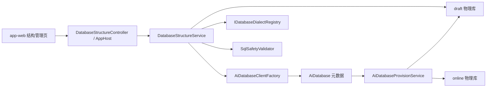

# AI 数据库独立物理库结构管理交付报告

> 日期：2026-04-25  
> 范围：独立 AI 数据库 draft/online 物理库、结构管理 API、方言层、SQL 安全、现有 app-web 全屏结构管理页接入。

## 1. 需求范围

- 每个 AI 数据库独立物理库，SQLite 为独立 `.db` 文件，MySQL 为独立 database，PostgreSQL 采用独立 schema。
- draft/online 双实例元数据、provision、连接工厂、结构读取、DDL、预览、建表、建视图、删除。
- SQL 安全后端强校验，多语句/危险关键字/危险函数拦截。
- app-web 资源库数据库 Tab 进入 `/space/:space_id/database/:databaseId/structure` 全屏结构管理页。

## 2. 不做范围

- 不改 `TenantDataSource`、数据迁移控制台、通用资源中心数据源模型。
- 不迁移旧 `atlas_data_json` 数据，旧 JSON 行模型仅保留兼容入口。
- online 仅 provision 与连接能力，不开放结构编辑 UI。

## 3. 架构图

## 4. 后端文件清单

- `src/backend/Atlas.Domain/AiPlatform/Entities/AiDatabase.cs`
- `src/backend/Atlas.Infrastructure/Options/AiDatabaseHostingOptions.cs`
- `src/backend/Atlas.Infrastructure/Services/AiPlatform/AiDatabaseProvisionService.cs`
- `src/backend/Atlas.Infrastructure/Services/DatabaseStructure/*`
- `src/backend/Atlas.AppHost/Controllers/DatabaseStructureController.cs`
- `src/backend/Atlas.PlatformHost/Controllers/DatabaseStructureController.cs`
- `src/backend/Atlas.AppHost/Bosch.http/DatabaseStructure.http`

## 5. 前端文件清单

- `src/frontend/apps/app-web/src/services/api-database-structure.ts`
- `src/frontend/apps/app-web/src/services/api-ai-database.ts`
- `src/frontend/apps/app-web/src/app/pages/database-structure-page.tsx`
- `src/frontend/apps/app-web/src/app/pages/workspace-library-page.tsx`
- `src/frontend/apps/app-web/src/app/pages/components/library-create-modal.tsx`

## 6. 新增接口清单

- `GET api/v1/database-resources/{databaseId}/structure/objects`
- `GET tables/{tableName}/columns`
- `GET views/{viewName}/columns`
- `GET tables/{tableName}/ddl`
- `GET views/{viewName}/ddl`
- `POST tables/{tableName}/preview`
- `POST views/{viewName}/preview`
- `POST tables/preview-ddl`
- `POST tables`
- `POST tables/sql`
- `POST views/preview`
- `POST views`
- `DELETE tables/{tableName}`
- `DELETE views/{viewName}`
- `GET api/v1/database-resources/drivers/{driverCode}/data-types`

## 7. DTO / 服务 / 权限 / 配置

- DTO：`DatabaseObjectDto`、`DatabaseColumnDto`、`PreviewDataRequest`、`PreviewDataResponse`、`DdlResponse`、`CreateTableRequest`、`CreateTableSqlRequest`、`CreateViewRequest`、`DropDatabaseObjectRequest`、方言建表/建视图定义。
- 服务：`IAiDatabaseProvisioner`、`IAiDatabaseClientFactory`、`IDatabaseStructureService`、`ISqlSafetyValidator`、`IDatabaseDialectRegistry`。
- 权限：复用 `DataSourcesView` / `DataSourcesQuery`，写接口使用已有 `DataSourcesSchemaWrite`。
- 配置：`AiDatabaseHosting`，含 `DefaultDriverCode`、`PreviewLimit`、`CommandTimeoutSeconds`、`Sqlite.Root`、`MySql.AdminConnection`、`PostgreSql.AdminConnection`。

## 8. 方言支持矩阵

| Driver | 自动 provision | 结构管理 | DDL | 说明 |
| --- | --- | --- | --- | --- |
| SQLite | 已实现 | 已实现 | sqlite_master | 表注释降级忽略 |
| MySQL | 已实现，需 admin connection | 已实现 SQL 生成/查询 | SHOW CREATE | 未在本机真实 MySQL 验证 |
| PostgreSQL | 已实现 schema 模式，需 admin connection | 已实现 schema 限定 | 拼接/pg_get_viewdef | 采用独立 schema，不创建独立 database |
| SQL Server | 不支持自动创建 | 方言 SQL 已实现基础能力 | OBJECT_DEFINITION | 未验证 |
| Oracle | 不支持自动创建 | 方言 SQL 已实现基础能力 | DBMS_METADATA | 未验证 |
| DM | 不支持自动创建 | 继承 Oracle 方言 | DBMS_METADATA | 未验证 |
| KingbaseES | 不支持自动创建 | 继承 PostgreSQL 方言 | PG 风格 | 未验证 |
| Oscar | 不支持自动创建 | ANSI 基础 list/columns/paging/create table | 限制返回空 | 未验证 |

## 9. 安全策略

- SQL tokenizer 处理单引号、双引号、转义、行注释、块注释。
- MySQL `/*! ... */` 可执行注释直接拒绝。
- `CREATE TABLE` 只允许单语句 create table。
- `CREATE VIEW` 只允许单语句 create view 且包含 select/with。
- `SELECT` 预览只允许 select/with，拒绝写动作、`LOAD_FILE`、`xp_cmdshell`、`COPY TO PROGRAM`、`INTO OUTFILE`。
- 连接串通过 `ConnectionStringMasker` mask `Password` / `Pwd` / `User Password`。

## 10. draft/online 设计

- `AiDatabase` 新增 `DraftDatabaseName`、`OnlineDatabaseName`、`DialectVersion`。
- provision 后写入加密 draft/online 连接串，结构写操作只打开 draft。
- ClientFactory 按 `tenant + databaseId + environment` 缓存 SqlSugar client，支持手动移除缓存。

## 11. 旧模型废弃说明

- `TableSchema`、`DraftTableName`、`OnlineTableName`、`RecordCount`、`SchemaVersion`、`PublishedVersion` 已标记 `Obsolete`。
- 旧服务/工作流/迁移控制台入口保留兼容，不删除；相关文件仅压制旧字段警告。
- 新结构管理不依赖旧 `atlas_data_json`。

## 12. 前端说明

- 资源库数据库 Tab 已有“结构管理”入口，独立 AI 数据库跳转全屏路由。
- 结构页可真实调用对象列表、字段、DDL、数据预览、可视化建表、SQL 建表、新建视图、删除表/视图接口。
- 已清理结构管理链路 `Number(databaseId)`，`api-ai-database` 的主数据库 ID 改为 string。

## 13. 验证结果

- `dotnet build Atlas.SecurityPlatform.slnx`：通过，0 警告 0 错误。
- `dotnet test tests/Atlas.SecurityPlatform.Tests --filter "FullyQualifiedName~SqlSafetyValidatorTests|FullyQualifiedName~DatabaseDialect"`：通过，33/33。
- `pnpm run build:app-web`：通过。
- `pnpm run i18n:check`：通过。
- `pnpm run lint`：通过。
- `dotnet test tests/Atlas.SecurityPlatform.Tests --filter "FullyQualifiedName!~Integration"`：599 个用例中 590 通过、9 失败；失败集中在既有 Workflow/Identity/Agent/Canvas 测试，与本次新增结构管理专项无直接关联。

## 14. MySQL / PostgreSQL 验证

- 本机未配置 `AiDatabaseHosting:MySql:AdminConnection`，未执行真实 MySQL 链路。
- 本机未配置 `AiDatabaseHosting:PostgreSql:AdminConnection`，未执行真实 PostgreSQL 链路。
- 缺失 admin connection 时 provision 返回明确错误，不会 fallback SQLite。

## 15. 已知风险

- 前端结构管理页仍是单文件实现，内部使用 Semi `SideSheet`，未按要求拆出 `CreateTableDrawer.tsx`、`CreateViewDrawer.tsx`、`DatabaseObjectDetailDrawer.tsx`、`DangerDeleteModal.tsx`。
- SQL 编辑器仍为 `Input.TextArea`，未接入 `@coze-arch/bot-monaco-editor`。
- 删除确认由后端强校验，前端确认交互尚未做到输入名称 + 勾选确认 + 禁用按钮的完整危险操作体验。
- 数据预览分页基础可用，但详情页 UI 尚未做完整远程分页控件。
- 未完成浏览器手动全链路验证。

## 16. 后续建议

1. 将结构页拆分为独立 Drawer/Modal 组件，并接入 bot-monaco-editor。
2. 配置 MySQL/PG admin connection 后执行 `.http` 最小链路。
3. 增加 AppHost API 级集成测试，覆盖 SQLite 创建库、建表、视图、删除、注入拒绝。
4. 梳理旧 JSON 行模型前端入口，统一灰显并提示使用结构管理。
