# AI Platform ER 草案

## 资源关系图

```mermaid
erDiagram
    AI_WORKSPACE ||--o{ AI_APP : owns
    AI_WORKSPACE ||--o{ AGENT : owns
    AI_WORKSPACE ||--o{ AI_PLUGIN : owns
    AI_WORKSPACE ||--o{ KNOWLEDGE_BASE : owns
    AI_WORKSPACE ||--o{ AI_DATABASE : owns
    AI_WORKSPACE ||--o{ AI_VARIABLE : owns
    AI_WORKSPACE ||--o{ WORKFLOW_META : owns

    AGENT ||--o{ AGENT_WORKFLOW_BINDING : binds
    AGENT ||--o{ AGENT_PLUGIN_BINDING : binds
    AGENT ||--o{ AGENT_KNOWLEDGE_LINK : binds
    AGENT ||--o{ AGENT_DATABASE_BINDING : binds
    AGENT ||--o{ AGENT_VARIABLE_BINDING : binds
    AGENT ||--o{ AGENT_PROMPT_BINDING : binds
    AGENT ||--o{ AGENT_PUBLICATION : publishes
    AGENT ||--o{ AGENT_CONVERSATION_PROFILE : configures

    AI_APP ||--o{ AI_APP_RESOURCE_BINDING : binds
    AI_APP ||--o{ AI_APP_PUBLISH_RECORD : publishes
    AI_APP ||--o{ AI_APP_CONNECTOR_BINDING : exposes
    AI_APP ||--o{ AI_APP_CONVERSATION_TEMPLATE : owns

    WORKFLOW_META ||--|| WORKFLOW_DRAFT : has
    WORKFLOW_META ||--o{ WORKFLOW_VERSION : publishes
    WORKFLOW_META ||--o{ WORKFLOW_EXECUTION : runs
    WORKFLOW_META ||--o{ WORKFLOW_REFERENCE : references
    WORKFLOW_VERSION ||--o{ WORKFLOW_PUBLISHED_REFERENCE : snapshots
    WORKFLOW_EXECUTION ||--o{ WORKFLOW_NODE_EXECUTION : contains

    AI_PLUGIN ||--o{ AI_PLUGIN_API : contains
    AI_PLUGIN ||--o{ AI_PLUGIN_PUBLISH_RECORD : publishes
    AI_PLUGIN ||--o{ AI_PLUGIN_OAUTH_GRANT : authorizes
    AI_PLUGIN ||--o{ AI_PLUGIN_DEFAULT_PARAM_BINDING : overrides

    KNOWLEDGE_BASE ||--o{ KNOWLEDGE_DOCUMENT : contains
    KNOWLEDGE_DOCUMENT ||--o{ DOCUMENT_CHUNK : chunks
    KNOWLEDGE_DOCUMENT ||--o{ KNOWLEDGE_SLICE : slices
    KNOWLEDGE_DOCUMENT ||--o{ KNOWLEDGE_REVIEW : reviews

    AI_DATABASE ||--o{ AI_DATABASE_RECORD : stores
    AI_DATABASE ||--o{ AI_DATABASE_IMPORT_TASK : imports
    AI_DATABASE ||--o{ AI_DATABASE_BINDING : binds

    AI_VARIABLE ||--o{ AI_VARIABLE_INSTANCE : instantiates
    AGENT ||--o{ CONVERSATION : chats
    CONVERSATION ||--o{ CONVERSATION_SECTION : sections
    CONVERSATION ||--o{ CHAT_MESSAGE : messages
    CONVERSATION ||--o{ CHAT_RUN_RECORD : runs
    CHAT_RUN_RECORD ||--o{ CHAT_RUN_EVENT : events

    AI_WORKSPACE ||--o{ WORKSPACE_IDE_FAVORITE : favorites
    AI_WORKSPACE ||--o{ AI_RECENT_EDIT : recent
    AI_MARKETPLACE_PRODUCT ||--o{ AI_MARKETPLACE_FAVORITE : favorites
```

## 设计说明

- `Agent` 和 `AiApp` 都是资源聚合根，但二者共享 `Workflow / Plugin / Knowledge / Database / Variable`
- `Workflow` 必须拆成 `Meta / Draft / Version / Execution`
- `Conversation` 与 `ChatRunRecord` 分离，避免把执行与消息直接耦合
- `AiVariable` 定义与 `AiVariableInstance` 实例分离
- `PublishRecord` 与 `ConnectorBinding` 分离，前者记录历史，后者记录当前对外暴露面
