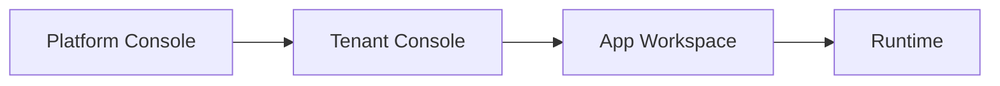

# SEC-10 四段式入口 IA 实施基线（含子任务收口）

## 1. 任务信息

- Linear：`SEC-10`（`[P0] 重构入口 IA 为四段式结构`）
- 覆盖子任务：
  - `SEC-24`、`SEC-25`、`SEC-26`、`SEC-27`、`SEC-28`
  - `SEC-41`、`SEC-42`、`SEC-43`、`SEC-44`、`SEC-45`、`SEC-46`、`SEC-47`、`SEC-48`

## 2. 四段式 IA 目标图

## 3. SEC-24/39/40 现状输入摘要

- 已完成现状盘点：入口、路由、菜单、上下文切换点均已形成基础清单。
- 已确认主要问题：
  1. 平台主导航混入应用编辑页；
  2. Runtime 存在双入口并行；
  3. `settings/console/system` 多入口重复；
  4. Project/Tenant/App 上下文展示不一致。

## 4. SEC-25 / SEC-41：四段式入口职责与默认路径

## 4.1 入口职责定义

| 入口 | 承载内容 | 不应承载内容 |
|---|---|---|
| Platform Console | 平台资源治理、系统配置、审计运维 | 应用内编辑器 |
| Tenant Console | 租户组织、租户资源、租户策略 | 运行态用户终端 |
| App Workspace | 应用编排、页面/流程/Agent/知识装配 | 平台审核与全局治理 |
| Runtime | 已发布页面、任务处理、运行追踪 | 定义态配置编辑 |

## 4.2 默认用户路径

1. 登录 -> Platform Console；  
2. 选择租户 -> Tenant Console；  
3. 进入指定应用 -> App Workspace；  
4. 发布后进入 Runtime；  
5. 运行问题回看回到 App Workspace 或治理中心。

## 5. SEC-42：Tenant/App/Project 上下文切换规则

| 上下文 | 允许出现层级 | 切换入口 | 记忆策略 |
|---|---|---|---|
| Tenant | Platform/Tenant | 顶部上下文条 | 用户级记忆 |
| App | App Workspace/Runtime | 应用切换器 | 按租户记忆 |
| Project | App Workspace（可选） | 项目切换器 | 按 App 记忆 |

反例：
- 在 Platform Console 强制显示 Project；
- 在 Runtime 允许切换 Tenant。

## 6. SEC-43/44：容器导航结构（目标态）

## 6.1 Platform + Tenant 容器

- 一级分组：资源中心、治理中心、安全审计、系统配置。
- 二级分组：模型、连接器、插件定义、模板、开放平台、组织权限等。

## 6.2 App Workspace + Runtime 容器

- App Workspace：Dashboard、Builder、Workflow、Knowledge、Prompt、Settings。
- Runtime：Runtime Pages、Task Inbox、Trace 回看。

## 7. SEC-27/45/46：路由映射与迁移优先级

## 7.1 页面到目标入口映射（摘要）

| 现状路径 | 目标入口 | 优先级 |
|---|---|---|
| `/ai/agents/:id/edit` | App Workspace | P0 |
| `/ai/workflows/:id/edit` | App Workspace | P0 |
| `/lowcode/apps/:id/builder` | App Workspace | P0 |
| `/apps/:appId/run/:pageKey` | Runtime（合并到统一入口） | P0 |
| `/monitor/writeback-failures` | Platform/Tenant Console | P1 |

## 7.2 需重命名路由（摘要）

| 现状 | 目标 |
|---|---|
| `/apps/:appId/*` | `/tenant-apps/:tenantAppId/*` |
| `/r/:appKey/:pageKey` | `/runtime/:appKey/pages/:pageKey` |
| `/alerts` | `/alerts`（统一单复数） |

## 8. SEC-28/47/48：legacy 兼容与下线策略

## 8.1 需兼容保留入口

- `/settings/:pathMatch(.*)*`
- `/system/configs`、`/system/dict-types`
- `/approval/inbox`、`/approval/done`、`/approval/cc`

## 8.2 兼容窗口与下线判定

| 阶段 | 时间窗 | 策略 |
|---|---|---|
| 兼容期 | 6 个月 | 保留跳转 + 提示 Deprecated |
| 观察期 | 最后 1 个月 | 仅允许安全修复 |
| 下线期 | 窗口结束 | 移除旧入口并更新变更日志 |

## 8.3 公告与风险处理

- 发布前公告：新旧入口映射表；
- 发布后公告：下线时间点；
- 高风险岗位（运维/审批管理员）定向通知与培训。

## 9. 任务映射核验表

| 任务号 | 在本文对应章节 |
|---|---|
| SEC-24 | 第3章 |
| SEC-25 | 第4章 |
| SEC-26 | 第6章 |
| SEC-27 | 第7章 |
| SEC-28 | 第8章 |
| SEC-41 | 第4章 |
| SEC-42 | 第5章 |
| SEC-43 | 第6章（Platform/Tenant） |
| SEC-44 | 第6章（App/Runtime） |
| SEC-45 | 第7章（映射表） |
| SEC-46 | 第7章（优先级与重命名） |
| SEC-47 | 第8章（兼容入口清单） |
| SEC-48 | 第8章（跳转/公告/下线） |

## 10. 完成定义核验

- [x] 四段式 IA、上下文切换、导航结构、迁移清单、legacy 策略均已形成闭环  
- [x] 可直接支撑后续前端路由与菜单改造实施卡  
- [x] 子任务映射关系完整可追踪
