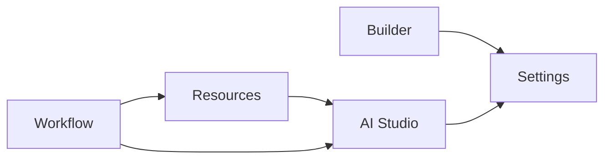

# SEC-13 App Workspace 能力地图与页面下沉方案（含 SEC-53/54）

## 1. 任务信息

- Linear：`SEC-13`（`[P1] 将应用装配能力下沉至 App Workspace`）
- 覆盖子任务：`SEC-53`、`SEC-54`
- 所属里程碑：`P1 模型与边界收口`

## 2. App Workspace 能力地图（SEC-53）

## 2.1 一级分组

| 一级分组 | 二级分组 | 典型页面 |
|---|---|---|
| Builder | 页面/表单/布局 | Page Builder、Form Designer |
| AI Studio | Agent/Prompt/Knowledge | Agent Editor、Prompt 库 |
| Workflow | 流程定义/调试 | Workflow Editor、Run Panel |
| Resources | 插件实例/变量/数据绑定 | Plugin Config、Variables |
| Settings | 应用设置/发布设置 | App Settings、Release Config |

## 2.2 关系图（Builder / AI Studio / 资源页）

## 3. SEC-54 页面下沉清单

| 当前入口 | 当前层级 | 目标层级 | 优先级 | 是否兼容期 |
|---|---|---|---|---|
| `/ai/agents/:id/edit` | 平台主导航 | App Workspace | 高 | 是 |
| `/ai/workflows/:id/edit` | 平台主导航 | App Workspace | 高 | 是 |
| `/ai/knowledge-bases/:id` | 平台主导航 | App Workspace | 高 | 是 |
| `/lowcode/apps/:id/builder` | 低代码主导航 | App Workspace | 高 | 否 |
| `/lowcode/forms/:id/designer` | 低代码主导航 | App Workspace | 高 | 否 |

## 4. App 资源归属表

| 资源 | 主归属 | 允许跨层引用 |
|---|---|---|
| Agent | App Workspace | 可被 RuntimeExecution 引用 |
| WorkflowDefinition | App Workspace | 可被 RuntimeExecution 引用 |
| KnowledgeBase | App Workspace | 可被 Agent/Workflow 引用 |
| PromptTemplate | App Workspace | 可被 Agent 引用 |
| PluginBinding | App Workspace | 可被 Workflow 节点引用 |

## 5. 高风险下沉项

| 页面 | 风险 | 缓解 |
|---|---|---|
| Agent 编辑页 | 外链依赖多 | 保留旧路由重定向 |
| Workflow 编辑页 | 调试链路复杂 | 与调试层任务联动实施 |
| 知识库详情页 | 数据权限耦合 | 与 SEC-18 权限矩阵联动 |

## 6. 迁移优先级建议

1. 先迁编辑器页（Agent/Workflow/Form）；
2. 再迁资源详情页（Knowledge/Plugin/Prompt）；
3. 最后清理平台侧重复入口。

## 7. 任务映射核验

| 任务号 | 对应章节 |
|---|---|
| SEC-13 | 第2~6章 |
| SEC-53 | 第2章 |
| SEC-54 | 第3~5章 |

## 8. 完成定义核验

- [x] App Workspace 能力地图已定义  
- [x] 页面下沉清单可直接分派给前端实施  
- [x] 资源归属与高风险项已标注
