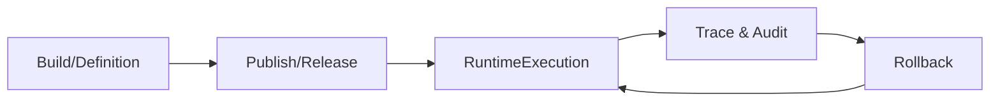

# SEC-15 Runtime 与 Release 闭环方案（含 SEC-59/60）

## 1. 任务信息

- Linear：`SEC-15`（`[P2] 补强 Runtime 与 Release 闭环`）
- 覆盖子任务：`SEC-59`、`SEC-60`
- 所属里程碑：`P2 运行闭环与 Coze 接入`

## 2. 现状缺口（SEC-59）

| 阶段 | 现状对象/能力 | 缺口 |
|---|---|---|
| 构建态 | AppManifest / LowCodeApp / WorkflowDefinition | 发布边界对象混杂 |
| 发布态 | AppRelease / 版本记录 | 与运行实例关联不足 |
| 运行态 | RuntimeRoute / PageRuntime API | context 与 execution 未分层 |
| 回看态 | Task/Trace/Audit | 关联键不统一，追溯链不完整 |

## 3. 目标闭环链路（SEC-60）

## 4. 闭环链路表

| 阶段 | 主对象 | 关键动作 | 关键产出 |
|---|---|---|---|
| 构建 | WorkflowDefinition / Agent / PageSchema | 保存、校验 | 可发布草稿 |
| 发布 | Release / RuntimeRoute | 审批、发布、路由绑定 | 可运行版本 |
| 运行 | RuntimeContext / RuntimeExecution | 执行、提交、任务流转 | 运行记录 |
| 回看 | TraceSpan / AuditRecord | 诊断、审计 | 回看证据 |
| 回滚 | ReleaseRollback | 指定版本回滚 | 新运行版本 |

## 5. 版本与回滚策略

| 项 | 策略 |
|---|---|
| 版本号 | 主版本.次版本.修订号 |
| 发布记录 | 必含发布人、时间、影响范围 |
| 回滚粒度 | 以 Release 为单位 |
| 回滚审批 | 高风险应用必须审批 |

## 6. 审计联动要求

- 发布、回滚、运行异常必须写入审计；
- 审计记录关联 `tenantId + appId + releaseId + executionId`；
- 运行回看页面可从审计反查 Trace。

## 7. 高风险节点

| 节点 | 风险 | 防护 |
|---|---|---|
| 发布到路由 | 错绑 pageKey | 发布前自动校验路由完整性 |
| 执行到审计 | executionId 丢失 | 强制上下文注入 |
| 回滚到运行 | 版本不一致 | 回滚后生成新版本快照 |

## 8. 任务映射核验

| 任务号 | 对应章节 |
|---|---|
| SEC-15 | 第2~7章 |
| SEC-59 | 第2章 |
| SEC-60 | 第3~7章 |

## 9. 完成定义核验

- [x] 形成发布-运行-回滚-审计闭环设计  
- [x] 明确版本与回滚策略  
- [x] 给出可实施的高风险节点防护方案
