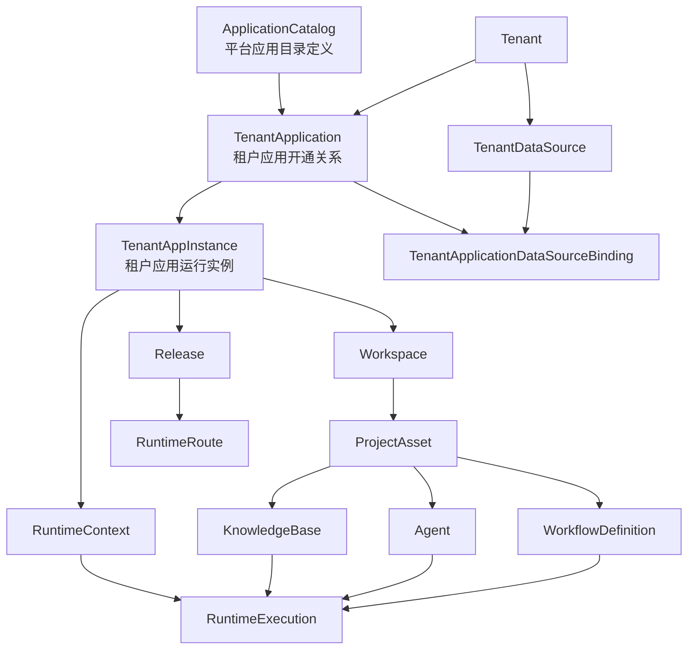

# SEC-32 目标主模型关系图与边界说明

## 1. 任务信息

- Linear：`SEC-32`（`[Impl/P0] 绘制目标主模型关系图与边界说明`）
- 所属里程碑：`P0 基线与入口收敛`
- 依赖输入：`SEC-31` 术语词汇表、`SEC-33` 映射主表、`SEC-34` 迁移规则

## 2. 目标主模型关系图（v1）

## 3. 四类角色边界

## 3.1 主边界对象

| 对象 | 边界定位 | 关键约束 |
|---|---|---|
| `Tenant` | 多租户隔离根 | 跨租户请求必须拒绝 |
| `ApplicationCatalog` | 平台目录定义 | 不直接承载租户运行数据 |
| `TenantApplication` | 开通关系对象 | 负责“是否开通、是否可用” |
| `TenantAppInstance` | 运行实例对象 | 负责实例配置与发布对接 |

## 3.2 可选子域对象

| 对象 | 边界定位 | 启用条件 |
|---|---|---|
| `ProjectAsset` | 应用内创作资产容器 | 仅在启用项目模式时出现 |
| `Workspace` | 创作空间容器 | App Studio/AI Studio 场景 |

## 3.3 运行态对象

| 对象 | 边界定位 | 约束 |
|---|---|---|
| `RuntimeContext` | 运行上下文快照 | 必须可追溯 Tenant/App/Project |
| `RuntimeExecution` | 执行实例 | 关联审计与追踪，不回写定义态 |
| `RuntimeRoute` | 运行路由映射 | 仅指向已发布版本 |

## 3.4 工作台对象

| 对象 | 边界定位 |
|---|---|
| `WorkflowDefinition` | 工作流定义态对象 |
| `Agent` | 智能体定义态对象 |
| `KnowledgeBase` | 知识资源对象 |

## 4. 关系约束说明

## 4.1 拥有关系

- `Tenant` 拥有 `TenantApplication` 与 `TenantDataSource`。
- `TenantApplication` 拥有 `TenantAppInstance`。
- `TenantAppInstance` 拥有 `Release` 与 `RuntimeContext`。
- `Workspace` 拥有 `ProjectAsset`。

## 4.2 引用关系

- `TenantApplication` 引用 `ApplicationCatalog`。
- `TenantApplicationDataSourceBinding` 连接 `TenantApplication` 与 `TenantDataSource`。
- `RuntimeExecution` 引用 `WorkflowDefinition/Agent/KnowledgeBase`。

## 4.3 可选绑定关系

- `ProjectAsset` 对 `TenantAppInstance` 是可选绑定，不可默认强绑。
- `ProjectScope` 只在应用启用项目模式时参与上下文。

## 5. 易误用边界点（高风险）

| 误用点 | 风险 | 防护规则 |
|---|---|---|
| 将 `ApplicationCatalog` 当作租户实例 | 导致跨租户数据泄漏 | 目录对象只读，不承载租户状态 |
| 将 `Project` 当作默认主上下文 | 上下文叠加复杂、权限冲突 | 默认主链条为 Tenant -> TenantAppInstance |
| `Runtime` 不区分 context/execution | 审计链断裂 | 运行对象命名必须拆分 |
| `DataSource` 直接挂 `LowCodeApp` | 归属模糊 | 必须通过 Binding 对象绑定 |

## 6. 与后续任务衔接

- 为 `SEC-49` 提供 App 三段对象边界输入。
- 为 `SEC-50` 提供实体/DTO/API 改造判断依据。
- 为 `SEC-60` 提供运行闭环对象链路基础。

## 7. 完成定义核验

- [x] 一张关系图可解释核心对象关系  
- [x] 四类角色（主边界/可选子域/运行态/工作台）有明确表述  
- [x] 拥有、引用、可选绑定关系已区分  
- [x] 可供 `SEC-33`/`SEC-49` 直接复用
