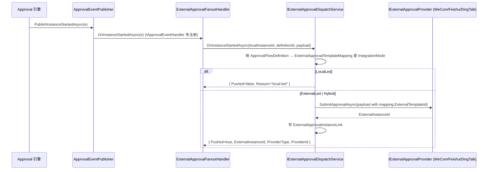
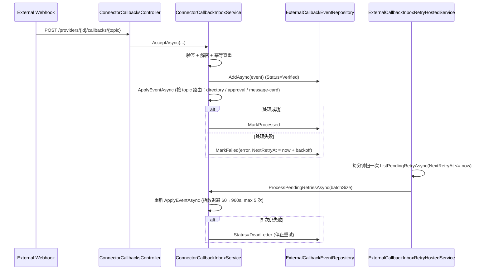

# Atlas Security Platform Contracts

## Workflow Host 约束

- 当前仓库仅维护 `src/frontend/apps/app-web` 单宿主，不再维护独立 `src/coze-workflow-host` 目录。
- `app-web` 直接挂载 Coze 原生工作流/空间适配层（`@coze-workflow/playground-adapter`、`@coze-studio/workspace-adapter`），前端实现位于 `src/frontend/packages/workflow/**` 与 `src/frontend/packages/foundation/**`。
- `@atlas/workflow-core-react`、`@atlas/workflow-editor-react`、`@atlas/module-workflow-react` 已删除，不再作为宿主桥接边界。
- 前端与后端协议对齐统一走兼容层：`/api/workflow_api/*`、`/api/playground_api/*`、`/api/op_workflow/*`、`/api/bot/*`、`/api/space/*`、`/api/draftbot/*`、`/v1/workflow/*`、`/v1/workflows/*`。

## Assistant 域命名映射

> 本节固定 Coze 中国版「智能体（Assistant）」与本仓库代码实体的映射关系，避免 `Agent` / `Assistant` / `TeamAgent` / `Bot` 在跨层文档与对外 API 中混用。详细背景见 [`docs/coze/assistant-domain-mapping.md`](coze/assistant-domain-mapping.md) 与 [`docs/plan-coze-platform-governance.md`](plan-coze-platform-governance.md)。

### 命名约定

| 产品语义（Coze） | 仓库聚合根 / 控制器 | 路由前缀 | 备注 |
| --- | --- | --- | --- |
| 智能体（Assistant，单体） | `Atlas.Domain.AiPlatform.Entities.Agent` | `api/v1/agents`、`api/v1/ai-assistants` | `ai-assistants` 为 `agents` 的 REST 别名，保持产品语义对外可读 |
| 多智能体团队（Multi-Agent / Team） | `Atlas.Domain.AiPlatform.Entities.TeamAgent` | `api/v1/team-agents` | 多智能体编排聚合，不与单体 `Agent` 共享路由 |
| 机器人（Bot，Coze 兼容） | 仅出现在 `CozeWorkflowCompatControllerBase` 等兼容层 | `/api/draftbot/*`、`/api/bot/*` | 不在 Atlas 域模型中再造同名实体 |
| 智能体技能装配 | `AgentPluginBinding` / `AgentKnowledgeLink` / `AgentWorkflowBinding`(`Skill` 角色) / `AgentDatabaseBinding` / `AgentVariableBinding` / `AgentPromptBinding` / `AgentConversationProfile` | 同 agents 子路由 | 触发器 / 卡片暂未升级为一等绑定，由 M-G10 跟踪 |
| 发布物（嵌入态） | `AgentPublication`（含 `EmbedToken`） | `api/v1/ai-assistants/{id}/publications` 等 | 与「工作空间渠道发布」（M-G02）解耦 |

### 关系示意

```
Tenant
 └── Workspace
      ├── Agent  ──┬── AgentPluginBinding
      │            ├── AgentKnowledgeLink
      │            ├── AgentWorkflowBinding (role = Skill)
      │            ├── AgentDatabaseBinding
      │            ├── AgentVariableBinding
      │            ├── AgentPromptBinding
      │            ├── AgentConversationProfile
      │            └── AgentPublication (embed / version)
      └── TeamAgent ── 多智能体编排（独立线，不与 Agent 路由复用）
```

### 强约束

- 新增对外 REST 路由必须二选一：`agents` 或 `ai-assistants`，**禁止再引入 `bots` / `assistants` 等新别名**。
- 跨层文档（PRD、API 规范、产品 changelog）行文统一使用「智能体（Assistant）」；代码注释允许混用 `Agent` 以与类型名一致。
- 产品页面显示文案统一走 i18n（`assistantDomainTitle / assistantDomainSubtitle / assistantTeamTitle / assistantSkillsBlock` 等），禁止硬编码「Bot」。
- 触发器、卡片在升级为一等绑定（M-G10）前，仍保留在 Workflow / Coze 兼容层，不允许在 `Agent*Binding` 命名空间下重复建表。

## Organization / Workspace Portal

### 路由与工作模式

- 新前端主入口采用组织-工作空间层级：
  - `/sign`
  - `/org/:orgId/workspaces`
  - `/org/:orgId/workspaces/:workspaceId/dashboard`
  - `/org/:orgId/workspaces/:workspaceId/develop`
  - `/org/:orgId/workspaces/:workspaceId/develop/chat`
  - `/org/:orgId/workspaces/:workspaceId/develop/model-configs`
  - `/org/:orgId/workspaces/:workspaceId/develop/assistant-tools`
  - `/org/:orgId/workspaces/:workspaceId/develop/publish-center`
  - `/org/:orgId/workspaces/:workspaceId/library`
  - `/org/:orgId/workspaces/:workspaceId/library/data`
  - `/org/:orgId/workspaces/:workspaceId/library/variables`
  - `/org/:orgId/workspaces/:workspaceId/manage/:tab`
  - `/org/:orgId/workspaces/:workspaceId/settings/:tab`
  - `/org/:orgId/workspaces/:workspaceId/apps/:appId`
  - `/org/:orgId/workspaces/:workspaceId/apps/:appId/publish`
  - `/org/:orgId/workspaces/:workspaceId/agents/:agentId`
  - `/org/:orgId/workspaces/:workspaceId/agents/:agentId/publish`
  - `/org/:orgId/workspaces/:workspaceId/apps/:appId/workflows/:workflowId`
  - `/org/:orgId/workspaces/:workspaceId/apps/:appId/chatflows/:workflowId`
- `/apps/:appKey/*` 仅保留为兼容跳转入口，不再作为主壳或主导航来源。
- 第一版 `orgId` 直接对应当前登录租户 ID。
- 工作空间为真实后端实体，显式绑定 `AppInstanceId + AppKey`。

### 后端实体

- `Workspace`
  - `Id`
  - `TenantIdValue`
  - `Name`
  - `Description`
  - `Icon`
  - `AppInstanceId`
  - `AppKey`
  - `IsArchived`
  - `CreatedBy`
  - `CreatedAt`
  - `UpdatedBy`
  - `UpdatedAt`
  - `LastVisitedAt`
- `WorkspaceRole`
  - `WorkspaceId`
  - `Code`
  - `Name`
  - `IsSystem`
  - `DefaultActionsJson`
- `WorkspaceMember`
  - `WorkspaceId`
  - `UserId`
  - `WorkspaceRoleId`
  - `JoinedAt`
- `WorkspaceResourcePermission`
  - `WorkspaceId`
  - `WorkspaceRoleId`
  - `ResourceType`
  - `ResourceId`
  - `ActionsJson`

### 资源归属字段

- 下列核心设计资源新增可空 `WorkspaceId`：
  - `AiApp`
  - `Agent`
  - `WorkflowMeta`
  - `KnowledgeBase`
  - `AiDatabase`
  - `AiPlugin`
- `AiApp.AgentId` 为可空字段，支持“先绑定 Workflow、后续再绑定 Agent”的创建流程。
- 启动期初始化逻辑会为默认工作空间回填历史资源的 `WorkspaceId`。

### API

- `GET /api/v1/organizations/{orgId}/workspaces`
  - 返回当前用户可访问的工作空间卡片列表
- `GET /api/v1/organizations/{orgId}/workspaces/by-app-key/{appKey}`
  - 旧 `/apps/:appKey/*` 路由迁移时用于定位对应工作空间
- `GET /api/v1/organizations/{orgId}/workspaces/{workspaceId}`
  - 返回工作空间上下文详情，包括 `appKey / appInstanceId / roleCode / allowedActions`
- `POST /api/v1/organizations/{orgId}/workspaces`
  - 创建绑定到指定应用实例的新工作空间
- `PUT /api/v1/organizations/{orgId}/workspaces/{workspaceId}`
  - 更新工作空间名称、描述与图标，不允许修改既有 `AppInstanceId / AppKey` 绑定
- `DELETE /api/v1/organizations/{orgId}/workspaces/{workspaceId}`
  - 归档工作空间（软删除）；归档后列表、详情与 `by-app-key` 查询均不再返回该工作空间
- `GET /api/v1/organizations/{orgId}/workspaces/{workspaceId}/develop/apps`
  - 应用优先开发页首屏数据，只返回应用卡片
- `POST /api/v1/organizations/{orgId}/workspaces/{workspaceId}/develop/apps`
  - 在工作空间内创建应用，并同步创建关联标准 Workflow；创建阶段允许 `AiApp.AgentId = null`
- `GET /api/v1/organizations/{orgId}/workspaces/{workspaceId}/resources`
  - 按资源类型懒加载工作空间资源分区
- `GET /api/v1/organizations/{orgId}/workspaces/{workspaceId}/members`
- `POST /api/v1/organizations/{orgId}/workspaces/{workspaceId}/members`
- `PUT /api/v1/organizations/{orgId}/workspaces/{workspaceId}/members/{userId}`
- `DELETE /api/v1/organizations/{orgId}/workspaces/{workspaceId}/members/{userId}`
- `GET /api/v1/organizations/{orgId}/workspaces/{workspaceId}/resources/{resourceType}/{resourceId}/permissions`
- `PUT /api/v1/organizations/{orgId}/workspaces/{workspaceId}/resources/{resourceType}/{resourceId}/permissions`

### 权限语义

- 内置工作空间角色：
  - `Owner`
  - `Admin`
  - `Member`
- 默认动作：
  - `Owner/Admin`: `view/edit/publish/delete/manage-permission`
  - `Member`: `view`
- `WorkspaceResourcePermission` 用于资源级覆盖；若未配置覆盖，则回退到角色默认动作。

## Coze Workflow API 兼容层

- `PlatformHost` 与 `AppHost` 额外提供原生 Coze 协议兼容入口：`/api/workflow_api/*`
- 兼容层当前覆盖 workflow playground 必需接口：
  - `canvas`
  - `save`
  - `publish`
  - `node_type`
  - `node_template_list`
  - `old_validate`
  - `test_run`
  - `get_process`
  - `test_resume`
  - `cancel`
  - `nodeDebug`
  - `workflow_references`
  - `released_workflows`
  - `copy`
  - `validate_tree`（M1：返回 `Array<ValidateTreeInfo>`，每项含 `workflow_id`、`name`、`errors[]`）
  - `node_panel_search`（M1：节点目录关键字搜索，命中节点放在 `data.resource_workflow.workflow_list`）
  - `history_schema`（M1：按 commitId / executionId 解析历史画布 JSON）
  - `get_node_execute_history`（M1：节点执行快照，`extra` 包含 `input/output/variables` 三段 JSON 字符串）
  - `get_trace`（M1 改造：`spans[].extra.input/output/variables` 三段；`spans[].status_code/duration/start_time` 与 `header.duration/start_time` 与 trace.thrift 对齐；返回值会先附一条根 `Workflow` span 作为入口）
- 兼容层内部统一复用 `/api/v2/workflows*` 与现有 Dag 工作流服务（`IDagWorkflow*Service`），不在前端重复协议转换。

### Coze 兼容层风险已修复登记

| 风险 | 状态 | 修复点 | 回归用例 |
|---|---|---|---|
| 1. 不重写上游 packages/workflow/* / packages/coze-* | 已遵守 | 本次 diff 全程没有触碰 `packages/workflow/*`、`packages/coze-*`、`packages/agent-ide/*`、`packages/foundation/*`、`packages/arch/foundation-sdk` 等任何上游目录；所有适配工作通过新增的 `packages/atlas-foundation-bridge` 桥接包与 rsbuild alias 完成。 | n/a（约束类） |
| 2. 不引入新依赖 | 已遵守 | `app-web/package.json` 仅新增 `"@atlas/foundation-bridge": "workspace:*"`，是 workspace 内部包；React / pnpm overrides 等版本未变。 | n/a（约束类） |
| 3. 节点 ID 双轨制 | 已修复 | 1) 在 `WorkflowCanvasJsonBridge.TryResolveNodeType` 增加 JSON 字符串数字（`"3"`）反向解析分支。<br>2) `CozeWorkflowCompatControllerBase.SaveWorkflow` 与 `ValidateTree` 入参 schema 落库前调用新增的 `NormalizeCanvasJsonFromCoze`，把 type 统一规整为 Atlas `WorkflowNodeType` 整型。 | `tests/Atlas.SecurityPlatform.Tests/Workflows/CozeCanvasNodeTypeRoundtripTests.cs`（覆盖 5 种 type 形态 + 未知节点拒绝 + 整型规整） |
| 4. i18n 双向 | 已加固 | `WorkflowRuntimeBoundary.toCozeLocale` 抽为 named export 并接管未知区域、空字符串、`zh-Hans` / `zh-TW` / `en-GB` 等变体；非中文非英文一律走 `en` 兜底。 | `apps/app-web/src/app/workflow-runtime-boundary.spec.tsx → describe("toCozeLocale")` |
| 5. foundation-sdk 行为差异 | 已加固 | `atlas-foundation-bridge.useSpace` 在宿主只注入 `id` 时给出 cozelib 必填的 `space_type / space_mode / role_type` 兜底（默认 Team / Normal / Member），避免 cozelib 在严格相等判断分支降级为不可用。 | `packages/atlas-foundation-bridge/src/__tests__/bridge.spec.ts` 新增"useSpace 字段缺失"用例 |

### M1 新增 DTO 命名规范

- M1 新增的 3 个对外 DTO **不再带 `V2` 后缀**，使用业务正式命名：
  - `WorkflowVariableTreeDto`
  - `WorkflowNodeExecutionHistoryDto`
  - `WorkflowHistorySchemaDto`
- 与之相关的接口方法签名、服务实现、控制器返回类型、xUnit 测试同步使用上述名称。
- **M7（已完成）**：后端 C# 类型与文件已统一为 `DagWorkflow*`（控制器 `DagWorkflowController`、服务 `IDagWorkflowQueryService` / `IDagWorkflowCommandService` / `IDagWorkflowExecutionService`、DTO `DagWorkflow*Request` / `DagWorkflow*Dto`）。**HTTP 路由**仍为 `api/v2/workflows`：其中 **`v2` 表示 REST API 版本号**，与 `api/v1/*` 并行，**不是**产品「Workflow V2」语义；详见 [`docs/plan-m7-workflowv2-rename.md`](plan-m7-workflowv2-rename.md) 策略 1。
- 前端 `@coze-arch/idl` 自动生成物仍保留上游 `WorkflowV2*` 命名；Atlas 侧可选用 [`@coze-arch/idl/dag-workflow-aliases.ts`](../src/frontend/packages/arch/idl/src/dag-workflow-aliases.ts) 语义别名，避免手改 `auto-generated`。

### DagWorkflow 名称规则

适用范围：

- `POST /api/v2/workflows` 的 `DagWorkflowCreateRequest.Name`
- `PUT /api/v2/workflows/{id}/meta` 的 `DagWorkflowUpdateMetaRequest.Name`

校验规则：

- 正则：`^[A-Za-z][A-Za-z0-9_]{0,29}$`（首字符必须是英文字母，仅允许字母、数字、下划线）
- 长度：1..30（与 Coze 上游 `WORKFLOW_NAME_MAX_LEN = 30` 对齐）
- 与前端真源对齐：[`src/frontend/packages/workflow/base/src/constants/index.ts`](../src/frontend/packages/workflow/base/src/constants/index.ts) 的 `WORKFLOW_NAME_REGEX` + `WORKFLOW_NAME_MAX_LEN`

错误码（FluentValidation `WithErrorCode` 挂在 `Name` 字段）：

- `DAG_WORKFLOW_NAME_LENGTH`：长度超过 30
- `DAG_WORKFLOW_NAME_FORMAT`：字符集不符合（数字开头、含中文、含 `-` 等）

i18n 资源 key（`Atlas.Application/Resources/Messages.{zh-CN,en-US}.resx`）：

- `DagWorkflowNameFormat`
- `DagWorkflowNameLength`
- 注：`Atlas.Application` 内的 Validator 当前为无参构造、不注入 `IStringLocalizer`，错误消息为 `WithMessage` 直接挂中文文案 + `WithErrorCode` 挂错误码；需要英文回写时由控制器层基于 `ErrorCode` 通过 `IStringLocalizer<Messages>` 解析对应 key。

兼容层差异（重要）：

- `POST /api/workflow_api/create_workflow` 由 [`CozeWorkflowCompatControllerBase`](../src/backend/Atlas.Presentation.Shared/Controllers/Ai/CozeWorkflowCompatControllerBase.cs) 直接调用 `IDagWorkflowCommandService.CreateAsync`，**不**经过 `DagWorkflowCreateRequestValidator`；
- 当 Coze 兼容层入参 `name` 为空时，会用中文默认名 `"未命名工作流"` 兜底，违反上述正则；
- 这是 Coze 上游交互的既有契约；统一 REST 与 Coze 兼容层的命名展示由 `DagWorkflow*` 类型与本文档对齐。

### M2 新端点 ↔ 上游 Thrift 字段差异说明

> 详见 [`docs/coze-api-gap.md`](coze-api-gap.md)。M2 一次性把 `batch_delete / delete_strategy / copy_wk_template / example_workflow_list / apiDetail / upload/auth_token / sign_image_url / list_publish_workflow / get_async_sub_process` 9 个端点从 fallback 升级为真实实现。

### M3 新端点

- `POST /api/draftbot/get_draft_bot_list`：走 `ITeamAgentService.GetPagedAsync`，返回 `{total, list[], has_more}`，与 Coze `DraftBotList` 字段对齐。
- `POST /api/draftbot/get_display_info`：走 `ITeamAgentService.GetByIdAsync`，返回 `{bot_id, name, description, icon_url, agent_type, publish_status, schema_config_json, ...}`。
- `POST /api/playground_api/space/info`：走 `IWorkspacePortalService.ListWorkspacesAsync`，返回 `{data: {id, name, description, icon_url, space_type, role_type, space_mode}}`。

### M5 等保 / 多租户 / 鉴权

- 全部 `/api/workflow_api/*`、`/api/playground_api/*`、`/api/draftbot/*`、`/api/bot/*`、`/v1/workflows/*`、`/v1/workflow/*` 路由均挂 `[Authorize]`，由 JWT 中间件强制认证（PAT 走 `PatAuthenticationHandler`）。
- 多租户上下文继续由 `TenantContextMiddleware` 强制：`X-Tenant-Id` Header 必须与 JWT `tenant_id` Claim 一致；不一致返回 `403 CROSS_TENANT_FORBIDDEN`。
- Coze 兼容层写动作（`save / publish / delete / test_run / cancel / nodeDebug / copy / batch_delete / copy_wk_template`）全部通过 `TryWriteAuditAsync` 触发 `IAuditWriter`，actor 为 JWT identity，target 为 `workflow:<id>`，action 为 `coze_workflow.<verb>`，符合等保2.0 关于「关键操作可追溯」的要求。
- `/v1/workflow/run` / `/v1/workflow/stream_run` / `/v1/workflow/stream_resume` / `/v1/workflows/chat` 等 OpenAPI 路由：当前在 Coze 兼容层为 fallback；真实运行入口走 `OpenWorkflowsController`（使用 `PatAuthenticationHandler` 启用 PAT 认证），见 [`OpenWorkflowsController.cs`](../src/backend/Atlas.AppHost/Controllers/Open/OpenWorkflowsController.cs)。

### M3 前端 cozelib 壳接入开关

- `WorkspaceWorkflowWorkbenchRoute` 当前默认走 Atlas 自研 + cozelib 工作流编辑器。`@coze-studio/workspace-adapter` 的 `develop`/`library` 与 `@coze-agent-ide/entry-adapter` 的 `BotEditor` 在 `@coze-arch/bot-api` shim 完整对齐之后，再启用 `?shell=coze` 切换。开关位与 alias 已在 `apps/app-web/rsbuild.config.ts` 与 `WorkflowRuntimeBoundary` 中预留。

### M1 新端点 ↔ 上游 Thrift 字段差异说明

| 兼容路由 | 上游 Thrift Method | Atlas 实现差异 |
|---|---|---|
| `POST /api/workflow_api/validate_tree` | `WorkflowService.ValidateTree`（`workflow_svc.thrift`） | Atlas 暂不支持 `bind_project_id` / `bind_bot_id` 真实校验，仅做透传与 schema 结构性校验；`schema` 为空且传 `workflow_id` 时回退使用当前草稿。 |
| `POST /api/workflow_api/node_panel_search` | `WorkflowService.NodePanelSearch` | Atlas 节点目录与上游 `NodePanelPlugin` 不同源，命中条目以 Coze `Workflow` 结构返回 `workflow_id = node_type_code`、`node_type = node_type_code`、`category = WorkflowNodeMetadata.Category`，前端需要据此渲染为节点条目。`page_or_cursor` 视为页码字符串。 |
| `POST /api/workflow_api/history_schema` | `WorkflowService.GetHistorySchema` | 优先级：`execute_id` → `commit_id` → 最新版本 → 当前草稿；`flow_mode/bind_biz_*` 字段为占位值；`commit_id` 同时接受 `WorkflowVersion.Id` 与 `version_number` 两种字符串形式。 |
| `GET /api/workflow_api/get_node_execute_history` | `WorkflowService.GetNodeExecuteHistory` | 字段命名沿用上游 `NodeResult`（`nodeId`、`NodeType` 等大小写）；`extra` 字段在 Atlas 实现中是 JSON 字符串，结构为 `{"input": <inputJson>, "output": <outputJson>, "variables": <ctxSnapshotJson>}`，便于调试面板直接消费上下文变量快照。 |
| `POST /api/workflow_api/get_trace` | `WorkflowService.GetTraceSDK` | spans 在 Atlas 中按 `step.StartedAt` 升序排列，并在头部追加根 span（`is_entry=true`、`type=Workflow`）；`spans[].extra.variables` 为「该步骤完成前累积的执行上下文」JSON 字符串，前端调试面板用于渲染变量快照。 |
| `GET /api/v1/ai-variables/workflows/{workflowId}/variable-tree` | 无对应上游 IDL（Atlas 自有协议） | 返回 `WorkflowVariableTreeDto`：按 `WorkflowVariableScopeKind`（Node=0/Global=1/System=2/Conversation=3/User=4）分组，每个分组含 `fields[]`（`key`/`name`/`dataType`/`description`/`children`）。供节点配置面板与 Prompt 编辑器消费。`nodeKey` 为空时返回完整画布；非空时只返回当前节点上游可见变量。 |

## 写接口安全头基线

- 当前仓库已废止公共 `Idempotency-Key` / `X-CSRF-TOKEN` 机制。
- 所有写接口默认不再要求这两个请求头。
- `GET /api/v1/secure/antiforgery` 已移除。
- 旧版 `.http`、E2E、前端 API client 如仍依赖这两个头，应以当前实现为准完成迁移。

## Workflow V2 API（Coze 40+ 节点复刻）

### 工作流详情读取语义

- `GET /api/v2/workflows/{id}`
- 查询参数：
  - `source=draft|published`
  - `versionId=<WorkflowVersion.Id>`
- 语义：
  - 默认读取当前草稿。
  - `source=published` 读取最新发布版本。
  - `versionId` 优先级高于 `source`，用于只读查看指定版本。
  - 请求发布态但工作流尚未发布时，返回 `404 NotFound`。

### 节点元数据目录

- `GET /api/v2/workflows/node-types`
- 返回内容包含：
  - `key`、`name`、`category`、`description`
  - `ports[]`（方向、数据类型、必填、连接上限）
  - `configSchemaJson`
  - `uiMeta`（icon、color、supportsBatch）

### 节点模板列表

- `GET /api/v2/workflows/node-templates`
- 返回每个节点的真实默认配置模板（用于前端动态表单初始化）
- `Llm` 默认配置至少包含：
  - `provider`
  - `model`
  - `prompt`
  - `systemPrompt`
  - `temperature`
  - `maxTokens`
  - `stream`
  - `outputKey`

### 模型目录来源

- 工作流模型节点前端候选源固定复用 `GET /model-configs/enabled`。
- Coze adapter / playground 内部统一将已启用模型配置映射为 `developer_api.Model` 风格对象：
  - `model_type` = `ModelConfigDto.Id`
  - `name` / `model_name` = `modelId || defaultModel || name`
  - `endpoint_name` / `model_class_name` = `providerType`
  - `model_params` 至少补齐 `temperature`、`max_tokens`、`response_format`
  - `model_ability` 从 `enableTools` / `enableVision` / `enableReasoning` 等能力字段派生
- 工作流节点面板中的模型选择不再要求手填 provider / model 字符串，统一从模型中心已启用配置中选择。

### 执行恢复（流式）

- `POST /api/v2/workflows/executions/{executionId}/stream-resume`
- SSE 事件补充：
  - `execution_resume_start`
  - `node_start`
  - `node_output`
  - `node_complete`
  - `node_failed`
  - `execution_complete`
  - `execution_failed`
  - `execution_interrupted`

### 执行入口（run/stream）source 语义

- `POST /api/v2/workflows/{id}/run`
- `POST /api/v2/workflows/{id}/stream`
- 请求体新增可选字段：`source`
  - `published`：按最新发布版本运行（默认）
  - `draft`：按当前草稿运行
- `source=published` 且 workflow 尚未发布时，返回 `VALIDATION_ERROR`。

### 单节点调试语义

- `POST /api/v2/workflows/{id}/debug-node`
- 请求体新增可选字段：
  - `source=draft|published`
  - `versionId=<WorkflowVersion.Id>`
- 语义：
  - 默认调试当前草稿。
  - `source=published` 调试最新发布版本。
  - `versionId` 用于指定历史发布版本的只读调试。

### 画布模型（CanvasSchema）

- `nodes[]`：支持 `childCanvas`（Batch/子图）
- `connections[]`：支持 `condition`
- `NodeSchema` 扩展：
  - `inputTypes` / `outputTypes`
  - `inputSources` / `outputSources`

### 端点连线约束（Coze 原生画布）

- 连线模型固定为端点级：
  - `fromNode` + `fromPort`
  - `toNode` + `toPort`
- `fromPort` / `toPort` 必须来自 `node-types[].ports[].key`。
- 连线方向必须满足 `Output -> Input`。
- 默认禁止节点自环连接（可在后续策略中显式放开）。
- 同一对端点（`fromNode:fromPort -> toNode:toPort`）不允许重复边。
- 连接上限遵循端口元数据：
  - 出端口：`ports[].maxConnections`
  - 入端口：`ports[].maxConnections`
- 类型兼容遵循严格规则：
  - 同类型直接允许；
  - 或命中显式白名单（`any/json/object/array/unknown` 的可兼容集合）；
  - 未命中白名单即拒绝连接。

### 画布保存前一致性校验

- 节点级：
  - `configSchemaJson` 字段校验（`required/type/enum/range/pattern/items`）
  - `inputMappings` 键必须为节点输入端口键
- 连线级：
  - 端口存在性（缺失端口视为非法）
  - 方向合法性（Output -> Input）
  - 重复边拦截
  - 连接数量上限
  - 类型兼容
- 画布级：
  - 指向不存在节点的悬空连接拦截

### 未保存画布校验

- `POST /api/v2/workflows/{id}/validate`
- 请求体支持两种形式：
  - `canvasJson`
  - `canvas`（结构化 `CanvasSchema`）
- 若请求体未提供画布，则回退校验已保存草稿。
- 返回：
  - `isValid`
  - `errors[]`
  - `errors[].code/message/nodeKey/sourcePort/targetPort`

### 执行 Trace

- `GET /api/v2/workflows/executions/{executionId}/trace`
- 返回：
  - `steps[]`：节点级执行时间线
  - `edgeStatuses[]`：边级运行状态回放
- `edgeStatuses[]` 字段：
  - `sourceNodeKey`
  - `sourcePort`
  - `targetNodeKey`
  - `targetPort`
  - `status`
    - `0 = idle`
    - `1 = success`
    - `2 = skipped`
    - `3 = failed`
    - `4 = incomplete`
  - `reason`

### 历史草稿兼容策略

- 对历史草稿中缺失 `fromPort` / `toPort` 或端口键失效的连接，编辑器加载时执行迁移归一：
  - 输出端口回退到节点默认输出端口；
  - 输入端口回退到节点默认输入端口；
  - 迁移后若形成重复边，保留一条并给出迁移提示。
- 无法归一的连接在保存/发布前由一致性校验阻断，并输出定位信息。

### 节点分类（7 类）

- Flow Control：Start/End/If/Loop/Batch/Break/Continue
- AI：LLM/Intent Detector/Question Answer
- Data：Code/Text/JSON/Variable/Set Variable
- External：Plugin/HTTP/SubWorkflow
- Knowledge：Dataset Search/Dataset Write/LTM
- Database：Query/Insert/Update/Delete/Custom SQL
- Conversation：Conversation CRUD + History + Message CRUD + Input/Output

## AI 资源库与知识库 API

### 适用主机

- `PlatformHost` 与 `AppHost` 均提供同构接口。
- `app-web` 在 `platform` 与 `direct` 两种运行模式下统一消费以下契约。

### 资源库列表

- `GET /api/v1/ai-workspaces/library`
- 查询参数：
  - `keyword`
  - `resourceType`
  - `pageIndex`
  - `pageSize`
- 返回：`ApiResponse<AiLibraryPagedResult>`
- `AiLibraryPagedResult` 字段：
  - `items[]`
  - `totalCount`
  - `pageIndex`
  - `pageSize`
- `items[]` 每项至少包含：
  - `id`
  - `name`
  - `description`
  - `resourceType`
  - `resourceSubType`
  - `status`
  - `documentCount`
  - `chunkCount`
  - `updatedAt`

### 资源库导入 / 导出 / 移动

- `POST /api/v1/ai-workspaces/library/imports`
  - 请求体：`AiLibraryImportRequest`
    - `resourceType`：当前支持 `workflow`、`plugin`、`knowledge-base`、`database`
    - `libraryItemId`
    - `targetAppId?`
    - `targetWorkspaceId?`
  - 返回：`ApiResponse<AiLibraryMutationResult>`
- `POST /api/v1/ai-workspaces/library/exports`
  - 请求体：`AiLibraryMutationRequest`
    - `resourceType`
    - `resourceId`
  - 返回：`ApiResponse<AiLibraryMutationResult>`
- `POST /api/v1/ai-workspaces/library/moves`
  - 请求体：`AiLibraryMutationRequest`
    - `resourceType`
    - `resourceId`
  - 返回：`ApiResponse<AiLibraryMutationResult>`
- `AiLibraryMutationResult` 字段：
  - `resourceId`
  - `resourceType`
  - `libraryItemId`

### Explore / Marketplace 收口语义

- `PlatformHost` 与 `AppHost` 均提供同构接口；`app-web` 直连模式默认命中 `AppHost`。
- 插件市场前端统一消费：
  - `GET /api/v1/ai-marketplace/products`
  - `GET /api/v1/ai-marketplace/products/{id}`
  - `POST /api/v1/ai-marketplace/products/{id}/favorite`
  - `DELETE /api/v1/ai-marketplace/products/{id}/favorite`
  - `POST /api/v1/ai-marketplace/products/{id}/download`
- 插件市场只展示 `productType = Plugin` 且已发布商品；导入到 Studio 时：
  1. 先记录 `download`
  2. 再复用 `POST /api/v1/ai-workspaces/library/imports`
  3. 导入成功后前端跳转到 `studio/plugins/:id`
- 模板市场当前仍消费：
  - `GET /api/v1/templates`
  - `GET /api/v1/templates/{id}`
  - `POST /api/v1/templates/{id}/instantiate`
- 模板市场默认只展示 `TemplateCategory.Flow`；一键创建工作流时：
  1. 先读取模板详情
  2. 调用 `instantiate` 获取 `schemaJson`
  3. 复用 `POST /api/v2/workflows` 创建草稿
  4. 复用 `PUT /api/v2/workflows/{id}/draft` 保存 `canvasJson`
  5. 成功后跳转到 `work_flow/:id/editor` 或 `chat_flow/:id/editor`
- `app-web` 前端收口路由：
  - `/apps/:appKey/explore/plugin`
  - `/apps/:appKey/explore/plugin/:productId`
  - `/apps/:appKey/explore/template`
  - `/apps/:appKey/explore/template/:templateId`

### AI 数据库补充契约

- `POST /api/v1/ai-databases/schema-validations`
  - 用途：在新建数据库前对 `tableSchema` 做即时校验，不依赖已存在的数据库 ID。
  - 请求体：
    - `tableSchema`
  - 返回：
    - `isValid`
    - `errors[]`

#### D5：批量插入与异步作业

- 行级元数据（D1/D9）：`X-App-Channel` 请求头会写入 `AiDatabaseRecord.ChannelId`；当前用户作为 `OwnerUserId` / `CreatorUserId`。
- `POST /api/v1/ai-databases/{id}/records/bulk`
  - 用途：同步批量插入；受 `AiDatabaseQuota.MaxBulkInsertRows`（默认 1000）限制。
  - 请求体：`AiDatabaseRecordBulkCreateRequest`
    - `rows: string[]` —— 每项是单条记录的 `dataJson`（JSON 对象字符串）
  - 返回：`AiDatabaseRecordBulkCreateResult`
    - `total / succeeded / failed`
    - `rows[]`：每行 `{ index, success, id?, errorMessage? }`
- `POST /api/v1/ai-databases/{id}/records/bulk-async`
  - 用途：异步批量插入；后台作业落 `AiDatabaseImportTask`，进度通过 `imports/latest` 查询。
  - 请求体：与 `bulk` 一致；上限默认 `MaxBulkInsertRows × 50`（最少 50000 行）。
  - 返回：`AiDatabaseBulkJobAccepted`
    - `taskId / rowCount`
- `GET /api/v1/ai-databases/{id}/imports/latest`
  - 返回 `AiDatabaseImportProgress`，新增 `source` 字段：`File`（CSV）/ `Inline`（D5 异步批量）。

#### D6：NL2SQL 工作流节点

- 节点类型：`DatabaseNl2Sql`（枚举值 71，category=`database`）。
- 配置：`databaseInfoId / prompt / provider / model / limit / outputKey`。
- 行为：通过 LLM 把自然语言转成 JSON 查询计划（`fields[] / clauses[] / limit`），再走标准 `DatabaseQuery` 执行；输出额外暴露 `nl2sql_plan / nl2sql_question` 供调试。
- 计划 JSON 形态：
  - `fields: string[]`
  - `clauses: { field, op ∈ {eq,ne,gt,lt,ge,le,contains}, value, logic ∈ {and,or} }[]`
  - `limit: number?`

#### D9：DB 节点 formMeta + 上下文注入

- `GET /api/v2/workflows/node-types`（`DagWorkflowController`）返回的每个节点新增 `formMetaJson` 字段（JSON 数组，描述属性面板字段：`key/label/type/required/...`），仅 KB / DB / NL2SQL 节点提供，其余为 `null`。
- DB 节点（Insert/Query/Update/Delete/Nl2Sql）现自动按数据库 `QueryMode` / `ChannelScope` 注入 `OwnerUserId / ChannelId`：
  - `DatabaseInsert.injectUserContext`（默认 `true`）控制是否写入元数据。
  - `DatabaseQuery / DatabaseUpdate / DatabaseDelete / DatabaseNl2Sql` 在加载记录时按当前用户/渠道做策略过滤。

#### X2：KB / DB 节点观测

- ActivitySource：`Atlas.AiPlatform.WorkflowNodes`，节点级 span 名称：
  - `AiDatabase.Insert / Update / Delete / Query / Nl2Sql`
  - `Knowledge.Retrieve / Index / Delete`
- 等保审计：`DatabaseQuery` 使用 `ai_database_node.query`；`DatabaseNl2Sql` 使用 `ai_database_node.nl2sql`；写节点使用 `ai_database_node.insert|update|delete`；知识库节点 `knowledge_node.*`；target 含 `db:/kb:/node:` 标识。
- `nl2sql_plan` 输出经敏感字段规则脱敏后再写入工作流变量。
- 默认敏感字段脱敏（`maskSensitive=true`）：DB 查询结果与 KB 检索文档自动对 `password/token/email/phone/...` 做掩码；可在节点 config 设置 `maskSensitive: false` 关闭。

### 知识库 CRUD

- `GET /api/v1/knowledge-bases`
- `GET /api/v1/knowledge-bases/{id}`
- `POST /api/v1/knowledge-bases`
- `PUT /api/v1/knowledge-bases/{id}`
- `DELETE /api/v1/knowledge-bases/{id}`
- `KnowledgeBaseCreateRequest` / `KnowledgeBaseUpdateRequest`：
  - `name`
  - `description`
  - `type`，枚举值固定为 `Text`、`Table`、`Image`
- `KnowledgeBaseDto`：
  - `id`
  - `name`
  - `description`
  - `type`
  - `documentCount`
  - `chunkCount`
  - `createdAt`

### 文档管理

- `GET /api/v1/knowledge-bases/{id}/documents`
- `POST /api/v1/knowledge-bases/{id}/documents`
- `DELETE /api/v1/knowledge-bases/{id}/documents/{docId}`
- `GET /api/v1/knowledge-bases/{id}/documents/{docId}/progress`
- `POST /api/v1/knowledge-bases/{id}/documents/{docId}/resegment`
- `POST /api/v1/knowledge-bases/{id}/documents` 支持两种导入方式：
  - `multipart/form-data` 上传 `file`
  - 传入已存在文件的 `fileId`
- `KnowledgeDocumentDto`：
  - `id`
  - `knowledgeBaseId`
  - `fileId`
  - `fileName`
  - `contentType`
  - `fileSizeBytes`
  - `status`
  - `errorMessage`
  - `chunkCount`
  - `createdAt`
  - `processedAt`
- `DocumentProgressDto`：
  - `id`
  - `status`
  - `chunkCount`
  - `errorMessage`
  - `processedAt`
- `DocumentResegmentRequest`：
  - `chunkSize`
  - `overlap`
  - `strategy`

### 分片管理

- `GET /api/v1/knowledge-bases/{id}/documents/{docId}/chunks`
- `POST /api/v1/knowledge-bases/{id}/chunks`
- `PUT /api/v1/knowledge-bases/{id}/chunks/{chunkId}`
- `DELETE /api/v1/knowledge-bases/{id}/chunks/{chunkId}`
- `DocumentChunkDto`：
  - `id`
  - `knowledgeBaseId`
  - `documentId`
  - `chunkIndex`
  - `content`
  - `startOffset`
  - `endOffset`
  - `hasEmbedding`
  - `createdAt`

### 检索测试

- `POST /api/v1/knowledge-bases/{id}/retrieval-test`
- 请求体：`KnowledgeRetrievalTestRequest`
  - `query`
  - `topK`
- 返回：`ApiResponse<RagSearchResult[]>`
- `RagSearchResult`：
  - `knowledgeBaseId`
  - `documentId`
  - `chunkId`
  - `content`
  - `score`
  - `documentName`
  - `documentCreatedAt`

### v5 §32-44 知识库专题扩展接口

> 由 `KnowledgeBasesV5Controller` 同时挂在 `PlatformHost` 与 `AppHost` 的 `api/v1/knowledge-bases` 路由树下。
> 与既有 `KnowledgeBasesController` 共用前缀，按 RESTful 子路径区分。

#### 解析 / 索引任务（v5 §35/§37/§42）

- `GET /api/v1/knowledge-bases/{id}/jobs?pageIndex&pageSize&status&type`
  - `status`：`Queued|Running|Succeeded|Failed|Retrying|DeadLetter|Canceled`
  - `type`：`parse|index|rebuild|gc`
- `GET /api/v1/knowledge-bases/jobs?...`：跨 KB 任务中心
- `GET /api/v1/knowledge-bases/{id}/jobs/{jobId}`
- `POST /api/v1/knowledge-bases/{id}/jobs/parse`：重跑解析（携带 `parsingStrategy`）
- `POST /api/v1/knowledge-bases/{id}/jobs/rebuild-index`：全量 / 文档级重建索引
- `POST /api/v1/knowledge-bases/{id}/jobs/{jobId}:retry`：死信重投
- `POST /api/v1/knowledge-bases/{id}/jobs/{jobId}:cancel`
- 返回 DTO：`KnowledgeJobDto`（`id`/`type`/`status`/`progress`/`attempts`/`maxAttempts`/`enqueuedAt`/`startedAt`/`finishedAt`/`errorMessage`/`logs[]`）

#### 绑定关系（v5 §39）

- `GET /api/v1/knowledge-bases/{id}/bindings`：本 KB 绑定列表
- `GET /api/v1/knowledge-bases/bindings`：跨 KB 全量绑定（用于"绑定依赖检查"）
- `POST /api/v1/knowledge-bases/{id}/bindings`：`KnowledgeBindingCreateRequest`
  - `callerType`（agent=0/app=1/workflow=2/chatflow=3）
  - `callerId` / `callerName`
  - 可选 `retrievalProfileOverride`
- `DELETE /api/v1/knowledge-bases/{id}/bindings/{bindingId}`
- `KnowledgeBindingDto`：`id`/`knowledgeBaseId`/`callerType`/`callerId`/`callerName`/`createdAt`/`updatedAt`

#### 四层权限（v5 §39）

- `GET /api/v1/knowledge-bases/{id}/permissions`
- `POST /api/v1/knowledge-bases/{id}/permissions`：`KnowledgePermissionGrantRequest`
  - `scope`：`space|project|kb|document`
  - `subjectType`：`user|role|group`
  - `actions[]`：`view|edit|delete|publish|manage|retrieve`
- `DELETE /api/v1/knowledge-bases/{id}/permissions/{permissionId}`

#### 版本治理（v5 §40）

- `GET /api/v1/knowledge-bases/{id}/versions`
- `POST /api/v1/knowledge-bases/{id}/versions`：`KnowledgeVersionCreateRequest`（label / note）
- `POST /api/v1/knowledge-bases/{id}/versions/{versionId}:release`
- `POST /api/v1/knowledge-bases/{id}/versions/{versionId}:rollback`
- `GET /api/v1/knowledge-bases/{id}/versions/diff?from&to` → `KnowledgeVersionDiffDto`

#### 检索协议升级（v5 §38）

- `POST /api/v1/knowledge-bases/retrieval`
  - 入参：`RetrievalRequest`
    - `query`、`knowledgeBaseIds[]`、`topK`、`minScore?`、`filters?`
    - `retrievalProfile?`（`enableRerank` / `enableHybrid` / `enableQueryRewrite` / `weights{vector,bm25,table,image}`）
    - `callerContext`（`callerType` / `callerId` / `conversationId?` / `workflowTraceId?` / `pageId?` / `componentId?` / `tenantId?` / `userId?`）
    - `debug`：true 时返回完整 candidates / reranked / finalContext；false 时仅返回分数与 id
  - 返回：`RetrievalResponseDto { log: RetrievalLogDto }`
- `GET /api/v1/knowledge-bases/{id}/retrieval-logs`
- `GET /api/v1/knowledge-bases/retrieval-logs/{traceId}`
- `RetrievalLogDto`：`traceId` / `rawQuery` / `rewrittenQuery?` / `candidates[]` / `reranked[]` / `finalContext` / `embeddingModel` / `vectorStore` / `latencyMs`

#### 表格 / 图片视图（v5 §37）

- `GET /api/v1/knowledge-bases/{id}/documents/{docId}/table-columns`
- `GET /api/v1/knowledge-bases/{id}/documents/{docId}/table-rows?pageIndex&pageSize`
- `GET /api/v1/knowledge-bases/{id}/documents/{docId}/image-items?pageIndex&pageSize`

#### Provider 配置中心（v5 §39/§42）

- `GET /api/v1/knowledge-bases/provider-configs`
- 返回：`KnowledgeProviderConfigDto[]`，`role` 覆盖 `upload|storage|vector|embedding|generation`

#### v5 计划 G5：document 范围 parse / index jobs + dead-letter 批量重投 + Permission/Provider PUT

> 计划 G5 在原 `KnowledgeBasesV5Controller` 的基础上追加以下端点。旧路径（`jobs/parse` / `jobs/rebuild-index` / `jobs/{jobId}:retry`）保留双轨运行，下个大版本统一切到新路径。

| 方法 | 路径 | 说明 |
| ---- | ---- | ---- |
| GET | `/api/v1/knowledge-bases/{id}/documents/{docId}/parse-jobs` | 列出某文档全部 parse 任务（`ParseJobDto[]`） |
| POST | `/api/v1/knowledge-bases/{id}/documents/{docId}/parse-jobs` | 重跑解析（body=`ParseJobReplayRequest`，可选 `parsingStrategy`） |
| GET | `/api/v1/knowledge-bases/{id}/documents/{docId}/index-jobs` | 列出某文档全部 index 任务（`IndexJobDto[]`） |
| POST | `/api/v1/knowledge-bases/{id}/documents/{docId}/index-jobs/rebuild` | 重建索引（body=`IndexJobRebuildRequest`，含 `chunkingProfile` 与 `mode=append|overwrite`） |
| POST | `/api/v1/knowledge-bases/{id}/jobs/dead-letter:retry` | 死信批量重投（body=`DeadLetterRetryRequest`，可选 `jobIds` / `type`） |
| GET | `/api/v1/knowledge-bases/{id}/bindings/{bindingId}` | 单条绑定详情 |
| PUT | `/api/v1/knowledge-bases/{id}/permissions/{permissionId}` | 更新权限 actions（body=`KnowledgePermissionUpdateRequest`） |
| PUT | `/api/v1/knowledge-bases/provider-configs/{role}` | admin upsert 默认 provider（路径 role 与 body.role 必须一致） |

旧路径 deprecation 表：

| 旧路径 | 新路径 | 说明 |
| ----- | ----- | ---- |
| `POST /knowledge-bases/{id}/jobs/parse` | `POST /knowledge-bases/{id}/documents/{docId}/parse-jobs` | parse 重跑（旧版 documentId 在 body）|
| `POST /knowledge-bases/{id}/jobs/rebuild-index` | `POST /knowledge-bases/{id}/documents/{docId}/index-jobs/rebuild` | index 重建（旧版按 KB；新版按 document）|
| `POST /knowledge-bases/{id}/jobs/{jobId}:retry` | `POST /knowledge-bases/{id}/jobs/dead-letter:retry` | 死信重投（旧单条；新批量）|

> RetrievalRequest 顶层新增 `rerank?: bool`：若设置，覆盖 `retrievalProfile.enableRerank`；用于"调试时强制开启重排"。
> RetrievalCallerContext 顶层新增 `preset?`（`assistant|workflowDebug|externalApi|system`）：前端 retrieval-tab 的"调用场景"选择器映射到该字段，便于审计日志按场景分组。
> KnowledgeBaseProviderKind 已重命名为 `KnowledgeBaseProvider`，旧名以 `[Obsolete]` 别名保留一个版本。

> 全部新增字段已在前端 `@atlas/library-module-react` 的 `types.ts` 与 mock 适配器中保持同型，详见 `docs/plan-knowledge-platform-v5.md`。

## AI Platform Round 2 落仓约束

### 宿主分工

- `PlatformHost`：
  - 工作台 / 资源库 / 市场 / 设计态 / 发布态 / PAT / OpenAPI 项目管理
- `AppHost`：
  - 对话 / Agent 调试 / Workflow 运行 / Embed Chat / OpenAPI 运行

### 统一资源域

- 智能体：`Agent`
- 应用：`AiApp`
- 工作流：`WorkflowMeta`、`WorkflowDraft`、`WorkflowVersion`
- 插件：`AiPlugin`、`AiPluginApi`
- 知识库：`KnowledgeBase`、`KnowledgeDocument`、`DocumentChunk`
- 数据库：`AiDatabase`、`AiDatabaseRecord`
- 变量：`AiVariable`、`AiVariableInstance`
- 会话：`Conversation`、`ConversationSection`、`ChatMessage`、`ChatRunRecord`

### 结构化设计约束

- 编辑态读草稿，运行态读发布快照。
- 旧 JSON 绑定字段仅保留为兼容缓存，不再作为唯一事实来源。
- 新增绑定事实表：
  - `AgentWorkflowBinding`
  - `AgentDatabaseBinding`
  - `AgentVariableBinding`
  - `AgentPromptBinding`
  - `AiAppResourceBinding`
  - `AiAppConversationTemplate`
  - `AiAppConnectorBinding`
  - `WorkflowReference`
  - `WorkflowPublishedReference`

### 文档索引

- 第 2 轮具体落仓方案见：[plan-coze-atlas-round2.md](./plan-coze-atlas-round2.md)
- 资源关系图见：[ai-platform-er.md](./ai-platform-er.md)

## App Workbench API（AppHost-only）

### AI Assistants 兼容入口（AppHost）

- `AppHost` 提供与平台端兼容的 `GET/POST/PUT/DELETE /api/v1/ai-assistants...` 接口。
- 请求 / 响应结构与 `PlatformHost` 现有 `ai-assistants` 契约保持一致，用于 `app-web` 直连模式。

### Draft Agent 与默认工作流绑定

- `GET /api/v1/draft-agents`
- `GET /api/v1/draft-agents/{id}`
- `POST /api/v1/draft-agents`
- `PUT /api/v1/draft-agents/{id}`
- `POST /api/v1/draft-agents/{id}/workflow-bindings`
- `AgentDetail` / `AgentCreateRequest` / `AgentUpdateRequest` 新增字段：
  - `defaultWorkflowId`
  - `defaultWorkflowName`
  - `avatarUrl`
  - `personaMarkdown`
  - `goals`
  - `replyLogic`
  - `outputFormat`
  - `constraints`
  - `openingMessage`
  - `presetQuestions[]`
  - `knowledgeBaseIds[]`
  - `pluginBindings[]`
- `WorkflowBindingUpdateRequest`
  - `workflowId`
- `WorkflowBindingDto`
  - `workflowId`
  - `workflowName`

### Agent Session 与工作台消息

- `POST /api/v1/agent-sessions`
- `GET /api/v1/agent-sessions/{sessionId}/messages`
- `POST /api/v1/agent-sessions/{sessionId}/messages`
- `POST /api/v1/conversations/{id}/clear-context`
- `POST /api/v1/conversations/{id}/clear-history`
- `DELETE /api/v1/conversations/{id}`
- `ConversationAppendMessageRequest`
  - `role`：`system | user | assistant | tool`
  - `content`
  - `metadata?`
- 工作流显式调用结果以 `tool` 消息追加到同一会话历史，用于 App 端工作台展示与继续追问。

### 工作台工作流执行（AppHost 聚合）

- `POST /api/v1/workflow-playground/{id}/execute`
- 说明：
  - 此接口用于 App 端聊天工作台显式执行已绑定工作流。
  - `app-web` 不再自行拼装 `/api/v2/workflows/{id}/run + process + trace`。
  - AppHost 负责把 incident 描述标准化为运行输入，并一次性返回执行摘要与 trace。
- `WorkflowWorkbenchExecuteRequest`
  - `incident`
  - `source?`：`draft | published`，默认 `draft`
- `WorkflowWorkbenchExecuteResultDto`
  - `execution`
  - `trace?`
- `execution`
  - `executionId`
  - `status`
  - `outputsJson`
  - `errorMessage`
- `trace`
  - `executionId`
  - `status`
  - `startedAt`
  - `completedAt`
  - `durationMs`
  - `steps[]`
- `steps[]`
  - `nodeKey`
  - `status`
  - `nodeType`
  - `durationMs`
  - `errorMessage`

### App Builder 配置与预览运行

- `GET /api/v1/ai-apps/{id}/builder-config`（PlatformHost）
- `PUT /api/v1/ai-apps/{id}/builder-config`（PlatformHost）
- `POST /api/v1/ai-apps/{id}/preview-run`（AppHost）
- `AiAppBuilderConfig`
  - `inputs[]`
  - `outputs[]`
  - `boundWorkflowId`
  - `layoutMode`：`form | chat | hybrid`
- `AiAppPreviewRunRequest`
  - `inputs`：`Record<string, unknown>`
- `AiAppPreviewRunResult`
  - `outputs`
  - `trace?`

### Workflow 依赖查询（PlatformHost / AppHost）

- `GET /api/v2/workflows/{id}/dependencies`
- `PlatformHost` 与 `AppHost` 均提供同构接口；`app-web` 直连模式默认命中 `AppHost`。
- 返回：`ApiResponse<DagWorkflowDependencyDto>`
- `DagWorkflowDependencyDto`
  - `workflowId`
  - `subWorkflows[]`
  - `plugins[]`
  - `knowledgeBases[]`
  - `databases[]`
  - `variables[]`
  - `conversations[]`
- `DagWorkflowDependencyItemDto`
  - `resourceType`
  - `resourceId`
  - `name`
  - `description`
  - `sourceNodeKeys[]`
    - 当前依赖被哪些节点引用
    - `references` 侧栏、问题面板与节点定位联动都依赖该字段

### Agent 配置化绑定

- `AgentDetail` / `AgentCreateRequest` / `AgentUpdateRequest` 扩展：
  - `knowledgeBindings[]`
    - `knowledgeBaseId`
    - `isEnabled`
    - `invokeMode`
    - `topK`
    - `scoreThreshold`
    - `enabledContentTypes[]`
    - `rewriteQueryTemplate`
  - `pluginBindings[]`
    - `pluginId`
    - `sortOrder`
    - `isEnabled`
    - `toolConfigJson`
    - `toolBindings[]`
  - `toolBindings[]`
    - `apiId`
    - `isEnabled`
    - `timeoutSeconds`
    - `failurePolicy`
    - `parameterBindings[]`
  - `parameterBindings[]`
    - `parameterName`
    - `valueSource`
    - `literalValue`
    - `variableKey`
  - `databaseBindings[]`
    - `databaseId`
    - `alias`
    - `accessMode`
    - `tableAllowlist[]`
    - `isDefault`
  - `variableBindings[]`
    - `variableId`
    - `alias`
    - `isRequired`
    - `defaultValueOverride`
- 兼容投影：
  - `knowledgeBaseIds[]` 继续保留
  - `databaseBindingIds[]` 继续保留
  - `variableBindingIds[]` 继续保留
  - `ToolConfigJson` 继续作为数据库列存在，但前端不直接编辑裸 JSON

## Workspace IDE API（PlatformHost / AppHost）

### 工作空间摘要

- `GET /api/v1/workspace-ide/summary`
- 返回：`ApiResponse<WorkspaceIdeSummaryResponse>`
- `WorkspaceIdeSummaryResponse`
  - `appCount`
  - `agentCount`
  - `workflowCount`
  - `chatflowCount`
  - `pluginCount`
  - `knowledgeBaseCount`
  - `databaseCount`
  - `favoriteCount`
  - `recentCount`

### 工作空间统一资源列表

- `GET /api/v1/workspace-ide/resources`
- 查询参数：
  - `keyword`
  - `resourceType`：`agent | app | workflow | chatflow | plugin | knowledge-base | database`
  - `favoriteOnly`
  - `pageIndex`
  - `pageSize`
- 返回：`ApiResponse<PagedResult<WorkspaceIdeResourceCardResponse>>`
- `WorkspaceIdeResourceCardResponse`
  - `resourceType`
  - `resourceId`
  - `name`
  - `description`
  - `icon`
  - `status`
  - `publishStatus`
  - `updatedAt`
  - `isFavorite`
  - `lastOpenedAt`
  - `lastEditedAt`
  - `entryRoute`
  - `badge`
  - `linkedWorkflowId`

### Dashboard 统计与发布聚合

- `GET /api/v1/workspace-ide/dashboard-stats`
- 返回：`ApiResponse<WorkspaceIdeDashboardStatsResponse>`
- `WorkspaceIdeDashboardStatsResponse`
  - `agentCount`
  - `appCount`
  - `workflowCount`
  - `enabledModelCount`
  - `pluginCount`
  - `knowledgeBaseCount`
  - `pendingPublishItems[]`
  - `recentActivities[]`
- `WorkspaceIdePendingPublishItem`
  - `resourceType`：`agent | app | workflow | plugin`
  - `resourceId`
  - `resourceName`
  - `updatedAt`
- `GET /api/v1/workspace-ide/publish-center/items`
- 查询参数：
  - `resourceType?`：`agent | app | workflow | plugin`
- 返回：`ApiResponse<WorkspaceIdePublishCenterItemResponse[]>`
- `WorkspaceIdePublishCenterItemResponse`
  - `resourceType`
  - `resourceId`
  - `resourceName`
  - `currentVersion`
  - `draftVersion`
  - `lastPublishedAt`
  - `status`：`draft | published | outdated`
  - `apiEndpoint`
  - `embedToken?`

### 资源引用关系

- `GET /api/v1/workspace-ide/resources/{resourceType}/{resourceId}/references`
- `resourceType` 支持：`model-config | plugin | knowledge-base | database | variable | workflow | agent`
- 返回：`ApiResponse<WorkspaceIdeResourceReferenceResponse[]>`
- `WorkspaceIdeResourceReferenceResponse`
  - `referrerType`：`agent | app | workflow`
  - `referrerId`
  - `referrerName`
  - `bindingField`

### 工作空间应用复合创建

- `POST /api/v1/workspace-ide/apps`
- 请求体：`WorkspaceIdeCreateAppRequest`
  - `name`
  - `description`
  - `icon`
- 语义：
  - 同时创建 `ai-app`
  - 同时创建一个标准 `workflow`
  - 自动把该 `workflowId` 绑定到 `ai-app`
- 返回：`ApiResponse<WorkspaceIdeCreateAppResult>`
  - `appId`
  - `workflowId`
  - `entryRoute`

### 收藏与最近编辑

- `PUT /api/v1/workspace-ide/favorites/{resourceType}/{resourceId}`
- 请求体：`WorkspaceIdeFavoriteUpdateRequest`
  - `isFavorite`
- `POST /api/v1/workspace-ide/activities`
- 请求体：`WorkspaceIdeActivityCreateRequest`
  - `resourceType`
  - `resourceId`
  - `resourceTitle`
  - `entryRoute`

## 组织概览 API（TenantApp V2）

### 组织概览

- `GET /api/v2/tenant-app-instances/{appId}/organization/overview`
- 返回：`ApiResponse<AppOrganizationOverviewResponse>`
- `AppOrganizationOverviewResponse`
  - `appId`
  - `memberCount`
  - `roleCount`
  - `departmentCount`
  - `positionCount`
  - `projectCount`
  - `uncoveredMemberCount`
  - `recentMembers[]`
  - `recentRoles[]`
  - `recentDepartments[]`
  - `recentPositions[]`
- `AppOrganizationOverviewItem`
  - `id`
  - `title`
  - `subtitle`
  - `meta`

## Coze 平台第三阶段 API（M1：平台/个人级运营内容）

> 草案 → 已落地。完整 mock 协议见 [`docs/mock-api-protocols.md`](mock-api-protocols.md)，
> 后台实现位于 `Atlas.PlatformHost/Controllers/{HomeContent,Community,PlatformGeneral,MarketSummary,MeSettings}Controller.cs`，
> Service 实现 `Atlas.Infrastructure.Services.Coze.InMemory*`，注册在 `PlatformServiceCollectionExtensions`。

### 工作空间首页（PRD 01）

- `GET /api/v1/workspaces/{workspaceId}/home/banner` → `ApiResponse<HomeBannerDto>`
- `GET /api/v1/workspaces/{workspaceId}/home/tutorials` → `ApiResponse<HomeTutorialCardDto[]>`
- `GET /api/v1/workspaces/{workspaceId}/home/announcements?tab=all|notice&keyword&pageIndex&pageSize` → `ApiResponse<PagedResult<HomeAnnouncementItemDto>>`
- `GET /api/v1/workspaces/{workspaceId}/home/recommended-agents` → `ApiResponse<HomeRecommendedAgentDto[]>`
- `GET /api/v1/workspaces/{workspaceId}/home/recent-activities` → `ApiResponse<HomeRecentActivityDto[]>`（按当前用户 + workspaceId）

DTO（位于 `Atlas.Application.Coze.Models`）：

- `HomeBannerDto { heroTitle, heroSubtitle, ctaList[], backgroundImageUrl? }`
- `HomeBannerCtaDto { key:"create"|"tutorial"|"docs", label }`
- `HomeTutorialCardDto { id, title, description, iconKey:"intro"|"quickstart"|"release", link }`
- `HomeAnnouncementItemDto { id, title, summary, publisher, publishedAt, tag?, link }`
- `HomeRecommendedAgentDto { id, name, description, iconUrl?, publisherName, views, likes, link }`
- `HomeRecentActivityDto { id, type:"agent"|"app"|"workflow", name, description?, updatedAt, entryRoute }`

### 作品社区（PRD 02-7.9）

- `GET /api/v1/community/works?keyword&pageIndex&pageSize` → `ApiResponse<PagedResult<CommunityWorkItemDto>>`
- `CommunityWorkItemDto { id, title, summary, authorDisplayName, coverUrl?, likes, views, publishedAt, tags[] }`

### 通用管理（PRD 02-7.12）

- `GET /api/v1/platform/general/notices` → `ApiResponse<PlatformNoticeDto[]>`
- `GET /api/v1/platform/general/branding` → `ApiResponse<PlatformBrandingDto>`
- `PlatformNoticeDto { id, title, message, level:"info"|"warning"|"error", publishedAt }`
- `PlatformBrandingDto { logoUrl?, productName, productSlogan }`

### 模板/插件商店分类摘要（PRD 02-7.7、7.8）

- `GET /api/v1/market/templates/summary?keyword&pageIndex&pageSize` → `ApiResponse<PagedResult<MarketCategorySummaryDto>>`
- `GET /api/v1/market/plugins/summary?keyword&pageIndex&pageSize` → `ApiResponse<PagedResult<MarketCategorySummaryDto>>`
- `MarketCategorySummaryDto { id, name, count, description? }`

完整模板/插件搜索仍走 `TemplatesController` / `AiMarketplaceController`。

### 个人设置（PRD 03 头像入口）

- `GET /api/v1/me/settings/general` → `ApiResponse<MeGeneralSettingsDto>`
- `PATCH /api/v1/me/settings/general` body `MeGeneralSettingsUpdateRequest` → `ApiResponse<MeGeneralSettingsDto>`
- `GET /api/v1/me/settings/publish-channels` → `ApiResponse<MePublishChannelDto[]>`
- `GET /api/v1/me/settings/datasources` → `ApiResponse<MeDataSourceDto[]>`
- `DELETE /api/v1/me/account` → `ApiResponse<{ success: boolean }>`（M1 仅清空偏好，不真删账号）

DTO：

- `MeGeneralSettingsDto { locale:"zh-CN"|"en-US", theme:"light"|"dark"|"system", defaultWorkspaceId? }`
- `MeGeneralSettingsUpdateRequest { locale?, theme?, defaultWorkspaceId? }`
- `MePublishChannelDto { id, name, type:"wechat-personal"|"feishu-personal"|"custom", bound }`
- `MeDataSourceDto { id, name, type:"qdrant"|"minio"|"obs"|"rdbms", bound }`

### 安全与权限

- 全部接口要求 `Authorize`，最低权限 `Permission:ai-workspace:view`。
- `MeSettings*` 隐式作用于 JWT 解出的当前用户，请求体不接受 `userId`，防止越权。
- `Home*` 路径携带 `workspaceId`，Service 内按 `tenantId + workspaceId` 隔离数据。

### 替代旧 mock 的对照表

| 后台 Controller | 替代的前端 mock 文件 |
|---|---|
| `HomeContentController` | `services/mock/api-home-content.mock.ts` |
| `CommunityController` | `services/mock/api-community.mock.ts` |
| `PlatformGeneralController` | `services/mock/api-platform-general.mock.ts` 中 `listPlatformNotices` / `getPlatformBranding` |
| `MarketSummaryController` | `services/mock/api-templates-market.mock.ts` |
| `MeSettingsController` | `services/mock/api-me-settings.mock.ts`（除 `deleteMeAccount` 外）|
| `WorkspaceFoldersController` | `services/mock/api-folders.mock.ts` |
| `WorkspacePublishChannelsController` | `services/mock/api-publish-channels.mock.ts` |

## Coze 平台第三阶段 API（M2：工作空间维度持久化对象）

> 这一批由 SqlSugar 持久化，新表 `WorkspaceFolder` / `WorkspacePublishChannel`
> 已加入 `AtlasOrmSchemaCatalog.RuntimeEntities`，启动时自动 `CodeFirst.InitTables`。
> Service 实现在 `Atlas.Infrastructure/Services/Coze/WorkspaceFolderService.cs`。

### 工作空间项目开发-文件夹（PRD 03-5.4）

- `GET /api/v1/workspaces/{workspaceId}/folders?keyword&pageIndex&pageSize` → `ApiResponse<PagedResult<WorkspaceFolderListItem>>`
- `POST /api/v1/workspaces/{workspaceId}/folders` body `WorkspaceFolderCreateRequest` → `ApiResponse<{ id, folderId }>`
- `PATCH /api/v1/workspaces/{workspaceId}/folders/{folderId}` body `WorkspaceFolderUpdateRequest` → `ApiResponse<{ success }>`
- `DELETE /api/v1/workspaces/{workspaceId}/folders/{folderId}` → `ApiResponse<{ success }>`
- `POST /api/v1/workspaces/{workspaceId}/folders/{folderId}/items` body `{ itemType, itemId }` → `ApiResponse<{ success }>`

DTO：

- `WorkspaceFolderListItem { id, workspaceId, name, description?, itemCount, createdByDisplayName, createdAt, updatedAt }`
- `WorkspaceFolderCreateRequest { name (1..40), description? (max 800) }`
- `WorkspaceFolderUpdateRequest { name?, description? }`
- `WorkspaceFolderItemMoveRequest { itemType:"agent"|"app"|"project", itemId }`

校验：`name` 必填 1~40 字符；`description` 最多 800 字符。第一阶段不做 folder-item 关联表，
仅维护 `itemCount` 计数；后续接入对象绑定时再补 `WorkspaceFolderItem` 表。

### 工作空间发布渠道（PRD 04-4.6）

- `GET /api/v1/workspaces/{workspaceId}/publish-channels?keyword&pageIndex&pageSize` → `ApiResponse<PagedResult<WorkspacePublishChannelDto>>`
- `POST /api/v1/workspaces/{workspaceId}/publish-channels` body `WorkspacePublishChannelCreateRequest` → `ApiResponse<{ id, channelId }>`
- `PATCH /api/v1/workspaces/{workspaceId}/publish-channels/{channelId}` body `WorkspacePublishChannelUpdateRequest` → `ApiResponse<{ success }>`
- `POST /api/v1/workspaces/{workspaceId}/publish-channels/{channelId}/reauth` → `ApiResponse<{ success }>`（标记授权成功并刷新 lastSyncAt）
- `DELETE /api/v1/workspaces/{workspaceId}/publish-channels/{channelId}` → `ApiResponse<{ success }>`

DTO：

- `WorkspacePublishChannelDto { id, workspaceId, name, type, status, authStatus, description?, supportedTargets[], lastSyncAt?, createdAt }`
- `WorkspacePublishChannelCreateRequest { name (1..64), type, description? (max 512), supportedTargets[]? }`
- `WorkspacePublishChannelUpdateRequest { name?, description?, status?, supportedTargets[]? }`

枚举校验（Service 内强约束）：

- `type` ∈ `web-sdk | open-api | wechat | feishu | lark | custom`
- `status` ∈ `active | inactive | pending`
- `supportedTargets` ⊂ `agent | app | workflow`（其它值会被静默剔除）

### 治理 M-G02-C2：渠道发布版本与回滚

> 在 `WorkspacePublishChannel` 之上引入「发布记录」一等实体 `WorkspaceChannelRelease`，
> 以支持版本化下发与回滚。新发布默认调用 `IWorkspaceChannelConnector` 真实下发；
> 未注册 connector 的部署不会抛 5xx，而是把记录置 `failed` 并写审计，便于运维回查。

- `GET /api/v1/workspaces/{workspaceId}/publish-channels/{channelId}/releases?pageIndex&pageSize` → `ApiResponse<PagedResult<WorkspaceChannelReleaseDto>>`
- `GET /api/v1/workspaces/{workspaceId}/publish-channels/{channelId}/releases/{releaseId}` → `ApiResponse<WorkspaceChannelReleaseDto>`
- `POST /api/v1/workspaces/{workspaceId}/publish-channels/{channelId}/releases` body `WorkspaceChannelReleaseCreateRequest` → `ApiResponse<WorkspaceChannelReleaseDto>`
- `POST /api/v1/workspaces/{workspaceId}/publish-channels/{channelId}/releases/rollback` body `WorkspaceChannelReleaseRollbackRequest` → `ApiResponse<WorkspaceChannelReleaseDto>`

DTO：

- `WorkspaceChannelReleaseDto { id, workspaceId, channelId, agentId?, agentPublicationId?, releaseNo, status, publicMetadataJson?, releaseNote?, connectorMessage?, rolledBackFromReleaseId?, releasedByUserId, releasedAt, createdAt, supersededAt? }`
- `WorkspaceChannelReleaseCreateRequest { agentId?, agentPublicationId?, releaseNote? }`
- `WorkspaceChannelReleaseRollbackRequest { targetReleaseId, releaseNote? }`

`status` 状态机：`pending → active | failed`；`active → superseded`（被新发布顶掉）或 `rolled-back`（被回滚顶掉）。
`releaseNo` 在同一 `(workspaceId, channelId)` 内单调递增，从 1 开始。
回滚时新记录的 `rolledBackFromReleaseId` 指向源记录；源记录本身仍保持原状态不变（因为新记录会以新的 ReleaseNo 落库并接管 active）。
所有发布与回滚均写审计：`CHANNEL_RELEASE_PUBLISH` / `CHANNEL_RELEASE_ROLLBACK`，`target` 字段记录 `channel:{id}/release:{id}` 与 connector 反馈摘要。

### 治理 M-G02-C3 / C4：Web SDK 与 Open API 公共入口

> 渠道 connector 在发布时会真实下发凭据：`web-sdk` 旋转 HMAC secret 并返回 snippet；
> `open-api` 颁发租户 bearer token 并提供 endpoint catalog；secret/token 经 `LowCodeCredentialProtector` 加密落库。

**发布返回 `publicMetadataJson` 内容（解析后）：**

- `web-sdk`：`{ endpoint, snippet, originAllowlist[], secret, secretMasked, embedTokenLifetimeSeconds }`
- `open-api`：`{ endpoint, tenantToken, tokenMasked, endpoints[], rateLimitPerMinute }`

> `secret` / `tenantToken` 是明文，仅在本次发布响应中返回一次；后续只能旋转，不能再次明文获取。

**Web SDK 公共入口（无 JWT，自带 HMAC + Origin 双重校验）：**

`POST /api/v1/runtime/channels/web-sdk/{channelId}/messages`

请求头：

| Header | 说明 |
| --- | --- |
| `X-Tenant-Id` | 租户 GUID（必填） |
| `X-Channel-Signature` | hex(HMAC-SHA256(secret, `{timestamp}\n{nonce}\n{body}`))，必填 |
| `X-Channel-Timestamp` | unix 秒；默认允许 ±300 秒漂移 |
| `X-Channel-Nonce` | 每次请求唯一；调用方维护去重 |
| `X-Channel-External-User` | 可选，外部访客 id（透传到对话上下文） |
| `Origin` | 与 `originAllowlist` 比较；`*` 表示任意来源 |

请求体：`{ message: string, conversationId?: number, enableRag?: bool }`
返回：`ApiResponse<{ conversationId: string, messageId: string, content: string, sources?: string }>`
失败：`401` + `ApiResponse<null>`，`Code` 字段含 `WebSdkSignatureMismatch` / `WebSdkOriginRejected` / `WebSdkChannelNotPublished` 等。

**Open API 公共入口（Bearer + per-channel 限流）：**

`POST /api/v1/runtime/channels/open-api/{channelId}/chat`

请求头：

| Header | 说明 |
| --- | --- |
| `X-Tenant-Id` | 租户 GUID（必填） |
| `Authorization` | `Bearer {tenantToken}`，必填 |

请求体：`{ message: string, conversationId?: number, enableRag?: bool }`
返回：与 Web SDK 一致；失败码包含 `OpenApiTokenMismatch` / `OpenApiRateLimited` / `OpenApiChannelNotPublished` 等。

> 注：在 PlatformHost 内 `ApiVersionRewriteMiddleware` 会把 `/api/runtime/...` 重写为 `/api/v1/runtime/...`，外部调用两种写法等价。

### 治理 M-G02-C5..C8：飞书渠道全链路

> 飞书 connector 走独立凭据表 `FeishuChannelCredential`：管理员先 upsert 凭据（AppId/AppSecret/VerificationToken/EncryptKey），再发 release 触发 connector 真实接通（验证 token 拉取一次，写入 `RefreshCount` + 过期时间）；webhook 端点收到 `url_verification` 直接回 challenge，业务事件按 verification token 校验并按 `msg_id` 去重后派发到 Agent 对话，回包通过 `IFeishuApiClient.SendImMessageAsync` 走飞书 IM 客服消息。

**凭据管理 API（管理员）：**

- `GET /api/v1/workspaces/{workspaceId}/publish-channels/{channelId}/feishu-credential` → `ApiResponse<FeishuChannelCredentialDto?>`
- `PUT /api/v1/workspaces/{workspaceId}/publish-channels/{channelId}/feishu-credential` body `FeishuChannelCredentialUpsertRequest` → `ApiResponse<FeishuChannelCredentialDto>`
- `DELETE /api/v1/workspaces/{workspaceId}/publish-channels/{channelId}/feishu-credential` → `ApiResponse<{ success }>`

DTO：

- `FeishuChannelCredentialDto { id, channelId, workspaceId, appId, appIdMasked, verificationToken, hasEncryptKey, tenantAccessTokenExpiresAt?, refreshCount, createdAt, updatedAt }`
- `FeishuChannelCredentialUpsertRequest { appId (1..64), appSecret (1..128), verificationToken (1..64), encryptKey? (max 128) }`

> AppSecret / EncryptKey 经 `LowCodeCredentialProtector.Encrypt` 加密落库；DTO 不返回密文，`appIdMasked` 给前端做轻度脱敏。

**Webhook 公共端点（飞书事件订阅）：**

`POST /api/v1/runtime/channels/feishu/{channelId}/webhook`

- `X-Tenant-Id` 必填（部署侧通常由网关或反代按租户填充）。
- `type=url_verification`：connector 直接回 `{ challenge }`（飞书要求同步回包）。
- 业务事件：必须携带 `header.token == VerificationToken`；当前支持 `header.event_type=im.message.receive_v1`，
  按 `event.message.message_id` 维护 5 分钟内存去重；命中后调用 `IAgentChatService.ChatAsync` 并通过 `IFeishuApiClient.SendImMessageAsync` 异步回包。

**Release 行为：**

- 发布到 `feishu` 类型渠道时，connector 先校验凭据存在；缺失返回 `failed` + `FeishuCredentialMissing`。
- 验证 token 拉取一次（拉取失败则记 `failed` + 飞书错误码与描述）。
- 成功后 `publicMetadataJson` 包含 `webhookUrl / appId / appIdMasked / agentId / instructions`。

### 治理 M-G02-C9..C11：微信公众号渠道全链路

> WeChat MP（公众号）connector 行为模式与 Feishu 类似：独立 `WechatMpChannelCredential` 表 + 缓存 access_token + Webhook 验签 + 客服消息异步回包。
> 类型字符串为 `wechat-mp`（与早期占位 `wechat` 区别），已加入 `WorkspacePublishChannelService` 的允许集合。

**凭据管理 API：**

- `GET /api/v1/workspaces/{workspaceId}/publish-channels/{channelId}/wechat-mp-credential` → `ApiResponse<WechatMpChannelCredentialDto?>`
- `PUT /api/v1/workspaces/{workspaceId}/publish-channels/{channelId}/wechat-mp-credential` body `WechatMpChannelCredentialUpsertRequest` → `ApiResponse<WechatMpChannelCredentialDto>`
- `DELETE /api/v1/workspaces/{workspaceId}/publish-channels/{channelId}/wechat-mp-credential` → `ApiResponse<{ success }>`

DTO：

- `WechatMpChannelCredentialDto { id, channelId, workspaceId, appId, appIdMasked, token, hasEncodingAesKey, accessTokenExpiresAt?, refreshCount, createdAt, updatedAt }`
- `WechatMpChannelCredentialUpsertRequest { appId (1..64), appSecret (1..128), token (1..64), encodingAesKey? (max 128) }`

**Webhook 公共端点：**

`/api/v1/runtime/channels/wechat-mp/{channelId}/webhook`

- `GET ?signature&timestamp&nonce&echostr`：通过签名校验后，以纯文本返回 `echostr`（微信要求）。
- `POST ?signature&timestamp&nonce`，体为 XML（默认非加密模式）：
  - 校验 SHA1 签名 = sort([token, timestamp, nonce]).join('') 的 lower-hex；
  - `MsgId` 在 5 分钟内存窗口去重；
  - `MsgType=text` 派发到 Agent 对话，回包通过 `IWechatMpApiClient.SendCustomerMessageAsync`（客服消息接口）。
- 失败也返回 200（避免微信无意义重试），仅以 JSON `{ handled: false, response: ... }` 表达失败原因。

**Release 行为：**

- 发布前必须先 upsert 凭据；缺失返回 `failed` + `WechatMpCredentialMissing`。
- 拉取 access_token 验证一次（失败记 `failed` + 微信 errcode/errmsg）。
- 成功后 `publicMetadataJson` 包含 `webhookUrl / appId / appIdMasked / agentId / instructions`。

### 安全与权限（M2）

- 视图操作 `Permission:ai-workspace:view`，写入操作 `Permission:ai-workspace:update`。
- 所有数据按 `tenantId + workspaceId` 双键隔离，路径中 `workspaceId` 不可省略。
- `supportedTargets` 序列化为 JSON 数组存表（`SupportedTargetsJson` 列），白名单校验后写入。

### 替代旧 mock 的对照表（M2 增补）

| 后台 Controller | 替代的前端 mock 文件 |
|---|---|
| `WorkspaceFoldersController` | `services/mock/api-folders.mock.ts` |
| `WorkspacePublishChannelsController` | `services/mock/api-publish-channels.mock.ts` |

## Coze 平台第三阶段 API（M3：任务中心 / 评测 / 测试集）

> 本批以 `Singleton` in-memory Service 落地，让前端任务中心 / 效果评测 /
> 测试集抽屉端到端跑通。第二阶段对接现有 `BatchProcess`、`EvaluationDataset/Task/Result`
> 等持久化模型，本表协议保持不变。

### 任务中心（PRD 02-7.4）

- `GET /api/v1/workspaces/{workspaceId}/tasks?status=pending|running|succeeded|failed&type&keyword&pageIndex&pageSize` → `ApiResponse<PagedResult<WorkspaceTaskItemDto>>`
- `GET /api/v1/workspaces/{workspaceId}/tasks/{taskId}` → `ApiResponse<WorkspaceTaskDetailDto>`（不存在时 404）

DTO：

- `WorkspaceTaskItemDto { id, name, type:"workflow"|"batch"|"evaluation"|"publish", status:int, startedAt, durationMs, ownerDisplayName }`
- `WorkspaceTaskDetailDto`：在 list item 字段基础上增加 `inputJson?`、`outputJson?`、`errorMessage?`、`logs[]`
- `WorkspaceTaskLogEntryDto { timestamp, level:"info"|"warn"|"error", message }`

`status` 在 JSON 中序列化为整数（0/1/2/3）。前端 mock 已做 `number → string` 兼容映射，
后续切换为持久化模型时若改为字符串枚举，前端无需改动。

### 效果评测（PRD 02-7.5）

- `GET /api/v1/workspaces/{workspaceId}/evaluations?keyword&pageIndex&pageSize` → `ApiResponse<PagedResult<EvaluationItemDto>>`
- `GET /api/v1/workspaces/{workspaceId}/evaluations/{evaluationId}` → `ApiResponse<EvaluationDetailDto>`（不存在时 404）

DTO：

- `EvaluationItemDto { id, name, targetType:"workflow"|"agent", targetId, testsetId, status:int, metricSummary, startedAt }`
- `EvaluationDetailDto`：在 list 字段基础上增加 `totalCount, passCount, failCount, reportJson`

### 测试集（PRD 05-4.8）

- `GET /api/v1/workspaces/{workspaceId}/testsets?keyword&pageIndex&pageSize` → `ApiResponse<PagedResult<TestsetItemDto>>`
- `POST /api/v1/workspaces/{workspaceId}/testsets` body `TestsetCreateRequest` → `ApiResponse<{ id, testsetId }>`

DTO：

- `TestsetItemDto { id, name, description?, workflowId?, rowCount, createdAt, updatedAt }`
- `TestsetCreateRequest { name (1..50), description? (max 200), workflowId?, rows[]?: object[] }`

测试集行（`rows`）按"开始节点输入变量"动态生成，第一阶段不做 schema 校验；
第二阶段对接 `EvaluationDataset/EvaluationCase` 后将按工作流节点声明强校验。

### 安全与权限（M3）

- 视图 `Permission:ai-workspace:view`，写入 `Permission:ai-workspace:update`。
- 所有路由路径都强制带 `workspaceId`，Service 内按 `tenantId + workspaceId` 双键隔离。

### 替代旧 mock 的对照表（M3 增补）

| 后台 Controller | 替代的前端 mock 文件 |
|---|---|
| `WorkspaceTasksController` | `services/mock/api-tasks.mock.ts` |
| `WorkspaceEvaluationsController`（含 testsets 子路径） | `services/mock/api-evaluations.mock.ts` |

## Coze 平台第三阶段 API（M4：能力闭环 + 持久化升级）

> 本批将 M1 / M3 的 in-memory 实现升级为持久化版本，并新增 OpenApiKeys 端点。
> 共涉及 1 个新表 `WorkspaceFolderItem`、1 个新表 `PlatformContent`，
> 复用 `EvaluationDataset / EvaluationCase / EvaluationTask`、`PersonalAccessToken` 现有表。
> 全部通过 `AtlasOrmSchemaCatalog.RuntimeEntities` 自动 InitTables。

### M4.1 OpenAPI 密钥（PRD 02-7.10）

- `GET /api/v1/open/api-keys?keyword&pageIndex&pageSize` → `ApiResponse<OpenApiKeyDto[]>`
- `POST /api/v1/open/api-keys` body `OpenApiKeyCreateRequest` → `ApiResponse<OpenApiKeyCreateResponse>`
- `DELETE /api/v1/open/api-keys/{keyId}` → `ApiResponse<{ success }>`

DTO：

- `OpenApiKeyDto { id, alias, prefix, scopes[], createdAt, lastUsedAt?, expiresAt? }`
- `OpenApiKeyCreateRequest { alias (1..64), scopes[]?, expiresAt? }`
- `OpenApiKeyCreateResponse { key, item: OpenApiKeyDto }`（`key` 是 PAT 明文，仅在创建响应中返回一次）

权限：`Permission:pat:view` / `Permission:pat:create` / `Permission:pat:delete`。
后端复用 `IPersonalAccessTokenService`（`PersonalAccessTokenRepository` 持久化），
当前用户隔离：所有列表/创建/删除都按 `tenantId + createdByUserId` 双键过滤，防止越权。

### M4.2 文件夹 ↔ 对象关联表（PRD 03-5.4 增强）

- `MoveItem` 行为升级：写入新表 `WorkspaceFolderItem`，并保证一个 (workspaceId, itemType, itemId) 只属于一个文件夹（先查后写，已存在则迁移）。
- `List` 接口的 `itemCount` 由 `WorkspaceFolderItem` 表 `GROUP BY folderId COUNT(*)` 计算（**一次性批量查询，禁止循环内查库**）。
- `Delete` 文件夹时先清理关联，再删 folder 自身，避免孤儿。
- 表字段：`Id`, `TenantId`, `WorkspaceId`, `FolderId`, `ItemType`, `ItemId`, `AddedAt`。
- `ItemType` 校验：`agent | app | project`，其它值返回 `VALIDATION_ERROR`。

### M4.3 测试集持久化（PRD 05-4.8 持久化版）

- 服务实现切换：`InMemoryWorkspaceTestsetService` → `WorkspaceTestsetService`，底层复用：
  - `EvaluationDataset` 存测试集元数据（`Scene` 字段编码 `coze-testset:{workspaceId}|{workflowId}`）
  - `EvaluationCase` 存测试集每行（`Input` 字段为整行 JSON 序列化）
- 接口契约不变：`GET/POST /api/v1/workspaces/{wsId}/testsets`。
- 列表：`EvaluationDatasetRepository.GetPagedByScenePrefixAsync(scenePrefix="coze-testset:{wsId}|")` + `EvaluationCaseRepository.CountByDatasetIdsAsync` 一次性聚合。
- 创建：写入 1 条 `EvaluationDataset` + N 条 `EvaluationCase`。

### M4.4 任务中心持久化（PRD 02-7.4 持久化版）

- 服务实现切换：`InMemoryWorkspaceTaskService` → `WorkspaceTaskService`，底层从 `EvaluationTask` 读取。
- `WorkspaceTaskItemDto.type` 当前固定为 `"evaluation"`。
- `EvaluationTaskStatus` → `WorkspaceTaskStatus` 映射：
  - `Pending → Pending`、`Running → Running`、`Completed → Succeeded`、`Failed → Failed`
- `DurationMs` = `CompletedAt - StartedAt` 毫秒数（未启动时为 0）。
- 当前限制：`EvaluationTask` 模型无 `WorkspaceId` 字段，**租户内任务对所有工作空间可见**；
  下一轮 schema 演进为 `EvaluationTask` 增加 `WorkspaceId` 列后即可严格按工作空间过滤。
  接 `BatchJobExecution` 与 Hangfire 时同样需要先扩展 schema。

### M4.5 首页内容持久化（PRD 01 持久化版）

- 服务实现切换：`InMemoryHomeContentService` → `PlatformHomeContentService`，底层用新表 `PlatformContent`。
- 表字段：`Id`, `TenantId`, `Slot`, `ContentKey`, `ContentJson`, `Tag`, `OrderIndex`, `IsActive`, `PublishedAt`, `CreatedAt`, `UpdatedAt`。
- `Slot` 取值：`banner | tutorial | announcement | recommended`，`ContentJson` 是对应 DTO（`HomeBannerDto / HomeTutorialCardDto / HomeAnnouncementItemDto / HomeRecommendedAgentDto`）的 JSON 序列化。
- 行为：每个 Slot 优先读 `IsActive=true` 的记录（按 `OrderIndex ASC` + `PublishedAt DESC` 排序）；**当对应 Slot 无激活记录时 fallback 到内置默认数据**，保证空数据库场景仍可用。
- `recent-activities` 仍返回空数组，等 `WorkspaceIdeService.RecordActivity` 接入后再补。
- 运营 CRUD UI 暂未接入（直接 SQL `INSERT INTO PlatformContent` 即可上线运营内容）；下一迭代补 `PlatformContentsController`。

### 替代/升级对照表（M4 总览）

| 类别 | 之前实现 | M4 实现 | 涉及表 |
|---|---|---|---|
| OpenAPI 密钥 | 前端 in-memory mock | `OpenApiKeysController` + `IPersonalAccessTokenService` | `PersonalAccessToken` |
| 文件夹 itemCount | `WorkspaceFolder.ItemCount` 字段累加 | `WorkspaceFolderItem` 关联表 + `GROUP BY` 聚合 | 新增 `WorkspaceFolderItem` |
| 测试集 | `InMemoryWorkspaceTestsetService` | `WorkspaceTestsetService`（持久化） | `EvaluationDataset` + `EvaluationCase` |
| 任务中心 | `InMemoryWorkspaceTaskService`（空集合） | `WorkspaceTaskService`（读 EvaluationTask） | `EvaluationTask` |
| 首页内容 | `InMemoryHomeContentService`（写死常量） | `PlatformHomeContentService`（DB + fallback） | 新增 `PlatformContent` |

### 安全与权限（M4）

- OpenAPI 密钥：`Permission:pat:*` 系列。
- 文件夹 / 测试集 / 任务中心 / 首页：沿用 `Permission:ai-workspace:view|update`。
- 全部接口仍按 `tenantId` 隔离；`PersonalAccessToken` 额外按 `createdByUserId` 隔离防越权。
- 持久化层强约束：所有列表查询走 `RefAsync<int>` 一次分页，禁止循环内查库；
  关联统计走 `GROUP BY` 一次性聚合（`CountByFolderIdsAsync` / `CountByDatasetIdsAsync`）。

## Coze 平台第三阶段 API（M5：运营 CRUD + 统一内容表 + 最近使用对接 + 评测按工作空间过滤）

> 本批进一步把剩余 in-memory 内容服务全部接到 PlatformContent 统一表；
> 给 EvaluationTask 补 WorkspaceId 列，让评测与任务列表按工作空间严格过滤；
> 把首页"最近使用"对接到 WorkspaceIdeService 现有活动数据。
> 不新增表，主要是行为升级与数据源替换。

### M5.3 平台运营内容 CRUD（新 Controller）

- `GET /api/v1/platform/contents?slot=&onlyActive=` → `ApiResponse<PlatformContentItemDto[]>`（视图权限）
- `POST /api/v1/platform/contents` body `PlatformContentCreateRequest` → `ApiResponse<{ id, contentId }>`（SystemAdmin）
- `PATCH /api/v1/platform/contents/{id}` body `PlatformContentUpdateRequest` → `ApiResponse<{ success }>`（SystemAdmin）
- `DELETE /api/v1/platform/contents/{id}` → `ApiResponse<{ success }>`（SystemAdmin）

DTO：

- `PlatformContentItemDto { id, slot, contentKey, contentJson, tag?, orderIndex, isActive, publishedAt, createdAt, updatedAt? }`
- `PlatformContentCreateRequest { slot (1..32), contentKey (1..64), contentJson, tag?, orderIndex, isActive?, publishedAt? }`
- `PlatformContentUpdateRequest { contentJson, tag?, orderIndex, isActive, publishedAt? }`

`Slot` 白名单枚举（`Atlas.Application.Coze.Models.PlatformContentSlots`）：

- `banner | tutorial | announcement | recommended`（首页）
- `community-work`（社区）
- `platform-notice`（通用管理）
- `market-template-summary | market-plugin-summary`（模板/插件摘要）

Service 约束：`ContentJson` 长度 ≤ 32 KB；不合法 Slot 返回 `VALIDATION_ERROR`。

### M5.5 统一内容表（三个 Service 接入 PlatformContent）

以下三个 Service 行为升级（类名保留 `InMemory*` 前缀，内部已改为"PlatformContent 持久化 + 空表 fallback 到默认常量"）：

- `InMemoryCommunityService` → 读 Slot=`community-work`，fallback 到 2 条默认 works
- `InMemoryPlatformGeneralService` → 读 Slot=`platform-notice`（notices），branding 保留常量（单条信息，未来可加 Slot=`branding`）
- `InMemoryMarketSummaryService` → 读 Slot=`market-template-summary` / `market-plugin-summary`，fallback 到默认分类

注意：三个 Service 的 DI 注册由 Singleton 改为 Scoped（依赖 Scoped 的 `PlatformContentRepository`）。API 协议未变。

### M5.4 最近使用对接 WorkspaceIde

- `PlatformHomeContentService.GetRecentActivitiesAsync` 投影 `IWorkspaceIdeService.GetResourcesAsync` 的前 10 条：
  - 过滤 resourceType ∈ `agent | app | workflow | chatflow`；`chatflow` 归并为 `workflow`（前端用 type 做 UI 区分）
  - `updatedAt` = `LastEditedAt ?? LastOpenedAt ?? UpdatedAt`
- 首页 `/home/recent-activities` 现在返回当前用户真实的最近访问/编辑资源列表。

### M5.1 EvaluationTask 新增 WorkspaceId 列

- Domain：`EvaluationTask.WorkspaceId` nullable `string?`，仅新加 `AttachWorkspace(workspaceId)` 行为方法。
- Schema 迁移：`DatabaseInitializerHostedService.EnsureWorkspacePortalSchemaAsync` 增加
  `AddColumnIfMissingAsync("EvaluationTask", "WorkspaceId", "TEXT NULL")`，SQLite 无痛迁移。
- 历史兼容：旧 EvaluationService 创建的 agent 评测任务 WorkspaceId=NULL，不会进入任何 Coze 工作空间视图；原有评测跑批流程不变。

### M5.1 评测列表持久化 `WorkspaceEvaluationService`

- `GET /api/v1/workspaces/{workspaceId}/evaluations` 改为读 `EvaluationTask` WHERE `WorkspaceId = {workspaceId}`
- `GET /api/v1/workspaces/{workspaceId}/evaluations/{evaluationId}` 严格按 workspace 校验；不匹配时返回 404
- `EvaluationDetailDto.PassCount / FailCount` 从 `EvaluationResult` 按 `TaskId` 一次性聚合（`GetByTaskAsync`），单次 SQL 查询

### M5.2 任务中心按工作空间过滤

- `WorkspaceTaskService.ListAsync` 从 `GetPagedAsync(tenantId)` → `GetPagedByWorkspaceAsync(tenantId, workspaceId, keyword)`
- `WorkspaceTaskService.GetAsync` 严格校验 `entity.WorkspaceId == workspaceId`
- `keyword` 下推到 SQL 层（`Name.Contains`），不再内存过滤
- 多源聚合（`BatchJobExecution` + `PersistedExecutionPointer` + Hangfire）延至 M6，需要先给相关 Entity 扩 WorkspaceId

### 替代/升级对照表（M5 总览）

| 类别 | M4 实现 | M5 实现 |
|---|---|---|
| 首页 `RecentActivities` | 空数组 | 对接 `WorkspaceIdeService.GetResourcesAsync`（最近访问/编辑） |
| 社区 / 平台公告 / 模板插件摘要 | in-memory 常量 | PlatformContent 统一表（+ 默认常量 fallback） |
| PlatformContent 维护 | 仅能 SQL 手工 `INSERT` | `PlatformContentsController` CRUD（SystemAdmin） |
| 评测列表 | in-memory 空集合 | `WorkspaceEvaluationService` 读 EvaluationTask（按 WorkspaceId 过滤）+ 聚合 Pass/Fail |
| 任务列表 | 按 tenantId 过滤（跨工作空间混杂） | 按 `(tenantId, workspaceId)` 严格过滤；keyword 下推 SQL |

### 安全与权限（M5）

- `PlatformContentsController`：读沿用 `Permission:ai-workspace:view`，写（POST/PATCH/DELETE）需 `Permission:system:admin`
- Evaluation / Tasks 等接口继续使用 `Permission:ai-workspace:view|update`
- 所有查询遵守"循环内零查库"原则：`GROUP BY` / `GetByTaskAsync` / `GetPagedByWorkspaceAsync` 都走单次批量查询

## 12. 系统初始化与迁移控制台（Setup Console）

> 升级原 `/app-setup` 单步原子向导为常驻 `/setup-console`：可重入、可断点续跑、ORM 优先跨库迁移；
> 永久免登录，由"恢复密钥 + BootstrapAdmin 凭证"双因子保护，所有写操作单独审计。
>
> 本章为 M1 草案 = 后端最终契约（M5 落地）；前端 mock 实现见 `src/frontend/apps/app-web/src/services/mock/api-setup-console.mock.ts` 等 4 个文件。
> 状态机定义见 `src/frontend/apps/app-web/src/app/setup-console-state-machine.ts`，后端镜像 `src/backend/Atlas.Domain/Setup/SetupConsoleStateMachine.cs`（M5）。

### 12.1 总体设计

- 路由前缀：`/api/v1/setup-console/*`
- 入口：`/setup-console`（前端永久免登录路由，`SetupModeMiddleware` M5 放行 `auth/recover` + 带 `X-Setup-Console-Token` 请求头的全部端点）
- 二次认证：恢复密钥（首装时一次性下发的 24 字符 base32 字符串）或 BootstrapAdmin 凭证
- 控制台 token：30 分钟过期，每次写操作 + 周期性自动 `refreshAuth`
- 写操作审计：每次状态机转换、迁移命令均通过新的 `SetupConsoleAuditWriter` 写入 `AuditRecord`
- 真理来源：后端 `AtlasOrmSchemaCatalog.AllRuntimeEntityTypes`（当前 211 个实体）→ 控制台聚合为 6 大类展示

### 12.2 状态机

系统级状态（`SystemSetupState`，14 个）：

- `not_started` / `precheck_passed` / `schema_initializing` / `schema_initialized` /
  `seed_initializing` / `seed_initialized` / `migration_pending` / `migration_running` /
  `migration_partially_completed` / `migration_completed` / `validation_running` /
  `completed` / `failed` / `dismissed`

工作空间级状态（`WorkspaceSetupState`，4 个）：

- `workspace_init_pending` / `workspace_init_running` / `workspace_init_completed` / `workspace_init_failed`

数据迁移状态（`DataMigrationState`，9 个，与现有 `AppMigrationTaskStatuses` 对齐，仅命名风格转 kebab-case）：

- `pending` / `prechecking` / `ready` / `running` / `validating` /
  `cutover-ready` / `cutover-completed` / `failed` / `rolled-back`

合法转移矩阵的权威实现见前端 `setup-console-state-machine.ts` 与对应 Vitest `setup-console-state-machine.spec.ts`。

### 12.3 控制台总览 + 二次认证

- `GET /api/v1/setup-console/overview` → `ApiResponse<SetupConsoleOverviewDto>`
- `POST /api/v1/setup-console/auth/recover` body `ConsoleAuthChallengeRequest` → `ApiResponse<ConsoleAuthTokenDto>`
- `POST /api/v1/setup-console/auth/refresh` body `{ consoleToken }` → `ApiResponse<ConsoleAuthTokenDto>`
- `GET /api/v1/setup-console/system/state` → `ApiResponse<SystemSetupStateDto>`
- `GET /api/v1/setup-console/catalog/entities?category=` → `ApiResponse<SetupConsoleCatalogSummaryDto>`

DTO 参考前端 [`api-setup-console.ts`](../src/frontend/apps/app-web/src/services/api-setup-console.ts)：

- `SetupConsoleOverviewDto { system, workspaces[], activeMigration | null, catalogSummary }`
- `SystemSetupStateDto { state, version, lastUpdatedAt, failureMessage, recoveryKeyConfigured, steps[] }`
- `SetupStepRecordDto { step, state, startedAt, endedAt, attemptCount, errorMessage }`（`step ∈ precheck|schema|seed|bootstrap-user|default-workspace|complete`）
- `WorkspaceSetupStateDto { workspaceId, workspaceName, state, seedBundleVersion, lastUpdatedAt }`
- `SetupConsoleCatalogSummaryDto { totalEntities, totalCategories, missingCriticalTables[], categories[] }`
- `ConsoleAuthChallengeRequest { recoveryKey?, bootstrapAdminUsername?, bootstrapAdminPassword? }`
- `ConsoleAuthTokenDto { consoleToken, issuedAt, expiresAt, permissions[] }`

错误码扩充：`RECOVERY_KEY_INVALID`、`CONSOLE_TOKEN_EXPIRED`、`SETUP_VERSION_LOCKED`、`MIGRATION_FINGERPRINT_DUPLICATED`、`SETUP_INVALID_TRANSITION`。

### 12.4 系统级初始化（6 步）

每个端点返回 `ApiResponse<SetupStepResultDto>`，`bootstrapUser` 额外返回一次性 `recoveryKey`：

- `POST /api/v1/setup-console/system/precheck` body `SystemPrecheckRequest` → 校验数据库连通性、磁盘空间、必备扩展
- `POST /api/v1/setup-console/system/schema` body `SystemSchemaRequest { dryRun? }` → 调用 `AtlasOrmSchemaCatalog.EnsureRuntimeSchema`
- `POST /api/v1/setup-console/system/seed` body `SystemSeedRequest { bundleVersion?, forceReapply? }` → 角色 / 权限 / 菜单 / 字典 / 模型占位 / 审批模板等
- `POST /api/v1/setup-console/system/bootstrap-user` body `SystemBootstrapUserRequest` → 默认管理员，`generateRecoveryKey=true` 时一次性返回 `recoveryKey`
- `POST /api/v1/setup-console/system/default-workspace` body `SystemDefaultWorkspaceRequest` → 默认工作空间 + Owner / Editor / Viewer 角色 + 默认渠道
- `POST /api/v1/setup-console/system/complete` → 终态切换，关闭后续 `SetupModeMiddleware` 拦截
- `POST /api/v1/setup-console/system/retry/{step}` → 显式将该步从 `failed`/`succeeded` 重置为 `running`
- `POST /api/v1/setup-console/system/reopen` → 把控制台从 `dismissed` 拉回 `not_started`，便于重做

幂等约束（M5 强制）：

- 每步开始前先 upsert `SetupStepRecord(StepState=Running)`，结束后 upsert 为 `Succeeded` / `Failed`
- 已 `Succeeded` 的步骤再次调用不会重复执行写库操作（仅刷新 `attemptCount`）
- 已 `completed` 的系统状态再调任意 `system/*` 接口直接返回 `succeeded`，不会回退状态机
- `version` 字段用于种子包升级（`v1`/`v2`）；新版本可在已 completed 后通过 `system/seed` + `forceReapply=true` 增量补种

### 12.5 工作空间级初始化

- `GET /api/v1/setup-console/workspaces` → `ApiResponse<WorkspaceSetupStateDto[]>`
- `POST /api/v1/setup-console/workspaces/{wsId}/init` body `WorkspaceInitRequest { workspaceName, seedBundleVersion, applyDefaultRoles, applyDefaultPublishChannels }` → `ApiResponse<WorkspaceSetupStateDto>`
- `POST /api/v1/setup-console/workspaces/{wsId}/seed-bundle` body `WorkspaceSeedBundleRequest { bundleVersion, forceReapply? }` → 升级或补种空间级种子
- `POST /api/v1/setup-console/workspaces/{wsId}/complete` → 把空间状态置 `workspace_init_completed`

幂等约束：相同 `seedBundleVersion` 不重复执行（除非 `forceReapply=true`）；已 `completed` 的空间再次 `init` 直接返回当前状态。

### 12.6 数据迁移（ORM 优先跨库）

- `POST /api/v1/setup-console/migration/test-connection` body `MigrationTestConnectionRequest` → `ApiResponse<MigrationTestConnectionResponse>`
- `POST /api/v1/setup-console/migration/jobs` body `DataMigrationJobCreateRequest` → `ApiResponse<DataMigrationJobDto>`
- `POST /api/v1/setup-console/migration/jobs/{id}/precheck` → 推进到 `prechecking` → `ready`
- `POST /api/v1/setup-console/migration/jobs/{id}/start` → 推进到 `running`
- `GET /api/v1/setup-console/migration/jobs/{id}/progress` → 实时轮询，返回当前实体 / 批次 / 复制行数
- `POST /api/v1/setup-console/migration/jobs/{id}/validate` → 行数 + 抽样字段 + 外键校验，生成 `DataMigrationReportDto`
- `POST /api/v1/setup-console/migration/jobs/{id}/cutover` body `DataMigrationCutoverRequest { keepSourceReadonlyForDays }` → 写 `appsettings.runtime.json` 切主
- `POST /api/v1/setup-console/migration/jobs/{id}/rollback` → 回滚（仅未 cutover 时可用）
- `POST /api/v1/setup-console/migration/jobs/{id}/retry` → 失败 / 已回滚任务从最后 checkpoint 续跑
- `GET /api/v1/setup-console/migration/jobs/{id}/report` → 校验报告
- `GET /api/v1/setup-console/migration/jobs/{id}/logs?level=&pageIndex&pageSize` → 分页日志

DTO 关键字段：

- `DbConnectionConfig { driverCode, dbType: SQLite|MySql|PostgreSQL|SqlServer, mode: raw|visual, connectionString?, visualConfig? }`
- `DataMigrationJobCreateRequest { source, target, mode, moduleScope, allowReExecute }`
- `DataMigrationModuleScope { categories: ["all" | category...], entityNames? }`
- `DataMigrationJobDto { id, state, mode, source, target, sourceFingerprint, targetFingerprint, moduleScope, totalEntities, completedEntities, failedEntities, totalRows, copiedRows, progressPercent, currentEntityName?, currentBatchNo?, startedAt?, finishedAt?, errorSummary?, createdAt, updatedAt }`
- `DataMigrationReportDto { jobId, totalEntities, passedEntities, failedEntities, rowDiff[], samplingDiff[], overallPassed, generatedAt }`

防重复机制：

- `sourceFingerprint = hash(driverCode + dbType + connectionString-canonical + max(id) per critical table)`
- `targetFingerprint` 同理
- 同 `(sourceFingerprint, targetFingerprint)` 已存在 `cutover-completed` 任务时，必须 `allowReExecute=true` 才能创建新任务
- 单个 `JobId` 内部用 `DataMigrationCheckpoint(JobId, EntityName)` 唯一约束，重启时从最后 batch + 1 续跑

ORM 优先实现要点（M6）：

- 源库 / 目标库各开一个 `SqlSugarScope`，用同一份 `EntityType[]` 双向 IO；类型差异由 SqlSugar 自动适配（`DateTimeOffset → DATETIME / TIMESTAMPTZ` 等）
- 拓扑排序：基于 `[Navigate]` / 命名约定 `XxxId` 推断，`Tenant → UserAccount → Role → UserRole → Workspace → Agent → ...`
- 大表分批：`Skip(page * batch).Take(batch).ToList()` + `Insertable(rows).ExecuteCommand()`，默认 batch=500
- 校验：行数差 + 5% 抽样字段哈希 + 外键存在性

### 12.7 新增元数据表（8 张）

归属 `Atlas.Domain.Setup`，M5 通过 `AtlasOrmSchemaCatalog.AllRuntimeEntityTypes` 统一建表：

- `SystemSetupState`：单例（每租户 1 行），`State / Version / RecoveryKeyHash / LastUpdatedAt / FailureMessage`
- `WorkspaceSetupState`：每工作空间 1 行，`WorkspaceId / State / Version / SeedBundleVersion`
- `SetupStepRecord`：明细，`Tenant / Step / State / StartedAt / EndedAt / AttemptCount / ErrorMessage / PayloadJson`
- `DataMigrationJob`：跨库任务，`State / Mode / SourceConnectionString(加密) / SourceDbType / TargetConnectionString(加密) / TargetDbType / SourceFingerprint / TargetFingerprint / ModuleScopeJson / Counters`
- `DataMigrationBatch`：每实体每批次记录
- `DataMigrationCheckpoint`：唯一索引 `(JobId, EntityName)`，断点续跑核心
- `DataMigrationLog`：明细审计日志
- `DataMigrationReport`：校验汇总报告

### 12.8 安全与权限（控制台）

- `/api/v1/setup-console/auth/recover` 永远 `[AllowAnonymous]`，但每次失败计入审计并按 IP 限流
- 其余端点必须带 `X-Setup-Console-Token`，由 M5 新增的 `SetupConsoleAuthMiddleware` 校验
- 控制台 token 与 JWT 完全独立，互不影响
- 任何写操作（schema/seed/bootstrap-user/default-workspace/complete/retry/reopen/migration/*）由 `SetupConsoleAuditWriter` 写 `AuditRecord`，`Action` 为 `setup-console.{step}`
- 数据迁移连接串持久化时使用 `IDataProtector` 加密（M6）
- 恢复密钥仅在 `bootstrap-user` 阶段一次性下发，密文用 PBKDF2 存 `SystemSetupState.RecoveryKeyHash`

### 12.9 与现有资产的关系

- `/api/v1/setup/*`（旧 `SetupController`）M5 全部加 `[Obsolete]` + 响应头 `Deprecation: true`，6 个月窗口期保兼容
- `DatabaseInitializerHostedService.RunInitializationAsync` 不删，M5 拆出 6 个 public 幂等方法供 `SetupConsoleService` 调度
- `AppMigrationService`（应用维度迁移）保持原职责，新 `OrmDataMigrationService`（控制台跨库迁移）共享 `AppMigrationTaskStatuses` 命名约定，但用独立的 `DataMigrationJob` 表
- `BootstrapAdminOptions` / `appsettings.runtime.json` 持久化机制 100% 复用

## 低代码应用 UI Builder（M01-M20）

> 本章节为 docx 「Coze 低代码全量复刻」实施计划的契约总目录。各子契约规格分散在 `docs/lowcode-*-spec.md` 系列文档中，并由 PLAN.md 的 20 里程碑逐步落地。
>
> 设计期与运行时的端点严格分两套前缀，**禁止混用**：
>
> | 前缀 | Host | 端口 | 用途 |
> | --- | --- | --- | --- |
> | `/api/v1/lowcode/*` | PlatformHost | 5001 | 设计态写操作（schema / pages / variables / versions / publish / templates / faq / prompt-templates / plugins / overrides 等） |
> | `/api/runtime/*` | AppHost | 5002 | 运行时只读 / 状态变更（schema / events:dispatch / workflows:invoke / chatflows:invoke / files / triggers + webhooks/triggers/{id} + triggers/events/{name}:raise + triggers/{id}:rotate-webhook-secret / sessions / webview-domains / message-log / traces / publish artifacts / versions:archive\|rollback / plugins:invoke 等） |
>
> SignalR Hub 路径：
> - `/hubs/lowcode-debug`（M13，AppHost）
> - `/hubs/lowcode-collab`（M16，AppHost，SignalR + 自定义 Yjs provider）
> - `/hubs/lowcode-preview`（M08，**PlatformHost + AppHost** 同时挂载，HMR 推送由设计态写入服务直接调用 `ILowCodePreviewSignal` 触发）

### 契约文档索引

- 总览：`docs/contracts.md` 本章节 + 后续各小节
- 协议层：`docs/lowcode-runtime-spec.md`（M01-M03 + M08-M14 接口与协议）
- 模式 A/B 黄金样本：`docs/lowcode-binding-matrix.md`（M09）
- 组件 6 维矩阵：`docs/lowcode-component-spec.md`（M06）
- 发布契约：`docs/lowcode-publish-spec.md`（M17）
- 协同契约：`docs/lowcode-collab-spec.md`（M16）
- 智能体复刻契约：`docs/lowcode-assistant-spec.md`（M18）
- 快捷键清单：`docs/lowcode-shortcut-spec.md`（M04 / M07）
- 消息日志统一视图契约：`docs/lowcode-message-log-spec.md`（M11 / M13 / M18）
- 弹性策略契约：`docs/lowcode-resilience-spec.md`（M09 / M11 / M19）
- 编排哲学与有状态运行：`docs/lowcode-orchestration-spec.md`（M19 / M20）
- 内容参数 6 类独立机制：`docs/lowcode-content-params-spec.md`（M05 / M06）
- 插件全域：`docs/lowcode-plugin-spec.md`（M18）

### 强约束

- **标准化协议唯一桥梁**：UI 禁止直调 workflow / chatflow / files / triggers / sessions / plugins 零散 API；所有运行时事件必须经 `POST /api/runtime/events/dispatch`（M13 落地）。前端 CI 静态扫描守门，仅允许 `lowcode-action-runtime` 与 `lowcode-debug-client` 内部出现 dispatch 调用入口。
- **作用域变量隔离**：page / app / system 三作用域禁止跨作用域 setVariable；component / event / workflow.outputs / chatflow.outputs 四作用域禁止写入。M02 表达式引擎 + M03 action-runtime 双层校验。
- **元数据驱动禁硬编码**：组件实现禁止 fetch / import workflow client / 硬写业务逻辑；ComponentMeta 注册期校验（M06）。
- **写接口安全基线**：沿用现行无 `Idempotency-Key` / `X-CSRF-TOKEN` 机制；所有写接口必须经 `IAuditWriter` 审计。

## 治理 R1 fill-the-gaps 契约补遗

### Member Invitation set-password 流程（R1-B1）

| 路由 | 方法 | 鉴权 | 说明 |
| --- | --- | --- | --- |
| `/api/v1/member-invitations/accept` | POST | 匿名 | 改为返回 `{ invitation, userId, setPasswordToken }`：当请求中 `userId` 为空且邀请邮箱无对应账号时，自动创建 `UserAccount(IsActive=false, status=pending-activation)` 并发放一次性 `setPasswordToken`（24h TTL）。已存在用户或显式提供 `userId` 时，仅幂等加入组织，`setPasswordToken=null`。 |
| `/api/v1/member-invitations/set-password` | POST | 匿名 | 用 `accept` 返回的 `setPasswordToken` 完成密码设置：校验未过期 + 密码策略 → `UserAccount.UpdatePassword` + `TransitionStatus("active")` + `Activate()`，并把邀请 token 一次性失效（`MarkPasswordSet`）。Token 过期或重复使用返回 `NOT_FOUND`/`VALIDATION_ERROR`。 |

请求/响应模型：
- `MemberInvitationAcceptResponse(Invitation, UserId, SetPasswordToken?)`
- `MemberInvitationSetPasswordRequest(Token, NewPassword)`（NewPassword 必须满足 `Security:PasswordPolicy:*`）

### Audit `scope` 参数（R1-B2）

| 路由 | 方法 | 新增参数 | 说明 |
| --- | --- | --- | --- |
| `/api/v1/audit` | GET | `?scope=mine\|all` | `mine`（缺省）按 `IResourceVisibilityResolver.FilterVisibleAsync` 过滤当前用户不可见的 `(ResourceType, ResourceId)` 行；`all` 仅当当前用户为 platform admin / system admin / platform-admin 时生效，非 admin 自动降级为 `mine`。 |
| `/api/v1/audit/by-resource` | GET | `?scope=mine\|all` | 同上。 |
| `/api/v1/audit/export/csv` | GET | `?scope=mine\|all` | 同上。 |

行为说明：
- 旧记录（`ResourceType` 或 `ResourceId` 为空）保留行为兼容、不参与资源级过滤。
- 分页 `total` 字段在过滤后会按本页扣减，避免 UI 看到"看不到的总数"。
- Runtime 消息日志 `RuntimeMessageLogService.QueryAsync` 同样按 `(workflow, agent)` 资源可见性过滤；platform / system admin 自动 bypass（R1-B3）。

### Resource Write Gate by Resource Type（R1-B4）

`IResourceWriteGate` 新增 `GuardByResourceAsync(tenantId, resourceType, resourceId, action, ct)`：通过 `IResourceWorkspaceLookup` 自动解析 (resourceType, resourceId) 所属 `WorkspaceId` 后调用 `GuardAsync`；`workspaceId` 解析失败（旧数据 / 资源不存在）则短路放行，保持向后兼容。

接入控制器：`DagWorkflowController` / `AiAppsController` / `KnowledgeBasesController` / `AiDatabasesController`（PlatformHost + AppHost 各一份，共 8 个文件）的 Update / Delete / Publish / Run 等写动作前置 `GuardByResourceAsync(...)`，写后 `InvalidateAsync(...)` 清 PDP 资源 tag。资源类型常量：`workflow` / `app` / `knowledge` / `database`。

## External Collaboration Connector（v4 报告 27-31 章 + N1-N11 完整性收口）

> 落地文档：v4 报告第 27-31 章 "外部协同接入能力" + "三种集成模式" + "核心官方来源"。
> 库布局：`Atlas.Connectors.{Core,WeCom,Feishu,DingTalk}` + `Atlas.{Domain,Application,Infrastructure}.ExternalConnectors` + `Atlas.Sdk.ConnectorPlugins`。
> 前端包：`@atlas/external-connectors-react`；app-web 路由 `/org/:orgId/workspaces/:workspaceId/settings/connectors/*`。
>
> **NuGet 集成（N1-N3 替代自研）**：
> - 企业微信：`Senparc.Weixin.Work` 3.30.2（显式 net10.0；`WXBizMsgCrypt` 验签 / OpenAPI 客户端可逐步替换我们的 HTTP 层）；
> - 飞书 / Lark：`FeishuNetSdk` 4.1.6（net8.0 → net10.0 通过 `<NoWarn>NU1701;MSB3277</NoWarn>` 引用；自带 token 缓存 / 事件分发）；
> - 钉钉：`AlibabaCloud.SDK.Dingtalk` 2.2.43（阿里云官方 SDK；NetStandard 2.0）。

### 三种集成模式（按 ApprovalFlowDefinition 级别可配置）

| 代码 | 名称 | 数据所有权 | 待办入口 | 适用场景 |
| --- | --- | --- | --- | --- |
| `ExternalLed` | A 外部主导 | 外部审批中心 | 外部 | 表单提交即推外部审批，本地只采集与回流 |
| `LocalLed` | B 本地主导 | 本地审批引擎 | 本地详情页 | 外部仅做消息卡片通知 |
| `Hybrid` | C 双中心 | 双中心 | 外部入口跳本地详情 | 默认推荐：本地引擎 + 外部待办入口 + 三方审批同步 |

### 统一 REST 接口（前缀 `/api/v1/connectors`）

| Method + Path | 说明 |
| --- | --- |
| `GET /providers` | 列出连接器实例（可按 type 过滤、含/不含 disabled） |
| `GET /providers/{id}` | 单个 provider 详情（密钥脱敏） |
| `POST /providers` | 注册一个 provider 实例（密钥经 `DataProtectionService` 加密） |
| `PUT /providers/{id}` | 更新 provider 配置 |
| `POST /providers/{id}/secret:rotate` | 轮换密钥 |
| `POST /providers/{id}:enable` / `:disable` | 启停 |
| `DELETE /providers/{id}` | 删除 |
| `POST /connectors/oauth/start` | OAuth 起跳；返回 authorizationUrl + state |
| `POST /connectors/oauth/callback` | 回调；命中已绑定签发 JWT，否则返回 pendingBindingTicket |
| `POST /providers/{id}/directory/sync/full` | 触发通讯录全量同步 |
| `POST /providers/{id}/directory/sync/incremental` | 应用一次增量事件（事件可只带 EntityId，由服务层补拉详情） |
| `GET /providers/{id}/directory/sync/jobs` | 最近同步任务列表 |
| `GET /providers/{id}/directory/sync/jobs/{jobId}` | 单个任务详情 |
| `GET /providers/{id}/directory/sync/jobs/{jobId}/diffs` | 差异行分页（对账面板） |
| `GET /providers/{id}/approvals/templates` | 列出已缓存的外部审批模板 |
| `POST /providers/{id}/approvals/templates/{externalTemplateId}:refresh` | 强制刷新模板缓存 |
| `GET /providers/{id}/approvals/template-mappings` | 列出所有映射 |
| `GET / PUT /providers/{id}/approvals/template-mappings/{flowDefinitionId}` | 字段映射 + IntegrationMode CRUD |
| `DELETE /providers/{id}/approvals/template-mappings/{mappingId}` | 删除单条映射 |
| `GET /identity-bindings` | 身份绑定列表（按 status 过滤） |
| `POST /identity-bindings/manual` | 手动新建绑定（重名/换号/重绑场景） |
| `POST /identity-bindings/conflicts:resolve` | 冲突解决（KeepCurrent / SwitchToLocalUser / Revoke） |
| `DELETE /identity-bindings/{id}` | 解绑 |
| `POST /providers/{id}/callbacks/{topic}` | 入站 webhook（匿名；身份依赖 verifier 验签 + state 单次消费） |
| `POST /providers/{id}/messages:send` | 发文本/卡片消息，强制写 `ExternalMessageDispatch` 表（**N5 新增**） |
| `POST /providers/{id}/messages/{dispatchId}:update-card` | 卡片就地更新（企微 update_template_card / 飞书 PATCH / 钉钉 recall+resend）（**N5 新增**） |

### 错误码（统一前缀 `CONNECTOR_*`）

`CONNECTOR_PROVIDER_NOT_FOUND` / `CONNECTOR_PROVIDER_DISABLED` / `CONNECTOR_PROVIDER_CONFIG_INVALID` / `CONNECTOR_OAUTH_STATE_INVALID` / `CONNECTOR_OAUTH_STATE_EXPIRED` / `CONNECTOR_OAUTH_CODE_INVALID` / `CONNECTOR_TRUSTED_DOMAIN_MISMATCH`（企微 50001/50002/50003 映射）/ `CONNECTOR_VISIBILITY_SCOPE_DENIED`（企微 60011/60020/60101-60124、飞书 99992402/99992433、钉钉 60011/60020/60121/60122 映射）/ `CONNECTOR_TOKEN_ACQUIRE_FAILED` / `CONNECTOR_TOKEN_EXPIRED` / `CONNECTOR_TOKEN_INVALID` / `CONNECTOR_WEBHOOK_SIGNATURE_INVALID` / `CONNECTOR_WEBHOOK_REPLAY_DETECTED` / `CONNECTOR_WEBHOOK_DECRYPT_FAILED` / `CONNECTOR_IDENTITY_NOT_FOUND` / `CONNECTOR_IDENTITY_AMBIGUOUS` / `CONNECTOR_DIRECTORY_SYNC_FAILED` / `CONNECTOR_APPROVAL_SUBMIT_FAILED` / `CONNECTOR_APPROVAL_INSTANCE_NOT_FOUND` / `CONNECTOR_APPROVAL_TEMPLATE_NOT_FOUND` / `CONNECTOR_APPROVAL_FIELD_MAPPING_INVALID` / `CONNECTOR_MESSAGING_FAILED` / `CONNECTOR_CALLBACK_EVENT_PROCESS_FAILED`。

### 4 档身份绑定策略

- `Direct`：外部 user id 直接对应本地 user id（历史导入 / 手动）。
- `Mobile`：手机号精确匹配。
- `Email`：邮箱精确匹配。
- `NameDept`：姓名 + 部门辅助匹配，必须管理员/本人确认。
- `Manual`：纯人工，由 `POST /identity-bindings/manual` 触发。

策略命中失败时返回 `BindingResolutionKind = PendingManual`，前端进入待绑定页；命中冲突（同本地用户在同 provider 已绑到不同 ExternalUserId）时返回 `Conflict` + 冲突 binding 摘要。

### Workflow 节点族（`Atlas.Sdk.ConnectorPlugins`）13 节点

| NodeType | 说明 |
| --- | --- |
| `external_identity_bind` | 外部登录绑定（4 档策略） |
| `external_directory_sync_trigger` | 触发通讯录全量同步 |
| `external_sync_department` | 同步部门变更 |
| `external_sync_member` | 同步成员变更 |
| `wecom_send_message` / `feishu_send_message` / `dingtalk_send_message` | 发外部消息（文本/卡片）（**N6 钉钉补齐**） |
| `wecom_create_approval` / `feishu_create_approval` / `dingtalk_create_approval` | 创建外部审批实例（**N6 钉钉补齐**） |
| `feishu_sync_third_party_approval` | 模式 B：把本地状态推到飞书审批中心（external_instances+check）（**N6 新增**） |
| `external_query_approval_status` | 跨 Provider 同步外部审批状态 |
| `external_process_callback` | 重放/处理外部回调 |

节点目录元数据：`src/backend/Atlas.Sdk.ConnectorPlugins/Resources/NodeCatalog.json`。校验矩阵：`docs/workflow-editor-validation-matrix.md` 「外部协同 Connector 节点矩阵」。

### Approval 事件 fan-out（N4）



### Webhook Inbox 死信重试（N4）



### Token 缓存策略（N6）

`IConnectorTokenCache` 默认实现自动选择：
- 宿主已注册 `Microsoft.Extensions.Caching.Hybrid.HybridCache`（生产 Redis 场景）→ `HybridConnectorTokenCache`（L1 内存 + L2 分布式）；
- 否则 → `InMemoryConnectorTokenCache`（开发 / 单机）。
- WeCom `access_token`：key=`connector:wecom:{tenantId}:{providerInstanceId}:access_token`；TTL = `expires_in - AccessTokenSafetyMarginSeconds`（默认 7200-300=6900s）。
- Feishu `tenant_access_token`：key=`connector:feishu:...:tenant_access_token`；TTL = `expire - TenantTokenSafetyMarginSeconds`。
- Feishu `user_access_token`：key=`connector:feishu:...:user_access_token:{externalUserId}`；TTL = `refresh_expires_in`；过期前 N 秒自动 refresh（**N2 新增**）。
- DingTalk `accessToken`：key=`connector:dingtalk:...:access_token`；TTL = `expireIn - AccessTokenSafetyMarginSeconds`。

### 安全 & 等保

- `ExternalIdentityProvider.SecretEncrypted` 经 `DataProtectionService` AES-CBC 加密；轮换走 `POST /providers/{id}/secret:rotate`。
- OAuth state 单次消费（`IOAuthStateStore.ConsumeAsync`），跨租户校验（state.TenantId vs current）；TTL 默认 10 分钟。
- 入站 webhook：HMAC-SHA256（飞书）+ XML+AES-CBC（企微 EncodingAESKey，**N1 强制 corpId tail 校验**）+ HMAC-SHA1+AES-CBC（钉钉，**N3 新增**，强制 corpId tail 校验）；幂等键 + `IReplayGuard` + 失败入死信（`ExternalCallbackEvent.Status = DeadLetter`）+ `ExternalCallbackInboxRetryHostedService` 每分钟扫描重投（指数退避 60→960s）。
- 审计：所有自动绑定 / 换号 / 解绑 / 冲突解决都写 `ExternalIdentityBindingAuditLog`；连接器 API Key 调用走现有 `IAuditRecorder`。

## 前端包级 i18n 契约（M2-M6 收口）

`pnpm run i18n:check` 现在覆盖 `apps/app-web` 的 messages.ts 中英对齐 + Atlas 自有 `packages/*` 内的 CJK 硬编码扫描 + 包导出 Labels 类型 / KEYS 常量被宿主接管的覆盖度校验。脚本实现见 [src/frontend/scripts/i18n-audit.mjs](src/frontend/scripts/i18n-audit.mjs)，运行时 baseline 见 [src/frontend/scripts/i18n-baseline.json](src/frontend/scripts/i18n-baseline.json)。

### 模式 1：Required Labels（组件库类，参照 `@atlas/external-connectors-react`）

每个用户可见组件文件统一导出：

```ts
export type ConnectorXxxLabelsKey = 'a' | 'b' | ...;
export type ConnectorXxxLabels = Record<ConnectorXxxLabelsKey, string>;
export const CONNECTOR_XXX_LABELS_KEYS = ['a', 'b', ...] as const satisfies readonly ConnectorXxxLabelsKey[];
export const defaultConnectorXxxLabels: ConnectorXxxLabels = { a: 'A', b: 'B', ... };

export interface ConnectorXxxProps {
  labels: ConnectorXxxLabels; // Required，TS 编译期强制宿主穷举
  // ...
}
```

- `defaultLabels` **必须**用中性英文兜底，禁止出现 CJK；
- `labels` prop 为 Required；
- `index.ts` 重新导出 `XxxLabels` 类型 + `XXX_LABELS_KEYS` 常量 + `defaultXxxLabels` 实例 + 组件本身；
- 宿主侧用 `import type { XxxLabels } from '@atlas/...'` + 显式 `{ a: t("ns_a"), b: t("ns_b"), ... }` 注入；
- 中英对应 keys 在 `apps/app-web/src/app/messages.ts` 的 `zhCN` / `enUS` 双侧同步维护，命名空间用下划线分段（如 `connector_providersPage_title`）。

### 模式 2：包级 copy.ts 字典（业务模块类，参照 `@atlas/library-module-react`、`@atlas/module-studio-react`）

每个包根目录维护 `src/copy.ts`：

```ts
export interface StudioCopy { ... }
const zhCN: StudioCopy = { ... };
const enUS: StudioCopy = { ... };
export function getStudioCopy(locale: StudioLocale): StudioCopy { ... }
export function formatStudioTemplate(template: string, params: Record<string, string | number>): string { ... }
```

- `copy.ts` 文件本身因为是字典源文件，**必须**列入 `i18n-baseline.json` 的 `allowedCjkFiles` 永久豁免；
- 组件接 `locale: SupportedLocale` prop，内部用 `getXxxCopy(locale)` 拿翻译；
- 不允许内联 `locale === "en-US" ? ... : ...` 三元；
- 复杂模板字符串用 `formatXxxTemplate(template, params)` 替换占位符。

### 强制约束

- 包内任何用户可见 UI 文案禁止硬编码 CJK；新加 / 修改组件时同步更新对应字典或 Labels 类型；
- 测试 fixture / mock data / `*.test.tsx` / `*.spec.tsx` / `__tests__/**` 自动豁免；
- 纯开发者诊断（`throw new Error(...)` / `console.warn(...)` / 调试日志）建议保留英文；如必须用 CJK，加入 `allowedCjkFiles` 并在 `_pendingUserFacingFiles` 之外的位置标注 reason；
- baseline 中的 `_pendingUserFacingFiles` 是 TODO 清单，新建 PR 时**只允许移除**该清单项（即只能更"干净"，不能更"脏"）。

### M2-M6 实施纪要

| 里程碑 | 范围 | 状态 |
|---|---|---|
| M1 | 增强 `i18n-audit.mjs`（`--scan-packages` / `--check-labels-coverage`），建立 baseline | 完成 |
| M2 | `external-connectors-react` 全包 Semi 化 + 9 组件 i18n 收口（Required Labels 模式） | 完成 |
| M3 | `library-module-react` 散落 CJK 迁入 `copy.ts`、zh/en 字典对齐 | 完成 |
| M4a | `module-studio-react` 建包级 `copy.ts` + 第一批 12 文件迁入 | 完成 |
| M4b | `module-studio-react` 第二批 9/12 文件（publish 模块 5 + app-builder 3 + shared 1） | 完成 |
| M4c | 剩余巨型页面（`pages.tsx` 446 / `agent-workbench-config-tab` 67 / `dashboard-page` 47 / `agent-workbench` 45 / `agent-debug-panel` 34 / `agent-config-sections` 32 / `publish-center-page` 29 / `app-builder-page` 19 / `agent-ide-helpers` 16 / `create-wizard-modal` 13） | baseline 待续 |
| M5 | 其他 Atlas 自有包按"开发者诊断 / 用户可见 UI"分类豁免 | 完成（用户可见 UI 部分待续） |
| M6 | AGENTS.md / docs/contracts.md 加包级 i18n 契约；i18n:check + lint + build 全过 | 完成 |

详情见 `src/frontend/scripts/i18n-baseline.json` 中 `_pendingUserFacingFiles` 清单。

## app-web 公共 Semi 壳契约（`apps/app-web/src/app/_shared/`）

为统一 app-web 内"登录 → 应用初始化 → 控制台 → 工作空间"全链路的视觉与交互，把以下 7 个轻量 Semi 壳沉淀到 `src/frontend/apps/app-web/src/app/_shared/`，所有 `pages` / `components` / `layouts` 必须复用，**禁止再引入 `atlas-button` / `atlas-input` / `atlas-pill` / `atlas-tab` / `atlas-form-field` / `atlas-result-card` / `atlas-setup-panel` / `atlas-setup-card` / `atlas-loading-page` / `atlas-status-card` 等自绘 className**。

| 导出 | 文件 | 用途 | 关键 props |
|---|---|---|---|
| `PageShell` | [`semi-page-shell.tsx`](src/frontend/apps/app-web/src/app/_shared/semi-page-shell.tsx) | 页面外壳 / 加载态容器，替 `atlas-loading-page` `atlas-centered-page` | `loading` `loadingTip` `centered` `maxWidth` `testId` |
| `FormCard` | [`semi-form-card.tsx`](src/frontend/apps/app-web/src/app/_shared/semi-form-card.tsx) | 单卡片表单/向导主容器，替 `atlas-login-card` `atlas-setup-card` `atlas-hero-card` | `title` `subtitle` `headerExtra` `actions` `bodyPadding` |
| `SectionCard` | [`semi-section-card.tsx`](src/frontend/apps/app-web/src/app/_shared/semi-section-card.tsx) | 页面内分区块卡片，替 `atlas-setup-panel` `atlas-org-section` | `title` `subtitle` `actions` `marginBottom` |
| `StateBadge` | [`semi-state-badge.tsx`](src/frontend/apps/app-web/src/app/_shared/semi-state-badge.tsx) | 状态徽标（success / info / warning / danger / neutral），替 `atlas-pill is-*` | `variant` `testId` |
| `StepsBar` | [`semi-steps-bar.tsx`](src/frontend/apps/app-web/src/app/_shared/semi-steps-bar.tsx) | 步骤条，替 `atlas-setup-steps` | `steps` `current` `status` `size` |
| `ResultCard` | [`semi-result-card.tsx`](src/frontend/apps/app-web/src/app/_shared/semi-result-card.tsx) | 结果卡片（success / warning / error / info），替 `atlas-result-card` `atlas-not-ready-result` | `status` `title` `description` `actions` `extra` |
| `InfoBanner` | [`semi-info-banner.tsx`](src/frontend/apps/app-web/src/app/_shared/semi-info-banner.tsx) | 信息条幅（基于 Semi `Banner`），替 `atlas-info-banner` `atlas-warning-banner` | `variant` `title` `description` `compact` `closable` |

约束：

- 所有壳组件透传 `data-testid`，不得改动既有 e2e 选择器；
- 壳组件内部不得再嵌套 `atlas-*` className；
- `app.css` 仅保留 `:root` 全局变量、`html/body/#app` reset、`body` 渐变背景、`.app-nav-glyph` 与 `.coze-*` 命名空间；新增 `atlas-*` 选择器视为破坏性变更；
- 单测在 [`semi-*.spec.tsx`](src/frontend/apps/app-web/src/app/_shared/) 内 mock `@douyinfe/semi-ui` 后断言行为，避免在 jsdom 中触发 lottie-web 副作用 import。

## monorepo Semi Design 全量覆盖与豁免名单（M0-M14）

### 已 Semi 化范围（强制）

- `src/frontend/apps/app-web/`：全部 `pages` / `components` / `layouts`（M0-M8 已完成）。
- `src/frontend/apps/lowcode-studio-web/`：12/13 文件已 Semi（除 `main.tsx` 纯路由装配，见下文豁免）。
- `src/frontend/apps/lowcode-sdk-playground/`：`src/main.tsx` 已 Semi 化（M10 完成）。
- `src/frontend/apps/lowcode-mini-host/`：`src/main.tsx` 已 Semi 化（M11 完成）。
- `src/frontend/apps/lowcode-preview-web/`：`preview-shell.tsx` + `main.tsx` 全部 Semi（M12 完成）。

### Semi 豁免名单（11 项，每条带理由）

| 文件 | 类型 | 豁免理由 |
|---|---|---|
| [`apps/app-web/src/main.tsx`](src/frontend/apps/app-web/src/main.tsx) | 装配入口 | 纯 `createRoot` 装配，无任何 UI 渲染 |
| [`apps/app-web/src/app/workflow-runtime-boundary.tsx`](src/frontend/apps/app-web/src/app/workflow-runtime-boundary.tsx) | 运行时边界 | 引入 Semi 会触发 lottie-web 副作用 import，导致 `workflow-runtime-boundary.spec.tsx` 在 jsdom 阶段崩溃；用纯 inline style + Semi token 等价实现状态卡片（M6 决策） |
| [`apps/lowcode-studio-web/src/main.tsx`](src/frontend/apps/lowcode-studio-web/src/main.tsx) | 装配入口 | 仅 `BrowserRouter` + `Routes` 装配，所有 `Route element=` 都是 `Navigate` 或子页面（已 Semi 化），自身无 UI |
| [`packages/external-connectors-react/src/components/MessageCardPreview.tsx`](src/frontend/packages/external-connectors-react/src/components/MessageCardPreview.tsx) | 跨厂商预览 | 作者注释明确：跨飞书/钉钉/企微的卡片预览必须使用原生语义标签 + 内联样式以贴近真实渲染，不要迁 Semi |
| [`packages/external-connectors-react/src/components/MessageCardPreview.test.tsx`](src/frontend/packages/external-connectors-react/src/components/MessageCardPreview.test.tsx) | 测试 | 测试文件，配套 MessageCardPreview |
| [`packages/external-connectors-react/src/components/ConnectorTemplateMappingDesigner.test.tsx`](src/frontend/packages/external-connectors-react/src/components/ConnectorTemplateMappingDesigner.test.tsx) | 测试 | 测试文件 |
| [`packages/external-connectors-react/src/components/IdentityBindingConflictCenter.test.tsx`](src/frontend/packages/external-connectors-react/src/components/IdentityBindingConflictCenter.test.tsx) | 测试 | 测试文件 |
| [`packages/external-connectors-react/src/components/ConnectorOAuthConfigForm.test.tsx`](src/frontend/packages/external-connectors-react/src/components/ConnectorOAuthConfigForm.test.tsx) | 测试 | 测试文件 |
| [`packages/module-studio-react/src/assistant/agent-workbench-layout.tsx`](src/frontend/packages/module-studio-react/src/assistant/agent-workbench-layout.tsx) | 纯布局 | 三列容器壳（3 个 div），无 UI 控件，样式由 `styles.css` 中 `module-studio__agent-workbench-*` 提供 |
| [`packages/module-studio-react/src/shared/studio-context.tsx`](src/frontend/packages/module-studio-react/src/shared/studio-context.tsx) | 纯 Context | 仅 React `Context.Provider`，无 UI |
| `packages/app-shell-shared/` 与 `packages/shared-react-core/` | 仅 `.ts` | 路径常量与工具函数，不含 `.tsx`，不适用 UI 库判定 |

### 强制约束

- 新增 `.tsx` 用户可见 UI 必须 import `@douyinfe/semi-ui`，禁止再以原生 `<button>` / `<input>` / `<select>` / `<textarea>` 构造可交互控件（已 Semi 化的 `<button className=coze-create-card>` 之类卡片型按钮属于历史保留，新增不允许）；
- 上述豁免清单仅由架构师在做语义/工程决策时新增；新增豁免必须先在 PR 描述中说明工程理由，并同步更新本表；
- 4 个 lowcode 子应用与 app-web 互不引用，可独立 `pnpm --filter atlas-lowcode-* run lint` 验证。
