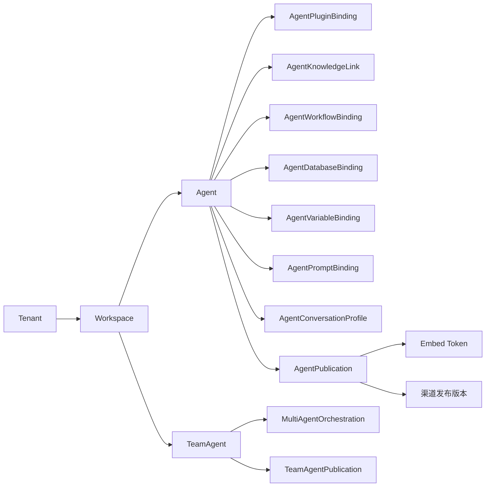

# 智能体（Assistant）域命名与代码映射

> 关联文档：[docs/contracts.md](../contracts.md) 「Assistant 域命名映射」一节、[docs/plan-coze-platform-governance.md](../plan-coze-platform-governance.md)、[docs/plan-coze-atlas-round2.md](../plan-coze-atlas-round2.md)。  
> 用途：跨「文档 / 后端代码 / 前端代码 / 对外 API / 兼容层」统一对智能体相关概念的称谓与边界。

## 1. 概念坐标

Coze 中国版产品文档把「智能体（Assistant）」视为一个**独立产品壳**，包含：人设与回复逻辑、技能装配、预览/调试、发布渠道、协作者。Atlas 仓库中：

- 单体智能体 = `Agent` 聚合根；
- 多智能体团队 = `TeamAgent` 聚合根；
- 「Bot」一词仅出现在 Coze 兼容 API 路由（`/api/draftbot/*` 等），不在 Atlas 业务域中再建模。

## 2. 关系示意

> `WorkspaceChannelRelease` 由 M-G02 引入；当前仓库内尚未存在该实体，画在图里以表达「发布渠道」与「Agent 发布物」之间的目标关系。

## 3. 源码引用

| 概念 | 关键文件 |
| --- | --- |
| `Agent` 聚合根 | [src/backend/Atlas.Domain/AiPlatform/Entities/Agent.cs](../../src/backend/Atlas.Domain/AiPlatform/Entities/Agent.cs) |
| 智能体技能绑定（多种） | [src/backend/Atlas.Domain/AiPlatform/Entities/Agent/AgentBindings.cs](../../src/backend/Atlas.Domain/AiPlatform/Entities/Agent/AgentBindings.cs)、[AgentPluginBinding.cs](../../src/backend/Atlas.Domain/AiPlatform/Entities/AgentPluginBinding.cs)、[AgentKnowledgeLink.cs](../../src/backend/Atlas.Domain/AiPlatform/Entities/AgentKnowledgeLink.cs) |
| 智能体发布物 | [src/backend/Atlas.Domain/AiPlatform/Entities/AgentPublication.cs](../../src/backend/Atlas.Domain/AiPlatform/Entities/AgentPublication.cs) |
| 智能体 REST 主控制器 | [src/backend/Atlas.Presentation.Shared/Controllers/Ai/AgentsController.cs](../../src/backend/Atlas.Presentation.Shared/Controllers/Ai/AgentsController.cs) |
| 智能体 REST 别名（产品语义） | [src/backend/Atlas.PlatformHost/Controllers/AiAssistantsController.cs](../../src/backend/Atlas.PlatformHost/Controllers/AiAssistantsController.cs) |
| 多智能体团队 | [src/backend/Atlas.Domain/AiPlatform/Entities/TeamAgentEntities.cs](../../src/backend/Atlas.Domain/AiPlatform/Entities/TeamAgentEntities.cs)、[TeamAgentsController.cs](../../src/backend/Atlas.PlatformHost/Controllers/TeamAgentsController.cs) |
| 智能体对话与流式 | [src/backend/Atlas.Presentation.Shared/Controllers/Ai/AgentChatController.cs](../../src/backend/Atlas.Presentation.Shared/Controllers/Ai/AgentChatController.cs) |
| 多智能体编排 | [src/backend/Atlas.Domain/AiPlatform/Entities/MultiAgentOrchestration.cs](../../src/backend/Atlas.Domain/AiPlatform/Entities/MultiAgentOrchestration.cs) |
| 工作空间发布渠道（基础） | [src/backend/Atlas.Domain/AiPlatform/Entities/WorkspacePublishChannel.cs](../../src/backend/Atlas.Domain/AiPlatform/Entities/WorkspacePublishChannel.cs)、[WorkspacePublishChannelsController.cs](../../src/backend/Atlas.PlatformHost/Controllers/WorkspacePublishChannelsController.cs) |
| Coze 兼容层（Bot/Workflow） | [src/backend/Atlas.Presentation.Shared/Controllers/Ai/CozeWorkflowCompatControllerBase.cs](../../src/backend/Atlas.Presentation.Shared/Controllers/Ai/CozeWorkflowCompatControllerBase.cs) |
| 前端智能体 IDE | [src/frontend/packages/module-studio-react/src/assistant/agent-workbench.tsx](../../src/frontend/packages/module-studio-react/src/assistant/agent-workbench.tsx)、[publish-center-page.tsx](../../src/frontend/packages/module-studio-react/src/publish/publish-center-page.tsx) |

## 4. 路由规范

- 单体智能体写动作：优先使用 `api/v1/agents`；对外 SDK 与产品文档可使用别名 `api/v1/ai-assistants`。
- 多智能体团队：仅 `api/v1/team-agents`，不复用 `agents` 路由。
- 发布物（嵌入）：`api/v1/ai-assistants/{id}/publications` 与 `api/v1/agents/{id}/publish`。
- 工作空间发布渠道：`api/v1/workspace-publish-channels/*`（M-G02 在此之上扩展 `releases` 子路由 + 真实渠道 connector）。
- Coze 兼容层：`/api/draftbot/*`、`/api/bot/*`、`/api/workflow_api/*`、`/api/playground_api/*`、`/api/op_workflow/*` —— 仅用于兼容上游 Coze 客户端，不要在 Atlas 业务前端直接调用。

## 5. 文案与本地化

| i18n key | 用途 |
| --- | --- |
| `assistantDomainTitle` | 顶层菜单/导航：智能体 |
| `assistantDomainSubtitle` | 列表页副标题：智能体（Assistant） |
| `assistantTeamTitle` | 多智能体团队入口标题 |
| `assistantSkillsBlock` | 智能体编排页「技能」区块标题 |

文案表见 [src/frontend/apps/app-web/src/app/messages.ts](../../src/frontend/apps/app-web/src/app/messages.ts)。

## 6. 与 M-G10 的衔接

触发器（Trigger）与卡片（Card）在 M-G10 之前不属于 `Agent*Binding` 命名空间：

- 触发器目前由 `IRuntimeTriggerService`（M12 引入）承载，不携带 `OwnerAgentId`；
- 卡片当前仅在 Workflow / Coze 兼容层零散表达。

M-G10 将引入 `AgentTrigger` / `AgentCard` 一等绑定，并在 Coze 兼容层切到真实数据。在此之前，前端不要在 `agent-workbench.tsx` 中假设这两类资源存在。

## 7. 检查清单（任何新增智能体相关能力前，先核对以下三条）

1. 该能力是写在 `Agent` 还是 `TeamAgent`？两者数据模型不共享。
2. 是否需要新建对外路由？是 → 优先沿用 `agents` 或 `ai-assistants`，并在 [contracts.md](../contracts.md) 同步「Assistant 域命名映射」表。
3. 是否会暴露给 Coze 客户端？是 → 评估是否需要在 `CozeWorkflowCompatControllerBase` 增加映射，且**不允许**桩响应（参考 M-G03 / M-G10 处理 `list_collaborators` / trigger / card 的方式）。
