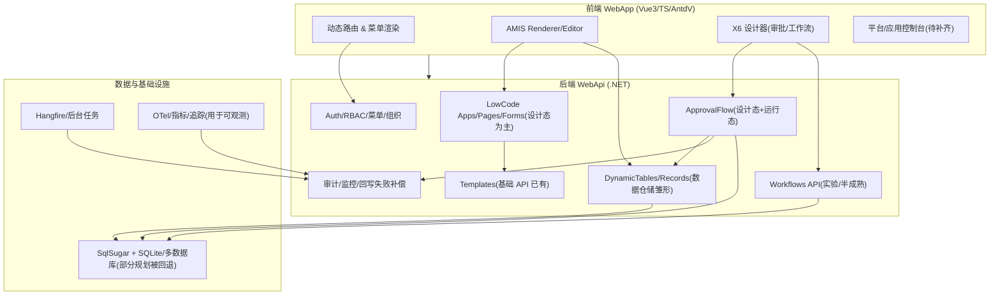

# lKGreat/SecurityPlatform 项目现状深度评估与改进路线图

## 执行摘要

本次审阅以 **GitHub 连接器**优先，对仓库 `lKGreat/SecurityPlatform` 的代码、文档、CI、分支与近期 PR 进行了静态分析，并结合少量高质量公开资料（以官方/原始文档为主，中文优先）形成结论。

项目总体呈现出“底座能力较扎实、核心业务链路已出现雏形、但产品化的‘平台控制台/应用控制台’与‘低代码运行态闭环’仍未完成”的阶段特征。最关键的时间点是：**2026-03-07** 当天 `平台控制台与应用数据源` 相关实现（PR #57）被合入后又被 **revert**（PR #58），导致“平台级控制台/应用级控制台/应用级数据源绑定”等能力在当前 `master` 上处于缺失状态（或退回到更早形态）。fileciteturn63file0L1-L1 fileciteturn62file0L1-L1

从“用户提出的六项缺失”视角看：

- **平台级控制台、应用级控制台**：当前分支已回退到“以系统设置与低代码设计后台为主”的信息架构；缺少平台入口页、应用工作台与应用级资源域（数据源/权限/菜单/别名等）。fileciteturn62file0L1-L1  
- **流程设计器与审批流衔接**：审批流设计器（X6）与动态表审批绑定已形成闭环的一部分，但“工作流（WorkflowCore）设计器”仍偏实验性质，且**流程结构与后端能力边界存在不一致**（前端序列化器限制“仅顺序链路”，而后端 step-types 列表包含分支/循环等概念）。  
- **移动端流程设计器支持**：存在“移动端预览”的设计器能力，但没有面向移动端的流程设计交互方案（更接近“可预览/可运行，但不可设计”）。  
- **预置模板能力**：后端已具备模板实体与 API，但缺少“内置模板的投放、版本治理、可视化选用/市场化沉淀”的产品化闭环。  
- **仓储系统闭环**：动态表（DynamicTables）+ AMIS schema 驱动的 CRUD + 绑定审批流 + 提交审批 + 审批状态回写/失败补偿 已具备“局部闭环”，但在权限模型（目前强依赖 SystemAdmin）、应用域隔离（App scope）、以及“低代码运行态（page runtime）/表单数据持久化（FormData）”方面仍存在断点，导致“可供业务用户使用的闭环”尚不完整。

综合建议：以“**先恢复平台/应用信息架构与资源域** → **补齐运行态（应用访问、权限、数据闭环）** → **流程能力统一（审批/工作流融合或明确边界）**”为主线推进，短期聚焦高确定性与高价值交付，降低跨模块返工风险。

## 项目现状与代码基线

### 分支与近期变更信号

仓库默认分支为 `master`，CI 对 `main/master` 以及 `cursor/**` 分支均触发，说明仓库存在“自动化生成/Agent 分支”与快速试验合并的工作流。fileciteturn99file2L1-L1

近期最关键的产品化相关变更是：

- PR #57：引入“平台控制台 + 应用工作区”的前端体验与“应用级数据源/共享/别名”等后端扩展（已 merge）。fileciteturn63file0L1-L1  
- PR #58：对 #57 做整体 revert（已 merge），删除/回退了上述能力（删除量远大于新增量）。fileciteturn62file0L1-L1  

这一事实直接解释了用户提出的“平台级控制台、应用级控制台、应用级资源域”在当前状态下的缺失。

### CI 与质量门禁

当前 CI 至少覆盖：拼写检查（cspell）、后端 build+单测、前端 build、集成阶段（启动后端→跑 `Bosch.http` 套件→跑 Playwright e2e），并在失败时上传产物；此外还有 CodeQL 安全分析（C# 与 JS/TS）与定时扫描。该组合对“平台级能力演进”是积极信号，但也意味着对架构级变更需同时维护 API 套件与 e2e 稳定性。fileciteturn99file2L1-L1 fileciteturn99file3L1-L1

### 关键技术栈轮廓（用于后续建议定位）

- 前端：Vue 3 + TypeScript + Ant Design Vue；动态路由由后端菜单/路由数据驱动，并提供路径到页面组件的 fallback 映射（例如审批流列表、工作流设计器、系统管理页面等）。  
  - 证据：`src/frontend/.../dynamic-router.ts` 提供 `pathComponentFallbackMap`，覆盖 `/approval/flows`、`/workflow/designer`、`/settings/...` 等路径。  
- 流程可视化：审批流与工作流设计器均基于 **entity["organization","AntV X6","graph editor engine"]**（X6）实现。X6 官方强调“流程图/DAG/ER”等场景与可扩展交互能力。citeturn2search1  
- 低代码渲染：动态表与部分低代码页面使用 **entity["organization","amis","baidu low-code framework"]**（JSON 驱动的前端低代码框架）思路，仓库亦集成 AMIS schema 资源文件（后端 `AmisSchemas/*`）来驱动前端 `AmisRenderer` 渲染。AMIS 官方仓库定位为“通过 JSON 配置生成页面”。citeturn6view0  
- 工作流引擎：后端存在 `api/v1/workflows` 控制器与 step-types 元数据接口；项目也引用了 **entity["organization","Workflow Core","dotnet workflow engine"]**（轻量可嵌入 .NET 工作流引擎）的生态语义（“Definitions/Instances/Events/Steps”等）。citeturn0search9turn0search3  
- 后台任务与调度：后端已纳入 **entity["organization","Hangfire","dotnet background jobs"]** 的典型职责域（后台作业、持久化存储、可靠处理），用于超时、重试、异步处理等是合理方向。citeturn0search1turn0search8  

image_group{"layout":"carousel","aspect_ratio":"16:9","query":["AntV X6 workflow editor screenshot","amis low-code editor screenshot"],"num_per_query":1}

## 现状清单表格

下表以你指定的模块维度，对“当前仓库（master）能直接观察到的能力”做对比式盘点；每行都给出可追溯的仓库路径（必要时可反查 PR #58 的回退说明来理解缺失基因）。fileciteturn62file0L1-L1

> 说明：由于连接器返回的源码文本不携带可校验的 GitHub 行号锚点，本报告的“代码引用”以“文件路径 + 关键函数/类名/关键字符串（可全文搜索定位）+ 片段摘录”方式提供；如需精确行号，请在 GitHub 文件视图中以关键字符串定位并获取实际行号。

| 模块 | 当前可见能力（master） | 主要缺口/边界 | 证据（仓库文件路径与链接） |
|---|---|---|---|
| 平台级控制台 | 以“系统设置/组织权限/数据源/字典/配置”为主的管理后台；动态路由支持 `/settings/*` 与若干系统页路径映射 | 缺少“平台首页/平台入口（console）”、“租户/应用总览与治理入口”、“跨应用资源域”及“统一工作台信息架构”；且近期相关实现已被 revert | 动态路由 fallback 映射：`src/frontend/Atlas.WebApp/src/utils/dynamic-router.ts`；被 revert 的平台控制台实现：PR #57/#58 fileciteturn70file2L1-L1 fileciteturn63file0L1-L1 fileciteturn62file0L1-L1 |
| 应用级控制台 | 低代码应用列表页（创建/编辑/发布/导入导出），可进入 builder；后端低代码应用实体存在（AppKey/ConfigJson/Status/Version 等） | 缺少“应用工作区（workspace）/应用侧导航与配置中心”、“应用级数据源绑定/共享策略/别名”等（已在 PR #57 实现后被 revert）；缺少低代码运行态（按 appKey 访问已发布页面） | 应用列表：`src/frontend/Atlas.WebApp/src/pages/lowcode/AppListPage.vue`；领域实体：`src/backend/Atlas.Domain/LowCode/Entities/LowCodeApp.cs`；被 revert 的能力说明：PR #58 body fileciteturn80file7L1-L1 fileciteturn80file0L1-L1 fileciteturn62file0L1-L1 |
| 流程设计器 | 审批流：列表页+设计器页（含保存/发布/校验/版本等交互）；工作流：WorkflowDesignerPage（X6 拖拽节点、保存定义、测试启动实例） | “审批流”与“工作流”是两套并行设计器与语义体系；工作流设计器目前在序列化层显式限制“仅顺序流程”，而后端 step-types 同时暴露分支/循环等概念，存在能力不一致风险；缺少统一的流程域模型与运行态观察闭环（面向普通业务用户） | 审批流列表/设计：`src/frontend/.../ApprovalFlowsPage.vue`、`ApprovalDesignerPage.vue`；工作流设计器：`src/frontend/.../WorkflowDesignerPage.vue`；工作流序列化限制：`src/frontend/.../useWorkflowSerializer.ts`；后端 step-types：`src/backend/Atlas.WebApi/Controllers/WorkflowController.cs` fileciteturn75file3L1-L1 fileciteturn72file2L1-L1 fileciteturn72file3L1-L1 fileciteturn75file3L1-L1 |
| 移动端支持 | 表单设计器支持“移动端预览”切换（deviceMode=mobile），并通过 `AmisEditor` 的 `is-mobile` 参数控制预览形态 | 缺少移动端流程设计交互（审批/工作流的 X6 画布在移动端可用性与手势交互需要单独方案）；更现实的是先做“移动端运行态与审批处理” | 表单设计器：`src/frontend/Atlas.WebApp/src/pages/lowcode/FormDesignerPage.vue`（PC/移动端预览） fileciteturn20file0L1-L1 |
| 模板系统 | 后端存在 TemplatesController 与模板实体（如 ComponentTemplate，含 IsBuiltIn 字段语义）；可推断支持“模板实例化/复用”的方向 | 缺少“预置模板投放（内置模板数据/导入包）”、“模板版本治理/依赖管理”、“模板市场/可视化挑选/与低代码/审批流联动”的产品化闭环；前端未见对应管理页 | 后端 API：`src/backend/Atlas.WebApi/Controllers/TemplatesController.cs`；模板实体/服务：`src/backend/Atlas.Domain/Templates/ComponentTemplate.cs`、`src/backend/Atlas.Infrastructure/Services/ComponentTemplateService.cs` fileciteturn83file1L1-L1 fileciteturn98file0L1-L1 fileciteturn98file7L1-L1 |
| 仓储系统相关模块 | 动态表（DynamicTables）具备：表结构管理、记录 CRUD、AMIS schema 驱动 UI；支持绑定审批流、从记录提交审批、审批状态回写/失败补偿监控页面 | 闭环仍偏“系统管理员视角”：API 主要受 SystemAdmin 保护；缺少“应用域/业务用户视角的数据入口（App runtime + 权限）”；FormData 持久化与页面运行态在代码层未见落地（仅文档/规划痕迹） | 动态表 UI：`src/frontend/.../DynamicTablesPage.vue`、`DynamicTableCrudPage.vue`；AMIS schema：`src/backend/Atlas.WebApi/AmisSchemas/dynamic-tables/*.json`；动态表与记录 API：`src/backend/Atlas.WebApi/Controllers/DynamicTablesController.cs`、`DynamicTableRecordsController.cs`；回写监控：`src/frontend/.../WritebackMonitorPage.vue` + `ApprovalWritebackFailuresController.cs` fileciteturn87file11L1-L1 fileciteturn87file12L1-L1 fileciteturn87file14L1-L1 fileciteturn87file1L1-L1 fileciteturn84file10L1-L1 |

## 差距分析

### 平台级控制台缺失评估

当前的前端路由与页面组织更接近“系统管理后台 + 若干业务模块页”，缺少“平台首页/控制台”的统一入口与跨域导航信息架构；而 PR #57 曾引入 `/console` 与 `/apps/:appId/*` 等结构，但已被 PR #58 整体回退。fileciteturn62file0L1-L1

缺失功能拆解（以“平台控制台”通常应覆盖的治理能力为参照）：

- 平台入口：平台总览（租户/应用/运行态指标/待办/告警等聚合）缺失，现默认落点更接近 `/profile` 等页面或菜单驱动模块页（与“平台控制台”定位不一致）。  
- 跨应用治理：应用列表虽存在（低代码 AppList），但缺少“应用工作台/应用域资源绑定”、缺少跨应用的“模板/数据源/连接器/插件”治理面板。  
- 租户治理：仓库存在租户上下文（tenant headers、tenant provider）与系统管理员策略，但未见“租户 CRUD/租户生命周期/配额与隔离审计”的平台化入口与数据模型闭环（这属于典型平台控制台责任域）。

关键技术债务与风险：

- 信息架构返工风险高：平台控制台一旦落地，会牵动“菜单模型、动态路由、权限码、默认首页、面包屑与布局容器”等跨切面能力，且 PR #57→#58 的快速回退说明当前实现方式可能在交付质量/兼容性上未达预期。fileciteturn62file0L1-L1  
- “平台 vs 应用”的边界尚未固化：若继续以“系统后台”形态演进，会导致后续再引入“应用域”时必须做路径与权限域的二次迁移，成本更高。

优先级建议：**P0（产品形态与资源域基础）**。原因是它决定了后续所有模块的组织方式、权限域落点与交付节奏。

### 应用级控制台缺失评估

当前“低代码应用”更多是“设计对象”，而不是“可访问的业务应用”。有应用列表、Builder 路径，但缺少：

- 应用工作区（App workspace）：应用配置（菜单、页面发布、权限映射、导航、Logo/主题等）应在 App 域内配置并可独立授权；当前主要集中在全局模块页。  
- 应用级数据源/共享/别名：PR #57 描述了“应用绑定数据源、共享策略、实体别名”等；PR #58 明确将其移除，且后端 `LowCodeApp` 实体当前并无这些字段。fileciteturn62file0L1-L1 fileciteturn80file0L1-L1  
- 应用运行态（Runtime）：文档层面出现 `page-runtime` 的规划痕迹，但代码检索层未见对应控制器/服务落地，导致“用户访问已发布页面/表单并产生数据”的关键链路无法闭合。

关键技术债务与风险：

- 设计态功能先行、运行态滞后：会使“发布”语义弱化（变成仅仅版本号或状态字段），长期会造成术语与数据模型混乱（例如 Published 但不可用）。  
- 权限模型将被迫“系统管理员化”：目前动态表记录与动态表管理 API 多以 SystemAdmin 策略保护，若没有应用域与业务角色的权限模型，闭环只能由管理员操作，不符合“低代码平台”的典型使用方式。fileciteturn84file10L1-L1

优先级建议：**P0（与平台控制台同一主线）**，并且应与“动态表/审批闭环”一起规划，否则很容易出现“有数据、无应用入口”的割裂。

### 流程设计器与审批流衔接缺失评估

这里建议将“流程能力”分成两条线来审视：

- 审批流（Approval Flow）：已与动态表绑定、提交审批入口、状态回写等形成“局部闭环”，且前端存在完整设计器页面。  
- 工作流（Workflows / WorkflowCore 风格）：存在独立的 WorkflowDesignerPage 与 `api/v1/workflows`，但从前端序列化器的报错文案可见其强制限制“仅顺序链路（NextStepId）”，与“工作流引擎应支持分支/循环/事件等待”等能力预期存在落差；同时后端 step-types 的枚举却包含 If/While/Foreach 等概念，进一步放大了“前后端契约不一致”的技术债风险。citeturn0search9turn0search3 fileciteturn72file3L1-L1 fileciteturn75file3L1-L1

因此，“衔接缺失”的核心不在于“有没有画布”，而在于：

1) **流程域模型不统一**（审批流 DSL 与工作流 DSL 并存）  
2) **设计器能力边界与运行引擎边界不一致**（能画/不能跑，或接口暴露能力与实现能力不一致）  
3) **工作流与审批的组合能力缺失**：若期望在工作流中编排“人工审批”步骤，应明确“审批是工作流的一种 Step（UserTask/ApprovalStep）”还是“审批是独立引擎，由工作流调用/等待事件”。当前仓库未呈现明确的一致方案。

优先级建议：**P1（在平台/应用主线打通后推进）**。原因是流程统一往往牵涉运行态、权限、审计、表单渲染等多个子系统；在平台/应用缺失时推进，返工概率高。

可选替代方案（开源组件建议）：

- 若你们希望对齐 BPMN 生态并复用成熟建模器，可评估 **entity["organization","bpmn.io","bpmn js toolkit"]** 的 bpmn-js（浏览器内 BPMN Viewer/Editor），以及配套的表单/决策建模器（form-js、dmn-js）。citeturn1search4  
- 若团队需要更“产品化”的 BPMN/DMN 建模与协作，可参考 **entity["organization","Camunda","process orchestration platform"]** Modeler 的产品形态（它强调 BPMN/DMN/Forms 的统一建模体验）。citeturn1search0turn1search2  
- 若坚持 X6 自研画布：X6 官方建议在 Vue 节点数量多时使用 `@antv/x6-vue-shape` 的 teleport 能力优化挂载性能，但这会引入“运行时编译/导入导出限制”等工程约束，需要提前在架构层定界。citeturn2search2turn2search1  

### 移动端流程设计器支持缺失评估

当前“移动端”更像设计器的 **Preview Mode**（例如表单设计器支持 `deviceMode=mobile`），但审批/工作流的画布设计器要在移动端可用，需要解决：

- 画布手势：缩放/拖拽/框选/右键菜单替代（长按菜单、浮动工具条等）；  
- 面板布局：属性面板与节点列表的移动端折叠与导航（类似“底部抽屉 + 全屏属性页”）；  
- 输入法与复杂配置：条件组编辑、审批人选择、字段权限矩阵等在移动端的可操作性与效率。

风险很现实：移动端做“完整设计器”会显著增加交互复杂度与测试成本；多数平台选择的常见路径是“**移动端只做运行态（填表/审批/查看），设计态仅 PC**”。建议将你的“移动端流程设计器支持”拆成两个阶段：先实现“移动端运行态闭环”，再评估“移动端轻量编辑（例如仅改审批人/超时策略）”。  

优先级建议：**P2（除非业务强要求移动端设计）**。

### 预置模板能力缺失评估

模板系统在代码层面已具备“实体 + 服务 + 控制器”，并且 `ComponentTemplate` 暴露了 `IsBuiltIn` 这样的字段语义，说明作者已经考虑“内置模板 vs 用户模板”的区分。fileciteturn98file0L1-L1

但当前缺失的关键能力是“模板的供给与治理”：

- 没有看见与发布流程绑定的“模板包/模板仓库（market）/版本策略”；  
- 缺少模板与低代码对象（App/Form/Page/ApprovalFlow/DynamicTable schema）的明确映射策略；  
- 前端缺少模板管理/选用入口（当前主要通过导入 JSON 方式间接复用）。

优先级建议：**P1**：模板一旦做对，可以显著降低“从 0 到 1”成本，并可作为“平台生态/集成”的资产沉淀载体。

### 仓储系统闭环缺失评估

当前“动态表 + AMIS schema 驱动 UI + 绑定审批流 + 提交审批 + 状态回写/失败补偿”已经形成了可演示的闭环雏形：动态表列表页可以绑定审批流与状态字段，记录 CRUD 页可“提交审批”，属于关键价值链路。fileciteturn87file1L1-L1

但闭环仍不完整，主要断点在：

- 权限域：动态表与记录 API 多数受 `SystemAdmin` 保护，难以直接成为业务用户的“仓储/数据运营”系统；  
- 应用域：动态表目前更像“平台数据工具”，而不是某个应用（App）的数据资源；若不引入 App scope（或 project scope），跨应用的数据治理与隔离会困难；  
- 运行态：如果“仓储闭环”目标是“业务用户通过应用页面录入→触发审批→审批结束后数据进入稳定状态并可被后续流程使用”，那么需要“应用运行态页面 + 表单数据持久化（FormData）/或与动态表写入映射”的完整链路。目前相关内容更像规划文档而非实现。fileciteturn80file16L1-L1

优先级建议：**P0/P1 交界**：若你们的核心商业价值是“低代码 + 审批 + 数据仓储闭环”，则应提到 P0；否则可作为 P1 跟随平台/应用主线推进。

## 改进建议与实施路线图

### 模块依赖关系图

### 实施里程碑表

在未指定团队规模/预算/部署约束情况下，以下以“中等规模小组（2–4 后端 + 2 前端 + 1 测试/产品）”为参考给出可裁剪路线。工作量以“人日”粗估（±30%），并显式标注关键依赖与替代路径。

| 阶段 | 目标产出 | 关键任务 | 依赖 | 估算工作量 |
|---|---|---|---|---:|
| 短期 | 恢复平台/应用信息架构骨架，稳定主干可发布 | 1) 明确“平台首页/默认落点”与 `/console` 信息架构；2) 恢复或重做“应用工作区”路由与布局（参考但不盲搬 PR #57，避免再次 revert）；3) 定义 App scope 基础上下文（header/claim/route param 的权威来源） | 需要统一菜单模型与权限码；需同步修复 e2e 与 API 套件 | 20–35 人日 |
| 短期 | 应用级资源域最小集（数据与权限） | 1) 应用级数据源：先做“应用引用租户数据源”而非“重新引入多驱动包”以降低复杂度；2) 应用级菜单/权限映射；3) AppKey 作为运行态入口名空间 | 需要与 RBAC 权限码、动态路由生成一致 | 25–45 人日 |
| 中期 | 低代码运行态闭环（仓储闭环关键断点） | 1) Page Runtime：按 appKey+pageKey 渲染已发布 schema；2) FormData 持久化（或明确“表单提交→动态表写入”的映射）；3) 将动态表/记录访问权限从 SystemAdmin 收敛到“应用角色/数据权限规则” | 需要清晰的数据权限模型；需要审计事件标准化 | 45–80 人日 |
| 中期 | 审批/动态表闭环产品化 | 1) 动态表审批绑定能力从“管理员工具”演进为“应用能力（可授权给业务角色）”；2) 补齐审批运行态（任务中心、移动端处理优先）；3) 写回失败补偿从“监控页”扩展为“告警/重试策略/死信归档” | 依赖运行态入口与权限域 | 30–60 人日 |
| 长期 | 流程能力统一与生态化（选择其一） | 方案A：明确工作流与审批的边界，提供“工作流调用审批/等待事件”的组合；方案B：引入 BPMN（bpmn-js/Camunda 生态）并统一建模语言；方案C：继续 X6 自研但统一流程域模型与表达式（避免双 DSL） | 依赖前述运行态/权限/审计成熟 | 60–120 人日 |
| 长期 | 预置模板与资产市场 | 1) 内置模板包（动态表 CRUD/表单/审批流/仪表盘）随版本发布；2) 模板版本治理与依赖声明；3) 可视化选用/导入导出/回滚 | 依赖 App scope 与运行态可用 | 25–60 人日 |

### 可行的落地策略与替代方案

**平台/应用控制台**：建议把“平台控制台”视为“多应用系统的入口与治理层”，不要与“系统设置”混为一谈。你可以复用现有动态路由机制，但需要新增两个概念：

- Layout 层：PlatformLayout（平台导航）与 AppLayout（应用工作区导航）。  
- Resource 域：应用资源（pages/forms/dashboards/datasources/templates）必须有“归属 AppId”。

如果不希望再次走“PR #57 大改→回退”的路径，建议采用“**渐进式灰度**”：先保留旧入口，但新增 `/console` 并允许用户切换；当功能齐备再切换默认落点。

**流程设计器衔接**：建议先在产品层做清晰边界声明：

- “审批流”是“人机协作的业务流程”，以任务/抄送/可见范围/审批记录为核心；  
- “工作流”是“系统编排”，以事件/延迟/重试/补偿为核心；  
- 两者衔接的最小集：工作流可触发审批并等待审批结果事件。

如果你们倾向采用 BPMN 标准与更成熟的建模生态，可考虑 bpmn-js；它提供在 Web 内嵌 BPMN Editor/Viewer 的基础能力。citeturn1search4  
若你们希望支持更复杂的协作建模与标准化落地，可参考 Camunda Modeler 强调的 BPMN/DMN/Forms 统一建模体验。citeturn1search0turn1search2  
若继续使用 X6，自研画布的优势是与当前 Vue 技术栈一致、可高度定制，但要持续承担“性能/导入导出/移动端交互”的工程成本；X6 官方对 Vue 节点性能优化给出了 teleport 等建议，需在架构层评估其副作用。citeturn2search2turn2search1

**仓储闭环**：在当前代码基础上，你们已经拥有“动态表 + 审批绑定 + 提交审批 + 回写”的骨架。下一步建议用“业务用户视角”重构权限域：将 SystemAdmin-only 的路径拆为：

- 平台管理员：管理动态表结构、应用资源治理；  
- 应用管理员：在 App 域内配置数据表与审批绑定；  
- 业务用户：只能对授权数据执行 CRUD/提交审批/查看状态。

## 风险与优先级评估

### 风险与优先级矩阵

| 缺失项 | 业务影响 | 技术风险 | 建议优先级 | 核心风险说明 |
|---|---|---|---|---|
| 平台级控制台 | 高 | 高 | P0 | 信息架构牵动面大；PR #57→#58 回退表明一次性大改风险高，应采用渐进式与契约优先策略fileciteturn62file0L1-L1 |
| 应用级控制台 | 高 | 高 | P0 | 没有 App workspace 与 App scope，会导致权限/数据/模板都无法产品化沉淀 |
| 流程设计器与审批衔接 | 中-高 | 中-高 | P1 | 两套 DSL/设计器并行带来长期维护成本；工作流设计器边界与引擎能力不一致易形成“能画不能跑” |
| 移动端流程设计器 | 中 | 高 | P2 | 移动端设计交互成本极高，建议先实现移动端运行态；设计态移到 PC 是更常见路径 |
| 预置模板能力 | 中 | 中 | P1 | 没有模板资产沉淀，低代码与审批的复用效率会被拉低；但可在运行态闭环后再强化 |
| 仓储系统闭环 | 高（若以低代码为核心） | 中-高 | P0/P1 | 动态表闭环已有雏形，但权限域与运行态缺失会使其停留在“管理员工具”阶段 |

### 关键工程化风险清单

最需要显式管控的不是“功能做不做得出来”，而是“做出来是否会再次被回退”：

- 大改动一次性合并风险：PR #57 与 #58 的快速往返，是强烈信号——需要更细粒度拆分里程碑与 PR，保持可回滚但不破坏主干体验。fileciteturn62file0L1-L1  
- 前后端契约漂移：流程类能力尤其容易出现“前端可配置项 > 后端可执行项”的漂移；建议将“发布前校验（validate）”作为强制门禁，把不支持的结构在设计器阶段就 fail fast。  
- 运行态缺失导致的“发布语义虚化”：低代码对象存在 Published 状态但缺少 runtime，会导致运营与用户理解偏差，甚至造成“上线不可用”的信任折损。

## 参考的仓库文件与链接列表

以下列出本报告中“承重最高”的仓库证据入口（按主题分组；均为 `master` 路径或 PR 元信息链接）：

### 平台/应用控制台与回退证据

- PR #57 平台控制台与应用数据源（已合入）：`https://github.com/lKGreat/SecurityPlatform/pull/57` fileciteturn63file0L1-L1  
- PR #58 Revert 平台控制台与应用数据源（已合入）：`https://github.com/lKGreat/SecurityPlatform/pull/58` fileciteturn62file0L1-L1  
- 动态路由 fallback 映射：`src/frontend/Atlas.WebApp/src/utils/dynamic-router.ts` fileciteturn70file2L1-L1  

### 低代码应用（设计态）

- 应用列表页：`src/frontend/Atlas.WebApp/src/pages/lowcode/AppListPage.vue` fileciteturn80file7L1-L1  
- 低代码应用实体：`src/backend/Atlas.Domain/LowCode/Entities/LowCodeApp.cs` fileciteturn80file0L1-L1  
- 运行态规划文档痕迹：`docs/lowcode/page-runtime.md` fileciteturn80file16L1-L1  

### 流程能力（审批/工作流）

- 工作流设计器页：`src/frontend/Atlas.WebApp/src/pages/WorkflowDesignerPage.vue` fileciteturn72file2L1-L1  
- 工作流序列化器（限制顺序链路）：`src/frontend/Atlas.WebApp/src/composables/useWorkflowSerializer.ts` fileciteturn72file3L1-L1  
- 工作流 API 控制器：`src/backend/Atlas.WebApi/Controllers/WorkflowController.cs` fileciteturn75file3L1-L1  
- 审批流功能说明文档：`docs/审批流功能说明.md`  
- 审批流设计/列表页：`src/frontend/Atlas.WebApp/src/pages/ApprovalDesignerPage.vue`、`ApprovalFlowsPage.vue`

### 动态表与仓储闭环

- 动态表页面：`src/frontend/Atlas.WebApp/src/pages/dynamic/DynamicTablesPage.vue`、`DynamicTableCrudPage.vue` fileciteturn87file11L1-L1 fileciteturn87file12L1-L1  
- 动态表 AMIS schema：`src/backend/Atlas.WebApi/AmisSchemas/dynamic-tables/list.json`、`crud.json`  
- 动态表 API：`src/backend/Atlas.WebApi/Controllers/DynamicTablesController.cs`、`DynamicTableRecordsController.cs` fileciteturn87file14L1-L1 fileciteturn84file10L1-L1  
- 回写失败监控页面与 API：`src/frontend/.../WritebackMonitorPage.vue`、`src/backend/.../ApprovalWritebackFailuresController.cs`

### 模板系统

- 模板控制器：`src/backend/Atlas.WebApi/Controllers/TemplatesController.cs` fileciteturn83file1L1-L1  
- 组件模板实体与服务：`src/backend/Atlas.Domain/Templates/ComponentTemplate.cs`、`src/backend/Atlas.Infrastructure/Services/ComponentTemplateService.cs` fileciteturn98file0L1-L1 fileciteturn98file7L1-L1  

### CI 与安全扫描

- CI 工作流：`.github/workflows/ci.yml` fileciteturn99file2L1-L1  
- CodeQL 工作流：`.github/workflows/security.yml` fileciteturn99file3L1-L1  

### 外部参考资料（用于替代方案与技术边界判断）

- X6 官方简介与能力描述（中文）：citeturn2search1  
- X6 Vue 节点性能建议（Teleport 等）：citeturn2search2  
- AMIS 官方仓库与定位说明：citeturn6view0  
- Workflow Core 官方文档/仓库（引擎语义参考）：citeturn0search9turn0search3  
- Hangfire 官方文档（后台作业与可靠处理语义参考）：citeturn0search1turn0search8  
- bpmn.io（bpmn-js、dmn-js、form-js 的统一工具箱入口）：citeturn1search4  
- Camunda Modeler（BPMN/DMN/Forms 一体化建模产品形态参考）：citeturn1search0turn1search2