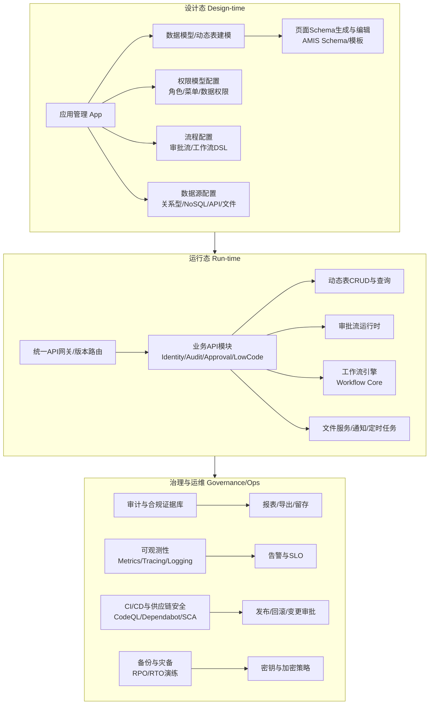
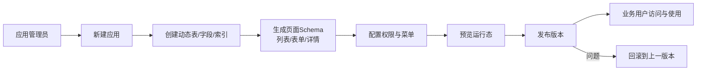
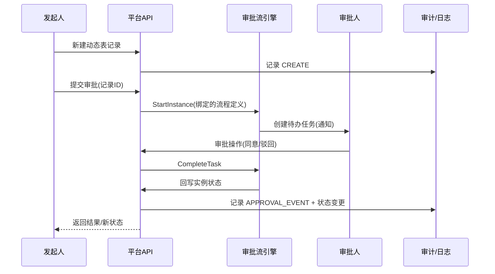
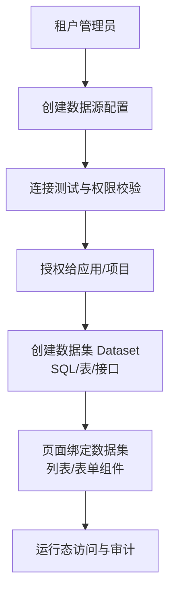
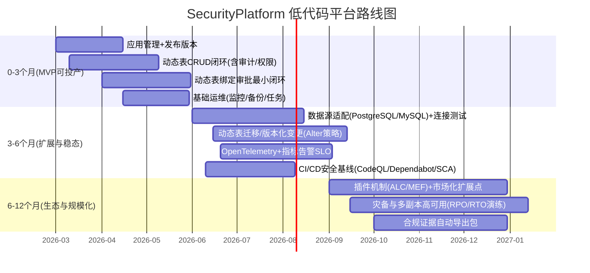

# SecurityPlatform 等保2.0 平台低代码多应用系统设计深度研究报告

## 执行摘要

本次研究优先审阅并引用了你指定的 GitHub 仓库 **lKGreat/SecurityPlatform**（默认分支 master；文中引用位置以“文件路径 + 关键方法/类/配置点”为主），并在覆盖仓库后补充了等保2.0核心国家标准题录信息、工作流引擎与低代码/可观测性/供应链安全的官方文档与原始资料作为外部证据。外部资料重点覆盖：entity["book","GB/T 22239-2019 信息安全技术 网络安全等级保护基本要求","china national standard 2019"]、entity["book","GB/T 25070-2019 信息安全技术 网络安全等级保护安全设计技术要求","china national standard 2019"]、entity["book","GB/T 28448-2019 信息安全技术 网络安全等级保护测评要求","china national standard 2019"]等保2.0体系标准信息，以及低代码前端框架 entity["organization","Baidu","opensource org"] AMIS、流程可视化编辑引擎 entity["organization","AntV","ant group dataviz"] X6、定时任务平台 Hangfire、工作流库 Workflow Core 等。citeturn1view0turn3search2turn4search8turn0search1turn10search0turn9search1turn5search2

关键结论如下（面向“低代码 + 多应用 + 可投产 + 等保2.0合规”目标）：

SecurityPlatform 仓库已经具备**生产级平台底座雏形**：多租户强校验（请求头与 JWT 租户声明一致）、多应用 AppId 上下文、可选项目域 Project Scope、RBAC + 权限策略、审计日志与登录日志、CSRF 校验、XSS 输入净化、幂等键、限流（至少对认证接口）、定时任务（Hangfire）、工作流（Workflow Core + DSL）、以及“动态表 + AMIS Schema 生成”的低代码 CRUD 基础能力。核心证据集中在：`src/backend/Atlas.WebApi/Program.cs`（安全中间件与认证授权/工作流/定时任务注册）、`src/backend/Atlas.WebApi/Middlewares/TenantContextMiddleware.cs`、`src/backend/Atlas.WebApi/Middlewares/ProjectContextMiddleware.cs`、`src/backend/Atlas.WebApi/Filters/IdempotencyFilter.cs`、`src/backend/Atlas.WebApi/Middlewares/AntiforgeryValidationMiddleware.cs`、`src/backend/Atlas.WebApi/Middlewares/XssProtectionMiddleware.cs`、`docs/contracts.md`、`docs/lowcode-dynamic-structure.md`、`src/backend/Atlas.Infrastructure/Services/DynamicTableCommandService.cs`、`src/backend/Atlas.WebApi/Controllers/DynamicAmisController.cs` 等。  

因此，“低代码平台”设计应采取 **“模块化单体（Modular Monolith）+ 元数据驱动（Metadata-driven）+ 标准化安全底座”** 的路线：在不打破现有架构的前提下，将“应用/数据模型/页面/权限/流程/数据源”统一抽象为可版本化、可审计、可回滚的元数据对象；将运行态（Runtime）严格限制在“解释执行元数据 + 受控扩展点”，以满足合规与生产稳定性。

主要风险与改造重点：

动态表能力目前**强依赖 SQLite**且存在“字段变更/Alter”受限（接口已预留但 `AlterAsync` 返回不支持），这对“多应用系统投产”与“长期演进”是核心瓶颈。建议在 0–3 个月内优先补齐：数据源适配层（至少 PostgreSQL/MySQL + SQLite）、动态表变更策略（版本化迁移）、数据隔离/加密与备份策略闭环。  
工作流方面，仓库审批流模块已实现大量 FlowLong 复刻能力（委派/认领/路由/子流程/定时器/触发器/超时提醒等），但需要把“流程定义/表单渲染/字段权限/业务回调”与“低代码业务实体（动态表记录）”进一步产品化为可交付的闭环。  
运维可观测性目前有基础监控接口（服务器信息），但缺少“端到端追踪/指标体系/告警/发布回滚”体系化实现；建议引入 OpenTelemetry 与统一指标规范，并把 CI/CD、SAST/SCA、依赖告警纳入默认流水线。citeturn13search3turn16search0turn16search2

## 仓库关键发现与引用位置

本次可用连接器：**github**（仅此一个；按你的要求，连接器侧仅审阅仓库 lKGreat/SecurityPlatform）。

下表给出对仓库的关键发现与证据索引（以路径 + 关键类/方法为定位）。其中少量文件在连接器读取时触发安全拦截（例如含 `Sensitive*` 命名的序列化脱敏相关文件、个别 DynamicRecords 控制器等），我在报告中会明确指出“未能直接审阅源码细节”的位置，并用仓库其他可见证据与外部资料补齐推导，不会把推导当作既成事实。

| 关键发现 | 证据位置（文件/路径/方法或配置点） | 对低代码平台设计的意义 |
|---|---|---|
| 生产环境安全基线已具雏形：JWT + 证书认证、CSRF、XSS、幂等、限流、权限策略、租户/项目上下文 | `src/backend/Atlas.WebApi/Program.cs`（AddAuthentication、AddAntiforgery、AddRateLimiter、UseMiddleware 顺序）；`TenantContextMiddleware.InvokeAsync`；`ProjectContextMiddleware.InvokeAsync`；`AntiforgeryValidationMiddleware.InvokeAsync`；`XssProtectionMiddleware.InvokeAsync`；`IdempotencyFilter.OnActionExecutionAsync` | 低代码平台的“可投产”关键在于**默认安全**：把安全控件做成平台内建能力而不是各应用重复实现。并且中间件顺序已经体现“先上下文、再鉴权、再业务”的结构，可继续演进。 |
| 多租户强校验：匿名态要求租户头；登录态以 claim 为准且校验 header/claim 一致 | `TenantContextMiddleware`（Header 解析 + Claim 解析 + 一致性校验 + health/openapi 例外） | 适合等保场景：避免“越权跨租户访问”。对低代码运行态尤其关键（动态表访问必须天然隔离）。 |
| 多应用 AppId 与项目域 Project Scope 已在后端引入 | `HttpContextAppContextAccessor.GetAppId`（claim/header/默认值回退）；`ProjectContextMiddleware`（`X-Project-Id` + membership 校验 + EnableProjectScope 开关） | 支持“同平台多应用”与“应用内多项目空间”，是“多应用系统”目标的核心前提。 |
| “动态表 + 动态 CRUD + AMIS Schema 生成”已落地为低代码核心通路 | `docs/contracts.md`（动态 CRUD 合同、Header 约定）；`docs/lowcode-dynamic-structure.md`（AmisSchemas 目录约定）；`Atlas.Domain/DynamicTables/*`；`DynamicTableCommandService`（Create/Update/Delete/BindApprovalFlow/SubmitApproval）；`DynamicAmisController`（CRUD 页面 schema 生成） | 这是最接近“低代码”的现有资产：把“数据模型 + 页面（schema）+ CRUD API”串成了可扩展的元数据运行态。后续应围绕“数据源适配、变更迁移、权限/审计/流程绑定、发布回滚”完善投产闭环。 |
| 审批流引擎能力很强且已有复刻计划与完成标记 | `.cursor/plans/flowlong_feature_replication_4a7630fa.plan.md`（阶段 1–5 多项 completed）；`docs/审批流功能说明.md`；`src/frontend/.../approval-tree.ts`；`src/backend/Atlas.Domain.Approval/Enums/FlowNodeType.cs`；`ConditionEvaluator` 等 | 对等保平台常见“工单/审批/整改闭环”极其关键。下一步更重要的是产品化：可视化配置、表单/字段权限、审批回调、超时策略、通知与审计。 |
| 定时任务（Hangfire）已集成，且提供任务列表/触发/启停 API 雏形 | `Program.cs`（AddHangfire + SQLiteStorage）；`HangfireScheduledJobService`；`ScheduledJobsController`；`docs/plan-定时任务.md` | 平台级能力：用于“审批超时、审计清理、备份、指标汇总、同步任务”等，支撑运维与合规。 |
| 初始数据与权限/菜单/组织种子较完整 | `DatabaseInitializerHostedService`（CodeFirst 建表 + 种子角色/权限/菜单/部门/岗位 + BootstrapAdmin 约束） | 低代码平台需要“开箱即用的治理模型”（组织/岗位/角色/权限/菜单）。该文件提供了可复用的治理初始化方式。 |
| 安全增强存在实现细节风险点 | `XssProtectionMiddleware`：写方法判断条件缺少括号（可能导致 PUT/PATCH 非 JSON 也进入 JSON 净化分支） | 安全中间件要“正确且可解释”。建议纳入安全测试与回归用例，并加性能与兼容性限制。 |
| 已有 MFA（TOTP）单测，安全能力持续演进 | `tests/Atlas.SecurityPlatform.Tests/Security/TotpServiceTests.cs` | 等保平台常需要增强身份鉴别；可将 MFA 做成可配置策略并纳入安全审计与风控。 |

## 目标与约束

### 等保2.0合规要求与可验证证据链

等保2.0体系中，“基本要求 + 设计技术要求 + 测评要求”是最常被引用的三类国家标准：  

- entity["book","GB/T 22239-2019 信息安全技术 网络安全等级保护基本要求","china national standard 2019"]：发布/实施信息与发布单位在国家标准全文公开系统可查，发布单位为 entity["organization","国家市场监督管理总局","china regulator"]、entity["organization","国家标准化管理委员会","china standards body"]，实施日期为 2019-12-01。citeturn1view0  
- entity["book","GB/T 25070-2019 信息安全技术 网络安全等级保护安全设计技术要求","china national standard 2019"]：同为等保2.0核心标准之一，可在国家标准全文公开系统查到标准状态、发布日期与实施日期（实施 2019-12-01）。citeturn3search2  
- entity["book","GB/T 28448-2019 信息安全技术 网络安全等级保护测评要求","china national standard 2019"]：在全国标准信息公共服务平台可查标准信息与复审信息（例如复审“继续有效”等元数据）。citeturn4search8  

在产品落地层面，“合规”必须能形成**可审计的证据链**（制度文件、系统设计、配置清单、日志留存、权限审计、测评映射表与整改闭环资料），而不仅仅是“功能存在”。因此，本报告建议将等保控制点映射为平台内置的“证明点（Evidence Points）”，并以低代码方式内建：

- 身份鉴别与访问控制：统一认证、强制租户隔离、RBAC/ABAC（含数据权限）  
- 安全审计：管理员与业务关键操作全留痕（登录/登出/令牌刷新/权限变更/流程审批/数据变更）  
- 输入验证与防注入：XSS/SQL 注入防护默认开启、白名单可审计  
- 可用性与灾备：备份策略、恢复演练、关键数据加密、变更可回滚  
- 运维安全：变更审批、最小权限、可观测性、漏洞与依赖治理

仓库已经把其中一部分落到“默认中间件 + 统一返回结构 + 审计记录器 + 幂等/CSRF/XSS”等平台级位置，为后续“证明点工程化”奠定了良好基础（见上一节索引）。

### 生产级可用性、扩展性、安全性、运维监控、性能目标

为避免“目标不可验收”，建议把目标拆成可量化项，并对未指定参数显式标注。

| 维度 | 目标（现状/要求） | 说明与建议验收口径 |
|---|---|---|
| 合规目标 | **等保2.0：目标等级未指定** | 建议明确目标等级（常见为二级/三级；三级最常见于政企生产系统）。若未明确，平台设计至少按“三级实施强度”规划，验收才不会反复返工。 |
| 可用性 | **未指定** | 建议：单机部署（MVP）≥99.5%；多副本（6–12个月）可达 ≥99.9%。需定义：RTO/RPO、演练频率、故障域。 |
| 可扩展性 | **未指定** | 建议：从“模块化单体 + 可插拔扩展点”起步，逐步支持横向扩容（无状态 WebApi + 独立存储/队列/工作流持久化）。 |
| 安全性 | 平台默认安全（强制租户隔离、最小权限、审计、输入校验） | 可验证：权限模型、审计日志、配置基线、渗透/代码扫描报告。参考 OWASP ASVS/Top10 作为工程化安全需求来源。citeturn13search1turn13search4 |
| 运维与监控 | **未指定**（仓库已有基础 server info） | 建议统一采用 OpenTelemetry 指标/链路/日志三件套，并落地告警与 SLO。citeturn13search3 |
| 性能目标 | **未指定** | 建议给出“可选值范围 + 默认建议”：<br>• API P95 延迟：200–500ms（典型后台管理）<br>• 单租户并发：100–1000（视业务）<br>• 动态表 CRUD：P95 ≤800ms（含分页查询）<br>• 设计器页面：首次加载 ≤3s（中后台常见） |

## 架构与技术选型

### 平台参考架构

建议将 “SecurityPlatform（等保2.0 平台）低代码系统”拆为三层：**设计态（Design-time）**、**运行态（Run-time）**、**治理与运维（Governance/Ops）**。结合仓库现状，推荐以“模块化单体 + 可插拔扩展点”作为主线架构，必要时对工作流/报表/搜索等能力外置。



### 低代码引擎、工作流与扩展机制的技术取舍

结合仓库现有技术风格（.NET + Vue3 + 元数据驱动），关键组件建议如下：

- 可视化表单/页面：仓库已采用 “AMIS Schema 生成 + 文件系统 Schema Provider + 动态 CRUD API” 的方向（`docs/contracts.md`、`DynamicAmisController`、`FileSystemAmisSchemaProvider`）。AMIS 的核心特性是“通过 JSON 配置生成页面”，有助于降低前端开发成本。citeturn9search1  
- 流程/审批：仓库审批流模块已实现大量高级节点与操作（见 `.cursor/plans/flowlong_feature_replication_4a7630fa.plan.md`、前端 `approval-tree.ts`、后端 `FlowNodeType` 等）。这非常契合“等保工单/整改/审批闭环”场景。  
  同时仓库在 `Program.cs` 中引入 Workflow Core（AddWorkflowCore + DSL），而 Workflow Core 的官方仓库明确其支持“可插拔持久化与多节点集群处理”，适合作为“后台编排/事件驱动/长事务”引擎。citeturn10search0turn10search3  
- 插件/扩展机制：低代码平台要允许“新增字段类型/校验器/数据源连接器/流程节点/页面组件”。.NET 侧推荐两条路线：  
  1) 基于 AssemblyLoadContext 的隔离插件加载（支持卸载、依赖隔离），Microsoft 官方给出了插件示例 `AppWithPlugin` 及 AssemblyLoadContext 概念文档。citeturn15search0turn15search2  
  2) 基于 MEF 的组件发现与组合（更偏“发现与组合”，隔离能力较弱），Microsoft Learn 提供了 MEF 的可运行概念说明。citeturn14search1  
- 鉴权/审计：仓库已实现“PermissionPolicyProvider + PermissionAuthorizationHandler”式的权限策略，并且已有审计记录写入点（例如 ScheduledJobsController 触发审计），建议把“审计事件模型”升级成平台统一规范（事件类型、对象类型、租户/应用/项目上下文字段、风险级别、证据关联）。  
- CI/CD：建议以 GitHub Actions 为主，默认开启 CodeQL SAST（官方 action 说明支持分析并上传结果到 Code Scanning）。citeturn16search0 同时启用 Dependabot 依赖漏洞告警作为“供应链合规证据”。citeturn16search2  
- 运维监控：建议接入 OpenTelemetry（.NET 侧已有官方 instrumentation 指南），把平台“请求链路、关键业务跨度（span）、指标（RED/USE）”做成默认能力。citeturn13search3  
- 备份与灾备：短期 SQLite 可以通过文件级快照/备份完成闭环；中长期建议切换到具备主从/备份生态的数据库（PostgreSQL/MySQL），并把 RPO/RTO、快照频率、恢复演练写入平台默认运维手册。

### 架构方案对比（至少三种）

下表给出 3 种可行架构方案（均可基于当前仓库演进），并对开发成本/风险做粗估（人月为经验区间，需结合团队熟练度与目标等级细化）。

| 方案 | 核心组件组合 | 优点 | 缺点 | 适用场景 | 开发成本/风险（粗估） |
|---|---|---|---|---|---|
| 模块化单体 + 元数据驱动（推荐） | 单 WebApi（模块化：Identity/Audit/LowCode/Approval/Workflow）+ 元数据表 + 动态表运行态 + AMIS Schema 输出 + Hangfire + WorkflowCore | 迭代快、部署简单、审计/权限一致性好、合规证据易收敛；复用仓库现有资产最多 | 单体发布耦合、模块间隔离需要工程纪律；规模上来后可能需要拆服务 | 需要 0–12 个月快速交付、团队规模中小、合规压力大 | 0–3 月：8–15 人月（MVP）；3–12 月：累积 40–80 人月；风险：中（主要在数据源与动态表迁移） |
| 平台核心单体 + 外置 BPMN 引擎（Flowable/Activiti 等） | 核心仍单体；流程引擎外置（BPMN/DMN）；表单/页面仍元数据驱动；流程与业务回调通过 API/事件对接 | 流程标准化（BPMN/DMN/CMMN），流程建模生态更成熟；可把流程引擎作为独立可扩容组件 | 集成复杂：身份/租户/权限/审计要跨系统一致；运维面更重 | 流程复杂度高、需要标准 BPMN、未来可能多团队共建流程平台 | 3–6 月：新增 20–40 人月；风险：中高（集成与运维）<br>Flowable 文档表明其提供 CMMN/共享服务与统一任务/变量/作业管理能力。citeturn11search7turn11search2 |
| 微服务 + 事件驱动 + BFF | 拆分：IAM、LowCode、Workflow、Audit、Files、Notify；消息中间件；BFF 聚合；独立可观测性与部署 | 可横向扩展、团队并行、边界清晰；高并发与多租户规模化更容易 | 交付周期长；对 DevOps/测试/运维要求高；合规证据分散 | 平台已确定长期投入、团队规模大、需要跨部门/跨域接入 | 6–12 月：80–160 人月；风险：高（分布式一致性/成本/交付周期） |

工作流引擎选型补充：若考虑 entity["organization","Camunda","process orchestration vendor"] 的 Camunda 7，需要关注其社区版生命周期风险：官方页面与博客明确给出 Camunda 7 Community Edition 在 2025-10-14 发布最终版本 7.24，之后不再提供安全补丁与维护更新。citeturn12search0turn12search1 这会显著影响“等保合规 + 长期运维”的风险评估；因此更建议优先 Flowable/Activiti 或保持当前内建审批流 + WorkflowCore 的路径，除非你有明确的 Camunda 企业版支持计划。

## 功能清单与优化点

### 基于仓库现状的能力盘点与差距

从 `docs/项目能力概览.md`、`README.md`、`docs/contracts.md`、以及后端 `DatabaseInitializerHostedService` 的建表清单与中间件注册可以推断：仓库已覆盖“平台底座 + 多模块业务”的大量基础能力，并已将低代码关键通路落地为：**动态表（元数据）→ CRUD API → AMIS Schema（页面）**。下一步应将这些能力从“可用”提升为“可治理、可发布、可回滚、可审计、可扩展”。

建议将功能拆成两层：**MVP 必须集**与**生产级扩展功能集**，并给出迭代优先级与里程碑。

### MVP 必须支持的最小功能集（P0）

MVP 的定义：在 0–3 个月内实现“一个租户、多应用、至少一个业务应用可通过低代码配置上线，并满足基本等保证据链要求”。

P0 建议最小闭环能力：

1) 应用管理：创建应用、应用级开关（启用项目域/基础配置）、应用发布版本号（元数据版本）  
2) 数据模型：动态表创建（字段/索引/校验）、动态表记录 CRUD（含分页查询/过滤/排序）  
3) 页面生成：基于动态表自动生成 AMIS CRUD+Form 页面，并支持“页面级配置覆盖”（字段显隐、顺序、提示语、校验）  
4) 权限最小集：应用内菜单/页面权限绑定；角色与用户分配；至少支持“系统管理员/应用管理员/普通用户”三类  
5) 审计：登录/登出/关键配置变更/数据变更留痕；审计查询与导出  
6) 审批闭环（选定一个模板）：动态表记录可绑定审批流并发起/审批/驳回/撤回（含超时策略可先默认关闭）  
7) 运维：健康检查、基础监控页（复用现有 server info）、备份脚本（SQLite 文件级）与恢复演练说明  
8) 安全基线：租户隔离强制、CSRF/XSS/幂等默认开启、最低密码策略与（可选）TOTP MFA

### 生产级扩展功能集（P1/P2）

在 3–12 个月逐步补齐：

- 数据源适配层：PostgreSQL/MySQL（关系型）+ MongoDB（NoSQL）+ REST API（外部系统）+ 文件（CSV/Excel）  
- 动态表“变更与迁移”：字段变更、索引变更、版本化迁移脚本、变更审批与回滚策略  
- 插件生态：新增字段类型/组件、数据源连接器、审批节点类型、导入导出模板  
- 综合可观测性：OpenTelemetry 接入与统一仪表盘（请求、审批耗时、失败率、队列积压、作业延迟）citeturn13search3  
- 供应链与安全测试：CodeQL、依赖漏洞告警、SCA 报告固化为交付物citeturn16search0turn16search2turn16search1  
- 灾备：数据库主从/定期快照、RPO/RTO 量化与演练；关键密钥轮换机制  
- 合规证明自动化：等保控制点 -> 证据项 -> 自动导出包（日志样本、配置截图/导出、策略清单）

### 优化与迭代项（里程碑化）

下面给出“基于仓库现状”的优先级建议（示例），你可以直接把它当作迭代 Backlog 的骨架：

| 优先级 | 迭代项 | 现状证据 | 目标产出（可验收） | 建议里程碑 |
|---|---|---|---|---|
| P0 | 动态表记录控制器/权限策略标准化（补齐 CRUD 的统一鉴权、审计事件） | 动态表服务已存在（Command/Query），个别 Records 控制器源码未能直接审阅 | CRUD 全链路：权限、审计、幂等、失败码一致；提供 E2E 用例 | 0–1 月 |
| P0 | 数据隔离策略明确化：Row/Schema/DB-per-tenant 选型 + 动态表 tenant 安全证明 | TenantContextMiddleware 已严格；动态表物理表是否含 tenant 列需公式化说明 | 出具“租户隔离设计说明 + 自动化测试 + 安全评审记录” | 0–1 月 |
| P0 | 应用发布与元数据版本（schema/页面/流程/权限） | AppId/ProjectScope 已有，但缺“版本化发布”概念 | 一键发布/回滚；变更记录与审批；审计留痕 | 1–3 月 |
| P1 | 数据源适配层 + TenantDataSource 加密与连接测试 | `TenantDataSource` 已建表（DatabaseInitializerHostedService） | 支持至少 2 种 DB；连接测试；密钥托管；可审计 | 3–6 月 |
| P1 | 动态表 Alter/迁移机制 | `AlterSchema` 端点存在；服务提示不支持 | 可安全变更字段（新增/重命名/类型变化受控）；可回滚 | 3–6 月 |
| P1 | 插件机制（后端连接器/校验器/字段类型） | 当前扩展多靠代码演进 | 插件目录 + 加载/禁用/版本；隔离加载（ALC） | 6–12 月 |
| P2 | 流程编排标准化（可选接入 Flowable） | 审批流很强；WorkflowCore 已集成 | 多流程编排、跨系统事件驱动、流程治理控制台 | 6–12 月 |

## 最小闭环用例、PRD 与 UX

### 最小闭环用例清单（至少十个）

下表给出 10 个“可交付最小闭环案例”，每个都能用于驱动开发与验收（尤其适合做迭代 Sprint 的验收件）。表中“所需文档条目”是你要求的“用于驱动开发”的最小文档集切片。

| 用例 | 目的 | 前置条件 | 数据模型（最小） | 用户角色 | 交互流程（摘要） | 验收标准 | 所需文档条目 |
|---|---|---|---|---|---|---|---|
| 应用创建与发布 | 让管理员 10 分钟创建一个新应用并发布上线 | 已有租户；管理员账号；AppId 规则 | AppConfig、Menu、Role、Permission | 平台管理员、应用管理员 | 创建应用→配置菜单→分配角色→发布版本→访问应用主页 | 新应用可访问；菜单按权限显示；发布版本可回滚 | 应用PRD、权限矩阵、发布回滚说明 |
| 动态表建模与 CRUD 页面生成 | 通过低代码生成可用 CRUD | 动态表模块可用；AMIS Schema 输出路径配置 | DynamicTable、DynamicField、DynamicIndex、Record（物理表） | 应用管理员、业务用户 | 建表→生成列表页/表单页→录入→查询过滤→导出 | CRUD 全功能；字段校验生效；分页/过滤可用 | 数据字典、API 合同、页面Schema规范 |
| 动态表记录审批闭环 | 从“提交”到“审批通过入库状态变更”的闭环 | 已创建审批流；动态表已绑定审批流 | DynamicTable（ApprovalFlowBinding）、ApprovalInstance/Task/History | 发起人、审批人、抄送人、审计员 | 新建记录→提交审批→审批/驳回/撤回→状态回写→审计记录 | 任一操作产生审计；状态机正确；权限校验正确 | 流程定义规范、状态机说明、审计事件字典 |
| 审批流设计器最小闭环 | 支持可视化搭建审批流并发布 | 设计器页面可访问；节点/属性面板可用 | ApprovalFlowDefinition、节点树 JSON | 流程管理员 | 设计流程→校验→保存草稿→发布→发起实例 | 发布后可发起实例；节点条件/并行至少可用 | 设计器PRD、节点配置手册、校验规则 |
| 项目域 Project Scope 权限闭环 | 同应用多项目隔离，成员只能访问被分配项目 | 应用启用 EnableProjectScope；项目成员分配 | Project、ProjectUser、ProjectDept/Position | 应用管理员、项目成员 | 创建项目→分配成员→请求带 X-Project-Id→越权验证 | 未分配项目访问被拒；审计记录 | 项目域模型说明、Header 规范、权限测试用例 |
| 自定义表格视图（TableView） | 支持不同用户保存列表列配置与默认视图 | TableView 模块可用（已建表） | TableView、UserTableViewDefault | 业务用户 | 在列表页配置列→保存视图→设为默认→下次自动生效 | 视图持久化；默认视图生效；权限隔离 | 前端交互稿、API 设计、数据字典 |
| 数据源接入与连接测试 | 让租户配置外部数据库/API 并验证 | TenantDataSource 可用；密钥/加密策略确定 | TenantDataSource、ConnectorConfig | 平台管理员、应用管理员 | 新建数据源→填写连接→测试连接→授权给应用 | 测试结果可复现；连接信息加密；审计留痕 | 数据源PRD、加密与密钥管理、审计事件 |
| Excel 导入导出闭环 | 数据模型与数据行批量导入导出 | Excel 模块计划/实现可用 | ImportJob、ExportJob（或直接文件记录） | 业务用户、应用管理员 | 下载模板→导入→校验错误行→修复重导→导出 | 大文件可控；错误可定位；审计留痕 | 模板规范、错误码表、性能压测记录 |
| 定时任务管理闭环 | 管理员查看/触发任务并可审计 | Hangfire 已集成；任务已注册 | ScheduledJobDto（视图）+ Hangfire Storage | 运维管理员、审计员 | 查看任务→触发→禁用/启用→查看执行结果 | 触发成功；审计记录存在；失败可追踪 | 运维手册、任务清单、审计事件 |
| 监控与健康检查闭环 | 给等保/运维提供基础监控面 | server info API 可用；健康检查路径可用 | ServerInfoDto（CPU/内存/磁盘/运行态） | 运维管理员、审计员 | 打开监控页→查看指标→模拟异常→告警（后续） | 指标可用；无敏感泄露；权限控制 | 监控指标定义、脱敏规范、告警策略 |

### 核心三用例 PRD

以下 3 个 PRD 对应“低代码平台最核心价值链”：**建应用（数据+页面）→ 上流程（审批闭环）→ 接数据（数据源适配）**。

#### PRD：应用与数据模型快速搭建

**目标**  
在 30–60 分钟内，让应用管理员零编码交付一个可上线的中后台应用（数据模型 + CRUD 页面 + 权限 + 审计），并能发布/回滚元数据版本。

**用户故事**  
- 作为应用管理员，我希望通过向导建立“资产盘点”应用，配置字段与校验规则，自动生成列表与表单页面。  
- 作为业务用户，我希望在列表中筛选/排序/分页并导出。  
- 作为审计员，我希望看到“谁在什么时候创建/修改了哪些记录/配置”。  

**流程图（从建模到发布）**



**界面要素**  
- 应用列表页：应用名称、AppId、是否启用项目域、当前版本、最近发布人/时间、发布/回滚按钮  
- 数据模型页：表列表、字段列表、索引、校验（必填/唯一/长度/枚举/正则）、字段分组与描述  
- 页面设计页：生成页面预览 + 可覆盖配置（字段顺序、显示名、提示、默认值、只读/隐藏、表单布局）  
- 权限页：角色-菜单-页面-API 权限矩阵（导入/导出）

**API 规范（建议）**  
- `POST /api/v1/apps` 创建应用（已存在相关模块时对齐）  
- `POST /api/v1/dynamic-tables` 创建动态表（仓库已存在：`DynamicTablesController.Create`）  
- `GET /api/v1/amis-schemas/{appKey}/{tableKey}/list|form` 获取生成的 AMIS Schema（仓库已存在：`DynamicAmisController`）  
- `POST /api/v1/apps/{appId}/publish` 发布元数据版本（新增）  
- Header：租户头、AppId（若你采用 header 传递）、TraceId（可选）

**错误/边界场景**  
- 字段名冲突、索引冲突、字段类型不支持  
- 动态表 Alter（字段变更）在 MVP 阶段限制为“只增不改”，其余通过“新版本新表 + 数据迁移”实现  
- Schema 注入风险：必须禁止或严格沙箱化任何可执行脚本片段（AMIS adaptor 脚本需要治理策略）

**验收标准**  
- 不写代码完成“资产盘点应用”上线：可新增/编辑/查询/导出  
- 所有写接口具备：租户隔离、鉴权、审计、幂等  
- 发布后新版本生效；回滚后旧版本可恢复；审计记录可追踪

#### PRD：动态表记录审批闭环

**目标**  
让任意动态表记录可一键绑定审批流，实现“提交→任务分配→审批→回写状态→留痕→通知”的闭环。

**用户故事**  
- 作为发起人，我提交一条“漏洞整改工单”，系统自动找到审批人并生成待办。  
- 作为审批人，我可以同意/驳回/转办/委派/加签（按平台能力逐步开放）。  
- 作为审计员，我能导出某一工单实例的全链路审批轨迹与关键数据快照。  

**流程图（最小闭环）**



**界面要素**  
- 记录详情页：当前审批状态、审批按钮区（按权限/节点配置显示）、审批历史时间线  
- 待办中心：我的待办、我发起的、抄送我的、任务池（如开启认领）  
- 流程管理员视图：流程绑定关系（动态表↔流程定义）、发布状态、禁用/启用

**API 规范（建议与仓库对齐）**  
- `PUT /api/v1/dynamic-tables/{tableKey}/approval-binding` 绑定/解绑审批流（仓库已存在：`DynamicTablesController.BindApprovalFlow`）  
- `POST /api/v1/dynamic-tables/{tableKey}/records/{id}/submit-approval`（若仓库已有类似接口则对齐；服务侧已存在 `DynamicTableCommandService.SubmitApprovalAsync`）  
- `POST /api/v1/approval/tasks/{taskId}/approve|reject|transfer|delegate...`（按仓库审批运行态控制器实际路径对齐）  
- 状态机：Draft → PendingApproval → Approved/Rejected/Cancelled（建议在动态记录表中固化字段，并与审批实例状态映射）

**错误/边界场景**  
- 绑定流程被禁用/未发布  
- 审批人变更/离职转办  
- 并行网关/包容网关合并规则  
- 超时策略（默认关闭或仅提醒）与定时任务联动（Hangfire/后台 Job）

**验收标准**  
- 一个动态表绑定流程后，能完成至少 1 条记录的“提交→审批→回写”闭环  
- 操作全审计：谁在何时做了什么；审批历史可导出  
- 越权访问被拒；租户/项目域隔离正确

#### PRD：数据源接入与 API 集成

**目标**  
支持租户把外部数据源（关系型/NoSQL/API）接入平台，并以低代码方式在动态页面中使用：查询列表、回写数据、联动审批。

**用户故事**  
- 作为平台管理员，我为租户配置一个 PostgreSQL 数据源并加密保存连接信息。  
- 作为应用管理员，我选择数据源并映射为“外部表/视图”，生成只读列表页；或将其作为字段联动下拉。  
- 作为审计员，我能看到数据源配置变更与调用审计（谁调用了哪个外部 API）。  

**流程图（接入与使用）**



**界面要素**  
- 数据源列表：类型（PostgreSQL/MySQL/Mongo/API）、状态、最后测试时间、负责人、启用/禁用  
- 数据集（Dataset）管理：查询定义（SQL/参数/分页）、字段映射、缓存策略、限流策略  
- 页面绑定：选择数据集→字段绑定→预览数据→发布

**API 规范（建议）**  
- `POST /api/v1/tenant-data-sources` 新建数据源（与 `TenantDataSource` 表对齐）  
- `POST /api/v1/tenant-data-sources/{id}/test` 测试连接（返回延迟、权限、错误原因）  
- `POST /api/v1/datasets` 新建数据集（SQL/API/文件）  
- `GET /api/v1/datasets/{id}/query` 执行查询（受审计、受限流、参数化防注入）

**错误/边界场景**  
- SQL 注入：SQL 模板必须参数化且仅允许白名单语法（MVP 可只允许“表/视图 + 过滤条件生成器”）  
- 凭据安全：连接串必须加密；密钥轮换；访问控制最小化  
- 访问审计：外部调用审计不能缺失，否则等保测评可能困难

**验收标准**  
- 成功接入 1 个外部关系型数据源并生成只读列表页  
- 数据源凭据不以明文形式存储；变更有审计记录  
- 数据集查询具备限流/超时/错误码规范

### UX 建议与关键界面示意

image_group{"layout":"carousel","aspect_ratio":"16:9","query":["Baidu AMIS editor screenshot","AntV X6 flowchart editor screenshot","Hangfire dashboard screenshot","low-code app builder admin console screenshot"],"num_per_query":1}

**信息架构（IA）建议**  
- 三个顶级入口：**应用中心**（做业务应用）、**治理中心**（租户/组织/权限/审计/合规）、**运维中心**（监控/任务/备份/发布）。避免把低代码能力散落在“系统设置”里。  
- 左侧导航与面包屑一致：应用维度（App）切换要明确（顶部下拉/固定徽标），并在界面显著展示当前 AppId/ProjectId，降低误操作风险。  

**交互模式建议**  
- 向导化：创建应用→建模→生成页面→权限→发布，应有线性“下一步”，并允许随时保存草稿。  
- 配置即预览：右侧实时预览（schema 渲染）+ 左侧属性面板（字段/校验/权限）。  
- 失败可解释：所有校验错误应定位到字段/节点，并给出修复建议（尤其是流程设计器）。  

**可用性要点**  
- 默认安全：危险开关（允许脚本/允许自定义 SQL）必须“默认关闭 + 二次确认 + 审计记录”。  
- 批量操作一致性：导入/导出/批量更新需要任务化（可复用 Hangfire/后台 Job），并提供可追踪进度。  

**无障碍与多端适配**  
- 设计器以桌面优先；运行态页面确保对 1366×768 可用；移动端优先做“待办/审批/通知”等轻量场景。  
- 流程图与复杂表格在无障碍上较弱，建议提供“结构化列表视图”作为替代（节点列表/审批链表）。  

**关键界面线框（文本示意）**

```mermaid
flowchart TB
  subgraph AppHome[应用中心 - 应用详情]
    H1[顶栏：租户/应用切换 | 项目切换 | 搜索 | 用户菜单]
    H2[侧栏：概览/数据模型/页面/流程/权限/发布]
    H3[主区域：当前版本、最近发布、待办统计、审计告警摘要]
  end

  subgraph Modeler[数据模型 - 动态表]
    M1[表列表] --> M2[字段配置面板]
    M2 --> M3[实时预览：表单布局/列表列]
  end

  subgraph Runtime[运行态 - 业务列表页]
    R1[筛选区]
    R2[列表表格/卡片]
    R3[右侧：详情抽屉/审批状态/操作按钮]
  end
```

## 实施路线图与交付

### 分阶段里程碑（0–3 / 3–6 / 6–12 个月）



### 资源估算（角色与人月）

以“模块化单体 + 元数据驱动”方案为基线，粗略人月建议如下（未含外部测评机构成本；预算 **未指定**）：

- 产品经理（1）：0–12 个月持续  
- UX/交互（1）：0–6 个月为主，后续按需  
- 后端（2–4）：重点在动态表/数据源/审计/工作流/权限  
- 前端（2–3）：应用中心/模型设计器/流程设计器/运行态页面  
- 测试（1–2）：自动化测试体系 + 安全测试  
- 运维/DevOps（0.5–1）：CI/CD、监控告警、发布回滚、灾备演练

### 测试策略（单元/集成/端到端/安全测试）

建议把测试分为四类，并将其固化为流水线“必要门禁”：

- 单元测试：领域逻辑、规则解析、TOTP/加密/校验器（仓库已有 `TotpServiceTests` 风格可复用）  
- 集成测试：动态表 DDL + CRUD、审批流状态机、数据源连接测试  
- 端到端（E2E）：用例表中的 10 个闭环用例，做到“一键回归”  
- 安全测试：  
  - SAST：CodeQL（GitHub 官方 action 支持上传结果到 Code Scanning）citeturn16search0  
  - SCA：OWASP Dependency-Check 可生成依赖漏洞报告citeturn16search1；Dependabot 告警用于持续监控citeturn16search2  
  - ASVS/Top10 对齐：用 OWASP ASVS（安全需求模板）与 OWASP Top10（常见漏洞）作为验收清单来源citeturn13search1turn13search4

### 上线与回滚策略

- 元数据发布：必须支持“版本号 + 变更日志 + 回滚”，回滚策略优先采用“读旧版元数据 + 停止新版本写入”。  
- 数据库迁移：对动态表变更必须有迁移脚本与回滚预案；在 3–6 个月阶段落地“迁移审批 + 演练”。  
- 灰度：先按租户灰度（某租户/某应用），再按项目域灰度。  
- 回滚触发：SLO 触发（错误率、延迟、审批任务堆积）应自动阻断发布。

### 运维与监控指标建议

- 指标体系：请求成功率/延迟（P50/P95/P99）、审批任务积压、定时任务延迟、数据库连接耗尽、动态表查询慢请求、导入导出任务队列长度。  
- 技术栈：OpenTelemetry .NET 官方文档说明可实现 traces/metrics/logs 的 instrumentation，并支持自动与手动埋点组合。citeturn13search3  
- 审计与监控边界：监控数据应避免暴露敏感信息（例如机器名、网卡信息等应脱敏或仅管理员可见）。

## 文档规范与参考

### 驱动开发所需文档模板与细化条目

建议把文档分为“产品/研发/测试/运维/合规”五类，并形成标准模板（可直接落库到仓库 `docs/`）：

- PRD 模板  
  - 背景与目标、范围（In/Out）、角色与权限、流程图、数据模型、API、验收标准、埋点/审计事件  
- API 设计模板  
  - Endpoint、Header 约定（Tenant/App/Project）、鉴权策略、幂等/CSRF 要求、错误码字典、示例请求响应  
  - 与 `docs/contracts.md` 形成“平台级合同”一致性检查  
- 数据字典模板  
  - 实体/字段/类型/约束/索引/枚举/脱敏策略/审计策略  
- 测试用例模板  
  - 用例 ID、前置条件、步骤、期望、数据准备、回归范围、风险等级  
- 部署手册模板  
  - 环境清单、配置项（JWT key、HTTPS、密钥）、数据库初始化、升级流程、回滚流程、备份恢复  
- 运维手册模板  
  - 监控指标、告警阈值、日常巡检、应急预案、变更审批、作业（Hangfire/后台）管理  
- 合规证明点模板（等保证据链）  
  - 控制点 → 平台能力 → 配置位置 → 日志位置 → 导出方式 → 责任人 → 周期  
  - 标准题录信息与引用：entity["book","GB/T 22239-2019 信息安全技术 网络安全等级保护基本要求","china national standard 2019"]、entity["book","GB/T 25070-2019 信息安全技术 网络安全等级保护安全设计技术要求","china national standard 2019"]、entity["book","GB/T 28448-2019 信息安全技术 网络安全等级保护测评要求","china national standard 2019"]citeturn1view0turn3search2turn4search8

### 参考与优先来源说明

本报告信息来源优先级如下（从高到低）：

- 你指定的 GitHub 仓库 **lKGreat/SecurityPlatform**（设计约束、现状能力、API 合同、代码实现与计划文档）  
- 等保2.0国家标准官方题录/公开系统：国家标准全文公开系统 / 全国标准信息公共服务平台（用于标准元数据与版本有效性）citeturn1view0turn3search2turn4search8turn4search0  
- 关键开源组件官方文档与原始仓库：Hangfire 文档citeturn0search1turn0search2、Workflow Core 官方仓库与文档citeturn10search0turn10search3、AMIS 官方仓库citeturn9search1、X6 官方文档citeturn5search2  
- 安全与供应链治理官方资料：OWASP ASVS/Top10citeturn13search1turn13search4、CodeQL Action/Dependabot/Dependency-Checkciteturn16search0turn16search2turn16search1  
- 低代码治理白皮书（以官方为主）：例如 entity["organization","Microsoft","software company"] Power Platform 安全白皮书（可用于参考“企业治理/安全默认值”）citeturn17search8