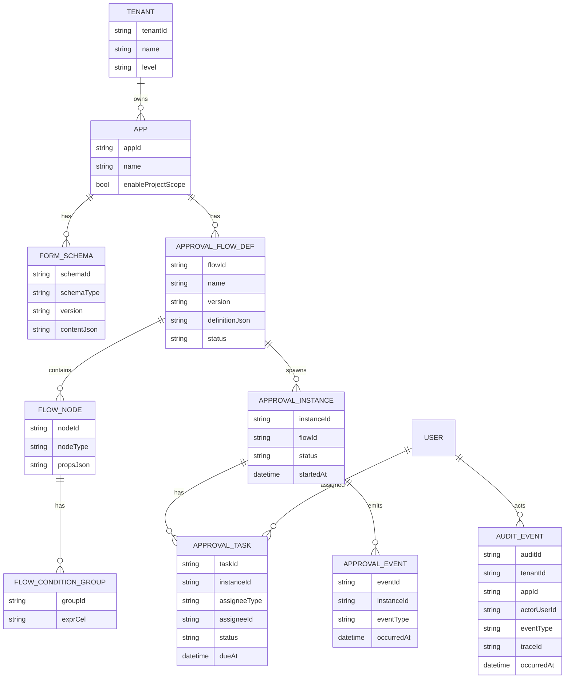
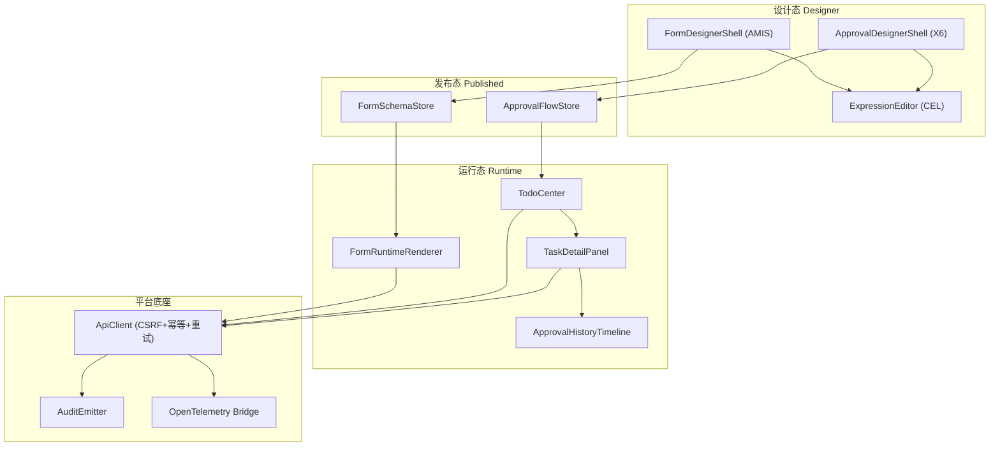
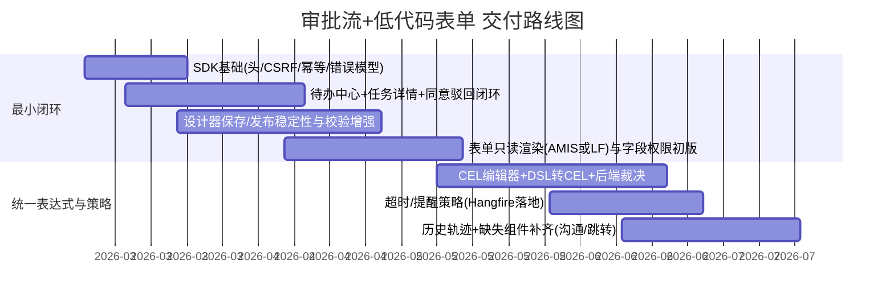

# SecurityPlatform 等保2.0 低代码平台审批流与表单组件设计报告

## 执行摘要

我目前启用的连接器仅有 **entity["company","GitHub","code hosting platform"]**（github）。本报告在仓库侧**仅审阅并引用**你指定的 **lKGreat/SecurityPlatform**（未审阅其他仓库）；在完成仓库覆盖后，才补充检索并引用高质量公开资料（优先中文/官方/原始文档），包括等保2.0标准题录信息、entity["organization","OWASP","application security nonprofit"]、entity["company","Google","cel project sponsor"] CEL 规范、AMIS、AntV X6、Workflow Core、Hangfire、OpenTelemetry 等。citeturn0search1turn6search1turn1search1turn3search0turn0search5turn2search0turn4search3turn5search0

**我必须优先学习并明确的 3–6 个信息需求（硬前置）**：

1. **目标等保等级与测评边界**：目标等级（未指定）与测评对象范围（平台底座/承载应用/数据资产）决定控制点强度与证据链粒度；建议至少按 GB/T 22239-2019 的要求建模，并以三级强度做平台默认基线，避免后期返工。citeturn0search1  
2. **表单 Schema 统一策略**：仓库同时存在 AMIS 配置化表单/页面与审批域内的 LF(vform3) 表单设计器；我需要决定“以 AMIS 为主统一 Schema”还是“双栈长期并行并建立映射层”，否则表达式/权限/校验/数据持久化会长期双实现。citeturn6search1turn6search3  
3. **表达式语言与沙箱边界**：表单联动/校验/计算 与 审批条件/路由/超时策略需要统一表达式语言；我建议采用 CEL（线性时间、非图灵完备、易做沙箱/成本控制）并规定 AST/长度/执行耗时上限。citeturn5search0turn5search5  
4. **审批/工作流/定时任务的职责切分**：审批引擎（人审任务）与 Workflow Core（长事务编排）以及 Hangfire（后台作业/超时触发）如何分层，会决定 API、事件契约与幂等/重试的实现方式。citeturn3search0turn0search5turn6search0  
5. **容量与性能目标**：并发（未指定）、峰值 QPS（未指定）、单流程最大节点数（未指定）、单表单字段数（未指定）决定前端编辑器与运行态要做的虚拟渲染/布局缓存/分页策略。建议先定义默认区间并纳入验收。  
6. **租户/应用/项目上下文权威来源**：仓库已实现多租户与项目作用域中间件与强校验；我需要明确 header/claim 的权威顺序与跨租户隔离证明方式（工程化测试+审计证明点），以便把权限/审计“下沉为平台能力”。citeturn0search1  

**仓库关键发现（证据定位 + 影响）**：

- 我们已具备“审批流设计器（X6）+ 节点属性配置 + 条件编辑 + 树/图转换 + 校验”较完整雏形：`src/frontend/Atlas.WebApp/src/pages/ApprovalDesignerPage.vue`、`src/frontend/Atlas.WebApp/src/components/approval/x6/X6ApprovalDesigner.vue`、`src/frontend/Atlas.WebApp/src/components/approval/ApprovalPropertiesPanel.vue`、`src/frontend/Atlas.WebApp/src/components/approval/ConditionGroupEditor.vue`、`src/frontend/Atlas.WebApp/src/utils/approval-tree-converter.ts`、`src/frontend/Atlas.WebApp/src/utils/approval-tree-validator.ts`。这使得“组件化拆分与小步交付”具备现实基础，并可对照 X6 的注册/序列化/Teleport 性能建议落地优化。citeturn1search1turn1search2  
- 低代码表单存在“双体系”：AMIS 设计通路（`src/frontend/.../pages/lowcode/FormDesignerPage.vue`）与审批域 LF(vform3) 设计器（`src/frontend/.../components/approval/LfFormDesigner.vue`）。如果不统一表达式/权限/校验/数据层抽象，将长期产生双实现与一致性风险。citeturn6search1turn6search3  
- 后端生产级安全底座已内建幂等/CSRF/XSS/可观测/后台任务/工作流等关键能力：`src/backend/Atlas.WebApi/Filters/IdempotencyFilter.cs`、`src/backend/Atlas.WebApi/Middlewares/AntiforgeryValidationMiddleware.cs`、`src/backend/Atlas.WebApi/Middlewares/XssProtectionMiddleware.cs`、`src/backend/Atlas.WebApi/Program.cs`。这些能力与 OWASP Top 10（访问控制、加密、注入、日志与监控等）高度耦合，是等保平台“可投产”的关键基础。citeturn4search3turn2search0turn0search5  
- 运行态存在缺口：`src/frontend/.../pages/ApprovalTaskDetailPage.vue` 引用的 `CommunicationPanel.vue`、`JumpNodeSelector.vue` 在仓库检索中**未找到（未能直接读取）**，建议作为 P0/P1 小 case 补齐（或修正引用路径）。  
- 未指定关键参数：目标等级/并发/预算均为**未指定**。我建议默认采用：目标等级按三级强度设计；API 峰值 200–1000 RPS（按租户分摊）；流程节点 200（软上限）/500（硬上限）；字段 300（软）/1000（硬）；并把这些阈值纳入压测与验收（可配置）。  

## 仓库证据定位与逻辑模型

**说明**：本节我只引用 lKGreat/SecurityPlatform 内可定位的文件路径与类/方法/配置点；由于仓库可能为非公开内容，我无法用公开网页直接引用源码片段作为外部“可点击证据”，因此以“路径+类/方法名”为主。外部链接仅用于框架/标准的公开资料佐证（等保、AMIS、X6、Workflow Core、Hangfire、OpenTelemetry、OWASP、CEL）。

**关键证据定位表（仓库侧）**

| 发现 | 证据定位（仓库） | 对审批流/表单组件化的直接含义 |
|---|---|---|
| 审批流设计器页（步骤化：基础信息/表单/流程） | `src/frontend/Atlas.WebApp/src/pages/ApprovalDesignerPage.vue` | 我们可以把“设计器壳 + 子模块（表单/画布/属性）”拆成可复用组件与独立小 case。 |
| X6 画布与节点交互（复制粘贴/右键/缩放/导入导出） | `src/frontend/Atlas.WebApp/src/components/approval/x6/X6ApprovalDesigner.vue` | 可按 X6 官方建议做节点注册与序列化（Graph.registerNode），并用 Teleport 优化大量 Vue 节点挂载。citeturn1search1turn1search2 |
| 节点属性面板（审批/条件/并行/路由/通知等） | `src/frontend/.../components/approval/ApprovalPropertiesPanel.vue` | 属性面板天然适合作为“Schema 驱动的属性编辑器”，后续可插件化节点属性。 |
| OR 条件组编辑器 | `src/frontend/.../components/approval/ConditionGroupEditor.vue` | 现有 DSL 可平滑升级到 CEL：输出统一表达式文本，后端再裁决。citeturn5search0 |
| 树/图/定义 JSON 转换 | `src/frontend/.../utils/approval-tree-converter.ts` | 建议将转换抽象为“序列化协议层”，确保版本兼容（migrate）。 |
| 设计器校验器 | `src/frontend/.../utils/approval-tree-validator.ts` | 规则校验可前置（设计时）并与后端校验一致（发布时二次校验）。 |
| 低代码 AMIS 表单设计页 | `src/frontend/Atlas.WebApp/src/pages/lowcode/FormDesignerPage.vue` | AMIS 已能承载“配置即页面”，应优先作为平台统一表单/页面语言。citeturn6search1turn6search3 |
| 审批域 LF(vform3) 表单设计器 | `src/frontend/.../components/approval/LfFormDesigner.vue` | 需制定“统一 Schema 策略”：短期保留 LF，长期向 AMIS/统一表达式靠拢。 |
| 任务详情页引用缺失组件 | `src/frontend/.../pages/ApprovalTaskDetailPage.vue`（引用 `CommunicationPanel.vue`、`JumpNodeSelector.vue` 未找到） | 运行态闭环需补齐：沟通面板、跳转节点选择器或修正路径。 |
| 幂等过滤器（写接口去重） | `src/backend/Atlas.WebApi/Filters/IdempotencyFilter.cs` | 前端 SDK 必须内建 Idempotency-Key 生成/复用策略；否则会频繁 409。 |
| CSRF 中间件 | `src/backend/Atlas.WebApi/Middlewares/AntiforgeryValidationMiddleware.cs` | 所有写操作组件（保存/发布/决策）必须自动携带 X-CSRF-TOKEN。 |
| XSS 净化中间件 | `src/backend/Atlas.WebApi/Middlewares/XssProtectionMiddleware.cs` | 表单富文本/输入控件需配合后端净化：前端“提示与预防”，后端“最终裁决”。 |
| 可观测/作业/工作流注册 | `src/backend/Atlas.WebApi/Program.cs` | 我们可把审批超时/提醒交给 Hangfire；跨服务编排交给 Workflow Core；链路与指标走 OTel。citeturn0search5turn3search0turn2search0 |

**必要 ER 图（建议的领域数据模型）**

## 统一表达式语言能力设计

我建议我们在 SecurityPlatform 低代码体系中采用 **CEL（Common Expression Language）**作为统一表达式语言，用于：

- 表单：字段可见性/禁用/必填/计算字段/跨字段校验  
- 审批：条件分支/路由选择/节点进入条件/超时策略参数/通知模板变量  
- 权限：字段级权限、按钮权限、可见范围规则（ABAC 风格）

**采用 CEL 的理由（可落地 + 可控）**：

- CEL 的设计哲学强调“小而快”，并明确“线性时间评估、无副作用、非图灵完备”，比“沙箱化 JavaScript”更可控；同时支持宿主注入变量与函数，适合平台内嵌。citeturn5search0turn5search5  
- CEL 适用于安全策略与跨语言互操作（可在前端做预校验、后端做最终裁决），减少“前端通过、后端不通过”的一致性问题。citeturn5search0  

**表单与审批组件统一表达式挂载点（最小集）**：

- `visibleWhen: <cel_bool>`  
- `disabledWhen: <cel_bool>`  
- `requiredWhen: <cel_bool>`  
- `valueExpr: <cel_any>`（计算字段/默认值）  
- `validateExpr: <cel_bool>` + `validateMessage`  

**语法示例（CEL）**

- 条件分支：`form.amount > 5000 && user.roles.exists(r, r == "FinanceManager")` citeturn5search0  
- 字段可见：`form.purchaseType == "IT" && form.deviceCount >= 5`  
- 计算字段：`round(form.unitPrice * form.qty, 2)`  
- 时间窗口：`request.time - resource.age < duration("24h")`（CEL 常见示例风格）citeturn5search5  

**内置函数建议（最小集，可扩展）**

- 字符串：`contains/startsWith/endsWith/lowerAscii/upperAscii`  
- 数学：`abs/min/max/ceil/floor` + 扩展 `round(n, scale)`  
- 列表：`size/exists/all/map/filter`（建议默认禁用宏或限制宏展开深度，避免成本失控）citeturn5search0  
- 时间：`timestamp()`、`duration("48h")`（与服务端时间对齐）citeturn5search5  
- 正则：`matches(str, pattern)`（建议限制模式复杂度/超时）  

**变量作用域（全局/上下文变量）**

我建议我们固定以下变量命名并在编辑器里做类型提示与自动补全：

- `tenant`：`{ id, name, level? }`  
- `user`：`{ id, username, displayName, roles[], permissions[] }`  
- `app`：`{ id, name, enableProjectScope }`  
- `project`：`{ id, name }`（若启用项目域）  
- `form`：表单数据对象  
- `record`：列表当前行对象  
- `workflow`：`{ definitionId, version, nodeId, instanceId }`  
- `task`：`{ id, status, assigneeId, createdAt, dueAt? }`  
- `now`：服务器时间戳（建议后端下发，避免时钟漂移）

**执行时机（设计时/预览时/运行时）与一致性策略**

- 设计时：语法/类型/字段引用校验（前端）  
- 预览时：用示例数据运行（前端，仅用于提示）  
- 运行时：所有影响“权限/审批路径/提交结果”的表达式 **必须由后端重新评估**（Fail Closed），前端评估只做 UX 反馈。  

**沙箱策略、性能限制与错误处理（建议默认值，可配置）**

- 长度：≤ 4KB；AST 节点数 ≤ 1024；宏展开深度 ≤ 8（或默认禁用宏）citeturn5search0  
- 单次评估：前端 ≤ 5ms；后端 ≤ 10ms；超时按错误处理  
- 错误处理：  
  - 权限/审批条件异常：Fail Closed + 写入审计（关联 traceId）  
  - UI 显示异常：Fail Soft（回退默认值）+ 记录控制台与遥测指标  

**与 AMIS 事件动作的对齐方式**

AMIS 支持通过 `onEvent` 绑定“渲染器事件 → 动作”，自定义组件也可通过 `props.dispatchEvent` 触发事件，继而在 `onEvent` 中配置动作（HTTP、toast、刷新、显隐等）。我们可以把“表达式 + 动作编排”作为 AMIS 的优势保留；而“审批条件/权限裁决”必须走后端 CEL。citeturn6search3turn5search1turn6search1  

## 组件级设计清单

本节我把“审批流与低代码表单”拆成**可复用前端组件**，并为每个组件给出你要求的字段：功能、输入/输出事件、表达式/变量支持、权限与审计点、最小可配置属性、可组合性、性能/安全注意。  
为控制篇幅，我采用“短语化描述 + 统一约定”，但每个字段都覆盖。

我先给出一个在线示意图（用于快速对齐审美与组件边界；仅做参考，不代表仓库现状 UI）。

image_group{"layout":"carousel","aspect_ratio":"16:9","query":["AntV X6 flowchart editor vue example","Baidu AMIS editor screenshot","Hangfire dashboard screenshot","OpenTelemetry trace UI Jaeger screenshot"],"num_per_query":1}

**组件关系图（概览）**

### 可复用组件表（不少于 50 个）

> 统一约定：  
> - 默认支持变量：`tenant/user/app/project/form/record/workflow/task/now`（若组件需要）  
> - 默认支持表达式挂载点：`visibleWhen/disabledWhen/requiredWhen/valueExpr/validateExpr`（若组件需要）  
> - 权限码示例：`form:*`、`approval:*`、`audit:*`（以仓库实际权限体系对齐映射）  
> - 审计事件示例：`FORM_SCHEMA_SAVE`、`FLOW_PUBLISH`、`TASK_DECISION`（见后文审计格式）

#### 表单与低代码页面组件（30 个）

| 组件 | 功能描述 | 输入事件 | 输出事件 | 表达式/变量 | 权限与审计点 | 最小可配置属性 | 可组合性 | 性能/安全注意 |
|---|---|---|---|---|---|---|---|---|
| FormDesignerShellAmis | AMIS 表单设计主壳（仓库：FormDesignerPage.vue） | ui:click/change | biz:save/publish/schemaChange | CEL（校验）、tenant/app | 权限 form:design；审计 FORM_SCHEMA_SAVE/PUBLISH | formId, mode, device | 组合 Editor/Toolbar/Settings | Schema 大：增量 diff；导入需校验 |
| AmisEditorWrapper | 包装 AMIS Editor（可视化编辑） | ui:drag/select | biz:schemaChange | 可注入表达式字段 | 审计 CUSTOM_RENDERER_REGISTER | schema, height | 与属性面板组合 | 禁止任意脚本注入；白名单 renderer/action citeturn6search3 |
| AmisSchemaRenderer | 运行态渲染 AMIS Schema | life:ready | biz:action/submit | AMIS onEvent + env | 权限 page:view；审计 PAGE_VIEW | schema, initialData | 与布局/菜单组合 | fetcher 必须走 SDK（CSRF/幂等） |
| SchemaImportExportModal | JSON 导入导出 | ui:paste/click | biz:import/export | validateExpr | 审计 SCHEMA_IMPORT | allowTypes, maxSize | 通用工具弹窗 | 限制大小；防粘贴 DoS |
| FormSettingsDrawer | 元数据配置（名称/分类/绑定） | ui:change | biz:updateSettings | CEL 校验命名 | 审计 FORM_META_UPDATE | name, category, dataKey | 与 DesignerShell | 约束 key；避免注入 |
| FormToolbar | 保存/发布/预览工具栏 | ui:click | biz:save/publish/preview | visibleWhen | 审计（可选） | status, version | 与表单/页面共用 | 双击/重试需幂等键 |
| DevicePreviewSwitcher | PC/移动预览切换 | ui:toggle | biz:modeChange | n/a | n/a | deviceMode | 与 Renderer | 响应式断点一致 |
| MonacoJsonEditor | JSON/Schema 编辑器 | ui:input | biz:jsonChange/validate | validateExpr | 审计 JSON_EDIT（可选） | value, readonly | 与导入导出 | 仅文本渲染，防 XSS |
| FieldPalette | 字段/控件面板（可拖拽） | ui:dragStart | biz:addField | n/a | 审计 FIELD_ADD | categories, search | 与 Editor | 大列表虚拟滚动 |
| FieldPropertyPanel | 字段属性面板 | ui:change | biz:updateField | requiredWhen/validateExpr | 审计 FIELD_UPDATE | name,label,type,rules | 与字段组件 | 正则/脚本类配置白名单 |
| ValidationRuleBuilder | 校验规则构建器（跨字段） | ui:change | biz:rulesChange | CEL validateExpr | 审计 RULE_UPDATE | rules[], severity | 与属性面板 | 限时执行；错误消息脱敏 |
| FieldPermissionMatrix | 字段级 R/W/H 权限矩阵 | ui:select | biz:permChange | visibleWhen | 审计 FIELD_PERM_CHANGE | fields[], default | 与审批节点复用 | 后端强校验，前端仅 UX |
| ButtonPermissionEditor | 按钮权限（提交/撤回等） | ui:toggle | biz:buttonPermChange | visibleWhen | 审计 BUTTON_PERM_CHANGE | buttons[] | 与审批节点复用 | 禁止“隐藏仍可调用” |
| LayoutGrid | 网格布局容器 | ui:resize | biz:layoutChange | visibleWhen | 审计（可选） | cols,gap | 组合字段组件 | 大表单减少重排 |
| SectionPanel | 分组/折叠区块 | ui:toggle | biz:sectionToggle | visibleWhen | n/a | title,collapsed | 组合 LayoutGrid | 折叠降低渲染成本 |
| FormFieldText | 文本输入 | ui:input | biz:valueChange | valueExpr/validateExpr + form | 审计（敏感字段可选） | name,maxLen | 组合 Layout | XSS 由后端兜底 |
| FormFieldNumber | 数字/金额输入 | ui:input | biz:valueChange | valueExpr/validateExpr | n/a | min,max,precision | 同上 | 统一精度，避免浮点误差 |
| FormFieldSelectRemote | 远程下拉/搜索选择 | ui:search/select | biz:valueChange | visibleWhen + form | 审计 DATA_LOOKUP | api,labelField | 组合条件编辑器 | 防抖+分页；鉴权 |
| FormFieldUserPicker | 用户选择器 | ui:open/select | biz:valueChange | visibleWhen | 审计 ORG_READ | multi,filter | 与审批人选择复用 | 大组织懒加载 |
| FormFieldDeptPicker | 部门选择器 | ui:select | biz:valueChange | visibleWhen | 审计 ORG_READ | rootId,multi | 与可见范围复用 | 权限过滤部门树 |
| FormFieldRolePicker | 角色选择器 | ui:select | biz:valueChange | visibleWhen | 审计 ROLE_READ | roleFilter | 与审批人类型复用 | 按租户隔离 |
| FormFieldDateTime | 日期时间 | ui:pick | biz:valueChange | valueExpr(now) | n/a | format,tz | 与超时编辑器复用 | 以服务器时区为准 |
| FormFieldSwitch | 布尔开关 | ui:toggle | biz:valueChange | requiredWhen | n/a | trueLabel,falseLabel | 与条件编辑复用 | 类型严格 bool |
| FormFieldRichText | 富文本 | ui:input | biz:valueChange | n/a | 审计（可选） | sanitizeMode | 与附件/评论复用 | 高危：必须后端净化+审计 citeturn4search3 |
| FormFieldFileUpload | 附件上传 | ui:upload | biz:fileUploaded | visibleWhen | 审计 FILE_UPLOAD | maxSize,types,api | 与审批附件复用 | 鉴权/病毒扫描/断点续传 |
| FormFieldSubTable | 子表格明细 | ui:addRow/editRow | biz:rowsChange | validateExpr + record | 审计 DATA_UPDATE | columns,rowSchema | 与表格编辑器 | 虚拟滚动；并发冲突 |
| RecordListTable | 列表页（动态表 CRUD） | ui:sort/page/filter | biz:queryChange | visibleWhen | 审计 DATA_QUERY/EXPORT | columns,queryModel | 与筛选器/导出 | 索引/分页；敏感列脱敏 |
| RecordDetailDrawer | 详情/编辑抽屉 | ui:save | biz:save | validateExpr | 审计 DATA_UPDATE | recordId,mode | 与表单渲染 | 写操作必幂等+CSRF |
| FilterBar | 统一筛选条（字段联动） | ui:change | biz:filterChange | valueExpr | 审计（可选） | fields[] | 与列表/待办复用 | 防抖；避免频繁请求 |
| ExportJobPanel | 导出任务面板（异步） | ui:click | biz:startExport | n/a | 审计 EXPORT_START | format,scope | 与 Hangfire job 状态联动 | 大导出限流/队列 |
| FormRuntimeBridge | AMIS env/fetcher 适配层 | life:ready | biz:request | 注入 tenant/user/app | 审计 API_CALL | baseUrl,headers | 供所有 AMIS 页面复用 | 统一错误与 traceId |

#### 审批流设计器与运行态组件（25 个）

| 组件 | 功能描述 | 输入事件 | 输出事件 | 表达式/变量 | 权限与审计点 | 最小可配置属性 | 可组合性 | 性能/安全注意 |
|---|---|---|---|---|---|---|---|---|
| ApprovalDesignerShell | 设计器总装（仓库：ApprovalDesignerPage.vue） | ui:stepChange/click | biz:saveDraft/publish/validate | CEL 校验 | 权限 approval:flow:*；审计 FLOW_SAVE/PUBLISH | flowId,mode | 组合表单+画布+属性 | 发布写操作必幂等+CSRF |
| X6Canvas | X6 主画布（X6ApprovalDesigner.vue） | ui:drag/contextmenu | biz:selectNode/addNode | n/a | 审计 NODE_ADD/DEL | flowTree,selectedId | 与节点面板组合 | 大量节点 Teleport 优化 citeturn1search1 |
| NodeShapeRegistry | 节点注册（Graph.registerNode） | life:mounted | biz:registered | n/a | n/a | nodeTypes[] | X6 基础设施 | 注册一次；序列化兼容 citeturn1search2 |
| CanvasSerializer | graph.toJSON/fromJSON 适配 | biz:export | biz:json | n/a | 审计 FLOW_EXPORT | format | 与版本对比组合 | React/Vue shape 需注册避免导出失败 citeturn1search1 |
| LayoutEngine | 自动布局/排布（参考仓库 layout.ts） | biz:treeChange | biz:layoutDone | n/a | n/a | constants | 与画布组合 | O(n)~O(n log n)；缓存 |
| NodePalette | 节点面板（审批/抄送/条件/并行/路由等） | ui:click | biz:addNodeIntent | visibleWhen | 审计 NODE_TEMPLATE_SELECT | nodeTypes | 与画布快捷添加 | 禁止未实现节点类型 |
| NodePropertiesPanel | 节点属性面板（ApprovalPropertiesPanel.vue） | ui:change | biz:updateNode | CEL（条件/路由） | 审计 NODE_CONFIG_UPDATE | nodeId,formFields | 组合条件/选人 | 保存前强校验 |
| ConditionGroupEditor | OR 条件组（ConditionGroupEditor.vue） | ui:add/remove | biz:groupsChange | 输出 CEL 文本 | 审计 BRANCH_EXPR_UPDATE | formFields | 与分支节点复用 | 字段类型驱动运算符 |
| ConditionExprEditor | 条件表达式编辑（CEL） | ui:type | biz:exprChange/validate | tenant/user/form | 审计 EXPR_UPDATE | expectedType=bool | 供条件/权限复用 | AST/长度/耗时上限 citeturn5search0 |
| ApproverPicker | 审批人选择器（用户/角色/部门） | ui:select | biz:approverChange | visibleWhen | 审计 ASSIGNEE_CONFIG | mode,filters | 复用组织选择器 | 大数据分页/搜索 |
| CCRecipientPicker | 抄送人选择器 | ui:select | biz:ccChange | visibleWhen | 审计 CC_CONFIG | mode | 与 ApproverPicker | 同上 |
| RouteTargetSelector | 路由目标节点选择 | ui:selectNode | biz:routeChange | CEL（可选） | 审计 ROUTE_CONFIG | allowedTargets | 与画布联动 | 防环路/非法目标 |
| JumpRuleEditor | 跳转规则编辑器 | ui:change | biz:jumpRuleChange | CEL | 审计 JUMP_RULE_UPDATE | allowedNodes | 与 JumpNodeSelector | 高危：后端强校验 |
| SubProcessSelector | 子流程选择 | ui:search/select | biz:subflowChange | n/a | 审计 SUBFLOW_BIND | definitionId | 与 WorkflowCore definitions | 隔离租户/应用引用 citeturn3search0 |
| TimeoutStrategyEditor | 超时/提醒策略配置 | ui:toggle/change | biz:timeoutChange | duration() | 审计 TIMEOUT_CONFIG | dueHours,action | 与 Hangfire 作业联动 | 超时触发由后台执行 citeturn0search5turn6search0 |
| NotificationStrategyEditor | 通知渠道/模板配置 | ui:select | biz:noticeChange | 模板变量 user/task | 审计 NOTICE_CONFIG | channels,template | 与 onEvent 动作对齐 | 渠道枚举与后端一致 |
| PublishDialog | 发布确认/影响范围 | ui:confirm | biz:publish | visibleWhen | 审计 FLOW_PUBLISH | scope,remark | 与版本管理组合 | 发布幂等键 |
| FlowVersionTimeline | 版本时间线/回滚入口 | ui:select | biz:diff/rollback | n/a | 审计 FLOW_VERSION_VIEW | versions | 与 diff 组件 | diff 需 JSON patch |
| DefinitionDiffViewer | definitionJson 对比 | ui:toggle | biz:exportDiff | n/a | 审计 FLOW_DIFF_EXPORT | left,right | 与版本时间线 | 大 JSON 分块渲染 |
| TodoCenter | 待办中心（我的待办/已办/抄送/发起） | ui:query/open | biz:openTask | 可选 CEL filters | 审计 TASK_LIST_VIEW | tabs,filters | 与 FilterBar | 列表索引/分页/缓存 |
| TaskDetailPanel | 任务详情（表单+操作） | ui:click | biz:approve/reject/transfer | CEL（按钮可见/必填意见） | 审计 TASK_DECISION | taskId,mode | 组合表单渲染 | 写操作幂等+CSRF |
| DecisionModal | 同意/驳回弹窗 | ui:submit | biz:decisionSubmit | validateExpr（意见） | 审计 TASK_DECISION | requireComment | 与 TaskDetailPanel | 防重复提交 |
| ApprovalHistoryTimeline | 历史轨迹时间线 | ui:expand | biz:viewHistory | n/a | 审计 HISTORY_VIEW | instanceId | 与打印/导出 | 虚拟列表 |
| AuditTraceViewer | traceId 一键联查 | ui:click | biz:openTrace | n/a | 审计 TRACE_VIEW | traceId | 与 OTel/日志平台联动 | 避免敏感信息泄露 citeturn2search0 |
| CommunicationPanel | 沟通记录（仓库引用未找到：未能直接读取） | ui:send | biz:messageSent | 模板变量 user/task | 审计 TASK_MESSAGE | taskId | 与 TaskDetailPanel | 内容 XSS 处理；脱敏 |
| JumpNodeSelector | 节点跳转选择器（仓库引用未找到：未能直接读取） | ui:select | biz:jump | visibleWhen | 审计 TASK_JUMP | allowedNodes | 与 JumpRuleEditor | 高危操作：后端强校验 |

## 可交付小 case 与交付路径

本节我把工作拆成**可在 1–5 个冲刺内完成**的小 case（≥30 个），每个都有目的、前置条件、实现要点、验收标准与估算人日，并按优先级排序。  
假设：1 个冲刺=2 周=10 个工作日；团队规模未指定，我以“2 前端 + 1 后端 + 1 测试（兼）”的最小配置估算。

### 小 case 清单（≥30）

| 优先级 | 小 case | 目的 | 前置条件 | 实现要点 | 验收标准 | 估算人日 | 冲刺 |
|---|---|---|---|---|---|---:|---:|
| P0 | ApiClient 统一注入租户/应用/项目头 | 所有组件调用一致 | 已有登录态 | header 策略+traceId 透传 | 任一 API 调用头一致且可追踪 | 4 | 1 |
| P0 | CSRF Token 自动获取/刷新 | 通过后端校验 | 后端已启用 CSRF | 获取 token + 写请求自动附带 | 所有写接口不再因 CSRF 失败 | 4 | 1 |
| P0 | 幂等键策略（意图级） | 防双击/重试重复写 | 后端幂等过滤存在 | click 生成 UUID；重试复用 | 双击发布/同意仅成功一次 | 3 | 1 |
| P0 | 统一错误模型与 traceId 展示 | 可定位生产问题 | 后端响应含 traceId | DomainError + toast + traceId | 任何失败可复制 traceId | 3 | 1 |
| P0 | 待办中心 MVP | 跑通运行态入口 | 任务列表 API | tabs+分页+筛选 | 可查看“我的待办”并进入详情 | 8 | 1 |
| P0 | 任务详情：只读表单渲染 | 让任务可读 | 能获取表单数据 | 先支持 AMIS 或 LF 只读渲染 | 详情页字段可读、可搜索定位 | 8 | 1 |
| P0 | 任务决策：同意/驳回 | 最小闭环 | 决策 API 可用 | DecisionModal + 幂等/CSRF | 决策后状态变化、列表刷新 | 6 | 1 |
| P0 | 设计器：保存草稿联调 | 设计态稳定 | flow 保存 API | 错误处理、validator 前置 | 保存成功并可重新加载 | 6 | 1 |
| P0 | 设计器：发布联调 | 可交付流程 | 发布 API | 发布确认、冲突提示 | 发布后版本+状态正确 | 6 | 1 |
| P0 | validator 错误定位到节点 | 提升可用性 | validator 已有 | 画布高亮+属性面板定位 | 发布前错误可准确导航 | 5 | 1 |
| P0 | 条件组字段类型驱动运算符 | 条件配置正确 | 可提取字段元数据 | number/date/enum 运算符映射 | 不再出现类型不匹配配置 | 6 | 1 |
| P0 | 通知配置最小闭环 | 审批提醒可用 | 后端通知接口 | channel+template+预览 | 通知配置可保存并触发 | 6 | 1 |
| P1 | CEL 表达式编辑器 MVP | 统一规则输入 | 选定 CEL 运行库 | 语法高亮、变量树、校验 | 能写 bool 表达式并校验 | 10 | 1–2 |
| P1 | DSL→CEL 转换器 | 兼容现有条件 UI | 条件组已实现 | field/op/value 产出 CEL 文本 | 输出表达式可后端裁决 | 6 | 1 |
| P1 | 后端 CEL 裁决落地 | 防绕过一致性 | 后端可集成 CEL | 发布/运行时二次评估 | 篡改请求无法绕过条件/权限 | 12 | 2 |
| P1 | 超时/提醒策略→后台作业 | SLA 能执行 | 已集成 Hangfire | 配置→注册 job→触发 | 模拟超时可触发提醒/动作 | 12 | 2 |
| P1 | 历史轨迹 Timeline | 可追溯 | history API | 时间线 UI + 节点状态 | 可导出/查看全链路历史 | 6 | 1 |
| P1 | CommunicationPanel 补齐 | 补齐运行态缺口 | 需要接口/模型 | 消息模型+XSS 防护 | 可留言、可审计、可检索 | 12 | 2 |
| P1 | JumpNodeSelector 补齐 | 高级运维能力 | 需要 jump API | allowedNodes 计算+确认 | 管理员跳转成功且审计留痕 | 10 | 2 |
| P1 | FlowVersionTimeline | 支持回滚准备 | 后端版本 API | 版本列表、对比、回滚入口 | 版本可视、回滚可执行 | 10 | 2 |
| P1 | 版本 diff（definitionJson） | 变更可解释 | 有两版 JSON | JSON patch diff viewer | diff 可定位到节点/字段 | 8 | 1 |
| P1 | AMIS 自定义组件注册框架 | 扩展性 | AMIS 运行态 | registerRenderer + onEvent 接入 | 新组件可在 schema 使用 citeturn6search3turn6search1 | 10 | 2 |
| P2 | 大流程性能优化 | 支撑节点上限 | X6 稳定 | useTeleport、布局缓存 | 200 节点拖拽无明显卡顿 citeturn1search1 | 12 | 2 |
| P2 | 无障碍与键盘操作 | 合规与体验 | 组件基础完成 | aria、tab 顺序、快捷键 | 键盘可完成关键操作 | 8 | 2 |
| P2 | 移动端审批轻量适配 | 移动可用 | 只读渲染完成 | 待办/详情/决策优先 | 手机可完成审批闭环 | 10 | 2 |
| P2 | 安全回归用例集（Top10） | 生产准入 | 测试框架 | XSS/CSRF/越权/SSRF 用例 | Top10 关键用例通过 citeturn4search3turn4search6 | 10 | 2 |
| P2 | OTel 指标面板（前后端） | 可观测落地 | OTel 已启用 | span/metric 命名规范 | 可看任务积压/超时趋势 citeturn2search0turn2search5 | 12 | 2 |
| P2 | 等保证据导出包 | 测评交付 | 合规映射 | 审计+配置快照+报告模板 | 一键导出证据包（最小版）citeturn0search1 | 15 | 3 |
| P2 | 压测与容量基线 | 明确“未指定”变可验收 | 环境 | 场景压测+阈值 | 达到默认区间或给出容量表 | 12 | 2 |

### 交付路线图（3–6 个月最小集）

## 前端实现建议与权衡

本节我聚焦“可落地”：尽量复用仓库既有技术栈（Vue3/TS/AMIS/X6），并明确替代方案与取舍。

**推荐主栈（与仓库保持一致）**

- Vue 3 + TypeScript（仓库现状）  
- UI：Ant Design Vue（仓库现状）  
- 低代码渲染：AMIS（JSON 配置生成页面；生态与编辑器成熟）citeturn6search1  
- 流程设计器：AntV X6（节点注册、序列化、Teleport 性能优化路径清晰）citeturn1search1turn1search2  
- 可观测：OpenTelemetry（建议统一 trace/span/metric 命名，OTLP exporter 对接 Collector）citeturn2search0turn2search5  
- 后台作业：Hangfire（client/storage/server 组件化；持久化存储保证重启后作业不丢）citeturn6search0turn0search0  
- 工作流编排：Workflow Core（多种持久化 provider；Redis provider 支持分布式锁/队列，适合集群处理）citeturn3search0turn3search2  
- 安全基线：OWASP Top10/ASVS 做安全需求与验收清单来源（访问控制、日志监控、组件漏洞等）citeturn4search3turn4search6  

**状态管理建议**

- 建议采用 Pinia（或既有 store 体系），把状态按域分层：  
  - `useApprovalDesignerStore`：flowTree、selectedNode、dirty、validationErrors  
  - `useTodoStore`：tabs、query、list、cache  
  - `useFormSchemaStore`：schemaDraft、publishedVersion  
  - `useSecurityContextStore`：tenant/app/project/user、csrfToken、idempotencyIntents  

**拖拽与可视化编辑器建议**

- 流程：继续用 X6，并按官方方式注册 Vue 组件节点以保证导出/导入（Graph.registerNode / Graph.registerVueComponent），节点多时用 `useTeleport` 提升挂载性能。citeturn1search1turn1search2  
- 表单：优先推动 AMIS Editor 通路；对于审批域 LF 表单，建议短期保留、长期做“字段抽取→权限/条件/表达式统一→逐步迁移到 AMIS 子集”。

**组件注册/热加载/插件机制（前端）**

- AMIS：基于其“自定义组件 + onEvent 动作”机制，把扩展点规范成：  
  - `registerRenderers(renderers[])`  
  - `registerActions(actions[])`  
  - `registerEventBridges(bridges[])`  
  自定义组件通过 `props.dispatchEvent` 发事件，页面用 `onEvent` 配置动作，实现“组件内只发信号、动作由 schema 配置”。citeturn6search3turn5search1  
- X6：节点插件协议建议固定为：`nodeType -> shape -> propertySchema -> validator -> serializer -> runtimeResolver`，并允许按应用/租户启用禁用（与等保“最小开放面”一致）。

**测试策略（前端 + 联调）**

- 单元：converter/validator/CEL 解析与类型检查（高收益）  
- 组件：PropertiesPanel、ConditionEditor、DecisionModal  
- E2E：  
  - 设计器：建流程→校验→发布  
  - 运行态：待办→详情→同意/驳回→历史轨迹  
- 安全回归：至少覆盖 Top10 的“访问控制、注入、日志监控失败”等关键路径（结合仓库已启用的 CSRF/XSS/幂等做回归）。citeturn4search3turn4search6  

**无障碍与移动适配**

- 设计器桌面优先；移动端优先保证“待办/详情/决策”轻量闭环  
- 所有关键操作提供键盘路径（tab 顺序、快捷键提示），同时为节点与表单字段提供可读 label（满足审计/取证可读性）  

**替代方案与权衡（我给出可选项，但不建议一开始上“大方案”）**

- 表达式：  
  - 推荐 CEL：线性时间、非图灵完备、易做沙箱与成本上限。citeturn5search0turn5search5  
  - 替代：直接 JS 表达式（上手快，但安全与一致性成本高，需要复杂沙箱）  
- 流程：  
  - 继续 X6：仓库已有较完整实现；官方文档覆盖注册/序列化/性能优化。citeturn1search1turn1search2  
  - 替代：bpmn.js（需要重做大量 UI 与数据模型映射；不建议在当前仓库基础上短期替换）  
- 后端编排：  
  - Workflow Core：多持久化 provider，Redis provider 支持分布式锁/队列，适合集群。citeturn3search0turn3search2  
  - 仅 Hangfire：适合任务调度与延迟执行，但流程编排表达力较弱，长期会把逻辑堆在作业里。citeturn0search5  

**等保/生产“默认必须满足”的落地提醒**

- 我们所有“发布/权限/规则/审批决策”操作必须：  
  1) CSRF 保护；2) 幂等；3) 审计；4) traceId 可追踪；5) 与 Top10/ASVS 的“访问控制、日志监控、组件风险”等条款形成证据链。citeturn4search3turn4search6turn0search1  
- 可观测性必须以 OTLP exporter + Collector 为生产推荐路径，并把“任务积压、超时数、审批耗时 P95、失败率”固化成指标面板与告警门槛。citeturn2search0turn2search5  

（报告完）