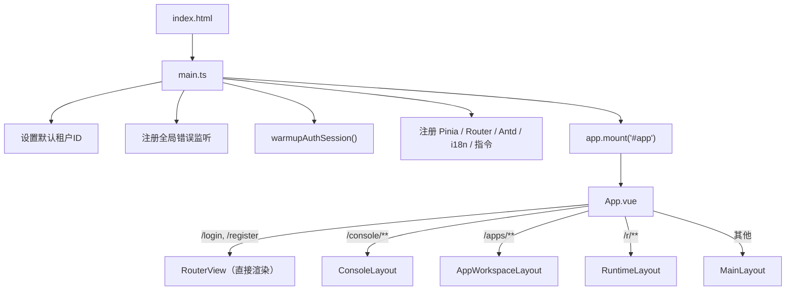
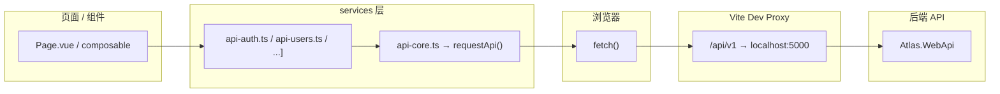
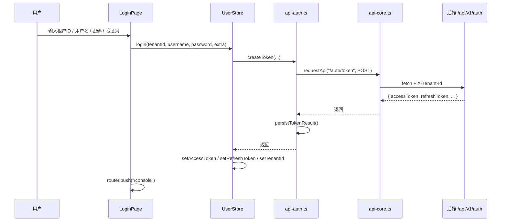

# Atlas Security Platform — 前端项目架构地图

> **分析范围**：`src/frontend/Atlas.WebApp/`
> **分析时间**：2026-03-14
> **说明**：每项结论标注 ✅ 明确确认 或 🔍 推测

---

## 1. 技术栈

| 类别 | 技术 / 版本 | 确认度 | 对应文件 |
|---|---|---|---|
| 框架 | Vue 3.5.x (Composition API + `<script setup>`) | ✅ | [package.json](file:///e:/codeding/SecurityPlatform/src/frontend/Atlas.WebApp/package.json) |
| 构建工具 | Vite 7.x | ✅ | [package.json](file:///e:/codeding/SecurityPlatform/src/frontend/Atlas.WebApp/package.json) |
| 语言 | TypeScript 5.9 (strict mode) | ✅ | [tsconfig.json](file:///e:/codeding/SecurityPlatform/src/frontend/Atlas.WebApp/tsconfig.json) |
| UI 组件库 | Ant Design Vue 4.2.x（全量注册） | ✅ | [main.ts](file:///e:/codeding/SecurityPlatform/src/frontend/Atlas.WebApp/src/main.ts) L4, L57 |
| 状态管理 | Pinia 3.x | ✅ | [main.ts](file:///e:/codeding/SecurityPlatform/src/frontend/Atlas.WebApp/src/main.ts) L13, L55 |
| 路由 | Vue Router 4.x (HTML5 History) | ✅ | [router/index.ts](file:///e:/codeding/SecurityPlatform/src/frontend/Atlas.WebApp/src/router/index.ts) L1, L58 |
| 国际化 | vue-i18n 9.x（zh-CN / en-US） | ✅ | [i18n.ts](file:///e:/codeding/SecurityPlatform/src/frontend/Atlas.WebApp/src/i18n.ts) |
| 低代码引擎 | amis 6.x（百度 AMIS，含 React 18 运行时） | ✅ | [package.json](file:///e:/codeding/SecurityPlatform/src/frontend/Atlas.WebApp/package.json) L57, L62-64 |
| 表单设计器 | vform3-builds 3.x | ✅ | [package.json](file:///e:/codeding/SecurityPlatform/src/frontend/Atlas.WebApp/package.json) L66 |
| 流程图/DAG | @antv/x6 2.x + @vue-flow/core 1.x | ✅ | [package.json](file:///e:/codeding/SecurityPlatform/src/frontend/Atlas.WebApp/package.json) L44-56 |
| 进度条 | NProgress | ✅ | [router/index.ts](file:///e:/codeding/SecurityPlatform/src/frontend/Atlas.WebApp/src/router/index.ts) L6 |
| 全屏 | screenfull 6.x | ✅ | [package.json](file:///e:/codeding/SecurityPlatform/src/frontend/Atlas.WebApp/package.json) L65 |
| 新手引导 | driver.js 1.x | ✅ | [package.json](file:///e:/codeding/SecurityPlatform/src/frontend/Atlas.WebApp/package.json) L59 |
| E2E 测试 | Playwright | ✅ | [playwright.config.ts](file:///e:/codeding/SecurityPlatform/src/frontend/Atlas.WebApp/playwright.config.ts) |
| 单元测试 | Vitest 4.x | ✅ | [package.json](file:///e:/codeding/SecurityPlatform/src/frontend/Atlas.WebApp/package.json) L15-17, L39 |
| Lint / Format | ESLint 9 + Prettier | ✅ | [eslint.config.js](file:///e:/codeding/SecurityPlatform/src/frontend/Atlas.WebApp/eslint.config.js) |
| 容器化 | Docker (node:22 构建 → nginx:1.27 部署) | ✅ | [Dockerfile](file:///e:/codeding/SecurityPlatform/src/frontend/Atlas.WebApp/Dockerfile) |

> [!NOTE]
> 项目同时引入了 **React 18** 和 **Vue 3** 双运行时。React 仅作为 amis 的依赖，由 Vite `manualChunks` 合并到 `vendor-amis` chunk 中，不在业务代码中直接使用。

---

## 2. 目录结构与职责

```
src/frontend/Atlas.WebApp/
├── index.html                 # SPA 入口 HTML
├── vite.config.ts             # Vite 配置（别名、代理、chunk 拆分）
├── tsconfig.json              # TypeScript 编译配置
├── package.json               # 依赖与脚本
├── eslint.config.js           # ESLint flat config
├── .prettierrc                # Prettier 配置
├── .env.example               # 环境变量模板
├── Dockerfile                 # 生产镜像构建
├── nginx/default.conf         # 生产 Nginx SPA fallback
├── playwright.config.ts       # E2E 配置
├── e2e/                       # Playwright E2E 测试
│   ├── fixtures/
│   └── specs/
├── public/                    # 静态资源（直接复制到 dist）
└── src/
    ├── main.ts                # ★ 应用启动入口
    ├── App.vue                # ★ 根组件（多 Layout 分发）
    ├── env.d.ts               # Vite/Vue 类型声明
    ├── i18n.ts                # i18n 实例创建
    │
    ├── router/                # 路由定义 + 导航守卫
    │   └── index.ts           #   静态路由 + 动态路由注册 + 权限拦截
    │
    ├── stores/                # Pinia 状态管理
    │   ├── user.ts            #   用户信息 / 登录 / 登出
    │   ├── permission.ts      #   动态路由 / 菜单 / 权限加载
    │   └── tagsView.ts        #   多标签页视图
    │
    ├── services/              # ★ API 服务层（按领域拆分）
    │   ├── api-core.ts        #   核心请求封装（requestApi / 令牌刷新 / CSRF / 幂等）
    │   ├── api.ts             #   统一 re-export 入口
    │   ├── api-auth.ts        #   认证（登录 / 注册 / 刷新 / 验证码）
    │   ├── api-users.ts       #   用户 / 部门 / 角色 / 权限 / 菜单 / 职位
    │   ├── api-approval.ts    #   审批流 / 实例 / 任务
    │   ├── api-system.ts      #   应用配置 / 项目 / 数据源 / 表格视图
    │   ├── api-workflow.ts    #   WorkflowCore 引擎 v1
    │   ├── api-workflow-v2.ts #   工作流引擎 v2
    │   ├── api-visualization.ts#  可视化流程监控
    │   ├── api-ai-*.ts (×10)  #   AI 相关（Agent / 知识库 / 插件 / 工作流等）
    │   ├── api-plugin.ts      #   插件管理
    │   ├── api-webhook.ts     #   Webhook
    │   ├── api-license.ts     #   授权管理
    │   ├── api-pat.ts         #   Personal Access Token
    │   ├── dict.ts            #   字典服务
    │   ├── dynamic-tables.ts  #   动态表格
    │   ├── lowcode.ts         #   低代码引擎服务
    │   ├── notification.ts    #   通知
    │   ├── sessions.ts        #   会话管理
    │   ├── login-log.ts       #   登录日志
    │   ├── system-config.ts   #   系统配置
    │   └── templates.ts       #   模板
    │
    ├── types/                 # TypeScript 类型定义
    │   ├── api.ts             #   ★ 手写核心 DTO（~1100 行）
    │   ├── api-generated.ts   #   ★ NSwag 自动生成类型（~903KB）
    │   ├── approval-*.ts      #   审批流专用类型
    │   ├── workflow*.ts       #   工作流类型
    │   ├── lowcode.ts         #   低代码类型
    │   ├── plugin.ts          #   插件类型
    │   ├── injection-keys.ts  #   Vue provide/inject 键
    │   ├── amis.d.ts          #   amis 类型声明
    │   └── vform3-builds.d.ts #   vform3 类型声明
    │
    ├── utils/                 # 工具函数
    │   ├── auth.ts            #   ★ Token / 租户 / 反伪造令牌存储
    │   ├── dynamic-router.ts  #   ★ 后端菜单 → Vue 路由转换
    │   ├── clientContext.ts   #   客户端上下文 Headers
    │   ├── app-context.ts     #   当前应用 ID 管理
    │   ├── common.ts          #   通用工具
    │   ├── validate.ts        #   表单校验
    │   └── approval-tree-*.ts #   审批树结构转换 / 校验
    │
    ├── composables/           # Vue 组合式函数
    │   ├── useCrudPage.ts     #   ★ 通用 CRUD 页面逻辑
    │   ├── useTableView.ts    #   表格视图管理
    │   ├── useApprovalTree.ts #   审批流树编辑
    │   ├── useWorkflowGraph.ts#   工作流画布
    │   ├── useStreamChat.ts   #   AI 流式对话
    │   ├── useExcelExport.ts  #   Excel 导出
    │   ├── useDrawerForm.ts   #   抽屉表单
    │   └── ... (共 19 个)
    │
    ├── pages/                 # ★ 页面组件（按功能域分目录）
    │   ├── LoginPage.vue      #   登录页
    │   ├── RegisterPage.vue   #   注册页
    │   ├── HomePage.vue       #   首页
    │   ├── ProfilePage.vue    #   个人中心
    │   ├── console/           #   平台控制台（2 页面）
    │   ├── apps/              #   应用工作台（3 页面）
    │   ├── system/            #   系统管理（16 页面）
    │   ├── ai/                #   AI 模块（26 页面）
    │   ├── lowcode/           #   低代码（11 页面）
    │   ├── workflow/          #   工作流（2 页面）
    │   ├── monitor/           #   监控（3 页面）
    │   ├── visualization/     #   可视化（5 页面）
    │   ├── dynamic/           #   动态表格（2 页面）
    │   ├── runtime/           #   运行时渲染（1 页面）
    │   ├── settings/          #   设置（1 页面）
    │   ├── admin/             #   管理员（1 页面）
    │   └── Approval*.vue (×17)#   审批流相关
    │
    ├── layouts/               # 布局组件（4 种）
    │   ├── MainLayout.vue     #   主布局（侧栏 + 顶栏 + 内容）
    │   ├── ConsoleLayout.vue  #   控制台布局
    │   ├── AppWorkspaceLayout.vue # 应用工作台布局
    │   └── RuntimeLayout.vue  #   运行态布局
    │
    ├── components/            # 共享组件
    │   ├── ai/                #   AI 相关组件
    │   ├── amis/              #   amis 渲染器封装
    │   ├── approval/          #   审批流组件
    │   ├── common/            #   通用组件
    │   ├── crud/              #   CRUD 组件
    │   ├── designer/          #   设计器组件
    │   ├── layout/            #   布局子组件
    │   ├── table/             #   表格组件
    │   ├── workflow/          #   工作流组件
    │   └── ProjectSwitcher.vue#   项目切换器
    │
    ├── directives/            # 自定义指令
    │   └── permission.ts      #   v-hasPermi / v-hasRole
    │
    ├── plugins/               # 插件系统（前端扩展点）
    │   ├── loader.ts          #   动态加载 JS bundle
    │   └── registry.ts        #   字段渲染器 / 验证器 / 菜单注册表
    │
    ├── styles/                # 全局样式
    │   ├── index.css           #   Design Tokens（CSS 变量）
    │   ├── amis-overrides.css  #   amis 样式覆盖
    │   └── approval-x6.css    #   审批流 X6 画布样式
    │
    ├── amis/                  # amis 运行时环境
    │   └── amis-env.ts        #   AmisEnv fetcher / notify / alert / confirm
    │
    ├── compat/                # 兼容性垫片
    │   └── popper/            #   @popperjs/core 别名重写
    │
    ├── i18n/                  # i18n 子模块
    │   ├── index.ts
    │   ├── en-US.ts
    │   └── zh-CN.ts
    │
    ├── locales/               # 翻译资源
    │   ├── zh.ts
    │   └── en.ts
    │
    └── constants/             # 常量定义
        ├── approval.ts
        └── workflow.ts
```

---

## 3. 启动入口

| 步骤 | 文件 | 说明 | 确认度 |
|---|---|---|---|
| 1 | [index.html](file:///e:/codeding/SecurityPlatform/src/frontend/Atlas.WebApp/index.html) | `<div id="app">` + `<script src="/src/main.ts">` | ✅ |
| 2 | [main.ts](file:///e:/codeding/SecurityPlatform/src/frontend/Atlas.WebApp/src/main.ts) | 启动入口，顺序执行以下初始化 | ✅ |
| 2a | main.ts L19-22 | 读取 `VITE_DEFAULT_TENANT_ID` → 写入 `localStorage.tenant_id` | ✅ |
| 2b | main.ts L24-48 | 注册全局 `error` 和 `unhandledrejection` 监听 → 上报后端 `/audit/client-errors` | ✅ |
| 2c | main.ts L53 | **`await warmupAuthSession()`** — 尝试用 refresh_token 静默恢复 access_token | ✅ |
| 2d | main.ts L55-60 | 按顺序注册 Pinia → Router → Antd → i18n → 自定义指令 | ✅ |
| 2e | main.ts L62 | `app.mount("#app")` | ✅ |
| 3 | [App.vue](file:///e:/codeding/SecurityPlatform/src/frontend/Atlas.WebApp/src/App.vue) | 根据路由路径分发到 4 种 Layout | ✅ |



---

## 4. Web / API 请求主链路

### 4.1 请求核心架构



### 4.2 `requestApi()` 内部链路 ✅

> 源文件：[api-core.ts](file:///e:/codeding/SecurityPlatform/src/frontend/Atlas.WebApp/src/services/api-core.ts)

| 步骤 | 行为 | 对应行 |
|---|---|---|
| 1 | 构造 Headers：`Authorization: Bearer {token}` | L117-119 |
| 2 | 注入 `X-Tenant-Id`（localStorage） | L121-123 |
| 3 | 注入 `X-App-Id` + `X-App-Workspace`（URL 或 localStorage） | L125-131 |
| 4 | 校验租户上下文，缺失则拦截并重定向登录 | L133-150 |
| 5 | 注入客户端上下文 Headers（`X-Client-Type/Platform/Channel/Agent`） | L152-157 |
| 6 | 注入 `X-Project-Id`（如启用项目作用域） | L159-161 |
| 7 | **写请求增强**：自动生成 `Idempotency-Key` + 获取/注入 `X-CSRF-TOKEN` | L172-182 |
| 8 | **写请求去重**：相同签名的并发写请求复用 Promise | L184-192 |
| 9 | 发起 `fetch()`，携带 `credentials: "include"` | L194-201 |
| 10 | 401 → 自动 refresh token 并重试 | L204-209 |
| 11 | 403 + CSRF 无效 → 清除缓存 token 并重试 | L217-220 |
| 12 | 403 + 账户锁定/密码过期 → 强制登出 | L229-232 |
| 13 | 全局错误去重显示（2.5s 窗口） | L687-728 |

### 4.3 API 基础路径 ✅

- 环境变量：`VITE_API_BASE`，默认 `/api/v1`
- Vite 开发代理：`/api/v1` → `http://localhost:5000`（[vite.config.ts](file:///e:/codeding/SecurityPlatform/src/frontend/Atlas.WebApp/vite.config.ts) L46-52）
- 生产部署：Nginx SPA fallback（[nginx/default.conf](file:///e:/codeding/SecurityPlatform/src/frontend/Atlas.WebApp/nginx/default.conf)），API 代理需在生产 Nginx 中额外配置 🔍

### 4.4 服务层按领域拆分 ✅

| 服务文件 | 领域 | 大小提示 |
|---|---|---|
| [api-auth.ts](file:///e:/codeding/SecurityPlatform/src/frontend/Atlas.WebApp/src/services/api-auth.ts) | 认证 / 注册 / 令牌 / 验证码 / 文件上传 | 7.5KB |
| [api-users.ts](file:///e:/codeding/SecurityPlatform/src/frontend/Atlas.WebApp/src/services/api-users.ts) | 用户 / 部门 / 角色 / 权限 / 菜单 / 职位 / 告警 | 14KB |
| [api-approval.ts](file:///e:/codeding/SecurityPlatform/src/frontend/Atlas.WebApp/src/services/api-approval.ts) | 审批流（最大的单个服务文件） | 24.7KB |
| [api-system.ts](file:///e:/codeding/SecurityPlatform/src/frontend/Atlas.WebApp/src/services/api-system.ts) | 应用 / 项目 / 数据源 / 表格视图 | 11.5KB |
| [lowcode.ts](file:///e:/codeding/SecurityPlatform/src/frontend/Atlas.WebApp/src/services/lowcode.ts) | 低代码引擎 | 19KB |
| [api-ai-*.ts](file:///e:/codeding/SecurityPlatform/src/frontend/Atlas.WebApp/src/services/) (×10) | AI 全家桶 | ~45KB 合计 |

---

## 5. 定时任务 / 异步任务链路

> [!IMPORTANT]
> 前端**不存在**定时轮询、WebSocket、SSE 等长连接机制（至少在代码层面未发现）。所有定时任务由后端 Hangfire 驱动。

| 场景 | 实现方式 | 确认度 |
|---|---|---|
| 定时任务管理 | [ScheduledJobsPage.vue](file:///e:/codeding/SecurityPlatform/src/frontend/Atlas.WebApp/src/pages/monitor/ScheduledJobsPage.vue) — 纯 CRUD 管理界面 | ✅ |
| AI 流式对话 | [useStreamChat.ts](file:///e:/codeding/SecurityPlatform/src/frontend/Atlas.WebApp/src/composables/useStreamChat.ts) — 可能使用 SSE 或流式 fetch | 🔍 |
| 消息队列监控 | [MessageQueuePage.vue](file:///e:/codeding/SecurityPlatform/src/frontend/Atlas.WebApp/src/pages/monitor/MessageQueuePage.vue) — 管理界面 | ✅ |
| Token 自动刷新 | [api-core.ts](file:///e:/codeding/SecurityPlatform/src/frontend/Atlas.WebApp/src/services/api-core.ts) L204-209 — 被动触发（401 时） | ✅ |
| 会话预热 | [api-core.ts](file:///e:/codeding/SecurityPlatform/src/frontend/Atlas.WebApp/src/services/api-core.ts) L581-595 `warmupAuthSession()` — 仅启动时一次 | ✅ |
| 前端错误上报 | [main.ts](file:///e:/codeding/SecurityPlatform/src/frontend/Atlas.WebApp/src/main.ts) L24-48 — 事件驱动，非定时 | ✅ |

---

## 6. 数据库访问层组织方式

> [!NOTE]
> 前端**没有直接的数据库访问层**。所有数据访问通过 REST API 调用后端完成。

| 机制 | 说明 | 确认度 |
|---|---|---|
| 纯 REST | 前端通过 `requestApi()` 调用后端 `/api/v1/*` 接口 | ✅ |
| 没有 GraphQL | 未发现 GraphQL 客户端或相关依赖 | ✅ |
| 没有本地数据库 | 未使用 IndexedDB/Dexie/LocalForage 等客户端数据库 | ✅ |
| 客户端持久化 | 仅使用 `localStorage` / `sessionStorage` 存储 token、租户 ID、profile 等少量数据 | ✅ |
| 类型来源 | 手写：[types/api.ts](file:///e:/codeding/SecurityPlatform/src/frontend/Atlas.WebApp/src/types/api.ts)（~1100行 DTO）; 自动生成：[types/api-generated.ts](file:///e:/codeding/SecurityPlatform/src/frontend/Atlas.WebApp/src/types/api-generated.ts)（NSwag 生成，~903KB） | ✅ |
| 类型生成命令 | `npm run generate-types` → 调用后端 NSwag | ✅ |

---

## 7. 配置与环境变量组织方式

### 7.1 环境变量 ✅

| 变量名 | 用途 | 来源 |
|---|---|---|
| `VITE_API_BASE` | API 前缀，默认 `/api/v1` | [.env.example](file:///e:/codeding/SecurityPlatform/src/frontend/Atlas.WebApp/.env.example) L4 |
| `VITE_DEFAULT_TENANT_ID` | 默认租户 ID（开发便利） | [.env.example](file:///e:/codeding/SecurityPlatform/src/frontend/Atlas.WebApp/.env.example) L8 |

> 实际使用的 `.env.local` 不在版本控制中。环境变量通过 Vite 的 `import.meta.env` 访问。

### 7.2 构建配置 ✅

| 文件 | 职责 |
|---|---|
| [vite.config.ts](file:///e:/codeding/SecurityPlatform/src/frontend/Atlas.WebApp/vite.config.ts) | 路径别名 `@` → `src/`、Popper 兼容别名、开发代理、chunk 拆分（11 个 vendor chunk） |
| [tsconfig.json](file:///e:/codeding/SecurityPlatform/src/frontend/Atlas.WebApp/tsconfig.json) | ES2022 target、bundler 模块解析、strict 模式 |
| [eslint.config.js](file:///e:/codeding/SecurityPlatform/src/frontend/Atlas.WebApp/eslint.config.js) | ESLint flat config + vue-eslint-parser + prettier |
| [.prettierrc](file:///e:/codeding/SecurityPlatform/src/frontend/Atlas.WebApp/.prettierrc) | Prettier 格式化规则 |

### 7.3 客户端运行时配置 ✅

| 存储位置 | 内容 | 文件 |
|---|---|---|
| `localStorage` | `tenant_id`, `refresh_token`, `project_id`, `project_scope_enabled`, `atlas.currentAppId`, `atlas-locale` | [utils/auth.ts](file:///e:/codeding/SecurityPlatform/src/frontend/Atlas.WebApp/src/utils/auth.ts) |
| `sessionStorage` | `access_token`, `auth_profile`, `antiforgery_token` | [utils/auth.ts](file:///e:/codeding/SecurityPlatform/src/frontend/Atlas.WebApp/src/utils/auth.ts) |

> 安全敏感的 `access_token` 优先存 `sessionStorage`（标签页级别），`refresh_token` 存 `localStorage`（跨标签页可用）。

---

## 8. 权限认证机制

### 8.1 认证流程 ✅



### 8.2 令牌管理 ✅

| 机制 | 说明 | 文件 |
|---|---|---|
| Access Token | Bearer 模式，`sessionStorage` 存储 | [utils/auth.ts](file:///e:/codeding/SecurityPlatform/src/frontend/Atlas.WebApp/src/utils/auth.ts) L11-16 |
| Refresh Token | `localStorage` 存储，401 时自动刷新 | [api-core.ts](file:///e:/codeding/SecurityPlatform/src/frontend/Atlas.WebApp/src/services/api-core.ts) L204-209, L546-574 |
| httpOnly Cookie | `credentials: "include"` 启用，与 Bearer 并行（向后兼容） | [api-core.ts](file:///e:/codeding/SecurityPlatform/src/frontend/Atlas.WebApp/src/services/api-core.ts) L197 |
| Anti-Forgery | 写请求自动获取 `/secure/antiforgery` token → `X-CSRF-TOKEN` | [api-core.ts](file:///e:/codeding/SecurityPlatform/src/frontend/Atlas.WebApp/src/services/api-core.ts) L516-544 |
| Idempotency Key | 写请求自动生成 `Idempotency-Key`（UUID） | [api-core.ts](file:///e:/codeding/SecurityPlatform/src/frontend/Atlas.WebApp/src/services/api-core.ts) L504-514 |
| 验证码 | 登录前调用 `/auth/captcha` 获取图片验证码 | [api-auth.ts](file:///e:/codeding/SecurityPlatform/src/frontend/Atlas.WebApp/src/services/api-auth.ts) L42-50 |
| TOTP | 登录 payload 支持 `totpCode` 字段 | [api-auth.ts](file:///e:/codeding/SecurityPlatform/src/frontend/Atlas.WebApp/src/services/api-auth.ts) L57 |

### 8.3 路由级权限控制 ✅

| 层级 | 机制 | 文件 |
|---|---|---|
| 静态路由守卫 | `router.beforeEach`：无 token → 重定向 `/login`；有 token → 拉取用户信息 + 生成动态路由 | [router/index.ts](file:///e:/codeding/SecurityPlatform/src/frontend/Atlas.WebApp/src/router/index.ts) L124-190 |
| 路由 meta | `requiresAuth` + `requiresPermission`（权限码匹配） | [router/index.ts](file:///e:/codeding/SecurityPlatform/src/frontend/Atlas.WebApp/src/router/index.ts) L170-179 |
| 动态路由 | 后端 `/auth/routers` 返回菜单树 → `buildRoutesFromRouters()` → `router.addRoute()` | [utils/dynamic-router.ts](file:///e:/codeding/SecurityPlatform/src/frontend/Atlas.WebApp/src/utils/dynamic-router.ts) |
| 超级管理员 | `admin` / `superadmin` 角色 或 `*:*:*` 权限码可绕过所有权限检查 | [router/index.ts](file:///e:/codeding/SecurityPlatform/src/frontend/Atlas.WebApp/src/router/index.ts) L172-173 |

### 8.4 元素级权限控制 ✅

| 指令 | 用法 | 文件 |
|---|---|---|
| `v-hasPermi` | `v-hasPermi="['users:create']"` — 无权限时移除 DOM 节点 | [directives/permission.ts](file:///e:/codeding/SecurityPlatform/src/frontend/Atlas.WebApp/src/directives/permission.ts) L4-16 |
| `v-hasRole` | `v-hasRole="['admin']"` — 同上 | [directives/permission.ts](file:///e:/codeding/SecurityPlatform/src/frontend/Atlas.WebApp/src/directives/permission.ts) L18-35 |

### 8.5 多租户机制 ✅

| 机制 | 说明 |
|---|---|
| 请求头 | 每个 API 请求自动携带 `X-Tenant-Id` | 
| 登录前 | 用户手动输入租户 ID（GUID 格式校验） |
| 上下文丢失 | 缺少租户 ID 时阻断请求并提示 / 跳转登录 |

---

## 9. 外部系统集成点

| 集成目标 | 集成方式 | 确认度 | 关键文件 |
|---|---|---|---|
| 后端 Atlas.WebApi | REST API (`/api/v1/*`)，唯一的外部数据源 | ✅ | [api-core.ts](file:///e:/codeding/SecurityPlatform/src/frontend/Atlas.WebApp/src/services/api-core.ts) |
| 百度 AMIS 渲染引擎 | npm 包依赖 + 自定义 AmisEnv fetcher 桥接 | ✅ | [amis/amis-env.ts](file:///e:/codeding/SecurityPlatform/src/frontend/Atlas.WebApp/src/amis/amis-env.ts) |
| 前端插件动态加载 | 动态 `<script>` 注入外部 JS bundle（URL 来自后端） | ✅ | [plugins/loader.ts](file:///e:/codeding/SecurityPlatform/src/frontend/Atlas.WebApp/src/plugins/loader.ts) |
| NSwag 类型生成 | `npm run generate-types` → 后端 nswag.json → 生成 `api-generated.ts` | ✅ | [package.json](file:///e:/codeding/SecurityPlatform/src/frontend/Atlas.WebApp/package.json) L18 |
| CDN / 第三方服务 | 未发现任何第三方 API Key、SDK 加载或外部服务调用 | ✅ |  |
| WebSocket / SSE | 未发现显式的 WebSocket 或 SSE 连接（`useStreamChat` 可能使用流式 fetch） | 🔍 | [useStreamChat.ts](file:///e:/codeding/SecurityPlatform/src/frontend/Atlas.WebApp/src/composables/useStreamChat.ts) |

---

## 10. 建议继续深挖的前 10 个关键文件/目录

| 优先级 | 文件/目录 | 深挖理由 |
|---|---|---|
| **1** | [services/api-core.ts](file:///e:/codeding/SecurityPlatform/src/frontend/Atlas.WebApp/src/services/api-core.ts) (794行) | 整个前端的网络基础设施，认证/刷新/CSRF/幂等/去重/错误处理全在此，任何改动都影响全局 |
| **2** | [router/index.ts](file:///e:/codeding/SecurityPlatform/src/frontend/Atlas.WebApp/src/router/index.ts) (197行) | 静态路由（~60 条） + 导航守卫 + 权限拦截逻辑，是理解页面准入的核心 |
| **3** | [utils/dynamic-router.ts](file:///e:/codeding/SecurityPlatform/src/frontend/Atlas.WebApp/src/utils/dynamic-router.ts) (189行) | 后端菜单到前端路由的映射桥梁，含 `pathComponentFallbackMap` 硬编码映射和 `import.meta.glob` 组件解析 |
| **4** | [types/api.ts](file:///e:/codeding/SecurityPlatform/src/frontend/Atlas.WebApp/src/types/api.ts) (~1100行) | 全部手写 DTO 定义，是前后端契约的前端侧镜像，需要与 `docs/contracts.md` 对齐验证 |
| **5** | [composables/useCrudPage.ts](file:///e:/codeding/SecurityPlatform/src/frontend/Atlas.WebApp/src/composables/useCrudPage.ts) (8.3KB) | 通用 CRUD 组合函数，被大量管理页面复用，理解其模式可快速掌握所有表格页的行为 |
| **6** | [composables/useTableView.ts](file:///e:/codeding/SecurityPlatform/src/frontend/Atlas.WebApp/src/composables/useTableView.ts) (18KB) | 表格视图（个人）功能的核心实现，涉及列配置/密度/分页/排序持久化 |
| **7** | [services/api-approval.ts](file:///e:/codeding/SecurityPlatform/src/frontend/Atlas.WebApp/src/services/api-approval.ts) (24.7KB) | 审批流 API 是最大的单个服务文件，审批模块是核心业务之一 |
| **8** | [layouts/MainLayout.vue](file:///e:/codeding/SecurityPlatform/src/frontend/Atlas.WebApp/src/layouts/MainLayout.vue) (7KB) | 主布局组件，控制侧边栏/顶栏/内容区结构，是理解整体 UI 框架的入口 |
| **9** | [services/lowcode.ts](file:///e:/codeding/SecurityPlatform/src/frontend/Atlas.WebApp/src/services/lowcode.ts) (19KB) | 低代码引擎服务层，包含表单 schema 管理、AMIS 页面 CRUD、回写等低代码核心链路 |
| **10** | [composables/useApprovalTree.ts](file:///e:/codeding/SecurityPlatform/src/frontend/Atlas.WebApp/src/composables/useApprovalTree.ts) (17KB) | 审批流可视化编辑的核心逻辑，和 `approval-tree-converter.ts` (37KB) 配合，是最复杂的前端交互模块之一 |

---

> **总结**：前端项目是一个典型的 Vue 3 SPA 中后台应用，核心特色在于：
> 1. **双渲染引擎**（Vue 3 + AMIS/React）共存于同一 SPA
> 2. **完整的安全基础设施**：JWT + CSRF + 幂等 + 写请求去重 + 多租户，全部封装在 `api-core.ts`
> 3. **动态路由体系**：后端下发菜单树 → 前端动态注册 + 路由级/元素级双重权限控制
> 4. **前端插件系统**：支持动态加载外部 JS bundle 并注册字段渲染器/验证器/菜单
> 5. **类型双源**：手写 DTO + NSwag 自动生成，需注意两者的同步维护
